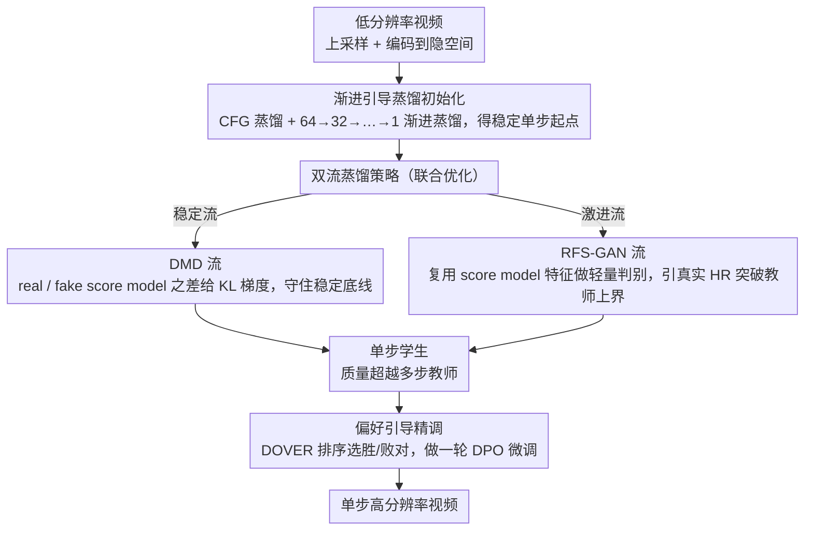

# DUO-VSR: Dual-Stream Distillation for One-Step Video Super-Resolution

**会议**: CVPR 2026  
**arXiv**: [2603.22271](https://arxiv.org/abs/2603.22271)  
**代码**: [https://cszy98.github.io/DUO-VSR/](https://cszy98.github.io/DUO-VSR/)  
**领域**: 图像生成 / 视频超分  
**关键词**: 视频超分辨率, 扩散蒸馏, 单步生成, GAN, 分布匹配蒸馏

## 一句话总结
提出 DUO-VSR 三阶段蒸馏框架，通过渐进引导蒸馏初始化 + 双流蒸馏（DMD + RFS-GAN 联合优化）+ 偏好引导精调，将多步视频超分模型压缩为单步生成器，实现约 50× 加速且超越先前单步 VSR 方法的视觉质量。

## 研究背景与动机

1. **领域现状**：基于扩散模型的视频超分辨率（VSR）在视觉质量上取得了显著进展，如 SeedVR、STAR 等方法利用大规模预训练先验实现了令人印象深刻的细节恢复。然而这些方法通常需要 15-50 步迭代去噪，推理时间长达数百秒，严重阻碍实际部署。

2. **现有痛点**：现有的单步 VSR 方法面临三重挑战：(1) DOVE 使用回归损失保证稳定性，但牺牲了细节保真度；(2) SeedVR2 使用对抗后训练，但大判别器容易主导优化引入不自然伪影；(3) 直接应用 Distribution Matching Distillation (DMD) 到 VSR 面临**训练不稳定**（学生模型单步输出分布偏离教师）、**退化监督**（冻结的 real score model 未见过学生噪声输出，产生空间偏移和伪影）、**不充分监督**（real score model 本身不如真实 HR 视频，限制了学生模型的上限）三大问题。

3. **核心矛盾**：单步 VSR 蒸馏的根本困难在于"稳定性-质量"的权衡——轨迹保持蒸馏（如渐进蒸馏）稳定但输出模糊，分布匹配蒸馏（如 DMD）质量高但训练不稳定且受限于教师上界，GAN 方法能引入真实视频监督但判别器训练不稳定。

4. **本文目标** 设计一个统一框架，同时解决 DMD 蒸馏中的初始化不稳定、退化监督和不充分监督问题，使单步 VSR 生成器达到多步模型甚至超越其质量上界。

5. **切入角度**：作者提出将 DMD 和 GAN 作为互补的双流监督信号联合优化——DMD 保证与教师分布对齐的稳定性，GAN 通过引入真实 HR 视频特征突破教师质量上界。

6. **核心 idea**：三阶段渐进式蒸馏 + DMD 与 RFS-GAN 双流联合优化 + DPO 偏好精调，实现稳定、高质量的单步视频超分。

## 方法详解

### 整体框架
DUO-VSR 想把一个要跑 50 步的扩散视频超分模型压成"只跑一步"，但又不能像以往单步方法那样掉细节或崩训练。它的做法是把蒸馏拆成三段接力：先用渐进蒸馏把多步教师稳稳地收敛成一个可用的单步初始化，再用 DMD 和 GAN 两条监督流联合把质量顶上去，最后用一轮偏好精调做感知层面的微调。前两段解决"稳"和"超过教师"，第三段做"锦上添花"。

具体到数据流，输入低分辨率视频 $x^{LR}$ 先上采样到目标分辨率，再编码到隐空间得到 $z^{LR}$；基于 DiT 架构的去噪器以 $z^{LR}$ 和文本嵌入 $c$ 为条件，一步直接预测干净的 HR 隐表示。基模型约 1.3B 参数，原始多步教师默认 50 步采样。

### 关键设计

**1. 渐进引导蒸馏初始化：先把多步教师稳稳压成单步，再谈质量**

如果一上来就拿 50 步教师去初始化单步学生，去噪路径被一刀砍到底，梯度会剧烈振荡、训练直接崩掉。所以这一步不追求质量，只求一个"不崩"的单步起点，分两小步走。第一步是 CFG 蒸馏：让学生直接匹配教师的有条件/无条件组合输出 $v_{\text{cfg}} = (1+w)v_\theta(z_t, t, z^{LR}, c) - v_\theta(z_t, t, z^{LR}, \emptyset)$，把推理时本来要做的两次前向折叠成一次。第二步是渐进蒸馏：以 CFG 蒸馏后的模型为教师，按 $64 \to 32 \to 16 \to \dots \to 1$ 逐级减半步数，每一轮让学生用一步预测去对齐教师的两步预测，教师每 500 步用最新学生刷新。逐步缩短路径而不是一步到位，正是它能平滑过渡到单步而不发散的原因。

**2. 双流蒸馏策略：DMD 守住稳定底线，RFS-GAN 引真实视频突破教师天花板**

单跑 DMD 有两个硬伤：质量被教师上界卡死，而且冻结的 real score model 没见过学生的噪声输出，会给出带空间偏移和伪影的"退化监督"。DUO-VSR 的解法是让两条流交替优化、互相补位。DMD 流里，冻结的 real score model 锚定高质量分布，持续更新的 fake score model 追踪学生当前分布，二者之差给出 KL 散度梯度来更新学生。RFS-GAN 流则复用这两个 score model 当判别器骨干——抽取它们中间若干 transformer 层的特征拼接后，送进一个额外的卷积判别器头，用 hinge GAN 目标加特征匹配损失，把学生输出（fake）和真实 HR 视频（real）拉开。引入真实 HR 视频的对抗信号，一方面压住 real score model 偏移带来的有偏梯度，另一方面直接打破"学生不可能超过教师"的天花板；同时让对抗监督同时看 real 和 fake 两侧特征，信号更均衡。工程上两条流共享扩散加噪后的学生输出 $\hat{z}_t^S$ 省一半计算，并在骨干特征到判别器头之间插了 stop-gradient，避免 GAN 的梯度反过来污染 score model 对分布的追踪。

**3. 偏好引导精调：用现成的视频质量打分器做一轮低成本 DPO 微调**

双流蒸馏后的学生已经很强，但感知质量还留有最后一点打磨空间。这一步不再训练任何额外判别器：让第二阶段学生对每个 LR 视频生成多个 HR 候选，用现成的视频质量评估模型（如 DOVER）排序，挑出胜者 $z_0^{S_w}$ 和败者 $z_0^{S_l}$ 拼成偏好对 $(z^{LR}, z_0^{S_w}, z_0^{S_l})$，再用 DPO 损失微调学生，使其预测的速度场整体偏向高质量样本。本质上是把已有的质量打分信号当隐式奖励，做一次便宜的偏好对齐。

### 损失函数 / 训练策略
**阶段一**：CFG 蒸馏用 MSE 损失 $\mathcal{L}_{CFG}$；渐进蒸馏用轨迹匹配损失 $\mathcal{L}_{PD}$。  
**阶段二**：学生更新 = $\mathcal{L}_{DMD} + 0.1 \cdot \mathcal{L}_G + 0.05 \cdot \mathcal{L}_{FM}$；辅助更新分别用 $\mathcal{L}_{Diff}$ 更新 fake score model，$\mathcal{L}_D$ 更新判别器头。每 3 次辅助更新做 1 次学生更新。  
**阶段三**：DPO 损失 $\mathcal{L}_{DPO}$，在 2000 偏好对上微调 1000 步。

## 实验关键数据

### 主实验（多数据集，无参考感知指标）

| 方法 | 步数 | 时间(s) | NIQE↓ | MUSIQ↑ | CLIP-IQA↑ | DOVER↑ |
|------|------|---------|-------|--------|-----------|--------|
| STAR | 15 | 200.4 | 5.17 | 59.08 | 0.4068 | 69.29 |
| SeedVR2-7B | 1 | 89.7 | 4.63 | 55.45 | 0.3387 | 59.56 |
| DOVE | 1 | 66.7 | 4.43 | 51.25 | 0.3209 | 69.36 |
| DLoRAL | 1 | 76.6 | 4.91 | 58.44 | 0.4346 | 73.60 |
| **DUO-VSR** | **1** | **11.3** | **4.08** | **59.24** | **0.3925** | **69.71** |

*（以 YouHQ40 数据集为例，DUO-VSR 在 UDM10 上 DOVER 达 87.28，全面领先）*

### 消融实验（AIGC60 数据集）

| 配置 | NIQE↓ | MUSIQ↑ | CLIPIQA↑ | DOVER↑ |
|------|-------|--------|----------|--------|
| Base (50步) | 4.31 | 63.46 | 0.4712 | 87.98 |
| Stage I only | 5.45 | 58.97 | 0.408 | 86.49 |
| Stage I + II | 4.64 | 63.36 | 0.487 | 88.01 |
| Stage I + III | 5.11 | 60.22 | 0.423 | 87.63 |
| **Stage I + II + III** | **4.42** | **63.68** | **0.489** | **88.15** |

### 双流蒸馏策略消融

| 设置 | NIQE↓ | MUSIQ↑ | CLIPIQA↑ | DOVER↑ |
|------|-------|--------|----------|--------|
| DMD only | 4.99 | 61.46 | 0.432 | 87.38 |
| RFS-GAN only | 5.32 | 62.64 | 0.427 | 87.53 |
| Sequential DMD→GAN | 5.17 | 62.76 | 0.419 | 87.67 |
| **Dual-Stream (Joint)** | **4.42** | **63.68** | **0.489** | **88.15** |

### 关键发现
- **阶段二（双流蒸馏）是核心**：从 Stage I 到 Stage I+II，CLIPIQA 从 0.408 提升至 0.487，DOVER 从 86.49 到 88.01，甚至超越了 50 步基线（87.98），证明引入真实视频对抗监督能突破教师上界。
- **联合优化显著优于顺序优化**：Joint 相比 Sequential DMD→GAN，CLIPIQA 提升 0.070，DOVER 提升 0.48。两个目标在训练中动态交互、互相增强。
- **效率惊人**：DUO-VSR 仅 1.3B 参数，单步 11.3s 处理 21 帧 1920×1080 视频，比 SeedVR2-7B（89.7s）快约 8×，比多步方法 MGLD（956.7s）快约 85×。
- **RFS-GAN 的互补作用**：RFS-GAN 单独使用纹理增强不如 DMD（植物区域），但能有效抑制 DMD 的退化监督导致的伪影和时序不一致（瓷砖区域、时域剖面）。

## 亮点与洞察
- **双流联合优化**的设计极为巧妙——DMD 保证分布对齐的稳定底线，GAN 引入真实世界的高质量信号突破天花板，两者通过共享扩散后样本实现高效协同。stop-gradient 的精心设置保证了两个目标互不干扰。这种"稳定流 + 激进流"的联合范式可以迁移到其他蒸馏任务。
- **诊断 DMD 在 VSR 中的三大问题**（不稳定、退化监督、不充分监督）的分析非常扎实——图 2 中 real score model 的空间偏移和伪影可视化直观地展示了为什么 VSR 场景比无条件生成更容易受退化监督影响（因为 LR 输入提供了强空间锚点）。
- **DPO 偏好精调**作为第三阶段的"锦上添花"，不需要额外判别器，仅需生成候选 + 质量排序即可完成，是一种低成本的质量提升手段。

## 局限与展望
- 训练流程较复杂（三阶段、多个 score model），总训练成本可能较高，且超参数（如损失权重比例、更新频率比）需要仔细调节。
- 当前在合成退化（RealBasicVSR pipeline）上训练和评估较多，对真实世界复杂退化的泛化能力虽有验证但仍有限。
- 1.3B 参数虽然比 SeedVR2-7B 小很多，但对边缘设备部署仍然过大。可以考虑结合模型压缩进一步缩小。
- 偏好精调阶段的质量排序依赖特定的视频质量评估模型，不同评估标准可能导致不同的优化方向。

## 相关工作与启发
- **vs DOVE**: DOVE 使用回归损失 + 两阶段训练，单步输出偏模糊；DUO-VSR 通过双流蒸馏 + DPO 同时保证保真度和感知质量。
- **vs SeedVR2**: SeedVR2 用大判别器做对抗后训练（APT），容易不稳定；DUO-VSR 的 RFS-GAN 利用已有 score model 特征做轻量判别，stop-gradient 保证稳定性。
- **vs DMD2**: DMD2 将 GAN 放在后期精调阶段且仅用 fake score model 特征；DUO-VSR 从一开始就联合优化且使用 real+fake 双 score model 特征，监督更全面。

## 评分
- 新颖性: ⭐⭐⭐⭐ DMD+GAN 双流联合的思路有创新，对 DMD 在 VSR 失效原因的分析深入
- 实验充分度: ⭐⭐⭐⭐⭐ 五个数据集（合成+真实+AIGC）、完整三阶段消融和策略消融
- 写作质量: ⭐⭐⭐⭐ 逻辑清晰，问题分析到位，图表设计直观
- 价值: ⭐⭐⭐⭐ 1步11.3秒处理1080p视频的效率很有吸引力，但训练流程复杂度是实际应用的障碍

<!-- RELATED:START -->

## 相关论文

- [\[CVPR 2026\] WaDi: Weight Direction-aware Distillation for One-step Image Synthesis](wadi_weight_direction-aware_distillation_for_one-step_image_synthesis.md)
- [\[CVPR 2026\] Uni-DAD: Unified Distillation and Adaptation of Diffusion Models for Few-step Few-shot Image Generation](uni-dad_unified_distillation_and_adaptation_of_diffusion_models_for_few-step_few.md)
- [\[NeurIPS 2025\] DOVE: Efficient One-Step Diffusion Model for Real-World Video Super-Resolution](../../NeurIPS2025/image_generation/dove_efficient_one-step_diffusion_model_for_real-world_video_super-resolution.md)
- [\[CVPR 2026\] MMFace-DiT: A Dual-Stream Diffusion Transformer for High-Fidelity Multimodal Face Generation](mmface-dit_a_dual-stream_diffusion_transformer_for_high-fidelity_multimodal_face.md)
- [\[AAAI 2026\] Realism Control One-step Diffusion for Real-World Image Super-Resolution](../../AAAI2026/image_generation/realism_control_one-step_diffusion_for_real-world_image_super-resolution.md)

<!-- RELATED:END -->
