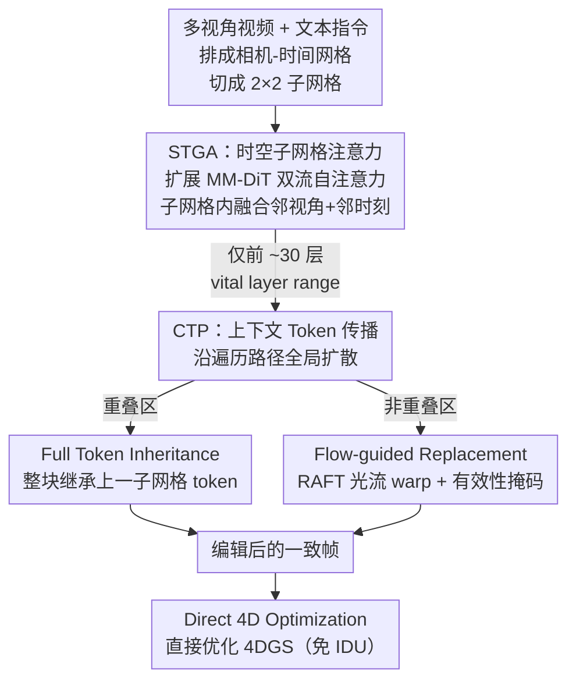

# Dynamic-eDiTor: Training-Free Text-Driven 4D Scene Editing with Multimodal Diffusion Transformer

**会议**: CVPR 2026  
**论文**: [CVF Open Access](https://openaccess.thecvf.com/content/CVPR2026/html/Lee_Dynamic-eDiTor_Training-Free_Text-Driven_4D_Scene_Editing_with_Multimodal_Diffusion_Transformer_CVPR_2026_paper.html)  
**代码**: https://di-lee.github.io/dynamic-eDiTor/ (项目页，有)  
**领域**: 扩散模型 / 4D场景编辑  
**关键词**: 4D高斯泼溅, 文本驱动编辑, MM-DiT, 时空一致性, 免训练  

## 一句话总结
把多视角视频排成「相机×时间」网格，借助 MM-DiT 的双流自注意力在局部子网格里同时融合相邻视角和相邻时刻的特征，再用 token 继承 + 光流引导的 token 替换把这种一致性传播到整张网格，从而免训练地完成文本驱动的 4D 场景编辑，编辑后的帧直接优化预训练 4DGS。

## 研究背景与动机
**领域现状**：3DGS、4DGS 已经能高保真重建静态/动态场景，文本驱动的 3D 编辑（Instruct-NeRF2NeRF、GaussianEditor、EditSplat 等）也较成熟。但「文本驱动的 4D 场景编辑」——既要改外观又要保持运动——仍是空白地带。

**现有痛点**：已有的 4D 编辑方法（Instruct 4D-to-4D、CTRL-D、Instruct-4DGS）都把 2D 扩散模型逐帧独立地作用在渲染帧上，缺少一个跨视角、跨时间联合处理信息的统一机制。结果是只能做风格化这类全局编辑，碰到非刚性内容（换衣服、加物体）就出现运动扭曲、几何漂移、编辑不完整。部分方法还要对扩散模型做逐场景微调，代价高。

**核心矛盾**：4D 编辑比 3D 编辑多了一个维度的约束——不仅要多视角一致（空间），还要时间一致（运动）。逐帧编辑天然破坏这两种一致性，因为每帧的去噪过程互相不知道彼此在做什么。

**本文目标**：在不训练、不逐场景微调的前提下，编辑出一组「跨视角 + 跨时间」都一致的帧，再用它们直接优化 4DGS，得到全局连贯的 4D 编辑结果。

**切入角度**：作者注意到新一代 MM-DiT 编辑器（如 Qwen-Image-Edit）的双流自注意力本身就有很强的跨 token 融合能力——如果把多帧的 key/value 拼进同一次注意力，就能让一帧「看到」邻居帧。于是问题从「训练一个 4D 一致的模型」转化为「在推理时复用 MM-DiT 的注意力机制做时空融合」。

**核心 idea**：把整段多视角视频组织成一个「相机—时间」网格，用扩展后的子网格注意力（STGA）做局部时空融合，再用上下文 token 传播（CTP）把局部一致性扩散到全局——全程免训练，编辑帧直接喂给 4DGS 优化。

## 方法详解

### 整体框架
Dynamic-eDiTor 的输入是一段预训练 4DGS 对应的多视角视频（按 1 FPS 采样）和一句文本指令，输出是被编辑过、且多视角/时间都一致的 4DGS 模型。整条流程分三步：先把所有帧 $f_{v,t}$ 排成一张相机—时间网格 $\text{Grid} = \{f_{v,t} \mid v\in[0,V], t\in[0,T]\}$（行是视角、列是时间），并切成相互重叠的 $2\times2$ 子网格；再用 STGA 在每个子网格内做局部时空融合，用 CTP 沿一条遍历路径把融合结果传播到整张网格；最后把编辑好的帧直接拿去优化预训练 4DGS。

整张网格的处理顺序是一个「非对称滑动」：先在 $t=0$ 沿空间轴竖直扫一遍建立多视角对齐，再沿时间轴水平滑动把一致性沿时间扩散；相邻子网格之间的重叠区就是 STGA 和 CTP 传递信息的结构纽带。

### 关键设计

**1. STGA（时空子网格注意力）：让每帧在注意力里同时看到邻视角和邻时刻**

逐帧独立编辑之所以崩，是因为每帧的注意力只在自己内部算，互相不知道彼此。STGA 把 MM-DiT 的双流自注意力从「单帧」扩展到「$2\times2$ 子网格」$S_{v,t}=\{f_{v,t}, f_{v+1,t}, f_{v,t+1}, f_{v+1,t+1}\}$——这四帧覆盖相邻视角和相邻时刻。子网格里每帧 $f_i$ 轮流当 query，但 key/value 不再只用自己，而是把四帧的特征拼起来：$K_{S_{v,t}}=[K_{f_{v,t}}, K_{f_{v+1,t}}, K_{f_{v,t+1}}, K_{f_{v+1,t+1}}]$，$V$ 同理。注意力把文本流 $(Q_{txt},K_{txt},V_{txt})$ 与改造后的时空图像流拼在一起，并对图像 query/key 加 RoPE 位置编码：

$$\text{STGA}(S_{v,t}) = \text{softmax}\!\left(\frac{[Q_{txt}, \text{RoPE}(Q_{f_{v,t}})]\cdot[K_{txt}, \text{RoPE}(K_{S_{v,t}})]^\top}{\sqrt{d_k}}\right)\cdot[V_{txt}, V_{S_{v,t}}]$$

和以往只在时间维扩展注意力的做法不同，STGA 让每个 query 同时attend空间相邻视角和时间相邻帧，所以一次融合就把两种一致性都顾上了。又因为子网格是重叠滑动的，相邻子网格之间天然形成隐式传播。这一步全程不改权重、不训练。

此外作者发现 STGA **不能**加在 MM-DiT 的所有层上：全加会让注意力在局部时空块里过度自我关注，导致纹理重复和视角依赖的不一致。他们不是去给单层排重要性，而是研究「连续层区间」的累积效果，实测发现把 STGA 只加在前约 30 层（vital layer range）能在「一致性」和「编辑保真度」之间取得最佳折中（见 Fig. 3）。

**2. CTP（上下文 Token 传播）：把局部一致性沿遍历路径扩散成全局一致**

STGA 只保证子网格内部局部一致，整张 $V\times T$ 网格的全局一致还得靠传播。CTP 在子网格沿遍历路径滑动时，显式地把上一个子网格 $S_{prev}$ 算出的、已含时空信息的 token $\phi(S_{v,t})=\text{STGA}(S_{v,t})$ 注入到当前子网格 $S_{curr}$，防止信息丢失。它分两种策略：

- **Full Token Inheritance（整块继承）**：当 $S_{curr}$ 与 $S_{prev}$ 在时间轴（$t=1\to T-1$）或空间轴（$v=1\to V-1$）有重叠帧时，直接用 $\phi(S_{prev})$ 整块替换这些重叠帧的当前 token，硬保证重叠区完全一致。
- **Flow-guided Token Replacement（光流引导替换）**：沿时间轴滑动时，子网格最右列是非重叠区（没法继承）。这里用 RAFT 估计帧 $f_t$ 与 $f_{t-1}$ 间的前/后向光流，下采样到 token 分辨率，再用前向光流把上一块的 token 反向 warp 过来：$\hat\phi_r(S_{v,t})=\text{Warp}(F_{t\to t-1}(x,y),\,\phi_r(S_{v,t-1}))$。为防止 warp 错位，再做一次前后向一致性检查得到有效性掩码 $M$，只在有效区用 warp 后的 token、无效区保留当前帧自己的：

$$\phi_r(S_{v,t}) = M\odot\hat\phi_r(S_{v,t}) + (1-M)\odot\phi_r(S_{v,t})$$

两种策略合起来，让融合后的特征既能在重叠区无损继承、又能在新出现的时间区按运动正确地搬运过去，从而把 STGA 的局部一致性可靠地铺满整张网格。

**3. Direct 4D Optimization：跳过迭代式数据集更新，编辑帧直接优化 4DGS**

以往 4D/3D 编辑（CTRL-D、Instruct 4D-to-4D）依赖 Iterative Dataset Update（IDU）——边编辑边重渲染再编辑、反复迭代，慢且容易累积漂移。本文因为前两步产出的帧本身已经多视角 + 时间一致，所以可以一步到位：用全网格所有编辑帧 $f^{edit}_{v,t}$ 直接优化 4D 高斯 $G'_{edit}$，目标沿用 4DGS 自身的重建项与总变差正则：

$$G'_{edit} = \arg\min_G \sum_{v,t} \left\|\hat f_{v,t} - f^{edit}_{v,t}\right\| + \mathcal{L}_{tv}$$

省掉 IDU 后既快又稳，得到的 4D 内容能忠实反映编辑意图，不再有逐轮迭代带来的几何/运动漂移。

## 实验关键数据

### 主实验
数据集为真实多视角视频 DyNeRF（6 个动态场景，每场景 16-21 个视角、10 秒 30FPS 视频；按 1FPS 采样到 160-210 帧），共 14 条 prompt 覆盖全部场景；编辑模型用 Qwen-Image-Edit（MM-DiT），单张 H100 上「coffee martini」场景全流程约 51 分钟。对比 SOTA 4D 编辑方法：

| 方法 | CLIPdir↑ | CLIPsim↑ | Overall Quality(%)↑ | PSNR↑ | SSIM↑ | LPIPS↓ |
|------|----------|----------|---------------------|-------|-------|--------|
| Instruct4D-to-4D | 0.1077 | 0.6308 | 27.57 | 21.86 | 0.6978 | 0.2145 |
| Instruct-4DGS | 0.1501 | 0.6342 | 10.48 | 20.62 | 0.6252 | 0.2869 |
| CTRL-D | 0.1498 | 0.6141 | 13.00 | **31.06** | **0.8498** | **0.0970** |
| **Ours** | **0.1849** | **0.6397** | **48.95** | 29.25 | 0.8064 | 0.1006 |

编辑保真度（CLIPdir/CLIPsim）和用户研究（Overall Quality 等六项偏好均近 47-57%）上本文全面领先；重建保真度 PSNR/SSIM/LPIPS 略低于 CTRL-D，但作者解释这是「语义对齐 vs 时空一致」的折中——CTRL-D 编辑弱、更接近原始帧所以重建分高，本文牺牲一点像素相似换来更强的语义编辑和时空稳定。

### 消融实验
STGA / CTP 逐组件消融（数值取自 Table 2）：

| STGA | CTP | Warp-Err(×10⁻³)↓ | MEt3R(×10⁻¹)↓ | PSNR↑ | SSIM↑ | CLIPdir↑ |
|:---:|:---:|:---:|:---:|:---:|:---:|:---:|
| - | - | 56.98 | 1.0721 | 26.14 | 0.7445 | 0.1930 |
| ✓ | - | 38.64 | 0.9277 | 28.08 | 0.7875 | 0.1872 |
| - | ✓ | 29.44 | 1.0695 | 28.74 | 0.8013 | 0.1944 |
| ✓ | ✓ | **28.94** | **0.9074** | **29.25** | **0.8064** | 0.1849 |

CTP 内部两种策略再拆（Table 3，均含 STGA）：

| CTP-Full | CTP-Flow | Warp-Err(×10⁻³)↓ | MEt3R(×10⁻¹)↓ | PSNR↑ | CLIPdir↑ |
|:---:|:---:|:---:|:---:|:---:|:---:|
| - | - | 38.64 | 0.9277 | 28.08 | 0.1872 |
| - | ✓ | 29.79 | 0.9205 | 28.97 | 0.1852 |
| ✓ | - | 33.22 | 0.9094 | 28.19 | 0.1865 |
| ✓ | ✓ | **28.94** | **0.9074** | **29.25** | 0.1849 |

### 关键发现
- **STGA 主管时间一致、CTP 主管多视角一致，互补**：单加 STGA 把 Warp-Err 从 56.98 降到 38.64（时间一致大幅改善），但 MEt3R（多视角一致）改善有限；单加 CTP 则把 MEt3R 压到 1.0695→需配合才到 0.9074。两者全开时 Warp-Err 与 MEt3R 同时最优，验证「局部融合 + 全局传播」缺一不可。
- **CTP 两策略各司其职**：CTP-Flow 主要降时间 warping 误差（38.64→29.79），CTP-Full 主要降多视角误差 MEt3R（→0.9094），合起来重建 PSNR 从 28.08 升到 29.25。
- **存在语义—一致性折中**：几乎所有消融里 CLIPdir 随一致性增强略降（0.1930→0.1849），说明强约束时空一致会稍微抑制编辑强度，但换来明显更稳的 4D 结构，作者认为这个折中值得。⚠️ 论文未给 CLIP 指标的方差/显著性，这点差异是否稳健以原文为准。

## 亮点与洞察
- **复用 MM-DiT 注意力做 4D 一致性，零训练**：核心洞察是「时空一致」本质是「让帧之间互相 attend」，而 MM-DiT 的双流注意力天生支持拼接 token——把邻视角邻时刻塞进同一次 attention 就实现了融合，不需要任何额外训练或微调，迁移成本极低。
- **vital layer range 的发现很实用**：注意力类增强常被无脑加在所有层，本文实测发现只加前 ~30 层最好、全加反而出纹理重复伪影，这个「连续层区间」结论对其它基于注意力注入的免训练编辑方法有直接借鉴价值。
- **重叠继承 + 光流替换的二分法**：把传播显式拆成「重叠区直接继承（无损）」和「新区域按运动 warp（带有效性掩码兜底）」，思路干净，可迁移到任意需要跨帧传播特征的视频编辑任务。
- **跳过 IDU 直接优化 4DGS**：一旦保证了编辑帧本身一致，就不必再走慢且漂移的迭代式数据集更新，这是把「先把帧编好」做扎实后顺理成章的简化。

## 局限与展望
- 评测只在 DyNeRF 一个多视角视频数据集、6 个场景 14 条 prompt 上做，场景多样性有限；对更复杂运动、更长视频或单目动态场景的泛化未验证。
- 重建保真度（PSNR/SSIM/LPIPS）实测略逊于 CTRL-D，说明强一致约束确实牺牲了部分像素级编辑强度，对追求极致编辑幅度的场景可能不够。
- 依赖 RAFT 光流质量：光流在大运动、遮挡、低纹理处不准时，Flow-guided 替换会引入错误，虽有有效性掩码兜底，但掩码无效区只能退回当前帧 token，传播链可能断。⚠️ 论文未量化光流失败对结果的影响。
- 单场景约 51 分钟（H100），虽免训练但仍偏重，离交互式编辑还有距离；vital layer range（前 30 层）是经验值，是否随不同 MM-DiT 主干迁移需进一步验证。

## 相关工作与启发
- **vs Instruct 4D-to-4D / CTRL-D（IDU 系）**：它们逐帧编辑 + 迭代式数据集更新优化 4D 模型，缺跨视角跨时间联合机制，易运动扭曲；本文用 STGA+CTP 先把帧编一致，再直接优化、免 IDU，更稳更完整。
- **vs Instruct-4DGS**：它先编辑规范空间高斯再用 score-distillation 做时间平滑，仍是「先 2D 编辑后修补」；本文在编辑阶段就把多视角+时间一致内建进注意力，从源头避免不一致。
- **vs 仅时间维注意力扩展（视频编辑常见做法）**：那类方法只让 query attend 时间邻居；STGA 在 $2\times2$ 子网格里同时 attend 空间邻视角和时间邻帧，天然契合 4D 的双重一致性需求。
- **启发**：「把待一致的单元拼进同一次注意力 + 沿遍历路径继承/warp 传播」是一个通用的免训练一致性配方，可迁移到多视角视频风格化、长视频编辑等需要跨帧/跨视角连贯的任务。

## 评分
- 新颖性: ⭐⭐⭐⭐ 首个免训练、基于 MM-DiT 的文本驱动 4D 编辑框架，STGA+CTP 配方清晰，vital layer range 是有价值的发现。
- 实验充分度: ⭐⭐⭐⭐ 主对比 + 用户研究 + 两级消融较完整，但仅 DyNeRF 单数据集、缺光流失败与显著性分析。
- 写作质量: ⭐⭐⭐⭐ 框架与公式交代清楚，图文对应好；个别记号（Context-Aware/Context Token）略有不统一。
- 价值: ⭐⭐⭐⭐ 免训练、可直接接预训练 4DGS，实用性强，方法配方对视频/多视角一致编辑有迁移价值。

<!-- RELATED:START -->

## 相关论文

- [\[ICML 2026\] Self-Prompting Diffusion Transformer for Open-Vocabulary Scene Text Editing via In-Context Learning](../../ICML2026/image_generation/self-prompting_diffusion_transformer_for_open-vocabulary_scene_text_editing_via_.md)
- [\[ICCV 2025\] Free4D: Tuning-free 4D Scene Generation with Spatial-Temporal Consistency](../../ICCV2025/image_generation/free4d_tuning-free_4d_scene_generation_with_spatial-temporal_consistency.md)
- [\[AAAI 2026\] Playmate2: Training-Free Multi-Character Audio-Driven Animation via Diffusion Transformer with Reward Feedback](../../AAAI2026/image_generation/playmate2_training-free_multi-character_audio-driven_animation_via_diffusion_tra.md)
- [\[CVPR 2026\] UniEdit-I: Training-free Image Editing for Unified VLM via Iterative Understanding, Editing and Verifying](uniedit-i_training-free_image_editing_for_unified_vlm_via_iterative_understandin.md)
- [\[CVPR 2026\] A Training-Free Style-Personalization via SVD-Based Feature Decomposition](a_training-free_style-personalization_via_svd-based_feature_decomposition.md)

<!-- RELATED:END -->
