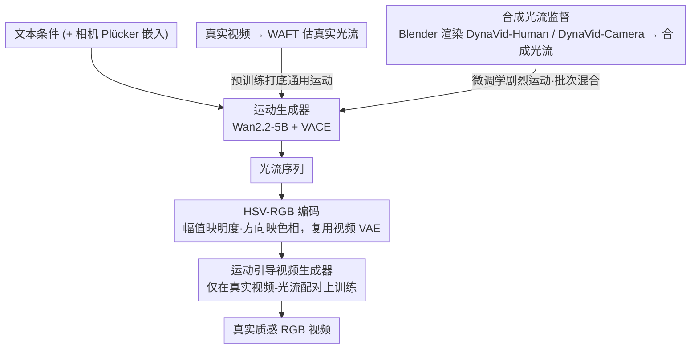

# DynaVid: Learning to Generate Highly Dynamic Videos using Synthetic Motion Data

**会议**: CVPR 2026  
**arXiv**: [2604.01666](https://arxiv.org/abs/2604.01666)  
**代码**: 无  
**领域**: 图像生成  
**关键词**: 视频扩散模型, 合成运动数据, 光流, 动态运动生成, 相机控制

## 一句话总结
DynaVid 提出利用计算机图形学渲染的合成光流（而非合成视频）来训练视频扩散模型，通过运动生成器+运动引导视频生成器的两阶段框架，实现了高度动态运动的逼真视频合成和精细相机控制。

## 研究背景与动机

1. **领域现状**：当前视频扩散模型（如 Wan2.2、CogVideoX）已能生成高质量视频，但仍严重依赖大规模训练数据中的运动类型分布。主流训练数据集中，高度动态的运动场景（如街舞、快速相机旋转）极度稀缺。

2. **现有痛点**：
    - 模型难以合成含高度动态运动的逼真视频，因为训练集中此类样本不足
    - 相机控制模型（如 CameraCtrl、AC3D）需要准确的 3D 相机位姿标注，但极端运动场景下的位姿估计极不可靠
    - 直接使用合成渲染视频训练会引入严重的外观域差距——模型会复现合成数据的人工纹理和光照

3. **核心矛盾**：合成数据能提供丰富的动态运动和精确的控制信号，但其非真实的外观特征又会 pollute 生成模型的视觉质量。如何"取其精华（运动信息），去其糟粕（人工外观）"是关键难题。

4. **本文目标**
    - 如何让模型学到高度动态的运动模式但不牺牲视觉真实感？
    - 如何在极端相机运动下实现精确的相机轨迹控制？

5. **切入角度**：光流天然只编码运动信息、与外观解耦，因此用渲染的光流替代渲染视频可以消除外观域差距。

6. **核心 idea**：用合成光流（而非合成视频）训练运动生成器学动态运动模式，再用真实视频训练运动引导视频生成器保真实外观，两阶段解耦实现"运动来自合成、外观来自真实"。

## 方法详解

### 整体框架
DynaVid 想解决的核心问题是：高度动态的运动（街舞、快速相机旋转）在真实训练数据里几乎找不到，但直接拿计算机图形学渲染的合成视频来补，又会把合成画面那股"假"的纹理和光照一并学进去。它的破局点是把"运动"和"外观"拆开走两条数据路径。整条流水线分两阶段：先由**运动生成器**读入文本条件，吐出一段用光流表示的运动序列；再由**运动引导视频生成器**以这段光流为条件，把它"渲染"成真实质感的 RGB 视频帧。两个生成器都基于 Wan2.2-5B 视频扩散模型，用 VACE 架构注入控制信号；做相机控制时，运动生成器还会额外吃一份 Plücker 嵌入作为相机参数。关键在于运动可以来自合成数据，外观却始终来自真实数据，二者在光流这个中间表示上交接。

### 关键设计

**1. 用合成光流而非合成视频做运动监督：把"运动"从"外观"里抠出来**

合成数据的尴尬在于：它能提供真实数据里稀缺的剧烈运动和精确控制信号，但渲染出来的画面外观是假的，直接拿来训生成模型就会污染视觉质量。DynaVid 的解法是只保留合成数据里"干净"的那一半——光流。光流是逐像素的位移场，它天然只编码"哪里动、往哪动、动多快"，完全不携带纹理和光照信息，于是外观域差距被从源头掐断。为此作者用 Blender Cycles 渲染器搭了两套 3D 场景库：DynaVid-Human 把 Mixamo 的动作序列绑到可动画人物模型上，渲染动态人体运动的光流；DynaVid-Camera 则在复杂 3D 环境里用 NURBS 曲线插值关键相机位姿，造出快速视角变化的轨迹和对应光流。两套库最终交付的产物都是合成光流 $\mathcal{F}^{syn}$，而不是合成 RGB 视频——这正是它和"直接用渲染视频训练"路线的根本分野。

**2. 把光流塞进 HSV-RGB 编码，复用现成视频 VAE：省掉单独训一个光流编码器**

运动生成器是在潜空间里跑扩散的，而预训练 VAE 只认 RGB 图像、不认光流场。与其为光流另起炉灶训一个专用 VAE，DynaVid 选择把光流"伪装"成一张 RGB 图。具体做法是先对光流向量归一化，用第 99 百分位数当缩放因子 $s_f$（避免极少数大位移把动态范围撑爆），再把归一化后的幅值映射到 HSV 的明度通道、方向映射到色相通道，最后转成 RGB 喂进现成视频 VAE 编码到潜空间。这样光流和真实视频共享同一个 VAE 与潜空间，既省了训练成本，也让后续"光流→视频"的条件注入天然对齐。

**3. 两阶段解耦训练：运动从合成数据学，外观从真实数据学**

有了干净的运动信号还不够，怎么训才能既学到剧烈运动、又不丢自然运动先验、还不污染外观，是这套框架真正的拼接点。运动生成器分两步训：先用从真实视频经 WAFT 估出的真实光流 $\mathcal{F}^{real}$ 预训练，打底通用的运动统计；再用合成光流 $\mathcal{F}^{syn}$ 微调去学那些剧烈动态。微调时每个 batch 都混入真实和合成光流——如果只灌合成数据，模型会过拟合到合成运动模式、把自然运动先验忘掉（消融里 Pexels FVD 从 1126 飙到 1886 就是这个后果）。运动引导视频生成器则完全只在真实视频-光流配对上训练，专心学"给定一段光流条件，怎么生成真实外观的画面"，外观这条路上一帧合成画面都不碰。两个阶段都用 Flow Matching 目标，最终合成与真实在光流这层干净交接，做到运动来自合成、外观来自真实。

### 损失函数 / 训练策略
- 运动生成器采用 Flow Matching 目标：$\mathbb{E}[\|\hat{u}^{\mathcal{F}}(\mathcal{F}_{t_f}; c_{txt}, C, t_f) - v^{\mathcal{F}}\|_2^2]$
- 运动引导视频生成器同样采用 Flow Matching：$\mathbb{E}[\|\hat{u}^{\mathcal{I}}(\mathcal{I}_{t_I}; c_{txt}, \mathcal{F}, t_I) - v^{\mathcal{I}}\|_2^2]$
- 数据过滤：通过光流循环一致性误差（阈值 1.19 像素，90 百分位数）过滤不准确的真实光流-视频对，提升运动引导视频生成器的运动保真度

## 实验关键数据

### 主实验 — 动态物体运动生成

| 方法 | 数据集 | FVD↓ | A-Qual↑ | I-Qual↑ | M-Smooth↑ | T-Flick↑ |
|------|--------|------|---------|---------|-----------|----------|
| CogVideoX-5B | Pexels | 1519.54 | 0.5646 | 0.6613 | 0.9844 | 0.9673 |
| Wan2.2-5B | Pexels | 1172.02 | 0.5779 | 0.7235 | 0.9928 | 0.9883 |
| **DynaVid** | **Pexels** | **1126.38** | **0.5807** | **0.7342** | 0.9900 | 0.9748 |
| CogVideoX-5B | DynaVid-Human | 2238.68 | 0.5071 | 0.5562 | 0.9779 | 0.9565 |
| Wan2.2-5B | DynaVid-Human | 1775.99 | 0.5389 | 0.6974 | 0.9904 | 0.9791 |
| **DynaVid** | **DynaVid-Human** | **1351.94** | 0.5312 | **0.7352** | 0.9931 | 0.9864 |

### 主实验 — 极端相机控制

| 方法 | 数据集 | mRotErr↓ | FVD↓ | A-Qual↑ | I-Qual↑ |
|------|--------|----------|------|---------|---------|
| AC3D | DynaVid-Camera | 1.1529 | 782.01 | 0.4483 | 0.5407 |
| GEN3C | DynaVid-Camera | 1.1852 | 237.15* | 0.3889 | 0.5659 |
| **DynaVid** | **DynaVid-Camera** | **0.9289** | 674.72 | **0.4501** | **0.6713** |

### 消融实验

| 配置 | Pexels FVD↓ | DynaVid-Human FVD↓ | 说明 |
|------|-------------|---------------------|------|
| Full model | 1126.38 | 1351.94 | 完整模型 |
| w/o 合成运动数据 | 1076.53 | 1878.98 | 动态场景严重退化 (+527 FVD) |
| w/o batch mixture | 1885.74 | 1229.70 | Pexels 严重退化，过拟合合成模式 |
| w/ 合成视频（非光流） | 1230.81 | 698.0* | 产生人工外观，Pexels 退化 |

### 关键发现
- **合成运动数据是动态场景性能的关键**：去掉后 DynaVid-Human FVD 从 1352 暴涨到 1879，但在普通场景 Pexels 上变化甚微
- **混合批次训练至关重要**：仅用合成数据微调会导致严重过拟合，Pexels FVD 涨到 1886
- **用光流而非渲染视频正确性**：用合成视频训练虽然在合成测试集上 FVD 低，但产生人工外观，在真实场景 Pexels 上 FVD 明显上升
- 运动引导视频生成器在 20dB 以上噪声时保持鲁棒性

## 亮点与洞察
- **用光流代替渲染视频消除域差距**：这个思路非常巧妙——光流天然只编码运动不编码外观，完美解决了"合成数据好用但长得假"的矛盾。这种"选择正确的中间表示来桥接合成与真实"的策略可迁移到其他跨域学习场景
- **两阶段解耦框架**：运动与外观的解耦设计使得可以对两者分别用最合适的数据源训练。这种解耦思路可用于任何需要分开建模内容和运动的生成任务
- **数据过滤基于循环一致性**：简单但有效的质量控制方法，90 百分位阈值就能显著提升运动保真度

## 局限与展望
- 合成数据集以单人场景为主，多人动态运动场景生成效果较差
- 依赖于光流估计器的质量，估计误差会影响训练数据的准确性
- 未探索更复杂的运动表示（如场景流、3D 运动场），仅用 2D 光流可能限制 3D 一致性
- 可以扩展合成数据集的多样性（多人交互、物体运动等）

## 相关工作与启发
- **vs Wan2.2-5B / CogVideoX**: 这些通用视频生成模型受限于训练数据中动态运动的不足，DynaVid 通过引入合成运动数据弥补了这一数据缺口
- **vs HyperMotion**: HyperMotion 依赖第一帧输入，容易产生人工外观；DynaVid 是纯 text-to-video 不需要额外输入
- **vs AC3D / GEN3C**: 两者在极端相机运动下表现不佳，DynaVid 通过合成运动数据学到了快速视角变化的模式

## 评分
- 新颖性: ⭐⭐⭐⭐ 用光流替代渲染视频消除域差距的思路新颖且有效
- 实验充分度: ⭐⭐⭐⭐⭐ 消融全面，覆盖动态运动和相机控制两个场景，噪声鲁棒性也有验证
- 写作质量: ⭐⭐⭐⭐ 逻辑清晰，动机阐述到位
- 价值: ⭐⭐⭐⭐ 提供了一种利用合成数据增强视频生成能力的通用框架思路

<!-- RELATED:START -->

## 相关论文

- [\[CVPR 2026\] iMontage: Unified, Versatile, Highly Dynamic Many-to-many Image Generation](imontage_unified_versatile_highly_dynamic_many-to-many_image_generation.md)
- [\[CVPR 2026\] AHS: Adaptive Head Synthesis via Synthetic Data Augmentations](ahs_adaptive_head_synthesis.md)
- [\[CVPR 2026\] Beyond the Golden Data: Resolving the Motion-Vision Quality Dilemma via Timestep Selective Training](beyond_the_golden_data_resolving_the_motion-vision_quality_dilemma_via_timestep_.md)
- [\[CVPR 2026\] Beyond Objects: Contextual Synthetic Data Generation for Fine-Grained Classification](beyond_objects_contextual_synthetic_data_generation_for_fine-grained_classificat.md)
- [\[CVPR 2026\] Learning to Generate via Understanding: Understanding-Driven Intrinsic Rewarding for Unified Multimodal Models](learning_to_generate_via_understanding_understanding-driven_intrinsic_rewarding_.md)

<!-- RELATED:END -->
