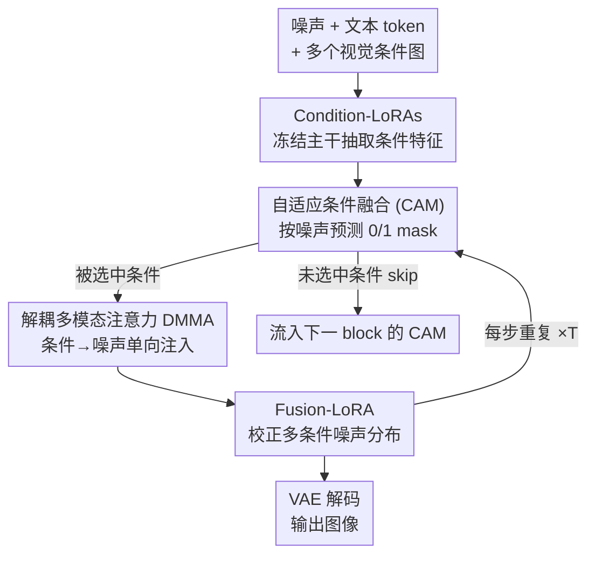

# DynFusion: Rethinking Condition Fusion for Adaptive Multi-Conditional Text-to-Image Generation

**会议**: CVPR 2026  
**论文**: [CVF Open Access](https://openaccess.thecvf.com/content/CVPR2026/html/Fang_DynFusion_Rethinking_Condition_Fusion_for_Adaptive_Multi-Conditional_Text-to-Image_Generation_CVPR_2026_paper.html)  
**代码**: 无（论文未公开仓库）  
**领域**: 扩散模型 / 可控生成  
**关键词**: 多条件可控生成, 条件融合, 动态门控, DiT, FLUX  

## 一句话总结
DynFusion 给 DiT 的每个 MMDiT block 插一个轻量门控模块 CAM，让模型按"当前去噪步、任务、注入位置"自己决定激活哪几个视觉条件（深度/边缘/主体/背景…），把静态"无脑堆叠所有条件"换成动态稀疏融合，在多条件生成上同时把 FID、可控性和推理 FLOPs 都做得更好（Subject-Insertion FID 5.14→4.53，FLOPs 16.21T→7.76T）。

## 研究背景与动机
**领域现状**：文生图扩散模型（SD、FLUX、SD3.5）已经能生成逼真图像，但纯文本无法精确指定空间布局、几何结构和外观细节。于是出现了可控生成框架：ControlNet、IP-Adapter、OmniControl 等把深度图、Canny 边缘、参考主体等辅助条件注入扩散主干，分别加强结构对齐或外观一致性。

**现有痛点**：真实设计任务很少只靠单一条件——往往要同时保留深度图的空间几何、边缘图的结构轮廓、参考图的外观风格。现有多条件方法（Cocktail、UniControlNet、OmniControl、UniCombine）的做法是简单"堆"——多接几条 condition 分支或多塞几组 condition token，对所有条件用**同一套均匀融合策略**。这带来两个具体问题：一是计算量随条件数线性膨胀（OmniControl 同时激活多个 task-LoRA，FLOPs 涨到 16.92T）；二是不同层级的条件（低层几何 vs 高层语义）信号相互**竞争而非协作**，导致结构扭曲、语义漂移，论文里反复出现的 "confusion / unmatched / fail" 失败案例就是这么来的。

**核心矛盾**：条件的异质性 + 时变性被忽略了。低层 cue（depth/canny）和高层 cue（subject/background）该在去噪的不同阶段、不同网络深度起不同作用，但均匀融合把它们当成同一类信号一视同仁地全程注入——既冗余又冲突。

**核心 idea**：用**数据驱动的自适应条件融合**取代静态堆叠——让模型在去噪过程中动态决定 *what / when / where*（激活哪些条件、在哪个 timestep、在哪个 block 注入），而不是预先固定。落地形式是一个即插即用的门控模块 CAM，配合解耦注意力和 Fusion-LoRA 保证被选中的条件干净地融进噪声分支。

## 方法详解
### 整体框架
DynFusion 建在主流 DiT/MMDiT（如 FLUX）之上。输入是噪声 token + 文本 token + 若干视觉条件图（depth、canny、subject、background…），输出是去噪后的目标图像。整条 pipeline 的核心改动是：**冻结主干**，只训练每个条件对应的 condition-LoRA 来抽取条件特征，再通过多模态注意力注入噪声潜空间——以此避免全参数微调。关键创新在于注入前先经过一道动态门控：

每个 MMDiT block 配一个 **CAM（Condition Adaptation Module）**，它读噪声 token，预测一个二值 mask $\hat{M}\in\{0,1\}^n$ 决定本 block 激活哪几个条件。被选中（"1"）的条件参与本 block 的注意力；未被选中（"0"）的条件**跳过当前 block**、流到下一个 CAM 重新决策（图里的虚线 skip）。因为参与注意力的 condition token 变少，MMDiT 的计算量随之下降。注意力本身用**解耦多模态注意力（DMMA）**，限制信息只从条件流向噪声、条件之间互不串扰；当多个条件被同时激活时，再用 **Fusion-LoRA** 校正噪声潜特征分布，把多路条件信号整合好。整个过程每个去噪步重复一次（×T），CAM 因此能在不同 timestep 激活不同条件组合。

### 关键设计

**1. 自适应条件融合 CAM：让模型自己决定每个 block 该听哪几个条件**

这是针对"均匀融合一视同仁"的直接回应。CAM 是个 <1% 参数的轻量门控，挂在每个 MMDiT block 上，输入噪声 token 矩阵 $X\in\mathbb{R}^{*\times d}$，输出对 $n$ 个条件的 0/1 mask。它先做**解耦聚合**——分别沿 token 维和 embedding 维做平均池化，前者捕捉跨区域的全局语义依赖、后者概括每个 token 自身的表示，互补；两路各过一个 MLP 投到 $d_{cam}=d/64$ 维：$Z_{global}=\text{MLP}_{glb}(\text{Agg}_{seq}(X))$、$Z_{local}=\text{MLP}_{loc}(\text{Agg}_{emb}(X))$，相加得到全局-局部融合特征 $Z_{glb\text{-}loc}=Z_{global}+Z_{local}$，再过一个 MLP 出 mask logits $M=\text{Act}(\text{MLP}_{mask}(Z_{glb\text{-}loc}))$。

激活函数有两种模式：**无约束选择**用 Sigmoid + 阈值 $\tau=0.5$，$\hat{M}_i=\mathbb{1}[M_i>\tau]$，可激活任意数量条件；**单条件选择**用 Softmax + argmax，$\hat{M}_i=\mathbb{1}[i=\arg\max(M_i)]$，只留最关键的一个条件，此时 MMDiT 的复杂度退化到接近单条件生成。关键价值在于这个决策是**时变**的——论文可视化（Fig.4）显示：depth 激活集中在早期步（0–10，重建全局几何）、canny 在后期步（15–25，锐化轮廓细节）、subject/background 在中期步（10–20，整合语义内容），刚好契合扩散"先粗几何→再语义→后细节"的生成规律，从而避免过度条件化和跨条件冲突。

**2. CAM 的可微训练：Gumbel 噪声 + 注意力掩码并行**

CAM 要端到端学，但有两道坎。第一，从 logits 采样得到二值 mask $\hat{M}$ 这一步**不可微**，梯度传不回去——解法是在 $\text{Act}(\cdot)$ 里注入 **Gumbel 噪声**，把离散 mask 近似成可微版本。第二，$\hat{M}$ 是非结构化的、随 timestep 和样本变化，直接丢掉 $\hat{M}_i=0$ 的 condition token 会让 batch 内各样本 token 数不一致、**没法并行**。论文的做法是保持 token 数固定，但用注意力掩码屏蔽被剪掉的 token：先算 $P=QK^\top/\sqrt{d}$，把二值条件 mask 转成 attention mask $\hat{M}^{(i,j)}_{attn}=\mathbb{1}[\hat{M}_{C(i)}\wedge\hat{M}_{C(j)}\neq 0]$（$C(\cdot)$ 把 token 下标映射到条件下标），再代回 Softmax：

$$\tilde{A}^{(i,j)}=\frac{\exp(P^{(i,j)}\hat{M}^{(i,j)}_{attn})}{\sum_{k=1}^{N}\exp(P^{(i,j)}\hat{M}^{(i,j)}_{attn})+\varepsilon}$$

这样得到的 $\tilde{A}$ 在数学上等价于"删掉未选中 token 后重算"的注意力，但保持了矩阵形状，从而可以并行训练（$\varepsilon$ 防下溢）。这一招让"动态稀疏"既省推理算力、又不牺牲训练效率。

**3. 解耦多模态注意力 DMMA：保住每路条件的"信号纯度"**

各条 condition-LoRA 是独立训练的，如果让条件之间也互相做注意力，某个条件就会吸收别的条件/噪声的信息，语义被稀释和纠缠——动态融合时本该被屏蔽的特征会混进激活条件里，干扰控制效果。DMMA 把条件分支和去噪分支拆成计算独立的模块：噪声 token 作 query 时，对全部条件做注意力 $\text{DMMA}(Q=X_q, K/V=[C_T, X, C_{V_{1:n}}])$，让噪声从条件里学空间语义；但**条件 token 之间不互相交换信息**——条件作 query 时只对自己做注意力 $\text{DMMA}(Q=C_{V_i}, K/V=C_{V_i})$，且条件 token 对扩散过程保持 agnostic。消融里 DMMA 比 MMA/CMMA 既 FID 更低、attention 算力还更省（实际 AttnOps 1.77T vs MMA 2.74T）。

**4. Fusion-LoRA：多条件同时激活时校正噪声分布**

由于 condition-LoRA 各自独立训练，多个条件被同时激活时，只靠 DMMA 里的 Softmax 去平衡多路条件的注意力分布会得到次优融合；而 DynFusion 里被激活的条件**种类和数量本身就随 timestep/样本动态变化**，更加剧了这个问题。Fusion-LoRA 挂在去噪分支上，专门校正噪声潜特征分布，使噪声 embedding 能适配这种动态调整、把多路控制信号整合得更协调。消融显示去掉它 FID 直接从 4.53 掉到 5.93、DINO 从 93.14 掉到 89.42，是性能的关键支撑。

### 损失函数 / 训练策略
训练目标用 **flow-matching loss** $L_{diff}=\mathbb{E}_{t,\epsilon}\|v_\Theta(z,t,C_T,C_V)-u_t(z|\epsilon)\|_2^2$（$v_\Theta$ 是学到的速度场，$u_t$ 是参考路径真实向量场）。为了控制条件稀疏度，额外加一个 **稀疏损失** 把动态融合相对均匀融合的 FLOPs 比值拉向目标稀疏度 $\lambda$：$L_{sps}=\frac{1}{|D_{bs}|}\sum_d (\frac{F^{t_d}_{dynamic}}{F_{uniform}}-\lambda)^2$。总目标 $L_\theta=L_{diff}+\alpha\cdot L_{sps}$，默认 $\alpha=1.0$。整个训练冻结 DiT 主干，只训 condition-LoRA、Fusion-LoRA 和 CAM。

## 实验关键数据

### 主实验
在 FLUX.1 上跨四类多条件任务对比，主体一致性看 CLIP-I/DINO，可控性看 SSIM/F1/MSE，开销看额外 Params/FLOPs/Speed：

| 任务 | 方法 | FID ↓ | SSIM ↑ | CLIP-I ↑ | DINO ↑ | FLOPs ↓ | Speed ↑ |
|------|------|-------|--------|----------|--------|---------|---------|
| Multi-Spatial | UniCombine | 7.29 | 0.61 | - | - | 16.21T | 1.42it/s |
| Multi-Spatial | **Ours** | **6.52** | **0.66** | - | - | **8.27T** | **2.02it/s** |
| Subject-Insertion | UniCombine | 5.14 | 0.76 | 96.95 | 92.54 | 16.21T | 1.42it/s |
| Subject-Insertion | **Ours** | **4.53** | **0.80** | **97.21** | **93.14** | **7.76T** | **2.09it/s** |
| Subject-Depth | UniCombine | 6.92 | 0.52 | 93.79 | 90.41 | 16.21T | 1.42it/s |
| Subject-Depth | **Ours** | **6.21** | **0.56** | **94.52** | **90.70** | **7.96T** | **2.04it/s** |
| Subject-Canny | UniCombine | 6.41 | 0.57 | 94.76 | 92.24 | 16.21T | 1.42it/s |
| Subject-Canny | **Ours** | **5.72** | **0.64** | **95.33** | **92.87** | **8.20T** | **2.02it/s** |

四个任务上 DynFusion 在质量（FID/SSIM）、主体一致性（CLIP-I/DINO）上全面超过此前最强的 UniCombine，同时 FLOPs 砍掉约一半、推理速度提到约 1.4 倍——这点最关键：以往多条件方法是"加质量必加算力"，DynFusion 靠动态稀疏做到了质量和效率同向改善。

### 消融实验（Subject-Insertion 任务）
| 配置 | FID ↓ | SSIM ↑ | DINO ↑ | FLOPs / 说明 |
|------|-------|--------|--------|------|
| Uniform（全激活） | 5.06 | 0.76 | 92.71 | 15.10T，均匀融合基线 |
| Sole（Softmax 单选） | 4.89 | 0.78 | 92.96 | 7.56T，只留一个条件 |
| **Free（Sigmoid 多选）** | **4.53** | **0.80** | **93.14** | 7.76T，自适应多条件 |
| Ours w. MMA | 5.19 | 0.78 | 92.40 | AttnOps 2.74T |
| Ours w. CMMA | 4.75 | 0.81 | 92.99 | AttnOps 2.41T |
| **Ours w. DMMA** | **4.53** | 0.80 | **93.14** | AttnOps **1.77T** |
| w/o Fusion-LoRA | 5.93 | 0.73 | 89.42 | 去掉后大幅掉点 |
| w. Fusion-LoRA | **4.53** | **0.80** | **93.14** | 完整模型 |

### 关键发现
- **动态稀疏 > 均匀全激活**：Free（自适应）相比 Uniform 把 FID 从 5.06 降到 4.53、FLOPs 从 15.10T 降到 7.76T——证实冗余/冲突条件确实在拖累生成，动态剔除有效。
- **Fusion-LoRA 是最敏感模块**：去掉它 FID 暴涨到 5.93、DINO 掉到 89.42，说明多条件动态组合下校正噪声分布不可或缺。
- **稀疏度有甜点**：稀疏度设 50% 时质量/可控性最佳（FID 4.77）；降到 30% 控制信号不足明显掉点（FID 5.19），升到 70% 又因冗余略降——印证"既不能太少也不能全开"。
- **条件激活有时间规律**：depth 早期、subject/background 中期、canny 后期激活，与扩散"粗几何→语义→细节"的生成轨迹吻合，给可控扩散提供了可解释的机制洞察。

## 亮点与洞察
- **把"该不该用这个条件"也变成可学的决策**：以往可控生成只学"怎么注入条件"，DynFusion 多学了一层"哪个 block、哪个步、用哪几个条件"，这是从"静态架构"到"数据驱动门控"的思路升级。
- **Gumbel + 注意力掩码"假删真留"很巧**：既想要动态稀疏省算力，又想保持 batch 内 token 数一致好并行——用 attention mask 把未选中 token 屏蔽掉（数学等价于删除但形状不变），这套技巧可迁移到任何需要"样本级动态剪枝 + 并行训练"的场景。
- **可解释性副产品**：CAM 的激活分布天然画出了"哪类条件在去噪哪个阶段起作用"，对理解多条件扩散内部机制很有价值。
- **解耦注意力保信号纯度**的观察对所有多分支条件注入都适用：独立训练的分支若互相串扰会稀释语义，单向注入是更安全的默认。

## 局限与展望
- 论文未公开代码，CAM 的具体网络结构、训练数据规模（只说"small-scale dataset"）等细节需查补充材料，复现门槛偏高。⚠️ 部分公式（如 Eq.8 mask 转换、Eq.9 masked softmax）以原文为准。
- 主要在 FLUX.1（MMDiT 架构）上验证，对 UNet 类 ControlNet 体系是否适配、CAM 跨架构通用性如何，论文未充分讨论。
- 稀疏度甜点（50%）和阈值 $\tau=0.5$ 都是经验设定，换条件数量/任务后是否要重调、CAM 决策是否会对训练时未见过的条件组合泛化，缺乏分析。
- 实验条件类型集中在 depth/canny/subject/background，更多异质条件（如 pose、texture、layout 在图 1 出现但主表未系统量化）同时叠加时的扩展性还需更大规模验证。

## 相关工作与启发
- **vs UniCombine / OmniControl**：它们靠堆叠 condition 分支或并行多个 task-LoRA 做多条件，对所有条件均匀注入，算力随条件数膨胀且易冲突；DynFusion 用 CAM 动态选子集，质量更好且 FLOPs 减半，是"堆叠 → 门控"的范式区别。
- **vs FlexControl**：FlexControl 已提出跨步、跨 block 的自适应单条件注入，揭示"控制有效性取决于条件类型与上下文相关性"；DynFusion 把这个洞察推广到**多条件**场景，并加了 DMMA + Fusion-LoRA 解决多路条件互相干扰和分布失配的新问题。
- **vs ControlNet / IP-Adapter**：经典单条件注入器，分别擅长结构对齐和外观一致；DynFusion 不是替代它们，而是上层的"条件调度器"——决定多个此类条件何时协同。

## 评分
- 新颖性: ⭐⭐⭐⭐ 把多条件融合从静态堆叠改成可学门控 + 时变激活，角度新颖且有机制洞察。
- 实验充分度: ⭐⭐⭐⭐ 四任务主表 + 四组消融（融合策略/注意力/Fusion-LoRA/稀疏度），质量与效率双指标完整；但缺跨架构验证。
- 写作质量: ⭐⭐⭐⭐ 动机清晰、图文对照到位，激活动态可视化很加分；部分符号（CAM 维度记号）略乱。
- 价值: ⭐⭐⭐⭐ 同时改善多条件生成的质量和效率，对设计类可控生成实用，门控思路可迁移。

<!-- RELATED:START -->

## 相关论文

- [\[CVPR 2026\] CaReFlow: Cyclic Adaptive Rectified Flow for Multimodal Fusion](careflow_cyclic_adaptive_rectified_flow_for_multimodal_fusion.md)
- [\[CVPR 2026\] Rethinking Prompt Design for Inference-time Scaling in Text-to-Visual Generation](rethinking_prompt_design_for_inference-time_scaling_in_text-to-visual_generation.md)
- [\[CVPR 2026\] MultiBanana: A Challenging Benchmark for Multi-Reference Text-to-Image Generation](multibanana_a_challenging_benchmark_for_multi_reference_text_to_image_generation.md)
- [\[CVPR 2026\] Curriculum Group Policy Optimization: Adaptive Sampling for Unleashing the Potential of Text-to-Image Generation](curriculum_group_policy_optimization_adaptive_sampling_for_unleashing_the_potent.md)
- [\[CVPR 2026\] WISER: Wider Search, Deeper Thinking, and Adaptive Fusion for Training-Free Zero-Shot Composed Image Retrieval](wiser_wider_search_deeper_thinking_and_adaptive_fusion_for_training-free_zero-sh.md)

<!-- RELATED:END -->
