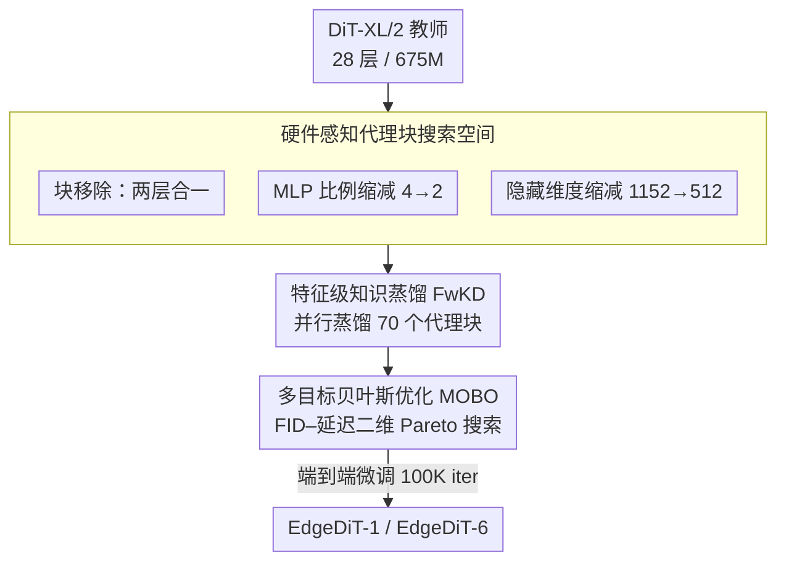

# EdgeDiT: Hardware-Aware Diffusion Transformers for Efficient On-Device Image Generation

**会议**: CVPR 2026  
**arXiv**: [2603.28405](https://arxiv.org/abs/2603.28405)  
**代码**: 无  
**领域**: 扩散模型 / 模型压缩  
**关键词**: 扩散Transformer, 端侧部署, 硬件感知优化, 知识蒸馏, 架构搜索

## 一句话总结
EdgeDiT 提出一种硬件感知的扩散 Transformer 优化框架，通过层级知识蒸馏训练轻量级代理块、多目标贝叶斯优化搜索 Pareto 最优架构，实现了 20-30% 参数缩减、36-46% FLOPs 降低、1.65x 端侧加速，同时保持甚至超越原始 DiT-XL/2 的生成质量。

## 研究背景与动机

1. **领域现状**：Diffusion Transformers (DiT) 已成为高保真图像生成的新范式，将 U-Net 替换为 Vision Transformer 骨干网络，具有更好的可扩展性。后续工作如 MDT（掩码建模）、SiT（插值 Transformer）等进一步提升了性能。

2. **现有痛点**：
    - 现有 DiT 模型计算量和内存需求巨大，无法在资源受限的边缘设备上运行
    - 云端推理虽可行，但带来隐私问题、网络依赖和能耗增加
    - 理论计算量（FLOPs/GMACs）不能可靠预测实际端侧延迟——NPU 对特定操作（如 GEMM）有专门优化，减少算术计算不一定等比例降低延迟

3. **核心矛盾**：DiT 的强大生成能力来自于大规模参数和深层架构，但端侧部署要求低延迟和小内存。如何在压缩模型的同时保持生成质量是核心挑战，而且必须考虑实际硬件特性而非仅优化理论指标。

4. **本文目标**
    - 如何系统性地发现适合移动 NPU 的高效 DiT 架构？
    - 如何避免对搜索空间中的每个候选架构都进行完整训练？

5. **切入角度**：将 DiT 架构分解为可替换的硬件友好代理块，通过层级知识蒸馏快速训练代理，再用多目标贝叶斯优化在质量-延迟空间中找到 Pareto 最优架构。

6. **核心 idea**：分解-蒸馏-搜索三步走：将 DiT 分解为代理块搜索空间，用特征级知识蒸馏高效训练每个代理块，再用贝叶斯优化找到 FID-延迟 Pareto 最优的轻量架构。

## 方法详解

### 整体框架
EdgeDiT 要解决的问题很具体：DiT-XL/2 这样 28 层、675M 参数的扩散 Transformer 在云端跑得动，但搬到手机 NPU 上既慢又装不下，而直接按 FLOPs 剪枝又因为 NPU 对 GEMM 等算子有专门优化、理论计算量和实测延迟对不上号。它的思路是把"找一个端侧能跑的好架构"这件事拆成**分解—蒸馏—搜索**三步：先把一整个 DiT 拆成一格格可替换的"代理块"，列出所有硬件友好的轻量替代方案构成搜索空间；再用教师模型对每个代理块单独做特征蒸馏，让它们快速学会近似原块的行为；最后用贝叶斯优化在"画质好"和"延迟低"两个目标之间挑出 Pareto 最优的组合，端到端微调成最终模型。整条流水线把一个本来不可能穷举训练的大空间，变成了可并行、可高效搜索的问题。

### 关键设计

**1. 硬件感知的代理块搜索空间：用移动 NPU 友好的轻量模块去换 DiT 里冗余的算子，而不是盲剪**

如果对 DiT 随机剪枝或均匀缩小，很容易踩到 NPU 的性能断崖——理论上省了计算，实测延迟却没降多少。EdgeDiT 改成把每一层都换成一组预先设计好的硬件友好代理，只在这些"合法替换"里搜索。具体有三类代理：**块移除**，把每两个连续 DiT 层合并成一层，作用在 Stage 1，给出 $2^{14}$ 种组合；**MLP 比例缩减**，把 FFN 的扩展比从 4 降到 2；**隐藏维度缩减**，把投影维度从 1152 降到 512。后两类作用在 Stage 2，每层有 4 种选项（2 种 MLP 比例 × 2 种维度），于是产生 $4^{28}$ 种组合，整个搜索空间是 $2^{14} + 4^{28}$。这样搜出来的每个候选都天然落在硬件友好的算子上，省下的计算能真正兑现成端侧延迟的下降。

**2. 特征级知识蒸馏（FwKD）：让每个代理块单独对齐教师对应块，把"全空间训练"拆成可并行的局部任务**

$2^{14} + 4^{28}$ 的空间意味着若对每个候选架构都从头训练完全不现实。EdgeDiT 用分治绕过它：每个代理块独立训练，目标是让它的输出 $S_l(x)$ 逼近教师模型同一位置块的输出 $T_l(x)$，损失就是逐块的特征对齐误差

$$\mathcal{L}_{KD}^l = \|T_l(x) - S_l(x)\|_2^2$$

Stage 1 训练 14 个代理（两层合一），Stage 2 训练 56 个代理（28 层 × 2 种变体），合计 70 个代理块，因为彼此互不依赖，可以完全并行地蒸馏。这一步并不要求代理块直接达到最终精度，而是让它学会局部行为的近似、给后续端到端微调一个好初始化——消融里去掉 FwKD 后画质显著退化，正说明这个初始化不可省。

**3. 多目标贝叶斯优化（MOBO）架构选择：在 FID–延迟二维空间里用少量评估逼近 Pareto 前沿**

代理块训好后要从天文数字的组合里挑出真正划算的那几个，逐一评估同样不可行。EdgeDiT 把架构选择写成双目标优化：一边 $\max f(a)$ 追求生成质量（FID），一边 $\min g(a)$ 压低端侧延迟。它用高斯过程当代理模型来预测候选架构的两个目标值，再用 Expected Hyper-volume Improvement（EHVI）采集函数在"探索新区域"和"利用已知好点"之间权衡，每次只挑最有价值的少数候选去实测。为了让连续优化能作用在离散的架构配置上，它把配置松弛成连续表示 $x \in [0,1]^{28}$，搜完再映射回最近的可行架构。最终在 Pareto 前沿上选出的两个代表点，就是 EdgeDiT-1 和 EdgeDiT-6。

### 一个完整示例：从 DiT-XL/2 到 EdgeDiT-1
以教师 DiT-XL/2（28 层、675M）走一遍：**搜索空间**阶段把它拆成代理块，Stage 1 的"两层合一"给出 $2^{14}$ 种瘦身方式，Stage 2 的 MLP/维度替换再叠加 $4^{28}$ 种；**蒸馏**阶段并行训练这 70 个代理块，每块只需对齐教师对应块的输出 $T_l(x)$，无需碰整网；**搜索**阶段 MOBO 在 FID–延迟空间里采样评估，逐步把候选收敛到 Pareto 前沿；最后取出一个偏激进压缩的点 EdgeDiT-1，基于 DiT-XL/2 的 400K checkpoint 再端到端微调 100K iteration。结果是参数从 675M 降到 471M（−30%），FID 反而从 16.23 降到 12.3，iPhone 端延迟从 118.56ms 降到 70.86ms。

### 损失函数 / 训练策略
- 蒸馏阶段：$\mathcal{L}_{KD}^l = \|T_l(x) - S_l(x)\|_2^2$，每个代理块独立训练
- 端到端训练：标准扩散训练目标 $\mathcal{L}_{diff} = \mathbb{E}[\|\epsilon - \epsilon_\theta(z_t, t)\|_2^2]$
- 选出的 EdgeDiT-1 和 EdgeDiT-6 基于 DiT-XL/2 的 400K iteration checkpoint 进行 100K iteration 的端到端训练

## 实验关键数据

### 主实验 — ImageNet 256×256 类条件生成

| 模型 | 参数量 (M) | FID-50K↓ | SFID↓ | IS↑ | Precision↑ | Recall↑ |
|------|-----------|----------|-------|-----|-----------|---------|
| DiT-XL/2 | 675 | 16.23 | 11.06 | 80.91 | 0.93 | 0.26 |
| **EdgeDiT-1** | **471** | **12.3** | 13.97 | 75.72 | 0.92 | 0.24 |
| **EdgeDiT-6** | **530** | **12.4** | 14.96 | 78 | 0.91 | 0.25 |

### 端侧延迟对比 (256×256)

| 模型 | 参数量 (M) | GFLOPs | iPhone 延迟 (ms) | Samsung 延迟 (ms) |
|------|-----------|--------|-----------------|-------------------|
| DiT-XL/2 | 675 | 237.34 | 118.56 | 129.00 |
| EdgeDiT-1 | 471 | 143.96 | 70.86 | 86.13 |
| EdgeDiT-6 | 530 | 169.97 | 72.53 | 89.22 |

### 消融实验 — 知识蒸馏的必要性

| 配置 | 说明 |
|------|------|
| EdgeDiT + FwKD | 正常质量，接近教师模型 |
| EdgeDiT w/o FwKD（随机初始化） | 图像质量显著退化 |

### 关键发现
- **EdgeDiT 以更少参数超越教师模型**：EdgeDiT-1 仅用 471M 参数（少 30%）就把 FID 从 16.23 降到 12.3，说明 DiT-XL/2 存在大量结构冗余
- **参数减少 30%、FLOPs 减少 36-46%、端侧加速 1.65x**：Samsung Galaxy S25 Ultra 上实测加速明显
- **FwKD 不可或缺**：没有特征级蒸馏的 EdgeDiT 图像质量严重退化，蒸馏为后续端到端训练提供了良好初始化
- **搜索空间设计的敏感性分析**：3 块合并（而非 2 块）导致质量骤降，MLP ratio=1 质量差而 ratio=2,3 接近，hidden dim=512 与 768 质量类似

## 亮点与洞察
- **分解-蒸馏-搜索的流水线设计**：这个框架非常工程化且实用——将不可行的全空间搜索分解为可并行的局部蒸馏，大幅降低了搜索成本。这种方法论可以迁移到其他大模型的压缩场景
- **理论指标与实际延迟的脱节**：论文强调了 FLOPs 不能准确预测 NPU 延迟这一实际问题，因此直接将端侧延迟作为优化目标之一，这在工程部署中非常重要
- **代理块蒸馏的高度并行性**：70 个代理块可以独立并行训练，使得整个搜索过程高效且可扩展

## 局限与展望
- 仅基于 DiT-XL/2 做实验，未扩展到 SiT、MDT 等其他扩散 Transformer
- 受限于计算资源，仅训练了 EdgeDiT-1 和 EdgeDiT-6 两个代表性架构，Pareto 前沿上的更多模型未充分探索
- 端到端训练仅 100K iterations（基于 400K checkpoint），与完整训练的 DiT-XL/2（7M iterations）相比训练不充分，FID 还有提升空间
- 仅评估了类条件 ImageNet 生成，未验证文本到图像等更复杂的生成任务
- 搜索空间中未考虑注意力头数的变化和 token 稀疏化等技术

## 相关工作与启发
- **vs MobileDiffusion**: MobileDiffusion 针对 U-Net 架构做移动端优化，而 EdgeDiT 专注于 Transformer 骨干的优化，覆盖了不同的技术路线
- **vs DiT-S/B/L**: DiT 家族通过缩小隐藏维度和层数来减少参数，但这是均匀缩减；EdgeDiT 通过异构搜索在不同层使用不同程度的压缩，实现了更好的质量-效率权衡
- **vs 标准剪枝/NAS**: EdgeDiT 结合了知识蒸馏和贝叶斯 NAS 的优势，避免了纯剪枝可能导致的性能断崖和纯 NAS 的高训练成本

## 评分
- 新颖性: ⭐⭐⭐ 方法论上是已有技术（KD + NAS + MOBO）的组合，但组合方式合理且面向实际问题
- 实验充分度: ⭐⭐⭐ 有端侧实测数据，但仅两个模型做了完整训练，ImageNet 256 单一任务
- 写作质量: ⭐⭐⭐⭐ 清晰易读，框架图和搜索空间设计讲解清楚
- 价值: ⭐⭐⭐⭐ 为扩散 Transformer 的端侧部署提供了可操作的系统方案

<!-- RELATED:START -->

## 相关论文

- [\[CVPR 2026\] PixelDiT: Pixel Diffusion Transformers for Image Generation](pixeldit_pixel_diffusion_transformers_for_image_generation.md)
- [\[CVPR 2026\] Circuit Mechanisms for Spatial Relation Generation in Diffusion Transformers](circuit_mechanisms_for_spatial_relation_generation_in_diffusion_models.md)
- [\[CVPR 2026\] Memory-Efficient Fine-Tuning Diffusion Transformers via Dynamic Patch Sampling and Block Skipping](memory-efficient_fine-tuning_diffusion_transformers_via_dynamic_patch_sampling_a.md)
- [\[AAAI 2026\] RelaCtrl: Relevance-Guided Efficient Control for Diffusion Transformers](../../AAAI2026/image_generation/relactrl_relevance-guided_efficient_control_for_diffusion_transformers.md)
- [\[CVPR 2026\] OPRO: Orthogonal Panel-Relative Operators for Panel-Aware In-Context Image Generation](opro_orthogonal_panel-relative_operators_for_panel-aware_in-context_image_genera.md)

<!-- RELATED:END -->
