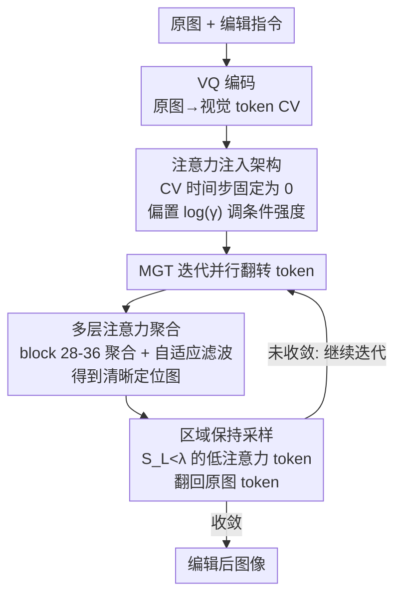

# EditMGT: Unleashing Potentials of Masked Generative Transformers in Image Editing

**会议**: CVPR 2026  
**论文**: [CVF Open Access](https://openaccess.thecvf.com/content/CVPR2026/html/Chow_EditMGT_Unleashing_Potentials_of_Masked_Generative_Transformers_in_Image_Editing_CVPR_2026_paper.html)  
**代码**: https://weichow23.github.io/EditMGT （项目页 / 代码 / 数据集）  
**领域**: 图像生成 / 图像编辑  
**关键词**: 指令图像编辑, 掩码生成式Transformer(MGT), 注意力注入, 区域保持采样, 编辑泄漏  

## 一句话总结
EditMGT 是首个基于掩码生成式 Transformer（MGT）的指令图像编辑模型，利用 MGT「逐 token 翻转」的局部解码特性，用多层注意力聚合定位编辑区域、再用区域保持采样把低注意力区域 token 翻回原图，从而从机制上杜绝扩散模型的「编辑泄漏」，仅 960M 参数就在四个基准上拿到图像相似度 SOTA，且编辑速度比同档模型快 6×。

## 研究背景与动机
**领域现状**：当前指令图像编辑的主流范式是扩散模型（DM），靠迭代去噪获得高视觉保真度，InstructPix2Pix、FluxKontext、OmniGen2、VAREdit 等都走这条路。

**现有痛点**：DM 的去噪是**全局**的——每一步都在整张图上做整体精修，这就把「局部编辑目标」和「全图上下文」纠缠在了一起，导致修改「泄漏」到本该保持不变的区域（spurious edit / editing leakage）。比如让「把独角兽变成狮子」，背景、姿态也跟着被改。

**现有补救都不彻底**：作者归纳出三类补救法都有硬伤——(1) 堆大规模高质量数据让模型隐式学约束，但无法**显式保证**无关区域不被改；(2) 用预定义 mask + inpainting 模型，受限于预训练 inpainting 模型、灵活性差；(3) 用 inversion 把非编辑区映射回高斯噪声子空间，推理慢且仍可能误改。

**核心矛盾**：DM 的全局去噪机制和「只改目标区、保住其余区」这个编辑诉求**天生冲突**——保区只能靠外挂约束，不是架构自带的能力。

**切入角度**：作者换赛道到 MGT。MGT 把图像编码成离散视觉 token 序列，靠**并行预测多个被 mask 的 token** 来生成，是一种**局部解码**范式——天然支持「指定 mask 区域内更新、区域外 token 保持完全不动」的零样本 inpainting。这意味着「显式保护非目标区」在 MGT 里是架构自带的，不用外挂。

**核心 idea**：在 MGT 上实现两个编辑必需的能力——① **自适应定位**编辑相关区域（不靠人工 mask），② 推理时**显式保护**无关区域。前者靠观察到 MGT 交叉注意力天然带定位信号、再用多层注意力聚合增强；后者靠区域保持采样把低注意力区 token 翻回原图。整套不增加任何参数，靠注意力注入把预训练文生图 MGT（Meissonic）改造成编辑模型。

## 方法详解

### 整体框架
EditMGT 的输入是「原图 + 编辑指令」，输出是编辑后的图。整条链路建立在 Meissonic 这个 1024×1024 文生图 MGT 之上，分三步走：(1) **架构层**——把原图编码成一份额外的条件 token `CV`，通过注意力注入让原图监督生成，把文生图模型零成本变成编辑模型；(2) **定位**——在迭代翻转 token 的过程中，从 MGT 的交叉注意力里提取编辑区域信号，并用多层聚合把模糊的注意力图增强成清晰的定位图；(3) **保区**——用区域保持采样，把定位图中低注意力区域的 token 强制翻回原图 token，从而只在目标区生效。

MGT 的生成过程本身是：从全 mask 的画布出发，每轮并行采样所有缺失 token，低置信度的 token 被打回 `[MASK]` 下轮再预测，迭代收敛。EditMGT 正是把「保区」这件事嵌进这个迭代翻转循环里。

### 关键设计

**1. 注意力注入架构：零新增参数地把文生图 MGT 改成编辑模型**

痛点是：编辑模型需要「原图」作为条件来监督生成，但常规做法要么改架构、要么加参数。EditMGT 的做法是引入一份和迭代图像 token `CI` 形状完全相同的**原图条件 token** $C_V\in\mathbb{R}^{N\times d}$，并让它的 RoPE 位置矩阵与 `CI` 对齐（$(i,j)_{C_V}=(i,j)_{C_I}$），保证原图与编辑图在空间上逐位置对齐。`CV` 与 `CI` **共享参数**、走同样的迭代更新，唯一区别是它的**时间步永远固定为 0**——这让 `CV` 不会随采样漂移，始终作为稳定的条件信号。

注意力按 $W=\mathrm{softmax}\!\big(QK^\top/\sqrt{d}\big)$ 算，$Q,K,V$ 来自拼接后的 token $C=[C_I;C_T]$（图像 + 文本）。为了在推理时控制原图条件强度，作者往注意力权重里加一个偏置矩阵 $W_{\text{new}}=W+E$，其中 $E$ 是分块矩阵，只在 `CI`↔`CV` 之间的块上填 $\log(\gamma)$、其余块为 0：

$$\mathcal{E}=\begin{bmatrix}\mathbf{0}_{M\times M} & \mathbf{0}_{M\times N} & \mathbf{0}_{M\times N}\\ \mathbf{0}_{N\times M} & \mathbf{0}_{N\times N} & \log(\gamma)\mathbf{1}_{N\times N}\\ \mathbf{0}_{N\times M} & \log(\gamma)\mathbf{1}_{N\times N} & \mathbf{0}_{N\times N}\end{bmatrix}$$

这样既保住了每类 token 内部的原始注意力模式，又能用 $\log(\gamma)$ 单独缩放原图与编辑图之间的注意力：$\gamma=0$ 时条件不起作用，$\gamma>1$ 时增强原图约束。整套靠注意力机制嵌入条件，**不引入任何额外参数**就完成「文生图→编辑」的转换。

**2. 多层注意力聚合：把模糊的交叉注意力炼成精准定位图**

作者观察到 MGT 的文本→图像交叉注意力本身就携带丰富语义——在「给狗加生日帽」这类例子里，模型在最初几轮迭代就能勾出帽子的轮廓。但单个中间 block 的原始注意力**显著性不足、焦点不清晰**，直接拿来定位会误判物体内部的 token。

为此 EditMGT 把第 **28~36 层**（从语义连贯的单模态处理层里挑出来）的注意力权重**聚合**起来放大信号；但聚合后的注意力图仍有内部不连续、边界模糊的「空洞」问题，会让物体内部 token 被错分。于是再接一个**自适应滤波（Adaptive Filtering）**做去噪与边界锐化，最终得到边界清晰、空间精确的定位图。这一步对应论文说的「能力①：自适应定位编辑相关区域」，且**全程不需要用户提供 mask**。

**3. 区域保持采样：把低注意力区域的 token 翻回原图，从机制上堵住泄漏**

有了清晰定位图，怎么保证只改目标区？EditMGT 把保护动作直接塞进 MGT 的迭代翻转循环。设 $W^\ell_i\in\mathbb{R}^{M\times N}$ 为第 $\ell$ 层归一化后从文本 `CT`→编辑图 `CI` 的注意力图，先聚合成每个图像 token 的定位分数：

$$s_L=\frac{1}{|\mathcal{L}||\mathcal{M}|}\sum_{\ell\in\mathcal{L},\,m\in\mathcal{M}}W^\ell_i[m,:]\in\mathbb{R}^N$$

其中 $W^\ell_i[m,:]$ 是矩阵第 $m$ 行切片，$\mathcal{M}$ 是参与选择的行索引集合（若只取指令里的关键词如某个具体物体，就用 $\mathcal{M}$ 抽对应行）。推理时，MGT 照常对高置信 token 做翻转、低置信留 `[MASK]` 等下轮精修；而**所有满足 $S_L<\lambda$ 的低注意力 token 被强制还原成原图对应 token**。这样既保住了采样调度器的完整性，又保证了与原图的一致性。阈值 $\lambda$ 用来控制翻转频率/编辑范围：$\lambda$ 越大、被还原的区域越多，编辑越保守；超过某个阈值后输出就退化成原图。这正是「能力②：显式保护无关区域」，把「保区」从外挂约束变成了采样阶段的硬性机制。

### 损失函数 / 训练策略
训练目标是在大规模图文数据集 $\mathcal{D}$ 上最小化「在未 mask token 和条件 token 上重建被 mask token」的负对数似然：

$$L=\mathbb{E}_{(x,t)\sim\mathcal{D},\,\mathbf{m}\sim\mathcal{M}}\Big[-\sum_{i\in\mathbf{m}}\log p_\theta\big(v_i\,\big|\,v_{\neg i},C_T;C_V\big)\Big]$$

mask 率 $r\in[0,1]$ 从截断 arccos 分布采样，密度 $p(r)=\tfrac{2}{\pi}(1-r^2)^{-1/2}$（cosine 调度）。训练分三阶段：**Stage 1** 用约 1M 图文对、把文本编码器换成 Gemma2-2B（Meissonic 原用 CLIP，语言理解弱、且偏卡通风格），训 5,000 步打底；**Stage 2** 在完整 4M 编辑数据上全量微调 50,000 步；**Stage 3** 用更高质量编辑数据全量微调 1,000 步，对齐人类偏好。

配套数据集 **CrispEdit-2M**：用开源模型生成、经严格过滤的 2M 高分辨率（短边 ≥1024）编辑样本，覆盖 7 个类别；再加作者另收集的 2M 高分辨率样本，共 4M 数据用于训练。

## 实验关键数据

### 主实验
**Emu Edit / MagicBrush（图像相似度 + 指令一致）**：EditMGT 仅 1B（实际 960M）参数，在 CLIPim 上拿下两基准 SOTA，MagicBrush 上 CLIPim 提升约 1.1%；DINO 语义相似度在 MagicBrush 上 SOTA、Emu Edit 上次优。

| 模型 | 参数 | EmuEdit CLIPim↑ | EmuEdit DINO↑ | MagicBrush CLIPim↑ | MagicBrush DINO↑ |
|------|------|------|------|------|------|
| AnyEdit (CVPR'25) | 1B | 0.872 | 0.821 | 0.898 | 0.881 |
| OminiGen2 | 7B | 0.876 | 0.822 | - | - |
| VAREdit | 8B | 0.876 | 0.825 | 0.901 | 0.844 |
| **EditMGT (Ours)** | **1B** | **0.878** | 0.832 | **0.911** | **0.881** |

**GEdit-EN-full（GPT 评测，11 类任务均分）**：960M 的 EditMGT 整体超过 VAREdit-8B、GoT-6B、OminiGen2-7B，逼近 12B 的 FluxKontext.dev；在背景变换、色彩、人像、风格迁移等子任务上甚至反超 FluxKontext，色彩变换 +9.8%、风格迁移 +17.6%。

| 模型 | 参数 | BG变换 | 色彩 | 风格 | 平均 |
|------|------|------|------|------|------|
| GoT | 6B | 4.11 | 5.75 | 4.59 | 3.95 |
| VAREdit | 8B | 6.77 | 6.64 | 7.29 | 5.73 |
| FluxKontext.dev | 12B | 7.06 | 7.03 | 6.76 | **6.26** |
| **EditMGT (Ours)** | **0.96B** | **7.69** | **7.71** | 5.24 | 5.87 |

**AnyBench**：按任务类型评测，EditMGT 在全部任务上取得最优或接近最优；风格变换比次优 +3.6%，隐式指令任务 SOTA、比次优 +1.7%。

**效率**：1024×1024 单张编辑仅 **2 秒**，比同等性能模型快 **6×**，显存占用仅 13.8 GB。

### 消融实验
| 配置 | 现象 | 说明 |
|------|------|------|
| 文本编码器 Gemma2-IT-2B | 最优 | 优于 T5-XXL / Llama3.2-1B，作为最终选择 |
| 数据规模 20K→80K 步 | Score 单调上升 | 换文本编码器后仍保持可扩展性 |
| 阈值 $\lambda$ 增大 | 编辑范围递减 | L1 距离下降；语义分数先微升后骤降 |

### 关键发现
- **阈值 $\lambda$ 是「保真 ↔ 编辑强度」旋钮**：$\lambda$ 越大被翻回原图的 token 越多，L1（与原图差异）单调下降；但语义分数呈「先微升后骤降」——说明保区适度有益，过度则编辑被压没了，存在最优区间。
- **架构对文本编码器换装鲁棒**：把 CLIP 换成 Gemma2-2B 后随训练步数仍稳定提升，说明定位+保区机制不依赖特定文本编码器。
- **小模型反超大模型的来源**：960M 在风格类任务（风格迁移 +17.6%）领先，得益于 MGT 局部解码对结构/风格的精确控制；而 L1 不占优，作者归因于 EditMGT 与预设目标图之间天然的多样性差异（⚠️ 此解释以原文为准）。
- **定性观察**：在「照片偏黄请调色」上只有 EditMGT 正确**降**暖调而非加黄；「加机器鸟」能正确生成机械鸟；风格化时能保住主体姿态与位置——印证了「保结构」能力。

## 亮点与洞察
- **换范式解决泄漏**：不在 DM 上打补丁，而是借 MGT「逐 token 翻转、区域外可完全不动」的局部解码特性，把「显式保护无关区」从外挂约束变成架构自带能力——这是从机制根因上消除编辑泄漏，而非事后修补。
- **零新增参数的注意力注入**：用共享参数、时间步固定为 0 的条件 token + 一个只在 `CI`↔`CV` 块上填 $\log(\gamma)$ 的偏置矩阵，就把文生图模型变成编辑模型，可迁移到其他「需要把原图当稳定条件」的 MGT 任务。
- **注意力即免费 mask**：交叉注意力天然携带定位信号，多层聚合 + 自适应滤波就能炼出精准定位图，省掉了人工 mask 或额外分割网络；这个「免费定位」思路可迁移到其他需要区域控制的生成任务。
- **小而快**：960M、2 秒、13.8 GB，却在多基准超过 6~8B 模型，说明编辑任务的瓶颈未必是参数量，而是「能不能精确控制改哪里」。

## 局限与展望
- **L1 不占优**：作者承认像素级 L1 没有显著优势，归因于与预设目标图的多样性差异——但这也可能反映在某些任务上编辑结果与 ground truth 偏离，需要更细的人评佐证。
- **定位依赖注意力质量**：多层聚合固定取 block 28~36，且依赖自适应滤波，对注意力本身模糊（如复杂多物体、抽象指令）的场景，定位精度可能下降，论文未充分量化这类失败。
- **阈值 $\lambda$ 需调**：编辑强度由 $\lambda$ 控制且语义分数对其敏感（先升后骤降），缺乏自动选 $\lambda$ 的机制，实际使用可能需逐图调参。
- **基座绑定 Meissonic**：方法建立在特定 MGT（Meissonic）之上，迁移到其它 MGT/分辨率是否仍有效尚待验证。

## 相关工作与启发
- **vs 扩散编辑（FluxKontext / VAREdit / OmniGen2）**：它们靠全局去噪 + 大数据/inversion 隐式保区，参数 6~12B 且易泄漏；EditMGT 靠 MGT 局部解码**显式**保区，960M 即可，速度快 6×，多基准反超——区别在「保区是架构自带还是外挂约束」。
- **vs 基于 mask 的 inpainting 编辑**：后者需人工预定义 mask、受限于预训练 inpainting 模型；EditMGT 用注意力自适应定位，无需人工 mask，灵活性更高。
- **vs 注意力控制方法（Prompt-to-Prompt / MasaCtrl / DiTCtrl）**：它们在 DM/DiT 上调制交叉/自注意力实现可控编辑；EditMGT 是**首个系统分析 MGT token 翻转中全注意力动态**并用其抑制泄漏的工作，是把「注意力控制」思路迁移到 MGT 范式的首次尝试。

## 评分
- 新颖性: ⭐⭐⭐⭐⭐ 首个 MGT 图像编辑框架，从范式层面而非补丁层面解决编辑泄漏
- 实验充分度: ⭐⭐⭐⭐ 四基准 + 多消融充分，但 L1 劣势与定位失败案例分析略欠
- 写作质量: ⭐⭐⭐⭐ 动机—机制—能力对应清晰，公式与注意力可视化到位
- 价值: ⭐⭐⭐⭐⭐ 960M/2s 超 6~8B 模型 + 开源 CrispEdit-2M，对高效编辑社区价值高

<!-- RELATED:START -->

## 相关论文

- [\[CVPR 2026\] SpotEdit: Selective Region Editing in Diffusion Transformers](spotedit_selective_region_editing_in_diffusion_transformers.md)
- [\[CVPR 2026\] MRT: Masked Region Transformer for Layered Image Generation and Editing at Scale](mrt_masked_region_transformer_for_layered_image_generation_and_editing_at_scale.md)
- [\[CVPR 2026\] PixelDiT: Pixel Diffusion Transformers for Image Generation](pixeldit_pixel_diffusion_transformers_for_image_generation.md)
- [\[NeurIPS 2025\] Unleashing Diffusion Transformers for Visual Correspondence by Modulating Massive Activations](../../NeurIPS2025/image_generation/unleashing_diffusion_transformers_for_visual_correspondence_by_modulating_massiv.md)
- [\[CVPR 2026\] ReasonEdit: Towards Reasoning-Enhanced Image Editing Models](reasonedit_towards_reasoning-enhanced_image_editing_models.md)

<!-- RELATED:END -->
