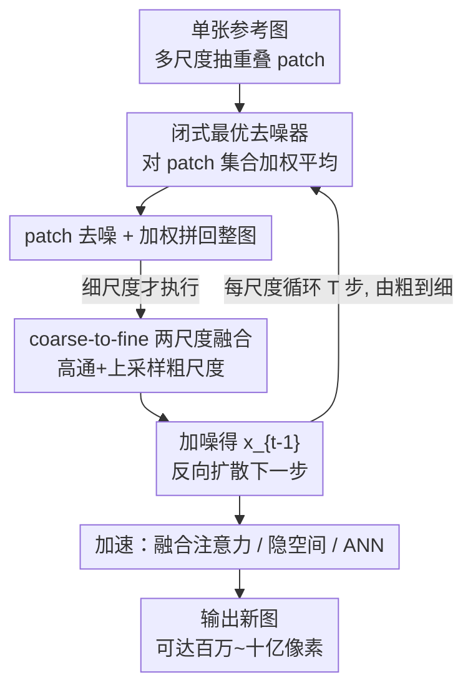

# Efficient and Training-Free Single-Image Diffusion Models

**会议**: CVPR 2026  
**arXiv**: [2606.04299](https://arxiv.org/abs/2606.04299)  
**代码**: https://haojunqiu.github.io/efficient-SID/ (有)  
**领域**: 扩散模型 / 图像生成  
**关键词**: 单图生成, 免训练扩散, 闭式去噪器, patch 先验, coarse-to-fine

## 一句话总结
把"单张图片里所有 patch"当成一个有限数据集，证明在这个数据集上的去噪 score 有解析闭式解（一个类 non-local-means 的加权去噪器），从而把单图扩散模型彻底变成**零训练**——质量/多样性追平甚至超过要训几小时的 SinDDM/SinFusion，还能一秒生成百万像素、几分钟生成十亿像素。

## 研究背景与动机
**领域现状**：单图生成（single-image generation）要做的是——给一张参考图，生成内部 patch 分布（跨多个尺度的局部结构统计）与它一致、但全局布局是新的图像。主流两条路线：① 单图 GAN（SinGAN）用判别器逼 patch 统计；② 单图扩散（SinDDM、SinFusion、SinDiffusion）训一个网络在多尺度上去噪同一张图，再用 coarse-to-fine 采样出新图。

**现有痛点**：哪怕训练数据只有一张图，这些生成模型仍要**几小时**优化（SinDDM 在 TITAN RTX 上 10 小时、SinFusion 3.2 小时、SinDiffusion 5.4 小时）。GAN 还额外受局部极小、mode collapse 困扰，且不重训就没法加文本引导。

**核心矛盾**：扩散模型的灵活性（显式建模 patch 先验、能接 VLM 做文本编辑、能加对称/局部约束）很诱人，但它把这份灵活性绑死在了"必须先内部训练一个去噪网络"上。而经典非参数 patch 方法（GPNN 的最近邻 patch 匹配）零训练、又快，却不显式建模 patch 概率，灵活性差。两边各有一半，谁也不占全。

**切入角度**：作者抓住一个关键观察——**单张图里的 patch 集合是有限的**。对一个有限数据集，加噪 patch 的 score 函数（即最优去噪器）是有解析闭式解的，根本不需要训神经网络。换句话说，扩散模型里那个本该被"学出来"的去噪器 $D$，在单图设定下可以**直接算出来**。

**核心 idea**：用一个对"该图全部 patch"最优的**闭式去噪器**替换训练好的去噪网络，把它塞进一个 coarse-to-fine 的反向扩散过程里——既拿到扩散模型的显式概率建模与可控性，又彻底甩掉数小时训练。这个闭式去噪器在图像层面退化成 non-local-means 去噪，从而把现代扩散与经典 patch 复原打通。

## 方法详解

### 整体框架
方法的输入是单张参考图，输出是 patch 分布与它一致、全局布局却是新的图。整条管线没有任何可学习参数：先把参考图在多个尺度上拆成重叠 patch 当"干净数据集"，然后从纯噪声出发逐时间步反向扩散，每一步用闭式去噪器逐 patch 去噪、拼回整图，再做尺度间融合，从粗到细一路采样到全分辨率；最后三项加速技巧让它能冲到吉像素。

对单尺度的一个反向扩散步：从噪声图里抽出所有重叠噪声 patch → 每个 patch 用闭式去噪器（对全图 patch 集合做高斯加权平均）求出干净估计 → 把去噪 patch 加权拼回成整张去噪图 $\hat{\mathbf{x}}_t$ → 用 DDIM/DDPM 式更新加回噪声得到 $\mathbf{x}_{t-1}$。多尺度时，每个细尺度还会在拼图后插入一步"和上一粗尺度结果做两尺度融合"。

### 关键设计

**1. 闭式最优去噪器：把"训练去噪网络"换成"对全图 patch 求加权平均"**

痛点直接来自动机——单图扩散非要先训几小时的去噪器。作者指出这步是多余的：标准扩散把噪声信号写成 $\mathbf{x}_t=\alpha(t)\mathbf{y}+\sigma(t)\boldsymbol\epsilon$，去噪器 $D$ 本应最小化 $\mathbb{E}[\,w(t)\|D(\mathbf{x}_t,t)-\mathbf{y}\|_2^2\,]$。当数据集 $\mathcal{Y}=\{\mathbf{y}^{(1)},\dots,\mathbf{y}^{(Y)}\}$ 是**有限**的（单图的 patch 集合正是如此），这个最优去噪器有闭式解：

$$D(\mathbf{x}_t,\mathcal{Y},t)=\frac{\sum_{\mathbf{y}\in\mathcal{Y}} p_{\mathcal N}(\mathbf{x}_t;\alpha\mathbf{y},\sigma^2\mathbf I)\,\mathbf{y}}{\sum_{\mathbf{y}\in\mathcal{Y}} p_{\mathcal N}(\mathbf{x}_t;\alpha\mathbf{y},\sigma^2\mathbf I)}$$

它本质就是：拿当前噪声 patch 去和数据集里每个干净 patch 比距离，按高斯核 $\exp(-\|\mathbf{x}_t-\alpha\mathbf{y}\|_2^2/2\sigma^2)$ 加权，求所有干净 patch 的加权平均。之所以有效，是因为 patch 维度低、集合有限，这个 score 可以精确算（而非用网络近似），且 $\sigma\to0$ 时它收敛到给定噪声 patch 下干净 patch 的最小均方误差估计。把它代进式 (3)–(6) 的反向扩散迭代（含 $\eta(t)$ 控随机性、$\eta=0$ 时退化为确定性 DDIM），迭代到 $t=0$ 即得生成结果——全程零训练

**2. patch 级去噪 + 加权重建：和 non-local-means 是同一个公式**

光有去噪器还不够，得说清它怎么作用到整张图。作者把图像层面的去噪拆成"逐 patch 去噪 → 拼回整图"两步（Algorithm 1 的 `ImgDenoise`）：先用矩阵 $\mathbf{P}^{(i)}$ 从噪声图抽出每个 patch $\mathbf{x}_t^{(i)}$，各自过一遍上面的闭式去噪器得 $\hat{\mathbf{x}}_t^{(i)}$，再用 $\hat{\mathbf{x}}_t\leftarrow\sum_i \mathbf{R}_\rho^{(i)}\hat{\mathbf{x}}_t^{(i)}$ 拼回——其中 $\mathbf{R}_\rho^{(i)}$ 把 patch 按标准差 $\rho$ 的高斯权重贴回原位（$\rho=0$ 就只贴中心像素，恰好等于 non-local-means）。

妙处在这层"connection"：把数据集换成同一张图自己的噪声 patch 时，式 (2) 的去噪器**就是经典 non-local-means**；而它又可看作把 GMM patch 先验（如 EPLL）退化成"每个 patch 处放一个高斯分量"的平凡 GMM——后者要 EM 拟合、还没有 MAP 闭式解，本文这个 trivial GMM 反而闭式可解。于是一条线把"现代扩散 score"和"经典 patch 复原（NLM / GMM 先验）"接到了一起，理论上自洽，工程上零训练

**3. coarse-to-fine 多尺度采样：补回单尺度采样丢掉的全局结构**

单尺度采样有个硬伤：它只保住了 patch 尺度的局部统计，生成图的全局布局却是乱的（Figure 3）。机制上的修法是建一座尺度金字塔 $s=S$（最粗）到 $s=0$（全分辨率），从最粗尺度按单尺度流程采出一张图，再逐级把粗尺度结果注入细尺度生成。注入靠 `TwoScaleBlend`：

$$\tilde{\mathbf{x}}_{s,t}\leftarrow \hat{\mathbf{x}}_{s,t}-\mathrm{Blur}(\hat{\mathbf{x}}_{s,t})+\mathrm{Upsample}(\mathbf{x}_{s+1,t=0})$$

即对当前尺度去噪图做高通（减去自身模糊版）保留高频细节，再叠上上采样后的粗尺度成品贡献低频/全局结构——本质是两尺度版的 Laplacian 金字塔融合。每个细尺度的 patch 数据集 $\mathcal{Y}_s$ 也从输入图**同尺度**抽取，保证各频段的 patch 统计都对齐。这样粗尺度管"长什么样"、细尺度管"细节够不够清晰"，全局与局部各司其职

**4. 三项加速：把 $\mathcal O(N^2)$ 的 patch 比对压到能跑吉像素**

闭式去噪器的代价是每步要拿每个 patch 和全集做比对，朴素实现是 $\mathcal O(N^2)$，分辨率一高就爆炸。作者叠三个互补技巧：① 把 patch 去噪重写成 scaled-dot-product attention，直接吃 PyTorch 的 **fused attention**（FlashAttention）核；② 用预训练 VAE（FLUX VAE，8× 空间压缩）把图编码进**隐空间**再去噪，patch 数量大幅下降；③ 用 **ANN 近似最近邻**（倒排文件索引、$\sqrt{N}$ 个聚类）近似式 (2) 的求和，把复杂度从 $\mathcal O(N^2)$ 降到 $\mathcal O(N^{3/2})$。三者叠加后，16 MP 分辨率相对朴素实现 >1000× 加速，百万像素一秒、十亿像素十几分钟（308 MP 输入生成 14336×70080 仅 13.9 min）

### 损失函数 / 训练策略
本方法**没有训练损失、没有可学习参数**。式 (1) 的去噪目标只是用来论证"最优去噪器有闭式解"的理论锚点；实际推理用 flow matching schedule（$\alpha(t)=1-t/T$、$\sigma(t)=t/T$），默认 $T=10$ 步、确定性采样 $\eta=0$、patch 15×15、$S=4$ 尺度、stride=1、重建高斯权重 $\rho=0.2$。文本引导风格迁移时才额外引入 CLIP（ViT-B/32）梯度更新 $\hat{\mathbf{x}}_{t,\text{CLIP}}\leftarrow\gamma\nabla_{\hat{\mathbf{x}}_t}\mathcal L_{\text{CLIP}}+\lambda\hat{\mathbf{x}}_t+(1-\lambda)\hat{\mathbf{x}}_{t+1,\text{CLIP}}$，但 CLIP 也是现成预训练、不为本任务微调。

## 实验关键数据

### 主实验
无条件单图生成，每个指标用 50 个生成样本、跨 15 张输入图算均值±标准差。SIFID 衡量 patch 分布匹配，NIQE/NIMA/MUSIQ 是无参考画质，Pixel/LPIPS Div. 衡量多样性，训练/推理时间在 186×248 图上测（A6000）。

| 方法 | SIFID ↓ | NIMA ↑ | MUSIQ ↑ | LPIPS Div. ↑ | 训练 (A6000, hrs) ↓ | 推理 (A6000, s) ↓ |
|------|---------|--------|---------|--------------|---------------------|-------------------|
| SinGAN | 0.13 | 4.32 | 48.26 | 0.27 | 不支持 | 不支持 |
| GPNN | 0.06 | 4.69 | 56.60 | 0.29 | 0.0 | 2.08 |
| GPDM | **0.015** | 4.21 | 49.72 | 0.31 | 0.0 | 11.49 |
| SinDDM | 0.48 | 4.30 | 50.74 | 0.36 | 8.0 | 1.25 |
| SinFusion | 0.51 | **4.75** | 51.38 | 0.38 | 1.5 | 1.99 |
| SinDiffusion | 0.31 | 4.19 | 49.31 | 0.41 | 4.2 | 12.10 |
| **本文** ($T{=}10,\eta{=}0$) | 0.29 | 4.53 | 55.41 | **0.49** | **0.0** | 3.09 |
| **本文** ($T{=}40,\eta{=}1$) | 0.21 | 4.47 | 55.81 | 0.39 | **0.0** | 12.57 |
| **本文** ($T{=}10,\eta{=}0,k{=}5$) | 0.38 | 4.52 | 55.13 | **0.50** | **0.0** | **0.88** |

关键读法：GPNN/GPDM 的 SIFID 最低（0.06 / 0.015），但论文指出它们大概率**采出几乎照抄输入**的近重复图（故 SIFID 低是"作弊"），LPIPS 多样性也偏低。本文在**零训练**前提下，SIFID（0.21–0.38）全面优于所有训练型单图扩散（SinDDM 0.48 / SinFusion 0.51 / SinDiffusion 0.31），画质（NIMA/MUSIQ）与之持平，且**多样性最高**（LPIPS Div. 0.49–0.50 vs 次高 0.41）。

### 加速消融（推理时间 vs 分辨率，秒，T=10，RTX 6000 Ada）

| 配置 | 256² | 1024² | 2048² | 4096² | 8192² |
|------|------|-------|-------|-------|-------|
| vanilla | 2.27 | 733.75 | >1 hr | >1 hr | >1 hr |
| + fused attention | 1.26 | 401.79 | >1 hr | >1 hr | >1 hr |
| + latent space | 0.36 | 0.65 | 3.43 | 36.65 | 523.97 |
| + ANN | 0.65 | 1.30 | 3.85 | 15.14 | **69.39** |

### 关键发现
- **多样性是最大亮点**：本文 LPIPS Div. 与 Pixel Div. 在所有方法里最高，说明闭式去噪器并没有因为"零训练"而塌缩到记忆输入，反而比训练型扩散更能产新布局。
- **画质-多样性可调**：增大步数 + 随机采样（$T{=}40,\eta{=}1$）把 SIFID 从 0.29 压到 0.21（更贴近 patch 分布），但多样性从 0.49 掉到 0.39——$T$ 与 $\eta$ 是显式的质量↔多样性旋钮。
- **ANN 几乎免费提速**：加 ANN（$k{=}5$）推理从 3.09 s 降到 0.88 s，SIFID 仅升 0.09，是"花小代价换大加速"的甜点。
- **加速技巧分工明确**：隐空间负责把高分辨率的 patch 数量打下来（1024² 从 401 s→0.65 s），ANN 负责在更高分辨率续命（8192² 523.97 s→69.39 s）；16 MP 上叠加后 >1000× 加速。

## 亮点与洞察
- **"有限数据集 → score 闭式可解"这个观察本身就是 aha**：扩散里被默认必须学的去噪器，在单图这种数据天然有限的设定下其实可以直接写出来，等于发现了一整类问题的免训练捷径。
- **把现代扩散和经典 NLM/GMM patch 先验缝在一条公式上**：式 (2) 既是扩散 score、又是 non-local-means、又是一个 trivial GMM 的 MAP——这种"新瓶里其实是老酒、老酒里能加新约束"的统一视角，可复用到其它"内部学习 vs 非参数"对立的任务。
- **可控性来自扩散框架而非网络**：因为采样是显式反向扩散，对称约束（每步翻转复制半张图）、无缝平铺（循环移位三趟去噪再融合）、retargeting、CLIP 文本风格迁移都能直接挂进去，而这些正是纯最近邻方法（GPNN）做不到的——零训练却没丢扩散的灵活性。
- **加速思路可迁移**：把"逐 patch 加权平均"重写成 attention 从而吃 FlashAttention 核，是一个通用 trick——任何 kernel 加权聚合都能这么搬到现代算子上。

## 局限与展望
- **依赖单图内部统计，外推能力有限**：生成内容只能是输入 patch 的重组，无法引入图中不存在的新结构/语义；结构类比、文本风格迁移也都受限于参考图的 patch 字典。
- **超高分辨率仍需牺牲精度换速度**：吉像素生成要靠隐空间 + ANN + 随机采样（$\eta>0$）组合，论文也说 ANN 只在低频收敛后的细尺度才用——说明纯精确闭式解在极端分辨率下并不实用，是工程近似在兜底。
- **质量评估依赖 SIFID 这类有争议指标**：作者自己点破 GPNN/GPDM 靠"近重复"刷低 SIFID，反过来也提示单图生成缺一个能同时惩罚"抄输入"和"乱生成"的好指标，本文的优势更多体现在多样性维度。
- **可改进**：patch 字典是静态的，能否让 ANN 索引随尺度/区域自适应、或引入跨图 patch 库以突破"只能重组输入"的天花板，是自然的下一步。

## 相关工作与启发
- **vs SinDDM / SinFusion / SinDiffusion（训练型单图扩散）**：它们训一个网络隐式建模多尺度 patch（靠限制感受野或逐尺度生成），要 1.5–10 小时；本文显式在 patch 上用闭式去噪器，**零训练**还把 SIFID/多样性做得更好——核心区别是"学去噪器 vs 算去噪器"。
- **vs GPNN / GPDM（非参数 patch 方法）**：同样零训练且快，但它们靠最近邻匹配/Wasserstein 优化、不显式建模 patch 概率，倾向采出输入的近重复，且难加文本/对称约束；本文把它们升级成有概率解释的 score-based 扩散，拿回了可控性。
- **vs 经典 non-local-means / EPLL（GMM patch 先验）复原**：本文证明自己的闭式去噪器就是 NLM、也是 trivial GMM 的 MAP，等于把图像**复原**的老工具直接拿来做图像**生成**，是一次跨任务的概念搬运。
- **vs 大扩散模型（如 Nano Banana Pro）做结构类比**：大模型保不住风格图的 patch 分布、也保不住结构图的布局，本文因为显式以参考图 patch 为去噪字典，能同时守住两者。

## 评分
- 新颖性: ⭐⭐⭐⭐⭐ "有限 patch 集 → 去噪器闭式可解"把单图扩散从"必须训练"翻转成"零训练"，并统一了现代扩散与经典 patch 复原。
- 实验充分度: ⭐⭐⭐⭐ 主对比 + 加速消融 + 多应用（retargeting/对称/类比/文本）都覆盖，但缺与指标本身缺陷正面对冲的更稳健评测。
- 写作质量: ⭐⭐⭐⭐⭐ 从观察到公式到算法（Alg.1/2）层层递进，理论联系交代得很清楚。
- 价值: ⭐⭐⭐⭐⭐ 一秒百万像素、几分钟十亿像素的免训练单图生成，实用性与启发性兼具。

<!-- RELATED:START -->

## 相关论文

- [\[CVPR 2026\] Training-free, Perceptually Consistent Low-Resolution Previews with High-Resolution Image for Efficient Workflows of Diffusion Models](training-free_perceptually_consistent_low-resolution_previews.md)
- [\[CVPR 2026\] Denoising as Path Planning: Training-Free Acceleration of Diffusion Models with DPCache](dpcache_denoising_path_planning_diffusion_accel.md)
- [\[CVPR 2026\] DBMSolver: A Training-free Diffusion Bridge Sampler for High-Quality Image-to-Image Translation](dbmsolver_a_training-free_diffusion_bridge_sampler_for_high-quality_image-to-ima.md)
- [\[CVPR 2026\] OrthoFuse: Training-free Riemannian Fusion of Orthogonal Style-Concept Adapters for Diffusion Models](orthofuse_training-free_riemannian_fusion_of_orthogonal_style-concept_adapters_f.md)
- [\[CVPR 2026\] PixelRush: Ultra-Fast, Training-Free High-Resolution Image Generation via One-step Diffusion](pixelrush_ultrafast_trainingfree_highresolution_im.md)

<!-- RELATED:END -->
