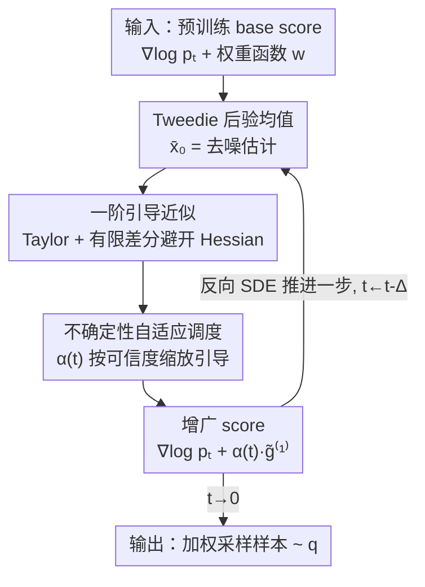

# Efficient Weighted Sampling via Score-based Generative Models

**会议**: CVPR 2026  
**论文**: [CVF Open Access](https://openaccess.thecvf.com/content/CVPR2026/html/Kim_Efficient_Weighted_Sampling_via_Score-based_Generative_Models_CVPR_2026_paper.html)  
**代码**: https://github.com/Heasung-Kim/efficient-weighted-sampling-via-score-based-generative-models  
**领域**: 扩散模型 / 图像生成  
**关键词**: 加权采样, score-based生成模型, training-free引导, 不确定性自适应调度, 扩散采样加速

## 一句话总结
针对"从 $w(x)p(x)$ 这类加权分布中采样"的需求，本文提出 LAGS：在预训练扩散模型的 score 上加一个**不含二阶导/Hessian**的一阶引导近似，再用一个由误差理论推出的**单参数时间调度器**动态调引导强度，做到完全 training-free，在 SDXL 上比 SOTA 重采样方法快 1.2–4.7×且 PickScore 还更高。

## 研究背景与动机
**领域现状**：加权采样（weighted sampling）指从 $q(x) \propto w(x)p(x)$ 采样——把一个基础分布 $p$ 用权重函数 $w$ 重新加权后再采。它在方差缩减、数据增强、奖励/偏好对齐、公平性纠偏等场景里无处不在。现在主流做法是借助预训练的 score-based 生成模型（SGM），用所谓 **guidance（引导）** 技巧：不重新训练模型，而是在推理时给 base score $\nabla_x\log p_t(x)$ 加一个修正项去逼近目标分布 $q$ 的 score。

**现有痛点**：现有 guidance 方法逼近 $q$ 的 score 精度有限，容易出现样本质量下降或生成动力学不稳。为了补救，SOTA 转向两类"昂贵"的推理时机制——一类是 **time-travel resampling**（FreeDoM，反复回退重采中间 latent）；一类是 **粒子重采样**（DAS，维护一批候选粒子做序贯蒙特卡洛并自适应重权）。它们确实能提质，但要么反复评估 score、要么维护大量粒子，**显存和算力开销激增**，在大模型（如 SDXL）和延迟敏感场景里基本用不起。

**核心矛盾**：精度和效率之间存在 trade-off——想逼近得准，要么算 score/权重的**二阶导（Hessian）**，要么反复重采样，两者都贵；而图省事的简单 guidance 又不稳、不准。问题根子有两处：(i) 怎么**不算 Hessian**就拿到足够准的引导项；(ii) 引导在反向扩散的不同时刻可信度不一样（早期噪声大时近似误差大），却被现有方法用固定强度或手调 heuristics 一刀切。

**本文目标**：拆成两个子问题——① 推导一个计算轻量、避开二阶导的引导项近似；② 给出一个有理论依据、按时间动态调引导强度的调度器。

**核心 idea**：用 Tweedie 后验均值 + 一阶 Taylor + 有限差分把引导项压成"只需一次额外 score 前向 + 一次 $w$ 反传"的轻量近似，再用误差上界理论推出一个**单参数时间调度函数** $\alpha(t)$ 去抑制早期不可信的引导——合起来就是 training-free 的 LAGS。

## 方法详解

### 整体框架
LAGS 的目标是在不微调预训练 SGM 的前提下，近似目标加权分布 $q_t$ 的 score 函数。出发点是一个干净的分解（式 5）：

$$\nabla_x \log q_t(x) = \nabla_x \log p_t(x) + g(x,t)$$

其中 $\nabla_x\log p_t(x)$ 是现成的预训练 base score，$g(x,t)$ 是把 base score 掰向目标分布所需的**引导项**。本文证明该引导项有精确形式 $g(x,t) = \nabla_x \log \mathbb{E}_{X_0^p \sim p(\cdot|X_t^p=x)}[w(X_0^p)]$（式 9），即"给定当前带噪状态 $x$，对去噪后初始状态上的权重 $w$ 求条件期望，再取 log 梯度"。但这个期望一般不可解，于是 LAGS 分两步把它做成可算的近似 $\tilde g(x,t)$，最后塞回反向 SDE 一步步采样。

整条运行时管线如下：每个反向扩散步，先用 Tweedie 公式从当前带噪样本估出去噪后验均值 $\bar x_{0|x,t}$，在它上面算一阶引导近似 $\tilde g^{(1)}$（避开 Hessian），再用调度器 $\alpha(t)$ 按当前时刻可信度缩放引导强度，得到增广 score 后推进一步 backward SDE，循环到 $t=0$ 出样本。

### 关键设计

**1. 一阶引导近似：用 Tweedie + Taylor + 有限差分把引导项压到不含二阶导**

精确引导项 $g(x,t)=\nabla_x\log\mathbb{E}[w(X_0^p)\mid X_t^p=x]$ 里那个条件期望不可解，直接硬算逼近又会牵出 score 和权重的 Hessian——对 SDXL 这种高容量 score 网络，求二阶导基本不可行。LAGS 的破法是三连击：先对 $w(X_0^p)$ 在其条件均值 $\bar x_{0|x,t}:=\mathbb{E}[X_0^p\mid X_t^p=x]$ 处做**一阶 Taylor 展开**，把期望里的 $w$ 近似成 $w(\bar x_{0|x,t})$，于是 $g(x,t)\approx \nabla_x\log w(\bar x_{0|x,t})$（式 10）；其中条件均值由 **Tweedie 公式**直接给出，只是 $x$ 和 base score 的线性组合：

$$\bar x_{0|x,t} = \tfrac{1}{\sqrt{\bar\alpha(t)}}\big(x + (1-\bar\alpha(t))\,\nabla_x\log p_t(x)\big)$$

对它用链式法则展开后会冒出 base density 的 Hessian $H_{\log p_t}(x)$（式 11），这正是要消掉的开销大头。LAGS 用**有限差分的方向导数**替代 Hessian-向量乘积：取一个很小的 $\epsilon>0$，用

$$\nabla_x\log p_t\big(x+\epsilon\,\nabla_{\bar x_{0}}\log w(\bar x_{0|x,t})\big) - \nabla_x\log p_t(x)$$

来近似 $\epsilon\,H_{\log p_t}(x)\,v$。最终得到的一阶近似 $\tilde g^{(1)}(x,t)$（式 13）**完全不含 $p$ 或 $w$ 的任何二阶导**。代价只是每步多一次 $w$ 的反传（算 $\nabla\log w$）和一次额外的 score 前向（算扰动点的 $\nabla_x\log p_t$）——比算 Hessian 或维护粒子群便宜得多，这是 LAGS 能在大模型上跑得快的根本原因。

**2. 不确定性自适应调度：用误差上界推出单参数时间调度 α(t)，抑制早期不可信引导**

一阶近似不是处处一样准。本文证明了 Theorem 1：近似误差 $\|g(x,t)-\tilde g^{(1)}(x,t)\|$ 有上界 $u(x,t)$，其主导项正比于 $(1-\bar\alpha(t))$ 以及去噪后验的条件方差 $\mathbb{E}[\|X_0^p-\bar x_{0|x,t}\|^2\mid X_t^p=x]$。直观含义是：在反向采样**早期**（$t$ 大、噪声重、$\bar\alpha(t)$ 小、条件方差大）误差大，引导不可信；随 $t\to0$ 条件方差趋零、误差消失，引导高度可信——这正解释了为何已有方法都要在早期加重采样或手调强度的"补丁"。

LAGS 不打补丁，而是引入一个时间调度函数 $\alpha(t):[0,T]\to[0,1]$ 去缩放引导：$\nabla_x\log q_t(x)\approx \nabla_x\log p_t(x)+\alpha(t)\,\tilde g^{(1)}(x,t)$，并选 $\alpha(t)$ 去最小化 score 近似的均方误差（式 15）。借助 Theorem 1 给出的方差上界（VP-SDE 下可写成若干 $(1-\bar\alpha)^i/\bar\alpha^j$ 项之和），Proposition 1 给出最优 $\alpha^*(t)$ 的闭式上包络解，并进一步退化成一个**只含一个可调常数 $c$** 的实用形式：

$$\alpha^*(t) \approx \Big(1 + c\,\tfrac{(1-\bar\alpha(t))^2}{\bar\alpha(t)^2}\Big)^{-1}$$

它沿反向采样方向单调递增（早期接近 0、$t\to0$ 时趋于 1），等于自动做到"早期少信引导、后期全信引导"。把式 13 与该调度合起来，最终增广 score 只有 $\epsilon$ 和 $c$ 两个超参（式 17）：

$$\tilde g(x,t) = \frac{\bar\alpha(t)^2}{\bar\alpha(t)^2 + c\,(1-\bar\alpha(t))^2}\,\tilde g^{(1)}(x,t)$$

和 FreeDoM 的"引导学习率"或 DAS 的 tempering 等 heuristic 相比，本调度不是手调，而是直接从不确定性分析推出来的，只用一个参数就能跨任务/跨模型泛化。（论文还在去掉某个简化假设时给出一个 0/1 硬门控的退化调度，⚠️ 具体推导以原文 Appendix B.2 为准。）

### 损失函数 / 训练策略
LAGS 完全 **training-free**：不训练、不微调任何模型，只在推理时改 score。全流程仅两个预设超参——有限差分步长 $\epsilon$ 与置信常数 $c$（所有实验固定 $c=10$，且对 $0.1\le c\le 20$ 都稳健）。相比为每个 $w$ 都要重训/微调密度的方法，省掉了全部针对性训练成本。

## 实验关键数据

### 主实验
评测覆盖三档：2D 多峰合成分布、SD/SDXL 文生图的人类偏好对齐、以及公平性/频域控制等附加应用。整体结论：在各设定下 LAGS 要么取到最低的 Wasserstein 距离（WD），要么取到最高平均权重，同时跑得最快。

**2D 多峰加权采样**（base 为 25 个高斯混合，目标权重沿心形流形）：LAGS 同时拿到**最低 WD 和最快运行时**，生成 $10^4$ 个样本仅需 **0.33 秒**，且无需任何二阶导或重采样；FreeDoM 覆盖广但常采到目标支撑外（$q(x)\approx0$ 处），DAS 精度高但算力开销大，LAGS 兼顾高覆盖与高精度。

**SDXL 文生图（PickScore 对齐）运行时与无参考画质**（运行时归一化到 LAGS=1.0，越快越好；粗体为 guidance 方法中最优）：

| 方法 | 相对运行时 ↓ | BRISQUE ↓ | MANIQA ↑ |
|--------|------------|-----------|----------|
| SDXL (default) | 0.377 | 21.48 ± 12.45 | 0.733 ± 0.139 |
| DPS | 1.193 | 24.52 ± 13.03 | 0.720 ± 0.139 |
| FreeDoM | 1.930 | 34.49 ± 15.20 | 0.711 ± 0.144 |
| DAS | 4.722 | **19.55 ± 12.75** | 0.720 ± 0.145 |
| DAS-1P | 1.202 | 22.56 ± 11.97 | 0.728 ± 0.130 |
| **LAGS (ours)** | **1.000** | 26.40 ± 12.99 | 0.720 ± 0.134 |

在目标指标 PickScore 与 HPS 上 LAGS 在 SD/SDXL 上均最优且最快；DAS 画质（BRISQUE）最好但要 **4.72×** 时间，LAGS 画质与之差距很小却快得多。SDXL 单图采样约 **85 秒**，DAS 约需其 4.72×。

### 消融实验
**加速比与跨指标表现**（同一组 guidance baseline 对比）：

| 设定 / 配置 | 关键结果 | 说明 |
|------------|---------|------|
| 高维加速（vs SOTA） | 最高 **4.7× 加速** | 高维场景下相对先前 SOTA 的整体提速 |
| SDXL vs DAS | **快 4.7×** | 重采样方法开销随模型增大而放大 |
| SDXL vs FreeDoM | **快 1.9×** | time-travel 重采样开销大 |
| SD 上 vs DAS-1p/DPS | 快 6% | 小模型上提速较小 |
| SDXL 上 vs DAS-1p/DPS | 快 16.7% | 模型越大、避开 Hessian 的收益越明显 |
| PickScore / HPS | guidance 方法中最高 | 目标指标全面领先 |
| ImageReward / CLIP (SDXL) | 略逊 DAS（差 <0.1 / <0.06） | 次要指标差距很小但 LAGS 更快 |
| $c$ 取值 $0.1\sim20$ | 性能稳定 | 调度器对置信常数鲁棒，固定 $c=10$ |

### 关键发现
- **打破"高分 ↔ 高算力"的 trade-off**：现有 baseline 普遍是"要么准要么快"，LAGS 在 PickScore 上更高的同时运行时最低，是本文最硬的卖点。
- **避开二阶导的收益随模型增大而放大**：SD 上仅快 6%，SDXL 上提到 16.7%——模型越大、Hessian 越贵，LAGS 的相对优势越突出，说明它面向大模型可扩展。
- **调度器对 $c$ 极不敏感**：固定 $c=10$ 跨所有模型/任务都赢，$0.1\le c\le20$ 性能稳定，几乎免调参。
- **画质略有取舍**：DAS 在 BRISQUE 上更优、LAGS 在目标对齐指标上更优，二者画质差距在 guidance 方法的波动范围内，但 LAGS 快 4.7×。

## 亮点与洞察
- **把"加 guidance"重新表述成一个有误差上界的近似问题**，再用上界反推调度——调度强度不是手调而是从理论里"长出来"的，这个思路可迁移到任何 training-free guidance 方法（如 inverse problem、reward 对齐）。
- **有限差分换 Hessian-向量乘积**是工程上最实用的一招：只多一次 score 前向就拿到二阶信息的方向导数，对所有大扩散模型通用，值得直接抄。
- **Tweedie 后验均值 + 一阶 Taylor** 把不可解的条件期望降成"在去噪估计点上算 $\nabla\log w$"，让任意可微权重 $w$（偏好分数、分类器、频域/颜色算子）都能即插即用，扩展性强。

## 局限与展望
- 一阶 Taylor 近似在权重 $w$ 高度非线性或目标分布极尖锐时可能不够准，论文未深入讨论这种 worst case 下的退化。
- 理论依赖若干假设（$w$ 及其导数有界、$p_0$ 紧支撑、VP-SDE、Assumption 3 的正交/不相关条件），其中 Assumption 3 为可解性而引入，去掉它会退化成 0/1 硬门控调度，实际效果对比交代较少 ⚠️（以原文 Appendix 为准）。
- 实验只在 training-free guidance 这一类内做公平对比，未与文本嵌入操纵、微调、LLM 等更强（但更贵）的对齐路线比较，故"最优"是限定在 training-free 赛道内。
- 画质指标（BRISQUE）并非最优，说明在追目标分数与维持感知画质之间仍有可调空间，可考虑把画质项也并入 $w$。

## 相关工作与启发
- **vs FreeDoM**：FreeDoM 用 time-travel 反复回退重采来稳住早期反向 SDE，本文则用误差理论推出的 $\alpha(t)$ 调度直接抑制早期不可信引导——同样针对"早期不稳"，但 LAGS 不重采样，SDXL 上快约 1.9×。
- **vs DAS**：DAS 用序贯蒙特卡洛维护粒子群做自适应重权，精度高但显存/算力随粒子数暴涨；LAGS 单轨迹、无重采样，SDXL 上快 4.7× 且目标分数更高，仅画质指标略逊。
- **vs DPS**：DPS 原为逆问题设计、借去噪均值估计器适配加权采样，但缺少对引导可信度的时间建模；LAGS 在同样用 Tweedie 均值的基础上补了一阶 Hessian-free 近似与调度，精度与稳定性更好。

## 评分
- 新颖性: ⭐⭐⭐⭐ 把加权采样引导转成带误差上界的一阶近似 + 理论驱动的单参数调度，视角干净
- 实验充分度: ⭐⭐⭐⭐ 从 2D 合成到 SDXL 全覆盖、含多指标与加速比，但主要靠图，部分对比在附录
- 写作质量: ⭐⭐⭐⭐ 理论推导严谨、动机清晰，公式偏密需要耐心
- 价值: ⭐⭐⭐⭐ training-free、即插即用、对大模型加速显著，落地价值高

<!-- RELATED:START -->

## 相关论文

- [\[CVPR 2026\] Memory-Efficient Fine-Tuning Diffusion Transformers via Dynamic Patch Sampling and Block Skipping](memory-efficient_fine-tuning_diffusion_transformers_via_dynamic_patch_sampling_a.md)
- [\[CVPR 2026\] Smoothing the Score Function to Enhance Generalization in Diffusion Models](smoothing_the_score_function_to_enhance_generalization_in_diffusion_models.md)
- [\[CVPR 2026\] Bias at the End of the Score: Demographic Biases in Reward Models for T2I](bias_reward_models_t2i.md)
- [\[CVPR 2026\] Adaptive Spectral Feature Forecasting for Diffusion Sampling Acceleration](adaptive_spectral_feature_forecasting_for_diffusion_sampling_acceleration.md)
- [\[CVPR 2026\] Few-Step Diffusion Sampling Through Instance-Aware Discretizations](few-step_diffusion_sampling_through_instance-aware_discretizations.md)

<!-- RELATED:END -->
