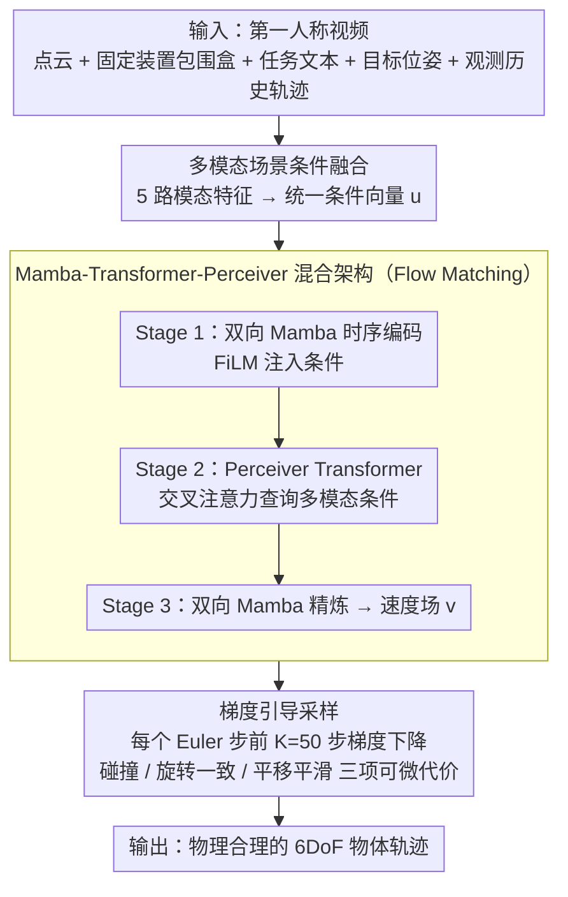

# EgoFlow: Gradient-Guided Flow Matching for Egocentric 6DoF Object Motion Generation

**会议**: CVPR 2026  
**arXiv**: [2604.01421](https://arxiv.org/abs/2604.01421)  
**代码**: [https://abhi-rf.github.io/egoflow/](https://abhi-rf.github.io/egoflow/)  
**领域**: 图像生成  
**关键词**: 第一人称视频, 6DoF轨迹生成, Flow Matching, 梯度引导采样, Mamba-Transformer混合架构

## 一句话总结
EgoFlow 提出一种基于 Flow Matching 的生成框架，通过 Mamba-Transformer-Perceiver 混合架构融合多模态场景条件，并在推理时用梯度引导采样施加可微的物理约束（碰撞避免、运动平滑性），从第一人称视频生成物理合理的 6DoF 物体运动轨迹，碰撞率降低高达 79%。

## 研究背景与动机

1. **领域现状**：随着 AR 设备的普及和大规模第一人称数据集（EgoExo4D、HOT3D、HD-EPIC）的出现，从第一人称视角理解和预测物体运动成为具身感知和机器人交互的核心能力。现有方法主要基于扩散模型或自回归预测来生成物体轨迹。

2. **现有痛点**：
    - 第一人称场景高度多样且凌乱，物体频繁被遮挡，视野有限且相机运动快速导致模糊
    - 长期预测中微小空间误差会随时间累积，导致不真实的运动模式
    - 现有生成模型缺乏显式的物理推理能力，生成的轨迹无法保证无碰撞和动态平滑

3. **核心矛盾**：生成模型要同时满足两个看似矛盾的要求——运动的多样性（学习丰富的运动分布）和物理一致性（碰撞避免、运动平滑），而纯数据驱动的方法在新场景配置下无法显式推理物理约束。

4. **本文目标**
    - 如何生成长期、物理合理的 6DoF 物体轨迹？
    - 如何在不需要物理监督的情况下确保生成轨迹的碰撞避免和运动平滑？
    - 如何有效融合场景几何、语义、目标等多模态条件？

5. **切入角度**：用 Flow Matching 替代扩散模型学习确定性传输场实现高效轨迹合成，用梯度引导采样在推理时注入物理约束（训练-测试解耦），用 Mamba+Transformer+Perceiver 混合架构处理长序列多模态融合。

6. **核心 idea**：用 Flow Matching 学运动分布 + 梯度引导施加物理约束的组合，实现了"模型学数据分布、约束在推理时按需注入"的优雅解耦。

## 方法详解

### 整体框架
EgoFlow 要解决的是：从一段第一人称视频里，预测某个物体接下来会怎么动——不光要轨迹合理，还得不穿墙、不抖动。整体怎么转可以拆成三段。先把场景里能拿到的信息（点云、固定装置的包围盒、任务文本、目标位姿）全部喂进一个多模态融合模块，压成一个统一的条件向量 $\mathbf{u}$；再用一个 Mamba-Transformer 混合架构的 Flow Matching 模型，在 $\mathbf{u}$ 的条件下从噪声把 6DoF 轨迹 $\mathbf{x}_{H+1:T} \in \mathbb{R}^{(T-H) \times 9}$（位置 $\mathbb{R}^3$ + 连续 6D 旋转 $\mathbb{R}^6$）一步步流出来；最后在推理的每个积分步里，用梯度引导把速度场往"不碰撞、更平滑"的方向掰一掰。训练阶段只看历史 30% 的观测轨迹，预测剩下的 70%。

### 关键设计

**1. 多模态场景条件融合：单一模态描述不全一个凌乱的第一人称场景**

第一人称场景的麻烦在于光看轨迹本身根本不够——几何告诉你哪里会撞、语义告诉你这个物体一般会怎么动、目标告诉你它最终要去哪。EgoFlow 因此把五种模态揉进同一个条件向量。轨迹动态把观测历史 $\mathbf{x}_{1:H}$ 线性投影成时序嵌入 $\mathbf{F}_{traj}$；局部几何用 PointNet++ 编码点云，再靠逆距离加权把点特征传播到物体中心位置；固定装置布局把包围盒几何嵌入后过一层自注意力，捕获诸如"台面在柜子上方"这类空间关系；语义提示用 CLIP 编码物体类别和任务描述；目标描述则把目标位姿 $\mathbf{x}_T$ 经 MLP 映成一个目标 token。这些特征最终拼起来再投影成统一条件：

$$\mathbf{u} = \text{MLP}([\mathbf{F}_{traj}, \mathbf{F}_p, \mathbf{F}_g, \mathbf{F}_b, \mathbf{F}_s, \mathbf{F}_{goal}])$$

每路模态各补一块拼图：几何管碰撞、语义管行为先验、目标管长期方向，缺哪一路后面的实验都能看到明显退化。

**2. Mamba-Transformer-Perceiver 混合架构：长轨迹序列和多模态推理对架构的要求不一样**

轨迹序列很长，纯 Transformer 的二次复杂度吃不消；但多模态融合又恰恰需要注意力那种"按需查询"的能力。EgoFlow 干脆把两者分阶段叠起来，让各自做自己擅长的事。Stage 1 先用 3 层双向 Mamba 做时序编码，条件通过 FiLM 调制注入：

$$\mathbf{h}_t' = \gamma(\mathbf{u}_t) \odot \mathbf{h}_t + \beta(\mathbf{u}_t)$$

Mamba 的线性复杂度正好啃得动长序列，双向处理让模型同时看到过去和未来上下文。Stage 2 接 6 层 Perceiver 风格的 Transformer：先自注意力建模轨迹 token 之间的时序关系，再用交叉注意力去查询多模态条件 $\mathbf{u}_t$，最后 FFN 精炼融合后的表征——这一阶段专门处理"哪个模态此刻该重点看"的选择性融合。Stage 3 再叠 3 层双向 Mamba + FiLM 做轨迹精炼，过一个线性头吐出 $\mathbb{R}^9$ 的速度预测。整条链路是先压缩时序、再融合模态、最后精炼输出，FiLM 负责高效的全局调制、交叉注意力负责精细的选择性融合，两种条件注入方式分工明确。

**3. 梯度引导采样：把物理约束从训练里挪到推理时按需注入**

纯数据驱动的生成模型有个天生短板——它只见过训练集里那些无碰撞的示范，换到新场景配置就不知道怎么显式避障。EgoFlow 的办法是把"学运动分布"和"满足物理约束"彻底解耦：模型本身只负责学分布，物理约束放到推理时再加。具体做法是在每个 Euler 积分步之前，对当前预测的速度场做 $K=50$ 步梯度下降，把它往满足约束的方向推：

$$\mathbf{v}_\theta^{(k+1)} = \mathbf{v}_\theta^{(k)} - \alpha \nabla_\mathbf{v} \mathcal{J}, \quad \mathcal{J} = \mathcal{J}_{coll} + \lambda_{rot}\mathcal{J}_{rot} + \lambda_{vel}\mathcal{J}_{vel}$$

三项代价各管一件事：碰撞避免用 SDF 惩罚轨迹点与固定装置之间的距离违规（安全边距 $\epsilon=5$cm），旋转一致性用相邻旋转变化的余弦相似度压住突变，平移平滑性则惩罚线性加速度。三项全可微，梯度能一路反传到速度场上。因为约束不进训练，模型不会被特定场景的避障逻辑带偏，约束强度也能在推理时随场景灵活调；代价是这 50 步优化会拖慢推理。

### 损失函数 / 训练策略
- Flow Matching 损失：$\mathcal{L}_{FM} = \mathbb{E}_{t, \mathbf{x}_0, \mathbf{x}_1}[\|\mathbf{v}_\theta(\mathbf{x}_t, t, \mathcal{S}) - (\mathbf{x}_1 - \mathbf{x}_0)\|_1]$
- 线性插值路径：$\mathbf{x}_t = (1-t)\mathbf{x}_0 + t\mathbf{x}_1$
- 位置和旋转分量等权 L1 损失
- AdamW，lr=$10^{-4}$，batch 32，100 epochs，20 步 Euler 采样

## 实验关键数据

### 主实验 — HD-EPIC 数据集

| 方法 | ADE↓ | FDE↓ | Frechet↓ | Geodesic↓ | Collision↓ |
|------|------|------|----------|-----------|------------|
| GIMO | 0.285 | 0.509 | 0.210 | **0.725** | 23.5% |
| CHOIS | 0.471 | 0.755 | 0.262 | 1.255 | 18.7% |
| M2Diffuser | 0.601 | 0.442 | 0.476 | 1.788 | 8.5% |
| EgoScaler | 1.330 | 1.494 | 0.315 | 1.614 | 35.8% |
| **EgoFlow** | **0.279** | **0.102** | **0.197** | 1.141 | **2.5%** |

### 零样本迁移 — Ego-Exo4D→HOT3D

| 方法 | ADE↓ | FDE↓ | GD↓ |
|------|------|------|-----|
| GIMO | 0.299 | 0.436 | 2.06 |
| EgoScaler | 0.351 | 0.540 | **0.856** |
| **EgoFlow** | **0.265** | **0.027** | 1.49 |

### 消融实验 — HD-EPIC 输入和引导消融

| 配置 | ADE↓ | FDE↓ | Frechet↓ | Coll.↓ |
|------|------|------|----------|--------|
| Full model | 0.279 | 0.102 | 0.197 | 2.5% |
| w/o 点云 $\mathcal{P}$ | 0.305 | 0.110 | 0.205 | 2.9% |
| w/o 动作文本 | 0.330 | 0.147 | 0.213 | 3.1% |
| w/o 目标位姿 $\mathbf{x}_T$ | 0.386 | 0.619 | 0.239 | 3.1% |
| w/o 观测历史 | 0.405 | 0.207 | 0.275 | - |

### 关键发现
- **碰撞率大幅降低**：EgoFlow 仅 2.5%，比次优的 M2Diffuser (8.5%) 降低 71%，比 GIMO (23.5%) 降低 89%。梯度引导采样是关键贡献
- **终点误差极低**：FDE=0.102（HD-EPIC）和 0.027（HOT3D），远优于所有基线，目标位姿条件 $\mathbf{x}_T$ 的贡献最大（消融中去掉后 FDE 从 0.102 涨到 0.619）
- **跨数据集泛化优秀**：在 Ego-Exo4D 训练、HOT3D 零样本测试的设置下仍大幅领先
- **目标位姿是最关键的条件输入**：去掉 $\mathbf{x}_T$ 后 FDE 退化最严重（6x），而去掉点云或动作文本的影响相对较小

## 亮点与洞察
- **训练-推理约束解耦**：模型只在无碰撞的示范上训练（学运动分布），物理约束通过梯度引导在推理时注入。这个设计避免了"训练时没见过碰撞→推理时不知道避障"的分布不匹配问题，非常优雅
- **混合架构的精心设计**：FiLM 做全局调制、交叉注意力做选择性融合，两种条件注入方式各有分工——FiLM 高效但不够精细，交叉注意力精细但计算更重，三阶段架构让两者各尽其能
- **Flow Matching 替代扩散**：确定性传输场比随机扩散更适合轨迹生成——更平滑的概率路径、更少的采样步数（仅 20 步），产生更连贯的轨迹

## 局限与展望
- 梯度引导的 50 步优化增加了推理时间开销，可以探索更高效的约束注入方式（如 classifier-free guidance 或学习到的约束网络）
- SDF 碰撞检测基于简单的 OBB（有向包围盒），复杂形状的物体可能需要更精确的碰撞检测
- 训练数据的轨迹是从手部运动代理得到的（刚体耦合假设），引入了噪声和近似误差
- 未考虑动态障碍物（仅处理静态场景固定装置），实际交互中可能有其他移动物体

## 相关工作与启发
- **vs EgoScaler**: EgoScaler 基于 PointLLM 的视觉-语言生成框架，但位置误差大且碰撞率高 (35.8%)；EgoFlow 在位置精度和物理合理性上全面超越
- **vs M2Diffuser**: M2Diffuser 也有推理时物理约束，但基于扩散模型且碰撞率仍有 8.5%；EgoFlow 用 Flow Matching + 更精细的梯度引导将碰撞率降至 2.5%
- **vs GMT**: GMT 是 EgoFlow 的前序工作，共享多模态条件设计思路，EgoFlow 在此基础上引入 Flow Matching + Mamba 混合架构 + 梯度引导

## 评分
- 新颖性: ⭐⭐⭐⭐ Flow Matching + 梯度引导物理约束 + Mamba-Transformer 混合架构的组合在轨迹生成领域是新颖的
- 实验充分度: ⭐⭐⭐⭐⭐ 三个数据集、七个基线、全面的消融、零样本迁移、定性可视化
- 写作质量: ⭐⭐⭐⭐ 方法描述条理清晰，各模块设计动机明确
- 价值: ⭐⭐⭐⭐ 物理引导的轨迹生成方法在机器人和 AR 领域有广泛应用前景

<!-- RELATED:START -->

## 相关论文

- [\[CVPR 2026\] VeCoR — Velocity Contrastive Regularization for Flow Matching](vecor_--_velocity_contrastive_regularization_for_flow_matching.md)
- [\[CVPR 2026\] HazeMatching: Dehazing Light Microscopy Images with Guided Conditional Flow Matching](hazematching_dehazing_light_microscopy_images_with_guided_conditional_flow_match.md)
- [\[CVPR 2026\] COT-FM: Cluster-wise Optimal Transport Flow Matching](cot-fm_cluster-wise_optimal_transport_flow_matching.md)
- [\[CVPR 2026\] LeapAlign: Post-Training Flow Matching Models at Any Generation Step by Building Two-Step Trajectories](leapalign_post_training_flow_matching_models_at_any_generation_step.md)
- [\[CVPR 2026\] MPDiT: Multi-Patch Global-to-Local Transformer Architecture for Efficient Flow Matching](mpdit_multi-patch_global-to-local_transformer_architecture_for_efficient_flow_ma.md)

<!-- RELATED:END -->
