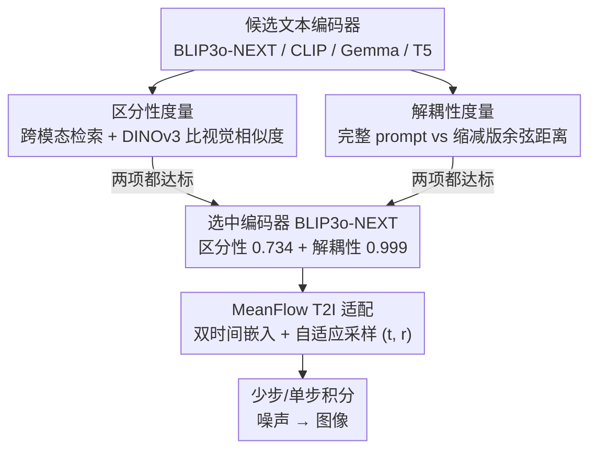

# Extending One-Step Image Generation from Class Labels to Text via Discriminative Text Representation

**会议**: CVPR 2026  
**arXiv**: [2604.18168](https://arxiv.org/abs/2604.18168)  
**代码**: [https://github.com/AMAP-ML/EMF](https://github.com/AMAP-ML/EMF)  
**领域**: 图像生成  
**关键词**: MeanFlow, 单步生成, 文本到图像, 文本编码器, 语义区分性

## 一句话总结

首次将 MeanFlow 框架从类别标签条件扩展到文本条件图像生成，发现限制步数下文本表示的语义区分性和解耦性是关键瓶颈，基于 BLIP3o-NEXT 文本编码器实现了高质量的少步/单步 T2I 生成。

## 研究背景与动机

**领域现状**：MeanFlow 是一种有理论基础的 flow matching 加速方法，通过学习两个时间点之间的平均速度场实现单步生成，在 ImageNet 类别条件生成上取得了与标准多步模型媲美的效果。后续工作（如改进训练策略和架构）也主要集中在类别条件设定下。

**现有痛点**：将 MeanFlow 从固定类别标签扩展到灵活文本输入看似直接，实际上困难重重。直接将 LLM 文本编码器接入 MeanFlow 框架并使用常规训练策略，效果令人失望。JVP 项的稳定性问题被反复认定为将 consistency 类方法扩展到大规模 T2I 的主要瓶颈。

**核心矛盾**：类别标签是离散且易于区分的条件信号，而文本条件是连续且语义复杂的。在极少步（如单步）推理中，模型几乎没有机会通过多次去噪来修正语义偏差，因此对条件信号的质量要求极高。

**本文目标**：(1) 理解为什么某些文本编码器在少步设定下失败；(2) 识别高质量文本表示应具备的关键属性；(3) 基于这些发现实现首个有效的文本条件 MeanFlow 生成模型。

**切入角度**：作者对比了不同文本编码器在限制推理步数时的表现差异，发现 BLIP3o-NEXT 的文本编码器即使在单步时也能保持基本语义完整性，而 SANA-1.5 的编码器在少步时语义严重退化。

**核心 idea**：高质量文本表示需要两个核心属性——区分性（discriminability，区分细微语义差异）和解耦性（disentanglement，保持文本的语言结构），具备这两个属性的编码器才能构建可靠的速度场方向，使少步甚至单步生成成为可能。

## 方法详解

### 整体框架

这篇论文要解决的问题是：MeanFlow 在 ImageNet 类别条件上已经能做到单步生成，但一旦把条件从离散类别换成自由文本，直接接上 LLM 文本编码器再用常规训练就会失败。作者的整条思路不是再去硬抠 JVP 项的数值稳定性，而是先回答「什么样的文本表示才撑得起少步生成」，找到两个可量化的属性（区分性、解耦性）后，再以同时满足这两个属性的 BLIP3o-NEXT 编码器为基础，把它的预训练扩散模型适配成 MeanFlow。

整体管线是：输入文本先经编码器得到文本特征，速度网络在此条件下预测从时间 $r$ 到 $t$ 的平均速度场，推理时用极少步（甚至单步）从噪声积分到图像。相比原始 MeanFlow，唯一的结构改动是把单一时间嵌入拆成两路——$\phi_{interval}(t-r)$ 编码时间区间的长度、$\phi_{end}(t)$ 编码当前所处的时间点，两者相加得到条件嵌入 $\phi_{cond}(t,r) = \phi_{interval}(t-r) + \phi_{end}(t)$，与文本特征一起送进速度网络，让模型既知道「现在在哪」也知道「这一步要跨多远」。

需要强调的是，本文的核心并非新结构，而是「先用两个属性筛出合格编码器，再在它上面适配 MeanFlow」这条选择—适配链路：候选编码器先分别过区分性、解耦性两道度量，两项都达标的（BLIP3o-NEXT）才被选中，随后做少步/单步生成的适配。

### 关键设计

**1. 区分性度量：判断文本编码器能否分清语义相近但不同的描述**

在单步生成里模型没有多次去噪来纠偏，每一步的速度场方向必须一次到位，因此条件信号本身要足够「锐利」。作者用一个跨模态检索实验来量化这种锐利度：在 COCO 2017 的 118K 训练集上，用待评估的编码器编码查询 prompt，检索出最相似的图文对，再用 DINOv3 比较检索到的图像与查询对应图像的视觉特征相似度。得分越高，说明文本表示与图像表示对齐得越好、越能把语义相近但不同的描述拉开。结果上 BLIP3o-NEXT 拿到 0.734、CLIP 0.730、Gemma 0.713，而 T5 只有 0.634——区分性差的编码器会给出模糊的速度场方向，这正是它们在少步设定下崩掉的直接原因。

**2. 解耦性度量：判断文本表示会不会因为措辞微调就整体漂移**

光有区分性还不够，编码器还得保持文本的语言结构，不能因为局部改动就让整体表示发生不成比例的位移。作者在 DPG-Bench 的完整 prompt 上随机删掉一部分文本得到缩减版，把完整版和缩减版分别编码后算余弦距离，距离越小说明结构越稳定。BLIP3o-NEXT 在这一项接近满分 0.999，Gemma 0.987，CLIP 0.967，T5 仅 0.893。解耦性好的编码器能让相似文本落在表示空间相近的位置，速度场因此平滑可预测；解耦性差则会在文本轻微变化时引入剧烈跳变，少步推理来不及消化。

**3. MeanFlow T2I 适配：在满足上述两属性的编码器上微调出少步/单步生成**

确定了挑编码器的标准后，剩下的工作是把 BLIP3o-NEXT 的预训练扩散模型改造成 MeanFlow。具体做法是把原本的时间嵌入层复制成区间层和终点层（即上面的双时间嵌入），训练时自适应地采样时间步对 $(t, r)$——从均匀或 logit-normal 分布中取样，并在训练过程中逐渐提高 $t \neq r$ 的比例，让模型从「学瞬时速度」平滑过渡到「学跨区间平均速度」。训练目标沿用标准 MeanFlow 形式

$$\mathcal{L}_{MF}(\theta) = \mathbb{E}\big[\|u_\theta - \text{sg}(u_{tgt})\|^2\big]$$

其中回归目标 $u_{tgt}$ 通过 JVP 计算、并用 stop-gradient 截断。之所以选择在预训练模型上微调而非从头训练，是因为预训练权重里已经编码了可用的速度场，微调代价远低；但这条捷径成立的前提恰恰是编码器同时满足区分性和解耦性——消融实验显示，换成 SANA-1.5 编码器即便额外做 SFT 也救不回来，说明瓶颈在编码器属性而非训练数据。

### 损失函数 / 训练策略

使用约 170K 样本（BLIP3o-60k + shareGPT-4o + Echo-4o），学习率 1e-5，batch size 128，训练 150 epochs。基于 BLIP3o-NEXT 模型微调。

## 实验关键数据

### 主实验

| 模型 | 步数 | GenEval↑ | DPG-Bench↑ | HPSv2↑ |
|------|------|---------|-----------|--------|
| BLIP3o-NEXT | 30 | 0.91 | 82.05 | 29.42 |
| BLIP3o-NEXT | 4 | 0.86 | 78.15 | 26.96 |
| BLIP3o-NEXT | 1 | 0.46 | 57.05 | 18.54 |
| **EMF (本文)** | 4 | **0.90** | **81.20** | **29.25** |
| **EMF (本文)** | 2 | 0.85 | 79.44 | 27.21 |
| **EMF (本文)** | 1 | 0.74 | 77.36 | 25.77 |
| SANA-Sprint | 4 | 0.77 | - | - |
| rCM | 4 | 0.83 | - | - |

### 消融实验

| 配置 | GenEval (1步) | 说明 |
|------|-------------|------|
| BLIP3o-NEXT 编码器 + MeanFlow | 0.74 | 高区分性+高解耦性 |
| SANA-1.5 编码器 + MeanFlow | 失败 | 区分性不足 |
| SANA-1.5 编码器 + SFT微调 + MeanFlow | 仍失败 | 微调无法弥补编码器缺陷 |

### 关键发现

- EMF 4 步生成几乎匹配 BLIP3o-NEXT 30 步（GenEval 0.90 vs 0.91），实现了约 7.5× 的加速
- EMF 超越所有蒸馏模型（SDXL-Turbo/Lightning/DMD2 等），且不需要教师模型
- SANA-1.5 编码器即使经过 SFT 微调也无法在 MeanFlow 中有效工作，证明编码器本身的属性而非训练数据是瓶颈
- EMF 的性能随步数增加持续提升（1步→2步→4步→8步），不像传统 consistency 模型那样出现步数增加后性能饱和甚至下降

## 亮点与洞察

- 对文本编码器"区分性"和"解耦性"的系统分析非常有价值。之前的工作往往只看最终生成质量，本文深入到文本表示空间的属性分析，为选择/设计少步生成的文本编码器提供了明确指标
- "为什么类别标签在 MeanFlow 中有效但文本不行"的分析很有洞察：类别标签天然离散且易区分，等于天然具备高区分性
- 与 consistency 方法的对比分析也很精彩：consistency 方法步数增加后可能退化，而 MeanFlow 作为连续流的稳定离散化可以持续受益于更多步

## 局限与展望

- 目前仅在 BLIP3o-NEXT 上验证，该编码器恰好同时具备高区分性和解耦性，能否推广到其他符合条件的编码器尚不确定
- 1 步生成的 GenEval 0.74 与多步基线仍有差距，距离真正的单步高质量 T2I 还有空间
- JVP 计算的数值稳定性问题虽然通过选择好的编码器缓解，但没有根本解决
- 未来方向：可探索专门为少步生成设计/训练的文本编码器

## 相关工作与启发

- **vs 原始 MeanFlow**: 仅支持类别条件，本文首次扩展到文本条件
- **vs SANA-Sprint**: 蒸馏方法，4 步 GenEval 0.77，本文 0.90 显著更优
- **vs Consistency Models**: 步数增加可能退化，本文的 MeanFlow 方法可持续提升

## 评分

- 新颖性: ⭐⭐⭐⭐ 首次将 MeanFlow 扩展到 T2I，文本表示分析有深度
- 实验充分度: ⭐⭐⭐⭐ 多基准对比充分，编码器分析系统
- 写作质量: ⭐⭐⭐⭐ 从观察到分析到方法的推导逻辑清晰
- 价值: ⭐⭐⭐⭐ 为少步 T2I 生成提供了编码器选择的指导性见解

<!-- RELATED:START -->

## 相关论文

- [\[CVPR 2026\] Temporal Equilibrium MeanFlow: Bridging the Scale Gap for One-Step Generation](temporal_equilibrium_meanflow_bridging_the_scale_gap_for_one-step_generation.md)
- [\[CVPR 2026\] Self-Evaluation Unlocks Any-Step Text-to-Image Generation](self-evaluation_unlocks_any-step_text-to-image_generation.md)
- [\[CVPR 2026\] Resolving the Identity Crisis in Text-to-Image Generation](resolving_the_identity_crisis_in_text-to-image_generation.md)
- [\[CVPR 2026\] ChordEdit: One-Step Low-Energy Transport for Image Editing](chordedit_one-step_low-energy_transport_for_image_editing.md)
- [\[CVPR 2026\] DUO-VSR: Dual-Stream Distillation for One-Step Video Super-Resolution](duo-vsr_dual-stream_distillation_for_one-step_video_super-resolution.md)

<!-- RELATED:END -->
