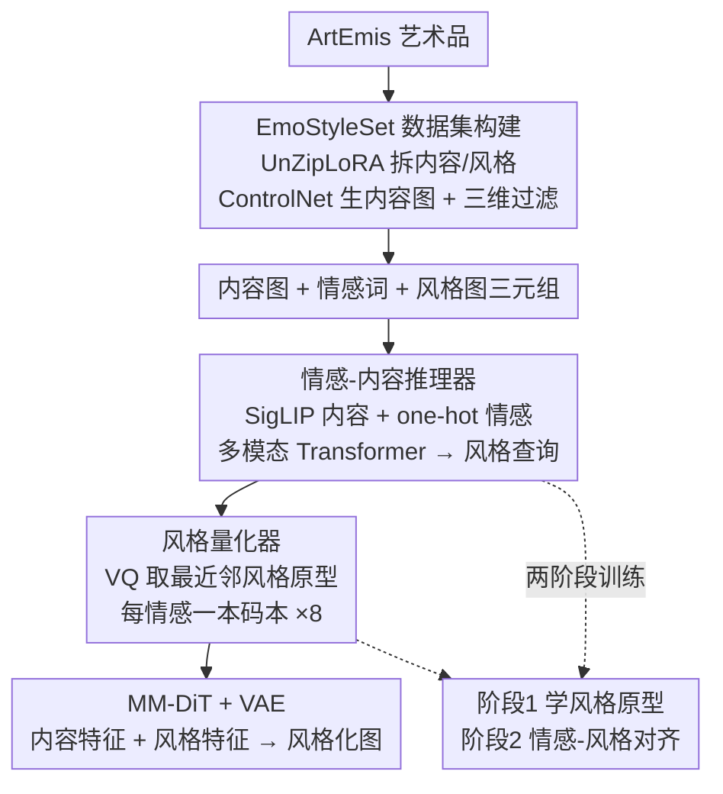

# EmoStyle: Emotion-Driven Image Stylization

**会议**: CVPR 2026  
**论文**: [CVF Open Access](https://openaccess.thecvf.com/content/CVPR2026/html/Yang_EmoStyle_Emotion-Driven_Image_Stylization_CVPR_2026_paper.html)  
**代码**: 项目页 https://vcc.tech/research/2026/EmoStyle （未见公开仓库）  
**领域**: 图像生成 / 风格迁移 / 情感计算  
**关键词**: 情感驱动风格化、情感-内容推理、风格量化、VQ 风格字典、流匹配  

## 一句话总结
EmoStyle 提出"情感驱动图像风格化（AIS）"新任务——只用一个情感词（如"恐惧""敬畏"）就把内容图渲染成既保内容、又能激起目标情绪的艺术风格图，靠一个情感-内容推理器把情感和内容融成风格查询、再用风格量化器把连续特征离散成"每种情感一本"的风格码本，最终在 Emo-A 指标上从次优的约 24% 拉到 33.36%。

## 研究背景与动机
**领域现状**：让图像"变好看"的风格迁移（Style Transfer, ST）已经很成熟，但它要么需要一张参考风格图，要么需要用户用"油画 / 莫奈 / 立体主义"这类术语描述风格——这要求一定的艺术素养。另一条线是情感图像操控（Affective Image Manipulation, AIM），它通过调色或改内容来唤起情绪，但目标是生成"真实"图片，没把艺术风格当成情感表达的工具。

**现有痛点**：艺术本质上是"传递情感"的媒介，而现有方法把"风格"和"情感"割裂开了——ST 只管风格不管情感，AIM 只管情感不管艺术风格。少数情感感知的风格迁移工作要么仍依赖参考图，要么需要精心撰写的文字描述，门槛高、不好用。

**核心矛盾**：要在"情感表达力"和"内容保持"之间同时做好，是个非平凡的 trade-off——风格化越强、情绪越浓，往往结构和语义就越容易被破坏；反过来保内容又会让风格变弱、情绪传不出去。而且根本上缺一个能学"情感↔风格"映射的数据：没有任何数据集提供"内容图-情感-风格图"三元组。

**本文目标**：定义并解决一个新任务 AIS——给定一张内容图 + 一个情感词，输出一张保内容、且能唤起该情感的艺术风格图，需同时解决（1）训练数据缺失、（2）情感-风格映射两大挑战。

**切入角度**：作者借用艺术史观察——风格和内容本就交织，艺术家会根据题材和情感选择风格；同时风格在人类感知里是"离散类别"（印象派、现代主义、写实主义），而非连续渐变。

**核心 idea**：用"情感-内容推理 + 风格离散量化"替代"参考图 / 术语提示"，把每种情感绑定到一本可学习的离散风格码本上，从而只凭情感词就能做可控、可解释的风格化。

## 方法详解

### 整体框架
EmoStyle 要解决的是"给情感词 + 内容图 → 出风格化情感图"。整条管线分两大阶段：先离线构造一个三元组数据集 EmoStyleSet 把"情感"从"艺术品"里剥出来；再在线跑一个两模块网络——**情感-内容推理器**把情感和内容融成一条"风格查询"，**风格量化器**把这条连续查询对齐到对应情感的离散风格原型，最后把"内容特征（VAE 编码）+ 风格特征（量化原型）"一起喂给冻结的 MM-DiT 生成图。训练分两阶段：先学风格原型本身，再学"给定情感-内容该选哪个原型"。

### 关键设计

**1. EmoStyleSet：把"情感"从艺术品里剥离出来的三元组数据集**

AIS 的第一道坎是没数据：现有艺术情感数据集（ArtEmis、EmoArt）只给"整张艺术品 → 情感标签"，但没区分这份情感究竟来自内容还是风格，而 AIS 要学的恰恰是"风格如何传递情感"，所以必须把风格从内容里拆出来。作者从 ArtEmis 出发构造 10,041 个三元组：先用 BLIP-2 给艺术品生成描述，用 UnZipLoRA 把每张图拆成"内容 LoRA + 风格 LoRA"；再把原图转成 Canny 边缘图保结构，把 Canny + 描述 + 内容 LoRA 一起喂 ControlNet，生成的输出就当作"去掉风格的内容图"。由于内容图是无监督生成的会有噪声，作者从风格、内容、情感三个维度过滤：内容上用 CLIP 相似度查语义一致、用 LPIPS 查结构保持；情感上用在 ArtEmis 上训练的分类器核对三元组确实匹配目标情感；最后人工核验风格图与内容图有明显风格差异。这套"拆解—重建—过滤"流程是后续监督训练能成立的前提。

**2. 情感-内容推理器：把情感词编成正交 one-hot 再与内容跨模态推理出风格查询**

痛点是"情感感知的风格化"——同样的内容，配什么风格才能恰好唤起目标情绪。作者先用 SigLIP 抽内容图语义特征；关键的是情感如何编码：以往工作把情感当文本喂 LLM，但 LLM 容易把情感词联想成"人脸表情"，而 AIS 里的情感是更宽的艺术语境。因此作者把每个情感编成 $1\times8$ 的 one-hot 向量，好处是（1）情感之间相互正交、（2）所有向量合起来张成整个情感空间。语义特征和情感特征在不同空间，先各自过投影层映射到统一嵌入空间，把两者投影输出拼接初始化 $q_i^0$，再送入一个四层多模态 Transformer，用自注意力和交叉注意力建模情感与内容的交互，逐层更新出"情感感知、内容条件"的风格查询 $q_i$：

$$q_i^k = \mathrm{MSA}(\mathrm{LN}(q_i^{k-1})) + q_i^{k-1}, \qquad q_i^k = \mathrm{MLP}(\mathrm{LN}(q_i^k)) + q_i^k$$

其中 $\mathrm{LN}$ 为 LayerNorm，$k$ 是 Transformer 层索引。这条查询不是直接生成风格，而是为下一步"在码本里选风格原型"提供检索向量。

**3. 风格量化器：把连续风格查询离散成"每情感一本"的 VQ 码本**

既然风格在人类认知里是离散类别而非连续渐变，作者引入风格量化器把连续特征离散到一组原型，换来可解释、可控。情感与风格本是多对多（一种情感能用多种风格表达、一种风格能唤起多种情感），但作为 AIS 的初次探索，作者简化为一对多：借鉴 VQ-VAE，为 8 种情感各建一本风格字典 $Z_e=\{z_k^e\}_{k=1}^K$。初始化时用 USO 的风格编码器 $E_s(\cdot)$ 抽所有艺术品的风格特征、算两两相似度，再用相似度阈值挑出彼此区分的风格原型来填字典。推理时对风格查询 $q_i$ 做向量量化 $Q(\cdot)$，取字典里最近邻原型替换它，把连续表示变离散：

$$Q(q_i) = z_k^e, \quad \text{where } k = \arg\min_j \lVert q_i - z_j^e \rVert_2$$

离散化让"情感-风格"映射被简化成"从对应情感码本里挑一个原型"，既保证风格与内容协调，又让用户能为同一情感选不同原型，得到可控、可解释的多样化结果。

**4. 两阶段训练 + 情感分数加权：先学原型、再学对齐**

骨干是冻结的 MM-DiT：内容图过 VAE 编码成内容潜特征，风格量化器输出当风格特征，两者一起进 MM-DiT 生成；训练时只更新推理器和量化器。两个模块分工——量化器学"每个原型代表什么风格"，推理器学"给定情感-内容该选哪个原型"，因此采用两阶段：**阶段一学风格原型**，用 EmoStyleSet 的风格图把原型聚到风格空间里，本质是聚类（每个风格特征归到最近质心、质心随成员迭代更新）：

$$L_{style} = \lVert z_k^e - E_s(I_s)\rVert_2^2, \quad k = \arg\min_j \lVert E_s(I_s) - z_j^e \rVert_2$$

**阶段二做情感-风格对齐**，用三元组在特征和像素两个层面把生成结果对齐 GT：像素级用标准流匹配损失 $L_{FM}=\mathbb{E}_{x_0,t,\epsilon}[w(t)\lVert v_\theta - v_t\rVert^2]$（$v_\theta$ 为预测速度、$v_t$ 为真值速度）；特征级用对齐损失 $L_{align}=\lVert q_i - z_k^e\rVert_2^2$，逼着风格查询跟随 EmoStyleSet 的风格分布。此外为保情感保真，用 ArtEmis 投票得到的情感分数 $e_n$ 给不同样本的损失加权：$L_1=\frac{1}{N}\sum_n e_n\cdot L_{style}$，$L_2=\frac{1}{N}\sum_n e_n\cdot(L_{FM}+L_{align})$——情感越"确定"的样本权重越高，避免被模糊标注样本带偏。

## 实验关键数据

### 主实验
评测沿用 EmoEdit 的 405 张真实用户上传图，每张风格化成 Mikels 情感轮的 8 种情感（amusement / awe / contentment / excitement / anger / disgust / fear / sadness），共 3,240 张结果。指标：CLIP↑（语义一致）、DINO↑（结构保持）、SG↓（Sentiment Gap，越低越能唤起目标情绪）、Emo-A↑（情感准确率，预训练分类器判）、SD↓（Style Difference，风格的色彩/纹理是否贴合训练分布）。

| 方法 | 类别 | CLIP ↑ | DINO ↑ | SG(‰) ↓ | Emo-A(%) ↑ | SD ↓ |
|------|------|--------|--------|---------|-----------|------|
| OmniStyle | 风格迁移 | 0.710 | 0.813 | 2.615 | 12.80 | 11.90 |
| InST | 风格迁移 | 0.569 | 0.679 | 2.016 | 21.22 | 11.48 |
| IP2P | 图像编辑 | 0.708 | 0.729 | 3.459 | 24.34 | 12.76 |
| EmoEdit | AIM | 0.597 | 0.545 | 2.245 | 12.60 | 28.83 |
| CLVA | AIM | 0.727 | 0.789 | 2.030 | 14.99 | 9.49 |
| AIF | AIM | 0.712 | 0.780 | 2.625 | 12.99 | 8.48 |
| **EmoStyle** | AIS | 0.718 | **0.842** | **1.976** | **33.36** | **7.59** |

EmoStyle 在 Emo-A 上 33.36%、比次优（IP2P 24.34%）高出近 9 个点，SG 最低（1.976）、SD 最低（7.59）、DINO 第一（0.842）、CLIP 第二（0.718）。InST 虽然 SG 不差但 CLIP/DINO 偏低、保不住语义结构。

### 消融实验
| 配置 | 现象 | 说明 |
|------|------|------|
| Full model | 情感保真 + 风格鲜明 + 内容一致 | 完整模型 |
| w/o Style Quantizer | 结果过于"写实" | 推理器单独无法把情感映射到表现力强的艺术风格 |
| w/o Emotion-Content Reasoner | 情感唤起明显变弱 | 缺跨模态推理，选不准风格 |
| w/o Emotion Encoder | 情感唤起变弱 | 情感编码对情感感知风格化是必需的 |

另有用户研究（24 组、每组 4 个方法的风格化结果，问情感/美学/平衡三问）：

| 方法 | 美学感知 ↑ | 情感保真 ↑ | 平衡 ↑ |
|------|-----------|-----------|--------|
| CLVA | 8.50% | 0.81% | 1.19% |
| InST | 2.50% | 29.63% | 1.34% |
| AIF | 9.08% | 5.09% | 7.76% |
| **EmoStyle** | **79.92%** | **64.47%** | **89.70%** |

### 关键发现
- **风格量化器是"出艺术感"的关键**：去掉它结果就退化成写实图，说明把情感映射到"离散风格原型"才是风格化表现力的来源，而非靠推理器连续生成。
- **情感编码方式很重要**：用正交 one-hot 而非文本编码情感，避开了 LLM 把情感词联想成人脸表情的偏差；去掉情感编码器情绪明显传不出去。
- **引导尺度暴露情感-内容 trade-off**：增大 image guidance scale 情感和风格更浓，但结构保持会下降；EmoStyle 给用户留了这个旋钮可调情绪强度。
- **风格字典可迁移**：把图像编码器换成文本编码器后，学到的情感风格字典可直接用于"情感驱动的文生图"，给定文本 + 情感词生成八种情绪的风格图，说明该字典是可复用的情感-风格资产。

## 亮点与洞察
- **任务定义本身是贡献**：把"风格迁移只管好看、情感编辑只管情绪"两条割裂的线缝起来，提出 AIS——只用情感词、不要参考图也不要术语，门槛低到"人人都懂情感"。
- **one-hot 情感编码的小而妙**：一句"LLM 会把情感联想成人脸表情"点出了文本编码的隐性偏差，改用正交 one-hot 既简单又保证情感空间张成完整、相互独立，是可迁移到其他情感任务的 trick。
- **VQ 码本承载"可解释的情感-风格映射"**：每种情感一本字典、每个原型是一种风格，用户可手动挑原型——把"黑箱风格控制"变成"可枚举、可选择"的离散菜单。
- **数据构造思路可复用**：UnZipLoRA 拆内容/风格 + ControlNet 按 Canny 重建内容图 + 三维过滤，这套"从带风格的艺术品里造出去风格内容图"的流程，对任何"风格-内容解耦"数据集都有借鉴价值。

## 局限与展望
- 作者承认情感-风格本是**多对多**，本文为初探简化成一对多（每情感一本码本），同一种暗沉色调在不同图里可能既像忧郁又像神秘，简化会损失这种语境依赖。
- 情感不只由风格唤起，**内容本身也唤起情感**，如何建模两种视觉刺激如何交互、如何平衡贡献仍是开放问题。
- **评测难**：情感感知主观抽象，现有指标（Emo-A 33% 的绝对值其实并不高 ⚠️ 反映任务本身难度大）只能捕捉部分侧面，缺一套结合人类反馈和心理学洞察的评估框架。
- ⚠️ 风格原型字典初始化依赖相似度阈值挑原型，阈值如何选、码本大小 $K$ 对结果的敏感性正文未充分给出。

## 相关工作与启发
- **vs 风格迁移（OmniStyle / InST / CLIPStyler）**: 它们靠参考图或术语提示出"好看"的风格，但情感唤起弱（Emo-A 多在 12~21%）；EmoStyle 显式建模情感-风格关系，Emo-A 翻倍到 33%，且只需情感词。
- **vs AIM（EmoEdit / EmoEditor）**: 它们靠调色或加情感语义元素来唤起情绪，但生成的是写实图、做不出艺术风格化（EmoEdit 的 SD 高达 28.83）；EmoStyle 把"艺术风格"当成情感表达工具，SD 最低（7.59）。
- **vs 情感感知风格迁移（MSNet / AIF）**: 前者仍依赖参考图，AIF 需精心撰写文字描述；EmoStyle 只凭情感词、且用离散码本让映射可解释、可选择，用户研究三项全面领先。

## 评分
- 新颖性: ⭐⭐⭐⭐⭐ 定义了 AIS 新任务并配套数据集 + 框架，把情感与艺术风格首次系统缝合
- 实验充分度: ⭐⭐⭐⭐ 主表/消融/用户研究/文生图迁移齐全，但 Emo-A 绝对值偏低、码本超参敏感性交代不足
- 写作质量: ⭐⭐⭐⭐ 动机清晰、图示完整，公式与符号基本自洽
- 价值: ⭐⭐⭐⭐ 低门槛情感风格化对 AIGC 艺术创作有实用价值，风格字典可迁移到文生图

<!-- RELATED:START -->

## 相关论文

- [\[CVPR 2026\] Cross-Modal Emotion Transfer for Emotion Editing in Talking Face Video](cross-modal_emotion_transfer_for_emotion_editing_in_talking_face_video.md)
- [\[CVPR 2026\] Hist2Style: Histogram-Guided Stylization with Bilateral Grids](hist2style_histogram-guided_stylization_with_bilateral_grids.md)
- [\[CVPR 2026\] Proxy-Tuning: Tailoring Multimodal Autoregressive Models for Subject-Driven Image Generation](proxy-tuning_tailoring_multimodal_autoregressive_models_for_subject-driven_image.md)
- [\[ICCV 2025\] Balanced Image Stylization with Style Matching Score](../../ICCV2025/image_generation/balanced_image_stylization_with_style_matching_score.md)
- [\[CVPR 2026\] FlowFixer: Towards Detail-Preserving Subject-Driven Generation](flowfixer_towards_detail-preserving_subject-driven_generation.md)

<!-- RELATED:END -->
