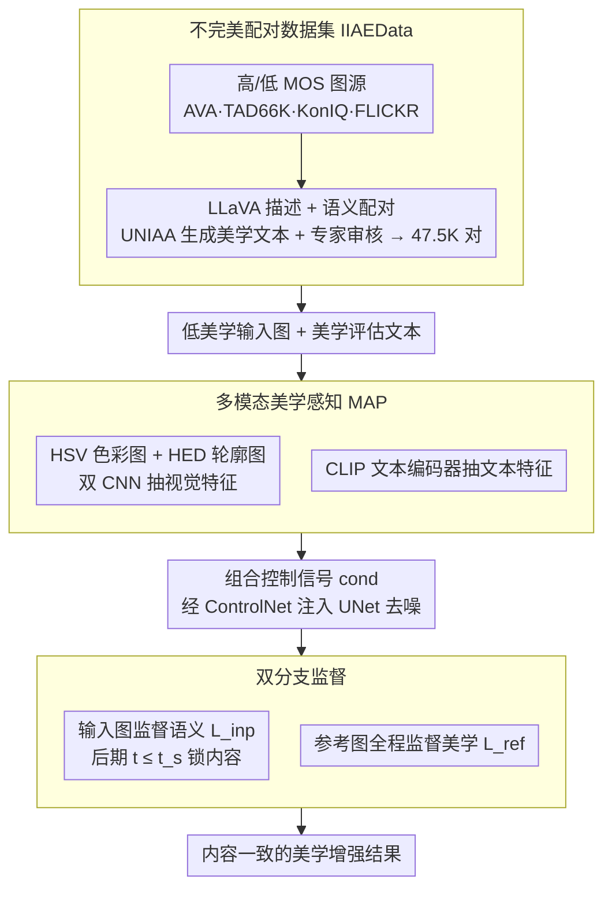

# Enhancing Image Aesthetics with Dual-Conditioned Diffusion Models Guided by Multimodal Perception

**会议**: CVPR 2026  
**arXiv**: [2603.11556](https://arxiv.org/abs/2603.11556)  
**代码**: 无  
**领域**: 图像生成 / 图像美学增强  
**关键词**: 图像美学增强, 多模态美学感知, 弱监督扩散模型, 不完美配对数据, ControlNet

## 一句话总结

DIAE提出多模态美学感知（MAP）模块将模糊的美学指令转为HSV+轮廓图+文本的显式控制信号，并构建"不完美配对"数据集IIAEData配合双分支监督框架进行弱监督训练，实现内容一致的美学增强，LAION美学评分提升17.4%。

## 研究背景与动机

**领域现状**：图像美学增强要求模型具备审美感知能力，识别色彩、构图、光照等方面的不足并进行相应编辑。近年扩散模型在图像编辑领域取得巨大成功，但现有方法主要面向语义编辑，缺乏美学感知能力。

**现有痛点**：(1) **美学指令理解困难**——美学评价如"饱和度过低"、"使用三分法构图"高度抽象，简单文本编码器无法理解并转化为生成方向；(2) **缺乏训练数据**——美学增强需要内容一致但美学质量不同的"完美配对"图像对，专业标注代价极高。

**核心矛盾**：美学是高层人类视觉能力，受文化、经历等不可控因素影响，且缺乏可直接用于监督学习的配对数据。现有图像质量评估数据集的人工退化（模糊、噪声）反映的是质量而非美学。

**本文目标** (1) 如何让扩散模型理解和执行模糊的美学指令；(2) 如何在没有完美配对数据的条件下训练美学增强模型。

**切入角度**：将美学感知分解为色彩和结构两个维度，分别用HSV色彩图和HED轮廓图作为视觉表示，配合文本描述形成多模态控制信号。数据方面，用语义相同但美学不同的"不完美配对"图像进行弱监督训练。

**核心 idea**：用多模态视觉表示（HSV+轮廓）将模糊美学指令具象化，用"不完美配对"数据+双分支监督实现弱监督美学增强。

## 方法详解

### 整体框架

DIAE要解决的是一件很别扭的事：让扩散模型理解"饱和度过低""该用三分法构图"这类抽象的美学评价，并在不改变画面内容的前提下把图修得更好看——可既没有人能讲清这些指令该怎么转成生成方向，也没有"同一张图只改美学"的配对数据可学。整条流水线因此分三层应对：先离线构建一个"不完美配对"数据集IIAEData，把现成的美学评分数据按高低质量拆开、用大模型语义匹配凑成弱配对；训练时由MAP模块把美学评估翻译成HSV色彩图、HED轮廓图和文本三路控制信号，经ControlNet注入UNet；再用一套双分支监督，让输入图管语义、参考图管美学，绕开"没有完美配对"的死结。

### 关键设计

**1. 不完美配对数据集（IIAEData）：用现成数据凑出弱监督信号，绕开无法获取的完美配对**

理想的训练数据是"同一张图只改美学属性"的完美配对，但这几乎拿不到。这里退而求其次：从AVA、TAD66K、KonIQ、FLICKR里挑高MOS图当参考、低MOS图当输入（中间分数的直接排除，拉开美学差距），先用LLaVA-13b给每张图生成描述、再按语义把高低质量图配成对，使两张图"内容相近但美学一高一低"。配对文本则交给UNIAA-LLaVA生成标准化的美学评估，最后由人工专家审一遍滤掉错配，得到47.5K样本（45K训练+1.5K测试）。这种"语义相同、美学不同"的配对虽不完美，但提供的差异信号已足够让模型学到"往哪个方向改更好看"。

**2. 多模态美学感知（MAP）：把抽象美学文本翻译成扩散模型看得懂的视觉信号**

痛点在于"饱和度过低"这种话，简单文本编码器根本无法理解、更别说转成生成方向。MAP的做法是先把美学评估拆成两个维度——色彩属性（饱和度、光照、光照技巧）和结构属性（焦点、拍摄类型、构图、构图技巧），再各配一种直观的视觉表征：色彩用HSV色彩图（比RGB更贴近人对色彩的感知），结构用HED轮廓图（强调焦点和构图）。两路CNN分支 $\Phi_i$ 从这两张图里抽视觉特征 $F_{col}^I, F_{str}^I$，CLIP文本编码器再从美学文本里抽 $F_{col}^T, F_{str}^T$，组合成控制信号 $\{cond_h, cond_c\}$ 经ControlNet注入UNet。之所以视觉和文本要并用，是因为HSV图和轮廓图各自都丢了一部分语义，单看不够，文本正好把缺的语义补回来——三路合在一起，模糊的指令才被钉成可执行的条件。

**3. 双分支监督框架：让内容不一致的参考图也能安全地当监督信号**

弱配对带来一个新麻烦：参考图和输入图内容并不完全一致，若直接拿参考图当唯一监督，模型会连内容一起搬过去、发生偏移。这里借的是扩散去噪的频率分层特性——去噪早期在搭语义骨架、后期才填美学细节。于是设一个切换时间步 $t_s$（默认900）：当 $t \leq t_s$（后期）时让输入图监督语义一致性 $L_{inp}$，把内容锁住；而高MOS参考图则全程监督美学属性 $L_{ref}$。总损失

$$L = L_{ref} + \lambda L_{inp}$$

本质是把"内容"和"美学"沿时间轴解耦：参考图只在它擅长的美学维度上发力，语义则始终由输入图把关，模型因此能学到参考图的好看、又不丢自己的内容。

### 损失函数 / 训练策略

基于SD-v1.5，UNet和ControlNet可训练，CLIP文本编码器冻结。$t_s=900$，AdamW优化器，学习率1e-5，4×A800训练100K迭代。

## 实验关键数据

### 主实验

| 方法 | LAION评分(256) | LAION评分(512) | MLLM评分(256) | MLLM评分(512) | CLIP-I(256) | CLIP-I(512) |
|------|-------------|-------------|------------|------------|----------|----------|
| 原始图像 | 4.962 | 5.123 | 3.243 | 3.300 | 1.000 | 1.000 |
| ControlNet | 4.979 | 5.522 | 3.271 | 3.415 | 0.628 | 0.617 |
| InstructPix2Pix | 4.991 | 5.396 | 3.264 | 3.325 | 0.764 | 0.690 |
| MGIE | 4.947 | 5.519 | 3.045 | 3.411 | 0.557 | 0.770 |
| DOODL | 5.102 | 5.140 | 3.255 | 3.297 | 0.775 | 0.703 |
| **DIAE** | **5.324** | **6.012** | **3.339** | **3.662** | **0.772** | **0.784** |

### 消融实验

| 配置 | LAION评分 | MLLM评分 | CLIP-I | 说明 |
|------|----------|---------|--------|------|
| DIAE (w/o v) | 5.250 | 3.343 | 0.623 | 去掉视觉模态，退化为ControlNet |
| DIAE (w/o t) | 5.428 | 3.410 | 0.792 | 去掉文本模态 |
| DIAE（完整） | 5.668 | 3.501 | 0.778 | 文本+视觉 |

### 关键发现

- 512分辨率下DIAE的LAION评分提升17.4%（5.123→6.012），MLLM评分提升11.0%，同时CLIP-I维持0.784说明内容保持
- 对低美学质量图像（MOS<4.0）改善最显著，能有效修正色彩和亮度缺陷
- 去掉视觉模态CLIP-I跌至0.623说明HSV/轮廓图对内容一致性至关重要
- $t_s$ 越大保留输入语义越多——该参数提供了内容保持vs美学增强的显式控制

## 亮点与洞察

- **将美学感知分解为色彩+结构两个可视化维度**：HSV图直观编码色彩感知，轮廓图编码构图和焦点，这种分解方式将抽象美学概念落地为具体的视觉信号，思路可迁移到其他需要将抽象概念具象化的控制生成任务。
- **弱监督训练策略的巧妙设计**：利用去噪过程的频率分层特性，在不同时间步用不同监督信号，本质上是将"内容"和"风格"在时间维度上解耦。这种思路可以推广到其他内容-属性分离的生成任务。
- **IIAEData的构建思路**：用现有美学评分数据集+LLM语义匹配自动构建弱配对数据，成本极低且可扩展，为缺乏配对数据的任务提供了通用的数据构建范式。

## 局限与展望

- 人像/人群场景未覆盖——面部特征和体态是美学重要因素但数据中被排除
- 基于SD-v1.5而非更新模型（如SD3.5），生成能力受限
- IIAEData的"不完美配对"质量依赖LLaVA匹配精度，错配问题可能存在
- 美学评估限于色彩+结构两维，缺少更微观的质感、光影渐变等属性
- $t_s$ 为固定值，不同图像可能需要自适应调节

## 相关工作与启发

- **vs InstructPix2Pix**: IP2P面向语义编辑，依赖文本指令但缺乏美学理解，在美学任务上效果有限
- **vs DOODL**: DOODL在采样时用美学分类器梯度引导，但只改变整体分数而不针对具体美学属性进行修正
- **vs ControlNet**: ControlNet提供结构控制但不理解美学语义，DIAE在其基础上增加美学感知能力

## 评分

- 新颖性: ⭐⭐⭐⭐ 多模态美学感知+弱监督配对数据+双分支训练的组合新颖，但各组件单独看技术新意有限
- 实验充分度: ⭐⭐⭐ 缺少用户研究，CLIP-I不能完全反映人类感知的内容一致性，消融不够深入
- 写作质量: ⭐⭐⭐⭐ 问题定义清晰，动机推导流畅，图表丰富
- 价值: ⭐⭐⭐⭐ 美学增强是实际有需求的任务，弱监督数据构建思路有推广价值

<!-- RELATED:START -->

## 相关论文

- [\[CVPR 2026\] MICON-Bench: Benchmarking and Enhancing Multi-Image Context Image Generation in Unified Multimodal Models](micon-bench_benchmarking_and_enhancing_multi-image_context_image_generation_in_u.md)
- [\[CVPR 2026\] LumiCtrl: Learning Illuminant Prompts for Lighting Control in Personalized Text-to-Image Models](lumictrl_learning_illuminant_prompts_for_lighting_control_in_personalized_text-t.md)
- [\[CVPR 2026\] Prototype-Guided Concept Erasure in Diffusion Models](prototype-guided_concept_erasure_in_diffusion_models.md)
- [\[CVPR 2026\] GrOCE: Graph-Guided Online Concept Erasure for Text-to-Image Diffusion Models](groce_graph-guided_online_concept_erasure_for_text-to-image_diffusion_models.md)
- [\[CVPR 2026\] Enhancing Spatial Understanding in Image Generation via Reward Modeling](enhancing_spatial_understanding_in_image_generation_via_reward_modeling.md)

<!-- RELATED:END -->
