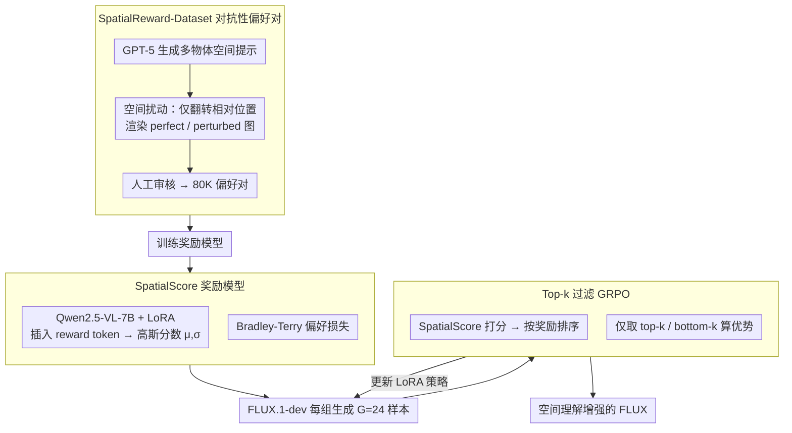

# Enhancing Spatial Understanding in Image Generation via Reward Modeling

**会议**: CVPR 2026  
**arXiv**: [2602.24233](https://arxiv.org/abs/2602.24233)  
**代码**: 无  
**领域**: 文本到图像生成 / 强化学习  
**关键词**: 空间理解, 奖励模型, GRPO, 扩散模型, FLUX

## 一句话总结

构建 80K 对抗性偏好数据集 SpatialReward-Dataset，训练专门评估空间关系准确性的奖励模型 SpatialScore（准确率超越 GPT-5），并用 top-k 过滤策略结合 GRPO 在线 RL 显著提升 FLUX.1-dev 的空间生成能力。

## 研究背景与动机

尽管文本到图像生成在视觉质量上取得巨大进展，复杂空间关系的准确描绘仍然困难，尤其是涉及多物体空间关系的长提示场景。通过强化学习（RL）增强空间理解是自然方向，但核心瓶颈在于**缺乏可靠的奖励模型**：

**人类偏好奖励模型**（HPSv2, PickScore 等）：侧重整体美学和文图对齐，无法准确评估复杂空间关系

**VQA 对齐模型**（VQAScore 等）：同样在多物体空间推理上表现不佳

**大型专有 VLM**（GPT-5, Gemini）：成本高，不适合 RL 频繁查询

**开源 VLM**（Qwen2.5-VL 72B）：存在严重幻觉，空间推理不可靠

**基于规则的 GenEval**：仅覆盖简单双物体模板提示，无法泛化到长提示场景，且目标检测器对遮挡敏感

## 方法详解

### 整体框架

这篇要解决文生图里复杂空间关系（尤其长提示、多物体）画不准的问题。作者的判断是：用 RL 增强空间理解的真正瓶颈不是 RL 本身，而是缺一个可靠的奖励模型——现成的人类偏好/VQA 对齐模型评不准空间关系，专有大 VLM 又贵到没法频繁查询。于是整条流水线分三步串起来：先构建 80K 对抗性偏好对的 SpatialReward-Dataset，再用它训练专门评估空间关系的奖励模型 SpatialScore，最后把 SpatialScore 当奖励信号、通过 GRPO 在线 RL 优化 FLUX.1-dev。

### 关键设计

**1. SpatialReward-Dataset：用空间扰动构造对抗性偏好对**

现成偏好数据要么评美学（HPSv2/PickScore）、要么评整体对齐，都没法精准盯住空间关系。作者让 GPT-5 先生成含复杂多物体空间关系的提示，再对它做空间扰动——只翻转相对位置（如左→右、交换物体相对位置），其余关系一律保持不变；原始提示渲染成 "perfect image"、扰动提示渲染成 "perturbed image"。这样一对样本里"非空间因素"几乎完全对齐，唯一差别就是空间关系的对错，偏好信号因此非常干净。生成用 Qwen-Image、HunyuanImage-2.1、Seedream-4.0 等强对齐模型，再人工审核滤掉不满足空间约束的样本，最终拿到 80K 对。

**2. SpatialScore 奖励模型：高斯分布建模分数 + Bradley-Terry 偏好损失**

RL 频繁查询用不起 GPT-5/Gemini，开源 VLM 又幻觉严重、空间推理不可靠。SpatialScore 以 Qwen2.5-VL-7B + LoRA 为骨干，在提示末尾插入 `<reward>` 特殊 token，把它最后一层嵌入经 MLP 映射到 $\mu, \sigma$，用高斯分布 $s \sim \mathcal{N}(\mu, \sigma^2)$ 而非确定性数值来建模奖励，对噪声更鲁棒；训练用 Bradley-Terry 偏好损失 $\mathcal{L}_{\text{Reward}}(\theta) = \mathbb{E}_{c, y_w, y_l}[-\log \sigma(R_\phi(H_\phi(y_w, c)) - R_\phi(H_\phi(y_l, c)))]$。最终这个 7B 模型在空间评估准确率上反超 GPT-5 和 Gemini-2.5 Pro。

**3. Top-k 过滤 GRPO：消除提示难度不均导致的优势偏差**

GRPO 按组内相对奖励算优势，但提示有难有易会让优势失真：简单提示一组里大量高奖励样本，部分高质量样本反而被算成负优势；困难提示普遍低奖励，同样把优势带偏。作者对每组 $G$ 个样本按奖励排序，只取 top-$k$ 和 bottom-$k$ 参与优势计算和训练。$k=6$（组大小 $G=24$）在多样性和平衡性间最优，还顺带把 NFE 从 $24 \times 6$ 砍到 $12 \times 6$，相当于免费省一半计算。

### 损失函数 / 训练策略

**奖励模型训练**：
- Qwen2.5-VL-7B + LoRA，学习率 $2 \times 10^{-6}$，batch 32
- 8×H20 GPU，1天完成

**RL 训练**：
- 基础模型：FLUX.1-dev + LoRA（rank=32）
- GRPO：学习率 $3 \times 10^{-4}$，clip range $1 \times 10^{-4}$，KL penalty 0.01
- 确定性 ODE 转随机 SDE（Euler-Maruyama 离散化）实现策略探索
- 32×H20 GPU

## 实验关键数据

### 主实验

| 方法 | SpatialScore | DPG-Bench Overall | TIIF-short BR | TIIF-long BR | UniBench-short Lay-2D | UniBench-long Lay-2D |
|------|-------------|-------------------|---------------|--------------|----------------------|---------------------|
| FLUX.1-dev | 2.18 | 82.91 | 0.769 | 0.758 | 0.766 | 0.819 |
| Flow-GRPO* | 3.01 | 57.02 | 0.851 | 0.577 | 0.726 | 0.445 |
| **Ours** | **7.81** | **85.03** | **0.875** | **0.845** | **0.875** | **0.891** |

SpatialScore 内部评估从 2.18 提升至 7.81（+258%），且在 DPG-Bench 整体分接近 GPT-Image-1（85.03 vs 85.15）。

### 奖励模型评估

| 模型 | Overall Accuracy |
|------|-----------------|
| PickScore | 0.509 |
| HPSv3 | 0.605 |
| Qwen2.5-VL-72B | 0.764 |
| GPT-5 | 0.890 |
| Gemini-2.5 Pro | 0.951 |
| **SpatialScore (7B)** | **0.958** |

7B 参数的 SpatialScore 在空间理解评估上超越 GPT-5 和 Gemini-2.5 Pro。

### 消融实验

| 配置 | SpatialScore | DPG-bench Rel | UniBench Lay-3D(long) | NFE/步 |
|------|-------------|---------------|----------------------|--------|
| w/o top-k | 7.73 | 0.919 | 0.793 | 24×6 |
| top-k (k=4) | 7.71 | 0.916 | 0.796 | 8×6 |
| **top-k (k=6)** | **7.81** | **0.932** | **0.801** | **12×6** |

### 关键发现

- Flow-GRPO 基于 GenEval 训练在短提示上有改善，但在**长提示上严重退化**，甚至丢失基础模型的长文本跟随能力
- SpatialScore 从 3B 到 7B 准确率从 89.1% 提升至 95.8%，规模效应显著
- 空间理解提升具有正向迁移效果，DPG-Bench 全五个维度均有提升

## 亮点与洞察

- **对抗性数据构造**：通过空间关系扰动生成偏好对，精准消除非空间因素干扰
- **7B 模型超越专有模型**：专项训练的小模型在特定任务上可超越通用大模型
- **Top-k 过滤思想简洁有效**：解决 GRPO 中提示难度不均导致的优势偏差，同时减少2倍计算
- 从 SDE/ODE 转换到策略探索的技术路线已较成熟

## 局限与展望

- 仅关注空间关系，未覆盖其他组合生成维度（如属性绑定、数量准确性等）
- SpatialReward-Dataset 依赖强生成模型（Qwen-Image 等），对较弱模型的评估可能有偏
- RL 训练计算成本高（32×H20 GPU）
- 未讨论空间理解提升是否影响美学质量

## 相关工作与启发

- 与 Flow-GRPO 的关键差异：专用奖励模型 vs 基于规则的 GenEval 奖励，后者在复杂场景下不可靠
- RLHF 在 LLM 中的成功模式正在被系统性地迁移到图像生成，本文是空间维度的代表
- 启发：可为其他维度（如属性绑定、动作一致性）构建类似的专用奖励模型+RL框架

## 评分

- 新颖性: ⭐⭐⭐⭐ 首个专门针对空间理解的奖励模型，top-k 过滤策略有价值
- 实验充分度: ⭐⭐⭐⭐⭐ 多基准测试、详细消融、与多种baseline和专有模型对比全面
- 写作质量: ⭐⭐⭐⭐ 动机分析和实验呈现清晰，可视化丰富
- 价值: ⭐⭐⭐⭐ 奖励模型+RL提升生成质量的范式在空间维度的成功验证，具有方法论意义

<!-- RELATED:START -->

## 相关论文

- [\[CVPR 2026\] Spatial-SSRL: Enhancing Spatial Understanding via Self-Supervised Reinforcement Learning](spatial-ssrl_enhancing_spatial_understanding_via_self-supervised_reinforcement_l.md)
- [\[ICCV 2025\] CoMPaSS: Enhancing Spatial Understanding in Text-to-Image Diffusion Models](../../ICCV2025/image_generation/compass_enhancing_spatial_understanding_in_text-to-image_diffusion_models.md)
- [\[CVPR 2026\] Learning to Generate via Understanding: Understanding-Driven Intrinsic Rewarding for Unified Multimodal Models](learning_to_generate_via_understanding_understanding-driven_intrinsic_rewarding_.md)
- [\[CVPR 2026\] RewardFlow: Generate Images by Optimizing What You Reward](rewardflow_generate_images_by_optimizing_what_you_reward.md)
- [\[CVPR 2026\] Bias at the End of the Score: Demographic Biases in Reward Models for T2I](bias_reward_models_t2i.md)

<!-- RELATED:END -->
