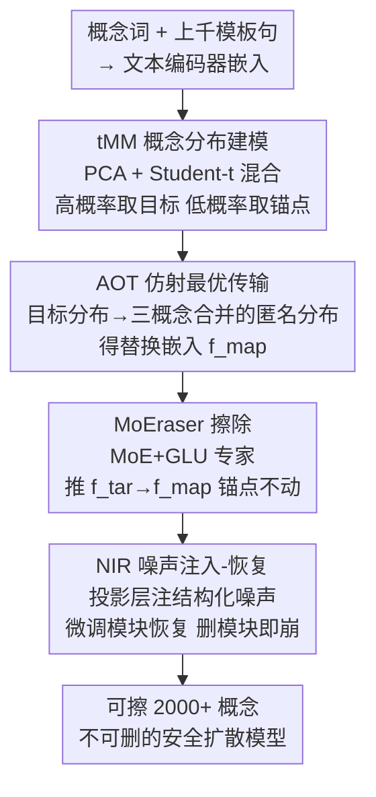

# Erasing Thousands of Concepts: Towards Scalable and Practical Concept Erasure for Text-to-Image Diffusion Models

**会议**: CVPR 2026  
**论文**: [CVF Open Access](https://openaccess.thecvf.com/content/CVPR2026/html/Seo_Erasing_Thousands_of_Concepts_Towards_Scalable_and_Practical_Concept_Erasure_CVPR_2026_paper.html)  
**代码**: 待确认  
**领域**: 扩散模型 / AI安全  
**关键词**: 概念擦除, 文生图扩散, 最优传输, 混合专家, 白盒鲁棒性  

## 一句话总结
ETC 把每个概念建模成文本嵌入上的 Student-t 混合分布，用仿射最优传输把目标概念映射到一个"匿名"分布、并从分布边界自动采样锚点（免去人工挑锚点），再用一个 MoE 擦除模块 MoEraser 配合"噪声注入-恢复"训练，在 SDv1.4 / SDv3.5-L 上一次性擦除 2000+ 个跨域概念且能抵抗"删模块"的白盒攻击，规模和精度都刷到 SOTA。

## 研究背景与动机
**领域现状**：文生图（T2I）扩散模型质量惊人，但也会生成名人肖像、版权角色、受版权保护的艺术风格等不该生成的内容。主流缓解手段是"概念擦除"——通过微调把目标概念从模型里抹掉，同时保留其余概念的生成能力。代表方法有改交叉注意力的 FMN、对齐目标/替代概念的 ESD、闭式更新的 UCE/TIME、加 LoRA 模块的 MACE/SPM，以及走非线性路线的 CPE。

**现有痛点**：这些方法都卡在"规模"上——能稳定擦除的概念数往往只有几十到几百个，且通常只在同质域（如全是名人）里验证。一旦要擦的概念上千、还横跨名人/角色/艺术风格等异质域，就会出现两类问题：要么擦得不干净（pin-point 性丢失，殃及无关概念），要么把图像整体质量也拖垮。

**核心矛盾**：擦除要同时满足三个互相拉扯的目标——**可扩展（scalable）**、**精准（pin-point，只动目标不动其余）**、**鲁棒（robust，删不掉）**。线性模块（MACE/SPM）容易扭曲非目标概念、扩展性有限；非线性外挂模块（CPE）扩展性好，但①推理开销随擦除概念数线性增长、②不能并进权重、③把外挂模块一删就失效（白盒攻击）。此外，几乎所有方法都依赖**人工/启发式挑选锚点概念**来保护其余概念，这一步本身就无法规模化。

**本文目标**：在不依赖预定义锚点、不牺牲生成质量、且能抵抗"删模块"攻击的前提下，把可擦除概念数从几百拉到 2000+。

**切入角度**：作者的关键观察是——一个词的嵌入会随它所处句子的语义而漂移，所以单个概念不该被看成一个点，而应被看成嵌入空间里的一个**分布**。把概念建成分布后，就能用分布的高/低概率区天然地划出"要擦的目标嵌入"和"要保护的锚点嵌入"，从而彻底甩掉人工锚点。

**核心 idea**：用"概念分布建模 + 仿射最优传输映射 + MoE 擦除模块 + 噪声注入-恢复训练"四件套，把大规模概念擦除做成可扩展、免锚点、且不可删除的安全模块。

## 方法详解

### 整体框架
ETC 分两阶段。**第一阶段（建分布 + 算映射）**离线进行：对每个概念，用上千条模板句把概念词嵌进文本编码器，得到嵌入矩阵；PCA 压缩后拟合一个 Student-t 混合分布（tMM）；高概率区采样得到要擦的目标嵌入 $f_{tar}$、低概率边界采样得到要保护的锚点嵌入 $f_{anc}$；再用仿射最优传输（AOT）把目标分布映射到一个由三概念合并而成的"匿名"分布，得到替换嵌入 $f_{map}$。**第二阶段（训模块）**：以 $(f_{tar}, f_{map}, f_{anc})$ 三元组为监督，训练一个基于 MoE 的擦除模块 MoEraser，让它把目标嵌入推到映射嵌入、同时让锚点嵌入原地不动；最后用"噪声注入-恢复（NIR）"对文本嵌入投影层注入结构化噪声并微调 MoEraser，使得"删掉模块"就会让模型生成崩坏，从而对白盒攻击免疫。

### 关键设计

**1. tMM 概念分布建模：把概念建成"重尾分布"，从边界免费拿目标和锚点**

针对"人工挑锚点无法规模化"这个痛点，ETC 不再把概念当成一个嵌入点，而是把它建成一个分布。具体做法：对概念 $c$，用上千条模板句（如"As the snow covered the path, {} lit a small fire"）填入概念词后过文本编码器，拼成嵌入矩阵 $X_c \in \mathbb{R}^{d\times N}$（$N$ 是模板数，$d\ge 768$）。由于这些嵌入经验上**极度低秩**，先用 PCA 压到 $Z_c \in \mathbb{R}^{d'\times N}$（$d'\ll d$），再拟合一个 $k$ 分量的 Student-t 混合：

$$P_c(z) = \sum_{i=1}^{k} \pi_{c,i}\cdot t(z\mid \mu_{c,i}, \Sigma_{c,i}, \nu_{c,i})$$

之所以用 tMM 而非常规高斯混合（GMM），是因为概念嵌入经验上是**重尾**的：嵌入天然"in-distribution"，真正反映变异性的离群样本很稀少，GMM 的轻尾会把低概率样本也建得"概念感很强"，而 tMM（论文里自由度 $\nu$ 设为 2）能让概念强度随概率成比例衰减。建成分布后，**高概率区的样本就是要擦的目标嵌入 $f_{tar}$、低概率边界的样本就是要保护的锚点嵌入 $f_{anc}$**——锚点直接从目标自己的分布边界采出来，不需要任何人工锚点集。

**2. AOT 仿射最优传输：把目标映射到一个"谁也不是"的匿名分布**

光有目标分布还不够，得知道把目标"擦成什么"。已有研究表明替换目标用的"映射概念"选得好坏直接决定擦除效果和保留质量。ETC 把"目标→映射"建成最优传输问题，并限定为**仿射**形式：

$$T_{p\mapsto q}(z, V_{pq}) = AV_{pq}z + b,\quad z\sim P_p$$

其中 $V_{pq}\triangleq V_q V_p^\top$ 负责把嵌入摆到正确的子空间。最优参数由 2-Wasserstein 距离最小化求出：

$$(A^*, b^*)\in\arg\min_{A,b} W_2\big((AV_{pq}z+b)_{\#}P_p,\; P_q\big)$$

用仿射而非任意传输有两个好处：①线性形式让后续网络训练更容易；②当映射目标 $q$ 取成**三个概念合并后的分布（"concept triplet"，如把汤姆·克鲁斯/小李子/克里斯·海姆斯沃斯合并）**时，映射结果会落在三者之间、不对齐任何单个真实概念，生成出"谁也不是"的全新人脸，从而提升安全性（论文 Fig.3 显示：普通 OT 会把目标映成某个具体的真实名人，AOT 则映成新面孔）。

**3. MoEraser：用 MoE 擦除模块同时"擦目标"和"保锚点"**

有了 $(f_{tar}, f_{map}, f_{anc})$ 三元组，就要训一个网络学这个传输映射。线性模块或单个 FFN 在跨异质域时容量/适应性都不够，所以 ETC 用**带路由器的混合专家（MoE）**，记作 MoEraser（每个专家是 GLU 门控线性单元，路由取 top-$k$，论文取 $k=2$）。训练目标是：目标嵌入过模块 + 投影层 $W_{proj.}$ 后要对齐到 $W_{proj.}f_{map}$，锚点嵌入则保持不变：

$$L_{Erase} = \big\|W_{proj.}(\text{MoEraser}(f_{tar})+f_{tar}) - W_{proj.}f_{map}\big\|_2^2 + \lambda\cdot\big\|W_{proj.}(\text{MoEraser}(f_{anc})+f_{anc}) - W_{proj.}f_{anc}\big\|_2^2$$

模块以残差形式接入（输出加回输入），$\lambda$ 平衡"擦"与"保"。用 MoE 而非把单模型做大，是因为擦除要覆盖名人/角色/风格等异质域，不同域可由不同专家分工，从而在概念数上千时仍保持精度（论文在 Discussion 里统计了各域的专家使用分布，确认负载较均衡、没有出现稀疏依赖单专家的脆弱情形）。

**4. NIR 噪声注入-恢复：把擦除模块焊死，删不掉**

非线性外挂模块的通病是——攻击者直接把模块删掉，模型就恢复到能生成目标概念。ETC 用"噪声注入-恢复（NIR）"把模块和模型**绑定**：先往文本嵌入投影层注入结构化噪声，得到损坏权重

$$W_{cor.} = W_{proj.} + \alpha_{noise}\cdot e\,p_{tar}^\top$$

其中 $p_{tar}$ 是目标嵌入的 top-$r$ PCA 主向量、$e\sim\mathcal{N}(0,I)$，$\alpha_{noise}$ 控制噪声强度。这个噪声**沿目标主成分方向**扰动权重，专打目标概念的生成质量，让模型在没有模块时根本生成不出高保真图。然后冻结一份预训练好的 $\text{MoEraser}^*$、用损坏投影层微调 MoEraser 去恢复原始嵌入：

$$L_{NIR} = \big\|W_{cor.}(\text{MoEraser}(f)+f) - W_{proj.}(\text{MoEraser}^*(f)+f)\big\|_2^2$$

$f$ 从 $\{f_{tar}, f_{anc}, \epsilon\}$ 采（$\epsilon$ 是同维高斯噪声，用来保住目标/锚点之外、扩散模型本就能生成的先验）。这样一来：保留模块 → 正常出图且目标被擦；删掉模块 → 损坏投影层未被恢复，模型整体崩坏不可用。删模块反而把自己废了，白盒攻击自然失效。

### 损失函数 / 训练策略
两阶段损失分别是擦除/保留的 $L_{Erase}$（式 5）和噪声恢复的 $L_{NIR}$（式 7）。训练样本三元组按 $z_{tar}\sim P_{tar}^{(high)}$、$z_{anc}\sim P_{tar}^{(low)}$、$z_{map}=T_{tar\mapsto map}(z_{tar})$ 采出后投影回原嵌入空间。映射概念 $q$ 实现为三概念合并分布。tMM 自由度设 2，MoE 路由 top-2。

## 实验关键数据

### 主实验
在 SDv1.4 上一次性擦除 **2,072 个**跨三域概念（949 名人 + 693 艺术风格 + 430 角色），用大规模用户研究（203 人、8120 份回答）评估。指标：CRS（概念保留率，目标越低越好 / 其余越高越好）、QS（图像质量）、$H_0$（目标擦除与其余保留的调和均值，越高越好）。

| 域 / 方法 | 目标 CRSt↓ | 目标 QS↑ | 其余 CRSr↑ | 其余 QS↑ | $H_0$↑ |
|------|------|------|------|------|------|
| 名人 · CPE | 0.164 | 0.436 | 0.544 | 0.667 | 0.659 |
| 名人 · MACE | 0.396 | 0.613 | 0.468 | 0.701 | 0.527 |
| 名人 · **ETC** | **0.099** | **0.895** | **0.688** | **0.936** | **0.780** |
| 艺术风格 · CPE | 0.224 | 0.784 | 0.600 | 0.777 | 0.677 |
| 艺术风格 · **ETC** | **0.130** | **0.894** | **0.719** | 0.829 | **0.787** |
| 角色 · CPE | 0.115 | 0.532 | 0.430 | 0.735 | 0.579 |
| 角色 · **ETC** | 0.130 | **0.814** | **0.719** | **0.919** | **0.787** |

ETC 在三域上 $H_0$ 全面领先（0.78~0.79，下一名 CPE 仅 0.58~0.68），且在擦除目标的同时几乎不掉质量（QS 普遍 0.81~0.94），而 baseline 往往"擦得动但糊了"。SAFREE 虽然 QS 高但根本擦不掉（CRSt 高达 0.85+）。换到 **SDv3.5-L（MMDiT 架构）**擦 515 概念，ETC 同样在 $H_0$ 上压过 SAFREE / SPEED，证明对先进扩散模型也适用。

小规模设定（50 名人，沿用 MACE/CPE 协议，GCD 检测精度 + KID + FID）：

| 方法 | 目标 Acct↓ | 其余 Accr↑ | $H_0$↑ | COCO FID↓ |
|------|------|------|------|------|
| MACE | 3.29 | 84.64 | 0.903 | 12.40 |
| CPE | 0.37 | 88.26 | 0.936 | 14.13 |
| **ETC** | **0.24** | **89.37** | **0.943** | **13.61** |
| SD v1.4（原模型） | 91.35 | 90.86 | — | 14.04 |

ETC 把目标检测精度压到 0.24%（几乎擦干净），其余名人保留 89.37%（最接近原模型 90.86），$H_0$=0.943 居首。

### 消融实验
| 配置 | 目标 Acct↓ | 其余 Accr↑ | 说明 |
|------|------|------|------|
| Direct（词到词映射）+ Surrogate | 0.64 | 85.84 | 擦得动但保留差 |
| GMM + AOT | 8.96 | 89.49 | 高斯建模擦不干净 |
| tMM + Surrogate | 0.17 | 86.48 | 擦得好但保留弱 |
| **tMM + AOT（完整）** | **0.24** | **89.37** | 擦除+保留最佳平衡 |
| 锚点：仅 $f_{anc}$ | 1.12 | 88.53 | 单用边界锚点擦除变弱 |
| 锚点：$f_{anc}$+noise | **0.24** | **89.37** | 边界锚点配噪声最佳 |
| NIR：full-rank 噪声（恢复后） | 0.16 | 79.28 | 满秩噪声恢复后其余掉得多 |
| NIR：结构化噪声（恢复后） | 0.24 | **89.37** | 结构化噪声恢复最稳 |

### 关键发现
- **tMM 和 AOT 缺一不可**：GMM 换 tMM 把目标 Acct 从 8.96 砍到 0.24（重尾建模让低概率样本概念感衰减，边界采样才有意义）；Surrogate 换 AOT 则把其余保留从 86.48 抬到 89.37（映射到匿名三概念分布比映射到"a person"这类通用替代更能保结构）。
- **免锚点是可行的甚至更好**：用分布边界采的 $f_{anc}$ 配上高斯噪声，效果追平甚至超过用人工锚点概念——彻底验证了"概念分布边界天然就是好锚点"这一核心假设。
- **NIR 的噪声"结构"决定恢复质量**：满秩/低秩/结构化噪声对目标的破坏程度相近（没模块时都崩），但结构化噪声（沿目标主成分）恢复后对其余概念的保留明显更好（Accr 89.37 vs 满秩 79.28），说明把破坏精准对准目标方向才不会误伤其余生成先验。

## 亮点与洞察
- **"概念=分布"这步建模一举两得**：既给出了目标/锚点的天然来源（高/低概率区），又给了概念之间做映射的数学接口（最优传输）。把"挑锚点"这个一直靠人工的脏活，变成了从分布边界采样的自动操作，这是扩展到 2000+ 概念的关键。
- **AOT 映射到"三概念合并分布"的设计很巧**：单点替换容易把目标映成另一个真实名人（仍有安全隐患），合并三个概念取中间地带，生成的是"谁也不是"的新面孔，把"替换"和"匿名化"合二为一。
- **NIR 把"安全模块"焊进模型权重**，正面回应了非线性外挂模块"一删就废"的命门——这个"删模块即自毁"的思路可迁移到任何外挂式安全/水印模块，让防护不再是可被绕过的旁路。
- **MoE 用于异质域擦除**是合理的归纳偏置：名人/角色/风格本就该由不同专家管，比硬堆单模型容量更省、更能扩展。

## 局限与展望
- 大规模评估**重度依赖用户研究**（CRS/QS 来自人工"Yes"率），论文也承认 CLIP Score / LPIPS 这类自动指标会把"过度擦除/整体退化"误判成"擦得好"，所以可复现性和评测成本较高；自动化、客观的大规模擦除评测仍是开放问题。⚠️ tMM 自由度固定为 2、MoE 专家数等超参的敏感性正文未充分展开（细节在附录），换域时是否要重调待确认。
- AOT 是**仿射**映射，论文自己说明它"不保证完美的分布对齐"，只是用线性换训练便利；当目标与映射分布差异很大时对齐误差可能放大。
- NIR 把模块和投影层绑死提升了鲁棒性，但也意味着**模型从此离不开这个模块**——一旦模块本身出问题或需要更新概念集，可能需要重新走 NIR 流程，部署灵活性下降；论文未讨论增量"再加擦几个概念"时是否要全量重训。
- 实验集中在名人/风格/角色三类"实体型"概念，对更抽象的概念（如某种构图、某种不安全语义组合）是否同样 pin-point 未验证。

## 相关工作与启发
- **vs MACE / SPM**：它们用 LoRA 等线性模块做擦除，规模上限约百级且容易扭曲非目标；ETC 用 MoE 非线性模块 + 分布建模，把规模推到 2000+ 并显著改善保留质量。
- **vs CPE**：CPE 率先证明非线性能提升大规模擦除的特异性，但模块不能并权重、推理开销随擦除数增长、且可被删除；ETC 在同样走非线性的前提下，靠 NIR 解决"可删除"短板，靠 tMM+AOT 解决"挑锚点不可扩展"短板，$H_0$ 全面反超 CPE。
- **vs SAFREE / SPEED（MMDiT 上的对比）**：SAFREE 推理时控制、基本擦不掉目标；SPEED 用零空间先验擦得动但严重掉质量；ETC 在 SDv3.5-L 上兼顾擦除强度与质量保留。
- **vs UCE / TIME（闭式更新）**：闭式法在小规模优雅，但概念一多就互相干扰、保留崩坏（表 3 中 UCE 的 FID 飙到 97）；ETC 用可训练模块替代闭式更新，规模化下稳定得多。

## 评分
- 新颖性: ⭐⭐⭐⭐⭐ "概念建分布→边界采锚点→AOT 匿名映射→NIR 焊模块"四连招，把擦除规模、免锚点、抗删三个老问题一起解了。
- 实验充分度: ⭐⭐⭐⭐ 2000+ 概念跨三域 + 两个 SD 版本 + 4 张消融表很扎实，但大规模主指标靠用户研究、自动评测缺位。
- 写作质量: ⭐⭐⭐⭐ Remark 小结 + Fig 直觉图把动机讲得清楚，公式与流程对应明确。
- 价值: ⭐⭐⭐⭐⭐ 首个有效擦除 2000+ 跨域概念的工作，且给出"不可删安全模块"的可迁移范式，对 T2I 内容安全部署有现实意义。

<!-- RELATED:START -->

## 相关论文

- [\[CVPR 2026\] Neighbor-Aware Localized Concept Erasure in Text-to-Image Diffusion Models](neighbor-aware_localized_concept_erasure_in_text-to-image_diffusion_models.md)
- [\[CVPR 2026\] Prototype-Guided Concept Erasure in Diffusion Models](prototype-guided_concept_erasure_in_diffusion_models.md)
- [\[CVPR 2026\] Beyond Text Prompts: Precise Concept Erasure through Text–Image Collaboration](beyond_text_prompts_precise_concept_erasure_through_text-image_collaboration.md)
- [\[ICLR 2026\] SPEED: Scalable, Precise, and Efficient Concept Erasure for Diffusion Models](../../ICLR2026/image_generation/speed_scalable_precise_and_efficient_concept_erasure_for_diffusion_models.md)
- [\[CVPR 2026\] GrOCE: Graph-Guided Online Concept Erasure for Text-to-Image Diffusion Models](groce_graph-guided_online_concept_erasure_for_text-to-image_diffusion_models.md)

<!-- RELATED:END -->
