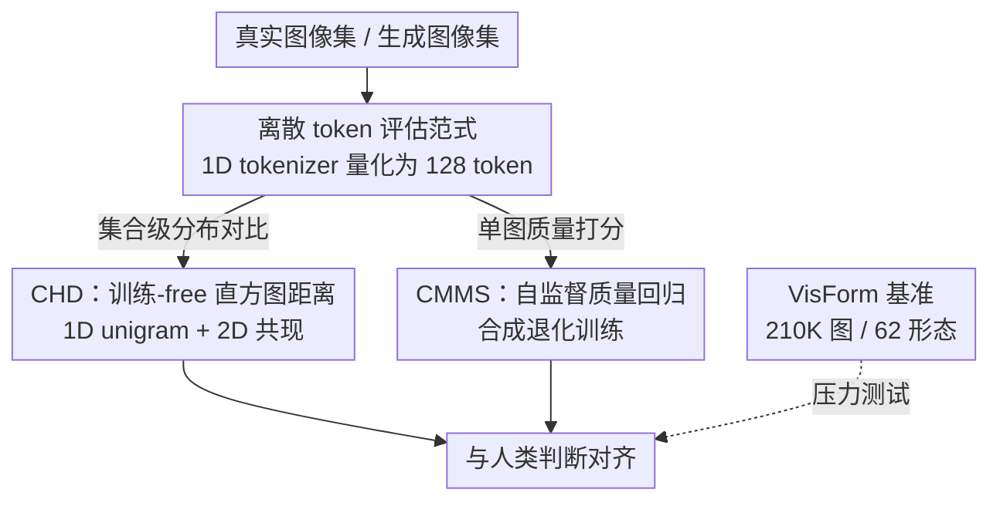

# Evaluating Generative Models via One-Dimensional Code Distributions

**会议**: CVPR 2026  
**论文**: [CVF Open Access](https://openaccess.thecvf.com/content/CVPR2026/html/Jia_Evaluating_Generative_Models_via_One-Dimensional_Code_Distributions_CVPR_2026_paper.html)  
**代码**: https://github.com/zexiJia/1d-Distance  
**领域**: 图像生成 / 生成模型评估  
**关键词**: 生成模型评估, 离散视觉token, 无参考质量评价, 直方图距离, VisForm基准

## 一句话总结
把生成模型的评估战场从「连续识别特征」搬到「离散视觉 token」上——用 1D tokenizer 把图像量化成 token 序列，再在 token 统计空间里设计一个训练-free 的分布距离（CHD）和一个自监督学习的无参考质量分（CMMS），两者在多个人类偏好基准上都拿到了与人评最高的相关性。

## 研究背景与动机

**领域现状**：生成模型质量评估长期由 FID 主导——把真实图和生成图分别送进 Inception-V3，取池化后的特征，拟合两个高斯分布，再算 Fréchet 距离。后续工作沿两条线改进：一是换更好的特征空间（CLIP-FID、DINO-FID）或换分布假设（CMMD 用核 MMD 替代高斯）；二是直接在人类偏好数据上训练打分器（HPS、PickScore、Q-Align、DEQA）。

**现有痛点**：FID 这类指标和人类感知的相关性其实很差。根因是它依赖的「识别特征」是**为分类任务训练的**，目标就是对外观变化（纹理、锐度、局部连贯性）保持不变——而这些恰恰是人眼最敏感的质量线索。再加上全局平均池化把空间结构压成一个全局向量，局部伪影、构图崩坏几乎被抹平。换特征空间（CLIP/DINO）继承了同样的「语义不变 + 全局池化」结构缺陷；换 MMD 又引入了核带宽敏感的新问题；训人类偏好模型则要昂贵标注，且换个新风格就泛化崩。

**核心矛盾**：所有这些方法共享同一个设计选择——**在连续识别特征空间里评估生成模型**。识别特征天生丢弃外观信息（论文从信息论角度论证：识别训练增大 $I(x_s;\phi(x))$、压低 $I(x_a;\phi(x)\mid x_s)$，而数据处理不等式 $I(q;x)\ge I(q;\phi(x))$ 说明任何不为质量优化的压缩都必然损失质量信息 $q$）。

**切入角度**：作者观察到现代 tokenizer（如 TiTok）和识别特征走的是相反路线——它是为**重建图像**训练的，因此必须在一个统一、近乎无损的离散索引空间里同时保留语义和外观细节。已有分析甚至发现单个 token 位置会解耦地编码模糊、光照、锐度等属性。更妙的是，质量会自然体现在 token 统计里：自然图产生高度结构化、低熵的 token 模式，退化图产生更随机、高熵的模式（$H(\mathbf{c}\mid q_\text{high})<H(\mathbf{c}\mid q_\text{low})$）。

**核心 idea**：把离散 token 空间本身当作**一等评估域**，纯粹在 token 统计上做评估——用「视觉词汇」的频率（unigram）和「局部语法」的共现（co-occurrence）来度量分布保真度，用合成退化的 token 模式来自监督地学单图质量。

## 方法详解

### 整体框架
方法围绕一个共同的前端展开：先用一个在 1 亿张图上重训过的 TiTok 把任意 $256\times256$ 图像量化成 $N=128$ 个离散 token（码本大小 $|V|=4096$）。在这个离散 token 序列上分两路：**CHD** 是训练-free 的集合级分布指标，比较真实图集与生成图集的 token 直方图；**CMMS** 是单图级的无参考质量分，用一个轻量回归器把 token 序列映射成质量分，且回归器完全靠合成退化自监督训练、不碰任何人类标注。最后作者还造了一个跨 62 种视觉形态的 **VisForm** 基准，专门压力测试这两个指标在分布漂移下的稳定性。

### 关键设计

**1. 离散 token 评估范式：把评估从「语义不变」的特征搬到「重建等变」的 token**

这一步直接针对 FID 的根因——识别特征对外观不变。作者改用为重建训练的 1D tokenizer：它把图像写成 token 序列 $\mathbf{c}=[c_1,\dots,c_N]$，联合分布可因式分解为 $p(\mathbf{c})=\prod_{i=1}^N p(c_i\mid c_{<i})$，从而保留了全局池化会抹掉的丰富依赖关系。为了覆盖照片、绘画、3D 渲染、医学图等多样视觉域，作者在 DataComp 的 1 亿张图上重训了 TiTok（8×A100 训 214 小时）。和分类特征学「外观不变性」相反，离散码学的是「随内容和风格可预测地变化」的等变表示——这正是评估需要的：token 频率和共现直接反映模型生成了什么结构，无需高斯假设、不塌缩空间信息。

**2. CHD：训练-free 的 token 直方图距离，分别管「词汇」和「语法」**

针对「分布保真度怎么免训练地量」，CHD 把它拆成两个互补的直方图统计。**CHD-1D（视觉词汇）**：对图集 $\mathcal{S}$ 统计每个 token 的经验 unigram 频率 $h_{\mathcal{S}}^{(1)}(v)=\frac{1}{|\mathcal{S}|N}\sum_{I}\sum_{i}\mathbb{I}[c_i(I)=v]$，再用 Hellinger 距离衡量真实集 $\mathcal{R}$ 与生成集 $\mathcal{G}$ 的差异：

$$\text{CHD-1D}(\mathcal{R},\mathcal{G})=\tfrac{1}{\sqrt{2}}\big\|\sqrt{h_{\mathcal{R}}^{(1)}}-\sqrt{h_{\mathcal{G}}^{(1)}}\big\|_2\in[0,1].$$

它度量模型有没有用对「视觉词汇」。但 token 序列的一维相邻顺序是人为强加的、不对应图像网格，所以又引入 **CHD-2D（局部语法）**：把量化结果看成 token 网格 $\{c(\mathbf{p})\}$，对一组位移向量 $\mathcal{D}=\{(1,0),(0,1)\}$（右邻、下邻，避免重复计数）统计有向共现直方图 $h_{\mathcal{S}}^{(2)}(u,v;\Delta)$，再对 $(u,v)$ 对称化、对方向取平均，得到方向鲁棒的共现分布 $\bar{h}_{\mathcal{S}}^{(2)}(u,v)$（只存出现过的对，是稀疏表示），同样取 Hellinger 距离得 CHD-2D。最终 CHD 是两者算术平均 $\text{CHD}=\tfrac{1}{2}(\text{CHD-1D}+\text{CHD-2D})$。选 Hellinger（而非余弦/Wasserstein/KL）是因为它对稀疏直方图稳健、且天然落在 $[0,1]$；消融里 Hellinger 全面最优。

**3. CMMS：用合成退化自监督学的无参考单图质量分**

CHD 是集合级的，没法给单张图打分；针对这个缺口，CMMS 直接在 token 序列上回归质量，且**不用任何人类标注**——它靠一套合成退化造监督信号。退化有三层：① **token 腐蚀**——每个 token 以概率 $p$ 被替换成码本上的均匀采样 $\mathcal{U}(\mathcal{V})$，模拟生成图里突兀的局部伪影；② **语义片段交换**——在图间或同图远处交换空间连续的 token 块，模拟错位的部件、断肢、重复片段这类对象级失配；③ **像素空间增广**——tokenize 之前先加高斯模糊/JPEG 压缩/高斯噪声/随机遮挡/光度变化，模拟过欠锐化、压缩伪影、异常曝光。每个退化样本的目标质量分由腐蚀强度 $p$ 决定，用指数映射

$$q(p)=\exp(-20p),\quad p\in[0,0.3].$$

指数形式刻画人眼的非线性敏感度：在高质量区一点扰动就明显掉分，在已经很差的区再退化感知变化反而小；常数 20 是在留出验证集上搜超参、最大化与人评 Spearman 选出来的。回归器很轻：把 $N$ 个 token 嵌成 512 维加正弦位置编码，过一个 2 层、每层 8 头的 Transformer encoder，全局平均池化得 $g\in\mathbb{R}^{512}$，再用 2 层 MLP 映到标量 $\hat{q}\in[0,1]$。它**只在 ImageNet-1K 的 tokenized 图上训一次**，下游所有数据集和 VisForm 都零微调直接用。

**4. VisForm 基准：跨 62 种视觉形态的分布漂移压力测试床**

针对「现有基准多集中在自然图、难考察分布漂移」的问题，作者造了 VisForm：21 万张图，覆盖 62 种视觉形态（写实人像、风景、产品图、水彩油画、动漫、3D 渲染、医学影像、科学图表、UI 信息图等），由 12 个代表性生成模型（扩散、一致性模型、自回归 Transformer）产出。每张图按 14 个感知维度（总体质量、构图、语义连贯、色彩和谐、光照真实、纹理自然、伪影严重度、文字渲染等）由至少 3 名专家标注，经校准轮和离群过滤，标注者一致性 Kendall's $W>0.75$。关键约束：VisForm **只用于评测指标和模型，CMMS 绝不在它上面训练或微调**——这才能真正考察泛化。

### 损失函数 / 训练策略
CMMS 用 AdamW 在 ImageNet-1K（128 万图）上训 200 epoch（<24 小时），学习率 $1\times10^{-4}$、batch 512、weight decay 0.01，目标即回归 $\hat{q}$ 逼近 $q(p)$。CHD 完全训练-free，只需累加 token 直方图，推理时除编码外开销可忽略；TiTok 单卡 A100 支持 batch 1024，CMMS 回归器吞吐 >1000 图/秒。

## 实验关键数据

### 主实验
在三个人类偏好基准（AGIQA、HPDv2、HPDv3）+ VisForm 上，用 Spearman、Kendall、N-MSE 衡量指标与人评的一致性。

| 数据集 | 指标 | 本文 CHD（分布） | 本文 CMMS（质量） | 最强对手 | 说明 |
|--------|------|------|------|------|------|
| AGIQA | Spearman↑ | 0.829 | **0.943** | DEQA 0.886 | CMMS 大幅领先 IQA 基线 |
| AGIQA | N-MSE↓ | 0.112 | **0.050** | CMMD 0.142 | CHD 已优于所有分布指标 |
| HPDv3 | Spearman↑ | **0.867** | 0.872 | DINO-FID 0.782 | CHD/CMMS 双双领先 |
| HPDv3 | N-MSE↓ | **0.017** | 0.018 | KID 0.045 | 误差降到对手的 1/2~1/3 |

偏好对预测（pairwise accuracy，选对哪张更好的比例）：

| 偏好模型 | AGIQA | HPDv2 | HPDv3 | VisForm |
|---------|-------|-------|-------|---------|
| DEQA (CVPR'25) | 68.7 | 70.6 | 52.7 | 63.1 |
| MDIQA | 66.3 | 70.1 | 51.1 | 64.5 |
| **CMMS (Ours)** | **71.5** | **74.9** | **61.3** | **66.7** |

CMMS 在四个基准上全面最优，HPDv3 上比次优高出近 9 个点，说明 token 表示不仅适合绝对质量、也擅长细粒度偏好建模。VisForm 上 CHD 跨 12 个模型平均 Spearman/Kendall 为 (0.93, 0.89)、跨 21 个视觉域为 (0.87, 0.73)；FID 在非写实域（速写、拼贴）明显掉点，印证 token 直方图捕捉的是更跨域无关的结构。

### 消融实验

| 维度 | 配置 | AGIQA(CHD N-MSE↓ / CMMS Acc↑) | 说明 |
|------|------|------|------|
| Tokenizer | VQ-VAE（2D token） | 0.268 | 2D tokenizer 严重劣化 |
| Tokenizer | TiTok（1D token） | **0.112** | 1D tokenizer 是关键前提 |
| CHD 组件 | 仅 CHD-1D | 0.128 | 只有词汇、缺局部语法 |
| CHD 组件 | 仅 CHD-2D | 0.135 | 只有共现、缺全局词汇 |
| CHD 组件 | 1D + 2D | **0.112** | 两者互补最优 |
| 距离度量 | Wasserstein / KL / Cosine | 0.148 / 0.124 / 0.135 | 均逊于 Hellinger |
| 距离度量 | Hellinger | **0.112** | 对稀疏直方图最稳 |
| 序列长度 | 32 / 64 / 128 token | 0.157 / 0.140 / **0.112** | token 越多越细 |
| 质量映射 | linear / poly / exp(−20p) | 68.3 / 69.7 / **71.5** (Acc) | 指数映射最贴人眼 |
| CMMS 输入 | 像素 / token | 67.8 / **71.5** (Acc) | token 输入优于像素 |

### 关键发现
- **1D vs 2D tokenizer 是决定性的**：把 1D tokenizer 换成 2D 的 VQ-VAE/VQGAN，CHD 的 N-MSE 直接翻倍（0.112→0.268）。1D tokenizer 把语义和外观压进紧凑且解耦的序列，是整套方法的地基。
- **CHD-1D 与 CHD-2D 真的互补**：单用任一路都不如合并；词汇（用了哪些 token）和语法（token 怎么相邻组合）各管一类失真。
- **码本越大边际递减**：4096→8192 提升很小（0.112→0.109），4096 是性价比拐点。
- **样本效率高**：CHD 约 1000 张图就稳定，远比 FID 省样本，适合评测昂贵或小样本模型。
- ⚠️ 质量映射常数 20、序列长度 128 等都是在留出集上搜出来的，换 tokenizer/数据域可能需重调，原文未给跨域重调的鲁棒性分析。

## 亮点与洞察
- **「评估域」的范式切换**：最 aha 的不是某个公式，而是把「该在什么空间里比较生成质量」这个隐含前提翻出来反着做——识别特征为不变性而生，重建 token 为保真而生，后者才该是评估的家。这个视角可迁移到视频、3D、音频等任何有好 tokenizer 的模态。
- **训练-free + 自监督的组合拳**：CHD 完全不训练，CMMS 用合成退化自监督、零人类标注，却双双超过吃大量人评数据的 DEQA/Q-Align——说明「token 统计」这个先验本身就编码了很强的质量信号。
- **直方图距离里的稀疏 trick**：CHD-2D 只存出现过的共现对做稀疏向量，把看似 $4096^2$ 的共现矩阵变得可算，是个能直接复用的工程点。

## 局限与展望
- 整套方法的天花板被 tokenizer 锁死：若 tokenizer 在某个域重建差，token 统计就不可信，论文也承认要为多样域专门重训 TiTok（214 GPU·小时）。
- ⚠️ 自监督退化是「人造伪影」，与真实生成模型的失效模式不完全一致（比如扩散模型特有的过平滑、AR 模型的重复），CMMS 学到的退化先验能否覆盖未来新架构的新伪影存疑。
- 评估对齐用的是 Spearman/Kendall 等秩相关，CHD 这类分布指标本质是集合级的，给单模型排序很好，但能否像 FID 那样被当作可优化的训练目标、梯度是否良性，论文未探讨。
- VisForm 虽广，但「专家标注 + 14 维」的成本高，难以随新模型快速扩充；跨域一致性 Kendall 0.73 也说明最难的抽象/医学域仍有不小提升空间。

## 相关工作与启发
- **vs FID / KID（分布指标）**：它们在连续识别特征上拟合高斯/算 Fréchet，对外观不变、对局部伪影迟钝；本文在离散 token 直方图上算 Hellinger，免高斯假设、保留空间共现，N-MSE 普遍降到对手的 1/2~1/3。
- **vs CLIP-FID / DINO-FID / CMMD**：这些换了特征或换了 MMD，但仍困在「全局池化 + 语义不变」的结构里；本文换的是评估域本身，因此在非写实域不掉点。
- **vs HPS / Q-Align / DEQA（人类偏好模型）**：它们直接学人评、对齐好但要昂贵标注且泛化差；CMMS 用合成退化自监督，零人评标注却在偏好预测上全面反超，证明 token 先验可替代部分监督。

## 评分
- 新颖性: ⭐⭐⭐⭐⭐ 把评估域从识别特征切换到离散 token，是个干净且少见的视角转换，并配齐了分布指标 + 质量分 + 基准三件套。
- 实验充分度: ⭐⭐⭐⭐⭐ 4 个基准、多维消融（tokenizer/组件/距离/长度/码本/映射）齐全，结论自洽。
- 写作质量: ⭐⭐⭐⭐ 信息论动机推导清晰，但公式排版（CVF 抽取版）较乱，部分细节需对照原文。
- 价值: ⭐⭐⭐⭐⭐ 训练-free + 自监督、样本效率高，且代码数据开源，很可能成为 FID 的实用替代或补充。

<!-- RELATED:START -->

## 相关论文

- [\[CVPR 2026\] A Style is Worth One Code: Unlocking Code-to-Style Image Generation with Discrete Style Space](a_style_is_worth_one_code_unlocking_code-to-style_image_generation_with_discrete.md)
- [\[CVPR 2026\] CaTok: Taming Mean Flows for One-Dimensional Causal Image Tokenization](catok_taming_mean_flows_for_one-dimensional_causal_image_tokenization.md)
- [\[ICML 2026\] Generative Visual Code Mobile World Models](../../ICML2026/image_generation/generative_visual_code_mobile_world_models.md)
- [\[ICML 2025\] Annealing Flow Generative Models Towards Sampling High-Dimensional and Multi-Modal Distributions](../../ICML2025/image_generation/annealing_flow_generative_models_towards_sampling_high-dimensional_and_multi-mod.md)
- [\[CVPR 2026\] Flow Matching for Multimodal Distributions](flow_matching_for_multimodal_distributions.md)

<!-- RELATED:END -->
