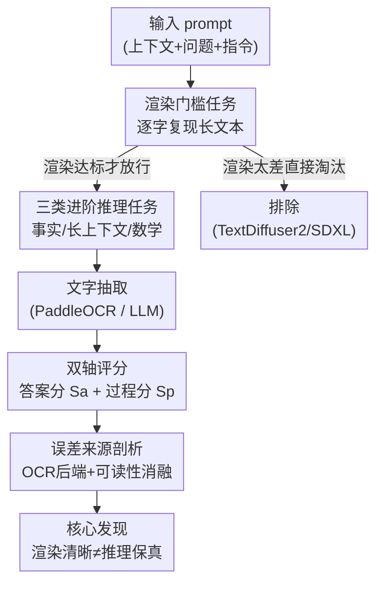

# Evaluating Reasoning Fidelity in Visual Text Generation

**会议**: CVPR 2026  
**arXiv**: [2606.04479](https://arxiv.org/abs/2606.04479)  
**代码**: 无  
**领域**: 图像生成 / 视觉文本生成评测  
**关键词**: 视觉文本生成、推理保真度、T2I 评测、过程奖励、误差解耦

## 一句话总结
这是一篇诊断性评测工作：现代 T2I 模型已经能把文字渲染得清晰好看，作者却追问"当完整推理过程必须以图像里的文字外化时，模型是否还保留了文字模型那样的推理能力"，通过一套"先筛渲染、再考推理"的分层评测发现——即便文字渲染得一清二楚，T2I 模型仍频繁产生逻辑不一致、错误中间步骤，与纯文本 LLM 之间存在巨大的推理保真度鸿沟。

## 研究背景与动机
**领域现状**：T2I 模型的视觉文本生成（visual text generation）能力快速进步，从早期 SD-1.5/SD-XL 连短文本都渲染不好，到 GlyphControl、AnyText、Glyph-ByT5、最新 GPT-Image / Gemini 已经能渲染长篇、结构化的文档式文字，催生了文档生成、PPT 生成、界面设计等应用。

**现有痛点**：现有评测几乎全部盯着**渲染质量**——OCR 准确率、版面保真度、多语言能力，反复验证"文字越长渲染越差"。但没人问过一个更要命的问题：当模型把一段需要多步推理的解答**直接画进图里**时，画出来的内容在**语义上是否正确、逻辑上是否自洽**，还是只是模仿了表面的排版套路？

**核心矛盾**：随着多模态系统越来越多地产出"文字密集的视觉输出"（文档、界面 agent 这些场景拿不到中间文本，只能看最终图像），视觉质量本身已经不够了——内容必须同时语义正确、逻辑一致。换句话说，**渲染保真度 ≠ 推理保真度**，而整个领域只测了前者。

**本文目标**：在"推理必须经由视觉文字外化"的模态约束下，诊断 T2I 模型的推理能力，并把"渲染失败"和"推理失败"两类错误干净地拆开来归因。

**切入角度**：作者注意到语言和视觉模态的边界正在模糊——VLM 能把渲染成图像的大段文字当输入做长上下文压缩与推理，反过来 T2I 也越来越能生成稠密结构文字；这意味着"文字信息经由视觉通道表征、传输、处理"正在成为新范式，那么搞清"语义推理在视觉形式下是否还保真"就变得很关键。

**核心 idea**：设计一批"对现代 LLM 是小菜、但要求 T2I 把多步推理画成图就很难"的任务，用分层评测协议把渲染错误、最终答案错误、中间步骤错误分别测出来，再用纯文本 LLM 作为推理能力的天花板参照，量化二者的差距。

## 方法详解

### 整体框架
这本质上是一个评测基准（benchmark）而非新模型，整条流水线要解决的是同一个核心难题：**推理任务失败时，到底是"字没画好"还是"根本不会推理"？** 为此作者先用一个预备的"逐字长文渲染"任务当门槛，把渲染能力不达标的模型（如 TextDiffuser-2、SDXL）筛掉；通过门槛的模型再进入三类进阶推理任务，每个生成的图像走"OCR/LLM 抽取文字 → 按任务打分"的管线，且打分同时给出**答案分**和**逐步过程分**，最后再用 OCR 后端替换、可读性指标等消融把"渲染"这个混淆因素彻底排除，证明剩下的失败确实来自推理。

### 关键设计

**1. 渲染—推理解耦的分层评测协议：先设门槛再考推理**

直接拿推理任务去测会有致命混淆——模型答错可能是因为字没画清楚（OCR 抽不出来），也可能是真的推理错了，两者混在一起没法归因。作者的做法是先上一个**预备渲染任务**：从 WikiText 随机采 500 段文字，截断到 64/128/256/512 词四档难度，用统一的"白底纯文本、不带 LaTeX 排版"模板让模型把输入原样画出来（$t=p$），再用 PaddleOCR 抽取并以 CER（字符错误率）、WER（词错误率）、OCR 置信度 ACC 衡量。只有渲染清晰的模型才放行进入推理评测，TextDiffuser-2、SDXL 这类连 64 词都画不好的直接淘汰。这一步把"能不能把字画清楚"这个前置条件单独考核，从源头上隔离了渲染噪声

**2. 双轴评分：答案分 $S_a$ + 逐步过程分 $S_p$，让"蒙对答案"无所遁形**

推理保真度的关键不是"最后答案对不对"，而是"中间每一步推得对不对"——一个模型完全可能中间步骤胡乱推却恰好蒙对答案。借鉴过程奖励模型（process reward model）的思路，作者在**步级**评测：把问题、前序所有步骤、当前步喂给 LLM 评判器（GPT-5.2），判定当前步在逻辑/数学上是否成立，每步给二元分，过程分 $S_p$ 取所有步的平均；同时因为最终答案可能被渲染错误或超长推理链污染，再额外用 LLM judge 评最终答案正确性得到答案分 $S_a$。$S_a$ 与 $S_p$ 的落差正好暴露"答案对但推理烂"的现象——实验里 Gemini 数学任务 $S_a=0.761$ 但 $S_p$ 仅 $0.419$，差距巨大，说明它常常是蒙对的

**3. 三类进阶推理任务：覆盖事实、长上下文、数学三种递进的推理强度**

光看一种任务说服力不够，作者构造了三类难度递进、对 LLM 都很简单的任务，全部要求模型在图里**显式写出中间推理步骤 + 最终答案**（$t=(r,a)$）：事实知识用 ARC（小学科学选择题，Easy/Challenge 各 200，要求对每个选项给推理再答）；长上下文理解用 DROP（300 条，需在长段落上做指代消解、计数、加法这类离散推理）；数学推理用 MATH（500 条，5 个难度各 100，竞赛风格多步数学）。这套设计的巧思在于：这些任务"文字模型闭着眼都能做对"，因此一旦 T2I 做不好，锅就只能扣在"把推理外化为视觉文字"这个模态约束上，而不是任务本身太难

**4. 误差来源剖析：用 OCR 后端替换 + 可读性指标坐实"不是渲染的锅"**

就算分层了，仍有人会质疑"过程分低会不会只是 OCR 抽错字"。作者用两组消融把这个混淆彻底堵死：其一，把 PaddleOCR 换成 DeepSeek-OCR 重测，两者 CER/WER 高度一致（如 GPT-M 在两者下 CER 0.091 vs 0.096），证明 OCR 选择影响有限；其二，用 GPT-4.1 估两个可读性指标——CCR（Character Clear Rate，清晰可读字符占比）和 ACR（All Clear Rate，整图全可读的比例），发现多数模型 CCR 很高（数学任务上 GPT-M 达 0.999），即字其实画得很清楚，但推理仍大量失败。CCR 还经 200 样本人工标注验证，与人判 Pearson 相关 0.785（剔 8 个离群点后 0.920）。结论：低过程分无法用渲染质量解释，剩下的就是真·推理失败

## 实验关键数据

### 主实验
评测对象包括闭源 GPT-Image-1.5（低/中两档质量记为 GPT-L/GPT-M）、GPT-Image-2、Gemini-2.5-Flash-Image、Flux.2-Pro，开源 Qwen-Image、SD-XL、TextDiffuser-2；并以纯文本 LLM（GPT-5.2、Qwen3-8B）作为无渲染约束的推理上界参照。下表为 Table 1 主结果（部分），$S_a$/$S_p$ 越高越好，CER/WER 越低越好：

| 模型 | 渲染 CER↓ | 渲染 WER↓ | 数学 $S_a$↑ | 数学 $S_p$↑ | 长上下文 $S_p$↑ | 事实 $S_p$↑ |
|------|-----------|-----------|-------------|-------------|------------------|-------------|
| GPT-5.2（LLM 上界） | 0.0024 | 0.0024 | 0.934 | **0.969** | **0.936** | **0.994** |
| Qwen3-8B（小 LLM） | 0.00004 | 0.0002 | 0.838 | 0.917 | 0.821 | 0.947 |
| GPT-Image-2（最强 T2I） | 0.049 | 0.283 | 0.728 | 0.845 | 0.901 | 0.931 |
| GPT-M | 0.091 | 0.347 | 0.520 | 0.615 | 0.822 | 0.919 |
| GPT-L | 0.263 | 0.613 | 0.011 | 0.126 | 0.634 | 0.825 |
| Gemini | 0.506 | 0.732 | 0.761 | 0.419 | 0.438 | 0.319 |
| Qwen-Img | 0.426 | 0.642 | 0.678 | 0.507 | 0.630 | 0.710 |
| Flux.2 | 1.352 | 1.450 | 0.608 | 0.376 | 0.796 | 0.861 |

关键读数：最强 T2I（GPT-Image-2）在所有任务上仍明显落后纯文本 LLM，尤其难任务上差距最大；Gemini 数学答案分 0.761 但过程分仅 0.419，是"答对推理错"的典型；GPT-L 数学几近崩溃（$S_a=0.011$），而提升生成质量到 GPT-M 后 $S_a$ 跳到 0.520，说明渲染质量确实能部分改善推理但远不能补齐与 LLM 的差距。

### 消融实验

**OCR 后端替换（Table 2）**：验证评测对 OCR 选择不敏感。

| 模型 | PaddleOCR CER↓ | DeepSeek-OCR CER↓ | PaddleOCR WER↓ | DeepSeek-OCR WER↓ |
|------|----------------|--------------------|-----------------|---------------------|
| GPT-M | 0.091 | 0.096 | 0.347 | 0.351 |
| Gemini | 0.506 | 0.502 | 0.732 | 0.716 |
| Flux.2 | 1.352 | 1.553 | 1.450 | 1.648 |

**渲染可读性（Table 3）**：证明字其实画清楚了，失败不在渲染。

| 模型 | 文本渲染 CCR↑ | 文本渲染 ACR↑ | 数学 CCR↑ | 数学 ACR↑ |
|------|---------------|----------------|------------|------------|
| GPT-M | 0.998 | 0.905 | 0.999 | 0.938 |
| Gemini | 0.988 | 0.758 | 0.996 | 0.899 |
| Qwen | 0.882 | 0.416 | 0.967 | 0.408 |
| Flux.2 | 0.995 | 0.886 | 0.992 | 0.714 |

### 关键发现
- **渲染质量与推理保真度脱钩**：CCR 普遍很高（GPT-M 数学 0.999）说明字画得清楚，但过程分仍大量失败——这是全文最核心的结论，二者是两件事。
- **答案对 ≠ 推理对**：多数 T2I 答案分明显高于过程分，模型常在中间步骤逻辑不一致/幻觉/重复复读的情况下蒙对答案；步级评测才能戳穿这点。
- **难度越高差距越大**：随任务难度上升 $S_a$/$S_p$ 双双下降，且过程分下降比答案分更剧烈，长上下文与数学任务上 T2I 与 LLM 的鸿沟最明显。
- **生成质量能部分救场但救不全**：GPT-M 全面优于 GPT-L，提升渲染质量减少了渲染失败、推理链更连贯，但仍补不齐与纯文本 LLM 的差距。

## 亮点与洞察
- **"先设渲染门槛再考推理"的解耦设计极其干净**：把"会不会画字"和"会不会推理"两个独立能力用一个前置任务隔开，避免了把渲染噪声误读成推理失败，是这类模态约束评测的范式级做法，可迁移到任何"经由某种受损通道外化能力"的评测。
- **借过程奖励模型思路做步级过程分 $S_p$**：不满足于看最终答案，而是逐步判定逻辑有效性，直接量化出"蒙对答案"现象——这是揭示 T2I 推理虚假繁荣的关键武器，对评测任何需要展示推理链的生成系统都适用。
- **用纯文本 LLM 当推理上界参照系**：同样的任务在 LLM 上接近满分，于是 T2I 的差距就被清晰地归因到"模态约束"而非"任务难度"，这种"同任务跨模态对照"的实验设计很有说服力。
- **多重消融堵死归因质疑**：OCR 换后端 + VLM 可读性指标 + 人工标注相关性，三层证据链坐实"失败来自推理而非渲染"，把潜在反驳提前消化掉。

## 局限与展望
- **端到端设定可能低估真实推理能力**：模型必须既生成图像又把推理外化为可读文字，有些模型也许内部会推理但外化不出来，需要探测内部状态才能区分；当前评测看不到这一层。
- **抽取误差仍可能残留**：尽管用严格排版约束 + 多 OCR 后端 + 可读性校验缓解，数学符号/公式的抽取仍可能影响打分（作者自己承认）。
- **渲染相关因素未穷举**：受算力/预算限制，没有系统扫字号、笔画宽度、版面密度等可能影响可读性与抽取质量的变量。
- **被测模型本身定位偏差**：很多 T2I 是为自然图像或短嵌入文字优化的，本就不擅长长篇结构化文档，渲染稠密段落/多步推理链对它们天然吃力——这既是发现也是评测的边界条件。
- **改进方向**：作者建议训练专门面向"可靠长文渲染"的 T2I 蒸馏变体，作为更稳定的平台来评测视觉空间里的推理保真度。

## 相关工作与启发
- **vs 渲染质量类基准（TextAtlas5M、STRICT、LeX-Art、GlyphMM-3M）**：它们测 OCR 准确率、版面保真、长文渲染、多语言，结论多是"文字越长越难渲染"；本文不测字画得好不好，而是测画出来的内容**语义/逻辑对不对**，正是这些工作集体忽略的维度。
- **vs 多模态推理基准（MMMU、MathVista、ChartQA）**：它们考的是模型**读懂**视觉输入（图表、图示）做推理；本文反过来考模型把推理**写成**视觉文字，方向相反、互补。
- **vs 推理增强生成（ThinkDiff、GoT、ShortCoTI、PPAD）**：这些工作给 T2I 接外部规划/CoT 模块来增强推理；本文是诊断而非增强——先把"当前 T2I 推理到底有多不保真"量化清楚，为这类方法提供了缺失的评测标尺。

## 评分
- 新颖性: ⭐⭐⭐⭐⭐ 第一个把"视觉文本生成中的推理保真度"单独拎出来评测，问题切口新且重要
- 实验充分度: ⭐⭐⭐⭐ 覆盖 7 个 T2I + 2 个 LLM、四类任务、多重消融与人工校验，但渲染相关变量未穷扫
- 写作质量: ⭐⭐⭐⭐ 解耦逻辑清晰、消融环环相扣，叙述易懂
- 价值: ⭐⭐⭐⭐⭐ 揭示"渲染清晰≠推理保真"的关键鸿沟，为推理感知的视觉文本生成与评测立了标杆

<!-- RELATED:START -->

## 相关论文

- [\[CVPR 2026\] Thinking-while-Generating: Interleaving Textual Reasoning throughout Visual Generation](thinking-while-generating_interleaving_textual_reasoning_throughout_visual_gener.md)
- [\[CVPR 2026\] FontCrafter: High-Fidelity Element-Driven Artistic Font Creation with Visual In-Context Generation](fontcrafter_high-fidelity_element-driven_artistic_font_creation_with_visual_in-c.md)
- [\[CVPR 2026\] UniVerse: Empower Unified Generation with Reasoning and Knowledge](universe_empower_unified_generation_with_reasoning_and_knowledge.md)
- [\[CVPR 2026\] POCA: Pareto-Optimal Curriculum Alignment for Visual Text Generation](poca_pareto-optimal_curriculum_alignment_for_visual_text_generation.md)
- [\[CVPR 2026\] Rethinking Prompt Design for Inference-time Scaling in Text-to-Visual Generation](rethinking_prompt_design_for_inference-time_scaling_in_text-to-visual_generation.md)

<!-- RELATED:END -->
