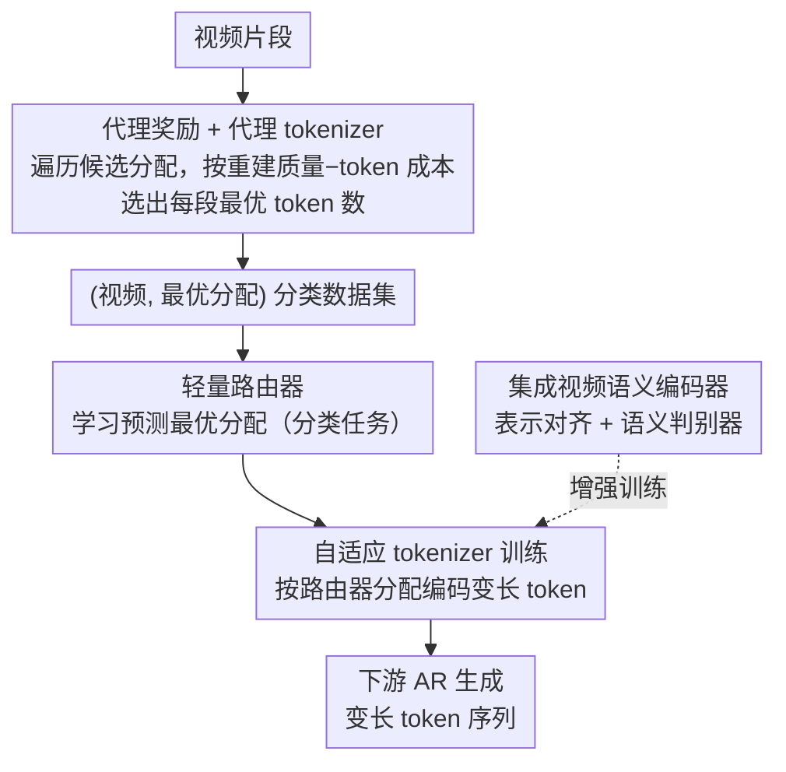

# EVATok: 自适应长度视频Tokenization用于高效视觉自回归生成

**会议**: CVPR 2026  
**arXiv**: [2603.12267](https://arxiv.org/abs/2603.12267)  
**代码**: [项目页](https://silentview.github.io/EVATok/)  
**领域**: 视频理解 / 视频生成 / 模型压缩  
**关键词**: video tokenizer, adaptive token, autoregressive generation, efficiency, VQ-VAE

## 一句话总结
提出EVATok框架——通过最优token分配估计+轻量路由器+自适应tokenizer训练的三步流程，让视频tokenizer按片段复杂度自适应分配token长度，在UCF-101上节省24.4%+ token同时达到SOTA生成质量。

## 背景与动机
自回归（AR）视频生成依赖视频tokenizer将像素压缩为离散token序列，token序列的长度直接决定下游生成的计算成本。现有视频tokenizer对所有时间块都均匀分配固定数量的token，完全不考虑内容复杂度的差异。然而视频中的信息密度分布极不均匀——静态背景、重复纹理、缓慢运动的片段包含很少的信息，而快速运动、场景切换、精细纹理的片段信息密度极高。

## 核心问题
统一token分配对简单片段浪费token（用了很多token但重建质量已经饱和），对复杂片段则token不够（欠表达导致重建变差）。如何让不同视频、不同片段获得最优的token数量分配？挑战有三：（1）"最优"如何定义？需要在重建质量和效率之间找帕累托最优（2）最优分配对每个视频都不同，逐视频优化太慢（3）tokenizer需要能处理不等长的token输入。

## 方法详解

### 整体框架
EVATok 要解决的是「视频不同片段信息密度差异极大、却被统一分配等量 token」的浪费问题，做法是让 tokenizer 按内容复杂度自适应决定每个时间块用多少 token。整个框架分三步串行：① 先估计出每个视频的最优 token 分配，作为监督信号；② 训练一个轻量路由器（router）来快速预测这个分配；③ 用路由器的分配训练最终能处理变长 token 的自适应 tokenizer，供下游自回归（AR）生成使用。其中第 ① 步是核心难点——「最优分配」此前既无定义也无估计方法，本文用一个代理 tokenizer（proxy tokenizer）配合新提出的代理奖励（proxy reward）把它变成可枚举求解的问题。贯穿 tokenizer 训练始终的还有一项增强 recipe：集成视频语义编码器做表示对齐。

### 关键设计

**1. 代理奖励 + 代理 tokenizer：把"最优分配"从无定义变成可枚举求解**

要按复杂度分配 token，前提是先知道「每个视频、每个时间块到底用多少 token 才最优」，但此前的自适应 tokenizer（ElasticTok、AdapTok）只能靠阈值搜索或 mini-batch 内整数线性规划（ILP）启发式地选，既受 batch 组成牵连、又不保证全局质量-成本平衡，"最优分配"连定义都没有。本文把它形式化为「最大化代理奖励（proxy reward）的分配识别问题」：proxy reward 是一个同时刻画重建质量与 token 成本（序列长度）的新指标，分配的 proxy reward 越高，质量-成本权衡就越好。为了能算出任意分配的 proxy reward，作者先训练一个能在不同 token 分配下重建视频的代理 tokenizer（proxy tokenizer）；训练好后，对一个视频直接遍历所有候选分配、算各自的 proxy reward，取最大者即该视频的最优分配。把这些 (视频, 最优分配) 配对收集起来，就得到第 ② 步路由器的监督数据集。这一步离线、逐视频、计算量大，但只需做一次。

**2. 轻量路由器：把昂贵的逐视频枚举压成一次前向预测**

第 ① 步的枚举求解太慢，无法在 tokenizer 训练/推理时实时为每个视频做。解法是训练一个小型路由器（router），输入视频片段特征、以分类任务的形式直接预测它的最优分配，监督目标就是第 ① 步产出的 (视频, 最优分配) 数据集。推理时路由器一次前向即可给出所有片段的 token 预算，参数量极小、开销可忽略，从而把"逐视频枚举搜索"换成"学到的快速预测"。实验显示路由器预测与真实最优分配的一致性 >90%，说明片段复杂度对视觉特征是高度可预测的。

**3. 自适应 tokenizer：吃变长 token、按路由器分配编码**

常规 tokenizer 只能输出固定长度，无法执行"不同时间块给不同 token 数"的分配。本文基于 Q-Former 式的一维（1D）tokenizer 设计（1D 序列没有网格空间先验、长度易调），从头训练一个能处理不等长 token 输入/输出的自适应 tokenizer：训练时由路由器为每个输入视频实时决定分配，让 tokenizer 学会在变长预算下都能良好编解码。它产出的变长 token 序列直接支撑下游高效的自适应长度 AR 生成。

**4. 集成视频语义编码器：让 token 不只像素级保真、还语义级对齐**

这是贯穿 tokenizer 训练的一项增强 recipe，而非独立的流水线步骤。纯像素级重建出来的 token 未必承载良好语义，会限制下游 AR 生成质量。本文把预训练视频语义编码器的表示对齐（representation alignment）引入 tokenizer 训练，并配合语义视频判别器，使学到的 token 在语义层面也保真。消融显示加入后 FVD 进一步降低，印证语义信号对 token 质量同样关键。

### 损失函数/训练策略
- Tokenizer训练：重建损失（L1/L2 + perceptual loss）+ VQ量化损失 + 语义对齐损失
- 路由器训练：模仿最优分配的分类/回归损失
- AR生成模型：标准自回归交叉熵损失，在EVATok产出的变长token上训练

## 实验关键数据

| 数据集 | 方法 | FVD↓ | Token节省 |
|--------|------|------|-----------|
| UCF-101 | LARP (固定长度) | 基线 | 0% |
| UCF-101 | **EVATok** | **SOTA** | **≥24.4%** |
| UCF-101 | 固定长度baseline | 基线 | 0% |

### 消融实验要点
- 自适应 vs 固定分配：自适应在同等平均token数下FVD显著更低
- 路由器准确度：路由器预测与真实最优分配的一致性高（>90%），说明分配是可预测的
- 语义编码器集成：加入后FVD进一步降低，说明语义信号对token质量有帮助
- token数量的最优分布：简单片段集中在低token区间，复杂片段分散在高token区间，分布呈长尾

## 亮点 / 我学到了什么
- "先估计最优解，再训路由器模仿"的两步范式非常实用——避免了端到端训练中最优性和效率的矛盾
- 24.4%的token节省直接意味着AR生成的24.4%计算量减少，这在视频生成的实际部署中价值巨大
- 路由器>90%的预测准确率说明"片段复杂度"是一个对视觉特征高度可预测的量
- 与语义编码器集成的策略表明token质量不只是像素级概念，语义层面的信号同样重要

## 局限与展望
- 路由器本身的计算开销虽小但非零，对极端延迟敏感的场景是否可忽略？
- 最优token分配的估计依赖离线搜索，训练集之外的新视频类型是否泛化？
- 自适应长度是否会给AR生成模型带来训练不稳定（因为序列长度不固定）？
- 能否推广到图像tokenizer？图像的空间区域也有复杂度差异

## 与相关工作的对比
- vs LARP等固定长度视频tokenizer：EVATok在更少token下达到更好质量
- vs TiTok/MAGVIT等先进tokenizer：EVATok的核心贡献是自适应分配策略，可作为它们的增强
- vs TrajTok：TrajTok聚焦理解端的轨迹分组，EVATok聚焦生成端的token长度优化，互补

## 与我的研究方向的关联
- 自适应token分配的框架直接可扩展到VLM的视觉token压缩——对简单图像区域分配少token
- "路由器预测最优配置"的设计模式可复用：训练小模型预测大模型的最优超参数/配置
- 与BiGain、TrajTok等工作形成视觉token效率的完整方法族

## 评分
- 新颖性: ⭐⭐⭐⭐ — 自适应token分配不算新概念，但三步框架的系统化设计和在视频生成上的验证有价值
- 实验充分度: ⭐⭐⭐⭐ — UCF-101验证充分，但缺少更大规模/更多数据集的验证
- 写作质量: ⭐⭐⭐⭐ — 框架描述清晰，三步流程一目了然
- 对我的价值: ⭐⭐⭐⭐ — 路由器+自适应分配的设计模式可直接借鉴

<!-- RELATED:START -->

## 相关论文

- [\[CVPR 2026\] Spherical Leech Quantization for Visual Tokenization and Generation](spherical_leech_quantization_for_visual_tokenization_and_generation.md)
- [\[CVPR 2026\] CaTok: Taming Mean Flows for One-Dimensional Causal Image Tokenization](catok_taming_mean_flows_for_one-dimensional_causal_image_tokenization.md)
- [\[CVPR 2025\] Language-Guided Image Tokenization for Generation](../../CVPR2025/image_generation/language-guided_image_tokenization_for_generation.md)
- [\[ICCV 2025\] Efficient Autoregressive Shape Generation via Octree-Based Adaptive Tokenization](../../ICCV2025/image_generation/efficient_autoregressive_shape_generation_via_octree-based_adaptive_tokenization.md)
- [\[CVPR 2025\] Efficient Long Video Tokenization via Coordinate-based Patch Reconstruction](../../CVPR2025/image_generation/efficient_long_video_tokenization_via_coordinate-based_patch_reconstruction.md)

<!-- RELATED:END -->
