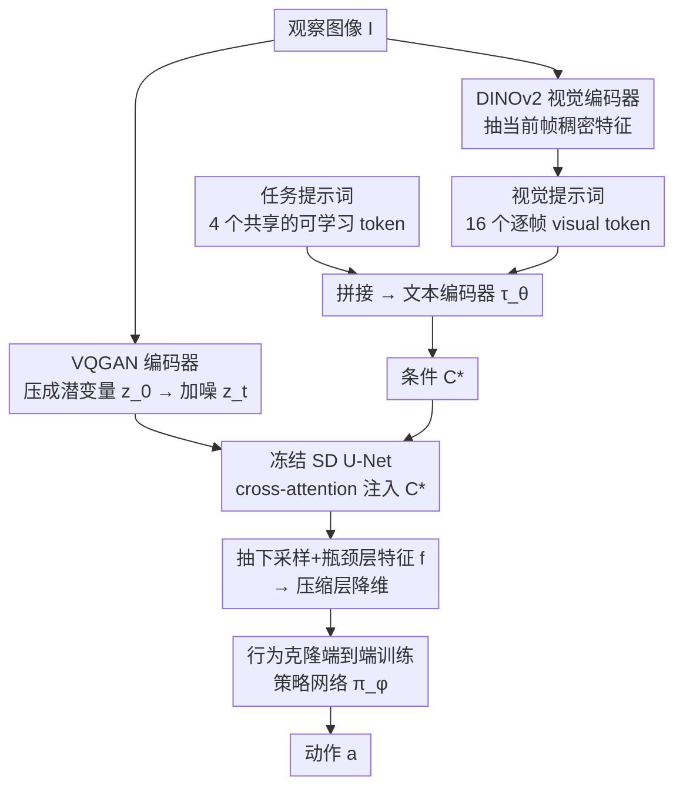

# Exploring Conditions for Diffusion Models in Robotic Control

**会议**: CVPR 2026  
**arXiv**: [2510.15510](https://arxiv.org/abs/2510.15510)  
**代码**: [https://orca-rc.github.io/](https://orca-rc.github.io/)  
**领域**: 扩散模型 / 机器人控制  
**关键词**: 扩散模型, 机器人控制, 视觉表示, 任务自适应, 可学习提示词

## 一句话总结
本文探索了如何用预训练文本到图像扩散模型的条件机制为机器人控制生成任务自适应的视觉表示，发现文本条件在控制环境中因域差距而无效，提出 ORCA 框架通过可学习的任务提示词(task prompts)和逐帧视觉提示词(visual prompts)作为条件机制，在 DMC/MetaWorld/Adroit 三个基准的 12 个任务上达到 SOTA。

## 研究背景与动机

1. **领域现状**：预训练视觉表示（如 CLIP、VC-1、MVP）已成为模仿学习的标准范式——冻结预训练编码器提取视觉特征，下游策略网络学习从特征到动作的映射。同时，扩散模型（如 Stable Diffusion）在语义分割、深度估计等视觉感知任务中已展现出强大的表示能力，且通过文本条件可以实现任务自适应。

2. **现有痛点**：(a) 冻结的视觉表示是任务无关的——同一表示在不同控制任务上性能波动大，需要逐任务手动挑选；(b) 微调视觉编码器会因模仿学习数据量少而严重过拟合；(c) 文本条件在视觉感知任务中效果显著（如 VPD 中描述图中物体提升语义分割），但直接应用于控制环境效果甚微甚至有害。

3. **核心矛盾**：控制环境与扩散模型训练数据（网络图像）存在巨大域差距，导致文本-图像关联失败；同时控制任务是动态视频流而非静态图像，需要逐帧的细粒度条件而非全局描述。

4. **本文目标** 如何为扩散模型设计适合机器人控制的条件机制，使其在不微调模型本身的情况下生成任务自适应的视觉表示？

5. **切入角度**：通过分析 cross-attention map 发现，文本条件在控制环境中存在接地失败（grounding failure）——如"cheetah"一词无法在 MuJoCo 渲染的猎豹上形成正确的注意力。因此条件应该(a)能适应控制环境、(b)包含逐帧视觉信息。

6. **核心 idea**：用可学习的任务提示词替代文本条件来适应控制环境，并引入基于视觉编码器的逐帧视觉提示词来捕获动态细节，两者都通过行为克隆目标端到端学习。

## 方法详解

### 整体框架
ORCA 想解决的是：怎么让一个冻结的文生图扩散模型，针对每个机器人控制任务吐出"刚好合用"的视觉特征，而不靠微调模型本身。整条管线是这样转的——一帧观察图像 $I$ 先经 VQGAN 编码器压成潜变量 $z_0$，在时间步 $t=0$ 加噪得到 $z_t$ 后喂进 Stable Diffusion 的 U-Net；与此同时，一组任务提示词和逐帧的视觉提示词被拼起来过文本编码器，生成条件 $\mathcal{C}^*$ 注入 U-Net 的 cross-attention。U-Net 前向一遍，从下采样层和瓶颈层抽出中间特征 $f$，经一个压缩层降维后送进策略网络 $\pi_\phi$ 输出动作。全程扩散模型权重纹丝不动，可训练的只有两组提示词、压缩层和策略网络。关键就在那个条件 $\mathcal{C}^*$：换掉它，同一个冻结模型就能为不同任务给出不同的特征。

### 关键设计

**1. 任务提示词：用可学习 token 替掉失效的文本条件**

文生图模型本来靠文本条件做任务自适应，但本文发现这套在控制环境里直接失灵——MuJoCo 渲染的"猎豹"和网络图片里的猎豹差太远，"cheetah"这个词的 cross-attention 根本接地（grounding）不到画面里的智能体身上。ORCA 的做法是干脆不用真实文本，而是把条件做成 $l_t = 4$ 个可学习 token，在所有训练观察间共享，让模型自己学出一套隐式"词汇"。这些 token 通过行为克隆损失 $\mathcal{L}_{\text{BC}}$ 端到端优化，cross-attention 会自动聚到任务相关区域上：可视化里它在 Button-press 上同时盯住按钮和机械臂，在 Cheetah-run 上覆盖整个智能体身体。绕开文本、直接学 token，既躲过了域差距导致的接地失败，又省去人工设计描述的麻烦。

**2. 视觉提示词：给条件补上逐帧的空间细节**

任务提示词在整个训练集里是共享的，只能编码"这是什么任务"这种任务级信息，没法描述某一帧里智能体此刻的姿态。可控制任务恰恰是动态视频流，需要逐帧不同的条件去引导细粒度动作。为此 ORCA 用预训练的 DINOv2 当视觉编码器 $\mathcal{E}_V$，对当前帧抽**稠密**视觉特征（而非一个全局向量），再用一个小卷积层投影成 $l_v = 16$ 个 visual token，和任务提示词拼接后一起过文本编码器。之所以要稠密特征，是因为全局向量分不清前腿后腿这类局部动作，而稠密特征保留了空间布局——可视化里不同 visual token 在 Relocate 任务的不同阶段各自盯住手、桌子、球。一句话，任务提示词管"做什么"，视觉提示词管"此刻画面里发生了什么"。

**3. 行为克隆端到端训练：只学条件，不动模型**

两组提示词和策略网络是在下游模仿学习里一起学出来的。给定演示轨迹 $\{I_o^i, a_o^i\}$，优化目标是

$$\mathcal{L}_{\text{BC}}(\phi, \mathbf{p}) = \sum_{i,o} \big\|\pi_\phi\big(\epsilon_\theta(z_t, t; \mathcal{C}^*)\big) - a_o^i\big\|, \qquad \mathcal{C}^* = \tau_\theta(p_t; p_v)$$

其中 $p_t$、$p_v$ 是任务/视觉提示词，$\tau_\theta$ 是文本编码器。扩散模型 $\epsilon_\theta$ 全程冻结，可训练参数只有 10.6M（提示词 + 压缩层 + 策略网络）。这么设计是因为模仿学习数据量小，全微调扩散模型会严重过拟合——实验里全微调让成功率从 58% 崩到 9.3%。把适配压缩进一组轻量提示词后，换任务只需换提示词模块，模型本体复用，任务自适应和防过拟合就同时拿到了。

### 损失函数 / 训练策略
- 标准行为克隆 L1/L2 损失
- 扩散模型使用 SD 1.5，时间步 $t=0$
- 使用下采样块(down_1-3)和瓶颈块(mid)的特征拼接
- 每个任务训练 100 epoch，每 10 epoch 在线评估
- Adroit 2次演示、DMC 5次、MetaWorld 5次

## 实验关键数据

### 主实验

**DeepMind Control 归一化得分**:

| 方法 | Stand | Walk | Reacher | Cheetah | Finger | Mean |
|------|-------|------|---------|---------|--------|------|
| CLIP | 87.3 | 58.3 | 54.5 | 29.9 | 67.5 | 59.5 |
| VC-1 | 86.1 | 54.3 | 18.3 | 40.9 | 65.7 | 53.1 |
| SCR (null cond.) | 85.5 | 64.3 | 81.8 | 43.4 | 66.6 | 68.3 |
| CoOp | 87.2 | 67.8 | 87.1 | 45.0 | 65.9 | 70.6 |
| TADP | 89.0 | 69.9 | 86.6 | 41.1 | 66.9 | 70.7 |
| **ORCA** | **89.1** | **76.9** | **87.6** | **50.0** | **68.0** | **74.3** |

**Adroit 成功率 (%)**:

| 方法 | Pen | Relocate | Mean |
|------|-----|----------|------|
| VC-1 | 65.3 | 29.3 | 47.3 |
| SCR | 84.0 | 32.0 | 58.0 |
| TADP | 81.3 | 33.3 | 57.3 |
| **ORCA** | **86.7** | **44.0** | **65.3** |

### 消融实验

**组件分析 (DMC)**:

| Task Prompt | Visual Prompt | Mean Score |
|:-----------:|:------------:|:----------:|
| ✗ | ✗ | 68.3 |
| ✓ | ✗ | 69.8 |
| ✗ | ✓ | 70.5 |
| ✓ | ✓ | **74.3** |

**微调 vs 提示词学习 (Adroit)**:

| 方法 | 可学习参数 | Mean |
|------|-----------|------|
| SCR (frozen) | - | 58.0 |
| SCR + Full FT | 346.7M | 9.3 |
| SCR + LoRA | 4.6M | 60.0 |
| ORCA | 10.6M | **65.3** |

### 关键发现
- **文本条件在控制任务中不可靠**：文本条件在部分任务提升（Button-press）但其他任务下降（Cheetah-run），归因于扩散模型训练数据与控制环境的域差距导致 cross-attention 接地失败
- **任务提示词和视觉提示词互补且缺一不可**：单独使用各提升 1.5-2.2 分，组合使用提升 6 分（68.3→74.3），说明不同任务对任务级和帧级信息的需求不同
- **全微调灾难性**：SCR 全微调后成功率从 58% 降到 9.3%，而 ORCA 仅用 10.6M 参数达到 65.3%，说明条件学习远优于参数微调
- **U-Net 早期层更适合控制任务**：下采样层 + 瓶颈层的特征优于上采样层，因为早期层编码更高层的语义信息

## 亮点与洞察
- **揭示了文本条件在控制领域的失败模式**：通过 cross-attention 可视化分析，清楚展示了域差距如何导致文本接地失败。这个发现对所有试图在控制任务中使用 VLM 条件的研究有警示价值。null condition 的 <eos> token 已经粗略接地到显著目标，解释了为什么不好的文本条件反而比空条件更差。
- **任务提示词作为隐式任务描述**：不同于显式文本描述，可学习 token 通过端到端训练自动发现任务相关区域，避免了人工设计文本的困难和域差距问题。这个方案的简洁性和有效性令人印象深刻。
- **视觉提示词的动态注意力**：可视化显示不同 visual token 在 Relocate 任务的不同阶段关注不同区域——捡球阶段关注桌面，移动阶段关注手部，说明模型学会了根据任务进度动态调整注意力。

## 局限与展望
- **仅使用 SD 1.5**：较老的 U-Net 架构，DiT 等新架构可能需要不同的条件设计
- **DINOv2 视觉编码器的选择缺乏充分消融**：其他视觉编码器（如 MAE、CLIP）的效果未详细比较
- **仅在模拟环境评估**：MuJoCo 模拟器与真实机器人操控仍有差距
- **动作空间有限**：主要是连续控制和简单操控任务，复杂的长时地平线任务未验证
- **改进方向**：探索 DiT 架构下的条件设计；在真实机器人场景验证；结合 VLM 的语义理解和 ORCA 的视觉条件

## 相关工作与启发
- **vs SCR**: SCR 首次将 Stable Diffusion 引入控制任务但使用空条件（任务无关），ORCA 通过学习条件实现任务自适应，DMC Mean 从 68.3 提升到 74.3
- **vs VPD/TADP**: VPD 和 TADP 在语义分割等视觉任务中用文本条件成功，但本文发现这策略在控制任务中因域差距失效——控制环境不是自然图像
- **vs VC-1**: VC-1 用 MAE 预训练在大规模视频数据上，是强大的任务无关表示，但 ORCA 在所有任务上都优于它，说明任务自适应的条件表示优于更大规模的无关预训练
- 本文的核心启示：在将预训练模型迁移到新领域时，条件/提示词的设计比模型本身的选择更重要

## 评分
- 新颖性: ⭐⭐⭐⭐ 首次系统探索扩散模型条件机制在控制中的作用，task+visual prompt 设计简洁有效
- 实验充分度: ⭐⭐⭐⭐⭐ 12个任务、3个基准、多种基线对比、丰富的消融和可视化分析
- 写作质量: ⭐⭐⭐⭐⭐ 动机分析（cross-attention 可视化）极具说服力，行文流畅
- 价值: ⭐⭐⭐⭐ 对机器人视觉表示设计有实际指导意义，但限于模拟环境

<!-- RELATED:START -->

## 相关论文

- [\[CVPR 2026\] Guiding Diffusion Models with Semantically Degraded Conditions](guiding_diffusion_models_with_semantically_degraded_conditions.md)
- [\[CVPR 2026\] Image Generation as a Visual Planner for Robotic Manipulation](image_generation_as_a_visual_planner_for_robotic_manipulation.md)
- [\[CVPR 2026\] Pixel Motion Diffusion Is What We Need for Robot Control](pixel_motion_diffusion_is_what_we_need_for_robot_control.md)
- [\[CVPR 2026\] Guiding Diffusion Models with Fine-Grained Conditions and Semantics-Preserving Sampling for One-Shot Federated Learning](guiding_diffusion_models_with_fine-grained_conditions_and_semantics-preserving_s.md)
- [\[CVPR 2026\] Exploring Spatial Intelligence from a Generative Perspective](exploring_spatial_intelligence_from_a_generative_perspective.md)

<!-- RELATED:END -->
