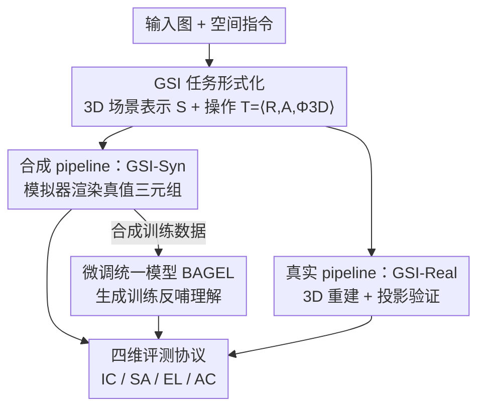

# Exploring Spatial Intelligence from a Generative Perspective

**会议**: CVPR 2026  
**arXiv**: [2604.20570](https://arxiv.org/abs/2604.20570)  
**代码**: 待确认  
**领域**: 图像生成 / 图像编辑 / 多模态VLM / 空间智能  
**关键词**: 生成式空间智能、空间编辑、3D 先验、合成基准、统一多模态模型  

## 一句话总结
本文提出"生成式空间智能"(GSI)概念——统一多模态模型在生成图像时遵守并操控 3D 空间约束的能力，并构建首个量化基准 GSI-Bench（真实集 GSI-Real + 合成集 GSI-Syn），通过空间锚定的图像编辑任务来评测；进一步证明仅用合成编辑数据微调 BAGEL，不仅大幅提升生成侧空间编辑能力，还能反向迁移增强模型的空间"理解"能力。

## 研究背景与动机

**领域现状**：空间智能（推理物体、场景及其几何关系）是多模态大模型走向具身导航、机器人操作的基石。但当前几乎所有空间智能数据集、基准、建模方法都站在"理解"的视角——识别/QA 式监督、2D/3D 感知 pipeline、离线诊断测试集。同时，统一多模态模型（同时做理解和生成）兴起，已有证据表明"更强的理解能反过来提升生成质量"。

**现有痛点**：反方向几乎无人探索——**生成本身能否帮模型更深刻地掌握空间概念，从而增强理解**？而且，要回答这个问题先得有评测手段，但现有编辑数据集（如 ScanNet++ 衍生）几乎没有精确的空间操作标注；更麻烦的是，"把苹果向左移 15cm"这类成对图像之间的空间操作很难用清晰、无歧义的自然语言描述出来。

**核心矛盾**：文本生成图（T2I）虽然也隐含空间推理，但开放式 prompt 带来歧义、且没有唯一 ground-truth 目标，无法客观量化空间一致性。要量化空间能力，必须把任务约束到"给定输入图 + 明确空间指令 → 生成满足约束的输出图"这种有唯一正确答案的形式。

**本文目标**：拆成三个子问题——(1) 现代生成/统一模型是否具备 GSI？(2) GSI 能否可靠、可扩展、模型无关地度量？(3) 能否通过针对性干预增强 GSI，且这种增强能否迁移到下游空间理解任务？

**切入角度**：把每个场景显式建模为隐含 3D 结构（物体布局 + 相机参数），从而把"空间操作"形式化为结构化的 3D 变换 $\Phi_{\text{3D}}$，再渲染/投影回图像。这样语言指令、几何变换、图像评测就有了统一接口。

**核心 idea**：用"空间锚定的图像编辑"任务把抽象的 GSI 具象成可量化指标，并用模拟器生成精确标注的合成数据来度量+训练，验证"生成式训练能增强空间理解"这一反向命题。

## 方法详解

### 整体框架
本文不提新模型结构，核心贡献是一个**任务形式化 + 双数据 pipeline + 四维评测协议 + 微调验证**的完整闭环。整体逻辑：先把场景表示为 3D 结构 $\mathcal{S}=\{\mathcal{O}_i\}_{i=1}^N\cup\{\mathcal{C}\}$（物体 $\mathcal{O}_i=(\mathbf{c}_i,\mathbf{s}_i,\mathbf{R}_i)$ 中心/尺寸/朝向，相机 $\mathcal{C}=(\mathbf{R}_c,\mathbf{t}_c,K)$），把空间指令结构化为 $\mathcal{T}=\langle\mathcal{R},\mathcal{A},\Phi_{\text{3D}}\rangle$（目标物体、动作、几何变换）；再走两条数据构建路线（合成 GSI-Syn 走模拟器有完美真值、真实 GSI-Real 走 3D 重建 + 投影验证）；产出的三元组 $(\mathcal{I},\mathcal{T},\mathcal{I}')$ 既用于评测也用于微调；最后用四维协议打分，并把合成数据拿去微调统一模型 BAGEL，验证生成训练对理解的反向增益。

七类空间操作覆盖物体级/相机级/场景级：相机相对移动(CM)、物体相对放置(OP)、物体旋转(OR)、容器放置(RP)、视角控制(PC)、空间移除(SR)、物体缩放(OS)。

### 关键设计

**1. 把 GSI 形式化为"3D 变换驱动的图像编辑"：给抽象能力一个有唯一答案的载体**

要量化"生成时是否遵守空间约束"，最大障碍是 T2I 任务没有唯一正确答案。本文的破解办法是改用图像到图像编辑，并把每个场景显式建模为隐含 3D 结构 $\mathcal{S}=\{\mathcal{O}_i\}\cup\{\mathcal{C}\}$，任意 3D 点投影到图像平面为 $\tilde{\mathbf{p}}_i=\pi(K(\mathbf{R}_c\mathbf{p}_i+\mathbf{t}_c))$。空间指令被结构化为三元组 $\mathcal{T}=\langle\mathcal{R},\mathcal{A},\Phi_{\text{3D}}\rangle$，其中几何变换显式更新物体位姿或相机参数：

$$(\mathbf{c}_i,\mathbf{R}_i,\mathbf{R}_c,\mathbf{t}_c)_{\text{src}}\mapsto(\mathbf{c}_i',\mathbf{R}_i',\mathbf{R}_c',\mathbf{t}_c')_{\text{dst}}$$

例如"把苹果向左移 15cm"是相机相对平移，"把杯子放到盘子左边"是关系约束 $\mathbf{c}_{\text{cup}}'=\mathbf{c}_{\text{plate}}+\Delta_{\text{left}}$。这种形式化让语言指令、3D 几何变换、可量化评测共享同一接口——区别于以往"让它看起来晴天"这类只改像素外观的定性编辑，本文的操作真正修改底层场景几何，从而能用 $\mathcal{S}_{\text{dst}}$ 当作客观真值来判分

**2. 合成基准 GSI-Syn：用模拟器换来"完美真值 + 可自动验证 + 可无限扩展"**

真实数据拿不到精确 3D 真值，本文用 AI2-THOR、MesaTask 等模拟器规避这一痛点：模拟器天然提供初始场景 $\mathcal{S}_{\text{src}}$、精确变换 $\Phi_{\text{3D}}$、目标场景 $\mathcal{S}_{\text{dst}}$，还能直接从 $\mathcal{S}_{\text{dst}}$ 渲染出真值编辑图 $\mathcal{I}'$，得到高质量 $(\mathcal{I},\mathcal{T},\mathcal{I}')$ 三元组。pipeline 分四步：①**视角采样**——对室内场景用 DBSCAN 在平面图上聚类分房间，房间内做最大离散视角采样，并优先选可操作物体多的"actionable"视角；②**动作候选 + 几何接地**——随机选未遮挡、稳定支撑的目标物，关系操作再选参照/容器物，做严格 3D 几何检查（相机平移要保证目标仍可见且不掉出支撑面，关系放置要查空间充裕度和碰撞），模板生成指令文本；③**模拟执行 + 成功验证**——先解析算出理想终态 $\mathcal{S}_{\text{dst}}^{\text{ideal}}$，物理引擎执行得实际终态 $\mathcal{S}_{\text{dst}}^{\text{actual}}$，二者匹配才算成功，失败（如意外碰撞）回滚重采样；④**后处理过滤**——先用实例分割掩码剔除像素变化可忽略的样本，再用 Qwen3-VL-235B 当质量门，丢掉穿模、物理不合理、严重遮挡等硬规则抓不到的瑕疵样本。这一套让合成数据兼具规模、精度和物理合理性

**3. 真实基准 GSI-Real：在拿不到真值图时，靠"3D 重建 + 投影 + MLLM/人工双重把关"造出可信测试集**

真实场景域差小、贴近下游应用，但既无完美 3D 表示也无法真实执行物理变换拿到 $\mathcal{I}'$。本文设计了一条绕开 $\mathcal{I}'$ 的协议：每个样本表示为 $(\mathcal{I},\mathcal{T},\mathcal{S}_{\text{src}},\Phi_{\text{3D}},\mathcal{S}_{\text{dst}})$，编辑图由被测模型生成，成功与否通过分析"预测编辑"与"指定 3D 变换"的空间一致性来判定。具体：从 ScanNet++ 每 20 帧采 1 帧，用频域分析挑清晰、少运动模糊的帧 + 3D 物体接地模型保证物体丰富；对选中图用开放词表 3D 接地模型 DetAny3D 重建 $\mathcal{S}_{\text{src}}=g(\mathcal{I})$（物体 3D 框、位姿、语义，相机内参取自数据集元数据），再规则化生成候选操作算出 $\mathcal{S}_{\text{dst}}$。由于 3D 接地有位置不确定性、又无物理模拟，质量控制是关键：把原框 $\mathcal{O}_i$ 和变换后框 $\mathcal{O}_i'$ 都投影到图像平面生成前后对比可视化，让 MLLM 承担三职——剔除物理不合理操作（碰撞/悬浮/出框/严重遮挡）、纠正标签-物体错配、基于视觉上下文把模板指令改写成多样自然语言；最后全量人工复审，纠正残留标注错误与歧义指令

### 损失函数 / 训练策略
基座模型选 BAGEL（Mixture-of-Transformers，原生支持图像编辑，且用 self-attention 让感知与生成模块深度交互，潜在地能互相增益）。从 GSI-Syn 自动合成 pipeline 构造训练集，覆盖 move/rotate/resize/remove/scaling/view change 多种操作；GSI-Syn-Train 为每种操作每种环境 1500 样本、共 10,500 样本，且与测试集严格场景隔离。关键设定：**只用空间编辑（生成）数据微调，不掺任何理解/推理数据**，以此干净地验证"生成训练能否单独增强理解"。

## 实验关键数据

### 主实验
GSI-Bench 上评测 9 个 SOTA 模型（7 开源 + 2 闭源），微调对象为 BAGEL。下表为 GSI-Real（441 样本/211 场景）与 GSI-Syn 两子集的平均分（四维 IC/SA/AC/EL 取平均，越高越好），重点看 BAGEL 微调前后：

| 数据集 | 维度 | Emu3.5(最强开源) | NanoBanana | BAGEL | BAGEL+GSI-Syn | Δ |
|--------|------|------|------|------|------|------|
| GSI-Real | Avg | 43.52 | 33.52 | 28.46 | 36.28 | **+7.83** |
| GSI-Syn-Table | Avg | 34.25 | 37.03 | 26.59 | 48.74 | **+22.15** |
| GSI-Syn-Room | Avg | 20.45 | 21.29 | 17.37 | 24.42 | **+7.05** |

GSI-Real 上 BAGEL+GSI-Syn 各维提升：EL +9.22、AC +8.25、IC +8.16、SA +5.68——即便只用合成图训练，物体身份保持和空间精确编辑都明显变好。闭源模型（NanoBanana/GPT-img）虽通用生成强，但在需要显式几何理解的细粒度空间操作上仅与开源持平甚至落后，暴露其缺乏 3D 感知归纳偏置。

### 消融实验（生成训练 → 理解迁移）
关键命题验证：仅用 GSI-Syn 生成编辑数据微调 BAGEL（无任何理解/推理监督），在两个纯理解基准上的表现：

| 基准 | 维度 | BAGEL | BAGEL+GSI-Syn | Δ |
|------|------|------|------|------|
| OmniSpatial | Overall | 41.55 | 42.07 | +0.52 |
| OmniSpatial | Spatial Interaction | 45.67 | 47.67 | +2.00 |
| OmniSpatial | Dynamic Reasoning | 47.38 | 48.33 | +0.95 |
| OmniSpatial | Perspective Taking | 39.22 | 40.29 | +1.07 |
| OmniSpatial | Complex Logic | 32.14 | 28.97 | −3.17 |
| SAT-Real | Overall | 65.33 | 69.33 | +4.00 |
| SAT-Real | Goal Aiming | 75.00 | 85.29 | +10.29 |
| SAT-Real | Egocentric Movement | 60.87 | 73.91 | +13.04 |

### 关键发现
- **生成训练真能反哺理解**：完全不喂理解数据，仅靠空间编辑生成数据，就让 OmniSpatial 的空间交互/动态推理/视角采纳和 SAT-Real 的目标瞄准/自我中心移动一致上升，这是"生成→理解"反向增益的首个清晰证据。
- **代价是逻辑维度下降**：OmniSpatial 的 Complex Logic 掉 3.17%，作者归因于微调语料里完全没有显式推理监督——诚实地揭示了纯生成训练的偏科。
- **Sim-to-Real 迁移稳健**：纯合成图训练却能在真实集普涨，且无需任何真实标注；GSI-Syn-Table 涨幅(+22.15)远大于 GSI-Syn-Room(+7.05)，因为桌面场景几何变化结构化、局部编辑明确，而房间级场景复杂、空间歧义多，说明全局空间推理仍是难点。
- **删除比精确操控容易**：定性分析显示多数模型在 removal(SR) 上表现更好，精确几何操控更难；BAGEL 有时把"平移物体"误解为"相机运动"。

## 亮点与洞察
- **把抽象能力锚定到有唯一答案的任务**：用 3D 结构 + 图像编辑把"生成时是否守空间约束"变成可量化、可自动验证、模型无关的指标，这是该工作最巧的方法论支点——绕开了 T2I 无唯一真值的死结。
- **"生成训练增强理解"的反向证据**：以往只证明"理解帮生成"，本文首次给出反方向的实证，且是在零理解监督下取得，对统一多模态模型的训练范式有启发——空间这种几何性强的能力，生成式监督可能比 QA 式监督更"接地"。
- **两套互补 pipeline 各取所长**：合成侧用模拟器拿完美真值换规模与精度，真实侧用"3D 重建 + 投影可视化 + MLLM/人工"换域真实性，这种"合成训练→真实评测"的搭配可迁移到其他需要精确几何标注却难人工标的任务（如位姿编辑、布局生成）。

## 局限与展望
- **作者承认**：房间级场景（GSI-Syn-Room）涨幅有限，全局空间推理仍弱；纯生成训练会牺牲复杂逻辑推理（Complex Logic 下降），需要联合生成 + 推理目标才能两全。
- **自己发现**：GSI-Real 依赖 DetAny3D 的 3D 接地质量，位置不确定性需靠 MLLM + 人工兜底，规模(441 样本)和多样性仍受限；评测的 IC/AC 维度重度依赖 Qwen3-VL-235B 当裁判，存在裁判模型偏置风险。
- **改进思路**：把理解/推理监督与空间编辑监督混合微调，验证能否同时保住逻辑维度；扩展真实基准规模与户外/动态场景；探索更强 3D 接地或多视图重建来降低真实侧标注噪声。

## 相关工作与启发
- **vs VSI-Bench / MindCube / OmniSpatial**：这些都是从"理解"视角评测空间推理（视频时序、稀疏多视图、多维度 QA），本文首次从"生成"视角评测，并打通生成↔理解两侧。
- **vs SAT**：SAT 同样用模拟器造规则化空间推理训练数据，但服务于理解任务；本文把模拟器数据用于生成式编辑训练，并证明它能反向迁移到理解（在 SAT-Real 上 +4.00%）。
- **vs REVISION**：REVISION 证明渲染引擎数据当额外引导能同时帮生成与理解，本文更进一步——直接用合成编辑数据微调统一模型，且系统量化了 GSI 这一新能力。
- **vs Emu3.5 / BAGEL（统一模型）**：本文用它们作被测/基座，指出现有统一模型缺乏对空间理解与可控编辑的系统评测，GSI-Bench 正是填补此空白的首个框架。

## 评分
- 新颖性: ⭐⭐⭐⭐⭐ 首次提出并量化"生成式空间智能"，给出"生成训练增强理解"的反向证据
- 实验充分度: ⭐⭐⭐⭐ 9 模型 × 3 数据集 × 4 维度评测 + 两个理解基准迁移验证，但真实集规模偏小、缺更大模型
- 写作质量: ⭐⭐⭐⭐ 形式化清晰、pipeline 讲得透，部分公式细节放附录略影响自洽
- 价值: ⭐⭐⭐⭐⭐ 为统一多模态模型提供新评测维度与训练范式，连接具身/世界模型方向

<!-- RELATED:START -->

## 相关论文

- [\[ICLR 2026\] Everything in Its Place: Benchmarking Spatial Intelligence of Text-to-Image Models](../../ICLR2026/image_generation/everything_in_its_place_benchmarking_spatial_intelligence_of_text-to-image_model.md)
- [\[ICLR 2026\] Blueprint-Bench: Comparing Spatial Intelligence of LLMs, Agents and Image Models](../../ICLR2026/image_generation/blueprint-bench_comparing_spatial_intelligence_of_llms_agents_and_image_models.md)
- [\[CVPR 2026\] Spatial-SSRL: Enhancing Spatial Understanding via Self-Supervised Reinforcement Learning](spatial-ssrl_enhancing_spatial_understanding_via_self-supervised_reinforcement_l.md)
- [\[CVPR 2026\] Exploring Conditions for Diffusion Models in Robotic Control](exploring_conditions_for_diffusion_models_in_robotic_control.md)
- [\[CVPR 2026\] SpatialReward: Verifiable Spatial Reward Modeling for Fine-Grained Spatial Consistency in Text-to-Image Generation](spatialreward_verifiable_spatial_reward_modeling_for_fine-grained_spatial_consis.md)

<!-- RELATED:END -->
