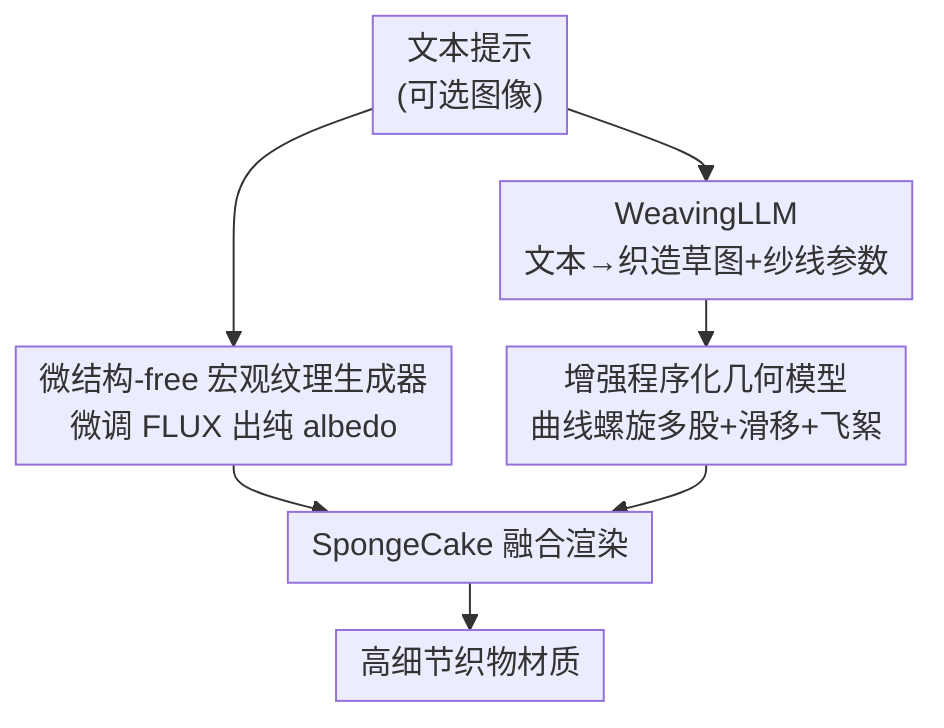

# FabricGen: Microstructure-Aware Woven Fabric Generation

**会议**: CVPR 2026  
**论文**: [CVF Open Access](https://openaccess.thecvf.com/content/CVPR2026/html/Tang_FabricGen_Microstructure-Aware_Woven_Fabric_Generation_CVPR_2026_paper.html)  
**代码**: 未开源  
**领域**: 扩散模型 / 材质生成  
**关键词**: 织物材质生成, 微结构, 程序化几何, WeavingLLM, 文本到材质  

## 一句话总结
FabricGen 把织物材质的生成拆成「宏观纹理」和「微观织造结构」两路——前者用微结构-free 数据微调的扩散模型生成无微结构的 albedo 图，后者用一个 LLM（WeavingLLM）从文本直接设计织造草图与纱线参数、再驱动增强版程序化几何模型合成纱线级微结构，最终融合渲染出比以往方法细节远更丰富、且符合织造规则的逼真织物。

## 研究背景与动机
**领域现状**：织物材质（窗帘、衣物、室内布料）在渲染中无处不在，但传统制作要分多步——先在 Substance Designer 之类工具里造织造图案，再做纹理、调着色参数，即便熟练美术师也耗时。近期大家用扩散模型（DressCode、FabricDiffusion、MatFuse、ControlMat 等）把这条流程压成"文本/图像 → PBR 贴图"，门槛大降。

**现有痛点**：预训练扩散模型是在自然图像上训的，分辨率和结构约束都不够，生成的织物经常出现**人为条纹、物理上不可能的图案，或干脆丢掉微结构**——远看还行，一旦贴到布料上做近景渲染，纱线级细节糊成一团、出现假阴影。根因有两点：扩散模型本身画不出纱线级微结构；而且很难对生成过程施加"必须遵守织造规则"这类硬约束。

**核心矛盾**：织物的真实感同时来自两个尺度——**宏观的颜色/图案纹理**和**微观的纱线交织几何**。把这两者塞进同一个扩散模型里一起学，分辨率天花板会让微结构必然被牺牲；而程序化几何模型虽能精确刻画微结构，却需要专家手工设计织造草图和参数，普通用户用不了。

**本文目标**：让没有任何纺织知识的普通用户，只凭一句文本（可选配一张图）就端到端生成既符合织造原理、又有纱线级细节的高质量织物材质。

**切入角度**：作者的关键观察是——宏观纹理和微观织造图案本就是两类信息，应该**解耦**。宏观纹理交给扩散模型（它擅长画颜色和图案），但要逼它只画"干净的、不含微结构的" albedo；微观结构交给程序化模型（它能在任意分辨率下精确表达纱线几何），但用一个领域 LLM 替代"专家"去设计草图和参数。

**核心 idea**：用「微结构-free 扩散模型画宏观纹理 + LLM 驱动的程序化模型造微观结构」两路解耦，再融合渲染，绕开"单模型既要画图案又要画微结构"的分辨率死结。

## 方法详解

### 整体框架
FabricGen 接收一句文本提示（可选再加一张织物图像），输出可直接用于物理渲染的织物材质，整条流水线分成两条互不干扰、最后在渲染处汇合的支路：

- **宏观支路（macro-scale）**：一个在"微结构-free 织物纹理"数据集上微调过的扩散模型，从文本（和可选图像）生成**纯 albedo / 颜色贴图**，只管颜色和图案、刻意不含任何纱线起伏。
- **微观支路（micro-scale）**：WeavingLLM 先从文本生成一张二进制**织造草图（weaving draft）**和一组纱线参数（层数、粗糙度、飞絮强度等），再把它们喂给一个增强版**程序化几何模型**，按需生成纱线级的法线、朝向、高度场等几何数据。

两路产物（宏观 albedo + 微观几何）最后送进 SpongeCake 分层着色模型做融合渲染。因为微观结构是"按需查询"（on-demand query）而非预先烘焙成固定分辨率贴图，所以近景可以无限放大而不糊。两支路用的提示词是分开的——宏观支路喂颜色/风格描述，微观支路喂织法描述。

### 关键设计

**1. 微结构-free 宏观纹理生成器：逼扩散模型只画颜色、不画纱线**

以往方法（DressCode、FabricDiffusion）让扩散模型一次性吐出"纹理 + 微结构"，结果受分辨率所限要么违反织造规则、要么干脆丢细节。本文反其道而行：**把扩散模型约束成只生成不含微结构的纯 albedo 图**，把微结构这件难事整个外包给微观支路。具体做法是收集 600 张"微结构-free 织物纹理 + 描述"的数据集，用 LyCORIS 微调 FLUX.1-dev，把一个通用图像生成器改造成"织物专用 albedo 生成器"；同时引入 noise rolling 机制保证贴图可无缝平铺（tileable）。它还支持多模态条件——输入一张织物照片（平铺或带褶皱的都行），经 VAE 编码成 latent 后作为扩散初始化条件，引导生成时**抑制几何褶皱、但保留原图案风格**。消融里可以看到，原始 FLUX 即便被明确指示"no microstructure, no folds, no wrinkles"，仍会偶尔画出 3D 物体或隐式条纹，导致烘焙阴影和视觉混乱；微调后才能稳定产出干净的 albedo。

**2. WeavingLLM：把"设计织造草图"这件需要专家的事交给 LLM**

有了程序化模型，仍有个空缺：怎么自动设计织造图案和几何参数？传统上这要熟练美术师来定。本文训了 **WeavingLLM**——从 Qwen2.5-14B-it 用 QLoRA 微调而来，训练数据是从 Handweaving.net 收集的 1,142 张标注织造草图（全部限制在 16×16 以内，因此理论上一台 16 综框/踏板的织机就能物理织出模型的任意输出）。它的工作分两步：给定文本提示，先用 LoRA adapter 生成一张二进制矩阵作为**织造草图**；然后**关闭 LoRA adapter**，让基座 LLM 按"织物专业知识"预测纱线参数（粗糙度、股数等）。除了 SFT，还做了 **prompt tuning**——把领域织物先验注入提示，让 LLM 学到"不同织法各有什么特征参数"。消融显示这步很关键：没有 prompt-tuning 的基座 LLM 预测的参数会违背日常经验（比如复现不出斜纹的粗糙感、缎纹的各向异性光泽），有了先验才能给出合理参数。因为只在一个 repeat unit 内生成织造图案，模型天然遵守基本织造原理、且细节丰富。

**3. 增强程序化几何模型：曲线螺旋多股 + 全局不规则效应**

已有 surface-based 程序化模型（Jin 等）只支持单股纱、且忽略全局不规则性，造出来的织物太"规整"不真实。本文的程序化模型 $F=\{n(p), t(p), h(p)\}$（$p=(x,y)\in[0,1]^2$，分别是法线、切向/朝向、相对高度场）在两方面增强：

其一是**曲线螺旋（curved helix）多股纱模型**。以往把纱线建模成弯曲圆柱，只能表示单股；本文把每股（ply）建模成绕纱线中心线的螺旋，支持多股配置，且通过把 UV 坐标 $x,y$ 线性映射到纱线空间弧坐标 $u,v$，**解析地**给出几何量而无需显式存储曲线：

$$n(u,v)=\big(\sin u\cos v,\; \sin v,\; \cos u\cos v\big),\qquad h(u,v)=r\cos(\varphi(u))+\cos u\,(R+r_{ply}\cos v)$$

其中 $R$ 是纱线弧半径、$r_{ply}$ 是股半径、$\varphi(u)=\varphi(0)+uR\alpha$ 是股沿轴的旋转相位、$\alpha$ 是螺旋旋转速度；纤维朝向 $t$ 由股朝向 $o_{ply}$ 绕法线按捻角 $\psi$ 旋转得到。这些函数定义了纱线级微结构在 UV 域上的参数化，可按需直接导出法线/高度/朝向贴图。

其二是**全局不规则效应**，补上以往方法忽略的两种真实现象：

- **纱线滑移（yarn sliding）**：真实织物的纱线排布并非严格规则。用连续程序噪声扰动纱线位置——沿轴向（x）取 1D Perlin 噪声 $P(x)$，再对径向（y）施加扰动：$y_s = 0.5+(y-0.5)(1-k_{sliding}|P(x)|)$，$y_r = y_s\,e^{k_{sliding}P(x)}$，$k_{sliding}$ 控制滑移强度。这个双射映射 $f:y\to y_r$ 可通过逆查询从不规则空间取回规则坐标，效果是露出本被遮挡的下层纱线、产生纱线间的条状缝隙。
- **飞絮纤维（flyaway fibers）**：指逸出织物表面的纤维。在 SpongeCake 模型里加一个额外纤维层，3D 纤维朝向场 $o_{flyaway}(p)$ 由两张 2D Perlin 噪声 $N_1, N_2$ 构造——$N_1$ 控制纤维位置和水平朝向、$N_2$ 控制竖直朝向，从而得到连续、类纤维的随机分布，表现为不规则高光。

## 实验关键数据

实验全部在单张 RTX 4090 上完成训练/推理/渲染。对比对象是两个代表性文本到材质方法：DressCode（专做织物）和 MatFuse（通用材质）；FabricDiffusion 因未完全开源未纳入对比。

### 主实验

| 条件 | 指标 | MatFuse | DressCode | 本文 |
|------|------|---------|-----------|------|
| 文本条件 | CLIP Score ↑ | 0.240 | 0.307 | **0.317** |
| 文本条件 | 用户研究偏好 ↑ | 1.43% | 16.02% | **82.55%** |
| 文本+图像 | CLIP-I Score ↑ | 0.722 | N/A | **0.827** |

CLIP Score 是在 100 个多样文本提示生成的材质上、prompt 与平面渲染之间的平均值；用户研究 12 个 case、64 名参与者选"最符合提示且最真实"的结果。本文在语义对齐、感知质量、视觉真实感上全面领先，尤其用户研究 82.55% 的压倒性偏好说明近景细节的差距非常直观。

### 消融：WeavingLLM 必要性

把 WeavingLLM 与基座 Qwen2.5-14B、GPT-5 对比（COSSIM = 生成草图与参考草图傅里叶谱的余弦相似度，PREF = 60 名参与者的用户偏好率，LPIPS = 渲染图感知差异，渲染统一用纯灰 albedo）：

| 案例 | 模型 | COSSIM ↑ | PREF ↑ | LPIPS ↓ |
|------|------|----------|--------|---------|
| herringbone twill | Qwen2.5-14B | 0.583 | 16.9% | 0.183 |
| herringbone twill | GPT-5 | 0.582 | 11.9% | 0.245 |
| herringbone twill | **本文** | **0.701** | **71.2%** | **0.125** |
| spot bronson, lace | Qwen2.5-14B | 0.35 | 1.7% | 0.385 |
| spot bronson, lace | GPT-5 | 0.726 | 18.6% | 0.19 |
| spot bronson, lace | **本文** | **0.912** | **79.7%** | **0.152** |

即便是 GPT-5 这种强通用 LLM，在"设计织造草图"上也明显不如经过织造数据 SFT 的 WeavingLLM——说明这是个需要领域先验、而非靠通用能力就能解决的专门任务。

### 关键发现
- **解耦是性能主因**：把微结构从扩散模型里剥离、外包给程序化模型，是近景细节质量碾压 baseline 的根本——baseline 远看尚可、近看必糊，正是因为微结构被分辨率天花板压死。
- **prompt-tuning 决定参数合理性**：去掉 prompt-tuning，LLM 预测的纱线参数会违背日常经验（复现不出斜纹粗糙感、缎纹各向异性光泽），说明草图（结构）和参数（外观）两件事都需要领域先验。
- **不规则效应让织物"活"过来**：滑移制造纱线间缝隙、飞絮制造不规则高光，加上后渲染与真实拍摄照片的 LPIPS 明显下降（⚠️ 图 11 中各子项 LPIPS 数值与标签的精确对应在原文图注里较难逐一锁定，以原文为准），定性上去掉不规则后织物会显得过于"规整假"。

## 亮点与洞察
- **"解耦尺度"的思路很通用**：当一个生成任务里"低频内容"和"高频结构"对模型有矛盾需求（这里是颜色 vs 纱线几何），与其指望单模型两头兼顾，不如各用最擅长的工具分头做、最后融合。这个分而治之的范式可迁到其他多尺度材质（皮革、编织、木纹）生成。
- **用 LLM 当"领域设计师"而非"文本生成器"**：WeavingLLM 输出的不是自然语言，而是结构化的二进制草图 + 参数表，本质是让 LLM 替代需要专家的"设计"环节。这种"LLM → 结构化控制信号 → 程序化引擎"的接法，比让 LLM 直接画图更可控、且天然满足硬约束（16×16 草图必然可织）。
- **on-demand 查询替代烘焙贴图**：程序化几何不预生成固定分辨率贴图、而是渲染时按需解析求值，使近景可任意放大不糊——这是它相对扩散贴图的结构性优势。
- **LoRA 开关的两段式推理**：草图阶段开 LoRA、参数阶段关 LoRA 用基座，是个轻巧的工程 trick，让同一个模型分别承担"学到的织造结构"和"通用常识参数"两种角色。

## 局限与展望
- **未开源**：代码与训练细节（不少在补充材料里），复现门槛较高。
- **草图受限 16×16**：为了可织性把织造草图限制在 16×16 repeat unit，超大或非周期的复杂图案可能表达不了。
- **依赖收集的小数据集**：宏观支路仅 600 张微结构-free 纹理、WeavingLLM 仅 1,142 张草图，覆盖的织法/风格广度受数据集限制；罕见织法可能泛化不佳。
- **不规则效应的消融数值含糊**⚠️：图 11 的 LPIPS 标注与子项对应关系在 OCR 文本里不够清晰，定量结论需谨慎，建议以原文图为准。
- **评估偏主观**：主指标是 CLIP/CLIP-I + 用户研究，缺乏与真实织物的物理量级（如 BTF/反射率）客观对齐。

## 相关工作与启发
- **vs DressCode / FabricDiffusion**：它们都用微调扩散模型一次性出 PBR 贴图（diffuse/normal/roughness），把纹理和微结构耦在一起，受分辨率限制近景模糊、有结构伪影。本文把两尺度解耦、微结构交给程序化模型，近景细节质量明显更高。
- **vs MatFuse / ControlMat（通用材质）**：它们面向一般 SVBRDF，无法施加"织造规则"这类领域结构约束，也画不出纱线级微结构。本文通过 WeavingLLM + 程序化模型显式注入织造先验。
- **vs Jin 等 surface-based 程序化模型**：它们假设单股纱、忽略全局不规则（滑移、飞絮）。本文用曲线螺旋支持多股、并补上两类不规则效应，且保持 surface-based 的高效与可解析导出贴图的优点。

## 评分
- 新颖性: ⭐⭐⭐⭐⭐ 首个"文本→程序化微结构"织物生成，宏微解耦 + LLM 当织造设计师的组合很新
- 实验充分度: ⭐⭐⭐⭐ 主对比 + 多组消融到位，但偏主观评估、不规则消融数值含糊、未开源
- 写作质量: ⭐⭐⭐⭐ 动机清晰、方法分层讲透，公式与图配合好
- 价值: ⭐⭐⭐⭐ 给非专家用户造高保真织物的实用工具，解耦范式可迁移到其他多尺度材质

<!-- RELATED:START -->

## 相关论文

- [\[CVPR 2026\] Property-Informed Diffusion-Based Text-to-Microstructure Generation](property-informed_diffusion-based_text-to-microstructure_generation.md)
- [\[CVPR 2026\] Decision Boundary-aware Generation for Long-tailed Learning](decision_boundary-aware_generation_for_long-tailed_learning.md)
- [\[CVPR 2026\] Frequency-Aware Flow Matching for High-Quality Image Generation](freqflow_frequency_aware_flow_matching.md)
- [\[CVPR 2026\] VA-π: Variational Policy Alignment for Pixel-Aware Autoregressive Generation](va-p_variational_policy_alignment_for_pixel-aware_autoregressive_generation.md)
- [\[CVPR 2026\] DiverseGRPO: Mitigating Mode Collapse in Image Generation via Diversity-Aware GRPO](diversegrpo_mitigating_mode_collapse_in_image_generation_via_diversity-aware_grp.md)

<!-- RELATED:END -->
