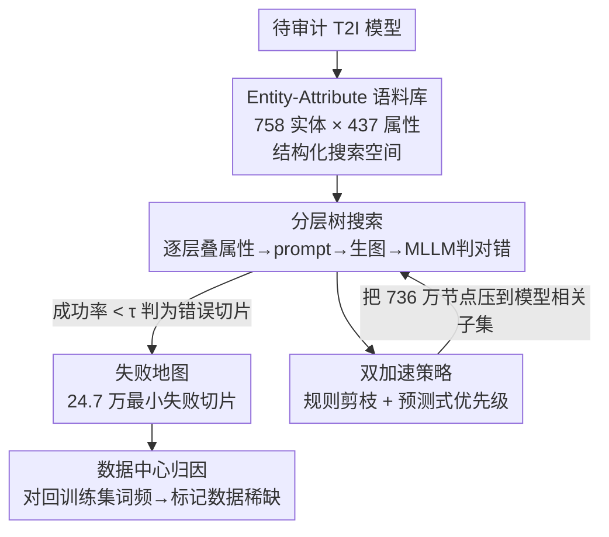

# FailureAtlas: Mapping the Failure Landscape of T2I Models via Active Exploration

**会议**: CVPR 2026  
**论文**: [CVF Open Access](https://openaccess.thecvf.com/content/CVPR2026/html/Chen_FailureAtlas_Mapping_the_Failure_Landscape_of_T2I_Models_via_Active_CVPR_2026_paper.html)  
**代码**: https://github.com/curelab/FailureAtlas  
**领域**: 文生图评测 / 扩散模型  
**关键词**: 文生图评测、错误切片发现、主动探索、树搜索、数据稀缺归因

## 一句话总结
不再用固定 prompt 集被动给 T2I 模型打分，而是把"找错"形式化为在 entity×attribute 组合空间上的结构化树搜索，靠规则剪枝 + 学习型优先级两招把天文数字级搜索压到可行，自动挖出 SD1.5 上 24.7 万个此前未知的"最小失败切片"，并首次大规模佐证这些失败与训练数据稀缺相关。

## 研究背景与动机
**领域现状**：文生图（T2I）模型的评测长期由静态 benchmark 主导——GenEval、T2I-CompBench、HRS-Bench、WISE 等准备一批固定 prompt，配合 CLIPScore、TIFA、VQAScore 等自动指标，给不同模型算一个聚合分数做横向比较。

**现有痛点**：这套从判别式 AI 继承来的范式诊断深度很浅。它只能告诉你"模型在这个 prompt 上失败了"，却说不清"为什么失败"。原因是 benchmark 的失败样例往往同时绑定多个属性（如"穿红衣服的小狗在跳"），多个致错因素纠缠在一起，无法隔离出到底是哪个最小属性触发了失败。而且固定 prompt 集本质上是"穷举测试"，既不安排测试顺序、也不避免冗余评测，覆盖严重不均衡。

**核心矛盾**：要想精准定位失败的根因，就得在 T2I 巨大的输入空间里**主动、系统地**探测，去找触发失败的**最小概念组合**；但这条路被两堵墙挡住——① 输入空间是 entity×attribute 的组合爆炸（本文受限到 3 层就有约 736 万节点）；② 每次评测都要真的生成图像，单次代价极高（SD1.5 全量探索产生约 1100 万次生成）。

**本文目标**：把"主动探索"从理念变成一个可大规模跑的框架，自动绘出 T2I 模型的"失败地图"（failure landscape），并定位每个失败背后的最小致错概念，进而追溯到训练数据。

**切入角度**：生成模型的输入比判别模型简单得多，可以用 prompt 灵活精细地构造——这恰好让我们能主动设计探测、控制探索的粒度/顺序/范围，而不是被动依赖固定数据集。作者把"错误切片发现"重新框定成一次**有结构的搜索**：从单 entity 出发，逐层叠加属性，谁先失败谁就是更基础的错误。

**核心 idea**：用"主动探索"替代"静态打分"——把找错变成 entity–attribute 组合的分层树搜索，并用规则剪枝 + 预测式优先级把组合爆炸的搜索压到可行，从而自动发现海量"最小、根本"的失败切片。

## 方法详解

### 整体框架
FailureAtlas 的输入是一个待审计的 T2I 模型（如 SD1.5），输出是一张"失败地图"——成千上万个标注了成功率的最小 entity–attribute 失败切片，外加（若训练数据可得）这些失败与数据稀缺的相关性分析。整条管线分四块：先用一个**高覆盖 entity–attribute 语料库**把无穷的输入空间结构化成一棵可枚举的树；再用**分层树搜索**逐节点把组合转成 prompt、生成图像、用 MLLM 判对错，低于阈值即判为错误切片；中间靠**两套加速策略**（规则剪枝 + 预测式优先级）把搜索量从 736 万压到模型相关的一个小子集；最后用**数据中心归因**把错误切片对回训练集词频，找出由数据稀缺导致的失败。

### 关键设计

**1. 高覆盖 Entity–Attribute 语料库：把无穷输入空间结构化成可枚举的树**

主动探索的第一道墙是输入空间无穷大。作者的解法是先造一个结构化语料库，用 entity（实体）× attribute（属性）的组合来张成搜索空间。语料库分三步建：① 用 LLM 从通用世界知识里初始化基础词表，保证类别/场景/视觉属性的广覆盖；② 从 COCO Captions 和 T2I-CompBench 两个数据集大规模挖词，对齐到基础词表，高频但未匹配的词作为新条目补入，再迭代去重、建立层级类目（如 biology→animal→dog）；③ 用 LLM 标注每个 entity–attribute 配对的语义合法性，避免生成"透明的石头"这类荒谬 prompt。最终语料库含 **758 个 entity（5 大类 25 子类）和 437 个 attribute（2 大类 29 子类）**，且刻意只保留通用词、避开专有名词和细粒度概念（用 tower 而非 Eiffel Tower），在规模和语义覆盖之间取平衡。实测它能覆盖 HRS-Bench、TIFA 等四个 benchmark 约 90% 的实体与属性，说明这个有限词表已足够代表 T2I 的常见场景。

**2. 分层组合树搜索：把"找错"形式化为找最小致错概念**

有了语料库，作者把错误切片发现形式化为 entity–attribute 空间上的一次**分层组合搜索**，组织成树：根层只含 entity，第二层加一个属性，越深层叠加越多属性；搜索按**广度优先**跨多棵 entity 树进行，先探完同一深度的所有节点再下沉，这样能优先发现**因素最少**的失败。为约束空间，每条路径上同一类目最多取一个属性（选了 size 的 big 就不能再加 small）。每个节点的处理是：把 entity 与属性套进预定义模板、用 LLM 只做轻微语法修正得到 prompt，再用目标 T2I 模型为该节点生成 25 张图。评判用**多选一致性检查**——对每个属性/实体，从同类目里取若干语义近邻作为候选答案喂给 MLLM（Qwen2-VL-72B），让它选最贴近图像的描述。节点的生成成功率 = MLLM 预测与意图属性/实体一致的比例；当成功率低于阈值 $\tau$（取 0.8）时，该节点被判为**错误切片**。分层 + BFS 的设计让发现的错误天然对应"最小概念"：越浅层的失败越根本。

**3. 规则剪枝 + 预测式优先级：把组合爆炸压到可跑**

736 万节点全跑不现实，作者上两招加速，且这两招还顺带让搜索"因模型而异"。**规则剪枝（rule-based pruning）**：基于"属性越多越难生成"这一单调性假设——一旦父节点失败（如"dog"就失败），其所有叠加更多属性的子孙节点（如"jumping dog"）全部跳过。这不只是省算力：搜索轨迹被模型自身的失败决定，不同模型会探索同一结构空间的不同区域，且保证发现的错误是"最小致错概念"。作者也诚实指出反例（"a strawberry"对"a red strawberry"，加属性反而消歧更易生成），但论证父节点失败本身已暴露模型搞不定的最小概念，故反例影响可忽略（附录验证）。**预测式优先级（prediction-based prioritization）**：同层节点彼此独立、探索顺序可调；作者观察到强烈的实体内属性相关性（模型在某 entity 的某个大动作上失败，往往在该 entity 的其他大动作上也失败），说明一个节点的成功率可由相关节点推断。于是训练一个轻量 predictor——以 entity 和属性的文本嵌入（T5 编码）为输入、输出每个节点的预估成功率，实现为 transformer decoder（低层深度用零填充嵌入、对 entity 与 attribute 嵌入做多个 cross-attention 块），并在探索中**在线更新**（每 1 万节点重训一次），持续把探测导向高失败概率区域。实测 predictor 带来约 **2× 的失败发现加速**。

**4. 数据中心归因：把失败切片对回训练集词频**

光找到错误还不够，作者进一步追问"为什么错"，并聚焦**数据稀缺**这一因素。做法：从模型训练集（SD1.5 对应 LAION-2B-en，随机采样 100 万样本估分布）抽取 entity/attribute 并对齐到语料库词表；按搜索树的层级结构，算出每层切片的平均数据分布（用"包含该切片的训练样本占比"度量）；对每个已发现的错误切片，若其出现频率低于"$\alpha$ 倍的层级平均值"这一阈值，就归因于数据稀缺。作者强调这只是相关性信号、不等于"加数据就能修好"，但能为有针对性的数据筛选与模型改进提供指引。分析也发现少数高频实体（α>0.8 时的 badminton、sensor）仍失败，这些可能源于数据质量、生成本身难度或架构限制，留待未来。

### 一个完整示例
以 entity "Sculpture" 为例走一遍树搜索（对应论文 Figure 1）：根节点"Sculpture"成功率 100%（通过）→ 第二层叠属性"Color: Gray"得"灰色雕塑"成功率 90%（通过）、叠"Background: Orange"得"橙色背景的雕塑"成功率 70%（通过）→ 第三层把两者叠成"灰色雕塑 + 橙色背景"，成功率骤降到 20%，判为错误切片。由于前两层都未失败，这个切片揭示的是"颜色 + 背景组合绑定"这一最小致错概念，而非单属性问题。若是更弱的模型在第二层"Color: Gray"就失败，规则剪枝会直接砍掉它所有第三层子孙，搜索因而提前收敛、探索的节点更少——这也正是表 2 里 SD1.5 探索节点（43.9 万）远少于 SDXL Turbo（104 万）的原因：弱模型失败得更早、被剪得更狠。

## 实验关键数据

### 主实验
在 SD1.5 与 SDXL Turbo 上系统评测（最大搜索深度 3 层、每节点 25 张图、$\tau$=0.8、MLLM 用 Qwen2-VL-72B），按层报告发现的错误切片数与错误密度（注：总数仅供完整性参考，不应跨模型直接比大小）：

| 层级 | SD1.5 错误切片 | SD1.5 探索节点 | SD1.5 错误密度 | SDXL Turbo 错误切片 | SDXL Turbo 错误密度 |
|------|----------------|----------------|----------------|---------------------|---------------------|
| Layer 1（纯实体） | 162 | 758 | 21.3% | 91 | 12.0% |
| Layer 2（+1 属性） | 113,418 | 134,816 | 84.1% | 108,111 | 72.0% |
| Layer 3（+2 属性） | 133,850 | 303,893 | 44.0% | 331,740 | 37.3% |
| **合计** | **247,430** | **439,467** | **56.3%** | **439,942** | **42.3%** |

语料库覆盖度上，对四个 benchmark 的实体/属性映射率均约 90%：

| Benchmark | 实体覆盖 | 属性覆盖 |
|-----------|---------|---------|
| COCO Captions | 88.2% | 93.7% |
| T2I-CompBench | 88.5% | 96.0% |
| HRS-Bench | 89.6% | 90.6% |
| TIFA | 92.0% | 90.8% |

### 消融实验
两套加速策略的量化收益（对应 Figure 5）：

| 配置 | 关键指标 | 说明 |
|------|---------|------|
| 规则剪枝（SD1.5） | 第 3 层搜索空间降到 4.2% | 弱模型剪得更狠，外推第 4 层进一步降到 0.4% |
| 预测式优先级 | 失败发现约 2× 加速 | predictor 在未见节点上 L1 loss 很低，错误分布可学 |
| 优先级搜索效率（SD1.5 第 3 层） | 探 ~1.25 万节点得 1 万错误切片 / 探 ~6.5 万节点得 5 万 | 目标导向场景下大幅省算力 |

### 关键发现
- **规则剪枝是省算力主力**：把第 3 层搜索压到 4.2%、外推第 4 层到 0.4%，且对越弱的模型、属性越多时剪得越狠——因为弱模型在浅层就失败、子孙全被砍。
- **错误密度随层级先升后降**：Layer 2 错误密度最高（SD1.5 达 84.1%），因为叠第一个属性就能逼出大量失败；Layer 3 因前层失败节点已被剪掉、剩下的是"前两层都通过"的难组合，密度反而回落。
- **失败确与数据稀缺相关**：SD1.5 上表现差的 entity/attribute 平均对应更少的 LAION-2B 训练样本，首次给出大规模相关性证据；但 badminton、sensor 等高频词仍失败，说明数据稀缺非唯一因素。
- **泛化到新架构**：SD3.5 Large Turbo、Flux.1-dev 也被挖出失败（如金鱼正视图渲成侧视、灰色相机频繁失败、弯曲的钥匙画不出），说明框架不绑定具体模型。
- **评测偏差可控**：25 次重复生成后成功率趋稳（再增样本平均变化 <0.6%）；MLLM 与人类对齐率实体 96%、属性 84%。

## 亮点与洞察
- **范式转换最值钱**：从"静态打分"转到"主动探索"，把"模型在哪失败"升级成"触发失败的最小概念是什么"——这是诊断深度的质变，benchmark 给不了。
- **剪枝兼具效率与语义**：规则剪枝既砍掉冗余搜索，又让"搜索轨迹由模型自身失败决定"，自然产出"最小致错概念"，一举两得；这种"把约束设计成同时服务效率和语义"的思路可迁移到其他组合搜索问题。
- **在线 predictor 把先验做成自适应**：利用实体内属性相关性训练轻量预测器并在线更新，在固定预算下多挖一倍失败——这套"边搜边学错误分布"的机制对任何昂贵评测的主动采样都通用。
- **语料库当桥梁连失败与数据**：用同一套 entity–attribute 词表既张成搜索空间、又对齐训练集，使"失败→数据稀缺"的归因成为可能，是把评测和数据分析打通的巧妙设计。

## 局限性 / 可改进方向
- **作者承认**：当前只探索"单实体 + 多属性"，未覆盖多实体组合或更复杂场景（如人物——现实高频却未深挖）；算力代价巨大（SD1.5 全量约 1100 万次生成 + 等量 MLLM 查询），全量枚举主要为演示有效性，实际可用优先级只搜目标数量的切片。
- **归因偏弱**：数据稀缺只是相关性信号，不能证明因果，也未拆开数据质量/训练流程/架构等其他致错因素。
- **依赖 MLLM 评判**：属性对齐率仅 84%，评测本身的偏差会传导到切片判定；⚠️ 单调性剪枝假设有反例（加属性消歧反而更易），论文论证其影响可忽略但未给量化上界，跨模型 caveat 需谨慎。
- **可改进**：把搜索扩到多实体关系/空间组合；用更便宜的代理模型预筛节点以进一步降生成成本；把归因从相关性推进到可干预的因果验证（如定向补数据后复测）。

## 相关工作与启发
- **vs 静态 benchmark（GenEval / T2I-CompBench / HRS-Bench / WISE）**：它们用固定 prompt 集被动打分、做横向比较，失败样例多属性纠缠、难隔离根因；本文主动探索、定位最小致错概念，诊断深度更高，但代价是大规模生成的算力。
- **vs 判别模型的错误切片发现（embedding 聚类 / tag-then-slice）**：那些方法是对固定评测集做事后总结，受测试覆盖不均衡所限；本文利用生成模型输入可灵活构造的特性，主动设计探测、控制粒度/顺序/覆盖，从根上解决覆盖均衡问题。
- **vs MULTIMON**（生成模型错误发现的先行工作）：仍是 benchmark 驱动、规模有限；本文是首个面向 T2I 错误切片发现的主动探索框架，规模上挖出数十万切片并接入数据归因。

## 评分
- 新颖性: ⭐⭐⭐⭐⭐ 首个 T2I 主动探索框架，把找错重构成结构化树搜索 + 数据归因，范式层面的创新
- 实验充分度: ⭐⭐⭐⭐ 覆盖 SD1.5/SDXL Turbo/SD3.5/Flux 四模型、加速策略与归因都有量化，但归因止于相关性
- 写作质量: ⭐⭐⭐⭐⭐ 动机—方法—实验逻辑清晰，对单调性假设的反例诚实讨论，图表到位
- 价值: ⭐⭐⭐⭐⭐ 给 T2I 模型审计提供可大规模运行的诊断引擎，并指向数据驱动的改进路径

<!-- RELATED:START -->

## 相关论文

- [\[CVPR 2026\] Bias at the End of the Score: Demographic Biases in Reward Models for T2I](bias_reward_models_t2i.md)
- [\[ICML 2026\] MIRO: 多奖励条件预训练同时提升 T2I 质量与效率](../../ICML2026/image_generation/miro_multi-reward_conditioned_pretraining_improves_t2i_quality_and_efficiency.md)
- [\[CVPR 2026\] Breaking Semantic Boundaries: Distribution-Guided Semantic Exploration for Creative Generation](breaking_semantic_boundaries_distribution-guided_semantic_exploration_for_creati.md)
- [\[AAAI 2026\] Exposing DeepFakes via Hyperspectral Domain Mapping](../../AAAI2026/image_generation/exposing_deepfakes_via_hyperspectral_domain_mapping.md)
- [\[CVPR 2026\] Editing Away the Evidence: Diffusion-Based Image Manipulation and the Failure Modes of Robust Watermarking](editing_away_the_evidence_diffusion-based_image_manipulation_and_the_failure_mod.md)

<!-- RELATED:END -->
