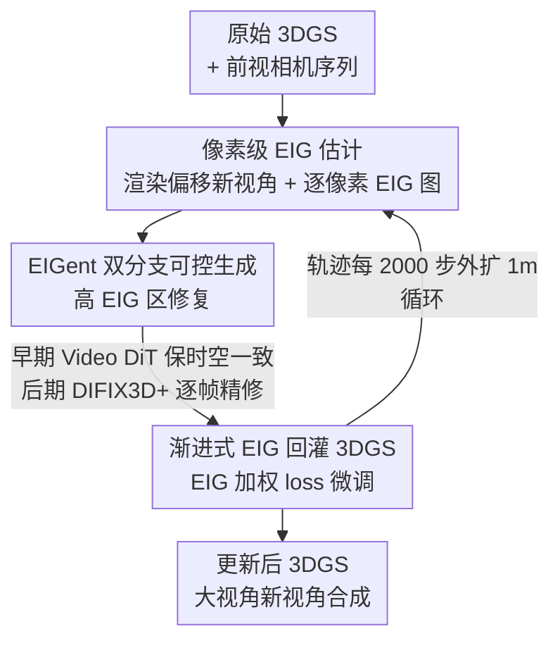

# FaithFusion: Harmonizing Reconstruction and Generation via Pixel-wise Information Gain

**会议**: CVPR 2026  
**论文**: [CVF Open Access](https://openaccess.thecvf.com/content/CVPR2026/html/Wang_FaithFusion_Harmonizing_Reconstruction_and_Generation_via_Pixel-wise_Information_Gain_CVPR_2026_paper.html)  
**代码**: 待发布（原文称 "code will be released soon"）  
**领域**: 图像生成 / 扩散模型 / 3D视觉 / 自动驾驶  
**关键词**: 3DGS-扩散融合, 期望信息增益(EIG), 驾驶场景重建, 大视角变换, 像素级编辑策略  

## 一句话总结
FaithFusion 把"该不该改、改多少"这个像素编辑决策重新表述成像素级**期望信息增益（EIG）**，用同一个 EIG 信号既引导扩散只在高不确定区域生成、又作为像素级 loss 权重把生成内容回灌进 3DGS，从而在变道等大视角偏移下同时拿到几何保真和外观可控，在 Waymo 上 NTA-IoU / NTL-IoU / FID 三项 SOTA（6 米变道仍保持 FID 107.47）。

## 研究背景与动机

**领域现状**：构建可闭环仿真的可控驾驶世界，需要同时做到重建的几何保真和外观生成的可控。3DGS / NeRF 把新视角合成做到了高质量，扩散模型则擅长图像/视频生成与修复，于是主流路线是把两者融合——以"渲染 → 修复 → 反馈"的在线渐进环把 3DGS 渲出来的退化新视角交给扩散修，再回灌 3DGS。

**现有痛点**：3DGS 在稀疏观测、遮挡严重、或离训练轨迹很远的视角下会出现几何不一致和伪影；而扩散模型在缺少像素级、几何一致引导时会"过度修复（over-restoration）"并引入几何漂移——它一旦启动，常把本来已经正确的区域也重画一遍。融合类方法（DIFIX3D+、ReconDreamer++ 等）要么依赖额外先验条件（LiDAR、3D 框、HDMap），要么得对 3DGS 架构做结构性改造。

**核心矛盾**：现有融合方法判断"在哪改、何时改、改多少"用的都是**视角级（view-level）的粗粒度启发式**，缺一个能精确到像素、决定"哪些区域该生成、哪些该保留"的原则性机制。粗粒度引导直接导致对生成的控制不足，于是过度修复和几何漂移反复出现。

**切入角度**：作者把"要不要编辑某个像素、编辑多强"重新表述成一个**前瞻性的信息论度量**——这次编辑能让后验不确定性下降多少。沿用 FisherRF 把 Fisher 信息当不确定性代理的思路，但把它从视角级**下推到像素级**，并与可微 3DGS 渲染器紧耦合。

**核心 idea**：用一个像素级 EIG 当"统一空间策略"——同一个 EIG 信号，在生成侧当空间权重让扩散只在高信息（高不确定）区域生成、抑制过度修复；在重建侧当像素级 loss 权重把高价值编辑蒸馏回 3DGS。整套系统即插即用，不需额外先验、不改 3DGS 架构。

## 方法详解

### 整体框架
FaithFusion 是一个由像素级 EIG 驱动的 3DGS–扩散融合框架，核心是一个三步**渐进式训练环**：先从原始 3DGS 渲染出横向偏移的新视角及其逐像素 EIG 图（Step 1），把渲染图和 EIG 图喂给双分支生成器 EIGent 去修复高 EIG 区域（Step 2，早期用 Video DiT 保时空一致、后期用 DIFIX3D+ 做逐帧细节精修），再用修复后的视角配合 EIG 图当像素权重去微调 3DGS（Step 3）。轨迹每 2000 步外扩 1 米，三步循环往复，把生成内容有序回灌进几何表示。

整套流程的关键是：**同一张 EIG 图在三步里贯穿始终**——Step 1 产出它、Step 2 用它当生成的空间先验、Step 3 用它当重建的 loss 权重，这正是"统一空间策略"的含义。

### 关键设计

**1. 像素级期望信息增益（EIG）：把"该不该编辑"变成可计算的信息论度量**

针对"现有方法只能用视角级启发式决定在哪改"的痛点，本文把编辑决策量化为：观测一个新视角能让 3DGS 参数后验的不确定性下降多少。3DGS 用一组各向异性高斯（位置 $\mu_w$、旋转 $q_w$、尺度 $s$、球谐系数 $c$、不透明度 $o$，合记为 $\omega$）通过 α-blending 渲染。先求最小化重建误差的点估计 $\omega^* = \arg\min_\omega \sum \|Y_i^{train} - F(X_i^{train}, \omega)\|_2^2$，再用 **Laplace 近似**把后验建模为高斯 $\Omega \approx \mathcal{N}(\omega^*, H''[\omega^*]^{-1})$，其中 $H''$ 是负对数似然的 Hessian，其期望即 Fisher 信息，刻画观测对参数的约束强度。

对新视角 $X^{NVS}$，EIG 定义为先验熵与观测后期望后验熵之差：

$$\text{EIG} = H[\Omega] - \mathbb{E}_{p(Y_i|X_i)}\big[H[\Omega \mid Y_i^{NVS}, X_i^{NVS}]\big]$$

借助 Laplace 近似与 Fisher 信息的可加性，并用不等式 $\log\det(A+I_d)\le \mathrm{tr}(A)$ 得到可计算的 trace 形上界 $\text{EIG} \le \tfrac{1}{2}\sum_i \mathrm{tr}\big(H''[Y_i^{NVS}|X_i^{NVS},\omega^*]\,H''[\omega^*]^{-1}\big)$。FisherRF 只能在训练视角算视角级不确定性，本文的关键扩展是**沿每条渲染光线累积所交高斯的 Fisher 信息贡献**（Algorithm 1：训练阶段累积全局 Fisher，新视角逐像素映射 EIG），从而得到逐像素 EIG。作者在 Waymo 上验证（Fig. 3）：逐步保留高 EIG 区域时 PSNR 单调下降，说明**高 EIG 确实对应低质量渲染**，EIG 可当新视角合成质量的代理。

**2. EIGent 双分支可控生成：EIG 当空间先验，只在该补的地方补**

针对"扩散一启动就连正确区域一起重画"的痛点，EIGent 把 EIG 当成可解释的逐像素优先级——高增益区（低质量/缺信息）要重点修复和生成，低增益区（可靠背景）要保留原结构。架构是**双分支**：一个轻量 EIG 引导的上下文编码器（从预训练 DiT 前四层克隆而来）与冻结的 DiT 主干并行，把"稳定背景保留"和"时序一致前景生成"解耦。给定视频 $V$，VAE 编码得 latent $L=E(V)$，EIG 图下采样为 $E$，通过 EIG 引导的上下文注入融合多尺度信号：

$$\epsilon_\theta(z_t, t, C)_k = \epsilon_\theta(z_t, t, C)_k + M \odot G(L_N, L, E)_k$$

其中 $G$ 是轻量上下文编码器，$M$ 是二值掩码、用于过滤极端不确定区域（EIG 超阈值），$\odot$ 为 Hadamard 积，$k$ 为特征层索引。为提升逐帧质量，再把外部修复线索（DIFIX latent）经**交叉注意力**注入上下文分支，并用 $E$ 的空间权重和掩码 $M$ 调控融合——粗粒度空间元数据由 $E$ 注入，而只有"可信、背景相关"的信息才被放进 DiT 主干，避免污染稳定上下文。这种由粗到细的 EIG 引导让 DiT 同时改善感知质量和时空一致性。训练数据用跨相机代理构造（Fig. 4）：前视相机训出 3DGS 后从右前相机位姿渲染，得到退化新视角渲染 + EIG 图，与真实右前观测配成三元组；并通过剔除近静止片段、控制跨视角重叠、对大 floater 施加尺度约束来保证数据有效性。

**3. 渐进式 EIG-aware 扩散→3DGS 知识回灌：EIG 当像素级 loss 权重**

针对"如何把生成内容有序、可控地灌回几何"的问题，本文用逐像素 EIG 当引导信号做渐进式知识整合（而非视角级启发式）。总损失由原始轨迹项和新轨迹项组成。原始轨迹用常规 L1 + SSIM + 稀疏 LiDAR 深度监督：$L_{ori} = \lambda_r L1_{ori} + (1-\lambda_r)L^{ori}_{SSIM} + \lambda_d L^{ori}_{depth}$。关键在新视角损失：把归一化 EIG 图当**像素级权重矩阵** $\lambda_{EIG}$ 去调制图像损失，让 3DGS 把优化集中在信息增益最高（最欠约束）的区域：

$$L^{novel}_{img} = \lambda_{EIG} \odot \big(\lambda_r L^{novel}_1 + (1-\lambda_r)L^{novel}_{SSIM}\big)$$

再用邻帧聚合的点云投影当稀疏深度监督 $L^{novel}_{depth}$ 保几何一致，合成 $L_{novel} = L^{novel}_{img} + \lambda_d L^{novel}_{depth}$ 去微调 3DGS。这一步在**早期依赖 EIGent 修复的视角**优先建立空间结构和跨帧一致性，待外扩到最大范围并稳定后**再换 DIFIX3D+ 精修的视角**做细节增强——形成"触发编辑 → 调制强度 → 知识反馈"的闭环，且因为权重是逐像素的，低 EIG（已重建好）区域几乎不被改动，从根上抑制过度修复。

## 实验关键数据

### 主实验
在 Waymo 上严格遵循 ReconDreamer 协议：仅用前视相机数据训 3DGS（8 个片段、每段 40 帧），评测跨车道渲染质量，从第 3000 步起每 2000 步外扩 1 米。FaithFusion 集成进 OmniRe 框架，对比生成法 FreeVS 与三个融合法。

| 方法 | 额外条件 | @3m NTA-IoU↑ | @3m NTL-IoU↑ | @3m FID↓ | @6m NTA-IoU↑ | @6m NTL-IoU↑ | @6m FID↓ |
|------|---------|------|------|------|------|------|------|
| OmniRe | 无 | 0.424 | 51.73 | 188.42 | 0.423 | 49.08 | 191.00 |
| FreeVS | LiDAR | 0.505 | 56.84 | 104.23 | 0.465 | 55.37 | 121.44 |
| ReconDreamer | Box+HDMap | 0.539 | 54.58 | 93.56 | 0.467 | 52.58 | 149.19 |
| ReconDreamer++* | Box+HDMap | 0.572 | 57.06 | 72.02 | 0.489 | 56.57 | 111.92 |
| DIFIX3D+ | 无 | 0.578 | 56.94 | 84.12 | 0.504 | 53.77 | 120.24 |
| **FaithFusion** | **无** | **0.581** | **57.67** | **71.51** | **0.517** | **55.78** | **107.47** |

> *ReconDreamer++ 需要显著的架构/几何改造（分解建模 + 新轨迹场）。FaithFusion 在**不用任何额外条件、不改 3DGS 架构**的前提下，@3m 拿到最低 FID（71.51）、最高 NTL-IoU；@6m 在多数方法因误差累积严重退化时仍稳住（NTA-IoU 0.517、FID 107.47 全表最优）。

### 消融实验
作者认为全局 FID 测不出不同置信度区域的细粒度差异，于是按 EIG 阈值 $\tau=0.4$ 把画面切成欠约束区（UCR）和高置信区（HPR），分别报 FID-UCR / FID-HPR。下表为最难的 6 米横移任务上逐步叠加三个模块的结果：

| 配置 | FID(Total)↓ | FID-UCR↓ | FID-HPR↓ | 说明 |
|------|------|------|------|------|
| DIFIX3D+（基线） | 120.24 | 147.97 | 152.66 | 纯逐帧修复 |
| + EIG 引导 DIFIX3D+ | 119.01 | 143.80 | 149.82 | EIG 把修复聚焦低 EIG 区、抑制无谓幻觉，总 FID 降 ~1.23 |
| ++ EIGent 双阶段融合 | 113.94 | 137.58 | 153.69 | 加入双分支视频生成，总 FID 再降 5.07、UCR 降 6.22 |
| +++ EIG Recon（完整 FaithFusion） | **107.47** | **137.02** | **147.75** | 渐进回灌，较基线总 FID 降 12.77，UCR/HPR 各降 10.95/4.91 |

### 关键发现
- **三个模块互补、各管一段**：EIG 引导 DIFIX 主要修低 EIG 区的语义错配；EIGent 主要补 UCR（欠约束区，FID-UCR 大降 6.22）；渐进回灌则在保住 EIGent 收益的同时防止低 EIG 区被过度修复。
- **EIGent 会让 FID-HPR 略升**（153.69）：作者归因于视频扩散强行保时序一致会"压平"细粒度外观细节——⚠️ 这是一个真实 trade-off，强一致与细节增强在高置信区有冲突；但完整系统靠渐进回灌把 HPR 又拉回 147.75。
- **EIG 当质量代理是可验证的**：Fig. 3 显示保留高 EIG 区时 PSNR 单调下降，为"高 EIG = 低质量渲染"提供了实证支撑，这是整个方法成立的前提。

## 亮点与洞察
- **一个信号干两件事**：同一张像素级 EIG 图，生成侧当空间权重抑制过度修复，重建侧当 loss 权重做选择性蒸馏——把"在哪改/改多强/反馈什么"统一成一个可解释量，比堆叠多个启发式优雅得多。
- **把 FisherRF 从视角级下推到像素级**：沿渲染光线累积高斯的 Fisher 贡献得到逐像素 EIG，这是让"细粒度扩散引导"成立的关键工程，可迁移到任何可微渲染 + 扩散修复的任务。
- **EIG-partitioned 评测（FID-UCR / FID-HPR）**：用 EIG 阈值把画面分区分别评 FID，能暴露全局 FID 掩盖的"一致性 vs 细节"trade-off，这套评测思路本身可复用到其他重建-生成融合工作。
- **即插即用**：不依赖 LiDAR/框/HDMap 等额外条件、不改 3DGS 架构，能直接塞进主流街景 3DGS 系统（OmniRe 等），落地门槛低。

## 局限与展望
- 作者承认 EIG 只是**减缓**而非根除 3DGS–扩散融合固有的误差累积，进一步降误差可能需要定制 3DGS 架构本身。
- ⚠️ 自己看到的：方法重度绑定驾驶场景（前视训练 + 横向变道评测、跨相机代理数据构造），是否能推广到一般物体/室内场景的大视角合成未验证；EIG 的 Laplace 近似与 Fisher 计算在大规模高斯上的开销也没给量化。
- 高置信区在强时序一致约束下会损失细节（FID-HPR 上升），说明"一致性优先"的视频扩散与"细节优先"的逐帧修复仍需更细的调度，而非简单的早期 Video DiT / 后期 DIFIX 切换。
- 展望：EIG 本就广泛用于主动探索与建图，作者指出把它接入主动建图策略是自然延伸，有望提升整体效率。

## 相关工作与启发
- **vs FisherRF**: 同样用 Fisher 信息当不确定性代理，但 FisherRF 停在训练视角的视角级不确定性、只服务视角选择；本文把它扩到**新视角的逐像素 EIG**，并用来引导扩散生成与 3DGS 回灌，粒度和用途都更进一步。
- **vs DIFIX3D+**: DIFIX3D+ 靠单步单帧修复在效率和质量间取平衡，但无几何一致引导、容易过度修复；FaithFusion 把它当后期精修组件，外面套一层 EIG 空间策略约束"改哪/改多强"，@6m FID 从 120.24 降到 107.47。
- **vs ReconDreamer++**: 后者需分解建模 + 新轨迹场等显著架构/几何改造且依赖 Box+HDMap；FaithFusion 不改架构、不要额外条件，@3m/@6m 的 FID 与 NTA-IoU 反而更优。
- **vs FreeVS**: FreeVS 是纯生成路线、依赖 LiDAR 覆盖，一致性弱；融合 + EIG 让 FaithFusion 在一致性、质量、保真三者上同时占优（Fig. 1）。

## 评分
- 新颖性: ⭐⭐⭐⭐⭐ 把像素级 EIG 当统一空间策略贯穿生成与重建两侧，是对"重建-生成融合该如何决策编辑"的原则性回答。
- 实验充分度: ⭐⭐⭐⭐ Waymo 上多 baseline、多变道距离对比 + EIG 分区消融扎实，但只在驾驶场景验证、缺跨域泛化与计算开销分析。
- 写作质量: ⭐⭐⭐⭐ 动机—公式—消融逻辑清晰，EIG 的信息论推导与三步 pipeline 讲得明白。
- 价值: ⭐⭐⭐⭐⭐ 即插即用、不需额外先验、不改架构，对闭环驾驶仿真的大视角新视角合成有直接落地价值。

<!-- RELATED:START -->

## 相关论文

- [\[CVPR 2026\] Rethinking Glyph Spatial Information in Font Generation](rethinking_glyph_spatial_information_in_font_generation.md)
- [\[CVPR 2026\] PixelDiT: Pixel Diffusion Transformers for Image Generation](pixeldit_pixel_diffusion_transformers_for_image_generation.md)
- [\[CVPR 2026\] VA-π: Variational Policy Alignment for Pixel-Aware Autoregressive Generation](va-p_variational_policy_alignment_for_pixel-aware_autoregressive_generation.md)
- [\[CVPR 2026\] DeCo: Frequency-Decoupled Pixel Diffusion for End-to-End Image Generation](deco_frequency-decoupled_pixel_diffusion_for_end-to-end_image_generation.md)
- [\[CVPR 2026\] gQIR: Generative Quanta Image Reconstruction](gqir_generative_quanta_image_reconstruc_tion.md)

<!-- RELATED:END -->
