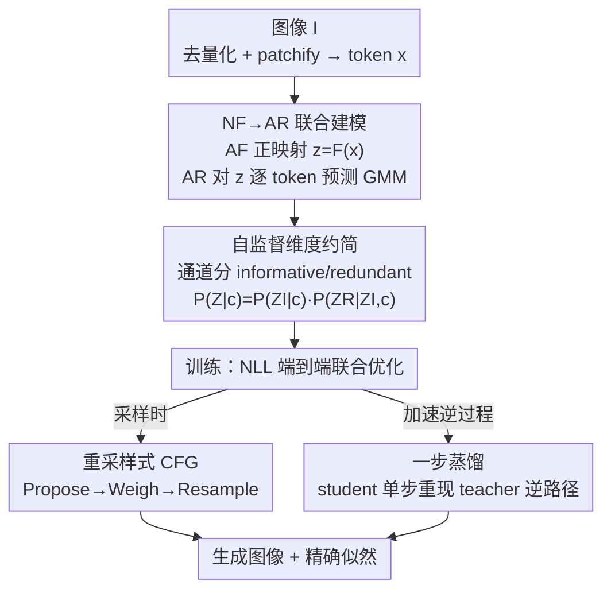

# FARMER: Flow AutoRegressive Transformer over Pixels

**会议**: CVPR 2026  
**论文**: [CVF Open Access](https://openaccess.thecvf.com/content/CVPR2026/html/Zheng_FARMER_Flow_AutoRegressive_Transformer_over_Pixels_CVPR_2026_paper.html)  
**代码**: 待确认  
**领域**: 图像生成 / 扩散模型 / 自回归生成  
**关键词**: 归一化流, 自回归生成, 像素级建模, 精确似然, 维度约简

## 一句话总结
FARMER 把可逆的自回归流（AF）和自回归 Transformer（AR）端到端拼成一个框架，直接在原始像素上做生成与精确似然估计——用 AF 把图像变成隐序列、再让 AR 隐式建模这个序列的分布，并辅以自监督维度约简、一步蒸馏和重采样式 CFG，在 ImageNet 256×256 上把最可比的 JetFormer 的 FID 从 6.64 降到 3.60。

## 研究背景与动机

**领域现状**：显式建模数据的归一化似然 $P(x)$ 是机器学习的核心命题。主流生成范式里，VAE 只优化下界、GAN 是没有似然的隐式生成器、扩散/score-based 模型只能通过变分界或昂贵的概率流 ODE 间接给出似然——都拿不到精确似然。自回归（AR）模型靠链式法则把序列似然分解成逐 token 条件概率，在语言模型上取得了惊人的 scaling 成功，但搬到连续、高维的图像像素上一直很吃力。

**现有痛点**：直接在像素上做连续 AR（PixelRNN/CNN、iGPT 一脉）会面对**极长的 token 序列**——一张 256×256 图就有几百到上千个 token，训练和采样代价高、对长程依赖很脆弱。另一条路归一化流（NF）通过可逆映射给出精确似然，但近期 NF 工作（JetFormer、STARFlow/TARFlow）几乎都把数据分布映射到**固定的标准高斯** $\mathcal{N}(0,1)$。把高维、高度分散的图像分布硬塞进各向同性高斯，会引入不连续/扭曲，导致从隐空间采到的点变回数据空间时容易 out-of-distribution，质量下降。

**核心矛盾**：AR 表达力强但建模/采样难，NF 可逆且似然精确但表达力受限、采样质量被"硬贴标准高斯"拖累——两者各有一半优势，没人把它们的优势合到一处。

**本文目标**：在原始像素上做到**精确似然 + 高质量合成 + 可扩展训练**三者兼得，同时绕开"长序列"和"AF 逆过程慢"两个工程拦路虎。

**切入角度**：与其把图像映射到一个固定的标准高斯，不如让 NF 把图像映射到一个**由 AR 隐式建模的隐分布**——目标分布不再是写死的高斯，而是被 AR 赋予了表达力的可学习分布。

**核心 idea**：用自回归流（AF）替代普通 NF 做正/逆映射、用 AR Transformer 对 AF 输出的隐序列做隐式分布建模，两者端到端联合优化（统一的因果结构），既保住 NF 的精确似然，又借到 AR 的表达力。

## 方法详解

### 整体框架
FARMER 输入一张图像、输出对该图像分布的生成能力与精确似然。整条管线是：图像先去量化+patchify 成连续 token 序列 $x$；自回归流 $F$ 把 $x$ 可逆地映射成隐序列 $z=F(x)$；AR Transformer 对 $z$ 做隐式分布建模，逐 token 预测一个 $K$ 分量高斯混合（GMM）；两部分用统一的负对数似然（NLL）端到端联合训练。在此之上叠了三个让它真正可用的设计：自监督维度约简（把高维 token 拆成"信息/冗余"两组、压缩 AR 的建模负担）、重采样式 CFG（在 GMM 框架下做无分类器引导）、一步蒸馏（把 AF 慢到爆的串行逆过程压成单步）。

训练目标把 AR 似然（式 7）和 AF 的对数行列式（式 6）合在一起，对所有维度取平均：

$$\mathcal{L} = -\frac{1}{N\cdot d}\Big(\sum_{i=1}^{N}\log p(z_i\,|\,z_{<i}, c) + \log\big|\det \tfrac{\partial z}{\partial x}\big|\Big)$$

### 关键设计

**1. NF↔AR 联合建模：把"固定高斯"换成"AR 隐式分布"**

普通 NF 的死穴是把高维图像分布硬贴到标准高斯，分布鸿沟太大、采样易 OOD。FARMER 的做法是：NF 不再以固定高斯为目标，而是把图像映射成隐序列 $z=F(x)$，让这个序列的分布由一个 AR 模型**隐式地**建模，二者端到端联合优化。优化目标写成

$$\min_{F,\text{AR}} -\sum_{i=1}^{N}\log p_\text{AR}(z_i\,|\,z_{<i}) - \log\big|\det(\tfrac{\partial F(x)}{\partial x})\big|$$

为了让 AR 基分布有足够表达力，每个条件概率 $p(z_i|z_{<i})$ 用一个 $K$ 分量 GMM 来建（沿用 JetFormer/GIVT 的做法）：

$$p(z_i|z_{<i},c) = \sum_{k=1}^{K}\pi_k\,\mathcal{N}\big(z_i;\mu_k, \text{diag}(\sigma_k^2)\big)$$

关键的实现差异是：FARMER 把 NF 组件 $F$ 也实现成**自回归流（AF）**而不是 JetFormer 那种通道对半仿射的 Jet 结构，从而让整条 NF/AR 管线保持一致的因果（causal）形式。AF 的每个可逆块对 token 序列做下三角的逐 token 仿射：第 $t$ 块的正向 $z^t_i=(z^{t-1}_i-\mu^t(z^{t-1}_{<i}))\oslash\sigma^t(z^{t-1}_{<i})$（$i>1$），逆向就是把它代数反解。因为雅可比是下三角，对数行列式等于对角元（即各 $\sigma^t$）的乘积，可在训练时高效求得（式 6）。块之间还插入 token 顺序置换 $\pi_t$ 再逆置换来增强表达力。值得注意的是当 $K=1$ 时，AF+AR 会退化成一个更深的单一 AF——说明这套设计是 AF 的真包含扩展。

**2. 自监督维度约简：把高维 token 拆成"信息/冗余"两组、正确分解联合概率**

AF 的可逆性会**保维**：256×256 图、patch 16 时隐序列有 $N=256$ 个 token、每个 $d=768$ 维。这么高维的 token 直接做逐 token GMM 既难建模又把采样空间撑爆。前作 RealNVP/JetFormer 的思路是把一半维度当冗余、扔给一个**标准高斯先验**，并假设 $P(Z|c)=P(Z^R)P(Z^I|c)$——即冗余部分 $Z^R$ 与 $Z^I$、$c$ 都独立。FARMER 指出这个独立性假设在实践中常被违反：信息维和冗余维通常仍相关，强行独立会丢信息，还限制了多模态条件与全隐变量的交互。

FARMER 改为把隐变量沿通道切成信息部分 $Z^I\in\mathbb{R}^{N\times d_I}$ 和冗余部分 $Z^R\in\mathbb{R}^{N\times d_R}$（$d=d_I+d_R$），并用链式法则**正确地**分解：

$$P(Z|c) = P(Z^I|c)\,P(Z^R\,|\,Z^I, c)$$

其中信息 token $Z^I_i$ 仍按标准自回归逐个建模（各自一个 GMM，条件是 $c$ 与前缀 $Z^I_{<i}$）；而**所有 token 的冗余通道 $Z^R$ 共享同一个 GMM** $G_{N+1}$，条件是整条信息序列 $Z^I$（作为全局图像上下文）加 $c$。这等于把 $N$ 个高维 token 变成 $N{+}1$ 个低维 token——把所有冗余通道打包成一个"额外 token"。这样最大化似然会**自监督地诱导信息解耦**：复杂的轮廓与结构信息被挤进 $Z^I$，简单的颜色与细节信息分配到 $Z^R$（论文 Fig.6 通过缩放共享 GMM 的方差验证了这一点——调小方差使颜色区更平滑但全局结构不变，调大则细节多样但易出色彩伪影）。约简后损失改写为两部分 NLL 之和（式 9）。

**3. 重采样式 CFG：在 GMM 框架下实现可采样的无分类器引导**

CFG 在扩散/视觉 AR 里是提质标配，但它的引导分布 $\log p^*(z)\approx \log p_u(z)+(w{+}1)\cdot(\log p_c(z)-\log p_u(z))$ 是 GMM 的难解混合，没法直接采样。FARMER 的洞察是把目标拆成两项：第一项是可直接采样的 GMM，第二项不可直接采样但能**评估**候选样本在其下的概率。于是用三步重采样近似：(i) **Propose** 从条件 GMM $p_c$ 采 $s$ 个、从无条件 GMM $p_u$ 采 $s'$ 个候选；(ii) **Weigh** 按式中第二项算每个候选的对数概率并归一化成权重；(iii) **Resample** 按归一化的类别分布重采得到最终 token。整体上候选 $z$ 在 propose 步被选概率为 $p_c(z)/p_u(z)$、在 resample 步为 $\big(\tfrac{p_c}{p_u}\big)^w/\big(\tfrac{p_c}{p_u}\big)^{w+1}$，乘起来正好让总概率 $p_c(z)\big(\tfrac{p_c}{p_u}\big)^w$ 匹配目标 $p^*(z)$。消融里，把 JetFormer 的朴素 CFG 换成这个重采样式 CFG，FID 从 8.66 进一步降到 5.67。⚠️ 三步式的精确权重定义以原文 Supplement Algorithm 1 为准。

**4. 一步蒸馏：把 AF 串行逆过程从 22 步压成 1 步**

AF 表达力强，代价是逆过程严格串行——逆映射时每个 token 都要条件于已解出的前缀，序列一长就成了推理瓶颈（TARFlow/STARFlow 在 patch 8、序列 1024 时尤甚）。FARMER 利用 NF 正/逆路径互为精确逆的性质：先把训好的 teacher AF 的**正向路径** $(Z_0,Z_1,\dots,Z_n)$ 反转得到逆路径 $(Z_n,\dots,Z_0)$，再训一个 student AF，让 student 的**正向**单步路径去对齐 teacher 的逆路径。具体地，student 由 teacher AF 拷贝初始化并把注意力改成双向；输入加噪隐变量 $\tilde Z_n=Z_n+s\cdot\text{noise}$ 增强鲁棒性，每个 student 块的输出 $\tilde Z_{t-1}$ 用 MSE 对齐 teacher 路径上的 $Z_{t-1}$。这样把逆过程从 0.1689 s/img 降到 0.0076 s/img（**22× 加速、整体 4× 加速**），只需约 60 个额外 epoch，且质量基本不掉（FID 5.55→5.63）。与渐进式扩散蒸馏不同，它端到端蒸馏整条 AF、对累计推理误差更鲁棒，也不需要 teacher 真去跑慢逆过程来产监督信号。

### 损失函数 / 训练策略
- 总损失是数据 NLL，对所有维度取平均（式 8/9），由 AR 的逐 token GMM 似然 + AF 的对数雅可比行列式两部分组成。
- 去量化用**退火噪声**：往原图加 $\mathcal{N}(0,\sigma^2)$ 噪声把离散像素连续化，$\sigma$ 用余弦衰减从 0.1 退火到 0.005。
- 条件嵌入 $c$ 被复制 $M$ 次（默认 64）前置到隐序列以放大条件引导。
- 默认配置：信息维 $d_I{=}128$、$K{=}64$ 个混合分量；冗余维 $d_R{=}640$、$K{=}200$。两个规模：FARMER-1.1B / 1.9B。

## 实验关键数据

### 主实验
ImageNet 256×256 类条件生成，50K 样本评 FID/IS/Precision/Recall（全部用重采样式 CFG）。FARMER 直接在像素空间训练、单阶段端到端，相比最可比的 JetFormer 把 FID 降了 3.04，对 NF 系的 TARFlow/STARFlow 也更优。

| 类型 | 模型 | 参数 | Epochs | FID↓ | IS↑ | Pre.↑ | Rec.↑ |
|------|------|------|--------|------|------|-------|-------|
| Pixel·NF+AR | JetFormer | 2.8B | 500 | 6.64 | - | 0.69 | 0.56 |
| Pixel·NF | TARFlow (patch 8) | 1.3B | 320 | 5.56 | - | - | - |
| Pixel·NF | STARFlow (patch 8) | 1.4B | 320 | 4.69 | - | - | - |
| Pixel·AR | FractalMAR-H | 844M | 600 | 6.15 | 348.9 | 0.81 | 0.46 |
| **Pixel·NF+AR** | **FARMER 1.1B (patch 16)** | 1.1B | 320 | 5.40 | 212.23 | 0.78 | 0.45 |
| **Pixel·NF+AR** | **FARMER 1.9B (patch 8)** | 1.9B | 320 | **3.60** | 269.21 | 0.81 | 0.51 |
| Latent·AR | MAR-L | 479M+66M | 800 | 1.78 | 296.0 | 0.81 | 0.60 |
| Latent·Diff | DiT-XL | 675M+86M | 1400 | 2.27 | 278.2 | 0.83 | 0.57 |

> 注：FARMER 是纯像素、单阶段方法，和带 VAE 的隐空间模型（如 DiT/MAR）不在同一起跑线上——隐空间模型受益于 VAE 提供的结构化连续隐空间，FARMER 则换来"直接访问原始数据分布、无 VAE 信息瓶颈"的优势（论文称在人脸等细粒度结构上更不易被压糊）。

### 消融实验
FARMER-1.1B、$K{=}1024$、ImageNet 256×256。逐项加组件看 FID/IS（Table 2）：

| 配置（逐项累加） | FID↓ | IS↑ | 说明 |
|------------------|------|------|------|
| baseline | 61.17 | 22.10 | 无任何下述组件 |
| + 自监督维度约简 | 49.29 | 30.61 | 拆 informative/redundant，压建模难度 |
| + 条件复制 (×64) | 45.34 | 33.87 | 放大类条件引导 |
| + 末端置换 | 44.56 | 33.17 | AF/AR 间插 token 置换保持依赖 |
| + 朴素 CFG | 8.66 | 233.84 | JetFormer 式 CFG，质变 |
| + 重采样式 CFG | **5.67** | 215.53 | 本文 CFG，FID 再降 |

NF 架构对比（Table 3）：AF 表达力远胜 Jet，但逆过程慢；一步蒸馏几乎不掉质量就把逆速度拉回来。

| NF 架构 | FID↓ | IS↑ | 正向速度 | 逆向速度 |
|---------|------|------|----------|----------|
| Jet | 106.23 | 13.14 | 0.0065 s/img | 0.0099 s/img |
| AF | 5.55 | 194.63 | 0.0066 s/img | 0.1689 s/img |
| AF + 一步蒸馏 | 5.63 | 193.49 | 0.0066 s/img | **0.0076 s/img** |

### 关键发现
- **CFG 是质变开关**：从无 CFG（FID 44.56）到朴素 CFG（8.66）是一次断崖式提升，再换重采样式 CFG 降到 5.67——说明在 GMM 隐式分布上做对引导比堆其他组件更关键。
- **维度约简 + 正确分解是基石**：单加自监督维度约简就把 FID 从 61.17 砍到 49.29；与 JetFormer 的"冗余独立高斯先验"相比，FARMER 的"$Z^R$ 条件于 $Z^I,c$"把 FID 从 7.81 降到 5.67、IS 从 182.87 升到 215.53。
- **超参权衡**：GMM 混合数在 64 最优，降到 32 会让维度约简失效、质量明显下滑；信息维 $d_I$ 也在 128 最优——加大能装更多信息但会让 AR 建模/采样更难，是典型 trade-off。
- **Jet 学不会信息分离**：Jet 结构虽快但表达力不足，无法把图像的不同信息分进两组通道（FID 高达 106），印证了用 AF 当 NF 的必要性。

## 亮点与洞察
- **"不贴固定高斯"这一刀很准**：把 NF 的目标分布从写死的标准高斯换成 AR 隐式分布，直接绕开了 NF 长期的 OOD/质量退化痛点，是整篇最核心的"啊哈"——目标分布本身可学习、有表达力。
- **维度约简的概率修正很优雅**：把 JetFormer 的"冗余独立"错误假设改成链式法则的正确分解 $P(Z^I|c)P(Z^R|Z^I,c)$，既省算力又自监督地把结构/颜色信息解耦，且无信息损失；"$N$ 个高维 token → $N{+}1$ 个低维 token"的打包视角很巧。
- **一步蒸馏可迁移**：利用 NF 正逆互为精确逆、用 teacher 正向路径的反转监督 student 单步正向——这套"端到端蒸馏整条可逆链"的思路，对任何串行逆过程慢的 AF/NF 模型都可复用。
- **重采样式 CFG** 给"分布是 GMM 混合、没法直接采样"的场景提供了一个 Propose→Weigh→Resample 的通用近似采样模板。

## 局限与展望
- **绝对指标仍逊于隐空间 SOTA**：FARMER 最好 FID 3.60，离 DiT/SiT/REPA-E（1.1~2.3）还有差距；作者把这归因于纯像素 vs VAE 隐空间的天然差异，但这意味着在"刷榜"意义上还没追平。⚠️ 这是不同设定下的对比，不宜直接比大小。
- **依赖大量工程组件叠加**：从 baseline 的 FID 61 到 5.67，提升几乎全靠 CFG + 维度约简 + 蒸馏等组件叠加，单看 NF+AR 联合框架本身（无 CFG）质量并不亮眼——框架的"干净"与最终质量之间仍隔着不少 trick。
- **只验证了 ImageNet 256×256 类条件**：没有文生图/更高分辨率/多模态条件的结果，"直接访问原始像素更利于多模态"更多是论证而非实测。
- **可改进**：把重采样 CFG 的候选数 $s$、蒸馏的额外 epoch 做成自适应；或把维度约简推广到多于两组的层级化通道划分。

## 相关工作与启发
- **vs JetFormer**: 同属 NF+AR 像素生成，但 (1) FARMER 用 AF 而非 Jet 做 NF（表达力强、能分离信息）；(2) 维度约简用正确的条件分解 $P(Z^R|Z^I,c)$ 取代 JetFormer 的"冗余独立标准高斯"假设；(3) 升级到重采样式 CFG。结果 FID 6.64→3.60。
- **vs TARFlow / STARFlow**: 都是把数据映射到标准高斯的 AF 系 NF，受"贴固定高斯"之苦；FARMER 改成 AR 隐式分布并加一步蒸馏解决 AF 逆过程慢的问题（这两者在 patch 8、长度 1024 时正是被逆过程拖累）。
- **vs 隐空间模型（DiT/MAR/REPA-E）**: 它们靠 VAE 提供结构化连续隐空间换高质量采样；FARMER 放弃 VAE、直接在像素上建模，换来精确似然与无信息瓶颈的细节保真，代价是绝对 FID 暂时落后。

## 评分
- 新颖性: ⭐⭐⭐⭐⭐ 把 NF 目标从固定高斯换成 AR 隐式分布、配正确的条件维度分解，是对 NF+AR 像素生成的实质性重构。
- 实验充分度: ⭐⭐⭐⭐ 消融详尽、NF 架构与维度约简对比清晰，但只在 ImageNet 256×256 一个设定上验证。
- 写作质量: ⭐⭐⭐⭐ 动机推导（为何不贴高斯）与各组件的概率论证讲得清楚，部分细节（CFG 三步权重、蒸馏算法）压在 Supplement。
- 价值: ⭐⭐⭐⭐ 为"精确似然 + 像素级高质量生成"提供了可扩展、单阶段的可行路线，一步蒸馏与重采样 CFG 都有独立的可复用价值。

<!-- RELATED:START -->

## 相关论文

- [\[CVPR 2026\] MPDiT: Multi-Patch Global-to-Local Transformer Architecture for Efficient Flow Matching](mpdit_multi-patch_global-to-local_transformer_architecture_for_efficient_flow_ma.md)
- [\[CVPR 2026\] DDT: Decoupled Diffusion Transformer](ddt_decoupled_diffusion_transformer.md)
- [\[CVPR 2026\] Guiding a Diffusion Transformer with the Internal Dynamics of Itself](guiding_a_diffusion_transformer_with_the_internal_dynamics_of_itself.md)
- [\[CVPR 2026\] From Sketch to Fresco: Efficient Diffusion Transformer with Progressive Resolution](from_sketch_to_fresco_efficient_diffusion_transformer_with_progressive_resolutio.md)
- [\[CVPR 2026\] VibeToken: Scaling 1D Image Tokenizers and Autoregressive Models for Dynamic Resolution Generations](vibetoken_scaling_1d_image_tokenizers_and_autoregressive_models_for_dynamic_reso.md)

<!-- RELATED:END -->
