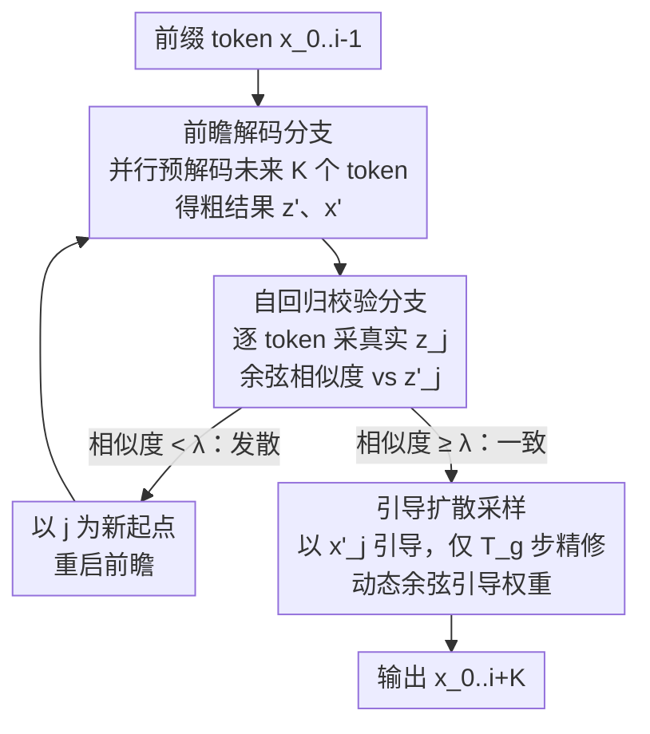

# FastHybrid: Accelerating Hybrid Autoregressive Image Generation with Lookahead and Guided Decoding

**会议**: CVPR 2026  
**论文**: [CVF Open Access](https://openaccess.thecvf.com/content/CVPR2026/html/Jiang_FastHybrid_Accelerating_Hybrid_Autoregressive_Image_Generation_with_Lookahead_and_Guided_CVPR_2026_paper.html)  
**代码**: 无  
**领域**: 自回归图像生成 / 扩散模型 / 推理加速  
**关键词**: 混合自回归生成, 前瞻解码, 引导扩散采样, 推理加速, MAR  

## 一句话总结
针对「自回归 + 扩散头」混合图像生成里扩散去噪太慢的瓶颈，FastHybrid 用一个**前瞻分支并行预解码未来若干 token** + 一个**自回归分支按余弦相似度校验纠偏**，再用**引导扩散采样**把校验后 token 的去噪步数从 100 步压到 10 步，免训练地把 MAR 推理最高加速 1.97×，FID 仅退化约 0.11。

## 研究背景与动机
**领域现状**：自回归（AR）图像生成主流是先用向量量化（VQ）把图像 patch 离散成 token，再像语言模型一样 next-token prediction。但 VQ 路线有两个老毛病——codebook collapse（只有少数码字被频繁使用，多样性差）和重建伪影（离散化丢细节）。为绕开这些问题，近期兴起的**混合 AR 范式**（MAR、HART、DisCo-Diff 等）改在连续空间工作：AR 模型为每个位置预测一个**连续语义向量** $z_i = f(x_1,\dots,x_{i-1})$，再交给一个**扩散头**以 $z_i$ 为条件，对该 patch 做多步去噪生成高保真细节。

**现有痛点**：质量上去了，速度塌了。扩散头每生成一个 token 都要跑 $T$ 步（论文中 $T=100$）迭代去噪，而 AR 部分又是逐 token 串行的，于是总成本约为 $T_{\text{MAR}} = (P + Q\cdot T)\cdot K$（$P$、$Q$ 分别是 AR、扩散单步成本，$K$ 是要生成的 token 数）。瓶颈压倒性地落在 $Q\cdot T$ 这一项。

**核心矛盾**：现有 AR 加速方法（CSpD 的连续空间投机解码、LazyMAR 的层级缓存）几乎只优化 AR 那一侧的 $P$，而在混合模型里 $P$ 根本不是大头——扩散去噪 $Q\cdot T$ 才是。所以这些方法在混合模型上提速边际很小，CSpD 还要配一对大小模型、掉质量，LazyMAR 则把显存撑到 $O(B\cdot L)$。

**切入角度**：作者做了个 probe 实验——在 AR 解码第 $i$ 步时，把第 $i\sim n$ 位置全部 mask 掉，直接让扩散头并行解出这些「尚未轮到」的 token。结果发现：**早期阶段 AR 模型其实已经把大部分 patch 的整体布局和语义内容定下来了**（图像数据天然连续 + AR 上下文建模强），只是细节还没精修。这意味着未来 token 可以提前并行解码。

**核心 idea**：免训练地把生成拆成两条互补支路——**前瞻分支**抢跑出粗预测，**自回归分支**串行校验纠偏；再让粗预测反过来**引导**扩散去噪，把每个 token 的去噪步数从 $T$ 砍到 $T_g \approx T/10$。

## 方法详解

### 整体框架
FastHybrid 不改任何权重，只改混合 AR 模型（backbone 为 MAR）的**推理流程**。它把「逐 token 串行 + 每 token 多步去噪」这个慢循环，重排成「先并行抢跑一段 → 再串行校验这段 → 校验过程中用抢跑结果引导少步去噪」的循环。一个外层循环每次推进 $K$ 个 token：先由**前瞻分支**一次性解出未来 $K$ 个 token 的粗结果 $x'$，再由**自回归分支**从 $i$ 到 $i+K-1$ 逐个采样真实 token $z_j$ 并与粗预测 $z'_j$ 做相似度校验——一致就用**引导扩散采样**只跑 $T_g$ 步快速精修，不一致（发散）就以该位置为新起点重启前瞻。

理论上，FastHybrid 的成本为 $T_{\text{Ours}} = P\cdot K + Q\cdot T + Q\cdot T_g\cdot(K-1)$：前瞻分支整段只付一次完整去噪 $Q\cdot T$，其余 $K-1$ 个 token 每个只付 $Q\cdot T_g$（$T_g<T/10$），相比 $T_{\text{MAR}}=(P+Q\cdot T)K$ 把 $Q\cdot T$ 从乘 $K$ 降到几乎只付一次。

### 关键设计

**1. 前瞻解码分支：用早期语义把未来 token 抢先并行解出来**

这一支直接利用 probe 实验的观察——AR 模型在早期就已确定大多数 patch 的语义。它以已生成前缀 $x_{0:i-1}$ 为条件，**一次性**（而非逐个）让 AR 模型采出未来 $k$ 个连续语义向量，再用扩散头并行把它们去噪成粗图像：
$$z'_{i:i+k} \sim p(z_{i:i+k}\mid x_{0:i-1}), \qquad x'_{t-1,\,i:i+k} \sim q(x_{t-1,\,i:i+k}\mid x_{t,\,i:i+k},\, z'_{i:i+k},\, t)$$
关键在于这 $k$ 个 token 的去噪是**共享一次完整 $T$ 步**的并行批处理，而不是每个 token 各跑一遍 $T$ 步，这是把 $Q\cdot T$ 从乘 $K$ 降下来的来源。它产出的 $x'$ 只是「粗稿」——布局和语义对，但细节和 token 间依赖还没理顺，所以需要下一支来校验。

**2. 自回归校验分支：用余弦相似度发散检查纠正抢跑的错位**

前瞻分支并行解码时**没有显式建模 token 之间的依赖**，可能产生不一致（如图中狗的五官错位）。这一支恢复严格的逐 token 自回归：对 $i<j<i+k$ 的每个位置，先从真实 AR 分布采出「ground-truth」token $z_j \sim p(z_j\mid x_{0:j-1})$，再计算它与前瞻预测 $z'_j$ 的余弦相似度。**若相似度低于阈值 $\lambda$（论文取 0.8），判定为发散**，把该 patch 重新 mask、以 $j$ 为新起点回到前瞻分支重跑；若一致，则保留并交给引导扩散采样做快速精修。这个「校验—接受/重启」机制是质量的保险丝：它在享受并行加速的同时，把会破坏全局一致性的少数错位 token 揪出来重做，避免抢跑的错误被一路带到底。

**3. 引导扩散采样：用前瞻粗稿当先验，把去噪步数砍掉一个量级**

校验通过的 token，其前瞻粗稿 $x'_0$ 已经和目标在布局、语义上高度对齐（只差细节）。既然有了这么好的起点，就没必要让扩散头从零在无约束空间里跑满 $T$ 步。引导扩散采样把粗稿 $x'_0$ 作为先验注入去噪均值：
$$\mu'_\theta(x_t\mid x'_0, z, t) = (1-\gamma_t)\cdot \mu_\theta(x_t\mid z, t) + \gamma_t\cdot x'_0$$
再以 $\mu'_\theta$ 替换原始反向转移里的均值做采样。先验既**防止偏离**（去噪轨迹被钉在正确语义结构上），又**加速收敛**（方向更明确，无需探索整个解空间），于是步数从 $T=100$ 降到 $T_g=10$ 仍保质量。

其中的**动态引导权重** $\gamma_t$ 是点睛之笔。扩散去噪不同阶段负责不同尺度的信息：早期（高噪声）恢复粗粒度的颜色/布局，此时 $\mu_\theta(x_t\mid z,t)$ 估计不准，应**多依赖**粗稿引导；晚期生成毛发纹理这类细节，靠的是相邻 patch 的局部交互、只能从 AR 给的 $z$ 里来，**过度引导反而会带错细节**。因此作者用单调递减的余弦权重：
$$\gamma_t = 1 - \cos^2\!\Big(\frac{\pi t}{2 T_g}\Big)$$
选余弦是因为它的曲线和扩散模型训练时常用的余弦噪声调度一致，这种「引导调度 ↔ 训练调度」对齐让生成更稳定。

### 一个完整示例
以 $K=8$、$T=100$、$T_g=10$、$\lambda=0.8$ 为例走一遍：① 前瞻分支以前缀为条件，一次性并行解出第 $i\sim i+7$ 这 8 个 token 的粗稿（共享一次 100 步去噪）；② 自回归分支从 $j=i$ 开始逐个采真实 $z_j$，比如第 $i,i+1,i+2$ 都和粗稿余弦相似度 $\ge 0.8$，各自只用引导扩散跑 10 步精修；③ 到 $j=i+3$ 时相似度只有 0.6（猫脸某处发散），该 patch 被 re-mask，外层指针 $i\leftarrow i+3$，回到前瞻分支重新抢跑后面这段；④ 如此往复直到推进完 $K$ 个 token，输出 $x_{0:i+K}$。直观上：大部分 token 走「粗稿对 → 10 步精修」的快车道，只有少数发散 token 触发重跑，整体省下的就是「不用每个 token 都跑满 100 步」。

## 实验关键数据
在 ImageNet 256×256 上以 MAR 为 backbone，AR 步数 64、扩散头采样步 100，前瞻步 $k$ 对 MAR-B/-L/-H 取 7/8/9，引导采样步 $T_g=10$，$\lambda=0.8$，4×RTX 3090、batch=8。主实验生成 5 万张算 FID/IS。

### 主实验
| 模型 | #Param | FID↓ | IS↑ | 显存(MB) | 运行时间(s) | 加速比 |
|------|--------|------|-----|----------|-------------|--------|
| MAR-B-64 (基线) | 208M | 2.32 | 281.1 | 2030 | 21.4 | 1× |
| MAR-B-32 (砍AR步) | 208M | 2.47 | 273.1 | 2030 | 10.9 | ×1.96 |
| LazyMAR-B-64 | 208M | 2.45 | 281.3 | 3610 (×1.78) | 18.9 | ×1.13 |
| **FastHybrid-B-64** | 208M | 2.43 | 284.3 | 2640 (×1.30) | 10.8 | **×1.97** |
| MAR-L-64 (基线) | 479M | 1.82 | 296.1 | 3616 | 26.9 | 1× |
| CSpD-L-64 | 687M (+43%) | 3.45 | 259.5 | 4870 | 24.5 | ×1.09 |
| LazyMAR-L-64 | 479M | 1.93 | 297.4 | 6558 | 20.1 | ×1.33 |
| **FastHybrid-L-64** | 479M | 1.90 | 303.8 | 4120 (×1.14) | 13.9 | **×1.92** |
| MAR-H-64 (基线) | 943M | 1.59 | 299.1 | 6586 | 35.7 | 1× |
| CSpD-H-64 | 1151M (+22%) | 3.91 | 248.5 | 7884 | 26.5 | ×1.34 |
| LazyMAR-H-64 | 943M | 1.69 | 299.2 | 12094 | 26.8 | ×1.32 |
| **FastHybrid-H-64** | 943M | 1.70 | 309.2 | 7074 (×1.07) | 21.0 | **×1.69** |

读法：FastHybrid 拿到接近「直接砍半 AR 步」（MAR-32）的加速比，但质量保持得好得多——比如 B 档加速 ×1.97 而 FID 仅 2.32→2.43。对比 CSpD（要加 22~43% 参数还把 FID 打到 3.45/3.91）和 LazyMAR（显存几乎翻倍、加速却只 ×1.13~1.33），FastHybrid 在质量、显存、速度三者的平衡明显更优。IS 普遍还涨了（如 H 档 299.1→309.2）。一个有趣现象：FastHybrid-H-64 在速度和质量上同时超过 MAR-B-64 基线，说明加速大模型比直接用小模型更划算。

### 消融实验
消融用 1 万张图（故 FID/IS 数值整体劣于主实验），均基于 MAR-Base。下表分别拆校验阈值/引导必要性，以及引导调度。

**校验阈值 + 引导必要性**（R-x 仅相似度过滤，RG-x 再加引导扩散采样）：

| 配置 | FID↓ | IS↑ | 时间(s) | 说明 |
|------|------|-----|---------|------|
| MAR (基线) | 4.74 | 217.2 | 21.48 | 不加速 |
| R-0.8 (仅过滤) | 4.94 | 221.5 | 8.09 | 没引导→纹理伪影（蝴蝶与花边界糊、海葵触手乱） |
| **RG-0.8** | 4.84 | 222.2 | 10.02 | 完整：阈值高+引导，质量最好 |
| RG-0.6 | 4.98 | 216.2 | 8.60 | 阈值降→FID升 |
| RG-0.4 | 5.16 | 210.8 | 8.04 | 继续恶化 |
| RG-0.2 | 5.46 | 206.1 | 7.47 | 几乎不校验 |
| RG-0.0 | 5.60 | 205.7 | 7.47 | 不校验，最差 |

**引导方法 + 权重调度**（基线 MAR-D50；前两组是「砍步数 / 先加噪再去噪」的替代法）：

| 引导方法 | FID↓ | IS↑ | 时间(s) |
|----------|------|-----|---------|
| MAR-D50 | 4.75 | 216.9 | 11.88 |
| MAR-D30 (硬砍到30步) | 5.04 | 216.7 | 7.76 |
| inverse(15*0.9) | 4.87 | 225.6 | 7.64 |
| Linear-up (递增权重) | 5.13 | 233.7 | 6.94 |
| Linear-down (递减) | 4.99 | 221.7 | 6.87 |
| Square | 5.09 | 224.8 | 6.85 |
| **Cos (本文)** | **4.84** | 222.2 | 6.99 |

### 关键发现
- **校验阈值越高越好**：相似度阈值从 0.0 提到 0.8，FID 单调下降（5.60→4.84）、IS 上升，证明把发散 token 揪出来重做确实关键。
- **光过滤不够，引导是必需**：仅 R-0.8 过滤（FID 4.94）会留下明显纹理伪影，加上引导扩散采样（RG-0.8，FID 4.84）才能修掉局部不一致——这正是设计引导采样的初衷。
- **递增权重是错的**：Linear-up 虽 IS 最高（233.7）但 FID 差（5.13），因为它和「去噪从粗到细」的本性相悖；只有单调递减的 Cos 调度（FID 4.84）最好，印证「早期多引导、晚期少引导」的分析，且余弦与训练噪声调度对齐。
- **硬砍步数不可取**：MAR-D30 直接把步数砍到 30 会出现极端异常 patch（FID 5.04），说明省步数必须配引导。

## 亮点与洞察
- **免训练、即插即用**：整套方法不动任何权重，纯推理期重排，可直接套在现成混合 AR 模型上，工程价值高。
- **「先抢跑 + 后校验」复用了投机解码思想但放对了地方**：和 CSpD/LazyMAR 只优化 AR 不同，FastHybrid 把加速火力对准真正的瓶颈——扩散去噪，前瞻分支让 $Q\cdot T$ 从乘 $K$ 降到几乎付一次。
- **粗稿当扩散先验是很自然的桥**：把 AR 的语义粗预测注入扩散均值，既防偏离又加速收敛，比「先加噪再去噪」类替代法更稳。
- **动态余弦权重把扩散的尺度先验用活了**：早期信语义、晚期信局部，这个「随时间退火引导强度」的思路可迁移到其它需要外部先验引导扩散的任务（如可控生成、超分）。
- **作者明说与 LazyMAR 正交**：LazyMAR 削 AR 延迟、FastHybrid 削扩散延迟，二者可叠加，给后续工作留了组合空间。

## 局限性 / 可改进方向
- **加速比随模型增大而下降**：B/L/H 三档加速从 ×1.97 掉到 ×1.69，大模型上前瞻步数虽加大但收益递减，原因文中未深究。⚠️ 论文未给出加速比随 $k$、$\lambda$ 共同变化的完整曲线。
- **依赖「早期语义已定」的假设**：probe 观察建立在图像数据连续性强、布局早定的前提上；对高度局部随机、缺乏全局结构的图像（如纹理/噪声主导场景），前瞻命中率可能下降、触发更多重启。
- **只在 ImageNet 256×256 + MAR 上验证**：未在文生图、更高分辨率或其它混合 AR backbone（HART、DisCo-Diff）上测试，泛化性待考。
- **超参需按模型档位手调**：前瞻步 $k$ 对 B/L/H 分别取 7/8/9、阈值 $\lambda=0.8$ 固定，是否对其它数据集/模型最优未充分扫描。

## 相关工作与启发
- **vs CSpD（连续空间投机解码）**：CSpD 需要同族一大一小两个模型生成+验证草稿 token，且只优化 AR 侧，在混合模型里提速有限（×1.09~1.34）、还显著掉质量（FID 3.45/3.91）。FastHybrid 不需额外模型、直接对扩散瓶颈下手，质量几乎不退。
- **vs LazyMAR（层级缓存）**：LazyMAR 缓存每层激活、只更新子集来削 AR 计算，质量保持尚可但显存 $O(B\cdot L)$ 暴涨（深模型/大 batch 下接近翻倍）。FastHybrid 显存增幅小（×1.07~1.30），且作者指出二者功能正交、可组合。
- **vs PAR / LANTERN**：PAR 按 token 依赖并行生成但顺序僵硬、缺乏灵活性；LANTERN 把 LLM 投机解码搬到视觉 AR。它们都聚焦 AR 侧并行，而 FastHybrid 的核心贡献是把加速对准扩散去噪并用引导采样压步数，这是混合范式下被前人忽视的主战场。

## 评分
- 新颖性: ⭐⭐⭐⭐ 把投机/前瞻解码与引导扩散采样结合、精准打在混合 AR 的扩散瓶颈上，角度新且免训练。
- 实验充分度: ⭐⭐⭐⭐ 三档模型主实验 + 阈值/引导/权重三组消融较完整，但仅限 ImageNet 256 单数据集单 backbone。
- 写作质量: ⭐⭐⭐⭐ 动机—probe—方法—消融逻辑清晰，伪代码和时间分析到位。
- 价值: ⭐⭐⭐⭐ 即插即用加速混合 AR 生成、与 LazyMAR 正交可叠加，实用性强。

<!-- RELATED:START -->

## 相关论文

- [\[CVPR 2026\] Parallel Jacobi Decoding for Fast Autoregressive Image Generation](parallel_jacobi_decoding_for_fast_autoregressive_image_generation.md)
- [\[CVPR 2026\] SJD-PAC: Accelerating Speculative Jacobi Decoding via Proactive Drafting and Adaptive Continuation](sjd-pac_accelerating_speculative_jacobi_decoding_via_proactive_drafting_and_adap.md)
- [\[AAAI 2026\] Annealed Relaxation of Speculative Decoding for Faster Autoregressive Image Generation](../../AAAI2026/image_generation/annealed_relaxation_of_speculative_decoding_for_faster_autor.md)
- [\[ICLR 2026\] Autoregressive Image Generation with Randomized Parallel Decoding](../../ICLR2026/image_generation/autoregressive_image_generation_with_randomized_parallel_decoding.md)
- [\[ICCV 2025\] Grouped Speculative Decoding for Autoregressive Image Generation](../../ICCV2025/image_generation/grouped_speculative_decoding_for_autoregressive_image_generation.md)

<!-- RELATED:END -->
