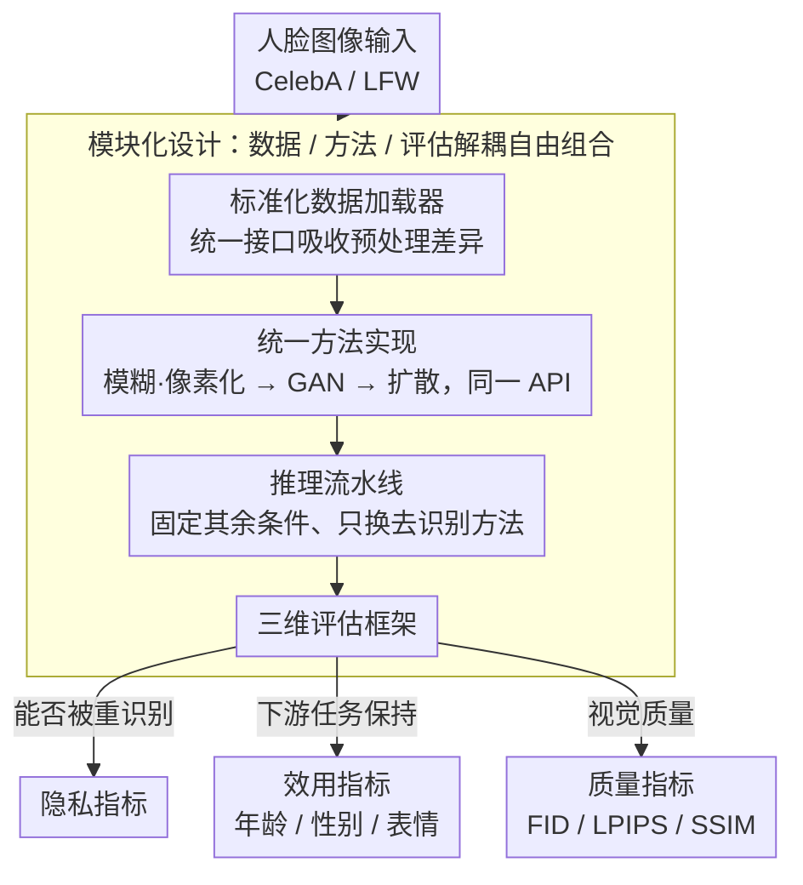

# FDeID-Toolbox: Face De-Identification Toolbox

**会议**: CVPR 2026  
**arXiv**: [2603.13121](https://arxiv.org/abs/2603.13121)  
**代码**: 有（Technical Report 附带 codebase）  
**领域**: 隐私保护 / 人脸去识别 / 基准工具  
**关键词**: 人脸去识别, 隐私保护, 工具箱, 可复现评估, 生成模型, 基准  

## 一句话总结
发布 FDeID-Toolbox，一个模块化人脸去识别研究工具箱，统一了数据加载、方法实现（经典到 SOTA 生成模型）、推理流水线和三维评估协议（隐私/效用/质量），解决该领域实验碎片化和结果不可比的问题。

## 背景与动机
人脸去识别（FDeID）旨在从面部图像中移除个人身份信息，同时保留年龄、性别、表情等任务相关属性，是隐私保护计算机视觉的关键技术。然而该领域长期面临三个结构性困难：(1) 实现分散——各方法代码风格不一、依赖不同框架、接口不兼容；(2) 评估协议不一致——不同论文使用不同数据集划分、不同指标、不同人脸检测/识别后端，导致结果无法横向比较；(3) 任务固有的复杂性——FDeID 横跨多个下游应用（年龄估计、性别识别、表情分析），需同时在隐私保护、效用维持和视觉质量三个维度进行评估，现有代码库难以使用和扩展。

## 核心问题
FDeID 研究缺乏统一的实验平台，导致方法之间的公平比较几乎不可能。研究者需要大量重复劳动来对齐实验条件，且即使如此仍无法排除实现差异带来的干扰因素。

## 方法详解

### 整体框架
FDeID-Toolbox 不是一个新模型，而是一套模块化的人脸去识别研究工具箱，目标是终结该领域"各做各的、结果不可比"的局面。它把整个实验链路拆成解耦的四块——标准化数据加载、统一方法实现、灵活推理流水线、系统化评估协议——研究者可以固定其余条件、只替换其中一环，从而做到真正公平的横向对比。数据从加载器流入，经任意一种去识别方法处理后进入推理流水线，最终在隐私 / 效用 / 质量三个维度上同时被度量。

### 关键设计

**1. 标准化数据加载器：统一数据格式消除预处理差异**

不同论文用不同的数据集划分和预处理，是结果不可比的第一个源头。工具箱为 CelebA、LFW 等主流 FDeID 基准提供统一的加载接口，吸收掉格式差异、保证预处理一致，让后续所有方法都站在同一份数据上。

**2. 统一方法实现：同一 API 下即插即用替换方法**

各方法代码风格不一、依赖不同框架、接口不兼容，是公平比较的最大障碍。工具箱把从传统模糊/像素化，到 GAN-based（CIAGAN、DeepPrivacy），再到最新扩散模型方法全部封装在统一 API 下，支持即插即用地替换去识别方法而保持其余实验条件不变——这样方法之间的性能差异才真正归因于方法本身，而非实现差异。

**3. 三维评估框架：隐私 / 效用 / 质量同时度量**

FDeID 的本质难点是它横跨多个下游应用、必须三个维度一起看，单一指标会掩盖权衡。工具箱把评估拆成三维：隐私指标检验去识别后的图像还能不能被人脸识别系统重新识别；效用指标评估年龄估计、性别识别、表情分析等下游任务的性能保持；质量指标用 FID、LPIPS、SSIM 等衡量视觉质量。三维一起报，才能暴露此前被实验条件不一致掩盖的真实权衡。

**4. 模块化设计：数据 / 方法 / 评估三模块自由组合**

数据加载、方法、评估三块彼此解耦、可自由组合，新方法或新评估指标的集成成本极低。正是这种解耦让工具箱能持续吸纳社区贡献，而不是又退化成一份难以扩展的私有代码库。

### 损失函数 / 训练策略
FDeID-Toolbox 本身是工具箱而非单一模型，不涉及特定的损失函数设计。各内置方法保留原始论文的训练策略和损失函数。工具箱的价值在于提供统一的评估和对比环境。

## 实验关键数据
- 工具箱在统一条件下对多种去识别方法进行公平对比实验，证明不同方法在隐私/效用/质量三个维度上存在显著权衡
- 经典方法（模糊、像素化）在隐私保护上有效但严重损害效用和视觉质量
- SOTA 生成模型在视觉质量和效用保持上显著优于经典方法，但部分方法的隐私保护能力不足
- 统一评估揭示了此前文献中因实验条件不一致而被掩盖的性能差异

### 消融实验要点
- 对比不同人脸检测/对齐后端对去识别效果的影响
- 评价指标选择（不同人脸识别网络作为隐私评测后端）对方法排名的影响
- 不同数据集上方法的相对排名是否一致

## 亮点 / 我学到了什么
- 为碎片化研究领域提供统一工具箱是推动可复现研究的最有力方式之一
- FDeID 的三维评估范式（隐私/效用/质量）值得其他隐私保护任务借鉴
- 揭示了一个重要现象：不同论文因实验条件差异导致自报性能与统一评估下的性能差异较大
- 模块化设计使得新方法的集成成本极低，有利于社区采纳

## 局限与展望
- 作为 Technical Report，缺乏针对工具箱本身设计决策的深入分析
- 当前聚焦静态图像，对视频人脸去识别（时序一致性）的支持有待扩展
- 工具箱的长期维护和方法覆盖范围是持续挑战——新 SOTA 方法需要不断集成
- 缺乏对大规模数据集（如 WebFace260M 级别）的处理效率分析
- 三维评估中各维度之间的权衡机制（如 Pareto 前沿分析）可以更深入

## 与相关工作的对比
- vs. **DeepPrivacy/CIAGAN 等单一方法**：工具箱将这些方法作为组件统一实现和评估，而非与其竞争
- vs. **MMPose/MMDetection 等 OpenMMLab 工具箱**：设计理念类似——通过标准化接口实现不同方法的公平对比，但聚焦于隐私保护这一特定子领域
- vs. **各论文自报结果**：统一评估下的排名可能与原始论文不一致，凸显了可复现评估的重要性

## 与我的研究方向的关联
- 可能关联: `20260316_three_level_decoupling_unified.md`

## 评分
- 新颖性: 4/10 — 工程贡献为主，无算法创新；但填补了领域空白
- 实验充分度: 6/10 — 在统一条件下对比多种方法，但因 HTML 不可访问无法确认具体数字
- 写作质量: 6/10 — Technical Report 风格，描述清晰但深度有限
- 价值: 7/10 — 对 FDeID 社区有较高的实用价值，促进可复现研究
- 新颖性: ⭐⭐⭐
- 实验充分度: ⭐⭐⭐
- 写作质量: ⭐⭐⭐
- 对我的价值: ⭐⭐⭐

<!-- RELATED:START -->

## 相关论文

- [\[CVPR 2026\] APPLE: Attribute-Preserving Pseudo-Labeling for Diffusion-Based Face Swapping](apple_attribute-preserving_pseudo-labeling_for_diffusion-based_face_swapping.md)
- [\[CVPR 2026\] Pose-dIVE: Pose-Diversified Augmentation with Diffusion Model for Person Re-Identification](pose-dive_pose-diversified_augmentation_with_diffusion_model_for_person_re-ident.md)
- [\[CVPR 2026\] MOS: Mitigating Optical-SAR Modality Gap for Cross-Modal Ship Re-Identification](mos_mitigating_optical-sar_modality_gap_for_cross-modal_ship_re-identification.md)
- [\[CVPR 2026\] Cross-Modal Emotion Transfer for Emotion Editing in Talking Face Video](cross-modal_emotion_transfer_for_emotion_editing_in_talking_face_video.md)
- [\[CVPR 2026\] High-Fidelity Diffusion Face Swapping with ID-Constrained Facial Conditioning](high-fidelity_diffusion_face_swapping_with_id-constrained_facial_conditioning.md)

<!-- RELATED:END -->
