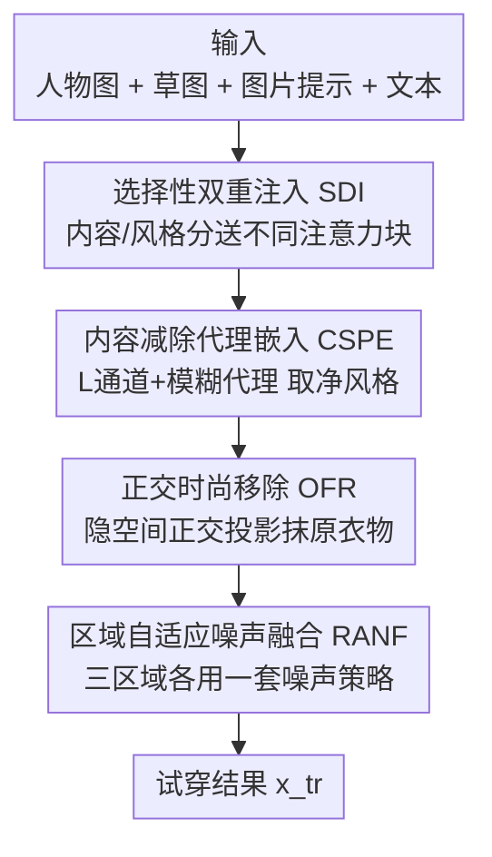

# FEAT: Fashion Editing and Try-On from Any Design

**会议**: CVPR 2026  
**论文**: [CVF Open Access](https://openaccess.thecvf.com/content/CVPR2026/html/Kwon_FEAT_Fashion_Editing_and_Try-On_from_Any_Design_CVPR_2026_paper.html)  
**代码**: 作者声明公开（含代码、生成结果与新数据集），具体仓库地址待确认 ⚠️  
**领域**: 扩散模型 / 图像编辑 / 虚拟试穿  
**关键词**: 虚拟试穿, 内容-风格解耦, 正交投影, 区域噪声融合, 无训练

## 一句话总结
FEAT 把"从任意图片（艺术画、自然照、抽象图）取设计灵感 + 给整套穿搭（含配饰）做虚拟试穿"两件事合在一个扩散框架里完成：用 DDI 把图片提示里的内容（形状轮廓）和风格（颜色纹理）拆开、分别注入 U-Net 不同注意力块来抑制内容泄漏，再用无训练的 OGNF 通过正交投影抹掉原有衣物、并对三类区域施加不同的噪声策略来合成新单品，在草图保真度、提示一致性和真实感上全面超过现有方法。

## 研究背景与动机

**领域现状**：AI 时尚设计已经从"单纯生成服装图"发展到"支持虚拟试穿（VTON）的整合管线"，而且近期工作（FashionTex、PICTURE、MGD）开始接受多模态输入——视觉范例 + 文本提示，让用户能表达复合设计意图并预览成衣效果。

**现有痛点**：现有方法卡在两个具体短板上。(i) **设计源被锁死在"服装图"上**——只能拿一件衣服当参考，没法从艺术画、自然照片、抽象概念这些更广的创意来源取灵感；(ii) **只管衣服、不管整套穿搭**——鞋、包、项链这类配饰没人做，限制了实用性。

**核心矛盾**：把图片提示里的特征整团（内容+风格纠缠在一起）经 IP-Adapter 注入，会**过度放大内容线索**（比如人脸），导致"内容泄漏"——结果是草图、文本这些其它条件被压制掉。已有工作（InstantStyle）的解法是把内容信息**整个删掉**只留风格，但这对时尚设计不实用：用户常常**就是想**让图片里的内容元素（脸、物体形状、结构线条）体现到衣服上。同时，ControlNet + IP-Adapter 这套组合**没法彻底换掉衣服**——会留下原衣物的残影，而依赖"服装专用数据集"做训练又面临可扩展性差、采集成本高的问题。

**本文目标**：(1) 让设计源不限于服装、也能来自非服装图像；(2) 以数据集无关的方式整体性地整合各种时尚单品（含配饰）。

**切入角度**：时尚设计可拆成两个基本属性——**内容（content）**指"是什么"（形状、轮廓、外形），**风格（style）**指"怎么呈现"（颜色、纹理）。作者观察到 U-Net 不同注意力块对这两种属性的敏感度是分开的，于是可以"按块"分别注入内容与风格，而不是整团注入。

**核心 idea**：**把内容和风格解耦后分块选择性注入**（解决内容泄漏、又保留可控的内容元素），**再用正交投影 + 三区域噪声策略做无训练试穿**（彻底去掉原衣物、且不需要配对训练数据）。

## 方法详解

### 整体框架
FEAT 输入一张人物图 $x_p$、一张草图 $s$、一张图片提示 $i$、一段文本提示 $y$，输出试穿结果 $x_{tr}$；每个模态都带一个缩放因子，可以精细调强弱、也可以完全关掉某个条件。整条管线分两大块串行协作：前半段 **DDI（Disentangled Dual Injection）** 负责"怎么把图片提示里的设计意图干净地灌进生成过程"——它把图片的内容与风格拆开，分别送进 U-Net 里对内容/风格最敏感的注意力块；后半段 **OGNF（Orthogonal-Guided Noise Fusion）** 是一个**无训练**机制，负责"怎么把原衣物彻底抹掉、再把新单品（含配饰）合成上去"——先用正交投影在隐空间里减掉原衣物方向，再把画面切成三个区域、每个区域用不同的噪声策略去噪。DDI 解决"设计源任意化 + 不泄漏"，OGNF 解决"换装彻底 + 无需配对数据"，两者合起来才同时拿到设计灵活性和试穿真实感。

### 关键设计

**1. 选择性双重注入 SDI：按块敏感度把内容/风格分开灌进 U-Net**

直接调小 IP-Adapter 的 image scale 确实能压一点内容泄漏，但这个参数是"一刀切"的——它同时调制所有图像来源信号，把风格信息也一起削弱了。SDI 的做法是承接 InstantStyle 的观察（U-Net 各注意力块对不同属性的敏感度不同），在**时尚域数据**上做逐块响应分析：把对风格响应最高的那一块定为 **style block**、对内容响应最高的三块定为 **content blocks**，然后给这两组块各自施加**独立的风格缩放因子和内容缩放因子**。这样一来，"想让内容多体现一点 / 想让风格强一点"就成了两个可分别拧的旋钮（消融里把内容从 0→0.5→1.0 调，画面从无内容→出现小元素如花叶→出现大内容如老虎），而不是被单一 image scale 绑死。

**2. 内容减除代理嵌入 CSPE：在 CLIP 图像嵌入空间里直接把"结构内容"减掉**

光靠分块还不够——块级量化分析（论文第 4.3 节）发现 InstantStyle 认定的 style block（Block 7）**同时编码了大量内容信息**，光给块分配风格/内容 scale 不足以严格解耦。而 InstantStyle 那套"从 CLIP 图像嵌入里减去 CLIP 文本嵌入"的做法，又因为图文对齐不完美，常常把必要的风格线索也一起减掉了。CSPE 改成**直接在 CLIP 图像嵌入空间里抑制内容**：从图片提示 $i$ 出发，只保留它的 L（明度）通道并做全局模糊，得到一个去掉了颜色和纹理的**内容代理**，再把这个代理的 CLIP 嵌入从原始嵌入里减掉，

$$\mathbf{e}_{\text{style}} = \phi(i) - \phi\!\left(\mathcal{B}_\sigma(\mathcal{L}(i))\right)$$

其中 $\mathcal{L}(\cdot)$ 取 L 明度通道、$\mathcal{B}_\sigma$ 是标准差为 $\sigma$ 的全局模糊、$\phi$ 是 CLIP 图像编码器。这样得到的 $\mathbf{e}_{\text{style}}$ 衰减了结构内容、保留了风格属性，只注入 style block；而原始嵌入 $\phi(i)$ 则供给 content blocks。两条路分送，才实现内容与风格的干净分离。

**3. 正交时尚移除 OFR：在隐空间沿"衣物方向"做正交投影减除，把原衣物抹掉**

VTON 和"补全缺失区域的 inpainting"本质不同：它必须同时(i)保住人物姿态和脸部身份、(ii)去掉要被替换的衣物、(iii)连贯地合成新衣物。ControlNet + IP-Adapter 的老问题就是去不干净、留残影。OFR 给出一个隐空间的几何解法：用 VAE 编码器把人物图 $x_p$、衣物分割 $g$、以及一张白图 $w$ 分别编成 $z^p, z^g, z^w$；因为分割出的衣物带白底，用 $z^g$ 减 $z^w$ 就能消掉背景贡献、隔离出"衣物特征"对应的隐空间方向

$$v = z^g - z^w$$

归一化得 $u = v/\lVert v \rVert$，然后把 $z^p$ 在 $u$ 上的投影减掉，得到衣物被衰减的隐表示

$$\tilde{z} = z^p - \alpha\,(z^p \cdot u)\,u$$

$\alpha$ 控制移除强度。这一步只在"衣物方向"上做减法、不动脸/身体/背景等非衣物区域，给后续合成一个干净稳定的底子。关键是它**不需要任何配对训练数据**，纯靠隐空间投影完成移除。

**4. 区域自适应噪声融合 RANF：把画面切三块、每块一套噪声策略**

拿到 OFR 给出的衣物衰减隐表示 $\tilde{z}$ 后，RANF 把"保身份 / 彻底去旧衣 / 合成新衣"这三个相互冲突的目标拆到三个**空间区域**上分别处理。它从人物图取衣物掩码 $M^p$、从草图取草图掩码 $M^s$，整体操作区域 $M = M^p \cup M^s$（都下采样到 VAE 分辨率得到隐空间掩码 $\bar{M}^p, \bar{M}^s, \bar{M}$）。在 $T$ 步推理中，每步隐状态按下式融合：

$$z'_{t-1} = \bar{M}\odot \mathrm{denoise}\!\left(z_t, s, y, i, t\right) + \left(\mathbf{1}-\bar{M}\right)\odot \mathrm{noise}\!\left(\tilde{z}, t\right)$$

迭代 $T$ 步后，三个区域呈现不同行为：$\bar{M}^s$（**新衣合成区**）用草图 $s$ 引导去噪，保证新衣物高度贴合指定形状；$\bar{M}-\bar{M}^s$（**旧衣移除区**）因为草图引导只作用在 $M^s$ 内、这里不受草图引导地去噪，从而抹掉原衣物；$\mathbf{1}-\bar{M}$（**非衣物区**）借鉴 Repaint 的噪声再注入，保住脸、身体、背景的视觉一致性。作者称这是首个为 VTON 量身设计、三区域各用不同噪声控制策略的方案——正因如此，整套试穿不依赖成对训练数据就能做到真实自然，甚至能迁移到游戏角色、动画人物、动物等非真人域。

### 损失函数 / 训练策略
FEAT 本身**没有引入新的训练损失**：DDI 是在已有 SDXL + IP-Adapter 上做注意力块的选择性注入与 CLIP 嵌入空间的代理减除，OGNF 是完全 **training-free** 的隐空间投影 + 推理期区域噪声融合。实现上统一用 SDXL 骨干、ControlNet-Depth 提取控制信号、DDIM 采样 50 步、CFG=7.5；多模态条件的草图/图片/文本 scale 默认设为 0.7 / 0.5 / 0.5，全部实验在单张 NVIDIA A6000 上完成。

## 实验关键数据

### 主实验
评测用 VITON-HD（上装）和 DressCode（上/下装、连衣裙）抽出 900 张服装草图 + 100 张配饰草图（包/鞋/围巾/腰带各 25），共 1000 张草图；文本提示用 GPT-4V 生成 1000 条，图片提示从 WikiArt(200) + Midjourney(800) 随机取 1000 张。指标包括 GPT-4V 的 Elo 分（↑，整体多模态一致性+真实感）、Sketch 用 Chamfer Distance（↓，草图对齐）、Image 用 style score（↑，越高内容泄漏越少）、Text 用 CLIP-T（↑）、Human 用户偏好（↑）。下表为内容/风格 scale 均取 0.5 时的对比（服装数据集，三模态联合设置）：

| 设置 | 方法 | GPT-4V Elo ↑ | Sketch CD ↓ | Image ↑ | Text ↑ | Human ↑ |
|------|------|------|------|------|------|------|
| Sketch+Image | ControlNet+IP-Adapter | 1037.39 | 10.42 | 0.33 | - | 19.23% |
| Sketch+Image | PICTURE | 883.80 | 14.54 | 0.31 | - | 3.85% |
| Sketch+Image | **FEAT** | **1172.73** | **6.95** | **0.37** | - | **76.92%** |
| Sketch+Text | MGD | 1027.48 | 7.32 | - | 28.35 | 18.43% |
| Sketch+Text | **FEAT** | **1148.15** | **5.16** | - | **29.12** | **74.47%** |
| Sketch+Image+Text | ControlNet+IP-Adapter | 912.13 | 9.04 | 0.30 | 27.48 | 19.23% |
| Sketch+Image+Text | **FEAT** | **1087.86** | **4.83** | **0.36** | **28.40** | **80.77%** |

FEAT 在服装和配饰两个数据集、各种模态组合下全面领先。Sketch 分（CD）大幅改善说明原衣物被有效移除、草图形状被忠实反映；Image 与 Text 分同时强，说明内容泄漏被压住、各模态被均衡整合。配饰数据集上的优势更明显（如 Sketch+Image 设置下 CD 从 PICTURE 的 125.37 降到 8.30）。

### 消融实验
在 DressCode 子集上逐个去掉组件（三模态设置）：

| 配置 | Sketch CD ↓ | Image ↑ | Text ↑ | 说明 |
|------|------|------|------|------|
| (a) ControlNet + IP（baseline） | 9.71 | 0.28 | 27.01 | 无任何本文组件，内容过度反映、原衣物残留 |
| (b) w/o SDI | 4.89 | 0.30 | 27.58 | 内容仍过强，文本提示影响不足 |
| (c) w/o CSPE | 4.52 | 0.29 | 27.42 | 同 (b)，图像内容压过文本 |
| (d) w/o OFR | 5.57 | 0.34 | 27.79 | 原衣物未移除、与新衣混叠 |
| (e) w/o RANF | 5.28 | 0.33 | 27.72 | 原穿搭仍未完全消除 |
| (f) **FEAT（Full）** | **4.15** | **0.36** | **27.88** | 全组件，换装彻底、各模态和谐整合 |

### 关键发现
- **SDI 和 CSPE 缺一不可**：(b)(c) 对比说明两者都是为了让草图/图片/文本三路信号互不干扰地和谐整合——单去掉任一个，图像内容都会压过文本，解耦不彻底。
- **OFR + RANF 必须配合才能去净旧衣**：(d) 去掉 OFR 原衣物根本不被移除；(e) 去掉 RANF 旧穿搭仍残留——只有两者合体才能完全清除原衣物。
- **块敏感度有反直觉之处**：InstantStyle 认定的 style block（Block 7）实测在内容分上也是最高，说明它内容/风格强信号混在一起，正好印证了"光分块不够、还要 CSPE 在嵌入空间减内容"的必要性；Block 4 内容分次高但风格分明显低。
- **跨域泛化**：得益于 training-free 设计，FEAT 不止能处理真人照片，还能直接迁移到动画、游戏角色乃至动物，做出无明显伪影的试穿。
- **用户研究（21 人）**：三种输入设置下 FEAT 选中率均最高，且**真实感（realism）的提升比多模态一致性更突出**。

## 亮点与洞察
- **"减内容代理"的巧思**：用"L 明度通道 + 全局模糊"构造一个去掉颜色纹理的内容代理，再在 CLIP 嵌入空间相减得净风格——比 InstantStyle 减文本嵌入更稳，因为绕开了图文对齐不准的坑。这个思路可迁移到任何"想留风格、去结构"的图像条件注入场景。
- **隐空间正交投影做"定向移除"**：把"去衣物"建模成"在隐空间沿衣物方向做正交投影减除"，几何上干净、且 training-free，不碰非衣物区域——这套"先求语义方向、再投影减除"的范式能用到其它"只想移除某一属性"的编辑任务。
- **三区域噪声策略**：把 VTON 三个互相打架的目标（保身份/去旧/合成新）拆到空间三块、各给一套噪声控制，是很务实的工程拆解，避免了一个统一去噪过程顾此失彼。
- **评测体系也是贡献**：用 GPT-4V Elo（GPTEval3D 协议）+ CD + style score + CLIP-T + 用户研究构成可复现的多维评测，比单一文本相似度更贴合人类判断。

## 局限与展望
- **作者承认的局限**：脸部附近**很小的配饰**（如贴脸小饰品）渲染会不稳定，作者认为可用局部精修模块缓解。
- **依赖外部分割与控制信号**：OFR 需要衣物分割掩码 $g$、RANF 需要草图掩码，整条管线对这些前置信号的质量有依赖；分割不准会直接影响"衣物方向"$v$ 的估计与移除效果。
- **超参敏感性未充分暴露**：移除强度 $\alpha$、模糊 $\sigma$、各模态 scale（0.7/0.5/0.5）这些关键超参对结果的影响范围在正文里给得不全，跨场景默认值是否稳健存疑 ⚠️。
- **代码/数据集开放性**：论文声明公开代码、结果与新数据集，但缓存正文未给出确切仓库链接，复现入口待确认 ⚠️。

## 相关工作与启发
- **vs InstantStyle**：它在 CLIP 嵌入空间里**整个删掉**内容只留风格，FEAT 认为这在时尚设计里不可取（用户常想保留图片的内容元素），改为"分块注入 + L 通道代理减除"做**可控的部分**解耦，并指出 InstantStyle 的 style block 其实内容也很重，光分块不够。
- **vs ControlNet + IP-Adapter**：这套组合是常见 baseline，但换装去不干净、内容泄漏严重；FEAT 用 OGNF 的正交投影 + 三区域噪声彻底解决残影问题。
- **vs PICTURE**：PICTURE 能避免内容泄漏、接受任意服装图取风格，但设计源仍限于服装、试穿也只做衣服；FEAT 把设计源扩到非服装图、把试穿扩到含配饰的整套穿搭。
- **vs MGD / FashionTex**：MGD 需额外姿态输入、对纹理材质捕捉不足；FashionTex 用文本控形状+固定尺寸图块控风格，对不规则精细服装细节吃力；FEAT 用草图控形 + 解耦图片提示控内容/风格，控制更细更灵活。

## 评分
- 新颖性: ⭐⭐⭐⭐ "任意设计源 + 含配饰整套试穿"是真问题；CSPE 的明度代理减内容 + OFR 正交投影移除都是漂亮的小创新，但单看每个组件都站在 InstantStyle/IP-Adapter/Repaint 肩上。
- 实验充分度: ⭐⭐⭐⭐ 服装+配饰双数据集、多模态组合、逐组件消融、块敏感度分析、跨域泛化、21 人用户研究都有；但缺关键超参敏感性与失败案例的系统分析。
- 写作质量: ⭐⭐⭐⭐ 问题动机（图 2）和组件作用讲得清楚，公式给得完整；个别符号（OFR/RANF 的下标）在缓存文本里偏乱。
- 价值: ⭐⭐⭐⭐ training-free + 无需配对数据 + 可迁移到非真人域，实用性和可扩展性强，对时尚 VTON 落地有直接价值。

<!-- RELATED:START -->

## 相关论文

- [\[CVPR 2026\] SkyReels-Text: Fine-Grained Font-Controllable Text Editing for Poster Design](skyreels-text_fine-grained_font-controllable_text_editing_for_poster_design.md)
- [\[CVPR 2026\] PROMO: Promptable Outfitting for Efficient High-Fidelity Virtual Try-On](promo_promptable_virtual_tryon_efficient.md)
- [\[CVPR 2026\] Garments2Look: A Multi-Reference Dataset for High-Fidelity Outfit-Level Virtual Try-On with Clothing and Accessories](garments2look_a_multi-reference_dataset_for_high-fidelity_outfit-level_virtual_t.md)
- [\[CVPR 2026\] High-Fidelity Virtual Try-On beyond Paired Data Scarcity via Diffusion-based Cycle-Consistent Learning](high-fidelity_virtual_try-on_beyond_paired_data_scarcity_via_diffusion-based_cyc.md)
- [\[CVPR 2026\] PosterIQ: A Design Perspective Benchmark for Poster Understanding and Generation](posteriq_a_design_perspective_benchmark_for_poster_understanding_and_generation.md)

<!-- RELATED:END -->
