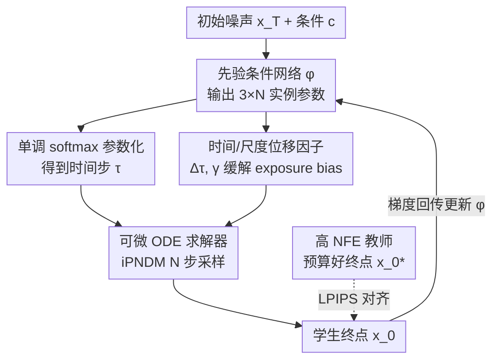

# Few-Step Diffusion Sampling Through Instance-Aware Discretizations

**会议**: CVPR 2026  
**论文**: [CVF Open Access](https://openaccess.thecvf.com/content/CVPR2026/html/Yuan_Few-Step_Diffusion_Sampling_Through_Instance-Aware_Discretizations_CVPR_2026_paper.html)  
**代码**: 未公开  
**领域**: 图像生成 / 扩散模型  
**关键词**: 扩散采样加速、时间步离散化、实例自适应、少步采样、Flow Matching  

## 一句话总结
针对扩散/Flow Matching 采样里"所有样本共用一套时间步离散"的次优问题，本文提出 INDIS：训练一个轻量网络 $\phi(\mathbf{x}_T, \mathbf{c})$，为每个初始噪声和条件生成专属的时间步离散方案，在几乎零推理开销下把 3~7 步采样的 FID 显著拉低（CIFAR10 NFE=3 从 16.5 降到 9.3）。

## 研究背景与动机
**领域现状**：扩散模型和 Flow Matching 通过求解概率流常微分方程（PF-ODE）从高斯先验生成数据。为了加速，主流分两条路——模型蒸馏（极少步但调优代价≈重训）和免训练加速（求解器+离散化策略，架构无关、可移植）。在免训练这条路里，除了设计更高阶的求解器（DPM-Solver、UniPC、iPNDM 等），**时间步离散策略**（怎么把 $[t_0, T]$ 切成 $N$ 步）是与求解器正交但同样关键的一环。早期用 uniform / logSNR 等手工启发式，近期则转向优化式搜索（GITS、DMN、AYS、LD3）。

**现有痛点**：所有这些优化式离散方法——无论 trust-region、Monte Carlo 还是梯度搜索——都强制**一套全局共享的时间步 schedule 套用到所有初始样本**。但不同的初始噪声会走出不同的采样轨迹，复杂度天差地别，强行共用一套切分必然次优。

**核心矛盾**：全局最优只是"平均意义上的折中"。作者形式化指出：全局共享 schedule 的期望误差 $\varepsilon_g$ 是逐实例最优误差 $\varepsilon_i$ 的**上界**（$\varepsilon_g \ge \varepsilon_i$）——给每个样本配最优 schedule 一定不差于全局最优，反之不成立。

**切入角度与验证**：作者在合成的 recursive-tree-branch 分布上做了受控实验（NFE=3，Euler）：把"为每个先验样本单独 overfit 3 个时间步"当作 oracle 上界，它的平均 MSE $\varepsilon_o=0.0122$，比全局最优 $\varepsilon_g=0.0245$ **降低 50.2%**，且增益集中在高密度区域。这个可量化的差距就是动机来源。

**核心 idea**：把时间步策略**直接条件化在初始噪声 $\mathbf{x}_T$（和条件 $\mathbf{c}$）上**——用一个轻量网络把"逐实例离散"从合成数据 oracle 落地为可学习、可扩展到高维图像/视频的实用方法，作者命名为 INDIS（Instance-Specific Discretization）。

## 方法详解

### 整体框架
INDIS 是一个**教师-学生蒸馏**框架，但被蒸馏的不是扩散模型本身，而是"如何切时间步"这件事。输入是初始噪声 $\mathbf{x}_T$ 与可选条件 $\mathbf{c}$（类别标签 / 文本 prompt embedding），输出是一套**逐实例的离散参数** $\xi^\phi = \{\tau_n, \Delta\tau_n, \gamma_n\}_{n=1}^N$，再喂给现成的可微 ODE 求解器（iPNDM）走 $N$ 步采样。

整条管线分两期：**离线准备教师目标**（用高 NFE 教师求解器算好每个 $\mathbf{x}_T$ 的"标准答案"终点 $\mathbf{x}_0^*$，缓存随机数生成器状态而非原始噪声，内存几乎为零）；**训练先验条件网络 $\phi$**（前向算出逐实例离散 → 用它跑学生采样 → 在数据域用 LPIPS 对齐教师终点 → 反传更新 $\phi$）。推理时只需对 $\phi$ 多做一次轻量前向（5-NFE 下仅占总采样时间 2.3~2.5%），其余开销与普通采样一致。

### 关键设计

**1. 实例感知离散化范式：用条件化 schedule 取代全局共享 schedule**

这是全文的根。以往梯度搜索（以 LD3 为代表）求解的是一个全局目标：在所有先验样本上平均，找一套固定时间步 $\xi$ 去逼近教师轨迹，
$$\arg\min_{\xi}\ \mathbb{E}_{\mathbf{x}_T \sim \mathcal{N}(0,\sigma_T^2 \mathbf{I})}\big[\, d(\mathrm{ODE}(\mathbf{x}_T, \psi),\ \mathrm{ODE}(\mathbf{x}_T, \xi))\,\big],$$
其中 $\psi$ 是高 NFE 教师离散、$d(\cdot,\cdot)$ 是 MSE/LPIPS 距离，最小化它等价于在数据域优化学生与教师样本的 KL 散度。INDIS 把被优化对象从"一套固定 $\xi$"换成"一个映射 $\phi$"，目标随之改写为
$$\arg\min_{\phi}\ \mathbb{E}_{\mathbf{c}\sim\mathcal{C},\,\mathbf{x}_T \sim \mathcal{N}(0,\sigma_T^2\mathbf{I})}\big[\, d(\mathrm{ODE}(\mathbf{x}_T, \psi, \mathbf{c}),\ \mathrm{ODE}(\mathbf{x}_T, \xi^\phi, \mathbf{c}))\,\big],\quad \xi^\phi = \phi(\mathbf{x}_T,\mathbf{c}).$$
为什么有效：它把"逐实例 oracle"（合成实验里 MSE 降 50.2% 的上界）变得可学、可泛化。作者还对比了 LD3 的机制——LD3 把噪声 $\mathbf{x}_T$ 当可学习参数去"挪到更好的噪声"再配一套全局时间步，数据集一大（>100）就会因"原噪声与挪后噪声的误差"很快触顶；INDIS 直接给每个 $\mathbf{x}_T$ 配专属离散，表达力更强，扩到上千样本仍持续受益。

**2. 先验条件网络与单调 softmax 参数化：让网络稳定吐出合法时间步**

光有"条件化"的想法还不够，网络得吐出**单调递增、落在 $[t_0, T]$ 内**的合法时间步，否则求解器会崩。$\phi: \mathbb{R}^d \times \mathbb{R}^e \to \mathbb{R}^{3\times N}$ 一次性输出三组 logits $O=[o_\tau, o_{\Delta\tau}, o_\gamma]^T$。主时间步 $\tau$ 用 softmax 的累积和构造来强制单调：
$$\tau = \frac{f(\cdot)-f(0)}{f(N)-f(0)}\cdot(T-t_0) + t_0,\qquad f(i) = \sum_{n=i}^{N}\mathrm{softmax}(o_\tau)[n].$$
这样无论网络输出什么，$\tau$ 都被钉在区间内且单调（沿用 LD3 的约束设定）。条件 $\mathbf{c}$ 的接入很轻：类别索引先按 $1/\sqrt{\text{label\_dim}}$ 缩放再过线性层；文本场景（FLUX.1-dev）把 T5 embedding 做 mean-pooling 降维后与 CLIP embedding 拼接。整个 $\phi$ 是个轻量 MLP/线性结构，相对扩散主干 $\epsilon_\theta$ 的 $N$ 次评估，单次前向开销可忽略。

**3. 时间/尺度位移因子：在同一框架内缓解 exposure bias**

扩散训练时的噪声端常含少量数据信息（如 VE-EDM 下 $\mathbf{x}_T = \mathbf{x}_0 + \sigma$），而采样时却从纯各向同性高斯出发，这种训练-采样错配就是 exposure bias / mismatch 问题。以往要么用共享启发式、要么用统计相关的固定参数去修。INDIS 的做法是把修正项**也当作逐实例可学参数**塞进同一套输出里：除时间步 $\tau_n$ 外，再为每步预测时间位移 $\Delta\tau_n$ 和输出缩放 $\gamma_n$，把函数评估重定义为
$$\hat{\epsilon}_\theta(\mathbf{x}_n, \tau_n, \Delta\tau_n, \gamma_n) := \gamma_n \cdot \epsilon_\theta(\mathbf{x}_n,\ \tau_n + \Delta\tau_n).$$
两个因子用有界激活保证稳定：$\Delta\tau = b_{\Delta\tau}\cdot\tanh(o_{\Delta\tau}/2)$，$\gamma = b_\gamma\cdot\tanh(o_\gamma/2)+1$（$b$ 为预设边界）。好处是 exposure bias 的修正不再是全局常数，而是随实例/条件自适应；消融显示它的收益因底模噪声 schedule 和 bias 严重程度而异（FFHQ 上明显、某些模型上较小）。

### 损失函数 / 训练策略
训练目标即上文 $\phi$ 的蒸馏目标，数据域距离 $d(\cdot,\cdot)$ 在像素域采用 **LPIPS**（与 LD3 等一致），比纯 MSE 更贴感知。流程（Algorithm 1 Tuning INDIS）：

1. **数据准备**：采 $\mathbf{c}\sim\mathcal{C}$、$\mathbf{x}_T\sim\mathcal{N}(0,\sigma_T\mathbf{I})$，用教师离散 $\psi$ + 高 NFE 求解器算好目标终点 $\mathbf{x}_0^* = \Psi(\mathbf{x}_T,\psi,\mathbf{c})$，缓存为固定教师集（像素/隐空间 10k 张，由 30 步 iPNDM 生成；FLUX 用 10 步引导 iPNDM 生成 10k 张；LTX-Video 用 7 步 Euler 生成 5k 段）。
2. **每步迭代**：取 $(\mathbf{x}_T,\mathbf{c},\mathbf{x}_0^*)$ → 前向 $\xi^\phi=\phi(\mathbf{x}_T,\mathbf{c})$ → 学生采样 $\mathbf{x}_0=\Psi(\mathbf{x}_T,\xi^\phi,\mathbf{c})$ → 对 $d(\mathbf{x}_0,\mathbf{x}_0^*)$ 做梯度步更新 $\phi$。优化器 Adam + cosine 学习率。

教师与学生求解器实测以 **iPNDM** 最优，故两端都用它。FLUX 上靠 gradient checkpointing 省显存（也是论文承认的开销来源）。

## 实验关键数据

### 主实验
覆盖像素空间扩散（CIFAR10/FFHQ/AFHQv2/ImageNet64，EDM）、隐空间扩散（LSUN-Bedroom，Stable Diffusion）、文生图 Flow Matching（FLUX.1-dev）和视频（LTX-Video），主指标 FID（50k 图），文生图另测 CLIP/CMMD，视频测 VBench。

像素空间 FID（NFE=3，越低越好），对比最强离散化基线：

| 数据集 | Best Heu. | AMED | GITS | LD3 | INDIS |
|--------|-----------|------|------|-----|-------|
| CIFAR10 32² | 57.39 | 18.49 | 25.98 | 16.52 | **9.26** |
| FFHQ 64² | 72.29 | 26.87 | 26.41 | 23.86 | **17.72** |
| AFHQv2 64² | 40.24 | 31.82 | 24.17 | 17.94 | **10.15** |
| ImageNet 64² | 44.93 | 28.06 | 26.41 | 27.82 | **18.96** |

相比最强基线，四数据集平均 FID 提升 NFE=3 / 5 / 7 分别为 **35.33% / 31.50% / 15.62%**——NFE 越低优势越明显，与合成实验的统计趋势一致。隐空间 LSUN-Bedroom（256²）三档 NFE 平均再提升 14.12%（NFE=3 时 LD3 14.62 → INDIS 12.44）。

FLUX.1-dev（文生图，MS-COCO）三指标：

| 指标 | 方法 | NFE=3 | NFE=5 | NFE=7 |
|------|------|-------|-------|-------|
| FID ↓ | RDS / GOD / INDIS | 64.50 / 56.82 / **44.35** | 30.12 / 28.52 / **24.89** | 22.58 / 22.77 / 22.70 |
| CLIP ↑ | RDS / GOD / INDIS | 23.29 / 24.41 / **26.33** | 29.66 / 29.70 / **30.01** | 30.76 / 30.80 / **30.86** |
| CMMD ↓ | RDS / GOD / INDIS | 1.75 / 1.72 / **1.69** | 0.86 / 0.79 / **0.75** | 0.89 / 0.75 / **0.73** |

FLUX 本身对超参鲁棒，NFE 越大不同离散策略差异越小，但在少步区间 INDIS 仍稳定领先全局基线（RDS 启发式 / GOD 全局优化）。视频 LTX-Video（NFE=5，VBench）上美学质量 0.579→0.593、成像质量 0.597→0.613、主体一致性 0.963→0.964，均有提升。

INDIS 还与求解器蒸馏方法（EPD、AdaSDE）对比：CIFAR10 NFE=5 上 INDIS 3.31 vs EPD 4.33 / AdaSDE 4.18，作为免蒸馏方法反超。

### 消融实验
去掉三个组件观察 FID（Fig. 5，FFHQ/LSUN/FLUX）：

| 配置 | 表现 | 说明 |
|------|------|------|
| Full | 最优 | 完整 INDIS |
| w/o 实例条件 | 掉点**最严重** | 退化为全局优化，三模型上一致地降幅最大——印证逐实例条件是核心贡献 |
| w/o 位移因子 | 视模型而定 | FFHQ 等掉点明显，某些底模影响小（取决于其噪声 schedule 与 exposure bias 严重度） |
| w/o 文本条件 | FLUX 上掉点 | 仅文生图适用，去掉后离散无法随 prompt 自适应 |

### 关键发现
- **实例级条件是首要贡献**：去掉它在所有底模上掉点最猛，直接退回全局最优水平；位移因子是"看模型加分项"。
- **低 NFE 区间收益最大**：合成实验里逐实例对 KL / Wasserstein 的贡献在 NFE=3~6 时升至平均 45.67% / 29.54%（全区间约 25.86% / 21.85%），主实验 FID 提升也随 NFE 降低而扩大。
- **几乎零代价**：推理仅多一次 $\phi$ 前向，占总采样时间 ~2.3–2.5%；教师目标离线缓存（存生成器状态），训练调优开销远小于重训/蒸馏底模。

## 亮点与洞察
- **"per-instance ≥ global" 的不等式很有说服力**：用 $\varepsilon_g \ge \varepsilon_i$ + 合成数据上 50.2% 的 MSE 缺口，把"全局 schedule 次优"从直觉变成可量化动机，立论扎实。
- **把 exposure bias 修正塞进同一套输出**：$\Delta\tau$（时间位移）和 $\gamma$（输出缩放）跟时间步一起由 $\phi$ 逐实例预测，复用同一框架解决两个问题，且用 $\tanh$ 有界化保证稳定，工程上很干净。
- **单调 softmax 累积和参数化**可直接迁移：任何"网络要输出一组区间内单调标量"的任务（学习采样格点、单调注意力位置等）都能复用这套 $f(i)=\sum_{n\ge i}\mathrm{softmax}$ 构造。
- **正交即插即用**：方法独立于求解器与底模，对 EDM / SD / FLUX / LTX 都涨点，是可移植的加速插件而非定制 trick。

## 局限与展望
- 作者承认：在 FLUX 这类大模型上依赖 **gradient checkpointing** 才能训得动，带来额外计算开销；未来想用 adjoint matching 在特定求解器参数化下提效。
- ⚠️ 网络 $\phi$ 以**初始噪声 $\mathbf{x}_T$ 全维度**作输入（$\mathbb{R}^d$），在高分辨率隐空间维度很高，$\phi$ 如何缩放、是否对噪声扰动鲁棒，正文未充分展开（细节推给 appendix），值得关注。
- FLUX 在 NFE≥7 时各离散策略趋同（FID 几乎打平），说明本方法的增益**主要兑现在少步/小预算**场景；高 NFE 下性价比下降。
- 每个底模+每个 NFE 都要单独训一个 $\phi$（虽便宜），跨 NFE / 跨模型的通用化未涉及。

## 相关工作与启发
- **vs LD3**：同为梯度式离散搜索 + 教师终点监督，但 LD3 把噪声 $\mathbf{x}_T$ 当可学参数"挪到更好的噪声"再配**一套全局**时间步，数据集一大就因噪声误差触顶；INDIS 反过来给每个 $\mathbf{x}_T$ 配**专属**离散，表达力更强、可扩到上千样本仍涨点，FID 全面优于 LD3。
- **vs GITS / DMN / AYS**：它们分别用最短路径 / trust-region / Monte Carlo 求**全局**最优 schedule，本质都是"一套切分套所有样本"；INDIS 指出这只是平均折中，改为条件化映射。
- **vs AMED / Bespoke Solver**：这类是调求解器中间参数 / 学求解器系数，与离散化正交；INDIS 专攻"怎么切时间步"，可与之叠加。
- **vs 模型蒸馏（EPD/AdaSDE 等）**：蒸馏改的是模型权重、代价≈重训；INDIS 不动底模、只学一个轻量离散网络，作为免蒸馏方法在少步区间反超部分蒸馏结果。

## 评分
- 新颖性: ⭐⭐⭐⭐ 把"全局离散"升级为"逐实例条件化离散"，视角清晰、有合成实验做硬动机，但仍是梯度式离散搜索（LD3）的条件化推广。
- 实验充分度: ⭐⭐⭐⭐⭐ 像素/隐空间/文生图/视频四类底模、多档 NFE、与离散+蒸馏两类基线对比，消融到位。
- 写作质量: ⭐⭐⭐⭐ 动机—方法—实验逻辑顺，公式清楚；部分关键架构与超参推给 appendix，正文略简。
- 价值: ⭐⭐⭐⭐ 近零开销、即插即用的少步采样加速插件，对扩散/FM 部署有实用价值，少步区间增益明显。

<!-- RELATED:START -->

## 相关论文

- [\[CVPR 2026\] BiFM: Bidirectional Flow Matching for Few-Step Image Editing and Generation](bifm_bidirectional_flow_matching_for_few-step_image_editing_and_generation.md)
- [\[CVPR 2026\] Uni-DAD: Unified Distillation and Adaptation of Diffusion Models for Few-step Few-shot Image Generation](uni-dad_unified_distillation_and_adaptation_of_diffusion_models_for_few-step_few.md)
- [\[CVPR 2026\] Towards Fine-Grained Attribution: Instance-Aware Preference Optimization for Aligning Diffusion Models](towards_fine-grained_attribution_instance-aware_preference_optimization_for_alig.md)
- [\[CVPR 2026\] Denoising, Fast and Slow: Difficulty-Aware Adaptive Sampling for Image Generation](denoising_fast_and_slow_difficulty-aware_adaptive_sampling_for_image_generation.md)
- [\[CVPR 2026\] FlowSteer: Guiding Few-Step Image Synthesis with Authentic Trajectories](flowsteer_guiding_few-step_image_synthesis_with_authentic_trajectories.md)

<!-- RELATED:END -->
