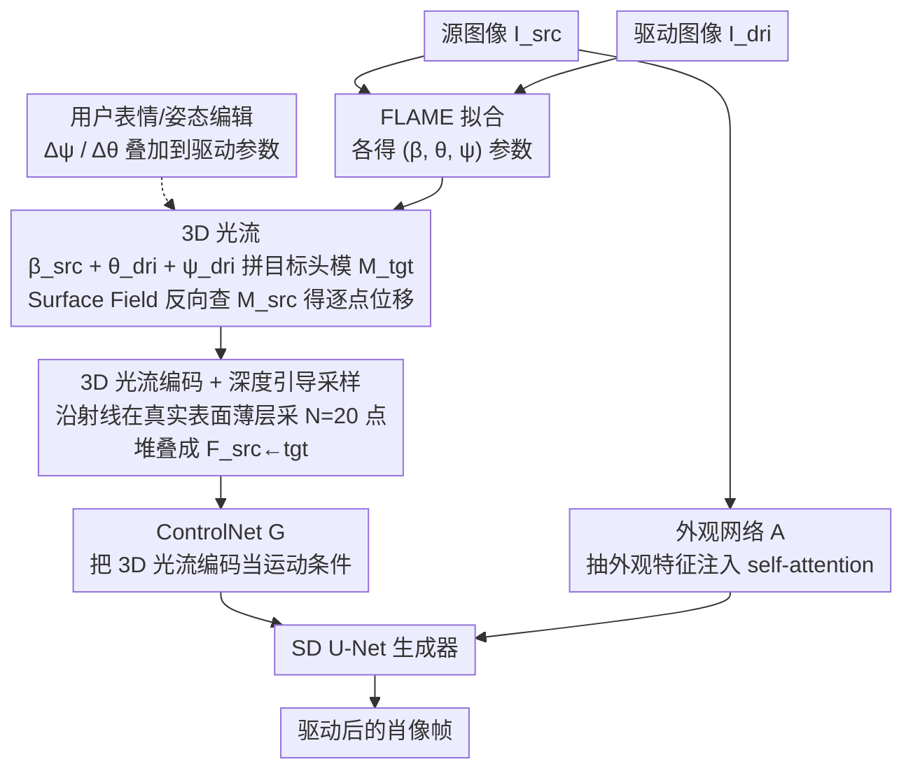

# FG-Portrait: 3D Flow Guided Editable Portrait Animation

**会议**: CVPR 2026  
**arXiv**: [2603.23381](https://arxiv.org/abs/2603.23381)  
**代码**: 无  
**领域**: 扩散模型 / 图像生成  
**关键词**: 肖像动画, 3D光流, 参数化头部模型, 扩散模型, 表情编辑

## 一句话总结

提出 FG-Portrait，通过引入基于 FLAME 参数化 3D 头部模型直接计算的「3D 光流」作为无需学习的几何驱动运动对应关系，结合深度引导采样的 3D 光流编码作为扩散模型 ControlNet 的运动条件，显著提升驱动运动迁移精度（APD 降低 22%+），还支持推理时的表情和头部姿态编辑。

## 研究背景与动机

1. **领域现状**：肖像动画的目标是将驱动肖像的表情和头部姿态迁移到源图像人物上。当前主流方法分两类：(a) 基于扩散模型的方法（X-Portrait、Face-Adapter、HunyuanPortrait），使用驱动图像的 landmark 或 latent 表示作为运动条件；(b) 基于运动场预测的方法（FOMM、EMOPortrait），学习源-驱动之间的密集运动对应关系然后 warp 源特征。
2. **现有痛点**：扩散模型方法只对驱动运动进行条件生成，缺乏源-驱动之间的显式运动对应关系，导致运动迁移不精确（pose/expression 误差较大）。运动场预测方法需要大量数据自监督学习 2D 密集运动，但从 2D 图像估计 3D 运动本质上是不适定问题，在大幅度姿态变化或外观差异大时经常失败。
3. **核心矛盾**：如何在扩散模型框架中引入准确、鲁棒、无需学习的源-驱动运动对应关系？
4. **本文目标** (a) 建立准确的 3D 空间运动对应关系；(b) 将 3D 运动先验有效地编码为扩散模型可用的 2D 条件信号；(c) 支持推理时的用户指定编辑。
5. **切入角度**：FLAME 等参数化 3D 头部模型天然提供逐顶点的语义对应关系——同一个顶点索引在不同姿态/表情下对应同一个面部结构位置。利用这一几何性质可以直接计算无需学习的 3D 位移，作为运动引导。
6. **核心 idea**：用 FLAME 3D 头部模型上的逐点位移（3D flow）替代学习式运动场预测，作为扩散模型 ControlNet 的运动条件，实现准确且可编辑的肖像动画。

## 方法详解

### 整体框架

FG-Portrait 要解决的核心问题是：扩散式肖像动画只把驱动信息当条件喂进去，却没有显式告诉网络「源图像上的某个点应该搬到哪里」，于是大姿态、大表情时运动迁移容易跑偏。它的做法是把这套缺失的「源→目标逐点位移」用一个 3D 参数化头模直接算出来，再编码成扩散模型能吃的 2D 条件。

整篇 pipeline 仍是扩散动画常见的三分支：Stable Diffusion U-Net 当生成器；外观网络 $A$（与 U-Net 同构）从源图像抽外观特征、注入生成器的 self-attention；ControlNet $G$ 负责运动控制。所有改动都集中在第三条分支——把传统的 landmark / 驱动图像换成自家算出的 **3D 光流编码** $F_{src \leftarrow tgt}$ 作为运动条件。训练时 $I_{src}$ 与 $I_{dri}$ 取自同一段视频的两帧，目标是重建 $I_{dri}$。

### 关键设计

**1. 3D 光流：用 FLAME 拓扑对应直接算出源→目标的逐点位移，绕开学习式运动场**

学习式运动场要从 2D 图像里反推 3D 运动，本质是不适定问题，数据一旦不够或姿态变化太大就崩。3D 光流换了个思路：FLAME 的同一个顶点索引在任何姿态/表情下都对应同一处面部结构，这层语义对应是几何自带的，根本不用训练。具体地，先从源、驱动图各自拟合出 FLAME 参数 $(β_{src}, θ_{src}, ψ_{src})$ 和 $(β_{dri}, θ_{dri}, ψ_{dri})$，再用「源身份形状 $β_{src}$ + 驱动姿态 $θ_{dri}$ + 驱动表情 $ψ_{dri}$」拼出目标头模 $M_{tgt}$。接着用 Surface Field（SF）函数在 $M_{tgt}$ 与 $M_{src}$ 间查逐点对应：给定目标点 $p_{tgt}$，找到源侧对应点 $p_{src} = \text{SF}(p_{tgt}; M_{tgt}, M_{src})$，于是 3D 光流就是

$$f_{src \leftarrow tgt} = p_{src} - p_{tgt}.$$

注意这里是**反向搜索**（从目标查回源），这样每个目标像素都保证能找到对应点，不会出现空洞。因为不依赖外观、只看几何拓扑，外观差异再大、姿态再夸张，这个对应也稳。

**2. 3D 光流编码 + 深度引导采样：把 3D 位移摊成 2D 条件图，但只在真实表面附近采样**

3D 光流活在三维空间，ControlNet 却只认 2D 张量，所以要把它「拍扁」。做法是：对目标图每个像素 $(u,v)$ 沿反投影射线采 $N=20$ 个 3D 点 $p_{tgt}^n = H[d_n(K^{-1}q_{tgt})^\top, 1]^\top$，逐点查 3D flow 再堆叠，得到 $F_{src \leftarrow tgt} \in \mathbb{R}^{H \times W \times 3N}$ 送进 ControlNet。

关键在于射线上的 $N$ 个点采在哪。如果沿整条射线均匀采，多数点会落在离实际表面很远的地方，查出来的 flow 跟这个像素真正的 2D 运动对不上。深度引导采样先渲染目标头模的深度图 $\tilde{D}_{tgt} = \text{Render}(M_{tgt}; H, K)$，对头部区域的像素只在 $[\tilde{D}_{tgt}[u,v] - \delta,\ \tilde{D}_{tgt}[u,v] + \delta]$（$\delta = 0.01m$）这一薄层里采样，非头部区域才退回预定义范围 $[d_{near}, d_{far}]$。这样采样点紧贴真实表面，编码出的 flow 才忠实反映 2D 运动——这一步是整套方法的命门：去掉它 APD 会从 2.682 飙到 9.659，加回来才降下来。

**3. 用户指定的表情与姿态编辑：因为运动条件全由参数驱动，编辑天然免费**

传统扩散动画只能吞一张驱动图，想精确改某个表情强度或转头角度无从下手。FG-Portrait 的运动条件完全长在 FLAME 参数上，所以推理时用户给一个表情增量 $\Delta\psi_{usr}$ 或姿态增量 $\Delta\theta_{usr}$，直接叠到驱动参数上 $\psi_{dri} \leftarrow \psi_{dri} + \Delta\psi_{usr}$，重算 $M_{tgt}$ 和对应的 3D flow 编码即可，整个过程前馈、即时、无需任何额外训练。

### 损失函数 / 训练策略

使用标准扩散模型去噪损失 $\mathcal{L} = \mathbb{E}_{z_0,c,\epsilon,t}[\|\epsilon - U(z_t, t, c)\|_2^2]$。使用 SD 1.5 作为骨干，冻结其权重。外观网络初始化自 X-Portrait，ControlNet 的额外输入层随机初始化。AdamW 优化器，学习率 $1e^{-5}$。训练完图像扩散管线后，插入时间层并在视频序列上微调以实现时间一致性。训练数据为 VFHQ 数据集中采样的 1K 视频。

## 实验关键数据

### 主实验

VFHQ 自重演（self-reenactment）512×512：

| 方法 | LPIPS↓ | CSIM↑ | APD↓ | AED↓ |
|------|--------|-------|------|------|
| EMOPortrait | 0.235 | 0.729 | 3.047 | 0.371 |
| X-Portrait | 0.195 | 0.777 | 3.660 | 0.357 |
| Follow-Your-Emoji | 0.162 | 0.774 | 3.570 | 0.402 |
| HunyuanPortrait | 0.162 | 0.781 | 3.440 | 0.341 |
| **Ours** | **0.158** | **0.807** | **2.682** | **0.327** |

VFHQ 交叉重演（cross-reenactment）：

| 方法 | FID↓ | CSIM↑ | APD↓ | AED↓ |
|------|------|-------|------|------|
| EMOPortrait | 100.6 | 0.386 | 7.860 | 0.660 |
| Face-Adapter | 94.6 | 0.424 | 7.785 | 0.688 |
| HunyuanPortrait | 92.7 | 0.455 | 9.220 | 0.658 |
| **Ours** | **87.0** | 0.462 | **7.764** | **0.652** |

FFHQ 跨数据集泛化：FID 99.4（最优），APD 9.297（最优），AED 0.714（最优）。

### 消融实验

运动条件对比（Tab. 4）：

| 运动条件 | S-APD↓ | S-AED↓ | C-APD↓ | C-AED↓ |
|----------|--------|--------|--------|--------|
| 驱动 Landmark | 4.001 | 0.373 | 8.588 | 0.688 |
| 预测光流 | 4.232 | 0.384 | 12.430 | 0.778 |
| **Ours (3D Flow)** | **2.682** | **0.327** | **7.764** | **0.652** |

深度引导采样消融（Tab. 5）：

| 配置 | LPIPS↓ | CSIM↑ | APD↓ | AED↓ |
|------|--------|-------|------|------|
| w/o Depth（均匀采样） | 0.213 | 0.770 | 9.659 | 0.730 |
| **w/ Depth** | **0.158** | **0.807** | **2.682** | **0.327** |

超参数消融：$N=20$ 和 $\delta=0.01m$ 在多种配置下表现稳定，$N=10$ 性能略降。

### 关键发现

- **3D Flow 对运动迁移的提升是决定性的**：与 landmark 条件相比 APD 降低 33%（4.001→2.682），与预测光流相比 APD 降低 37%。这证明了几何驱动、无需学习的运动对应的巨大优势。
- **深度引导采样是 3D Flow 编码的关键**：没有深度引导时 APD 高达 9.659，加入后降至 2.682，改善约 72%。说明在正确的 3D 位置查询 flow 至关重要。
- 在 cross-reenactment 中，CSIM 略低于 Follow-Your-Emoji（0.462 vs 0.484），这是合理的 tradeoff：更准确的运动迁移必然导致身份保持和运动精度之间的权衡。
- 时间一致性（FVD）为 412.1，仅次于 Follow-Your-Emoji（382.6），说明模型在时间连贯性上也很有竞争力。

## 亮点与洞察

- **无需学习的 3D 运动对应关系**是本文最大的创新：FLAME 的拓扑对应直接提供 per-vertex 的语义匹配，不需要自监督训练、不受数据量限制、在极端姿态下依然鲁棒。这个思路可以迁移到人体动画（用 SMPL）或手部动画等任何有参数化模型的领域。
- **将 3D 信息编码为 2D 条件信号**的方式很巧妙：通过沿射线采样多个 3D 点的 flow 并堆叠，既保留了 3D 信息又兼容了 2D 扩散模型的输入格式。深度引导进一步聚焦有效区域。
- 支持推理时参数级编辑是显著的实用优势——用户可以精确控制表情强度和头部旋转角度，这在大多数扩散动画方法中不可能做到。

## 局限与展望

- FLAME 模型的网格分辨率有限，可能难以表征精细表情（如微表情、皱纹变化），作者在 Limitation 中也承认了这一点。
- 模型仅在真人肖像上训练，对卡通/二次元角色效果不佳（眼睑闭合伪影等），需要在卡通数据上微调。
- 使用 SD 1.5 作为骨干相对较旧，升级到更先进的 DiT（如 SD3、FLUX）可能进一步提升质量。
- FLAME fitting 的质量直接影响 3D flow 的准确性，在遮挡或极端光照下 fitting 可能不准确。

## 相关工作与启发

- **vs X-Portrait**: X-Portrait 用驱动图像本身作为运动条件，隐含希望模型自己学习运动对应关系。但在大姿态变化时失败（APD 3.660 vs 2.682）。FG-Portrait 显式提供几何引导，大幅降低学习难度。
- **vs HunyuanPortrait**: HunyuanPortrait 使用更强的 DiT 骨干和视频扩散模型，但在运动精度上仍不及 FG-Portrait（APD 3.440 vs 2.682），说明运动条件的设计比骨干模型更重要。
- **vs EMOPortrait**: EMOPortrait 是基于学习运动场的代表，使用 GAN 而非扩散模型。在运动精度和图像质量上都被 FG-Portrait 大幅超越，验证了学习式方法在泛化性上的局限。

## 评分

- 新颖性: ⭐⭐⭐⭐⭐ 3D flow 作为无需学习的运动对应是非常优雅的创新，深度引导采样的编码方式也很新颖
- 实验充分度: ⭐⭐⭐⭐ 自重演和交叉重演两种设置，VFHQ 和 FFHQ 两个数据集，详细消融
- 写作质量: ⭐⭐⭐⭐⭐ 问题动机清晰、方法描述简洁优雅、图示非常直观
- 价值: ⭐⭐⭐⭐⭐ 为肖像动画提供了新的运动引导范式，3D flow 思路可广泛迁移

<!-- RELATED:START -->

## 相关论文

- [\[CVPR 2025\] MVPortrait: Text-Guided Motion and Emotion Control for Multi-View Vivid Portrait Animation](../../CVPR2025/image_generation/mvportrait_text-guided_motion_and_emotion_control_for_multi-view_vivid_portrait_.md)
- [\[CVPR 2026\] Say Cheese! Detail-Preserving Portrait Collection Generation via Natural Language Edits](say_cheese_detail-preserving_portrait_collection_generation_via_natural_language.md)
- [\[CVPR 2026\] ExpPortrait: Expressive Portrait Generation via Personalized Representation](expportrait_expressive_portrait_generation_via_personalized_representation.md)
- [\[CVPR 2026\] 3D Space as a Scratchpad for Editable Text-to-Image Generation](3d_space_as_a_scratchpad_for_editable_text-to-image_generation.md)
- [\[CVPR 2026\] POLAR: A Portrait OLAT Dataset and Generative Framework for Illumination-Aware Face Modeling](polar_a_portrait_olat_dataset_and_generative_framework_for_illumination-aware_fa.md)

<!-- RELATED:END -->
