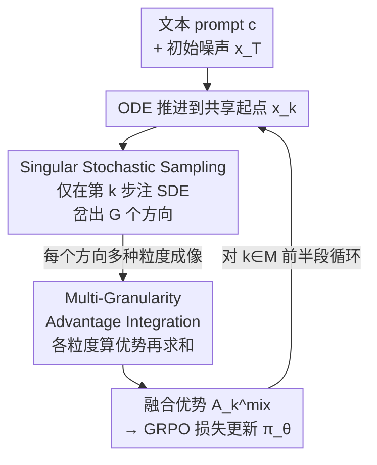

# Fine-Grained GRPO for Precise Preference Alignment in Flow Models

**会议**: CVPR 2026  
**论文**: [CVF Open Access](https://openaccess.thecvf.com/content/CVPR2026/html/Zhou_Fine-Grained_GRPO_for_Precise_Preference_Alignment_in_Flow_Models_CVPR_2026_paper.html)  
**代码**: https://bujiazi.github.io/g2rpo.github.io/ (项目页)  
**领域**: 扩散模型 / 对齐RLHF  
**关键词**: GRPO, 流模型对齐, 稀疏奖励, 信用分配, 多粒度去噪

## 一句话总结
G²RPO（Granular-GRPO）把 flow 模型 GRPO 训练里"每步都注入 SDE 噪声、再把终点奖励均摊回每步"的稀疏奖励范式，改成"只在单步注入随机、其余步骤走确定性 ODE"，并对同一去噪方向用多种去噪粒度算优势再融合，从而给每个采样方向打出更准、更全面的奖励信号，在 Flux.1-dev 上把 HPS、ImageReward、Unified Reward 等多个 in-/out-domain 指标都刷过了 DanceGRPO 和 MixGRPO。

## 研究背景与动机
**领域现状**：把在线 RL（尤其是 GRPO）接到扩散 / flow 生成模型上做人类偏好对齐，是近期的主流路线。GRPO 不需要单独的 value 模型，靠一组样本的相对优势就能更新策略。要让确定性的 flow matching 模型产生"一组不同的去噪方向"供 GRPO 比较，Flow-GRPO、DanceGRPO 的做法是把 ODE 采样器替换成等价的 SDE：在**每一个**去噪步都注入随机噪声 $\sigma_t dw_t$，从而扰动去噪方向。

**现有痛点**：这种"全程注入随机"的做法带来两个核心问题。其一是**稀疏奖励**：奖励模型只在最终图像 $x_0$ 上打一个分，然后把这个终点优势 $A_0^i$ **均匀广播**给该轨迹上的每一步 $A_t^i$。但终点奖励要等整条决策链走完才出现，根本没法把它归因到中间某一步具体注入的噪声，信用分配链条被打断，训练慢且不稳。其二是**评估不完整**：现有方法把每个去噪方向**死绑在一个固定的去噪步数**上，于是一组样本只在单一粒度下成像、打分。可同一个 SDE 方向在不同去噪间隔下成像，细节会变、分数会抖，单一粒度的打分不足以判断这个方向到底好不好。

**核心矛盾**：SDE 探索要"广"（每步都扰动才能充分探索），但奖励归因要"准"（噪声和奖励必须强相关才能精确更新）——全程注入随机让探索变广的同时，彻底牺牲了归因精度；而固定粒度成像又让"一个方向的真实价值"被某一次去噪间隔的偶然性绑架。

**核心 idea**：与其让随机性弥散到整条轨迹，不如**把随机性收束到单独一步**（其余步走确定性 ODE），让这一步注入的噪声成为组内奖励方差的唯一来源，从而把终点奖励精确归因到这一步；再对这一步采出的方向用**多种去噪粒度**分别成像、各算优势、求和融合，得到对该方向更鲁棒的综合评价。

## 方法详解

### 整体框架
G²RPO 仍然沿用 flow-based GRPO 的骨架：把去噪过程建模成多步 MDP，状态 $s_t=(c,t,x_t)$，动作 $a_t$ 是从 $x_t$ 到 $x_{t-1}$ 的单步去噪方向；用一组样本算组内相对优势来更新策略 $\pi_\theta$。它在两个地方改造了采样与优势计算：

1. **采样阶段**——给定文本 prompt $c$ 和同一份初始噪声 $x_T$，先用确定性 ODE 把噪声推进到某个选定步 $k$，得到组内**共享的起点** $x_k$；只在这一步 $x_k$ 上做 SDE 采样，岔出 $G$ 个不同的去噪方向 $\{x_{k-1}^i\}_{i=1}^G$；这之后又全部切回 ODE 把它们各自走完。这样组内奖励的差异完全来自第 $k$ 步注入的随机，归因是干净的。
2. **优势阶段**——对每个方向 $x_{k-1}^i$，不只按常规粒度走完 $k-1$ 步，而是用一组缩放因子 $\Lambda=\{\lambda_1,\dots,\lambda_J\}$ 做**间隔采样**，生成多种粒度下的成像，分别打分算优势，再把不同粒度的优势求和成 $A_k^{i,\mathrm{mix}}$，作为该方向的最终评价喂进 GRPO 损失。

整条流程对 $k$ 在选定的时间步集合 $M$（去噪前半段）上循环，每个 $k$ 都产出一组带多粒度融合优势的样本用于一次策略更新。

### 关键设计

**1. Singular Stochastic Sampling：把随机性收束到单步，换来干净的信用分配**

针对"全程注入随机 → 终点奖励无法归因到某一步"的痛点，这一设计反其道而行：对要优化的某个时间步 $k$，组内所有样本先用确定性 ODE（式 $dx_t=v_\theta(x_t,t)dt$）从 $x_T$ 推到**同一个起点** $x_k$；只在 $x_k$ 这一步切换成 SDE 采样（Euler–Maruyama 离散化，注入 $\sigma_t\sqrt{\Delta t}\,\epsilon$，其中 $\sigma_t=\eta\sqrt{t/(1-t)}$），岔出 $G$ 个不同的下一状态 $\{x_{k-1}^i\}$；此后再全部走 ODE 直到 $x_0$。由于除了第 $k$ 步外全是确定性的，组内奖励 $\{R(x_{0\leftarrow k}^i,c)\}$ 的方差**完全由第 $k$ 步注入的随机决定**，于是可以算出一个步对齐的、精确的优势：

$$A_k^i=\frac{R(x_{0\leftarrow k}^i,c)-\mathrm{mean}(\{R(x_{0\leftarrow k}^i,c)\})}{\mathrm{std}(\{R(x_{0\leftarrow k}^i,c)\})}$$

与旧方法把终点优势 $A_0^i$ 无差别广播给每一步不同，这里每一步 $k$ 的优势就是对"这一步噪声好不好"的直接度量，奖励与噪声之间建立了因果上的稠密对应。选哪些 $k$ 来优化？作者取去噪**前半段** $M=\{T,T-1,\dots,\lfloor T/2\rfloor\}$——早期步 SDE 探索空间更大、决定整条去噪链走向，后期步 GRPO 收益较小，只在前半段训练还顺带省了算力。一个实现上的便宜：因为组内共享起点 $x_k$，这 $G$ 个样本可以复用同一个 ODE 方向 $v_k$ 来算重要性比率 $r_k^i(\theta)$，进一步提升训练效率。

**2. Multi-Granularity Advantage Integration（MGAI）：用多种去噪粒度交叉评估同一方向，去掉粒度偏置**

即便把随机收束到单步，作者观察到一个新问题（Fig. 3）：在相同 $x_k$、相同 prompt 下，同一个 SDE 方向只是因为后续去噪**间隔不同**，成像的细节纹理就会变，奖励模型给的分随之抖动，进而扭曲组内优势甚至优化方向。也就是说"单一粒度"打出的分对一个方向的真实价值并不鲁棒。MGAI 的做法是：对第 $k$ 步岔出的每个方向 $x_{k-1}^i$，不再绑定一种粒度，而是用一组整数缩放因子 $\Lambda=\{\lambda_1,\dots,\lambda_J\}$ 做间隔采样——每隔 $\lambda_j$ 步采一个点，去噪时间步序列写作

$$S_j=\Big\{1,\,1+\lambda_j,\,1+2\lambda_j,\,\dots,\,\big\lfloor\tfrac{k-1}{\lambda_j}\big\rfloor\lambda_j\Big\}$$

$\lambda_j$ 越大粒度越粗。这样每个方向都成出 $J$ 张不同粒度的图，分别从奖励模型拿到分、各算组内优势 $A_k^{i,j}$，再**直接求和**融合成多粒度优势：

$$A_k^{i,\mathrm{mix}}=\sum_{j}^{J}A_k^{i,j}$$

这个"求和"借鉴了 DanceGRPO 里多奖励模型（如 HPS-v2.1 + CLIP）优势直接相加的做法——把多个维度的相对评价叠起来，得到对单个方向更全面的判断。最终 GRPO 目标里把每步优势换成 $A_k^{i,\mathrm{mix}}$：

$$f=\frac{1}{G}\sum_{i=1}^{G}\frac{1}{K}\sum_{k\in M}\min\!\big(r_k^i(\theta)A_k^{i,\mathrm{mix}},\,\mathrm{clip}(r_k^i(\theta),1-\varepsilon,1+\varepsilon)A_k^{i,\mathrm{mix}}\big)$$

效果上，多粒度融合让"一个真正好的去噪方向"在不同粒度下都保持组内领先，评价更鲁棒，尤其改善了 LLM 增强的 Unified Reward 这类 out-of-domain 指标。

### 损失函数 / 训练策略
沿用 GRPO 的 clipped surrogate 目标（式上方 $f$），KL 系数 $\beta=0$（与 DanceGRPO / MixGRPO 一致，为训练稳定）。Backbone 为 Flux.1-dev，prompt 数据集 HPSv2（10.37 万训练 / 400 测试）。采样阶段：共享初始噪声生成 $G=12$ 张图，总步数 $T=16$，优势 clip $\varepsilon=5$，噪声水平 $\eta=0.7$，粒度集 $\Lambda=\{1,2,3\}$。训练用 16×H200，batch size 1，AdamW，学习率 $2\times10^{-6}$、weight decay $1\times10^{-4}$，bf16 混合精度。

## 实验关键数据

### 主实验
两种训练设置：①只用 HPS-v2.1（验证 in-domain 上限，但易 reward hacking）；②HPS-v2.1 + CLIP 联合训练（更稳健）。评测用 HPS、CLIP、PickScore(PS)、ImageReward(IR)、Unified Reward(UR) 多维奖励模型，其中后几个对训练设置②而言是 out-of-domain。

| 训练奖励 | 方法 | HPS | CLIP | PS | IR | UR |
|---------|------|-----|------|----|----|----|
| — | Flux.1-dev (base) | 0.305 | 0.388 | 0.226 | 1.040 | 3.621 |
| HPS | DanceGRPO | 0.353 | 0.375 | 0.228 | 1.233 | 3.548 |
| HPS | MixGRPO | 0.378 | 0.358 | 0.225 | 1.266 | 3.421 |
| HPS | G²RPO w/o MGAI | 0.376 | 0.351 | 0.228 | 1.286 | 3.469 |
| HPS | **G²RPO** | **0.385** | 0.355 | 0.229 | **1.313** | 3.487 |
| HPS&CLIP | DanceGRPO | 0.331 | 0.389 | 0.227 | 1.128 | 3.569 |
| HPS&CLIP | MixGRPO | 0.363 | 0.399 | 0.230 | 1.436 | 3.661 |
| HPS&CLIP | G²RPO w/o MGAI | 0.372 | 0.395 | 0.234 | 1.421 | 3.688 |
| HPS&CLIP | **G²RPO** | 0.376 | **0.406** | **0.235** | **1.483** | **3.783** |

只用 HPS 训练时，仅 Singular Stochastic Sampling（w/o MGAI）相对 DanceGRPO 的 HPS 就有 6.52% 的相对提升，说明把随机收束到单步确实给出了更精确的优化信号；但单 HPS 会 reward hacking，拖累其它 out-of-domain 分。在 HPS&CLIP 联合设置下，完整 G²RPO 在 in-/out-domain 指标上整体领先，尤其 UR（LLM 增强）从 MixGRPO 的 3.661 提到 3.783。

### 消融实验：去噪粒度集 $\Lambda$（HPS&CLIP 训练）
| $\Lambda$ | HPS | CLIP | PS | IR | UR |
|-----------|-----|------|----|----|----|
| {1} (即 w/o MGAI) | 0.372 | 0.395 | 0.234 | 1.421 | 3.688 |
| {1,2} | 0.375 | 0.404 | 0.234 | 1.468 | 3.759 |
| {1,3} | 0.378 | 0.404 | 0.234 | 1.465 | 3.760 |
| {1,2,3} | 0.376 | **0.406** | **0.235** | **1.483** | **3.783** |

粒度越多，对每个采样方向的评估越全面，IR / UR 等指标稳步上升；HPS 在 {1,3} 略高于 {1,2,3}，但综合（CLIP/PS/IR/UR）以 {1,2,3} 最佳，故主实验取之。

### 不同推理步数的鲁棒性（HPS&CLIP 训练）
| 推理步数 | 方法 | HPS | CLIP | PS | IR | UR |
|---------|------|-----|------|----|----|----|
| 10 | MixGRPO | 0.358 | 0.401 | 0.230 | 1.431 | 3.641 |
| 10 | **G²RPO** | **0.378** | **0.408** | **0.235** | **1.519** | **3.805** |
| 20 | MixGRPO | 0.363 | 0.401 | 0.230 | 1.430 | 3.651 |
| 20 | **G²RPO** | **0.376** | **0.407** | **0.235** | **1.511** | **3.806** |

把总推理步数压到 20 甚至 10 步，G²RPO 仍全面领先，说明 MGAI 的多粒度评估让模型对去噪步数配置更鲁棒。

### 关键发现
- **MGAI 主要补的是 out-of-domain 泛化**：对比 w/o MGAI 与完整版，IR（1.421→1.483）、UR（3.688→3.783）这类训练时没见过的奖励涨得最明显，印证"多粒度交叉评估能去掉单一粒度的偶然偏置"。
- **Singular Stochastic Sampling 单独就很能打**：仅这一项在 in-domain HPS 上就 +6.52%（相对 DanceGRPO），说明稀疏奖励/信用分配是 flow-GRPO 的主要瓶颈。
- **单奖励训练会 hacking**：只优化 HPS 会把 CLIP/UR 等拖到比 baseline 还低（如 MixGRPO UR 3.421 < base 3.621），印证作者用 HPS&CLIP 联合训练做主设置的必要性。

## 亮点与洞察
- **把"探索广度"和"归因精度"解耦**：旧方法默认"要探索就得每步注随机"，本文指出探索其实只需一步随机即可在组内拉开差异，其余步走 ODE 反而让奖励-噪声因果干净。这个"收束随机性"的思路对任何序列决策的 RL 信用分配都有迁移价值。
- **多粒度优势求和"白嫖"多奖励融合的成熟做法**：把"不同去噪粒度的优势"类比成"不同奖励模型的优势"，直接相加即可，无需新设计聚合器，工程上极简。
- **共享起点带来的效率红利很巧**：组内复用同一个 $v_k$ 算重要性比率，把单步 SDE 的额外开销摊薄。
- ⚠️ "整体相位/布局连贯 + 细节保真同时提升"主要来自定性观察（Fig. 4）与 reward 分数，缺乏独立的几何/文本对齐定量指标，结论以原文为准。

## 局限与展望
- **粒度集 $\Lambda$ 是人工设定的超参**：{1,2,3} 经验最优，但不同 backbone / 步数下最优粒度可能不同，且粒度数越多采样成本越高（每方向要多成 $J$ 张图），论文未给出成本-收益曲线。
- **只在前半段 $M$ 优化**：基于"早期步更重要"的经验假设，对所有任务是否成立、后半段细节调整是否被忽略，缺少对照。
- **只验证了 T2I 与 Flux.1-dev**：是否迁移到视频 flow 模型、是否对更弱的 backbone 同样有效未知。
- **单步 SDE 是否限制了探索多样性**：把随机收束到一步换来归因精度，但也可能缩小了可达去噪轨迹空间，论文未直接分析这个 trade-off。

## 相关工作与启发
- **vs DanceGRPO / Flow-GRPO**：它们把 ODE 全程转 SDE、每步注随机、终点奖励均摊回每步。本文只在单步注随机、其余走 ODE，把奖励精确归因到该步——同样是 GRPO，但信用分配从"稀疏广播"变成"稠密对齐"，且额外加了多粒度评估。
- **vs MixGRPO**：MixGRPO 用混合 ODE-SDE 采样提升训练效率、性能相当；本文不止追效率，而是直击"评估每个采样方向是否精确/全面"，在多数指标上反超 MixGRPO，且在 10/20 步低预算下优势更明显。
- **vs Diffusion-DPO**：DPO 路线直接从成对偏好数据优化、绕开显式奖励模型，但不采新样本、有分布漂移问题；本文是在线 RL，持续采样新方向，靠组内相对优势更新。

## 评分
- 新颖性: ⭐⭐⭐⭐ "单步注随机 + 多粒度优势融合"两个点切中 flow-GRPO 的稀疏奖励与单一粒度评估，角度清晰且此前未被组合提出。
- 实验充分度: ⭐⭐⭐⭐ 5 个奖励模型、in/out-domain、粒度消融、10/20 步鲁棒性都覆盖了；但仅单 backbone、缺成本分析。
- 写作质量: ⭐⭐⭐⭐ 问题诊断（稀疏奖励 / 评估不完整）与方法对应清楚，公式与算法完整。
- 价值: ⭐⭐⭐⭐ 即插即用地改进 flow 模型 RLHF，对偏好对齐社区有直接参考价值。

<!-- RELATED:START -->

## 相关论文

- [\[CVPR 2026\] Stepwise-Flow-GRPO：给流匹配模型的去噪步逐步分配信用](stepwise_credit_assignment_for_grpo_on_flow-matching_models.md)
- [\[CVPR 2026\] CogniEdit: Dense Gradient Flow Optimization for Fine-Grained Image Editing](cogniedit_dense_gradient_flow_optimization_for_fine-grained_image_editing.md)
- [\[CVPR 2026\] BeautyGRPO: Aesthetic Alignment for Face Retouching via Dynamic Path Guidance and Fine-Grained Preference Modeling](beautygrpo_aesthetic_alignment_for_face_retouching_via_dynamic_path_guidance_and.md)
- [\[CVPR 2026\] Towards Fine-Grained Attribution: Instance-Aware Preference Optimization for Aligning Diffusion Models](towards_fine-grained_attribution_instance-aware_preference_optimization_for_alig.md)
- [\[CVPR 2026\] Neighbor GRPO: Contrastive ODE Policy Optimization Aligns Flow Models](neighbor_grpo_contrastive_ode_policy_optimization_aligns_flow_models.md)

<!-- RELATED:END -->
