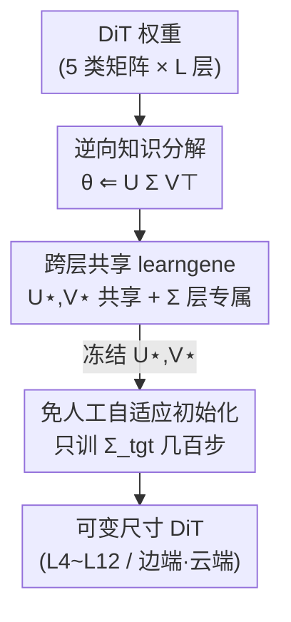

# FINE: Factorizing Knowledge for Initialization of Variable-sized Diffusion Models

**会议**: CVPR 2026  
**论文**: [CVF Open Access](https://openaccess.thecvf.com/content/CVPR2026/html/Xie_FINE_Factorizing_Knowledge_for_Initialization_of_Variable-sized_Diffusion_Models_CVPR_2026_paper.html)  
**代码**: 无  
**领域**: 扩散模型 / 图像生成 / 模型初始化  
**关键词**: 扩散模型初始化, learngene, 权重分解, 可变尺寸模型, DiT  

## 一句话总结
FINE 是一种扩散模型的预训练方法：它把每层权重写成 $U_\star \Sigma^{(l)}_\star V_\star^\top$，让跨层共享的奇异向量 $U_\star, V_\star$（称作 learngene）承载与尺寸无关的知识，只用层专属的奇异值 $\Sigma^{(l)}_\star$ 适配各层——于是面对任意目标尺寸时，只需冻结 learngene、轻量重训 $\Sigma$（约 0.3K 步 vs. 300K 步全量预训练）就能直接初始化，在 ImageNet 可变深度 DiT 上 FID 最多降低 4.89。

## 研究背景与动机
**领域现状**：扩散模型训练成本极高，所以"预训练 + 复用"是主流。但真实部署的硬件（手机、边端、云端）显存和算力各不相同，需要**多种尺寸**的模型；而官方发布的预训练权重往往只有 DiT-B / DiT-L / DiT-XL 等少数固定档位。

**现有痛点**：当部署需要的尺寸恰好没有对应预训练版本时，要么从头训练（昂贵），要么用 PEFT / 蒸馏 / 剪枝去硬凑——这些方法要么强依赖某个已有的预训练 backbone、无法灵活换尺寸，要么每换一个尺寸就要重新蒸馏一遍，成本随模型数量线性膨胀。

**核心矛盾**：现有 Learngene 类方法虽然提出"把可复用、与尺寸无关的知识封装成 learngene"，但它们大多是**启发式、按层挑选**的——从预训练模型里手动抠出某几层堆叠成目标模型。这种"层隔离"设计忽略了扩散模型的本质：去噪过程在不同噪声水平、不同层之间存在**强烈的跨层依赖与时序耦合**，靠手工挑层、刚性堆叠极易破坏这种层间一致性。

**本文目标**：能不能预训练出**一个统一模型**，它的知识可以被灵活分解成与尺寸无关的基本单元，从而直接初始化任意尺寸的扩散模型，不必为每个尺寸重复预训练？

**切入角度**：作者观察到 Transformer 由配置相同的 block 堆叠而成，其中存在"不随深度变化"的 size-agnostic 知识（已有工作在 ViT 上发现过对角模式、层间线性相关等）。FINE 把这一观察迁移到 DiT，并把"与尺寸无关的知识"具体落地为：**权重矩阵中跨层共享的奇异向量**。

**核心 idea**：用一个形如 SVD 的分解 $W^{(l)}_\star = U_\star \Sigma^{(l)}_\star V_\star^\top$ 来重构权重，但**反过来做**——不是对已训好的权重做 SVD，而是先定义跨层共享的 $U_\star, V_\star$（learngene）和层专属的 $\Sigma^{(l)}_\star$，再联合训练；换尺寸时只动 $\Sigma$。

## 方法详解

### 整体框架
FINE 把"训练一个可分解知识的模型"和"为新尺寸初始化"拆成两个阶段。**阶段一（知识分解）是一次性成本**：在 ImageNet 上预训练时，不直接优化常规全参数 $\theta$，而是把每层权重约束为共享奇异向量与层专属奇异值的乘积，联合训练 $U, V, S$，得到一组与尺寸无关的 learngene。**阶段二（模型初始化）是廉价的**：对任意目标尺寸 $\theta_{\text{tgt}}$，冻结 learngene $U, V$，只随机初始化并轻量训练层专属的 $\Sigma_{\text{tgt}}$，几百步即可收敛，随后即可正常训练或部署。

DiT 每层包含 MSA 与 PFF 两个模块，FINE 对五类权重矩阵 $T=\{qkv, o, in, out, adaLN\}$ 分别建立共享分解：同一类型的所有层共享一对 $U_\star, V_\star$，各层只有自己的 $\Sigma^{(l)}_\star$。

### 关键设计

**1. 逆向知识分解：把"对权重做 SVD"反过来变成"用共享因子重构权重"**

痛点在于：KIND、SVDiff 这类方法对**已训练好**的权重逐层独立做 SVD，得到的奇异向量是层专属的、彼此不协调，无法跨层共享，也就谈不上跨尺寸复用。FINE 改成反向流程——不去分解现成权重，而是先声明一组待学习的共享奇异向量 $U_\star \in \mathbb{R}^{m_1\times r}$、$V_\star \in \mathbb{R}^{r\times m_2}$ 和层专属对角阵 $\Sigma^{(l)}_\star = \mathrm{diag}(\sigma)$，再用它们**重构**每层权重：

$$W^{(l)}_\star \Leftarrow U_\star \Sigma^{(l)}_\star V_\star^\top$$

这里 $\Leftarrow$ 特意区别于 SVD 的 $=$，强调"分解是一个反向、被构造出来的过程"。把全部层、全部类型汇总后简记为 $\theta = U S V^\top$，预训练目标就是在这个约束下最小化扩散去噪损失：

$$\arg\min_{U,S,V} \; \mathcal{L}\big(\varepsilon_\theta(z_t,t,c),\,\varepsilon\big), \quad \text{s.t.}\; \theta = U S V^\top$$

注意损失只更新 $U, V, S$ 三组因子，而 $\theta$ 在每次迭代时按上式被"重构"出来再前向——这样梯度天然地流回共享因子，迫使 $U, V$ 学到能被所有层复用的结构。这就是 FINE 能产出"可分解知识"的根本机制：知识从一开始就被组织成共享 + 专属两层结构，而非事后硬拆。

**2. 跨层共享 learngene：用 $U_\star, V_\star$ 承载 size-agnostic 知识，$\Sigma^{(l)}_\star$ 承载层间差异**

这是 FINE 区别于以往 learngene 方法的核心。以往方法是"层隔离"的——挑某几层当 learngene，丢掉了层间依赖；而扩散去噪恰恰要求跨层语义一致性。FINE 让同一类型矩阵的**所有层共享同一对** $U_\star, V_\star$（例如 $W^{(1\sim L)}_{qkv}$ 共用一个 $U_{qkv}, V_{qkv}$），把"不随深度变化的知识"显式压进这对共享奇异向量里；每层只保留一个轻量的 $\Sigma^{(l)}_\star$ 去微调这个共享表示以适配本层。

这样做的好处有两层：其一，共享 $U, V$ 自然编码了跨层的协调性，避免手工堆层导致的层间错位；其二，因为 $U, V$ 与尺寸无关，目标模型不管要几层、宽多少，都能从这同一组 learngene 里"重组"出来。论文把 $U, V$ 类比成生物学里可遗传的基因片段，把"换尺寸"变成"重组同一套基因"，而非"重新训一套权重"。作者还通过 PCA 可视化发现 $\Sigma^{(l)}_\star$ 在不同层之间近似**线性排布**、且小模型的层能对齐到大模型的对应段（如 L4 的第 1 层对应 L8 的前两层），印证了这套共享结构跨尺度的连贯性。

**3. 免人工的自适应初始化：换尺寸只训练层专属 $\Sigma$，几百步收敛**

以往 learngene 初始化要靠人工规则把层堆起来，主观且通用性差，在扩散模型里更因层间交互动态变化而容易破坏一致性。FINE 把这一步改成**数据驱动、无需人工**：给定目标模型 $\theta_{\text{tgt}}$，冻结共享的 $U, V$，把层专属奇异值 $\Sigma_{\text{tgt}}$ 随机初始化后，仅优化它：

$$\arg\min_{\Sigma_{\text{tgt}}} \; \mathcal{L}\big(\varepsilon_{\theta_{\text{tgt}}}(z_t,t,c),\,\varepsilon\big), \quad \text{s.t.}\; \theta_{\text{tgt}} = U \Sigma_{\text{tgt}} V^\top$$

由于 $\Sigma$ 是对角阵、参数量极少，构成一个**紧致参数空间**，可以用很少的数据和很少的梯度步（论文称约 0.3K 步，对比全量预训练的 300K 步）就完成适配。$\Sigma$ 训完即初始化完成，模型随后可在无约束下继续训练或直接部署。相比规则式初始化（identical / linear），可训练的 $\Sigma$ 能针对每个尺寸做定制化适配，从而把 learngene 的通用性"翻译"成针对具体尺寸的最优起点。

### 损失函数 / 训练策略
两个阶段都复用潜空间扩散的标准去噪损失 $\mathcal{L} = \mathbb{E}_{z,c,\varepsilon,t}\big[\lVert \varepsilon - \varepsilon_\theta(z_t,c,t)\rVert_2^2\big]$，区别仅在于**优化哪些变量、加什么约束**：阶段一在 $\theta=USV^\top$ 约束下联合更新 $U,S,V$；阶段二冻结 $U,V$ 只更新 $\Sigma_{\text{tgt}}$。骨干为 DiT-B / DiT-L，patch size = 2，256×256 分辨率，知识分解阶段在 ImageNet-1K 上训练 300K 步、batch 64、学习率 $1\times10^{-4}$、AdamW、单张 RTX 4090。

## 实验关键数据

### 主实验：ImageNet-1K 上初始化可变深度 DiT
所有目标模型初始化后统一再训练 100K 步，FID 越低越好。FINE 在 DiT-B / DiT-L 的 L4~L12 全部档位上一致超过直接初始化、迁移初始化、learngene 初始化三类方法，FID 最多分别降低 4.89（DiT-B L10）与 4.62（DiT-L L10）。下表摘取与最强 baseline TLEG 的对比（FID）：

| 模型 | TLEG | FINE | FID 降幅 |
|------|------|------|----------|
| DiT-B L8 | 49.04 | 45.34 | ↓3.70 |
| DiT-B L10 | 47.22 | 42.33 | ↓4.89 |
| DiT-B L12 | 45.02 | 42.74 | ↓2.28 |
| DiT-L L10 | 41.15 | 36.53 | ↓4.62 |
| DiT-L L12 | 39.72 | 35.59 | ↓4.13 |

效率上：直接预训练 $n$ 个不同尺寸模型要 $300K\times n$ 步，FINE 只需 $300K + 100K\times n$ 步（一次分解 + 每个尺寸轻量适配），约 $3n\times$ 加速；且 FINE 初始化的模型训 100K 步即可超过从头训 300K 步的模型。

### 下游数据集迁移（Table 2）
learngene 不仅与尺寸无关，还在一定程度上与领域无关。在 6 个差异极大的下游域上，FINE 全面领先；自然图像用 FID、非自然图像用 FDD：

| 数据集 | 指标 | 次优 (TLEG) | FINE | 降幅 |
|--------|------|-------------|------|------|
| CelebA (DiT-B) | FID | 8.27 | 7.99 | ↓0.28 |
| LSUN-Bedroom (DiT-B) | FID | 20.43 | 17.83 | ↓2.60 |
| LSUN-Church (DiT-B) | FID | 19.30 | 17.29 | ↓2.01 |

值得注意：FINE 只迁移约 **35%** 的参数，却优于"直接从预训练模型全参数微调"，印证了"迁移更多参数不一定更好"——尤其当下游域（如 Hubble、MRI）与训练域差距大时，冗余知识反而拖累适配。

### 消融实验

**知识分解是否跨层共享（Table 4）**：把 FINE 换成"对每层独立做 SVD、取 top 奇异向量"，复用性大幅变差。

| 配置 | DiT-B L6 FID | DiT-L L6 FID |
|------|--------------|--------------|
| From Scratch | 80.37 | 72.57 |
| w/o Factorize（逐层独立 SVD） | 62.86 | 56.42 |
| FINE（跨层共享） | 51.58 | 44.38 |

**$\Sigma$ 的初始化方式（Table 5，DiT-B L12 / DiT-L L12）**：

| Σ 初始化 | DiT-B L12 FID | DiT-L L12 FID | 说明 |
|----------|---------------|---------------|------|
| Random | 77.70 | 73.58 | 不复用共享知识，最差 |
| Identical | 47.84 | 42.53 | 规则式，各层同值 |
| Linear | 46.71 | 39.34 | 规则式，线性排布 |
| Trainable（FINE） | 42.74 | 35.59 | 可训练 Σ，最佳 |

### 关键发现
- **跨层共享是性能主来源**：去掉跨层共享（w/o Factorize）后 DiT-L L6 的 FID 从 44.38 退到 56.42，掉了 12.04，说明"size-agnostic 知识"主要由共享 $U, V$ 提供。
- **可训练 $\Sigma$ 显著优于规则式**：相比 Linear 初始化，可训练 $\Sigma$ 在 DiT-B L12 上再降 3.97 FID，证明针对每个尺寸做轻量适配比死板的规则堆叠更有效。
- **$\Sigma$ 跨层近似线性、跨尺度对齐**：PCA 可视化显示同色（同模型）点近等距排布，且小模型的层能对齐到大模型对应段，揭示了 learngene 跨尺度的结构连贯性。
- **泛化到分类任务**：在 DeiT-Ti / DeiT-S 上 FINE 同样领先，且只用确定性重组 + 轻量 $\Sigma$ 调整，比 LiGO 的随机变换更稳定。

## 亮点与洞察
- **"反向 SVD"是点睛之笔**：不对现成权重做分解，而是先定义共享因子再重构权重，让"可分解、可共享、可迁移"成为预训练时就内建的属性，而非事后硬拆——这把 learngene 从"挑层"升级成了"分解奇异结构"。
- **把换尺寸的代价压到对角阵**：所有跨层、跨尺寸的重负荷都压进共享 $U, V$，换尺寸时只剩一个对角 $\Sigma$ 要学，参数极少、收敛极快，这是 $3n\times$ 加速的根本来源。
- **首个把 learngene 引入扩散/图像生成的框架**，并配套构建了首个扩散模型初始化的 benchmark，对后续研究有基础设施价值。
- **可迁移的设计思路**："共享奇异向量 + 层专属奇异值"这套结构化分解，可迁移到任何"需要在多种规模间复用知识"的 Transformer 场景（论文已在 DeiT 分类上验证），思路上类似把 LoRA 的"低秩适配"推广成"跨层共享基 + 轻量层专属系数"。

## 局限与展望
- 作者承认知识分解阶段本身**初始成本更高**（300K 步预训练），只有在需要复用到多个尺寸时才摊薄划算；只做单一尺寸时未必比直接训练优。
- ⚠️ 论文给出的初始化步数（约 0.3K 步）与图表里"100K 步后评测"看似口径不同：前者指 $\Sigma$ 适配收敛所需步数，后者是初始化后再统一训练的评测预算，读者勿混淆——以原文为准。
- 当前主要在固定**深度**维度（L4~L12）上验证可变尺寸，对宽度、注意力头数等其他维度的可变性论文展开较少，规模上限（更大 XL 档、更高分辨率）也未充分探索。
- 共享 $U, V$ 是按"矩阵类型"分组共享的；不同类型之间是否还能进一步共享、$r$（秩）怎么选最优，文中未深入分析。

## 相关工作与启发
- **vs KIND / SVDiff**：它们对每层权重**独立**做 SVD，奇异向量层专属、不协调，导致尺寸依赖与冗余存储；FINE 引入跨层共享、反向重构，奇异向量可跨尺寸复用。
- **vs 传统 learngene（Heur-LG / Auto-LG / TLEG）**：它们是层隔离、启发式挑层堆叠，忽略扩散的跨层时序耦合；FINE 用分解出的共享因子做无人工、数据驱动的初始化，FID 全面更低。
- **vs LiGO**：LiGO 把小模型权重整体迁移到大模型，易引入随机变换、破坏层间一致性、对更深架构次优；FINE 用确定性重组 + 轻量 $\Sigma$，更稳定。
- **vs WAVE**：WAVE 用 Kronecker / Tucker 等结构约束做可扩展初始化；FINE 走奇异分解共享路线，把知识分解成跨层共享的基本单元，灵活性与效率更高。
- **vs 蒸馏/剪枝（Laptop-Diff / BK-SDM）**：它们结构容忍度好但每换一个尺寸都要重做、开销大，且目标尺寸与教师差距大时退化明显；FINE 一次分解、按需适配，几百步即可。

## 评分
- 新颖性: ⭐⭐⭐⭐⭐ "反向分解 + 跨层共享 learngene"把可变尺寸初始化问题做出了清晰的结构化解法，且首次引入扩散/生成领域。
- 实验充分度: ⭐⭐⭐⭐ 覆盖两种 backbone、10 个尺寸、6 个下游域、分类任务及多组消融，但缺宽度维度与更大规模验证。
- 写作质量: ⭐⭐⭐⭐ 动机—机制—实验链条清晰，公式与图示到位；个别步数口径表述略易混淆。
- 价值: ⭐⭐⭐⭐⭐ 直击"异构硬件需要多尺寸模型却没有对应预训练"的真实痛点，$3n\times$ 加速 + 配套 benchmark 实用性强。

<!-- RELATED:START -->

## 相关论文

- [\[CVPR 2026\] Reward Sharpness-Aware Fine-Tuning for Diffusion Models](reward_sharpness-aware_fine-tuning_for_diffusion_models.md)
- [\[CVPR 2026\] UniVerse: Empower Unified Generation with Reasoning and Knowledge](universe_empower_unified_generation_with_reasoning_and_knowledge.md)
- [\[CVPR 2026\] CRAFT: Aligning Diffusion Models with Fine-Tuning Is Easier Than You Think](craft_aligning_diffusion_models_with_finetuning_is_easier_than_you_think.md)
- [\[CVPR 2026\] Towards Fine-Grained Attribution: Instance-Aware Preference Optimization for Aligning Diffusion Models](towards_fine-grained_attribution_instance-aware_preference_optimization_for_alig.md)
- [\[CVPR 2026\] Fine-Grained GRPO for Precise Preference Alignment in Flow Models](fine-grained_grpo_for_precise_preference_alignment_in_flow_models.md)

<!-- RELATED:END -->
