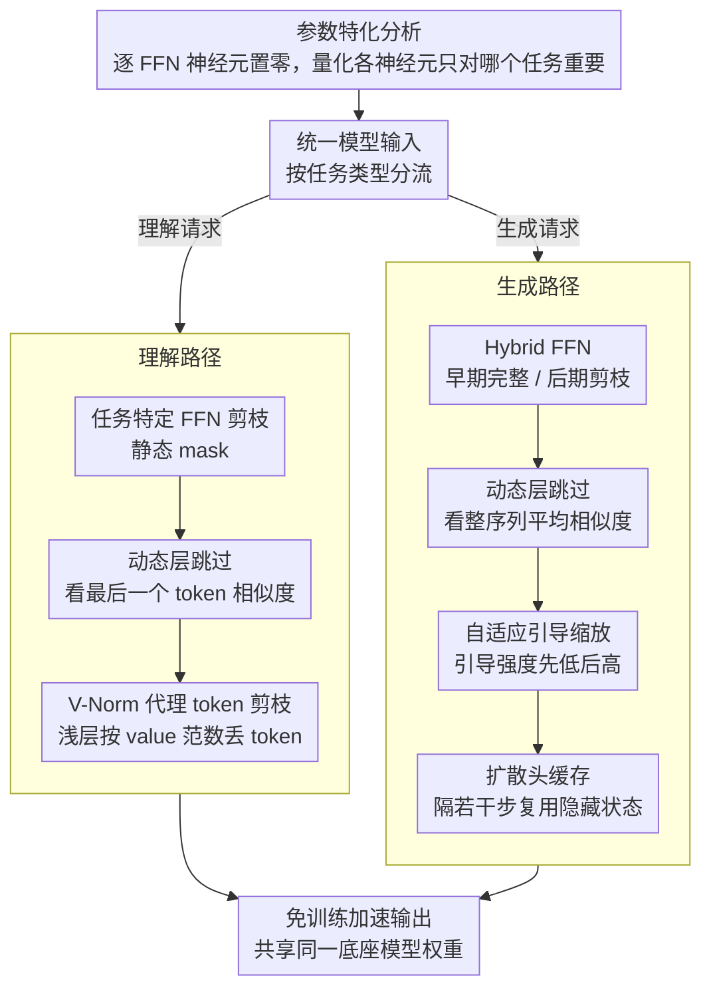

# Flash-Unified: Training-Free and Task-Aware Acceleration for Native Unified Models

**会议**: CVPR 2026  
**arXiv**: [2603.15271](https://arxiv.org/abs/2603.15271)  
**代码**: [有](https://github.com/Rirayh/FlashU)  
**领域**: 图像生成  
**关键词**: 统一多模态模型加速, 免训练推理优化, 任务感知剪枝, 扩散头缓存, 动态层跳过

## 一句话总结

FlashU 首次对原生统一多模态模型进行系统性冗余分析，发现参数特化和计算异质性现象，据此提出免训练任务感知加速框架，通过 FFN 剪枝、动态层跳过、自适应引导缩放和扩散头缓存，在 Show-o2 上实现 1.78x-2.01x 加速同时保持 SOTA 性能。

## 研究背景与动机

**领域现状**：原生统一多模态模型（如 Show-o2）将理解和生成集成到单一架构，面临巨大计算开销。现有加速方法采用静态统一策略。

**核心问题**：
   - 生成任务（迭代去噪，多步 ODE）和理解任务（单次前向，特征逐层抽象）计算特性本质不同
   - 统一策略被迫折中，无法充分优化
   - 缺乏对统一模型内部机制的系统理解

**本文发现**：
   - **参数特化**：FFN 中大量神经元仅对生成或理解重要，共享关键神经元比例小
   - **计算异质性**：生成任务层间特征冗余极高，理解任务关键 token 特征随深度逐渐演化

## 方法详解

### 整体框架

FlashU 要解决的矛盾是：原生统一多模态模型把"理解"和"生成"塞进同一套权重，但这两件事的计算特性截然不同——生成是几十步迭代去噪的 ODE 轨迹，理解是一次前向把图像特征逐层抽象成语义。已有加速方法对两者套用同一份静态策略，只能在中间折中，谁都没吃满。FlashU 的做法是反过来：先剖开模型看清"哪些参数、哪些层、哪些 token 对哪个任务才真正重要"，再为两条任务路径各裁一套免训练的加速方案，共享同一个底座模型。

具体落地时，输入先按任务类型分流。理解请求走"FFN 静态剪枝 + 动态层跳过 + V-Norm token 剪枝"这条路；生成请求走"Hybrid FFN + 动态层跳过 + 自适应引导缩放 + 扩散头缓存"这条路。所有改动都不碰原始权重，只在推理时按规则选择性地少算一些东西，因此整套方案即插即用。

### 关键设计

**1. 参数特化分析：先量化每个 FFN 神经元只对哪个任务重要**

这是整套方法的诊断基础，也是后面剪枝的依据。受 Optimal Brain Damage 启发，FlashU 把每个 FFN 神经元逐个置零，看输出重建误差涨了多少，涨得越多说明这个神经元越关键，以此作为它的重要性分数。关键在于这件事分别在生成校准数据和理解校准数据上各做一遍，得到两套重要性分布。对比两套分布后发现：大量神经元只对其中一个任务的误差敏感、对另一个几乎无影响，两任务共享的"关键神经元"占比很小。这个"参数特化"现象正是任务感知剪枝能成立的前提——既然多数神经元只服务一个任务，就可以放心地为每个任务砍掉对它无用的那部分。

**2. 任务特定 FFN 剪枝与 Hybrid FFN：让生成在画质敏感的早期保留完整算力**

有了上面的特化结论，FlashU 用 Wanda 风格的指标（权重幅度 $|W|$ 乘以对应输入激活的范数 $\lVert X \rVert$）给每个任务挑出可裁神经元，只用 20 个校准样本就能算出剪枝 mask。理解任务对此最直接——一次前向、特征逐层抽象，直接套用静态 mask 即可。但生成任务不能一刀切：去噪早期决定了图像的整体结构与版面，对算力最敏感，过度剪枝会伤画质。为此生成路径用 **Hybrid FFN**，把完整路径和剪枝路径同时保留，按去噪进度切换——早期步（$t \le 0.2T$）走完整 FFN 保结构，后期步走剪枝 FFN 省算力。消融里去掉 Hybrid Network 后画质分掉了 0.71（84.39→83.68），印证了"早期不能省"这一判断。

**3. 动态层跳过：用层间相似度在线判断哪些层这一步可以整层略过**

剪 FFN 之外，FlashU 还想在层粒度省算力。它用每层输入与输出的余弦相似度衡量这一层带来的改变：相似度越高说明这层几乎没动特征、是冗余的，就把它整层跳过。两个任务的"相似度"算法不同——生成任务对整条序列取平均相似度，理解任务只看最后一个 token（因为理解最终只关心那个用于决策的关键 token）。由于哪些层冗余会随采样进程变化，跳过列表不是固定的，而是每隔 $T_{LS}$ 步重新计算一次，让跳过策略跟着当前状态自适应。

**4. 自适应引导缩放：把固定的 CFG 换成"先放后收"的递增引导**

这是生成专用、也是单项加速贡献最大的设计。传统做法用一个固定的 classifier-free guidance 强度贯穿全程，FlashU 改成随去噪步递增的引导调度：早期用低引导，让采样保留多样性、先在多个模态间选定大方向（Mode Selection）；后期再调高引导，把细节往条件上收紧（Concentration）。这样既贴合扩散"先定骨架再补细节"的内在节奏，又把早期不必要的高引导计算省了下来。消融显示它的分量极重——移除自适应引导后整体加速从 1.92x 直接掉到 1.28x，是所有组件里最大的加速来源。

**5. 扩散头缓存：利用相邻去噪步的连贯性，隔几步才完整算一次扩散头**

生成时每一步都要过一遍扩散头来预测去噪方向，但相邻去噪步的隐藏状态高度连贯、变化平缓。FlashU 据此每隔 $T_{cache}$ 步才完整计算一次扩散头，中间的若干步直接复用缓存下来的隐藏状态，省掉重复计算。这条设计纯粹吃"时间冗余"的红利，因为变化缓慢，复用缓存对最终轨迹几乎无损。

**6. V-Norm 代理 token 剪枝：用 value 范数在浅层就挑出可丢弃的视觉 token**

理解任务的视觉 token 很多但并非都重要，自然想按注意力分数剪掉不重要的。问题是 Flash Attention 出于效率不显式输出注意力矩阵，拿不到分数。FlashU 发现一个可替代的信号：token 的注意力分数与其 value 向量的 L2 范数呈负相关——value 范数越大的 token，反而越少被注意到。于是它在浅层（第 2 层）直接算每个 token 的 v-norm，把范数最高的 $\rho$ 比例 token（即最不重要的那批）剪掉。这个代理量可直接计算、不依赖注意力矩阵，因此和 Flash Attention 完全兼容，又能在很浅的层就完成筛选、让后续所有层都受益。

### 损失函数 / 训练策略

完全免训练：FFN 剪枝只需 20 个校准样本离线算出 mask，动态层跳过、引导调度与扩散头缓存都在推理时在线决定，不更新任何权重。

## 实验关键数据

### 主实验

**多模态理解（表1, Show-o2 7B）**：

| 方法 | MME | MMB | MMMU | MMStar | Latency |
|------|-----|-----|------|--------|---------|
| Show-o2 7B | 1620.5 | 79.3 | 48.9 | 56.6 | 1.71s |
| Emu3 8B | - | 58.5 | 31.6 | - | 1.29s |
| **+ FlashU 7B** | **1560.5** | **75.3** | **45.1** | **48.3** | **0.96s (1.78x)** |

**图像生成 GenEval（表2）**：

| 方法 | Overall | Latency |
|------|---------|---------|
| Emu3 8B | 0.66 | 110.5s |
| Show-o2 1.5B | 0.73 | 10.61s |
| + FlashU 1.5B | 0.71 | 5.28s (2.01x) |
| Show-o2 7B | 0.76 | 22.74s |
| + FlashU 7B | 0.72 | 11.82s (1.92x) |

### 消融实验

**7B DPG-Bench 消融（表4）**：

| 策略 | Latency | Score |
|------|---------|-------|
| Show-o2 | 11.30s | 86.14 |
| FlashU (full) | 5.89s (1.92x) | 84.39 |
| w/o Dynamic Layer Pruning | 6.70s (1.69x) | 85.56 |
| w/o Hybrid Network | 5.65s (2.00x) | 83.68 |
| w/o Adaptive Guidance | 8.86s (1.28x) | 85.34 |
| FFN Pruning Only | 9.21s (1.23x) | 85.08 |

### 关键发现

- 自适应引导缩放贡献最大加速（移除后从 1.92x 降至 1.28x）
- Hybrid Network 对质量至关重要（移除后 score 降 0.71）
- FlashU 7B 加速后 MMMU 仍优于未加速 Emu3 8B（45.1 vs 31.6）
- 理解 1.78x，生成最高 2.01x

## 亮点与洞察

1. **首次系统分析统一模型**：参数特化和计算异质性发现为后续研究奠基
2. **任务感知正交设计**：生成/理解不同路径共享底层模型
3. **完全免训练**：仅需少量校准，即插即用
4. **V-Norm 代理**：巧妙解决 Flash Attention 下注意力不可用问题

## 局限与展望

1. 生成性能有下降（GenEval 0.76 -> 0.72）
2. 仅在 Show-o2 验证，泛化待验证
3. 动态层跳过定期重计算有开销
4. V-Norm 负相关假设鲁棒性待验证
5. 可与量化正交组合进一步提速

## 相关工作与启发

- **Show-o2**：目标统一模型
- **Wanda**：FFN 剪枝重要性度量
- **Flash Attention**：驱动 V-Norm 代理必要性
- **启发**：参数特化暗示"一个模型两条路径"是统一 AI 高效范式

## 评分

| 维度 | 分数 (1-5) | 说明 |
|------|-----------|------|
| 创新性 | 4.5 | 首次系统分析+任务感知范式 |
| 技术深度 | 4 | 多组件协同 V-Norm 巧妙 |
| 实验完整性 | 4 | 双任务多基准 |
| 写作质量 | 4.5 | 分析深入图表直观 |
| 实用价值 | 4.5 | 免训练即插即用 |
| 总分 | 4.3 | |

<!-- RELATED:START -->

## 相关论文

- [\[CVPR 2026\] TAG-MoE: Task-Aware Gating for Unified Generative Mixture-of-Experts](tag-moe_task-aware_gating_for_unified_generative_mixture-of-experts.md)
- [\[CVPR 2026\] Denoising as Path Planning: Training-Free Acceleration of Diffusion Models with DPCache](dpcache_denoising_path_planning_diffusion_accel.md)
- [\[CVPR 2026\] SparVAR: Exploring Sparsity in Visual Autoregressive Modeling for Training-Free Acceleration](sparvar_exploring_sparsity_in_visual_autoregressive_modeling_for_training-free_a.md)
- [\[CVPR 2026\] TAP: A Token-Adaptive Predictor Framework for Training-Free Diffusion Acceleration](tap_a_token-adaptive_predictor_framework_for_training-free_diffusion_acceleratio.md)
- [\[NeurIPS 2025\] Show-o2: Improved Native Unified Multimodal Models](../../NeurIPS2025/image_generation/show-o2_improved_native_unified_multimodal_models.md)

<!-- RELATED:END -->
