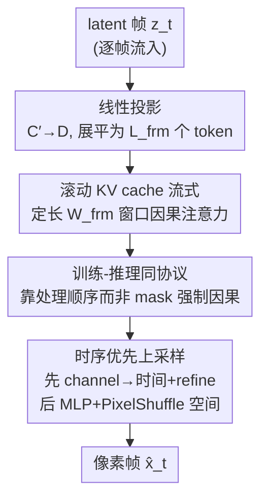

# FlashDecoder: Real-Time Latent-to-Pixel Streaming Decoder with Transformers

**会议**: CVPR 2026  
**论文**: [CVF Open Access](https://openaccess.thecvf.com/content/CVPR2026/html/Kang_FlashDecoder_Real-Time_Latent-to-Pixel_Streaming_Decoder_with_Transformers_CVPR_2026_paper.html)  
**代码**: 无  
**领域**: 图像生成 / 扩散模型  
**关键词**: 视频解码器, latent-to-pixel, 流式生成, 滚动KV cache, Transformer VAE  

## 一句话总结
针对实时视频生成中"去噪已经够快、但卷积解码器把潜变量解回像素这一步反而成了瓶颈"的问题，FlashDecoder 用一个纯 Transformer 解码器**逐帧**把 latent 解码成像素，每帧只通过定长滚动 KV cache 看最近 $W_{\text{frm}}$ 帧，从而做到恒定延迟、显存不随视频长度增长，在 1080p 上重建质量追平卷积解码器（41.55 vs. 41.49 dB PSNR）的同时吞吐快 3.6×–4.7×、显存省最多 11×。

## 研究背景与动机
**领域现状**：latent diffusion 已是图像/视频生成的主流框架——编码器把像素压进低维 latent 空间，扩散模型在 latent 上生成，再由解码器（decoder/VAE）把 latent 解回像素。过去几年的加速几乎全砸在"生成阶段"：更高效的 DiT 架构、更高压缩比的 VAE、少步蒸馏，已经基本把迭代去噪这个老瓶颈消掉了。

**现有痛点**：当生成端逼近实时后，瓶颈悄悄转移到了一直没人管的解码器上。现有视频解码器绝大多数是 3D 因果卷积网络，重建质量好但又慢又吃显存：在 720p 上，Wan2.2 卷积解码器要吃掉总推理时间的 64.6%，把端到端生成压到只有 10.4 FPS；高分辨率解码还得做空间-时间分块（tiling），让解码器评估次数和延迟翻倍。

**核心矛盾**：用 Transformer 替换卷积解码器，会撞上"流式 vs. 质量"的二选一。因果型 Transformer 解码器（如 OmniTokenizer）训练时要显式因果 mask，这让 FlashAttention 用不上、高分辨率训练做不动，质量受限，而且每帧延迟随时序上下文累积而增长；双向型（AToken、MAGI-1 VAE）靠看遍所有帧拿到好质量，但每帧都要访问未来帧，根本没法流式。

**本文目标**：作者把"实时视频解码器"该有的性质拆成四条——(1) 无 padding/blending 的逐帧解码、(2) 重建质量不输卷积解码器、(3) 每帧延迟恒定且显存有界、(4) 不靠分块就能高分辨率/长视频解码——并要求同一个模型四条全占。

**切入角度**：Transformer 原则上能同时满足四条（顺序处理→逐帧、自注意力→高质量重建、窗口注意力→有界显存/算力），但没有现成的 Transformer 解码器四条全占。作者的关键观察是：因果性不一定要靠 mask 来实现，**靠"处理顺序"本身就能强制因果**——既然未来帧还没喂进来，当前帧自然看不到它们。

**核心 idea**：用一个定长滚动 KV cache 把视频 latent 逐帧解码成像素，训练和推理走**完全相同**的流式协议，从而彻底去掉因果 mask，让高分辨率训练变得可行、追平卷积解码器的质量。

## 方法详解

### 整体框架
FlashDecoder 是一个纯 Transformer 的 latent-to-pixel 解码器，工作在标准 LDM 框架内：预训练编码器 $E$ 把视频 $x\in\mathbb{R}^{B\times C\times T\times H\times W}$ 压成 latent $z\in\mathbb{R}^{B\times C'\times T'\times H'\times W'}$，FlashDecoder 负责 $\hat{x}=D(z)$ 这一步，且对编码器无关（在 Wan2.1 与 Wan2.2 两套 latent 空间上都能训）。

整条流水线逐帧推进：每个 latent 帧 $z_t$ 先被线性投影成 $L_{\text{frm}}=H'W'$ 个空间 token，送进带**滚动 KV cache** 的 Transformer backbone（只缓存最近 $W_{\text{frm}}$ 帧），backbone 输出再经**时序优先上采样**——先用 channel→时间的方式做时间上采样并 refine、再用 MLP+PixelShuffle 做空间上采样——最终吐出像素帧 $\hat{x}_t$。因为帧是顺序处理的，时序因果天然成立、无需任何 attention mask。

### 关键设计

**1. 滚动 KV cache：定长窗口的逐帧因果流式**

这是为了让解码"延迟恒定、显存有界，且与视频长度无关"。FlashDecoder 一次只处理一个 latent 帧，维护一个固定 $W_{\text{frm}}$ 帧的滑动窗口 KV cache（全文取 $W_{\text{frm}}=2$，即每帧只看自己和紧邻的前一帧）。在第 $t$ 步：投影出 $L_{\text{frm}}$ 个 token；用带时间偏移 $t\cdot L_{\text{frm}}$ 的 3D-RoPE 算出新的 $(K^{\text{new}}_t, V^{\text{new}}_t)$ 追加进 cache，并把最旧那帧逐出（若超出 $W_{\text{frm}}$）；当前 query 对整个 cache 做注意力。注意力模式是个滑动窗口——帧内对全部 $L_{\text{frm}}$ 个空间位置做**双向**注意力、时间轴上只看最近 $W_{\text{frm}}$ 帧（**因果**）。

它有效的关键在于 cache 形状被钉死成 $K_t,V_t\in\mathbb{R}^{B\times G\times (W_{\text{frm}}L_{\text{frm}})\times D_h}$，这里 $G$ 是 GQA 的 KV 组数（$G\ll N$，进一步压缩 cache 显存）。每帧注意力开销是 $O(N W_{\text{frm}} L_{\text{frm}}^2 D_h)$——对时间窗口线性、对空间 token 二次，但因为窗口定长，无论视频多长，单帧算力和显存都不变。这正是它相对"朴素全序列因果 Transformer"的根本区别：后者的 KV cache 随视频长度线性膨胀，吞吐会从 331.4 FPS 崩到 16.6 FPS。

**2. 训练-推理同协议：靠处理顺序而非 mask 强制因果**

这是 FlashDecoder 区别于此前因果 Transformer 解码器的最核心一招，专门解决"高分辨率训练做不动"。以往做法（如 OmniTokenizer）训练时把全部 $T'$ 帧塞进单次前向、配一个全序列因果 mask，推理时才切到 KV caching——两个阶段机制不一致。而那个全序列因果 mask 需要 FlexAttention 把它**显式物化**出来，在 H100 80GB 上跑 480p/720p/1080p 都会直接 OOM。

FlashDecoder 让训练和推理走**完全同一套流式协议**：任何阶段都一次只看不超过 $W_{\text{frm}}$ 帧，做 $T'$ 次顺序前向，每次用标准 FlashAttention 只对至多 $W_{\text{frm}}\cdot L_{\text{frm}}$ 个 token 注意力，单步显存只有 $O(W_{\text{frm}}\cdot L_{\text{frm}})$。因为未来帧根本没被喂进来，因果性是"构造性"成立的，压根不需要 mask。去掉 mask + 用上 FlashAttention，直接把高分辨率训练的显存墙拆了——这才让 1080p 训练可行，进而追平卷积解码器质量。消融里这一步（row e→f）是全表最大跃升：rFVD 从 44.74 砸到 12.29。

**3. 时序优先上采样：先时间扩张、后空间放大**

Transformer 做空间上采样代价是灾难性的：空间放大因子 $r_s$ 让每帧 token 数涨 $r_s^2$，注意力开销随之涨到 $O(r_s^4)$（$r_s{=}16$ 时是 65,536×）；而时间上采样因子 $r_t$ 只带来 $O(r_t^2)$ 开销（$r_t{=}4$ 时 16×），两者差 4,096×。所以作者把"贵"的空间放大挪到 Transformer 之外，整体走"先时间、后空间"。

具体三步：**① 时间上采样**——对 backbone 输出 $Y\in\mathbb{R}^{B\times L\times D}$ 做线性扩张 $P_{\text{temp}}=\text{Linear}_{D\to D\cdot r_t}(Y)$，再把扩张出来的 channel 重新解释成新的时间索引，得到 $P_{\text{full}}\in\mathbb{R}^{B\times(T'r_t H'W')\times D}$；**② 时间 refine**——两个 Transformer block 用同样的流式机制处理 $P_{\text{full}}$，但窗口扩成 $W^{\text{full}}_{\text{frm}}=r_t\cdot W_{\text{frm}}$ 以保住有效时序上下文；**③ 空间上采样**——一个 2 层 MLP 把特征从 $D$ 投到 $C\cdot r_s^2$ channel，再用 PixelShuffle 重排成最终 $\hat{x}\in\mathbb{R}^{B\times C\times(T'r_t)\times(H'r_s)\times(W'r_s)}$。消融显示，单纯把 channel 扩张当时间帧会产生时序不一致，正是这个时间 refine 步带来了最大的单项架构增益（rFVD 121.87→86.94），印证"原始 channel 扩张需要专门的 refine 来收拾"。

### 损失函数 / 训练策略
解码器用像素级 + 感知 + 对抗三项组合训练：
$$\mathcal{L}_{\text{total}}=\lambda_{L1}\mathcal{L}_{L1}+\lambda_{\text{LPIPS}}\mathcal{L}_{\text{LPIPS}}+\lambda_{\text{adv}}\mathcal{L}_{\text{adv}}$$
其中 $\mathcal{L}_{L1}$ 保像素保真，$\mathcal{L}_{\text{LPIPS}}$ 用预训练特征空间度量感知相似度，$\mathcal{L}_{\text{adv}}$ 由一个 3D patch 判别器算出、负责把高频细节做锐。训练分三阶段、图文联合（DataComp-small 12.8M 图文对 + Kinetics-600 与内部视频，图:视频采样比 2:8）：Stage 1 在 224×224 快速收敛，Stage 2 转 480p/720p/1080p，Stage 3 加对抗训练。全部在单节点 8×H100 上完成。

## 实验关键数据

评测在 UltraVideo 上（720×1280 resize 后中心裁到目标分辨率、取 25 帧片段），指标为 PSNR（像素保真）、LPIPS（感知）、rFVD（即 Content-Debiased FVD，去掉内容偏置、更忠实地衡量时序一致性）、FPS（吞吐）与 Mem（峰值显存 GB）。

### 主实验
4×16×16 压缩组、25 帧、单 H100 上 FlashDecoder-XL 对比卷积/Transformer 解码器（节选）：

| 分辨率 | 方法 | PSNR↑ | LPIPS↓ | rFVD↓ | FPS↑ | Mem(GB)↓ |
|--------|------|-------|--------|-------|------|----------|
| 1080p | Wan2.2 (卷积) | 41.49 | 0.04 | 8.16 | 7.1 | 41.0 |
| 1080p | AToken (双向Transformer) | 40.18 | 0.09 | 25.67 | 10.1 | 3.3 |
| 1080p | **FlashDecoder-XL** | **41.55** | 0.05 | 12.08 | **25.4** | **3.7** |
| 720p | Wan2.2 (卷积) | 38.29 | 0.04 | 10.39 | 16.1 | 19.3 |
| 720p | **FlashDecoder-XL** | 38.38 | 0.05 | 12.75 | **76.3** | **2.4** |
| 720p | **FlashDecoder-XL-Opt** | 37.85 | 0.05 | 12.22 | **151.0** | **1.3** |

1080p 上 FlashDecoder 追平 Wan2.2 的 PSNR（41.55 vs. 41.49），吞吐 3.6×、显存省 11×（3.7 GB vs. 41.0 GB）；相比双向 Transformer 解码器（AToken/MAGI-1），它在质量更高的同时还能流式、吞吐高 2.5×–13×。加上架构感知的推理优化后，FlashDecoder-XL-Opt 在 480p 上吞吐达 Wan2.2 的 12×、峰值显存压到 2 GB 以下。

### 消融实验
组件消融（480p、17 帧，从朴素 block 因果 Transformer 逐步加组件）：

| 配置 | PSNR↑ | rFVD↓ | FPS↑ | 说明 |
|------|-------|-------|------|------|
| Baseline (全序列因果) | 30.30 | 117.77 | 331.4→16.6 | KV cache 随长度膨胀，吞吐崩 |
| +滑窗因果注意力(SW-CA) | 30.20 | 136.08 | 333.8 | 吞吐稳但仍需物化 mask、480p/720p OOM |
| +GQA | 30.13 | 121.87 | 340.7 | 压 KV cache 显存 |
| +时间 refine(TR) | 31.05 | **86.94** | 260.3 | 最大单项架构增益 |
| +空间上采样(SU) | 31.49 | 96.19 | 262.1 | 提保真但略升 rFVD |
| +模型放大 | 32.56 | 44.74 | 166.0 | 各指标稳定提升 |
| +流式训练 | 37.52 | **12.29** | 166.0 | 全表最大跃升（开高分训练） |
| +对抗 | 37.08 | 10.77 | 166.0 | 牺牲少量 PSNR 换更锐输出 |

窗口大小消融（720p、25 帧、FlashDecoder-XL）：$W_{\text{frm}}\in\{2,3,4\}$ 质量都稳定（PSNR 38.13–38.49），$W_{\text{frm}}=2$ 在显存（2.4 vs. 2.6 GB）和吞吐（76.3 vs. 60.6 FPS）上最划算——说明 latent 解码只需看前一帧就有足够时序上下文。

### 关键发现
- **掉点最关键的两步是"流式训练"和"时间 refine"**：流式训练让高分辨率微调成为可能，直接把 224×224 预训练和评测分辨率之间的域差补上（rFVD 44.74→12.29）；时间 refine 是单项架构增益最大者（rFVD 121.87→86.94），印证 channel 扩张需要专门 refine 收拾时序不一致。
- **窗口只需 2**：$W_{\text{frm}}=2$ 即每帧只回看一帧，质量已与 $W_{\text{frm}}=4$ 持平，是质量/显存的最佳折中。
- **长视频质量不衰减**：RoPE 位置按"相对当前窗口"而非绝对帧号分配，让位置编码永远落在训练见过的范围内，理论上支持无限长解码；400+ 帧的 720p 视频上 per-frame PSNR 保持平稳，显存恒定。
- **流式架构天然适合推理优化**：每帧前向是定长、数据无关的计算图，torch.compile 融核 + CUDA graph + 预算 RoPE/FA3 自定义算子（前三者无损）+ MLP 的 FP8 量化（PSNR 掉 0.06–0.71 dB），四项可乘性叠加，把吞吐推到 Wan2.2 的 12×。

## 亮点与洞察
- **"因果靠顺序、不靠 mask"** 是全文最漂亮的一刀：它一句话就把困住此前因果 Transformer 解码器的高分辨率训练显存墙拆了——既然未来帧没喂进来，mask 本就多余，去掉它正好能用上 FlashAttention。这个观察迁移性很强，凡是"训练用 mask、推理用 KV cache"的因果序列任务都可以反问一句：能不能让训练也走流式、把 mask 省掉？
- **把"贵的放大"挪出 Transformer**：$O(r_s^4)$ vs. $O(r_t^2)$ 的 4,096× 差距点醒了一个直觉——Transformer 里别做大倍率空间上采样，把它交给 PixelShuffle，Transformer 只管便宜的时间维。这条"算力分摊"思路对任何要在 Transformer 内做高倍上采样的生成/恢复任务都适用。
- **训练-推理协议一致**带来的"白送"红利：因为每帧计算图定长且数据无关，CUDA graph 与 FP8 这类优化几乎零摩擦地叠上去，最终 12× 加速里有相当部分是架构选择"顺带"换来的。

## 局限与展望
- 作者承认在 4×8×8 压缩组里 FlashDecoder-XL 仍落后 HunyuanVideo；rFVD 相对卷积 baseline 也偏高，但归因于对比的是用远多算力/数据训练的产线级解码器，而本文只是单节点配置。
- ⚠️ 本文只替换了**解码器**，编码器仍沿用 Wan 现成的；作者也把"配一个流式 Transformer 编码器、从头训完整 VAE"列为下一步——这意味着当前 latent 空间并非为 Transformer 解码量身定制，潜在还有质量空间没吃满。
- 窗口 $W_{\text{frm}}=2$ 对"latent 解码"够用，但这是在已经高度时序压缩（$4\times$ 时间压缩）的 latent 上得出的结论；若 latent 时序压缩更弱、或场景运动极快，单帧回看是否仍够，论文未充分探讨。
- rFVD 偏高一项提示：流式/窗口注意力换来的时序一致性，相比双向全局注意力仍有差距，只是被高分辨率训练和 refine 大幅缓解。

## 相关工作与启发
- **vs OmniTokenizer（因果 Transformer 解码器）**：两者都走因果路线、靠 KV caching 流式，但 OmniTokenizer 训练时要显式因果 mask，导致高分辨率训练难、质量受限、每帧延迟随上下文增长；FlashDecoder 靠处理顺序强制因果、定长窗口锁死显存，把训练和推理统一在同一套流式机制下，质量和可训练分辨率都上了一个台阶。
- **vs AToken / MAGI-1 VAE（双向 Transformer 解码器）**：它们靠看遍所有帧的双向注意力拿到好质量，但有全局时序依赖、无法流式且吞吐随视频长度退化；FlashDecoder 在重建质量更高的同时还能恒定延迟流式，吞吐高 2.5×–13×。
- **vs 3D 卷积解码器（Wan2.1/Wan2.2、HunyuanVideo）**：卷积解码器重建好但慢且吃显存、高分辨率还要分块；FlashDecoder 追平其重建质量（1080p PSNR 41.55 vs. 41.49），却把吞吐提到 3.6×–4.7×、显存降到最多 1/11，且不需要空间-时间分块。
- **vs Representation Autoencoder（RAE/LV-RAE，图像域）**：RAE 用冻结预训练编码器配 Transformer 解码器，已在图像生成上证明 Transformer 解码的优势，但尚未触及视频；FlashDecoder 正是把"流式 Transformer 解码器"这一缺口补到了视频域。

## 评分
- 新颖性: ⭐⭐⭐⭐⭐ "因果靠处理顺序而非 mask、统一训练与推理流式协议"是简洁有力的洞见，直接拆掉高分训练显存墙。
- 实验充分度: ⭐⭐⭐⭐ 三分辨率、两套 latent 空间、组件/窗口/缩放/长视频多维消融齐全；4×8×8 组略逊与单节点算力是诚实承认的短板。
- 写作质量: ⭐⭐⭐⭐⭐ 四条性质提纲挈领，方法与复杂度分析清晰，Algorithm 1 把流式流程交代得很完整。
- 价值: ⭐⭐⭐⭐⭐ 把实时视频生成的真实瓶颈（解码占 64.6% 时间）对症解决，单卡 12× 加速 + 2GB 显存，工程落地价值高。

<!-- RELATED:START -->

## 相关论文

- [\[CVPR 2026\] StreamAvatar: Streaming Diffusion Models for Real-Time Interactive Human Avatars](streamavatar_streaming_diffusion_models_for_real-time_interactive_human_avatars.md)
- [\[CVPR 2026\] PixelDiT: Pixel Diffusion Transformers for Image Generation](pixeldit_pixel_diffusion_transformers_for_image_generation.md)
- [\[CVPR 2026\] DreamStereo: Towards Real-Time Stereo Inpainting for HD Videos](dreamstereo_towards_real-time_stereo_inpainting_for_hd_videos.md)
- [\[CVPR 2026\] Your Latent Mask is Wrong: Pixel-Equivalent Latent Compositing for Diffusion Models](your_latent_mask_is_wrong_pixel-equivalent_latent_compositing_for_diffusion_mode.md)
- [\[CVPR 2026\] Training-free Mixed-Resolution Latent Upsampling for Spatially Accelerated Diffusion Transformers](training-free_mixed-resolution_latent_upsampling_for_spatially_accelerated_diffu.md)

<!-- RELATED:END -->
