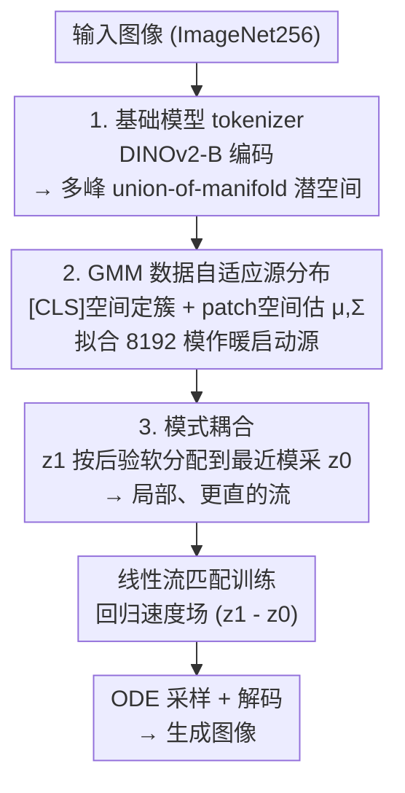

# Flow Matching for Multimodal Distributions

**会议**: CVPR 2026  
**论文**: [CVF Open Access](https://openaccess.thecvf.com/content/CVPR2026/html/Luo_Flow_Matching_for_Multimodal_Distributions_CVPR_2026_paper.html)  
**代码**: https://mm-flow.github.io  
**领域**: 图像生成 / 流匹配  
**关键词**: 流匹配, 多峰分布, 高斯混合源, 模式耦合, DINOv2潜空间  

## 一句话总结
当用视觉基础模型（DINOv2-B）当 tokenizer 时，潜空间天然呈"多个流形并集"的多峰结构；本文用拟合到目标分布的高斯混合（GMM）当源分布、再按"最近的模"做数据配对（mode coupling），让概率质量只在局部搬运，从而把流匹配训练收敛速度提了 30×、采样步数省到 1/5，在 ImageNet256 无条件生成上做到 FID=2.74（80 epoch）。

## 研究背景与动机
**领域现状**：当下 SOTA 生成模型几乎都是 flow-based（扩散 + 流匹配 FM）。流匹配把一个源分布 $p$ 沿设计好的流逐步搬成目标分布 $q$，学好速度场后就能把新源样本变成新目标样本。训练通常在 tokenizer 压出的潜空间里做，因此目标分布的复杂度完全由 tokenizer 决定。

**现有痛点**：传统 VAE-based tokenizer（SD-VAE、LDM-VAE）把潜分布对齐成一个全维各向同性高斯，密度估计的样本复杂度随有效维度指数增长——撞上维度灾难，训练慢。近来一批工作发现：用视觉基础模型加持 tokenizer，能揭示数据的"流形并集"（Union of Manifolds Hypothesis）结构，把目标分布的复杂度显著降下来。但这些工作只优化了目标分布这一侧。

**核心矛盾**：FM 的学习难度同时由三件事决定——(1) 目标分布复杂度、(2) 源-目标距离、(3) 流的设计。既然基础模型已经把目标分布变成低复杂度的**多峰**分布，那继续沿用各向同性单峰高斯当源就很别扭：高斯是"target-blind"的，源和目标差很远，需要大范围、跨模的搬运；而要把多峰目标的不同模拉到一起，速度场必然高度弯曲、难学。

**本文目标**：在基础模型已经给出多峰目标的前提下，重新设计**源分布**和**数据耦合**，让源-目标足够近、让流足够局部和直。

**切入角度**：多峰目标 → 就用一个**多峰的源**（GMM）去贴它；GMM 拟合后天然把每个目标样本分配到某个高斯模 → 就用这个分配关系做**逐模的数据配对**，保证概率质量"就近搬"而不"跨模搬"。

**核心 idea**：源分布与数据耦合的**协同设计**（co-design）——data-adaptive 的 GMM 暖启动源 + mode-dependent 耦合，合起来叫 **MM-FM（Mixture-Modeling Flow Matching）**。

## 方法详解

### 整体框架
MM-FM 的整条管线就是把"降低 FM 学习难度"的三条洞察依次落地：先用揭示流形并集结构的基础模型当 tokenizer，得到一个**多峰目标**；再对这个多峰潜分布拟合一个 GMM 当**暖启动源分布**，把源和目标的距离缩到很近；最后用 GMM 拟合时自然产生的模分配，做**逐模耦合**，让每个目标潜样本只和"它所属那个模"采出来的噪声配对，训练出来的流因此局部又直。训练阶段只需在这个新的源+耦合下跑标准线性流匹配损失；采样阶段先从 GMM 抽一个模、再从该模采初始噪声，沿 ODE 积分后过 decoder 出图。

### 关键设计

**1. 基础模型 tokenizer：把目标分布从"全维高斯"变成"多峰流形并集"**

这是后面一切的前提，针对的是 VAE tokenizer 把潜分布摊成全维高斯、撞维度灾难的痛点。作者直接用 DINOv2-B 当 encoder（而不是像很多工作那样只用基础模型去"正则化" VAE encoder），理由是：基础模型直接当 encoder 时线性探测精度更高、t-SNE 可视化里类簇更分明，说明潜空间确实呈现"多个流形并集"的多峰结构，密度复杂度更低。decoder 则按 RAE 的配方单独训练，用 $L = L_1(\hat x, x) + \lambda_L \mathrm{LPIPS}(\hat x, x) + \lambda_G \mathrm{GAN}(\hat x, x)$（重建 + 感知 + 对抗），只在推理出图时用到，训练 FM 时并不需要 decoder。换句话说，这一步不是本文发明的，但它把"目标分布是多峰的"这个事实坐实，给后面用多峰源、逐模耦合提供了着力点。

**2. GMM 数据自适应源分布：用多峰源贴多峰目标，把源-目标距离压小**

针对"各向同性高斯源 target-blind、离目标太远"的痛点。既然目标是多峰的，就直接对潜目标分布拟合一个高斯混合 $p = \sum_{i=1}^{m} c_i\,\mathcal{N}(\mu_i, \Sigma_i)$ 当源分布——把 GMM 看成对目标的一次"暖启动估计"，而 FM 训练只是在此基础上做精修。源和目标共享同样的模 $\{\mu_k, \Sigma_k\}$、在每个模附近"形状相似"，源-目标距离自然远小于单峰高斯到多峰目标的距离。

这里真正的工程难点是**高维下怎么把 GMM 算出来**：DINOv2-B 把每张图编成 768 个 patch token（每个 $16\times16$）外加一个 768 维 [CLS] token，直接在 $768\times16\times16$ 维上做 GMM 估计会爆。作者的子程序是借 [CLS] token 当全局描述子：先在相对低维的 [CLS] 空间跑完整 GMM、定出簇成员；再对每个簇，分别在 patch-token 空间估计该模的均值和（对角）协方差。默认用 8192 个模、对角协方差、软分配；训练一次 GMM 的开销相比训 FM 可忽略。这样既享受多峰源带来的"近"，又绕开了高维 GMM 估计不可行的问题。

**3. 模式耦合（mode coupling）：让概率质量就近搬运，把流变局部又直**

针对"跨模搬运导致速度场高度弯曲、难学且采样步数多"的痛点。标准 FM 里源样本 $z_0$ 和目标样本 $z_1$ 是独立采的，配出来的流可能横跨整个空间。本文改成 mode-dependent 耦合：给定目标样本 $z_1\sim q$，先用 GMM 的**后验责任**把它软分配到各个模，再从对应的混合里采 $z_0$：

$$\gamma_{\mathrm{mode}}(z_0 \mid z_1) = \sum_{k=1}^{m} w_k(z_1)\,\mathcal{N}(z_0;\mu_k,\Sigma_k),\qquad w_k(z_1) = \frac{c_k\,\mathcal{N}(z_1;\mu_k,\Sigma_k)}{\sum_{i=1}^{m} c_i\,\mathcal{N}(z_1;\mu_i,\Sigma_i)}.$$

直觉上，每个目标样本只和"它最可能所属那个模"采出来的噪声配对，概率质量就在单个模内部就近移动，而不会跨过遥远的模。训练损失仍是线性流匹配的最优传输形式 $L^{\mathrm{OT}}_{\mathrm{CFM}}(\theta) = \mathbb{E}_{t,(Z_0,Z_1)\sim\gamma}\,\lVert u^\theta_t(Z_t) - (Z_1 - Z_0)\rVert^2$，其中 $Z_t = (1-t)Z_0 + tZ_1$。GPU 实现下这套耦合几乎不增加训练开销。和 BatchOT 那种解 mini-batch 最优传输的耦合相比，mode coupling 不用在线解 OT，靠 GMM 的模分配直接拿到"局部"配对——当源已经贴近目标时，局部耦合 + 线性路径就够了。

> ⚠️ 作者额外给了一个变体：把模索引 $k$ 当作额外条件输入喂给网络，用来在模边界处更好地引导样本；并论证 OT 目标的极小化点近似等于这个 mode-conditional 变体的极小化点（细节在原文 Sec. 8，以原文为准）。

### 损失函数 / 训练策略
训练目标就是上面的线性流匹配 OT 损失 $L^{\mathrm{OT}}_{\mathrm{CFM}}$，唯一改动是采样 $(Z_0, Z_1)$ 时走 mode coupling（先采 $Z_1\sim q$，从后验采模 $k$，再采 $Z_0\sim\mathcal{N}(\mu_k,\Sigma_k)$），其余与标准 FM 一致。骨干用 DiTDH-XL（直接在结构化 DINOv2-B 潜空间上跑的 diffusion transformer），训练预算设成 80 epoch 以贴合"资源受限 + 无标签"的现实场景。采样用 50 步 Euler ODE；无条件设定下 classifier-free guidance 用不了，改用 AutoGuidance。

**理论支撑**：作者在"目标是固定单峰密度的仿射平移之均匀混合"这一简化假设下证明，用多峰源 + mode coupling 时，流的三个复杂度量——直度（straightness）、总长度（Len）、速度场的 Lipschitz 常数——都不超过对应单峰生成问题（UGP）的值，且乘的常数 $\frac{1}{m}\sum_k\lVert\Sigma_k\rVert_{\mathrm{op}}\le 1$（Thm 3.1）。反过来（Thm 3.2），若坚持用单峰源 + 独立耦合，速度场的平均 Lipschitz 常数可以被构造得任意大。直觉是：多峰源 + mode coupling 保证"同协方差结构的分量互相匹配、流始终待在支撑集的单个分量内"，所以速度场更不弯、更好学、采样更省步。

## 实验关键数据

### 主实验
ImageNet-256 无条件生成，骨干 DiTDH-XL（839M），50 步 ODE，评测 50k 样本的 FID（越低越好）/ IS。表中 baseline 是同骨干 + 高斯源 + 独立耦合。

| 配置 | Epoch | 源 / 耦合 | FID（无引导） | FID（AutoGuidance） | IS（无引导） |
|------|-------|-----------|---------------|----------------------|---------------|
| DiTDH-XL baseline | 80 | 高斯 / 独立 | 9.33 | 5.82 | 90.6 |
| DiTDH-XL baseline | 200 | 高斯 / 独立 | — | 4.96 | — |
| MM-FM | 80 | GMM / 独立 | 3.82 | 3.23 | 192.3 |
| **MM-FM** | **80** | **GMM / mode** | **3.18** | **2.74** | **211.2** |

同样 80 epoch，仅把"高斯+独立"换成"GMM+mode coupling"，无引导 FID 从 9.33 → 3.18（2.44× 提升），带 AutoGuidance 做到 **2.74**，并超过跑满训练的 RCG、比 DLC 好 45%——而且是在**无类别标签**的无条件设定下。论文称这相对经典 FM 配方实现了 30× 更快收敛（达到同等质量所需 epoch 大幅减少）。

### 消融：源与耦合的协同 + 模数
玩具实验（$\mathbb{R}^{10}$，可精确算轨迹长度 Len 与 2-Wasserstein 距离 $W_2^2$，均越低越好）说明"单换 GMM 源不够，必须配上 mode coupling"：

| 设定 | 源 | 耦合 | Len ↓ | $W_2^2$ ↓ |
|------|----|------|-------|-----------|
| Compact | 高斯 | 独立 | 1.88 | 1.252 |
| Compact | GMM | 独立 | 1.82 | 1.251 |
| Compact | GMM | mode | **1.67** | **1.248** |
| Spread | 高斯 | 独立 | 2.35 | 1.582 |
| Spread | GMM | 独立 | 2.30 | 1.631 |
| Spread | GMM | mode | **2.00** | **1.556** |

只换 GMM 源、仍用独立耦合时 Len 几乎不动（甚至在 Spread 下 $W_2^2$ 变差），只有加上 mode coupling 才同时把轨迹长度和 Wasserstein 距离压下来——验证"源 + 耦合协同设计"才是关键。真实数据上（Fig. 3）模数越多收敛越快，且即使模数远超 ImageNet 类别数仍持续受益，说明数据流形的内在结构比人工类别标签更丰富。

### 推理与数据效率
| 维度 | 经典 FM | MM-FM | 说明 |
|------|---------|-------|------|
| 达到同等 FID 所需 ODE 步 | 25 | **5** | 轨迹更直，少 5× 步 |
| 10% 数据 / 400 ep / FID-50K | 24.65 | **8.04** | DiTDH-S，GMM 也只用 10% 数据估 |
| 10% 数据 / 800 ep / FID-50K | 24.33 | **7.48** | 数据受限下差距比满数据更大 |

### 关键发现
- **协同设计才有效**：单独换 GMM 源几乎没用（Len/$W_2^2$ 不降甚至变差），必须配 mode coupling 才把"局部搬运"落实——这是全文最硬的消融结论。
- **模数越多越好、且不靠类别标签**：模数远超 ImageNet 1000 类仍单调受益，说明潜空间结构比监督标签更细，且 GMM 拟合不必完美（任何合理的多峰结构都强于 target-blind 各向同性高斯）。
- **数据越少优势越大**：10% 数据下 MM-FM 把 FID 从 24.65 压到 8.04（约 3× 更低），印证"降低学习复杂度 → 降低数据需求"。

## 亮点与洞察
- **"源-目标距离"这条被忽略的轴**：大量工作只卷目标分布复杂度（tokenizer），本文指出在基础模型已给出多峰目标后，源分布该顺势变成多峰——一个很自然却没人系统做过的角度。
- **GMM 拟合天然送出耦合**：拟合 GMM 的副产品（样本到模的分配）直接被用来定义 mode coupling，源设计和耦合设计因此不是两件事而是一件事，这是"co-design"叫法的精髓。
- **[CLS]→patch 的高维 GMM 子程序很实用**：用低维全局描述子定簇、再回 patch 空间估高斯，是把 GMM 搬到 $768\times16\times16$ 维的关键工程 trick，可迁移到其他需要在高维潜空间做聚类/混合建模的场景。
- **理论与现象对得上**：三个流复杂度量（直度/长度/Lipschitz）都被上界住，且 Thm 3.2 给出单峰源会让 Lipschitz 任意大的反例，解释了"为什么单换源不行、为什么少步采样还能 work"。

## 局限与展望
- **强依赖基础模型 tokenizer 的多峰性**：整套方法的前提是潜空间真有清晰的 union-of-manifold 结构（DINOv2-B 直接当 encoder）。若 tokenizer 给不出多峰结构，GMM 源和 mode coupling 的收益会大打折扣。
- **理论假设较强**：Thm 3.1 假设目标是"固定单峰密度的仿射平移之均匀混合"、模充分可分（Assumption 1），与真实潜分布有差距；界里的常数也来自最坏情况估计，可能偏悲观（作者自己也指出当协方差某些方向特征值小时常数会更好）。⚠️ 具体证明以原文 Sec. 6 为准。
- **只在无条件 ImageNet256 验证**：未报告更高分辨率、文生图等条件生成场景；GMM 模数（默认 8192）需随数据规模调，模数太多时每模样本不足会影响估计。
- **改进方向**：与 BatchOT 等在线 OT 耦合结合（作者已指出兼容）、把 mode-conditional 引导推广到条件生成、或让 GMM 在训练中自适应更新而非一次性拟合。

## 相关工作与启发
- **vs 经典 FM（高斯源 + 独立耦合）**: 它源 target-blind、流跨模弯曲；本文用多峰 GMM 源 + mode coupling 让流局部且直，同 epoch FID 9.33→3.18、采样 25 步→5 步。核心区别是把"源 + 耦合"一起对着多峰目标设计。
- **vs CondPrior**: 也用 GMM 源，但跑在 VAE tokenizer 上、且按**标注类别**拆混合分量。问题是 VAE 潜空间线性探测差、聚不好，类条件 GMM 未必反映真实结构，还要求有类别标注；本文用基础模型揭示真实多峰结构、无需标签。
- **vs MixSGM**: 同样有局部耦合思想，但在像素空间、只能做 EMNIST/CIFAR-10 这类低维数据；本文靠基础模型把方法搬上了高分辨自然图。
- **vs GMFlow（Gaussian Mixture Flow Matching）**: 仅名字相似——GMFlow 用 GMM 去建**条件速度场**这个分布，本文用 GMM 当**源分布**，动机与机制都不同。

## 评分
- 新颖性: ⭐⭐⭐⭐ 把"源 + 耦合协同设计"对准基础模型给出的多峰目标，角度新且有理论支撑；但 GMM 源、局部耦合的零件本身在前作出现过。
- 实验充分度: ⭐⭐⭐⭐ 主结果 + 玩具消融 + 模数/推理步/数据效率多维度，且区分了"单换源 vs 加耦合"；但只在无条件 ImageNet256 一个 setting。
- 写作质量: ⭐⭐⭐⭐ 三条洞察→三步落地的主线清晰，理论与现象呼应；高维 GMM 实现细节稍紧凑。
- 价值: ⭐⭐⭐⭐ 资源受限/无标签下用 80 epoch 做到 FID 2.74，且把训练/推理/数据三种效率一起提，对"基础模型 + 生成模型协同"方向有示范意义。

<!-- RELATED:START -->

## 相关论文

- [\[CVPR 2026\] Few-shot Acoustic Synthesis with Multimodal Flow Matching](few-shot_acoustic_synthesis_with_multimodal_flow_matching.md)
- [\[CVPR 2026\] Spatiotemporal Pyramid Flow Matching for Climate Emulation](spatiotemporal_pyramid_flow_matching_for_climate_emulation.md)
- [\[CVPR 2026\] Frequency-Aware Flow Matching for High-Quality Image Generation](freqflow_frequency_aware_flow_matching.md)
- [\[CVPR 2026\] RenderFlow: Single-Step Neural Rendering via Flow Matching](renderflow_single-step_neural_rendering_via_flow_matching.md)
- [\[CVPR 2026\] MPDiT: Multi-Patch Global-to-Local Transformer Architecture for Efficient Flow Matching](mpdit_multi-patch_global-to-local_transformer_architecture_for_efficient_flow_ma.md)

<!-- RELATED:END -->
