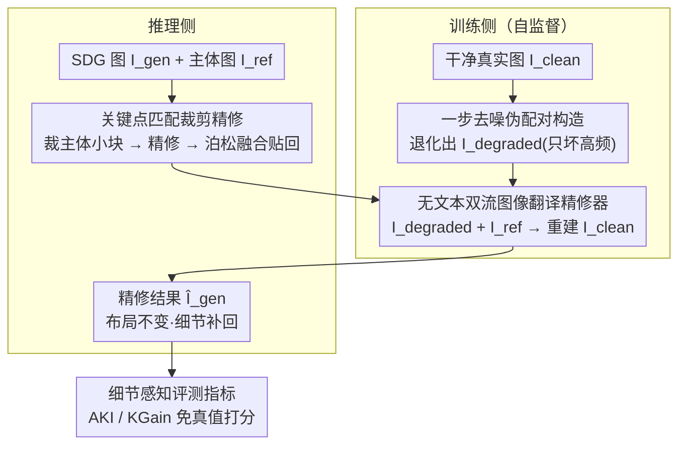

# FlowFixer: Towards Detail-Preserving Subject-Driven Generation

**会议**: CVPR 2026  
**论文**: [CVF Open Access](https://openaccess.thecvf.com/content/CVPR2026/html/Jun_FlowFixer_Towards_Detail-Preserving_Subject-Driven_Generation_CVPR_2026_paper.html)  
**代码**: 无  
**领域**: 扩散模型 / 主体驱动生成  
**关键词**: 主体驱动生成, 细节保真, 自监督伪配对, 一步去噪, 关键点匹配评测

## 一句话总结
FlowFixer 是一个「模型无关、零文本提示」的精修器：它不重新生成场景，而是拿任意主体驱动生成（SDG）模型吐出的图当输入、原始主体图当参考，用纯图到图的双流扩散把丢失的 logo、文字、纹理这些高频细节补回来；训练数据靠「一步去噪」自监督地把干净图退化成「只坏细节、不坏布局」的伪配对，再配上基于关键点匹配的免真值评测指标（AKI / KGain），在三种主流 SDG 主干上把主体保真度刷到新高（平均 KGain 77.3%，人评胜率压倒一切对手）。

## 研究背景与动机
**领域现状**：主体驱动生成（SDG）要把一个给定主体（参考图）塞进文本描述的新场景里，同时保住主体身份。现在主流是两条路——按主体微调（DreamBooth、Textual Inversion、Custom Diffusion 的 LoRA），每个主体都要单独训，贵；以及编码器注入（IP-Adapter、BLIP-Diffusion、OminiControl），把参考图特征喂进扩散骨干，免逐主体微调。

**现有痛点**：这些方法对简单纹理的主体（动物、素色物体）已经做得不错，但对**商业级细节**——商品 logo、小字、复杂花纹——保真度全线崩。广告里 logo 一变品牌就废了，文字一糊图就不能用。根因有两层：(1) 高质量配对训练数据极难收集，理想上需要「同一主体 + 多样真值场景」的三元组，现有的 Subjects200K 是合成图，细节对齐本身就不真；(2) 现有条件机制表达力不够——文字提示只能给「红色跑车」这种粗语义，说不清姿态/朝向/光照；连深度图、边缘图这类图像条件也偏向全局场景一致，会牺牲纹理丰富区的高频信息。

**核心矛盾**：从零生成（generation）天然要在「全局合理性」和「局部高频保真」之间妥协，文本条件的模糊性又把天平进一步推向全局可信、牺牲细节。想靠改进生成本身去保细节，是在跟扩散模型的归纳偏置硬刚。

**本文目标**：换个思路——不碰上游生成，把它当黑盒，事后做一道「最后一公里」的精修；同时要解决配对数据稀缺、和细节级评测缺失两个工程障碍。

**切入角度**：作者的关键观察是，SDG 的失真**集中在高频细节、几乎不动全局结构**。那么精修任务就可以被构造成自监督的：拿一张干净真实图，人为制造一份「细节坏了但布局没动」的退化版，让模型学着从参考把细节补回去，根本不需要真三元组。

**核心 idea**：用「一步去噪」合成只坏高频的伪配对数据，训一个**无文本、参考图到生成图的双流扩散精修器**，把 detail-preserving 这件事从「生成时保住」改成「生成后补回」。

## 方法详解

### 整体框架
FlowFixer 把问题写成一个无文本的条件扩散精修：给定上游任意 SDG 模型生成的图 $I_{gen}$ 和原始主体参考图 $I_{ref}$，从噪声 $z_1\sim p_s$ 出发，求 $\hat I_{gen}=D_{refine}(z_1, I_{gen}, I_{ref})$，要求输出**保住 $I_{gen}$ 的全局布局**、同时把 $I_{ref}$ 里的主体细节恢复回去。整个系统分训练侧和推理侧两条线：训练侧靠「一步去噪」凭空造出大量「退化-干净」伪配对来监督精修器；推理侧拿真实 SDG 输出走精修器，并用「裁主体小块再精修后贴回」的方式省算力。三处贡献——伪配对构造、双流精修器、裁剪精修——加上一套配套的细节感知评测指标，构成完整方法。

### 关键设计

**1. 一步去噪伪配对构造：凭空造出「只坏细节、不坏布局」的训练对**

精修器最缺的训练信号是「主体细节被破坏、但全局结构不变」的配对，而真实采集这种三元组几乎不可能。作者用一步去噪自监督地伪造：从干净真实图 $I_{clean}$ 出发，先做一步前向扩散加噪，再用现成扩散模型（SDXL）做**单步去噪**，得到退化版 $I_{degraded}$。关键在于通过把 $I_{clean}$ 在 VAE 编码前下采样到 $1.0\times/0.5\times/0.25\times$ 三档来控制退化强度——下采样越狠，单步去噪要「脑补」的高频越多，失真越大，恰好模拟了 SDG 在尺度/视角变化下丢细节的行为。作者用同一张图换 10 个随机种子跑这个退化、算逐像素方差图，发现方差**集中在高频区、平滑背景几乎不动**（Figure 4），证实这套退化确实只伤细节、不动全局——这正是让自监督成立的前提。训练时把 $I_{degraded}$ 当作 $I_{gen}$ 输入，参考 $I_{ref}$ 则取 $I_{clean}$ 的空间扰动版（随机裁剪/旋转/轻微调色，反过来也行），逼模型靠**局部对应关系**恢复细节，而不是靠像素级严格对齐去抄。

**2. 无文本双流图像翻译精修器：用图当条件，绕开语言的模糊**

文本提示的根本缺陷是它只给粗语义、给不了精确视觉线索，所以作者干脆把文本通道砍掉，做纯图到图的翻译。精修器基于 FLUX.1-Kontext 改造，丢弃原始文本 token、新增一路图像输入，于是网络吃三个东西：噪声 $z_1$、生成图 $I_{gen}$、参考图 $I_{ref}$。$I_{gen}$ 和 $I_{ref}$ 被预训练 VAE 编码成 latent token，和 $z_1$ 拼接后送进 DiT 骨干。为了在让三路做全交叉注意力的同时还保持流的可区分，作者用 **3D RoPE 配每路独立的 timestep 偏移**（$z_1$ 为 0、$I_{gen}$ 为 1、$I_{ref}$ 为 2）——这等于给每条流盖了个不同的位置编码「时间戳」，模型既能跨流找 $I_{gen}$ 与 $I_{ref}$ 之间的稠密对应、又不会把三路混成一锅。这种双流共享空间的显式条件机制强制两图对齐，配上设计 1 的自监督伪配对，让精修聚焦在参考引导的局部修复。整个模型用 LoRA（rank 192）微调，训 50K 步、batch 4，损失是精修输出与干净目标之间的 MSE，训练 guidance scale 1.0、推理 2.5；数据用 18,450 张 Unsplash 真实照片构造伪对。

**3. 关键点匹配裁剪精修 + 泊松融合：只修主体、省算力又更清晰**

全分辨率整图精修又慢又吃显存，但 FlowFixer 本来就只改细节、不动背景，所以可以只精修主体那一小块。推理时先用关键点匹配（OmniGlue）在主体图和生成图之间找主体中心，裁出 subject-centric crop，只对这块跑精修，再贴回原图。因为全局结构没动、只是细节被纠正，简单的图像域**泊松融合**就能无缝拼接，不需要用户画 mask、也不需要做 inversion。这一步不只省运行时与显存：实验（Figure 9）显示在同样评测分辨率下，裁剪精修因为算力集中在小区域，对细粒度细节（尤其小字的可读性）的恢复反而**比整图精修更准**。

**4. 细节感知评测指标 AKI / KGain：让「细节有没有补回来」可量化**

CLIP-I、DINOv2 这类相似度只抓全局语义，对高频细节几乎无感；MSE/SSIM 只看低层差异；FID/LPIPS 又常需要真值图——在开放世界生成里真值往往不存在。作者基于「主体保真越好、匹配上的关键点越多」这一观察，提出两个免真值指标。**绝对关键点增量 AKI** 定义为精修前后参考图与生成图之间匹配关键点数的差：$\text{AKI}=N(M(I_{ref},\hat I_{gen}))-N(M(I_{ref},I_{gen}))$，其中 $N(M(a,b))$ 是用匹配网络 $M$ 在 $a,b$ 间匹配上的关键点数，越大说明细节恢复越好。但 AKI 绝对值依赖匹配器标定、跨设置不可直接比，且在大集合上平均时少数大变化会淹没大量小而稳定的改进。于是再定义**关键点匹配增益 KGain**——改善样本所占比例：

$$\text{KGain}=\frac{1}{N}\sum_{i=1}^{N}\delta(\text{AKI}_i,\tau)$$

$\delta$ 是指示函数，当第 $i$ 张图的 $\text{AKI}_i>\tau$ 时取 1、否则取 0，默认阈值 $\tau=0$，以百分比报告。匹配网络用现成的 OmniGlue。这套指标配合人评和 VLM 评判，给细粒度保真提供了可复现、不需真值的度量。

### 损失函数 / 训练策略
训练目标是精修输出 $\hat I_{gen}$ 与干净目标 $I_{clean}$ 之间的 MSE。每次迭代按设计 1 采一对伪配对，并从 $1.0\times/0.5\times/0.25\times$ 三档退化里随机选一档，保证退化强度多样。仅用 LoRA（rank 192）微调 FLUX.1-Kontext，参数开销极小。

## 实验关键数据

评测在自建的 **FidelityBench-258K**（258K 主体-SDG 图对，由 29K 主体图 × Claude 3.5 生成提示 × 三种 SDG 主干各 5 变体过滤而来）和固定子集 **FidelityBench-300** 上进行。对手包括文本编辑（FLUX.1-Kontext）、用同样伪配对数据微调的 OminiControl + FLUX.1-Dev / Kontext。

### 主实验
FidelityBench-258K 上三种 SDG 主干的精修表现（指标越高越好；AKI/KGain 是相对各自基线的变化量，故基线无此两项）：

| SDG 主干 | 方法 | AKI ↑ | KGain ↑ | CLIP-I ↑ | DINO ↑ |
|----------|------|-------|---------|----------|--------|
| FLUX.1-Kontext-Pro | 文本编辑 | 7.5 | 52.7% | 0.763 | 0.647 |
| FLUX.1-Kontext-Pro | OminiControl+F-Dev | 29.0 | 53.9% | 0.724 | 0.551 |
| FLUX.1-Kontext-Pro | **FlowFixer** | **66.5** | **77.9%** | **0.778** | **0.668** |
| Qwen-Image-Edit | 文本编辑 | 11.1 | 54.1% | 0.762 | 0.647 |
| Qwen-Image-Edit | OminiControl+F-Dev | 0.48 | 43.8% | 0.724 | 0.552 |
| Qwen-Image-Edit | **FlowFixer** | **54.0** | **74.8%** | **0.777** | **0.668** |
| Nano-Banana-Edit | 文本编辑 | 61.7 | 77.0% | 0.782 | 0.691 |
| Nano-Banana-Edit | **FlowFixer** | 64.7 | **79.2%** | **0.796** | **0.711** |

FlowFixer 在所有主干上 AKI/KGain 领先，平均 KGain 77.3%，且 CLIP-I/DINO 不掉反持平甚至超基线，说明补细节没破坏全局语义。

### 消融 / 分析实验
FidelityBench-300 上对比原始 SDG 图，并加入 VLM（Claude 3.7）评判胜率：

| 方法 | AKI ↑ | KGain ↑ | VLM ↑ |
|------|-------|---------|-------|
| 文本编辑 | 1.87 | 45.9% | 41.3% |
| OminiControl+F-Dev | 22.7 | 46.6% | 4.2% |
| OminiControl+F-Kontext | 11.1 | 38.4% | 25.2% |
| **FlowFixer** | **67.3** | **91.2%** | **79.0%** |

其它针对性消融：**退化档位**（Figure 8）——只用 $1.0\times$ 训鲁棒性差，加到 $1.0\times/0.5\times/0.25\times$ 全档显著提升对大尺度失真的恢复能力；**裁剪精修**（Figure 9）——同分辨率下裁剪比整图精修对小字可读性恢复更好。

### 关键发现
- **关键点指标抓得到、感知指标抓不到**：FlowFixer 的 AKI/KGain 大幅领先，但 CLIP-I/DINOv2 几乎不变——证明常用感知指标对细粒度结构保真无感，验证了 AKI/KGain 的必要性。
- **一致性是 FlowFixer 的护城河**：OminiControl 变体偶尔能拉高 AKI，但 KGain 常掉到 50% 以下，说明改善是零散的、无稳定规律；散点图（Figure 6）里只有 FlowFixer 呈现一致的正向趋势。
- **文本提示对主体保真几乎没用**：人评里 FlowFixer 对基线、对文本编辑的胜率分别 64.9% / 64.4%，差不多——说明加文本提示对细节保真贡献可忽略，纯图到图才是关键。⚠️ Nano-Banana 上某些方法靠「复制粘贴主体 / 重新生成更大主体」刷高 AKI，但 CLIP-I/DINO 下降，属于评测要警惕的虚高。

## 亮点与洞察
- **「生成后精修」的范式转换**：不跟扩散模型抢着「生成时保细节」，而是把它当黑盒、事后补——这让方法 baseline-agnostic，任何上游 SDG 模型都能直接套，迁移成本极低。
- **一步去噪造伪配对**：用「下采样档位控制退化强度 + 单步去噪」精准模拟 SDG 的高频失真，并用方差图实证「只坏细节不坏布局」，把一个本来要昂贵三元组标注的问题变成纯自监督，是最可复用的 trick。
- **3D RoPE 每路时间戳偏移**：用位置编码上的「时间戳」区分三路输入，既允许全交叉注意力找稠密对应、又防止流间串味——这套多流条件编码思路可迁移到任何需要多图像条件对齐的扩散任务。
- **AKI/KGain 免真值评测**：把「细节有没有补回来」转成「关键点匹配数增没增」，绕开了开放世界缺真值的死结，且与人评/VLM 高度一致。

## 局限与展望
- 作者承认两个方向待补：**多参考精修**（现在只用单张参考）和**用户交互式修正**（如涂鸦 mask 等辅助控制信号）。
- ⚠️ 自建评测指标和自建 benchmark 同出一家，AKI/KGain 与方法的设计动机高度耦合（都围绕关键点匹配），虽有人评/VLM 交叉验证，但在「关键点稀疏的主体」上指标是否仍可靠存疑。
- 伪配对的退化由 SDXL 单步去噪模拟，与真实 SDG 主干（FLUX/Qwen/Nano-Banana）的失真分布未必完全一致，存在训练-测试退化分布的潜在 gap。
- 裁剪精修依赖关键点匹配定位主体，若主体在生成图里被严重改写或遮挡、匹配失败，裁剪与泊松融合都会受影响。

## 相关工作与启发
- **vs DreamBooth / Textual Inversion / Custom Diffusion**：它们逐主体微调（3-5 张参考）保身份但贵；FlowFixer 不碰生成、只做事后精修，免逐主体训练，一个精修器服务所有主体。
- **vs IP-Adapter / BLIP-Diffusion / OminiControl**：这些编码器注入法擅长高层细节、却保不住低层结构细节；FlowFixer 专补丢失的低频结构细节，定位为「最后一公里」补丁，可叠在它们之上。
- **vs 基于编辑的方法（全局/局部编辑）**：传统编辑要 mask 或文本条件、且常牺牲主体细节；FlowFixer 全自动、无 mask、无文本，靠生成图与参考图的跨图对应来修复。

## 评分
- 新颖性: ⭐⭐⭐⭐ 「事后精修 + 一步去噪伪配对 + 免真值关键点指标」三件套组合新颖，但每件单看都建立在成熟组件上
- 实验充分度: ⭐⭐⭐⭐ 三主干、258K benchmark、人评 + VLM + 散点分析齐全，但指标与方法同源略损说服力
- 写作质量: ⭐⭐⭐⭐ 动机-障碍-方案对应清晰，pipeline 图和退化方差图很有说服力
- 价值: ⭐⭐⭐⭐ 模型无关、即插即用，对广告/电商等细节敏感的商业生成场景实用价值高

<!-- RELATED:START -->

## 相关论文

- [\[CVPR 2026\] Proxy-Tuning: Tailoring Multimodal Autoregressive Models for Subject-Driven Image Generation](proxy-tuning_tailoring_multimodal_autoregressive_models_for_subject-driven_image.md)
- [\[CVPR 2026\] Scone: Bridging Composition and Distinction in Subject-Driven Image Generation via Unified Understanding-Generation Modeling](scone_bridging_composition_and_distinction_in_subject-driven_image_generation_vi.md)
- [\[CVPR 2026\] Say Cheese! Detail-Preserving Portrait Collection Generation via Natural Language Edits](say_cheese_detail-preserving_portrait_collection_generation_via_natural_language.md)
- [\[CVPR 2026\] HiFi-Inpaint: Towards High-Fidelity Reference-Based Inpainting for Generating Detail-Preserving Human-Product Images](hifi-inpaint_towards_high-fidelity_reference-based_inpainting_for_generating_det.md)
- [\[CVPR 2026\] Disentangling to Re-couple: Resolving the Similarity-Controllability Paradox in Subject-Driven Text-to-Image Generation](disentangling_to_re-couple_resolving_the_similarity-controllability_paradox_in_s.md)

<!-- RELATED:END -->
