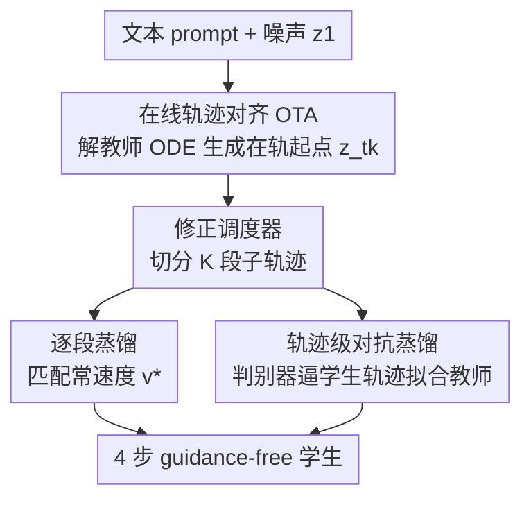

# FlowSteer: Guiding Few-Step Image Synthesis with Authentic Trajectories

**会议**: CVPR 2026  
**论文**: [CVF Open Access](https://openaccess.thecvf.com/content/CVPR2026/html/Ke_FlowSteer_Guiding_Few-Step_Image_Synthesis_with_Authentic_Trajectories_CVPR_2026_paper.html)  
**代码**: 无  
**领域**: 扩散模型 / 图像生成  
**关键词**: Few-step 蒸馏, Rectified Flow, 轨迹对齐, 对抗蒸馏, 流匹配  

## 一句话总结
FlowSteer 通过让学生模型沿教师**真实生成轨迹**（而非线性插值）学习，给 ReFlow/PeRFlow 这条被忽视的少步蒸馏路线补上在线轨迹对齐（OTA）+ 轨迹级对抗蒸馏 + 修正调度器三块短板，在 SD3 上 4 步生成质量超过 PCM、Hyper-SD、Flash Diffusion 等主流蒸馏方法。

## 研究背景与动机
**领域现状**：Flow Matching 已成为视觉生成的主流范式，它学的是从噪声到数据的「直线」速度场，理论上几步就能采样。但真实数据映射复杂，学到的轨迹很少是完美直线，所以少步推理仍掉质量。加速方向里 ReFlow 通过反复 reflow 把 ODE 轨迹「拉直」，PeRFlow 进一步把整条轨迹切成 K 段、每段单独拉直做分治。

**现有痛点**：ReFlow 这条线虽然和 Flow Matching 有理论一致性，却长期被社区冷落——实际表现打不过一致性蒸馏（CD）、分布匹配蒸馏（DMD）这些方法。作者要回答：为什么理论自洽的 PeRFlow 实战却不行？

**核心矛盾**：问题出在 PeRFlow 的**训练-推理失配**。PeRFlow 给每一段构造起点 $z_{t_k}$ 时用的是真实图像 $z_0$ 和噪声 $\epsilon$ 的**线性插值**（$z_{t_k}=\sigma_k\epsilon+(1-\sigma_k)z_0$），而真实推理中 $t_k$ 时刻的状态是沿教师非线性速度场一路演化出来的。这个插值点根本不在教师真实轨迹上，导致两个连锁问题：(a) **教师轨迹失配**——教师从一个它推理时永远不会经过的点出发去 denoise，给学生的蒸馏目标是「次优轨迹」；(b) **段间分布失配**——训练时每段都用新插值点初始化，推理时每段却吃上一段的输出，两个分布天然不同，且作者证明只要教师不是完美 Rectified Flow，这种失配就**无法消除**，误差会逐段累积。

**本文目标**：在不放弃 ReFlow 理论一致性的前提下，把 PeRFlow 的少步质量拉到甚至超过 SOTA 蒸馏方法。

**核心 idea**：用教师**真实（authentic）生成轨迹**取代线性插值轨迹来指导学生——既保证教师在轨道上（on-trajectory）产生干净的蒸馏目标，又让训练分布对齐推理分布；再叠加直接作用在 ODE 轨迹上的对抗蒸馏，并修掉调度器里一个被忽视的 bug。

## 方法详解

### 整体框架
FlowSteer 仍走 PeRFlow 的「把轨迹切成 K 段、逐段蒸馏」框架，输入是文本 prompt（在线生成轨迹）、输出是一个 4 步就能出图的 guidance-free 学生模型。它把 PeRFlow 的离线插值数据流换成三件事协同：(1) **OTA** 在线模拟教师自己的推理过程，为每一段生成「在轨」起点 $z_{t_k}$，根治训练-推理失配；(2) **轨迹级对抗蒸馏**用一个 DiT-backbone + 判别头的判别器，逼学生的 4 步轨迹在感知上贴近教师的多步轨迹；(3) 整条子轨迹的切分都建在**修正后的调度器**上（教师、学生共用），消除少步下最后一步「跳到 0」的尺度错位。三者的次序是：先有在轨数据（OTA），对抗与调度器才能真正发挥作用。

### 关键设计

**1. 在线轨迹对齐 OTA：让起点落在教师真实轨迹上**

这是 FlowSteer 的灵魂，直接针对前面的「教师轨迹失配 + 段间分布失配」。PeRFlow 给第 $k$ 段构造起点用静态插值 $z_{t_k}=(1-t_k)z_0+t_k\epsilon$（Algorithm 1 第 5 行标注 *Off-Trajectory*）；OTA 改成在线解教师的概率流 ODE，从初始噪声 $z_1\sim\mathcal{N}(0,I)$ 一路积分到时刻 $t_k$：

$$z_{t_k} = z_1 + \int_{1}^{t_k} v_T(z(s), s)\, ds$$

也就是 Algorithm 2 第 5 行的 `ODESolve(vT, ε, 1, tk)`（标注 *On-Trajectory*）。这样起点 $z_{t_k}$ 真正躺在教师的生成轨迹上，带来两个直接收益：其一，教师从一个它推理时确实会经过的点出发演化到 $z_{t_{k-1}}$，给学生的目标速度 $v^*=(z_{t_{k-1}}-z_{t_k})/(t_{k-1}-t_k)$ 来自教师未被破坏的真实动力学；其二，训练时起点分布 = 推理时各段中间态分布，段间失配被闭合，误差不再逐段累积。代价是每段都要在线跑一次教师 ODE 生成起点，多花算力，但作者认为这是抑制误差传播、换取高保真蒸馏的必要权衡。作者用一个针对性实验佐证失配确实存在（表 1）：教师从真实轨迹推理 vs 从插值点起跑最后 8 步，PickScore/HPSv2 明显下降。

**2. ODE 轨迹上的对抗蒸馏：逼学生轨迹在感知上贴住教师**

对抗蒸馏在 few-step 蒸馏里早被验证有效，但从没人把它用在 ReFlow 轨迹上。作者直接在教师与学生的**轨迹**之间施加对抗损失：判别器复用一个预训练扩散模型的 backbone，按 LADD 在其上加判别头。学生 $v_S$ 当生成器，在离散时间步集合 $T_S=\{t_1,t_2,t_3,t_4\}$ 上按概率 $p(t)$ 采样时间步，目标是最大化判别器对自己生成状态 $z_t^S$ 的打分：

$$\mathcal{L}_{adv} = -\,\mathbb{E}_{z_t^S\sim v_S,\, t\sim p(t)}\big[D(z_t^S, t)\big]$$

为稳定训练再加一项特征匹配损失，最小化学生/教师状态在判别器第 $l$ 层特征图 $D_l$ 上的 L2 距离：$\mathcal{L}_{FM}=\sum_{l=1}^{L}\mathbb{E}\big[\lVert D_l(z_t^T,t)-D_l(z_t^S,t)\rVert^2\big]$。学生总目标是蒸馏损失、对抗损失、特征匹配损失的加权和：$\mathcal{L}_{student}=\mathcal{L}_{dist}+\lambda_{adv}\mathcal{L}_{adv}+\lambda_{FM}\mathcal{L}_{FM}$。注意对抗能起效的前提正是 OTA 提供的在轨数据——只有教师/学生状态都在真实轨迹上，逐状态比对才有意义。

**3. 修正 FlowMatchEulerDiscreteScheduler：补上少步下被忽视的 bug**

这是个「几行代码」的发现，却贡献了最大单项增益。标准调度器先铺 1000 个时间步，做 N 步推理时从中采 N 个点，再**单独**把终态 $\sigma=0$ 拼到末尾。问题在于：最后一个采样 $\sigma$ 跳到 0 的步长和其他步**不成比例**——比如 shift=3 时，从 $\sigma=0.0089$ 直接跳到 0，这一跳在少步下严重掉质量。修法是：铺完 1000 步后**先**把终态 $\sigma=0$ 加进调度，再对 N 步推理在这条「已含终点」的完整范围上线性采 $N+1$ 个点，使包括最后一步在内的所有步长都按比例缩放。表 2 显示：步数多时新旧调度器几乎无差，但步数越少（尤其 N=4）新调度器在 PickScore/HPSv2 上优势越明显——它对蒸馏这种几乎只在少步场景推理的任务特别合适，且对未蒸馏的预训练模型同样有效。

### 损失函数 / 训练策略
- 蒸馏骨架沿用 PeRFlow 的逐段常速度匹配 $\mathcal{L}=\sum_k\mathbb{E}\int_{t_{k-1}}^{t_k}\lVert v_\theta(z_t,t)-v^*\rVert^2 dt$，但起点 $z_{t_k}$ 改为 OTA 在线生成。
- 学生总损失 $\mathcal{L}_{student}=\mathcal{L}_{dist}+\lambda_{adv}\mathcal{L}_{adv}+\lambda_{FM}\mathcal{L}_{FM}$，对抗用 Hinge Loss 最稳。
- 基座为 SD3-Medium / SD3.5-Large（均为 MMDiT），用 LoRA 高效微调；训练 prompt 取自 FluxReason-6M，轨迹在线生成。
- 配合 **CFG 蒸馏**：教师 CFG scale 在 $U[7,13]$ 间采样，学生固定 $\omega=0$，把文本引导「烤」进权重，推理时省掉 CFG 的双次前向。主实验聚焦 4 步蒸馏。

## 实验关键数据

### 主实验
COCO 10k + GenEval，NFE=4（PCM/Hyper-SD 因带 CFG 实际是 4×2）。

| 方法 (SD3-Medium) | NFE | PickScore↑ | HPSv2↑ | CLIP↑ | GenEval Overall↑ |
|------|-----|-----------|--------|-------|------------------|
| SD3-Medium 预训练 | 20×2 | 22.41 | 28.02 | 32.78 | 0.6639 |
| PCM (Shift=3) | 4×2 | 22.28 | 27.68 | 32.05 | 0.6339 |
| Hyper-SD | 4×2 | 22.28 | 28.04 | 32.31 | 0.6336 |
| Flash Diffusion | 4×1 | 22.37 | 27.35 | 32.51 | 0.6672 |
| PeRFlow† | 4×1 | 22.19 | 26.36 | 32.55 | 0.6357 |
| **FlowSteer (本文)** | 4×1 | **22.39** | **28.60** | **32.81** | **0.6859** |

- HPSv2 从 PeRFlow 的 26.36 拉到 28.60，GenEval 总分 0.6357→0.6859，且本文只需单次前向（4×1）就压过需双次前向（4×2）的 PCM/Hyper-SD。
- SD3.5-Large 上同样大幅超 PeRFlow†（HPSv2 27.14→28.47，GenEval 0.6439→0.6780），证明方法可迁移到更大基座。

### 消融实验
关键组件增量消融（表 5，SD3-Medium，4 步）：

| 配置 | PickScore↑ | HPSv2↑ | 说明 |
|------|-----------|--------|------|
| Baseline (PeRFlow) | 22.19 | 26.36 | 起点 |
| + OTA | 22.23 | 26.79 | 单独增益温和，但提供「在轨」数据地基 |
| + Adv. Distillation | 22.18 | 27.73 | 显著拉高 HPSv2 |
| + Scheduler | 22.50 | 27.75 | 单项增益最大 |
| **Ours (Full)** | 22.39 | **28.60** | 三件协同 |

判别器配置消融（表 4）：12-block backbone 最优；判别头放最后一层（全局判断）优于逐 block；backbone 需**全量微调**（优于 Frozen/LoRA）；GAN loss 用 **Hinge** 最稳。时间步采样概率（表 6）选 $\{0.4,0.2,0.2,0.2\}$ 偏重第一步。

### 关键发现
- 修正调度器是「单项增益最大」的组件——一个几行代码的 bug 修复，价值常被整个少步蒸馏社区忽视。
- OTA 单独看涨点温和，但作者强调它是 FlowSteer 的**核心思想**：它提供的「在轨」数据是对抗与调度器能协同生效的前提，三者是耦合而非简单叠加。
- 教师插值起点确实掉质量（表 1：从 t=24 插值点跑最后 8 步，PickScore/HPSv2 双降），定量坐实了「训练-推理失配」假设。

## 亮点与洞察
- **「authentic trajectory」这个切入点很准**：把 ReFlow 实战不行的锅精确定位到「训练用插值起点、推理用演化起点」的分布失配，再用在线解 ODE 直接对齐，是漂亮的诊断+对症下药。
- **对抗蒸馏从「输出分布」搬到「轨迹」**：以往对抗蒸馏对齐的是最终输出分布，本文逐状态对齐整条 ODE 轨迹，配合特征匹配，把感知一致性下沉到中间态。
- **调度器 bug 的发现极具复用性**：FlowMatchEulerDiscreteScheduler 是 diffusers 里被广泛使用的标准件，这个「最后一步跳 0 不成比例」的修正对任何少步推理（含未蒸馏模型）都直接可用，迁移成本几乎为零。

## 局限与展望
- 实验只在 SD3-Medium / SD3.5-Large（MMDiT）上验证，未覆盖 SDXL/UNet 类或视频生成，可迁移性待考。
- OTA 需在线解教师 ODE 生成每段起点，训练算力显著高于离线插值的 PeRFlow，作者承认这是「有原则的权衡」但未给出具体训练开销数字。⚠️ 论文未量化训练耗时，以原文为准。
- 段间分布失配的「不可消除性」证明放在补充材料（正文标注 Supplementary ??），正文只给结论，严谨性需看附录。
- 主要聚焦 4 步；2 步/1 步等更极端少步下的表现未充分展开。

## 相关工作与启发
- **vs PeRFlow**：同走「切段逐段拉直」分治框架，但 PeRFlow 用线性插值造每段起点（off-trajectory），FlowSteer 用在线 ODE 解出在轨起点 + 对抗 + 修调度器；本文把 PeRFlow 的 HPSv2 从 26.36 提到 28.60，是直接的「补短板」式工作。
- **vs CD / PCM / Hyper-SD**：一致性蒸馏路线强制轨迹上点到终点的一致映射；FlowSteer 走 ReFlow 路线、保留与 Flow Matching 的理论一致性，且 4 步单次前向即超过它们的双次前向设置。
- **vs DMD / Flash Diffusion**：DMD 匹配输出分布；本文匹配的是轨迹本身（OTA + 轨迹对抗），更强调「学生轨迹忠实复刻教师轨迹」。
- **vs LADD**：判别器架构（扩散 backbone + 判别头）沿用 LADD，但作用对象从输出搬到 ODE 轨迹各状态。

## 评分
- 新颖性: ⭐⭐⭐⭐ 把 ReFlow 实战短板精确归因到训练-推理轨迹失配并用在线对齐根治，切入点清晰；对抗与调度器修复偏增量但组合到位。
- 实验充分度: ⭐⭐⭐⭐ 双基座主实验 + 多维消融（组件/判别器/时间步）扎实，但局限于 SD3 系，缺训练开销与更极端少步分析。
- 写作质量: ⭐⭐⭐⭐ 问题诊断（图 1/2 + 表 1）层层递进，Algorithm 1/2 对照清晰；个别细节（失配证明、调度器伪码）外放补充材料。
- 价值: ⭐⭐⭐⭐ 复活了被忽视的 ReFlow 蒸馏路线，调度器修复可零成本复用，对少步图像生成实用价值高。

<!-- RELATED:START -->

## 相关论文

- [\[CVPR 2026\] LeapAlign: Post-Training Flow Matching Models at Any Generation Step by Building Two-Step Trajectories](leapalign_post_training_flow_matching_models_at_any_generation_step.md)
- [\[CVPR 2026\] Uni-DAD: Unified Distillation and Adaptation of Diffusion Models for Few-step Few-shot Image Generation](uni-dad_unified_distillation_and_adaptation_of_diffusion_models_for_few-step_few.md)
- [\[CVPR 2026\] BiFM: Bidirectional Flow Matching for Few-Step Image Editing and Generation](bifm_bidirectional_flow_matching_for_few-step_image_editing_and_generation.md)
- [\[CVPR 2026\] WaDi: Weight Direction-aware Distillation for One-step Image Synthesis](wadi_weight_direction-aware_distillation_for_one-step_image_synthesis.md)
- [\[CVPR 2026\] Few-Step Diffusion Sampling Through Instance-Aware Discretizations](few-step_diffusion_sampling_through_instance-aware_discretizations.md)

<!-- RELATED:END -->
