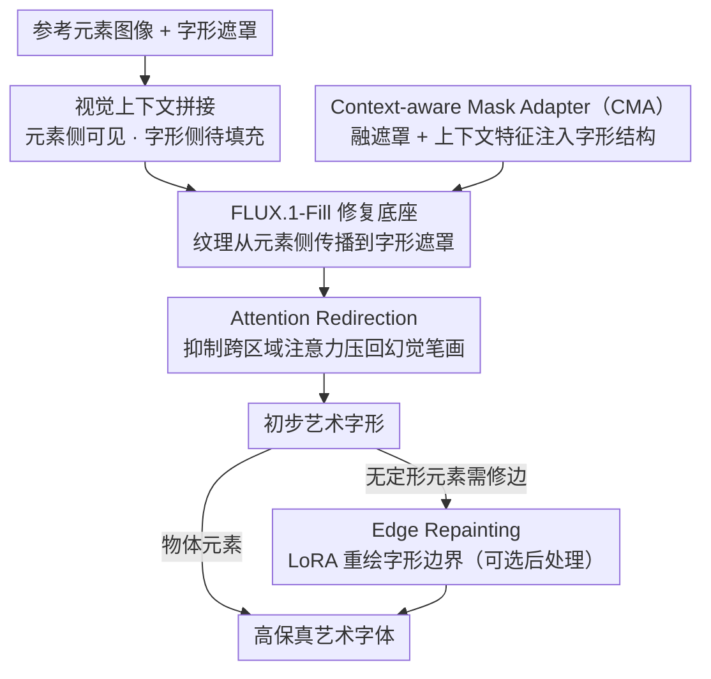

# FontCrafter: High-Fidelity Element-Driven Artistic Font Creation with Visual In-Context Generation

**会议**: CVPR 2026  
**arXiv**: [2603.22054](https://arxiv.org/abs/2603.22054)  
**代码**: 无  
**领域**: 扩散模型 / 图像生成  
**关键词**: 艺术字体生成, 元素驱动, 视觉上下文生成, 图像修复, 风格控制

## 一句话总结
FontCrafter 将艺术字体生成重新定义为视觉上下文生成任务，通过将参考元素图像与空白画布拼接并输入预训练修复模型(FLUX.1-Fill)，实现高保真的元素驱动字体创建，在纹理和结构保真度上显著超越现有方法。

## 研究背景与动机

1. **领域现状**：艺术字体生成旨在根据参考风格合成风格化字形。现有方法主要分两大范式：基于GAN的特征融合方法和基于扩散模型+适配器(如IP-Adapter)的零样本方法。
2. **现有痛点**：GAN方法受限于模型容量和小规模简单纹理训练数据，泛化能力差；扩散方法通过Style Adapter仅捕获全局特征，忽略像素级细节，导致生成结果难以精确匹配参考风格。两类方法都只支持粗粒度控制(颜色/整体风格)。
3. **核心矛盾**：高保真地同时保留参考元素的纹理和结构信息，在风格多样性和精细控制之间难以兼顾。
4. **本文目标** (a) 如何实现像素级的元素风格迁移，而非仅迁移全局语义？(b) 如何用轻量方式控制字形形状？(c) 如何避免背景区域出现幻觉笔画？
5. **切入角度**：作者从图像修复模型(FLUX.1-Fill)的"上下文传播"能力出发——修复模型能将可见区域的视觉线索传播到遮罩区域。利用这一特性，将元素图像作为可见上下文、字形区域作为遮罩区域，自然实现风格迁移。
6. **核心 idea**：将艺术字体生成表述为视觉上下文修复任务，让参考元素在像素空间直接"填充"字形区域。

## 方法详解

### 整体框架
这篇论文要解决的是"元素驱动的艺术字体生成"：给一张参考元素图像（如一簇花、一块石头）和一个字形遮罩，把元素的纹理和结构高保真地"长"进字形里。FontCrafter 的核心洞察是把这件事当成一道图像修复题——修复模型（FLUX.1-Fill）天生擅长把可见区域的视觉线索传播到遮罩区域，那就把参考元素当作可见上下文、字形区域当作待填充的遮罩，让风格在像素空间直接被"填"进去。

具体怎么转：把参考元素图像和一张空白画布在像素空间水平拼接成一张输入图，对应的字形遮罩也和一块全零区域拼成同样布局；这张拼接图喂进 FLUX.1-Fill，修复时元素那一侧的纹理就被传播到空白侧的字形遮罩里。在这个底座之上，三个附加组件分别补三块短板：CMA 注入字形结构、Attention Redirection 把跑到背景的幻觉笔画压回去、Edge Repainting 把字形边界修得更自然。

### 关键设计

**1. Context-aware Mask Adapter（CMA）：让形状控制信号"看得见"参考元素**

字形遮罩本身只描述轮廓，如果光拿遮罩去生成控制信号，那这个信号和参考元素就毫无关系——可同一个字形换成花朵元素和换成石头元素，理应长出完全不同的结构纹理。CMA 的做法是在每个 MM-DiT 块的末端插一个轻量模块（两层线性层夹一个 GELU），把下采样后的字形遮罩与该块的输出特征沿通道维拼起来一起输入，第一层把通道压到 64 维、第二层再升回原维度。关键在于它融了"上下文特征"——控制信号因此带上了元素感知能力，能针对不同参考元素自适应地给出结构引导。这套设计只占模型 0.5% 的参数（22.4M），却比独立的 ControlNet（743.81M）控形更准，印证了"任务特定信息 + 上下文感知"比"堆一个大控制网络"更划算。

**2. Attention Redirection：在推理时把幻觉笔画"按"回遮罩内**

修复模型有时会手滑，在字形区域之外也生成多余内容，也就是幻觉笔画。AR 不训练、纯在推理时改注意力来治这个病：定义一个抑制矩阵 $M_{attenuate} \in \mathbb{R}^{L \times L}$，当 token $i$ 落在字形背景区域、而 token $j$ 落在参考前景区域时把对应位置标 1，然后在自注意力里改写 logits

$$\hat{A} = A + M_{attenuate} \cdot \log_e(\lambda),\quad \lambda \in (0,1)$$

这等价于把"参考前景 → 字形背景"这条跨区域注意力的权重统一乘上 $\lambda$ 倍。$\lambda$ 越小，背景吸收参考风格的通道就越被掐断，风格迁移于是被限制在该有笔画的遮罩区域内。这个旋钮还顺带带来一个能力：调节不同参考区域的注意力强弱，就能做区域感知的风格混合。

**3. Edge Repainting：给字形边界补上"参考元素该有的毛边"**

推理时的字形遮罩取自标准字体库，轮廓均匀又整洁，可参考元素若是云、火焰这类无定形物体，模型一旦死守这条干净边界，边缘就会光滑得很假。Edge Repainting 在字形轮廓周围划一圈窄遮罩，用微调过的 FLUX.1-Fill LoRA 只重建这一圈，让它借周围的视觉上下文把边界细节恢复成与参考风格一致的样子（该毛糙的地方毛糙）。它是一个可选的后处理步骤，专治无定形元素的边界违和。

### 损失函数 / 训练策略
使用flow matching loss训练，学习率 $1 \times 10^{-4}$。对所有MM-DiT块的线性层施加LoRA微调，CMA模块与LoRA联合训练。由于无定形元素和物体元素差异大，为两类元素使用独立的LoRA和CMA参数。训练时文本输入为空(参考图像已提供充分风格条件)。训练数据通过随机裁剪纹理patch(无定形元素)或拼接分割物体实例(物体元素)构建，并引入字形组合和旋转增强结构多样性。

## 实验关键数据

### 主实验

| 方法 | 类型 | FID↓ | CLIPIm↑ | FIDp↓ | 一致性↑ | 可读性↑ | SR↑ |
|------|------|------|---------|-------|---------|---------|------|
| StyleAligned | Object | 200.3 | 0.70 | 291.2 | 78.8 | 2.5 | 73.2 |
| FontStudio | Object | 205.4 | 0.75 | 271.3 | 80.6 | 4.0 | 72.6 |
| **FontCrafter** | **Object** | **127.5** | **0.91** | **190.6** | **94.2** | **93.5** | **92.0** |
| StyleAligned | Amorphous | 227.9 | 0.74 | 304.2 | 82.6 | 4.0 | 85.2 |
| FontStudio | Amorphous | 225.2 | 0.73 | 283.1 | 89.4 | 6.5 | 84.8 |
| **FontCrafter** | **Amorphous** | **128.3** | **0.92** | **193.4** | **92.4** | **89.5** | **96.6** |

### 消融实验

| 控制方式 | 类型 | 参数量 | FID↓ | CLIPIm↑ | FIDp↓ | 一致性↑ | 可读性↑ |
|---------|------|--------|------|---------|-------|---------|---------|
| w/ ControlNet | Object | 743.81M | 193.2 | 0.74 | 252.1 | 68.4 | 82.2 |
| w/ T2I-Adapter | Object | 79.03M | 183.1 | 0.75 | 246.2 | 81.2 | 86.8 |
| w/ IP-Adapter | Object | - | 213.2 | 0.71 | 283.2 | 62.2 | 89.0 |
| **Ours (CMA)** | **Object** | **22.4M** | **127.5** | **0.91** | **190.6** | **92.0** | **94.2** |

### 关键发现
- CMA仅用22.4M参数即超越ControlNet(743.81M)和T2I-Adapter(79.03M)，参数效率提升33倍
- IP-Adapter仅提供粗粒度控制(颜色和类别特征)，无法保留细粒度纹理和结构；视觉上下文生成策略在CLIPIm上领先0.20
- Attention Redirection中降低抑制因子 $\lambda$ 可渐进消除幻觉笔画而不影响正常笔画
- 方法天然支持跨类别风格混合，且可通过调整参考区域中元素密度控制风格比例

## 亮点与洞察
- **视觉上下文生成的巧妙构思**：将字体生成转化为修复任务，利用修复模型的上下文传播能力实现像素级风格迁移，避免了传统方法依赖文本描述或全局特征的局限性
- **轻量级CMA设计**：通过融合上下文特征与遮罩信息，用极少参数实现优于ControlNet的形状控制，证明了"任务特定信息+上下文感知"比"大规模独立控制网络"更有效
- **无需训练的注意力重定向**：在推理时操纵注意力矩阵即可解决幻觉问题和区域风格控制，可迁移到其他需要区域控制的生成任务中
- **ElementFont数据集**：覆盖6000种元素类型、19000个字形，构建流程系统(LLM生成元素名→DALL·E 3生成→SAM分割→GPT质检)，可作为后续研究的标准数据集

## 局限与展望
- 当前依赖FLUX.1-Fill作为基础模型，模型体量较大，推理速度可能较慢
- 无定形元素和物体元素需要独立的LoRA参数，未实现统一处理
- 论文未讨论中文等复杂字形的大规模定量评估(仅有定性展示)
- Edge Repainting作为可选后处理步骤增加了流水线复杂度
- ElementFont数据集使用DALL·E 3生成，可能包含模型特有的生成偏置
- 论文未评估分辨率限制和每张字形的推理时间

## 相关工作与启发
- **vs FontStudio**: FontStudio使用形状自适应扩散模型但依赖Style Adapter，仅捕获全局风格；FontCrafter通过像素空间拼接实现细粒度控制
- **vs Anything2Glyph**: Anything2Glyph用文本提示控制风格，仅支持粗粒度物体类别控制且背景杂乱(FID高达297.8)；FontCrafter用参考图像提供精细控制(FID降至213.6)
- **vs IP-Adapter**: IP-Adapter通过交叉注意力注入全局特征，无法保留像素级细节；视觉上下文策略在像素空间直接传播视觉线索

## 评分
- 新颖性: ⭐⭐⭐⭐ 将修复模型的上下文传播能力用于字体生成是新颖的视角，但核心技术组件相对标准
- 实验充分度: ⭐⭐⭐⭐ 主实验、消融、用户研究、风格混合、泛化性实验全面
- 写作质量: ⭐⭐⭐⭐ 动机清晰、方法展示直观，ElementFont数据集构建详尽
- 价值: ⭐⭐⭐⭐ 对艺术字体生成领域贡献显著，数据集和方法均有实用价值

<!-- RELATED:START -->

## 相关论文

- [\[CVPR 2026\] PosterOmni: Generalized Artistic Poster Creation via Task Distillation and Unified Reward Feedback](posteromni_generalized_artistic_poster_creation_via_task_distillation_and_unifie.md)
- [\[CVPR 2026\] Evaluating Reasoning Fidelity in Visual Text Generation](evaluating_reasoning_fidelity_in_visual_text_generation.md)
- [\[CVPR 2026\] DiT360: High-Fidelity Panoramic Image Generation via Hybrid Training](dit360_high-fidelity_panoramic_image_generation_via_hybrid_training.md)
- [\[CVPR 2026\] Rethinking Glyph Spatial Information in Font Generation](rethinking_glyph_spatial_information_in_font_generation.md)
- [\[CVPR 2026\] MMFace-DiT: A Dual-Stream Diffusion Transformer for High-Fidelity Multimodal Face Generation](mmface-dit_a_dual-stream_diffusion_transformer_for_high-fidelity_multimodal_face.md)

<!-- RELATED:END -->
