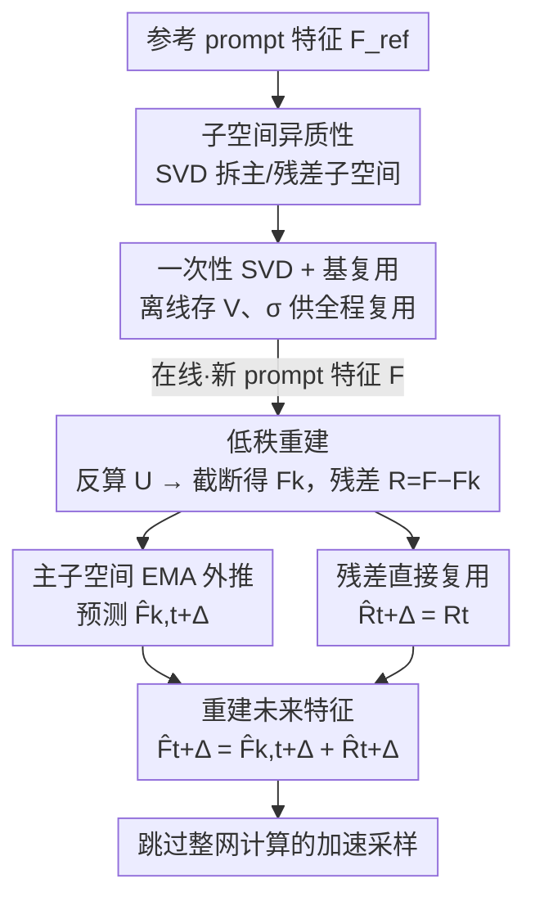

# Forecast the Principal, Stabilize the Residual: Subspace-Aware Feature Caching for Diffusion Transformers

**会议**: CVPR 2026  
**论文**: [CVF Open Access](https://openaccess.thecvf.com/content/CVPR2026/html/Chen_Forecast_the_Principal_Stabilize_the_Residual_Subspace-Aware_Feature_Caching_for_CVPR_2026_paper.html)  
**代码**: https://github.com/BlackMaple1203/SVDCache  
**领域**: 扩散模型  
**关键词**: 特征缓存, 扩散加速, SVD低秩分解, 子空间感知, DiT  

## 一句话总结
针对扩散 Transformer（DiT）的训练无关特征缓存做了一个关键观察——特征空间里只有低秩主子空间随时间平滑可预测、高频残差子空间则抖动难测，于是用 SVD 把特征拆成两部分、对主子空间做 EMA 外推、对残差直接复用，在 FLUX 和 HunyuanVideo 上做到近乎无损的 5.55× 加速。

## 研究背景与动机
**领域现状**：DiT 在图像/视频生成上质量极强，但迭代去噪每步都要跑一遍完整网络，推理成本高得离谱。训练无关的特征缓存（feature caching）是当前最划算的一条加速路线：利用相邻时间步隐藏表征的时间连贯性，把某些时间步的中间特征缓存下来直接复用，甚至外推预测未来特征（DeepCache、FORA、ToCa、TaylorSeer 等）。

**现有痛点**：这些方法都把整个特征空间当成一个匀质的整体来处理——要么对所有维度统一复用，要么对所有维度统一用同一个预测器（如 TaylorSeer 的多项式外推）。它们隐含假设「整个特征空间随时间平滑且可预测」。

**核心矛盾**：DiT 特征是极高维的，要求所有维度上都有一条全局平滑的时间轨迹其实站不住脚。作者把完整特征空间的轨迹用 PCA 画出来（Fig.1a），发现它虽然连贯但明显在振荡——也就是说，对全空间统一外推会被这些振荡维度带偏，预测误差会被放大并随时间步累积。

**切入角度**：如果把特征拆开看会怎样？作者用 SVD 把特征分成一个 rank-$k$ 的主子空间（principal）和一个正交的残差子空间（residual）。主子空间轨迹平滑、能稳定外推；残差子空间则是高频、低能量、内在难以预测。这天然提示一种「分而治之」的策略：在动态稳定的地方做预测，在预测本就不可靠的地方求稳。

**核心 idea**：用「主子空间外推预测 + 残差子空间直接复用」代替「对全空间统一预测」，让缓存既快又稳。

## 方法详解

### 整体框架
SVD-Cache 的核心是：每跑一个需要真实计算的时间步，把该步的特征矩阵 $F$ 投影到一组离线预先算好的 SVD 基上，拆成低秩主成分 $F_k$ 和残差 $R$；对平滑的 $F_k$ 用 EMA 外推到未来若干个被跳过的时间步，对抖动的 $R$ 直接搬过去复用，最后把两者相加重建出未来时间步的特征，从而跳过那些步的完整网络计算。

这里有个让整套方法落地的关键观察：朴素做法需要对每个 prompt 都现场做一次 SVD（昂贵）。但作者发现，对不同 prompt，SVD 分解出的奇异值 $\sigma$ 和右奇异矩阵 $V$ 几乎不变（Fig.1b，相似度 >0.8 即可视为稳定可复用），只有左奇异矩阵 $U$ 会变、而 $U$ 可以从当前特征低成本地反算出来。于是「One-Time SVD」离线做一次、「All-Time Decomposition」在线几乎零额外成本——这是整个框架能真正提速而不是被 SVD 拖垮的前提。

### 关键设计

**1. 子空间异质性：把「全空间统一预测」拆成主/残差区别对待**

这是全文的立论基础，针对的痛点是已有缓存方法对全空间一刀切。作者对一个 DiT block 的特征矩阵 $F \in \mathbb{R}^{N\times D}$ 做 SVD：$F = U\Sigma V^\top$，奇异值降序排列。用累计能量阈值 $\tau$ 选秩 $k$：

$$\frac{\sum_{i=1}^{k}\sigma_i^2}{\sum_{i=1}^{r}\sigma_i^2}\ge\tau$$

取 top-$k$（$k\ll r$）构成 rank-$k$ 近似 $F_k=U_k\Sigma_k V_k^\top$，剩下的就是残差。作者通过 PCA 轨迹可视化论证：主子空间 $F_k$ 随去噪步平滑演化、可外推；残差 $R$ 高频、低能量、时间连贯性弱、外推容易误差放大。正因这两半「动态行为」根本不同，才值得分开处理——稳的地方预测、不稳的地方别硬预测。

**2. 一次性 SVD 与基复用：让在线分解几乎零成本**

如果每个 prompt 都现场 SVD，方法根本提不了速。作者发现奇异值 $\sigma$ 与右奇异矩阵 $V$ 对输入 prompt 近似不变，于是离线在一个参考 prompt 上做一次 SVD，缓存其右奇异矩阵 $V_C\in\mathbb{R}^{D\times r}$ 和奇异值向量 $\sigma_C$。对任意新 prompt 的特征 $F$，不再重算 SVD，而是直接用缓存基反算左奇异矩阵：

$$U = F\,V_C\,\mathrm{diag}(\sigma_C)^{-1}$$

再截断 top-$k$ 得 $F_k = U_k\,\mathrm{diag}(\sigma_{C,k})\,V_{C,k}^\top$，残差 $R = F - F_k$。这一步把「需要 SVD 的分解」换成了「一次矩阵乘 + 截断」，是整套框架能真正省时间的工程关键。

**3. 主子空间 EMA 外推 + 残差直接复用：分而治之的预测策略**

对设计 1 划出的两半，分别用最匹配其动态的处理方式。低秩主特征 $F_{k,t}$ 平滑稳定，用指数滑动平均（EMA）做时间外推，维护 EMA 状态：

$$\hat F_{k,t}=\beta\,\hat F_{k,t-\Delta}+(1-\beta)\,F_{k,t}$$

其中 $\beta\in(0,1)$ 权衡平滑与响应（实验固定 $\beta=0.9$），据此外推下一步 $\hat F_{k,t+\Delta}$。残差 $R$ 时间连贯性弱、强行外推只会放大误差，于是干脆直接复用上一真实步的值 $\hat R_{t+\Delta}=R_t$。最终未来特征由两者相加重建：$\hat F_{t+\Delta}=\hat F_{k,t+\Delta}+\hat R_{t+\Delta}$。消融证明这个「主子空间 EMA + 残差复用」的组合优于「两者都复用」（质量明显下降）和「两者都 EMA」（误差累积），是把可预测性和稳定性同时拿到手的关键。

### 损失函数 / 训练策略
方法是完全训练无关（training-free）的，无需任何重训练或微调，只在推理时插入缓存逻辑。关键超参：能量阈值 $\tau$（最优约 0.85）、EMA 系数 $\beta=0.9$、缓存间隔 $N$（控制每隔多少步做一次真实计算）。

## 实验关键数据

### 主实验
评测设置：文生图用 FLUX.1-dev（DrawBench，指标 ImageReward / CLIP Score / PSNR-SSIM-LPIPS），文生视频用 HunyuanVideo（VBench）。下表为 FLUX.1-dev 上不同加速档位的对比（节选，括号为相对原模型变化）：

| 方法 | Latency(s) ↓ | FLOPs 加速 | ImageReward ↑ | CLIP ↑ |
|------|-------------|-----------|---------------|--------|
| 原模型 (50 步) | 25.82 | 1.00× | 0.9898 | 32.404 |
| TaylorSeer (N=5,O=2) | 7.46 | 4.16× | 0.9768 (-1.31%) | 32.467 |
| FoCa (N=6) | 7.54 | 4.99× | 0.9713 (-1.87%) | 32.922 |
| DuCa (N=9) | 7.27 | 5.39× | 0.8382 (-15.33%) | 31.759 |
| TeaCache (l=1) | 8.19 | 5.01× | 0.8379 (-15.36%) | 31.877 |
| **SVD-Cache (N=5)** | 7.62 | 4.16× | **1.0123 (+2.27%)** | **32.983** |
| **SVD-Cache (N=7)** | 6.43 | **5.55×** | 0.9938 (+0.40%) | 33.144 |
| **SVD-Cache (N=8)** | 4.99 | 6.24× | 0.9769 (-1.31%) | 32.848 |

亮点是在 5.55× 加速下 ImageReward 仍高于原模型（+0.40%），而同档位的 FORA/ToCa/DuCa/TeaCache 已掉到 -15% 以上。文生视频上（HunyuanVideo / VBench）：N=5 时 VBench 80.60、5.00× 加速，几乎追平原模型的 80.66；N=6 时 29.77s 延迟、5.56× 加速、VBench 80.46，超过 DuCa 和 ToCa。

兼容性（Table 3）：叠加量化（FLUX.1-dev-int8，N=5 得 0.9904 ImageReward、PSNR/SSIM/LPIPS 优于量化基线）、步数蒸馏（FLUX.1-schnell，N=3 时 49.87× 加速、0.9463 ImageReward，超过同 NFE 的 TaylorSeer/TeaCache）、稀疏注意力均可叠加，最高在 FLUX.1-schnell 上报到 29.01× 总加速。

### 消融实验
| 配置 | 现象 | 说明 |
|------|------|------|
| 主子空间 EMA + 残差复用（完整） | 最优 | 验证分而治之的设计选择 |
| 两个分量都直接复用 | 质量明显下降 | 主子空间本可预测，却没预测，欠拟合 |
| 两个分量都做 EMA | 误差累积 | 残差强行外推放大误差 |
| 在全空间上预测（不分解） | 不如分解 | Fig.5(a)，印证子空间分解的必要性 |

### 关键发现
- **贡献最大的是「分解 + 区别对待」本身**：只要回到全空间统一预测，性能就掉；EMA 和复用必须分别用在对的子空间上，错配（全复用 / 全 EMA）都会变差。
- **能量阈值 $\tau$ 有最优点（约 0.85）**：$\tau$ 太大会把高频噪声塞进低秩子空间、削弱预测稳定性；$\tau$ 太小则过度收缩子空间、丢掉本质结构。
- **低秩时间行为是跨架构普适的**：作者在 FLUX.1-dev、Qwen-Image、HunyuanVideo 上都验证了 Fig.1 的低秩可预测/残差抖动现象，说明这不是某个模型的偶然。
- **在更激进的加速档位优势更明显**：低加速档大家都还行，但 5.5× 以上时基线纷纷崩坏、SVD-Cache 仍近乎无损，分而治之对误差累积的抑制在高压下才真正体现价值。

## 亮点与洞察
- **「不是所有维度都该被预测」这个视角很巧**：把缓存的失败归因从「预测器不够强」转向「有些维度本就不可预测」，于是对症下药——可预测的外推、不可预测的复用，而不是造一个更复杂的全空间预测器。
- **奇异值与右奇异矩阵对 prompt 近似不变**，这个经验观察直接把「每 prompt 一次 SVD」降成「离线一次 + 在线一次矩阵乘」，是方法能真正提速的工程命脉，可复用到其他需要在线低秩分解的场景。
- **完全训练无关且可与量化/蒸馏/稀疏注意力正交叠加**，意味着它能当作一个即插即用层叠加在已有加速栈之上，迁移成本极低。

## 局限与展望
- 「奇异值/右奇异矩阵 prompt 不变」是经验观察，作者也承认在极端情形（如无意义 prompt）会有例外（Fig.7），分解基的失配会带来多大误差缺乏定量边界。⚠️ 以原文为准。
- 秩 $k$ 由全局能量阈值 $\tau$ 选定，是否对不同 block / 不同时间步该用不同的 $k$、用统一 $\tau$ 是否次优，论文未深入探讨。
- 残差「直接复用」是最保守的处理，是否存在介于「复用」和「EMA」之间、对残差做轻度平滑能进一步提质的中间方案值得一试。

## 相关工作与启发
- **vs TaylorSeer**：TaylorSeer 是「cache-then-forecast」的代表，用多项式外推对整个特征序列统一预测；SVD-Cache 指出全空间统一外推会被残差振荡带偏，改成只对主子空间外推、残差复用，在 5.5× 档位上把 TaylorSeer 的可见伪影/闪烁压下去。
- **vs FORA / ToCa / DuCa / TeaCache**：这些方法在缓存粒度和更新频率上做文章，但都默认全空间可缓存；SVD-Cache 的区别在于先按 SVD 子空间把特征「分类」再决定缓存策略，因此在高加速比下质量退化远小于它们。
- **vs 量化/蒸馏/剪枝等模型压缩**：那条线是改网络本身、常需重训练；SVD-Cache 是正交的、训练无关的，且能叠加在这些技术之上进一步提速。

## 评分
- 新颖性: ⭐⭐⭐⭐⭐ 「主/残差子空间动态异质」是对特征缓存失败根因的全新且有说服力的解释，分而治之的策略直接由此导出。
- 实验充分度: ⭐⭐⭐⭐⭐ 覆盖图像/视频两类任务、多种加速档位，并验证与量化/蒸馏/稀疏注意力的兼容性及跨架构普适性。
- 写作质量: ⭐⭐⭐⭐ 观察—假设—方法链条清晰，公式与图示对应良好；部分表格信息密但叙述到位。
- 价值: ⭐⭐⭐⭐⭐ 训练无关、即插即用、可叠加现有加速栈，在 5.55× 近无损这一实用区间有直接落地价值。

<!-- RELATED:START -->

## 相关论文

- [\[CVPR 2026\] ResCa: Residual Caching for Diffusion Transformers Acceleration](resca_residual_caching_for_diffusion_transformers_acceleration.md)
- [\[AAAI 2026\] ProCache: Constraint-Aware Feature Caching with Selective Computation for Diffusion Transformer Acceleration](../../AAAI2026/image_generation/procache_constraint-aware_feature_caching_with_selective_computation_for_diffusi.md)
- [\[CVPR 2026\] SenCache: Accelerating Diffusion Model Inference via Sensitivity-Aware Caching](sencache_accelerating_diffusion_model_inference_via_sensitivity-aware_caching.md)
- [\[CVPR 2026\] Adaptive Spectral Feature Forecasting for Diffusion Sampling Acceleration](adaptive_spectral_feature_forecasting_for_diffusion_sampling_acceleration.md)
- [\[CVPR 2026\] LESA: Learnable Stage-Aware Predictors for Diffusion Model Acceleration](lesa_learnable_stage-aware_predictors_for_diffusion_model_acceleration.md)

<!-- RELATED:END -->
