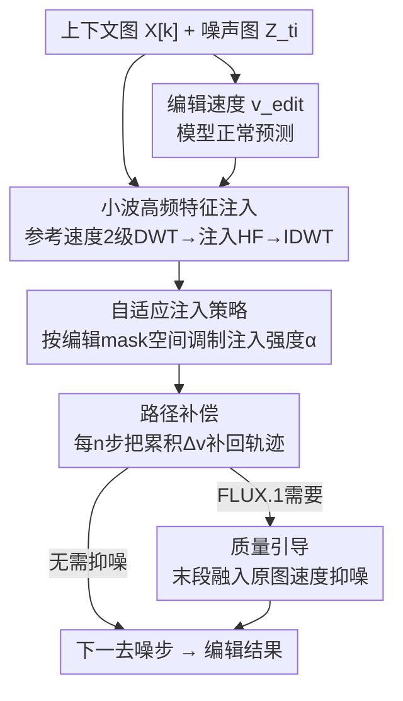

# FreqEdit: Preserving High-Frequency Features for Robust Multi-Turn Image Editing

**会议**: CVPR 2026  
**论文**: [CVF Open Access](https://openaccess.thecvf.com/content/CVPR2026/html/Liao_FreqEdit_Preserving_High-Frequency_Features_for_Robust_Multi-Turn_Image_Editing_CVPR_2026_paper.html)  
**代码**: https://freqedit.github.io/ (项目页)  
**领域**: 图像编辑 / 扩散模型  
**关键词**: 多轮图像编辑, 高频特征, 小波变换, 训练免调优, Rectified Flow  

## 一句话总结
FreqEdit 发现"多轮指令编辑会逐轮崩坏"的根因是高频信息在迭代中持续流失，于是在去噪早期用上下文图构造一条参考速度场、把它的高频小波分量按空间自适应地注入到编辑速度场里，再配上路径补偿和质量引导，做到一个**免训练**框架就能让 FLUX.1 Kontext / Qwen-Image 稳定编辑 10+ 轮而不变形。

## 研究背景与动机
**领域现状**：指令式图像编辑（用自然语言"把头发改成红色"这类指令直接改图）已经很成熟，FLUX.1 Kontext、Qwen-Image 这类基于 in-context flow 的模型在**单轮**编辑上效果惊艳。但真实创作是迭代的——摄影师会先调曝光、再修肤色、再换发色、再加配饰……每一步都建立在上一步结果之上。

**现有痛点**：作者实测发现，即便是 SOTA 模型，连续编辑大约 **5 轮**后就开始严重退化，到 10 轮以上就是灾难性崩坏，表现为三种失败模式：① **主体变形**（人物几何结构、身份逐渐偏离原图）；② **边缘过锐化**（边界被人为增强）；③ **纹理坍塌**（皮肤毛孔等细节糊成过平滑的表面或伪影）。已有的多轮方法（Emu Edit、MTC、VINCIE）只是经验性地缓解误差累积，没搞清退化的机制。

**核心矛盾**：作者假设根因是**高频特征的累积误差**。为验证，他们做了控制实验——在编辑前先对源图做一次 unsharp masking（放大高频边缘）或 bilateral filtering（抑制高频纹理），结果两种扰动都让退化**显著加速**，主体变形最早第 3 轮就出现。这说明高频特征是"身份锚点"：高频分量编码了身份特定结构和细粒度细节，一旦它在迭代中流失，生成模型就越来越依赖学到的先验，回退到训练数据里的"标准脸"（正面、平均脸型）。

**为什么高频在早期最脆弱**：去噪早期噪声图还接近高斯噪声，预测的速度场信息不足以恢复高频；早期步骤主要确立低频全局结构，高频细节因此容易被抑制。

**核心 idea**：当前编辑轮的**上下文图（输入图）本身就含有丰富高频信息**，可以拿它构造一条参考速度场，在去噪早期把其高频分量"补"进编辑速度场，来对冲渐进流失——而且整个过程**免训练**。难点在于：粗暴均匀注入会过度约束待编辑区域、压制语义改动。所以需要空间自适应注入 + 路径补偿来调和"保高频"和"不挡编辑"这对张力。

## 方法详解

### 整体框架
FreqEdit 是一个套在 Rectified Flow 编辑模型外的**推理期插件**，不动模型权重。在第 $k$ 轮编辑、去噪到时间步 $t_i$ 时，它在每个去噪步里干四件事：先从上下文图构造一条**参考速度场** $v^{\text{ref}}_{t_i}$（它指向"含丰富高频的上下文图"方向）；同时模型正常预测**编辑速度场** $v^{\text{edit}}_{t_i}$；对两者各做 2 级小波分解，**只把参考侧的高频分量按空间自适应权重注入编辑侧的高频分量**，低频仍由编辑指令主导，IDWT 重建出校正速度 $v^{\text{corr}}$；为防止残余高频在编辑区造成鬼影，**周期性地把累积的轨迹偏差补回去**；最后对会累积噪声的模型（如 FLUX.1 Kontext），在去噪末段融入一条来自原图的质量引导速度。高频注入只在前 30% 去噪步生效。

### 关键设计

**1. 小波域高频特征注入：从上下文图"借"高频补给编辑速度**

针对的痛点：高频在去噪早期会持续流失。做法是先从上下文图 $Z^{\text{ref}}_0 = X^{[k]}$ 构造参考速度场。由欧拉离散 $v = \frac{Z_{t_{i-1}} - Z_{t_i}}{t_{i-1} - t_i}$ 推广，作者直接把"从当前位置 $Z_{t_i}$ 指向上下文图 $Z^{\text{ref}}_0$"的平均速度定义为参考速度：

$$v^{\text{ref}}_{t_i} = \frac{Z^{\text{ref}}_0 - Z_{t_i}}{t_0 - t_i}$$

它相当于在隐空间画了一条**直接通向上下文图**的直线轨迹，天然携带上下文图的高频特征。接着对 $v^{\text{ref}}$ 和 $v^{\text{edit}}$ 各做 **2 级离散小波变换（DWT）**：1 级抓皮肤毛孔、锐利边缘等细粒度细节，2 级抓织物纹理等更粗的纹理。分解得到低频近似 $\mathrm{LL}^{(2)}$ 和各级高频细节 $D^{(\ell)} = \{\mathrm{LH}^{(\ell)}, \mathrm{HL}^{(\ell)}, \mathrm{HH}^{(\ell)}\}$。**关键取舍**：只注入参考侧的高频 $\{D^{(2)}_{\text{ref}}, D^{(1)}_{\text{ref}}\}$，低频保持编辑侧——因为低频编码全局结构和语义布局（该由指令控制），高频才是相对内容无关的纹理/锐度。注入借鉴 CFG 思路，在频域做线性外推：

$$\tilde{D}^{(\ell)} = D^{(\ell)}_{\text{edit}} + \alpha\,(D^{(\ell)}_{\text{ref}} - D^{(\ell)}_{\text{edit}})$$

再用 $v^{\text{corr}} = \mathrm{IDWT}(\mathrm{LL}^{(2)}_{\text{edit}}, \tilde{D}^{(2)}, \tilde{D}^{(1)})$ 重建校正速度。消融证实这个"只补高频"是命门：注入全部分量会因低频语义能量太大而频繁导致编辑失败，只注入低频又压不住主体变形。

**2. 自适应注入策略：用速度散度区分"该保的区"和"该改的区"**

针对的痛点：上一设计里 $\alpha$ 若全图均匀，会在需要大改的语义区域过度注入，把想要的变换压回去、强行保留参考图特征。核心洞察是**编辑速度与参考速度的局部散度，正好指示该位置是"保持"还是"改动"**——散度小说明语义一致、该多注入高频保细节；散度大说明正在被编辑、该减弱注入给变换留空间。于是先沿通道维算两者差的 L2 范数得到 2D 差异图 $M = \|v^{\text{edit}} - v^{\text{ref}}\|_2$，归一化后取反（差异小→注入大）：

$$\tilde{M} = 1 - \frac{M - \min(M)}{\max(M) - \min(M)}$$

再做指数缩放放大"保持区/编辑区"的对比，$\alpha = \alpha_0(e^{\gamma\tilde{M}} - 1)$，其中 $\alpha_0$ 控总强度、$\gamma$ 控过渡锐度。最后把逐级的自适应强度图 $\alpha^{(\ell)}$ 以逐元素相乘代回注入式：$\tilde{D}^{(\ell)} = D^{(\ell)}_{\text{edit}} + \alpha^{(\ell)} \odot (D^{(\ell)}_{\text{ref}} - D^{(\ell)}_{\text{edit}})$。这样未编辑区保真、编辑区有自由度。消融里去掉它，模型就无法完成换背景、删人这类大范围语义编辑。

**3. 路径补偿：周期性把轨迹拉回编辑方向，消除鬼影**

针对的痛点：自适应注入只是**减弱**而非消除编辑区的高频注入；当某些图需要全局高注入强度来防变形时，编辑区的残余高频信号仍会和编辑速度冲突，产生**鬼影**（编辑和参考两套视觉元素同时出现，比如改手部姿势时几何错乱）。作者的办法是**每 $n$ 步做一次轨迹再对齐**。注入过程中，每步累积编辑速度与校正速度的差异 $\Delta v_{t_i} = v^{\text{edit}}_{t_i} - v^{\text{corr}}_{t_i}$，按时间步间隔加权存进缓冲 $B \leftarrow B + (t_{i-1}-t_i)\cdot\Delta v_{t_i}$；满 $n$ 步后一次性补回 $Z_{t_{i-n}} \leftarrow Z_{t_{i-n}} + B$ 并清零 $B$。其巧妙之处在于：实际轨迹（注入段 + 补偿段）在数学上**等价于一条完全由 $v^{\text{edit}}$ 主导的轨迹**——可以解释为"在参考高频的条件下预测 $v^{\text{edit}}$ 并沿编辑方向去噪"，既每步都补够了高频，又周期性地把语义拉回目标编辑方向。论文里 $n=4$。

**4. 质量引导：末段融入原图速度，抑制噪声累积**

针对的痛点：某些模型（如 FLUX.1 Kontext）每轮编辑会引入噪声，多轮后累积成明显噪点。利用两个观察——去噪**末段**主要精修细节而非生成语义、**原图**（第 1 轮输入）质量最高噪声最少——在 $t_i < \tau_{\text{guide}}$ 时把编辑速度和一条由原图 $X^{[1]}$ 构造的辅助速度混合：

$$v^{\text{final}}_{t_i} = (1-\lambda)\cdot v^{\text{edit}}_{t_i} + \lambda\cdot v_\theta(Z_{t_i}, t_i, X^{[1]}, p_{\text{neutral}})$$

其中 $p_{\text{neutral}}$ 是中性提示（如"a high-quality picture."）避免引入新语义，$\lambda$ 控引导强度。这条只对 FLUX.1 Kontext 启用（末 30% 步、$\lambda=0.3$），其他模型没有明显噪声累积问题就不用。

> ⚠️ 摘要里只说"三个协同组件"，但方法第 4.5 节明确把质量引导作为第四个独立机制（且仅条件性启用）。这里按方法正文写为 4 个设计，特此说明。

### 损失函数 / 训练策略
**完全免训练**，不引入任何额外训练损失——所有机制都在 Rectified Flow 推理的去噪循环里完成。底座是预训练的 FLUX.1-Kontext-dev 和 Qwen-Image，各 28 步去噪，DWT 用 db4 小波，高频注入只在前 30% 去噪步。超参：FLUX.1 Kontext 用 $\alpha_0=1.6,\gamma=2.0$，Qwen-Image 用 $\alpha_0=2.0,\gamma=1.6$；路径补偿周期 $n=4$。

## 实验关键数据

### 主实验
评测集为 70 张源图（真实照片 + FLUX.1-dev 合成图各半），每张用 Gemini 2.5 Pro 自动生成 10 条渐进编辑指令（覆盖物体操作、属性修改、背景替换、风格迁移、动作变化五类）。指标含 CLIP-I、LPIPS，以及受 EdiVal-Agent 启发的三个 VLM 复合指标：指令遵循（GPT-4o）、一致性（DINOv2+L1+GPT-4o）、质量（GPT-4o+HPSv3），外加人类偏好打分。下表取**第 10 轮**（最考验稳定性）的关键对比：

| 方法 | CLIP-I↑ | LPIPS↓ | 指令遵循↑ | 一致性↑ | 质量↑ | 人类偏好↑ |
|------|---------|--------|-----------|---------|-------|-----------|
| Qwen-Image | 0.871 | 0.566 | 0.809 | 0.767 | 0.713 | 5.177 |
| **Qwen-Image + FreqEdit** | **0.897** | **0.374** | 0.784 | **0.807** | 0.729 | **7.393** |
| FLUX.1 Kontext | 0.854 | 0.542 | 0.803 | 0.762 | 0.681 | 4.920 |
| **FLUX.1 Kontext + FreqEdit** | 0.884 | 0.418 | 0.790 | 0.798 | 0.712 | 6.910 |
| Nano Banana (闭源 SOTA) | 0.893 | 0.472 | 0.835 | 0.806 | 0.731 | 7.271 |
| MTC | 0.886 | 0.449 | 0.554 | 0.746 | 0.790 | 6.246 |

关键观察：FreqEdit 给两个开源底座在 LPIPS、一致性、质量上带来大幅改善（Qwen-Image LPIPS 0.566→0.374，人类偏好 5.177→7.393），指令遵循只有**轻微下降**（FLUX.1 Kontext 0.803→0.790）。作者论证这个 trade-off 值得：原始底座到第 10 轮已严重变形、纹理坍塌，输出基本不可用，而 FreqEdit 大幅提升视觉保真同时保住了指令遵循。最强的 Qwen-Image+FreqEdit 在三个一致性维度上全面领先，人类偏好甚至超过闭源 SOTA Nano Banana（7.393 vs 7.271）。MTC 虽然质量分最高但指令遵循最低（0.554），等于"画质好但改不动图"。

### 消融实验
| 配置 | 现象 / 影响 | 说明 |
|------|------------|------|
| Full model | 三者平衡最佳 | 完整 FreqEdit |
| w/o 自适应注入 (AI) | 无法完成换背景、删人等大范围语义编辑 | 均匀注入压制了语义改动 |
| w/o 路径补偿 (PC) | 出现可见鬼影伪影 | 编辑/参考速度冲突信号未被消除 |
| w/o 质量引导 (QG) | FLUX.1 Kontext 多轮后严重噪点 | 噪声累积未被抑制 |
| 注入全部频段 (HF+LF) | 频繁编辑失败 | 低频语义能量太大，与指令冲突 |
| 只注入低频 (LF) | 无法防主体变形 | 印证高频才是防变形关键 |

### 关键发现
- **频段选择是命门**：只注入高频既保住身份/纹理又不挡语义编辑；注入低频或全频段都会因语义能量冲突导致编辑失败——这条消融直接验证了"高频=身份锚点"的核心假设。
- **三个调和机制各司其职且都不可省**：自适应注入解决"该改的区被锁死"，路径补偿解决"鬼影"，质量引导解决"噪声累积"，去掉任一个都有对应的可视化崩坏。
- **指令遵循的微降是可接受代价**：相比底座几乎不可用的输出，FreqEdit 用 ~1.3% 的指令遵循下降换来一致性/质量的大幅回升，且人类偏好显著上升。

## 亮点与洞察
- **把"多轮崩坏"归因到高频流失，并用控制实验证明**：先验地用 unsharp/bilateral 滤波扰动源图、观察退化加速，这种"主动破坏来验证因果"的诊断方式很有说服力，是全文最"啊哈"的地方。
- **CFG-in-frequency-domain**：把 classifier-free guidance 的线性外推思想搬到小波高频系数上做注入（$D_{\text{edit}} + \alpha(D_{\text{ref}} - D_{\text{edit}})$），是个干净可复用的 trick。
- **路径补偿的数学等价性**：注入+补偿的实际轨迹等价于纯 $v^{\text{edit}}$ 主导的轨迹，这个洞察让"既补高频又不偏离编辑语义"在理论上自洽，而非靠调参硬凑。
- **全程免训练**：可直接套在任意 Rectified Flow 编辑模型外，工程落地成本低。

## 局限与展望
- 作者承认：FreqEdit 本质依赖**源图本身的高频内容**，若源图高频就贫乏（如低分辨率/模糊图），效果会打折。
- 当**单次编辑跨越很大空间区域**时效果下降——因为自适应注入靠速度散度区分保持/编辑区，大范围改动会让"该保的区"几乎消失。
- 自己发现的局限：超参 $\alpha_0,\gamma,\lambda,n$ 都是按底座手调的，换新模型可能要重新整定；质量引导只对 FLUX.1 Kontext 启用，说明噪声累积问题的普适性还未充分验证。评测只用 70 张图、10 轮，规模偏小，且指令由 Gemini 自动生成，可能与真实用户编辑分布有差。

## 相关工作与启发
- **vs MTC**：MTC 用轨迹控制 + 自适应注意力引导保一致性，画质最高但指令遵循最低（改不动图）；FreqEdit 在一致性/质量大幅领先的同时保住了指令遵循，且不需训练。
- **vs VINCIE**：VINCIE 在视频数据上训了一个 block-causal diffusion transformer 当多模态序列处理；FreqEdit 完全免训练，且系统性地诊断了退化机制，VINCIE 缺这层理解所以一致性更差。
- **vs Emu Edit**：Emu Edit 用逐像素阈值做纠错来缓解误差累积，仍是经验性的；FreqEdit 直接锁定"高频流失"这个根因。
- **vs 频率域编辑方法**：已有 frequency-based 方法做细节/风格编辑，但都没探索多轮场景；FreqEdit 第一个把频率分量调制专门用于多轮一致性。

## 评分
- 新颖性: ⭐⭐⭐⭐ 把多轮崩坏归因到高频流失并用控制实验证明、再用小波域 CFG 式注入解决，诊断+方法都新颖。
- 实验充分度: ⭐⭐⭐⭐ 对比 7 个 baseline、含闭源 SOTA、消融完整且有频段选择分析；但评测集仅 70 图、超参依赖手调。
- 写作质量: ⭐⭐⭐⭐ 机制讲解清晰、图示到位、动机推导有因果实验支撑。
- 价值: ⭐⭐⭐⭐ 免训练即插即用解决真实痛点（迭代编辑），工程价值高。

<!-- RELATED:START -->

## 相关论文

- [\[CVPR 2026\] Frequency-Aware Flow Matching for High-Quality Image Generation](freqflow_frequency_aware_flow_matching.md)
- [\[ICCV 2025\] Multi-turn Consistent Image Editing](../../ICCV2025/image_generation/multi-turn_consistent_image_editing.md)
- [\[CVPR 2026\] Towards Robust Sequential Decomposition for Complex Image Editing](towards_robust_sequential_decomposition_for_complex_image_editing.md)
- [\[CVPR 2026\] Toward Diffusible High-Dimensional Latent Spaces: A Frequency Perspective](toward_diffusible_high-dimensional_latent_spaces_a_frequency_perspective.md)
- [\[CVPR 2026\] Preserving Source Video Realism: High-Fidelity Face Swapping for Cinematic Quality](preserving_source_video_realism_high-fidelity_face_swapping_for_cinematic_qualit.md)

<!-- RELATED:END -->
