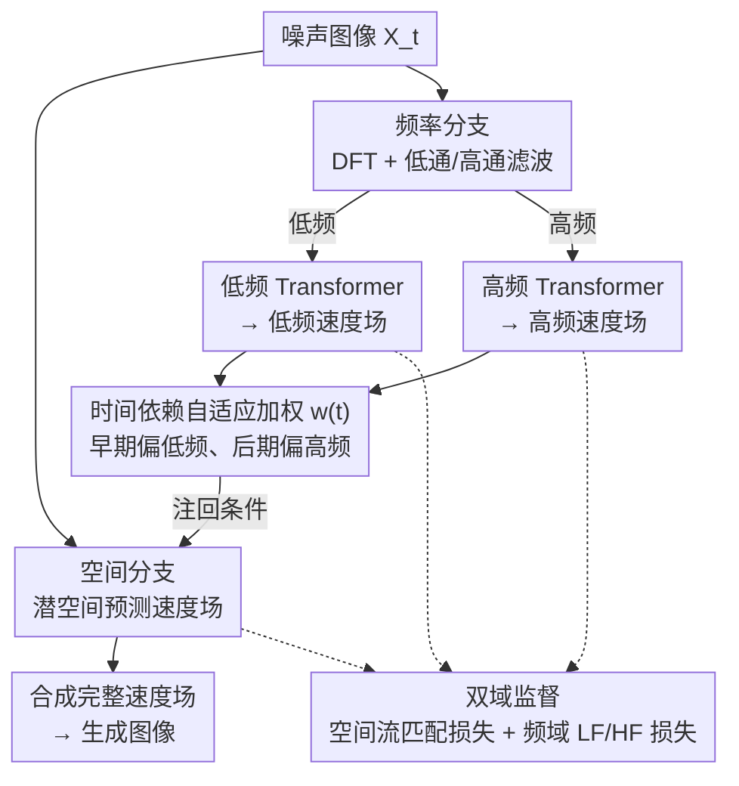

# Frequency-Aware Flow Matching for High-Quality Image Generation

**会议**: CVPR 2026  
**arXiv**: [2604.15521](https://arxiv.org/abs/2604.15521)  
**代码**: [https://github.com/OliverRensu/FreqFlow](https://github.com/OliverRensu/FreqFlow)  
**领域**: 图像生成  
**关键词**: 流匹配, 频域感知, 图像生成, 双分支架构, 自适应加权

## 一句话总结

FreqFlow 通过在流匹配框架中显式引入频域感知条件，采用双分支架构分别处理低频全局结构和高频细节信息，在 ImageNet-256 上以 1.38 FID 达到 SOTA。

## 研究背景与动机

**领域现状**：流匹配（Flow Matching）已成为图像生成的主流框架之一，通过学习从高斯噪声到数据分布的连续变换路径实现高质量图像合成。SiT 和 DiT 等模型在大规模生成任务上取得了不错的效果。

**现有痛点**：现有的流匹配方法在空间域中均匀注入噪声，但噪声在潜空间中对不同频率分量的影响是不均匀的。模型在逆过程中倾向于先重建低频分量（全局结构），而高频分量（纹理和边缘等细节）在后期才逐渐出现。然而模型本身并没有显式机制来区分和处理不同频率分量，导致生成结果在细节上模糊不清。

**核心矛盾**：流匹配模型在空间域工作，但损坏和恢复过程本质上是以频率不均匀的方式影响图像的——这种频域特征既没有被显式建模，也没有被有效利用。频率误差分析显示 SiT 在高频误差（0.69）上远大于低频误差（0.08）。

**本文目标**：在流匹配框架中显式引入频域信息，让模型在不同生成阶段正确地关注对应的频率成分。

**切入角度**：作者观察到流匹配的逆过程天然地遵循"先低频后高频"的重建顺序，这与人类感知的从粗到细的认知过程一致。如果能显式地在模型中嵌入频域条件，就能强化这种自然的频率生成顺序。

**核心 idea**：用一个专门的频率分支分别处理低频和高频分量，通过时间依赖的自适应加权将频域信息注入空间分支，实现频域感知的流匹配。

## 方法详解

### 整体框架

FreqFlow 要解决的是：标准流匹配在空间域均匀去噪，但图像的损坏与恢复其实是"频率不均匀"的——逆过程总是先把低频的全局结构搭好、再慢慢补上高频的纹理边缘，而模型对此毫无显式机制，于是高频细节往往糊掉。FreqFlow 的做法是给流匹配加一条"频域旁路"：整个网络分成两条分支，空间分支照常在潜空间里预测速度场，频率分支则把当前噪声图像 $X_t$ 拆成低频和高频两路分别建模，再把它们的输出作为条件注回空间分支。一次前向里，频率分支先给出低频/高频两个速度场预测，空间分支在这两路引导下合成出完整的速度场，最终把"先粗后细"的生成顺序从隐式偏好变成了网络里可控的结构。

### 关键设计

**1. 频率分支：把"哪个频段该现在重建"显式建模出来**

痛点在于空间分支看到的是一整张混在一起的噪声图，它没法区分"现在该补全局轮廓还是该补纹理"。频率分支的办法是先用离散傅里叶变换把 $X_t$ 搬到频域，再用低通和高通滤波器切成低频、高频两份，各自交给一组独立的 Transformer blocks 处理，分别吐出低频速度场和高频速度场。训练时这两路各有对应的低频/高频速度场作监督，等于强迫模型把"全局结构"和"局部细节"拆成两个可单独优化的子问题。这样一来，原本被空间分支糊在一起的频率信息被显式拆开，各频段的重建质量能被单独控制，而不是全靠一个空间网络去隐式权衡。

**2. 时间依赖自适应加权：让频域条件在对的阶段说话**

光有两路频率速度场还不够，关键是它们该在生成的哪个时刻起作用。FreqFlow 引入一个可学习、随时间步变化的权重 $w(t)$ 来调节频率分支注回空间分支的强度：早期（$t$ 接近噪声端）让低频条件主导，先把全局结构立起来；后期再让高频条件抬头，去细化纹理和边缘。因为流匹配的逆过程本就天然遵循"先低频后高频"，把这个顺序写成一条随时间自适应的权重曲线，等于把网络的自发偏好变成了显式、可学的调度——该补结构时不会被高频噪声干扰，该补细节时高频通道又恰好被放大。

**3. 双域监督：在频域和空间域同时给约束**

只在空间域算速度场误差，没法保证频率分量被准确重建——空间损失对高频的约束太弱，这正是 SiT 高频误差（0.69）远高于低频误差（0.08）的来源。FreqFlow 让空间分支照旧用标准流匹配损失，频率分支额外承担低频和高频速度场的预测损失，两组损失联合优化。空间域损失保证图像整体连贯，频域损失则盯住各频段的准确性，两个互补表示空间一起训练，高频细节才不会在优化里被"平均掉"。

### 一个例子：一次去噪里频率条件怎么轮班

以一张正在生成的 ImageNet 图为例。早期某个时间步（如 step 50 附近），$w(t)$ 把低频条件压得很高：频率分支的低频速度场主导，空间分支先把主体的大致轮廓和色块铺好，此时高频通道贡献很小、纹理仍是模糊的。随着 $t$ 推进到中后段（如 step 200 之后），$w(t)$ 逐渐把权重转向高频：高频速度场开始把边缘、纹理一点点叠加上去。论文里 FreqFlow 在 step 200 就达到最低对数振幅（SiT 要到 step 280），说明它更早搭好了全局结构，把后面的时间步省给了高频细化——这就是"先粗后细"被显式调度后的直接收益。

### 损失函数 / 训练策略

总损失是空间域流匹配损失与频域（低频 + 高频）速度场预测损失的加权组合，两条分支联合优化。训练遵循标准流匹配范式，时间步在 $t \in [0,1]$ 上均匀采样。

## 实验关键数据

### 主实验

| 模型 | FID ↓ | 参数量 |
|------|-------|--------|
| DiT-XL | 2.17 | 675M |
| SiT-XL | 1.96 | 675M |
| DiMR-G | 1.53 | 1.1B |
| MAR-H | 1.45 | 943M |
| **FreqFlow-L** | **1.44** | 625M |
| **FreqFlow-H** | **1.38** | ~1B |

### 消融实验

| 配置 | FID |
|------|-----|
| 仅空间分支（baseline） | 1.96 |
| + 频率分支（无自适应加权） | 1.62 |
| + 时间依赖自适应加权 | 1.44 |

### 关键发现

- FreqFlow-L 用更少的参数量（625M vs 675M）超越了 DiT-XL 和 SiT-XL，FID 改善 0.73 和 0.52
- 频率误差分析证实 FreqFlow 在低频（0.06 vs 0.08）和高频（0.48 vs 0.69）上都显著优于 SiT
- FreqFlow 能更早建立全局结构（在 step 200 达到最低对数振幅，SiT 需要 step 280）

## 亮点与洞察

- **频域视角重新审视流匹配**：将流匹配从纯空间操作扩展到频域感知，这一思路非常自然但之前未被充分探索。频率分解为理解和改进生成模型提供了新的分析工具
- **效率优势**：FreqFlow-L 在更少参数下超越更大模型，说明频域信息是一种高效的归纳偏置，比单纯增加模型规模更有效
- **迁移潜力**：这种频域感知的设计思路可以迁移到视频生成、3D 生成等其他需要多尺度细节控制的生成任务

## 局限与展望

- 双分支架构带来额外的计算开销，频率分支的轻量化是一个值得探索的方向
- 目前仅在类条件生成（ImageNet-256）上验证，缺乏文本到图像等更复杂任务的评估
- 频率分解依赖 DFT，对于某些非周期性纹理可能不是最优的分解方式

## 相关工作与启发

- **vs SiT**: SiT 在纯空间域做流匹配，FreqFlow 增加了频域分支和自适应加权，在高频细节上明显更好
- **vs FreeU**: FreeU 通过重加权 U-Net 的 skip connection 来平衡频率，FreqFlow 则是从头设计了频域处理分支，更加系统化
- **vs DiMR**: DiMR 使用多分辨率策略，FreqFlow 使用频域分解，两者都试图解决多尺度问题但角度不同

## 评分

- 新颖性: ⭐⭐⭐⭐ 频域感知引入流匹配的思路新颖但方法较直接
- 实验充分度: ⭐⭐⭐⭐ ImageNet-256 上全面对比，频率分析深入
- 写作质量: ⭐⭐⭐⭐ 频域动机阐述清晰，图示直观
- 价值: ⭐⭐⭐⭐ 为流匹配模型提供了新的改进方向

<!-- RELATED:START -->

## 相关论文

- [\[CVPR 2026\] Flow Matching for Multimodal Distributions](flow_matching_for_multimodal_distributions.md)
- [\[CVPR 2026\] Toward Diffusible High-Dimensional Latent Spaces: A Frequency Perspective](toward_diffusible_high-dimensional_latent_spaces_a_frequency_perspective.md)
- [\[CVPR 2026\] PosterReward: Unlocking Accurate Evaluation for High-Quality Graphic Design Generation](posterreward_unlocking_accurate_evaluation_for_high-quality_graphic_design_gener.md)
- [\[CVPR 2026\] FreqEdit: Preserving High-Frequency Features for Robust Multi-Turn Image Editing](freqedit_preserving_high-frequency_features_for_robust_multi-turn_image_editing.md)
- [\[CVPR 2026\] Spatiotemporal Pyramid Flow Matching for Climate Emulation](spatiotemporal_pyramid_flow_matching_for_climate_emulation.md)

<!-- RELATED:END -->
