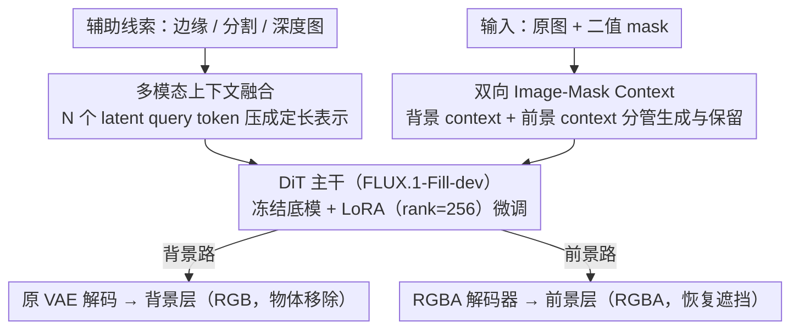

# From Inpainting to Layer Decomposition: Repurposing Generative Inpainting Models for Image Layer Decomposition

**会议**: CVPR 2026  
**arXiv**: [2511.20996](https://arxiv.org/abs/2511.20996)  
**代码**: [https://inpaintinglayerdecomp.github.io/](https://inpaintinglayerdecomp.github.io/)  
**领域**: 扩散模型 / 图像编辑  
**关键词**: 图层分解, 图像修复, 扩散模型, 前景提取, 参数高效微调

## 一句话总结
本文观察到图像图层分解（layer decomposition）与图像修复/外绘（inpainting/outpainting）任务之间的内在联系，提出 Outpaint-and-Remove 方法，通过轻量级 LoRA 微调将预训练的 inpainting DiT 模型（FLUX.1-Fill-dev）高效适配为图层分解模型，同时引入多模态上下文融合模块保留细节，仅用 10 万合成训练数据即达到 SOTA 性能。

## 研究背景与动机

1. **领域现状**：图像可以看作前景+背景的分层组合。图层分解任务要求从单张图像同时提取前景（含被遮挡部分的恢复）和完成背景（物体移除）。现有方法如 LAYERDECOMP 需要对闭源的大模型进行全量微调，计算和数据成本极高。

2. **现有痛点**：（1）高质量图层标注数据极其稀缺，开源社区只有 MULAN 一个标准数据集；（2）从头训练或全量微调生成模型需要大量计算资源和商业数据集，普通研究者难以复现；（3）现有 inpainting 模型只做背景填充，无法同时提取前景。

3. **核心矛盾**：图层分解在概念上与 inpainting 高度相似（背景层=填充被 mask 的区域，前景层=在 mask 区域外绘），但现有 inpainting 模型缺乏前景提取能力，而专门的图层分解方法又需要从零开始训练。

4. **本文目标** 能否用已有的强大 inpainting 模型，通过最少的改动和数据，实现高质量的图层分解？

5. **切入角度**：将图层分解统一为 inpainting（背景）+ outpainting（前景）的组合任务，利用 inpainting 模型已有的区域填充能力。

6. **核心 idea**：图层分解就是双向 inpainting——背景做区域填充，前景做区域外扩，一个 inpainting 模型加轻量适配即可同时搞定。

## 方法详解

### 整体框架
Outpaint-and-Remove 基于预训练的 FLUX.1-Fill-dev（一个基于 DiT 的 inpainting 扩散模型）。输入为原始图像和二值 mask，输出为背景层（RGB，物体移除后的干净背景）和前景层（RGBA，含 alpha 通道的提取前景，遮挡部分被恢复）。关键改动包括：（1）多模态上下文融合模块，把边缘、分割、深度等辅助信息压成定长 token；（2）双向 image-mask context 设计，用背景 / 前景两路 context 分别引导背景生成与前景提取；（3）冻结底模、只用 LoRA + 独立 RGBA 编解码器学新能力。

### 关键设计

**1. 多模态上下文融合模块：把边缘/分割/深度压成定长 token，避免注意力爆炸**

光靠原图，模型很难判断 mask 区域里到底该填什么语义；本文想把边缘图、分割图、深度图这些辅助线索一起喂进去当条件。直接的做法是用预训练 DiT 的 VAE 编码器把每个模态都转成 token 再拼起来，但这样 token 总数 $K$ 一多，标准注意力的 $O(K^2)$ 复杂度就会爆炸。作者借鉴线性注意力的思路，额外引入一小撮固定数量 $N \ll K$ 的 latent query token，让它们通过交叉注意力去"采集"所有模态 token 的信息，把这堆线索压缩成一个 $N$ 维的紧凑表示，复杂度从 $O(K^2)$ 降到近似线性的 $O(KN)$。这样既能在潜空间里尽量留住细节，又给模型补上了空间和语义先验，帮它看懂填充区域的结构。

**2. 双向 Image-Mask Context：用两路 context 分别管"该生成"和"该保留"**

标准 inpainting 只给一路背景 context $c_{I-M}^b$，告诉模型 mask 内的区域是待填充的。问题是只有这一路信号时，模型分不清前景区域到底该原样保留还是该改写，容易在前景上产生幻觉或乱动内容。本文额外加了一路前景 context $c_{I-M}^f$，指向 mask 外待外绘的区域，明确告诉模型"mask 内的内容要保留、不要替换"。这两路 context 各自和对应的噪声 token 沿通道维度拼接，形成两路并行输入送进 DiT——一路引导背景填充、一路引导前景提取，把"生成新内容"和"保留已有内容"两种需求拆开来分别约束。

**3. 参数高效微调 + RGBA 解码：冻结底模，只用 LoRA 学新能力**

为了不动预训练 inpainting 模型已有的强生成先验，作者把基础 DiT 权重全部冻结，只微调输入投影层，并在每个注意力和 FFN 层插入 LoRA（rank=256）。背景层是 RGB 格式，直接复用原有 VAE；前景层带 alpha 通道、是 RGBA 格式，单独微调一个 RGBA 编解码器来处理透明度。这里 LoRA 的 rank 是个关键旋钮：rank=128 太小，学不动图层分解这个新任务；rank=1024 又太大，会盖过预训练先验反而引发幻觉——256 正好是甜点（消融见下表）。靠这套轻量适配，模型只需少量可训练参数就把前景提取这一新能力学了进来，训练成本大幅下降。

### 损失函数 / 训练策略
- 使用标准流匹配损失（flow matching loss）
- 训练数据完全从公开资源构建：MULAN（真实前景但形状不完整）+ LayerDiffuse（合成前景形状完整但纹理有缺陷）+ OpenImages（背景），混合策略兼取两类前景的优势
- batch size 8，学习率 5e-5，训练 7200 iterations
- 输入分辨率 1024×1024
- 训练中使用不完美 mask，让模型学会推断准确的物体边界

## 实验关键数据

### 主实验——背景移除（MULAN 测试集）

| 方法 | PSNR↑ | SSIM↑ | LPIPS↓ | FID↓ |
|------|-------|-------|--------|------|
| FLUX.1-Fill-dev (基线) | 25.59 | 0.92 | 0.09 | 35.96 |
| PowerPaint | 23.46 | 0.76 | 0.17 | 41.67 |
| OmniEraser | 21.45 | 0.72 | 0.31 | 55.80 |
| Qwen-Image-Edit | 19.07 | 0.64 | 0.24 | 63.49 |
| **Ours** | **27.30** | **0.93** | **0.08** | **25.97** |

相比基线 FLUX.1-Fill-dev 提升 1.71dB PSNR，FID 降低 9.99。

### 消融实验

| 配置 | PSNR | FID | 说明 |
|------|------|-----|------|
| Ours (full, rank=256) | **27.30** | **25.97** | 完整模型 |
| rank=128 | 26.34 | 33.92 | rank不足学不够 |
| rank=1024 | 27.15 | 27.32 | rank过大覆盖先验 |
| w/o 前景context $c_{I-M}^f$ | 27.04 | 27.49 | 前景易产生幻觉 |
| w/o 多模态context $c_{MM}$ | 27.16 | 28.02 | 语义理解下降 |
| w/o 合成前景 | 27.18 | 27.11 | 前景形状不完整 |
| Kontext 基线 | 26.22 | 36.14 | inpainting基础更好 |

### 关键发现
- inpainting 模型（FLUX.1-Fill-dev）比通用 I2I 模型（FLUX-Kontext）更适合做图层分解基础，验证了 inpainting 与 layer decomposition 的内在联系
- 前景 context 的有无对前景提取质量影响巨大（定性对比中差异明显），缺少时模型会在前景区域产生幻觉
- LoRA rank 存在一个甜点（256），过小学不足新能力，过大会破坏预训练先验
- 用户研究中本方法获得 59.51% 的偏好率，大幅领先 matting 方法

## 亮点与洞察
- **从任务本质出发的统一视角**：将 layer decomposition 分解为 inpainting + outpainting 的组合，这一观察简洁而深刻，让复杂任务变为对已有能力的重新组合
- **纯公开数据+轻量适配**：不需要商业数据集，不需要全量微调，仅 10 万合成样本+LoRA 即可达到 SOTA。这种"民主化"的方法设计值得推广
- **混合前景数据策略**：真实前景有细节但形状不完整，合成前景形状完整但纹理差，两者互补的数据设计思路可迁移到其他域差距问题

## 局限与展望
- 在复杂场景（杂乱物体、大面积遮挡、手指持握物体）上仍然失败
- 训练数据是合成构造的，与真实图像的分层结构存在分布差异
- 前景提取的 alpha matting 精度可能不如专业 matting 方法
- 评估基准有限（MULAN 是唯一公开的图层数据集），可能存在评估偏差

## 相关工作与启发
- **vs LAYERDECOMP**：后者需要全量微调闭源模型+大规模高质量数据，本文仅用 LoRA+公开数据即达到 SOTA，方法更实用
- **vs MattingAnything / DiffMatte**：matting 方法只提取可见的前景轮廓，不恢复被遮挡部分；本文能恢复完整前景形状（outpainting 能力）
- **vs LayerDiffuse**：后者是用于生成 RGBA 图层的模型，本文将其作为训练数据来源，而非方法竞品

## 评分
- 新颖性: ⭐⭐⭐⭐ 将 inpainting 重新解释为 layer decomposition 的统一视角新颖
- 实验充分度: ⭐⭐⭐⭐ 消融全面，但评估基准有限
- 写作质量: ⭐⭐⭐⭐ 图表清晰，motivating example 直观
- 价值: ⭐⭐⭐⭐ 轻量、实用、可复现的图层分解方案

<!-- RELATED:START -->

## 相关论文

- [\[CVPR 2026\] Qwen-Image-Layered: Towards Inherent Editability via Layer Decomposition](qwen-image-layered_towards_inherent_editability_via_layer_decomposition.md)
- [\[ICLR 2026\] Referring Layer Decomposition](../../ICLR2026/image_generation/referring_layer_decomposition.md)
- [\[CVPR 2025\] Generative Image Layer Decomposition with Visual Effects](../../CVPR2025/image_generation/generative_image_layer_decomposition_with_visual_effects.md)
- [\[CVPR 2026\] Cycle-Consistent Tuning for Layered Image Decomposition](cycle-consistent_tuning_for_layered_image_decomposition.md)
- [\[CVPR 2026\] LaRP: Efficient Multi-View Inpainting with Latent Reprojection Priors](larp_efficient_multi-view_inpainting_with_latent_reprojection_priors.md)

<!-- RELATED:END -->
