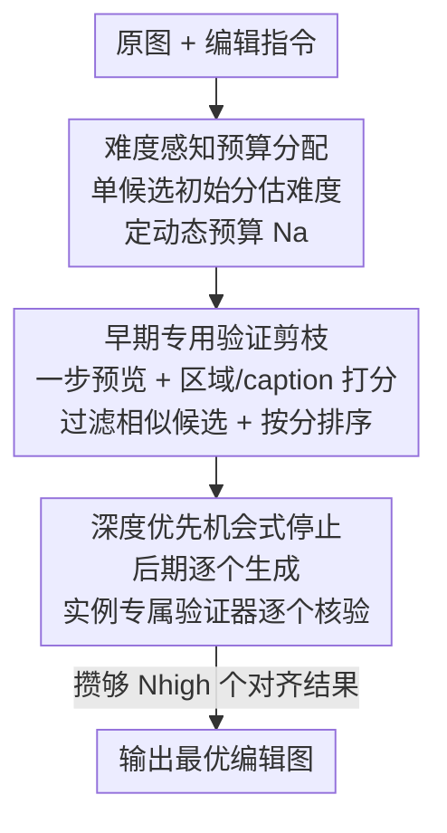

# From Scale to Speed: Adaptive Test-Time Scaling for Image Editing

**会议**: CVPR 2026  
**论文**: [CVF Open Access](https://openaccess.thecvf.com/content/CVPR2026/html/Qu_From_Scale_to_Speed_Adaptive_Test-Time_Scaling_for_Image_Editing_CVPR_2026_paper.html)  
**代码**: 待确认  
**领域**: 扩散模型 / 图像生成  
**关键词**: 图像编辑, 测试时扩展, Image-CoT, 自适应采样, 早停剪枝

## 一句话总结
针对"把面向文生图的 Image-CoT 直接搬到图像编辑会浪费算力"的问题，本文提出 ADE-CoT：用编辑难度动态分配采样预算、用"编辑区域+指令一致性"专用验证器替代笼统的 MLLM 打分做早期剪枝、再用深度优先的"够用即停"机制砍掉冗余采样，在三个 SOTA 编辑模型上相比 Best-of-N 拿到更好画质的同时提速 2× 以上。

## 研究背景与动机
**领域现状**：Image Chain-of-Thought（Image-CoT）是一类训练无关、即插即用的"测试时扩展"（test-time scaling）策略——通过在推理时多采样若干候选、再用验证器挑最好的来提升生成质量。它最初主要服务于文生图（T2I）：标准做法是扰动初始噪声采样 N 个候选，再用 Best-of-N（BoN）选最优；进阶方法用 MLLM 当验证器，在去噪中途给中间态打分、提前剪掉低潜力轨迹以省算力。

**现有痛点**：图像编辑和文生图有本质区别——T2I 是开放式任务，大规模采样能源源不断产出多样的合理结果；而编辑是**目标导向**的，解空间被原图和指令死死约束住，再怎么换噪声、改写提示，能对的答案就那么几种。把 T2I 那套 Image-CoT 硬搬过来，作者实测暴露三个问题：(1) **资源分配低效**——所有编辑都用固定预算（如 32 个样本），但简单编辑（初始分高）从 Image-CoT 里几乎拿不到提升，固定预算把算力浪费在了简单样本上；(2) **早期验证不可靠**——编辑往往只改局部、细微的区域，在去噪早期很难分辨，笼统的 MLLM 分会误判：有 40% 早期低分的样本最终其实能拿高分，却被错误剪掉；(3) **结果冗余**——大规模采样会产出一堆分数相同的正确结果（best score 落在 [7,9) 的编辑大多有 15+ 个候选共享最高分），但编辑任务只要一个对齐意图的结果就够了，多余的都是白烧算力。

**核心矛盾**：现有 Image-CoT 的整套机制（固定预算、通用打分、广度优先并行采全部候选再选优）都是为"开放式、越多越好"的 T2I 设计的，与编辑"目标导向、一个够用"的本质错配。

**本文目标 / 核心 idea**：把重心从"scale（采得多）"转向"speed（够用即停）"。提出 on-demand 的 ADE-CoT，用三招对症下药：按难度动态给预算、用编辑专用指标做准早期剪枝、用深度优先的机会式停止砍冗余——在保住编辑正确性的前提下大幅提效。

## 方法详解

### 整体框架
ADE-CoT 接收一张原图 $I_{src}$ 和一条编辑指令 $c$，目标是产出语义对齐 $c$ 的编辑图 $I$，整条流水线把传统 BoN 的"固定预算 + 广度优先采全部 + 通用打分选优"改造成三段自适应流程。

先用单个候选的初始分估计编辑难度，据此动态决定要采多少样本（难度感知预算）；随后在去噪**早期**做广度优先搜索，但用编辑专用验证器（区域定位 + 指令-caption 一致性）替代通用分来剪枝，并丢掉视觉上高度相似的冗余候选，把活下来的候选按分排序；最后在去噪**后期**切换成深度优先，按早期分逐个生成候选，用实例专属验证器逐个核验，一旦攒够 $N_{high}$ 个真正对齐意图的结果就立刻停止。三段分别对应"省在简单样本上""剪得更准""砍掉冗余"。

### 关键设计

**1. 难度感知的资源分配：让简单编辑少采、难编辑多采**

直击"固定预算浪费算力"的痛点。作者先只生成单个候选并用验证器 $\text{Vrf}$ 打一个初始分 $S$，把它当作编辑难度的代理——分高说明这条编辑本就简单、再多采也提升有限，分低说明难、值得多搜。自适应预算 $N_a$ 按下式分配：

$$N_a = N_{\min} + \lceil (N - N_{\min}) \times (1 - S/S_{\max})^{\gamma} \rceil$$

其中 $N_{\min}$、$N$ 是最小/原始预算，$S_{\max}$ 是满分，$\gamma$ 控制敏感度。当 $S \to S_{\max}$（易），$N_a$ 收敛到 $N_{\min}$；当 $S \to 0$（难），$N_a$ 趋近 $N$。这样算力被精准地导向难编辑。实验里 $\gamma$ 从 0（等价 BoN）增大到 0.15 之前，NFE 稳步下降而画质几乎不变，作者据此把默认 $\gamma$ 设为 0.15。

**2. 编辑专用验证 + 相似过滤：把早期剪枝从"笼统打分"换成"看对没改对地方"**

针对"通用 MLLM 分在去噪早期误判 40% 高潜力样本"的痛点。这一步有三个零件。其一是**一步预览**：早期时刻 $t_e$ 的噪声 latent $x_{t_e}$ 直接打分很难，由于近代编辑模型多用 flow matching 训练，作者一步外推出近似干净 latent $x_{0|t_e} = x_{t_e} - \sigma_{t_e}\epsilon_\theta(x_{t_e}, T_{t_e})$，解码成预览图——无需额外去噪步就能拿到能反映最终结果好坏的预览。

其二是**两个编辑专用验证器**补足通用分 $S_{gen}$。**编辑区域正确性**：先用提示 $P_{reg}$ 让 MLLM 说出该改/该保留的物体，喂给 Grounded SAM2 生成期望编辑区域的二值掩码 $M$；再算编辑图与原图逐像素 RGB 绝对差的均值变化图 $\Delta = \frac{1}{C}\sum_{c=1}^{C}|I^{(c)} - I_{src}^{(c)}|$，对 $\Delta$ 做像素级 softmax 加权后在掩码内聚合得 $S_{reg} = \sum_{H,W} M \odot \text{softmax}_{H,W}(\Delta)$——$S_{reg}$ 越高说明改动越集中在该改的区域。**指令-caption 一致性**：测试时没有真值 caption，作者用提示 $P_{cap}$ 让 MLLM 基于原图和指令生成一个目标 caption $c_{cap}$，再用 CLIP 算 $S_{cap} = \text{CLIPScore}(I, c_{cap})$。三者合成统一分 $S = S_{gen} + \lambda_{reg}S_{reg} + \lambda_{cap}S_{cap}$，低于拒绝阈值 $S_{rj}$ 的候选被剪掉。妙在 $S_{reg}$ 和 $S_{cap}$ 每个编辑只需一次 MLLM 查询，几乎不增开销。实测把高分区 [6,9) 的误判从 235 降到 86（降 63%），而误剪的低分样本几乎不变（357→329）。

其三是**视觉相似过滤**：用 DINOv2 抽预览图的视觉嵌入算两两相似度，超过阈值 $\tau_{sim}$ 就丢掉评分较低的那个，从源头去冗余。最后把存活候选按统一分 $S$ 降序排——因为早期高分的候选往往最终也高分，这给下一阶段"早停"提供了排序依据。

**3. 深度优先机会式停止：够用就停，不把所有候选采完**

针对"大规模采样产出一堆相同正确结果"的冗余痛点。不同于 BoN/PRM/PARM 的广度优先（先并行采完全部候选再 best-of-N 选优），这里改成**深度优先**：按早期分逐个生成候选。它含两个零件。**后期保留**：在更晚的时刻 $t_l$（$t_e < t_l < T$）再给每个候选生成一次预览并算统一分，用自适应阈值（保留与当前最高分相当的候选）而非固定阈值动态剪掉次优样本。**实例专属验证器**：通用分 $S_{gen}$ 常给一堆候选打相同高分、连有错的也照样高分，导致最终选择不可靠；作者发现"两段式问答"能引导 MLLM 注意关键细节——先用提示 $P_q$ 针对当前编辑生成一组 yes/no 问题（覆盖指令遵循、美学等），再用提示 $P_a$ 逐题作答，数 yes 的个数得实例专属分 $S_{spec}$（每个 yes 表示某一方面改对了）。把 $S_{spec}$ 并入统一分来惩罚错误候选，当攒够 $N_{high}$ 个被判为对齐意图的结果即停止，再从中选最高分输出。$N_{high}$ 默认设 4：实验显示性能在 $N_{high} \ge 4$ 后饱和而 NFE 随之线性上涨，攒 4 个比"首个对齐就停"更鲁棒。

### 损失函数 / 训练策略
ADE-CoT 是训练无关、即插即用的测试时方法，不引入任何训练。关键超参在三个 SOTA 模型上的默认配置：去噪总步数 $T=28/28/50$（Kontext/BAGEL/Step1X-Edit），早期步 $t_e=8/8/16$、后期保留步 $t_l=16/16/36$；MLLM 查询用 Qwen-VL-MAX，通用分用 VIE-Score，每个编辑生成 5 个实例专属 yes/no 问题，所有结果取三次运行均值。

## 实验关键数据

### 主实验
在 GEdit-Bench（真实用户编辑）、AnyEdit-Test（局部/全局/隐式编辑）、Reason-Edit（复杂理解推理）三个 benchmark 上，挂载到 FLUX.1 Kontext、BAGEL、Step1X-Edit 三个 SOTA 编辑模型上评测。效率用 NFE（总去噪步数）衡量，并自定义两个指标：**推理效率** $\eta = \frac{1}{M}\sum_i \sigma_i \cdot \frac{S(i)}{S_{\max}} \cdot \frac{NT}{NFE(i)}$（$\sigma_i=1$ 当结果不劣于 BoN，衡量画质-算力权衡），**结果效率** $\xi = \frac{1}{M}\sum_i \sigma_i \frac{NFE(i)}{NFE^{min}(i)}$（衡量冗余，越高冗余越少）。固定预算 $N=32$ 下的 GEdit-Bench 主结果：

| 模型 | 方法 | G_O ↑ | η ↑ | ξ ↑ |
|------|------|-------|-----|-----|
| FLUX.1 Kontext | BoN | 6.641 | 0.66 | 0.12 |
| FLUX.1 Kontext | TTS-EF | 6.376 | 0.98 | 0.57 |
| FLUX.1 Kontext | **ADE-CoT** | **6.695** | **1.47** | **0.66** |
| BAGEL | BoN | 6.908 | 0.69 | 0.14 |
| BAGEL | **ADE-CoT** | **6.972** | **1.27** | **0.62** |
| Step1X-Edit | BoN | 7.157 | 0.72 | 0.13 |
| Step1X-Edit | **ADE-CoT** | **7.196** | **1.45** | **0.62** |

相对 BoN，ADE-CoT 把推理效率 $\eta$ 提升 2× 以上，结果效率 $\xi$ 在三 benchmark 上平均提升 4.9×/2.7×/2.9×（对应 GEdit/AnyEdit/Reason-Edit 的整体 speedup 也在 2× 量级）。两个对照基线的失败方式很说明问题：PRM/PARM 因通用分误判早期预览、误剪高潜力样本，性能反不如 BoN；TTS-EF 效率高但只从早期预览选单个最优、采样一多就不可靠，性能差。

### 消融实验（逐策略叠加，GEdit-Bench，G_O / NFE）
| 配置 | Kontext | BAGEL | Step1X-Edit |
|------|---------|-------|-------------|
| Baseline (BoN) | 6.641 / 896 | 6.908 / 1600 | 7.157 / 896 |
| +难度感知预算 | 6.641 / 797 | 6.909 / 1391 | 7.157 / 778 |
| +早期剪枝(通用分 S_gen) | 6.642 / 719 | 6.912 / 1351 | 7.157 / 719 |
| +早期剪枝(统一分 S) | 6.647 / 673 | 6.916 / 1290 | 7.161 / 638 |
| +相似样本过滤 | 6.651 / 508 | 6.915 / 1087 | 7.162 / 522 |
| +后期保留 | 6.652 / 464 | 6.935 / 972 | 7.163 / 462 |
| +实例专属验证器 | 6.702 / 464 | 6.984 / 972 | 7.206 / 462 |
| +机会式停止(完整) | 6.695 / 418 | 6.972 / 882 | 7.196 / 434 |

### 关键发现
- **NFE 的大头来自"相似过滤 + 机会式停止"**：Kontext 上 NFE 从 896 一路降到 418（≈2.1× 加速），其中相似过滤（673→508）和后期保留/早停贡献最大；而难度感知预算和早期剪枝主要"几乎不掉分地省算力"。
- **实例专属验证器是涨点主力**：加它之前 G_O 一直在 6.65 附近徘徊，加上后 Kontext 6.652→6.702、Step1X 7.163→7.206——它能抓到通用分抓不到的细节错误（如"头侧着没朝前"），把最终选择做准。
- **统一分 S 比通用分 S_gen 既准又省**：同样维持不劣于 BoN，用 S 能开更高的拒绝阈值，NFE 降得更多（Step1X 719→638）；早期预览的获取方式消融也显示"一步预览"优于"加额外去噪步"和"直接用噪声 latent"（NFE 显著更低且画质相当）。
- **$N_{high}=4$、$\gamma=0.15$ 是性能-效率拐点**：$N_{high}\ge4$ 后性能饱和而 NFE 线性上涨；$\gamma$ 超过 0.15 后性能才开始下滑。

## 亮点与洞察
- **"任务性质决定 scaling 策略"是个很干净的洞察**：T2I 开放式→越采越好，编辑目标导向→一个够用。从这个二分法出发，"把 scale 换成 speed"的整套设计就顺理成章，而不是堆 trick。
- **一步预览 + flow-matching 外推**很巧：不额外去噪就能拿到能反映最终好坏的预览图，是后面所有早期验证的便宜地基，把"早期验证"的成本压到了近乎免费。
- **实例专属的"两段式 yes/no 问答"**把笼统的"打个分"变成"针对这次编辑列检查清单逐项核验"，本质是给验证器加了 task-specific 的注意力，这个思路可迁移到任何"通用打分分不开候选"的选择场景（视频生成、3D 编辑的 best-of-N）。
- **$S_{reg}$ 用 Grounded SAM2 掩码 + softmax 加权变化图**，把"改没改对地方"量化成一个无需真值的可计算分，是编辑任务里少见的、不依赖 ground-truth 的区域级验证。

## 局限与展望
- 整套流程**重度依赖外部 MLLM/分割模型**（Qwen-VL-MAX、Grounded SAM2、CLIP、VIE-Score），$S_{reg}$/$S_{cap}$ 的可靠性受这些组件能力上限制约；论文用"每编辑仅一次 MLLM 查询"压成本，但 MLLM 本身的误差会传导到剪枝与早停。⚠️ 论文未充分讨论 MLLM 失效时整链的鲁棒性。
- **难度代理 = 单候选初始分**，是个相当粗的估计；单次采样的随机性可能让简单编辑被误判为难（或反之），从而预算分配失准——这部分作者未给出方差分析。
- 多个阈值/权重（$\gamma$、$\tau_{sim}$、$\lambda_{reg}$、$\lambda_{cap}$、$S_{rj}$、$t_e$、$t_l$）需按模型调，默认值在三个模型上验证过，但**跨模型/跨数据的泛化超参敏感性**展示有限。
- 方法是测试时框架，**性能上限仍受底层编辑模型限制**：它优化的是"在固定模型下更快更准地选对结果"，而非提升模型本身的编辑能力。

## 相关工作与启发
- **vs Best-of-N (BoN)**：BoN 固定预算、广度优先采全部候选再选最高分；ADE-CoT 动态预算 + 深度优先够用即停，在相当或更优画质下提速 2× 以上，效率指标 $\eta/\xi$ 全面占优。
- **vs PRM / PARM**：它们也在去噪中途剪枝，但用通用 MLLM 分评估中间态，在编辑的细微局部改动上误判严重、反而不如 BoN；ADE-CoT 用编辑专用验证器（区域 + caption）把高分区误判降 63%。
- **vs TTS-EF (ICEdit 的早过滤)**：TTS-EF 是首个把 Image-CoT 引入编辑的工作，靠加额外去噪步生成早期预览、选最优初始噪声继续生成；但只选单个最优、采样一多就不可靠，且额外去噪步推高成本。ADE-CoT 用"一步预览"省掉额外去噪、用编辑专用分剪得更准、并加深度优先早停，效率与画质双赢。

## 评分
- 新颖性: ⭐⭐⭐⭐ 把"任务是开放式还是目标导向"作为 test-time scaling 的设计原点，三招都对症且自洽，但每一招（难度预算/专用验证/早停）单看都不算颠覆。
- 实验充分度: ⭐⭐⭐⭐⭐ 三模型 × 三 benchmark，逐策略叠加消融 + 预览方式/搜索方式/超参敏感性多组分析，自定义 $\eta/\xi$ 把"效率"量化得很到位。
- 写作质量: ⭐⭐⭐⭐ 问题分析（Fig.2 三连）清晰，方法与动机一一对应；少量公式 OCR 略糙需对原文核。
- 价值: ⭐⭐⭐⭐ 训练无关、即插即用、可挂在任意编辑模型上提速 2×，对实际部署 Image-CoT 编辑很实用。

<!-- RELATED:START -->

## 相关论文

- [\[CVPR 2026\] Progress by Pieces: Test-Time Scaling for Autoregressive Image Generation](progress_by_pieces_test-time_scaling_for_autoregressive_image_generation.md)
- [\[CVPR 2026\] Test-Time Instance-Specific Parameter Composition: A New Paradigm for Adaptive Generative Modeling](test-time_instance-specific_parameter_composition_a_new_paradigm_for_adaptive_ge.md)
- [\[CVPR 2026\] Test-Time Alignment of Text-to-Image Diffusion Models via Null-Text Embedding Optimisation](test-time_alignment_of_text-to-image_diffusion_models_via_null-text_embedding_op.md)
- [\[CVPR 2026\] Rethinking Prompt Design for Inference-time Scaling in Text-to-Visual Generation](rethinking_prompt_design_for_inference-time_scaling_in_text-to-visual_generation.md)
- [\[CVPR 2026\] MRT: Masked Region Transformer for Layered Image Generation and Editing at Scale](mrt_masked_region_transformer_for_layered_image_generation_and_editing_at_scale.md)

<!-- RELATED:END -->
