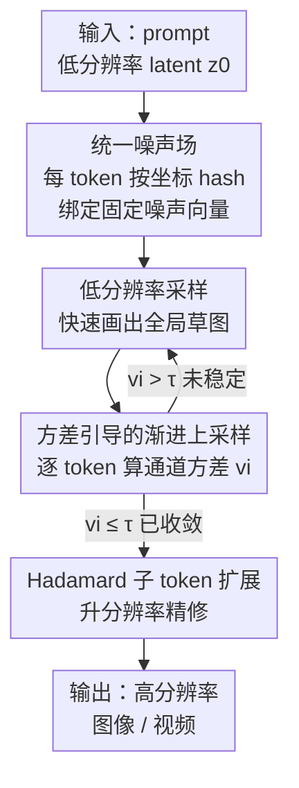

# From Sketch to Fresco: Efficient Diffusion Transformer with Progressive Resolution

**会议**: CVPR 2026  
**论文**: [CVF Open Access](https://openaccess.thecvf.com/content/CVPR2026/html/Zheng_From_Sketch_to_Fresco_Efficient_Diffusion_Transformer_with_Progressive_Resolution_CVPR_2026_paper.html)  
**代码**: https://github.com/DarrenZheng303/Fresco  
**领域**: 扩散模型 / 图像生成  
**关键词**: 动态分辨率采样, 扩散加速, 统一噪声场, 渐进上采样, 免训练  

## 一句话总结
Fresco 用一个「坐标绑定的统一噪声场」+「按 token 方差自适应渐进上采样」替换掉传统动态分辨率采样里那套割裂的逐阶段重加噪，让低分辨率草图和高分辨率精修朝同一个目标收敛，免训练地把 FLUX 加速 10×、HunyuanVideo 加速 5×，且和蒸馏/特征缓存正交、叠加后可达 22×。

## 研究背景与动机
**领域现状**：Diffusion Transformer（DiT）在图像/视频生成上质量很高，但采样要几十步、每步都过一遍大 transformer，推理极慢。加速主要有两条路——减步数（高阶 solver、蒸馏、consistency model）和减每步算力（稀疏注意力、特征缓存）。近期兴起的第三条路是**动态分辨率采样**：早期步在低分辨率上跑、后期再升到高分辨率，因为早期细节不重要，能省下大量初期算力。

**现有痛点**：动态分辨率的问题出在「分辨率切换」这一步。每次升分辨率，latent 的噪声方差就和当前扩散轨迹对不上，必须重新注入噪声（re-noise）来对齐前向扩散过程。现有方法（如 bottleneck sampling）靠的是复杂的重加噪调度 + 各阶段专属的启发式参数，不仅难调，还限制了能达到的加速比。

**核心矛盾**：更根本的问题有两个。其一，每次切换都**独立采一个新噪声场**注入进去，这和之前阶段的去噪轨迹是脱钩的——本来低分辨率草图已经朝某个有意义的全局结构收敛，一次新扰动等于「破坏性重置」，逼模型在高分辨率上重新学全局语义，而不是在已有内容上精修细节，于是出现纹理抖动、几何破碎、加速受限。其二，现有方法对整张 latent **一刀切地一步上采样**，不管哪些区域其实还没收敛，导致语义没稳定的区域被过早升分辨率，产生混叠、振铃和碎片化几何。

**本文目标**：让全过程的全局结构和语义保持一致——低分辨率的快速收敛和高分辨率的细节精修，两个阶段要朝**同一个最终目标**前进，而不是被重加噪一次次打断重来。

**核心 idea**：给每个 token 按它的空间坐标绑定一个**固定的噪声向量**，构成跨所有阶段共享的「统一噪声场」，让随机演化在不同尺度间连续而不被重置；同时只对**方差已经变小（语义已稳定）的 token** 才升分辨率，让上采样按需、渐进发生。

## 方法详解

### 整体框架
Fresco 是一个**免训练**的渐进分辨率框架。整条管线从一个**降采样后的低分辨率** latent $z_0$ 出发，让早期步以低成本先把全局结构画出来（"sketch"）；采样过程中持续追踪每个 token 跨时间步的通道方差，方差小说明该 token 在当前尺度上语义已稳定，就把它升到高分辨率做细节精修（"fresco"），方差仍大的 token 留在低分辨率继续去噪。关键是：无论 token 在哪个尺度、哪个阶段，它的噪声都从同一个**坐标绑定的统一噪声场**里按坐标查出来，从而避免逐阶段独立重加噪带来的轨迹重置。

### 关键设计

**1. Token 级统一噪声场：把「逐阶段重加噪」换成一个跨尺度共享的确定性参照**

传统动态分辨率每次升分辨率都独立采一个新噪声注入，等于把已经收敛的轨迹推倒重来。Fresco 改成：预先定义一个全局噪声场，每个 latent token 按它的空间坐标 $(y,x)$ 和特征维 $d$ 用哈希函数确定地取一个固定高斯向量

$$\epsilon_{y,x,d} = \mathcal{N}(0,1;\ \text{seed}=h(y,x,d)),$$

其中 $h(\cdot)$ 保证同一个 token 在整条采样轨迹上永远拿到同一个噪声值。每次分辨率切换时，latent 状态用这个统一场来更新：$z^{(s+1)} = \beta_s z^{(s)} + \alpha_s \epsilon_{y,x,d}$，系数 $(\alpha_s,\beta_s)$ 控制随机贡献的比例。升分辨率时，新 token 的坐标由父 token 位置推出，再**按新坐标从同一个场里查噪声**——坐标一致就保证随机演化跨尺度连续，不会出现破坏性重置。论文给了 Proposition 1：统一重加噪得到的状态 $\hat{X}_e$ 比独立逐阶段重加噪的 $\tilde{X}_e$ 离目标 $X(t_e)$ 更近，且独立式有一个不可消的下界 $\mathbb{E}[\|\tilde{X}_e - X(t_e)\|^2] \ge b^2 d$（$b$ 注入噪声强度、$d$ 特征维）。直观说：用共享噪声重加噪相当于在同一条生成路径上做**时间重参数化**，漂移可忽略；而每阶段注入独立新噪声会带来正比于 $b^2 d$ 的不可约偏差（⚠️ 命题与界以原文附录 A.1 为准）。

**2. 方差引导的渐进上采样：只升「已经收敛」的 token，而不是一刀切整张图**

针对「一刀切上采样把没稳定的区域也升上去导致混叠」的痛点，Fresco 不再整张 latent 一次性升分辨率，而是用每个 token 跨时间步的**通道方差**来判断它收敛没有：

$$v_i = \mathrm{Var}_t\big(z_i^{(t)}\big).$$

$v_i$ 越小说明该 token 的语义结构越稳定。引入阈值 $\tau$ 控制选择比例（即效率与细节恢复之间的 trade-off）：满足 $v_i \le \tau$ 的 token 视为已收敛，提前升到高分辨率做细节精修；$v_i > \tau$ 的留在低分辨率继续高效去噪，直到稳定。这样上采样是**按需、渐进**发生的，自然契合扩散过程"先全局后局部"的演化节奏，避免过早升分辨率造成的振铃和碎片化几何。

**3. Hadamard 子 token 扩展：升分辨率时既要细节自由度、又不能毁掉父 token 的粗结构**

被选中精修的 token 怎么升分辨率？简单插值会糊、信息不够。Fresco 用一个正交 Hadamard 变换把每个父 token $z_{\text{parent}} \in \mathbb{R}^D$ 扩成 4 个子 token：先采 3 个独立高斯向量 $\epsilon_1,\epsilon_2,\epsilon_3 \sim \mathcal{N}(0,I)$，再

$$[z_1,z_2,z_3,z_4] = H_4 \cdot [z_{\text{parent}},\ \epsilon_1,\ \epsilon_2,\ \epsilon_3],$$

其中 $H_4$ 是 $4\times4$ Hadamard 矩阵。正交变换把父 token 的粗语义结构和三路受控的正交扰动混进 4 个子 token：父 token 那一路保住了粗结构，三路噪声则为后续扩散步提供细尺度纹理所需的随机自由度。比单纯插值上采样质量更高（消融里插值版 ImageReward 0.9876 vs Fresco 1.0369）。

## 实验关键数据

### 主实验
文本到图像在 FLUX.1-dev 上、文本到视频在 HunyuanVideo 上评测；T2I 用 DrawBench 200 prompts @1024×1024，指标 ImageReward / CLIP Score；T2V 用 VBench @720×1280、125 帧。

| 任务 / 模型 | 方法 | FLOPs 加速 | 质量指标 | 对比基线 |
|------|------|------|------|------|
| T2I / FLUX.1-dev | Fresco (NFE 30) | 2.87× | ImageReward **1.0527** | TeaCache 0.9449 / Bottleneck 0.9739 |
| T2I / FLUX.1-dev | Fresco (NFE 18) | 4.72× | ImageReward **1.0369** | TaylorSeer 0.9857 / RALU 0.9481 |
| T2I / FLUX.1-schnell | Fresco (NFE 9) | **10.27×** | ImageReward 0.9825 | 仍高于原始 FLUX(0.9736) 与 schnell |
| T2V / HunyuanVideo | Fresco (NFE 23) | 3.91× | Total **81.10** | TeaCache 78.96 / Jenga-ProRes 79.16 |
| T2V / HunyuanVideo | Fresco (NFE 18) | 4.92× | Total 80.76 | 同档基线最优 |

值得注意的是 Fresco 在 4.72× 加速下 ImageReward（1.0369）反而**高于未加速的原始 FLUX**（0.9736），说明它不只是"少掉点的加速"，coarse-to-fine 还顺带改善了 FLUX 在高分辨率下结构退化的问题。

与其他加速方法**正交叠加**（Table 3）：

| 叠加组合 | 加速 | CLIP-IQA | 说明 |
|------|------|------|------|
| Fresco + 特征缓存(TaylorSeer) | 9.23× | 0.9116 (+0.07%) | 完全免训练 |
| Fresco + 模型蒸馏(FLUX.1-lite-8B) | 10.03× | 0.9518 (+4.48%) | — |
| Fresco + 步蒸馏(schnell, NFE 4) | **22.10×** | 0.8693 | 极端加速仍保质 |

### 消融实验
| 配置 | 加速 | ImageReward | CLIP Score | 说明 |
|------|------|------|------|------|
| Random selection | 4.90× | 0.9143 | 31.277 | 随机选 token 升分辨率 |
| Edge detection | 4.47× | 0.9482 | 32.316 | 按边缘选 |
| Attention score | 4.21× | 0.9849 | 32.324 | 按注意力选 |
| w/o unified re-noise | 4.13× | 0.9632 | 31.264 | 去掉统一噪声场 |
| Interpolated upsampling | 4.63× | 0.9876 | 32.132 | Hadamard 换成插值 |
| **Fresco (Full)** | 4.51× | **1.0369** | **32.581** | 完整模型 |

### 关键发现
- **方差引导的选择是关键**：随机/边缘/注意力选 token 都明显掉质量，方差准则（看是否收敛）才是对的信号；这也印证了"按收敛状态而非启发式来决定升不升分辨率"这个核心立意。
- **统一噪声场不可或缺**：去掉后 ImageReward 1.0369→0.9632、CLIP 32.581→31.264，证实跨分辨率的一致噪声调度对维持跨阶段连贯性确实重要。
- **Hadamard 扩展优于插值**：插值版 ImageReward 0.9876，证明子 token 升分辨率需要受控正交扰动来提供细节自由度。
- **分辨率越高收益越大**：加速比从 1024² 的 4.51× 升到 2048² 的 5.68×，因为高分辨率输入冗余更多；且 ImageReward 同步提升（0.9348 vs FLUX 0.8499），体现可扩展性。
- **附带减步能力**：Fresco 在前 7-8 个低分辨率步内就能画出连贯的全局布局草图，而原始全分辨率采样器同样步数下还淹在噪声里——低分辨率下扩散动力学收敛更快。

## 亮点与洞察
- **把"重加噪"重新理解成时间重参数化**：传统做法把每次升分辨率的重加噪当成必须的独立扰动，Fresco 指出只要共享同一个坐标绑定的噪声实现，重加噪就退化成沿同一条生成路径的时间重参数，漂移可忽略——这个视角转换是整篇的灵魂。
- **方差当收敛探针**：用 token 跨时间步的通道方差判断"这块区域稳了没"，是个轻量又物理直觉强的信号，可迁移到任何需要"哪些区域可以早停/早升精度"的渐进生成场景。
- **正交性带来复利**：Fresco 既不改训练、也不和减步数/特征缓存冲突，因此能直接叠在蒸馏模型上把 22× 拿下，工程价值很高。
- **顺手治了 FLUX 高分辨率退化**：从低分辨率"甜点区"起步再 coarse-to-fine 放大，等于绕开了 DiT 在原生高分辨率上结构碎裂的训练分布问题，加速反而提质。

## 局限与展望
- 方差阈值 $\tau$ 是控制效率/细节 trade-off 的关键超参，论文用它调档位，但未充分讨论它在不同模型/分辨率间是否需要重调、是否敏感（⚠️ 文中未给 $\tau$ 的敏感性分析）。
- Proposition 1 的界 $b^2 d$ 依赖注入噪声强度与特征维的假设，实际 DiT 的复杂动力学下界是否紧、漂移与质量的定量关系如何，正文只给了直觉论证。
- 只验证了 FLUX 系列与 HunyuanVideo，对 U-Net 架构扩散或其他 DiT（如 SD3、PixArt）的普适性还有待确认。
- Hadamard 固定 4 路扩展是 2× 空间倍率的设计，更激进的倍率或非方形上采样如何推广未展开。

## 相关工作与启发
- **vs Bottleneck Sampling**: 同为免训练动态分辨率，但它依赖复杂的重加噪调度和逐阶段启发式参数、且一刀切上采样；Fresco 用统一噪声场消掉调度复杂度、用方差引导做按需上采样，质量与加速比都更高（FLUX 上 2.87× 时 ImageReward 1.0527 vs 0.9739）。
- **vs 特征缓存(TeaCache/TaylorSeer/ToCa)**: 它们减每步算力但激进时质量崩（ToCa N=10 时 ImageReward 跌到 0.7055）；Fresco 走分辨率维度、且与缓存正交，叠加 TaylorSeer 还能把 CLIP-IQA 抬上去。
- **vs 蒸馏/减步(schnell、consistency)**: 走的是减步数路线，Fresco 走减空间分辨率路线，两者互补——Fresco+步蒸馏可达 22.10×。
- **vs 级联扩散(cascade diffusion)**: 同是 coarse-to-fine，但级联通常要重训练或额外上采样模块；Fresco 完全免训练，在采样过程内部完成尺度提升。

## 评分
- 新颖性: ⭐⭐⭐⭐⭐ 把重加噪重解释为时间重参数化 + 方差引导按需上采样，立意清晰且打到动态分辨率的两个根因。
- 实验充分度: ⭐⭐⭐⭐ 覆盖 T2I/T2V、多分辨率、多种加速方法叠加，消融完整；但 $\tau$ 敏感性与更多架构验证略缺。
- 写作质量: ⭐⭐⭐⭐ 动机—方法—命题逻辑顺，图示直观；部分符号（命题/系数）需查附录。
- 价值: ⭐⭐⭐⭐⭐ 免训练、即插即用、与主流加速正交，10×~22× 加速且常常提质，落地价值大。

<!-- RELATED:START -->

## 相关论文

- [\[CVPR 2026\] DiT-IC: Aligned Diffusion Transformer for Efficient Image Compression](ditic_aligned_diffusion_transformer_for_efficient.md)
- [\[CVPR 2026\] NAMI: Efficient Image Generation via Bridged Progressive Rectified Flow Transformers](nami_efficient_image_generation_via_bridged_progressive_rectified_flow_transform.md)
- [\[CVPR 2026\] Training-free, Perceptually Consistent Low-Resolution Previews with High-Resolution Image for Efficient Workflows of Diffusion Models](training-free_perceptually_consistent_low-resolution_previews.md)
- [\[CVPR 2026\] MPDiT: Multi-Patch Global-to-Local Transformer Architecture for Efficient Flow Matching](mpdit_multi-patch_global-to-local_transformer_architecture_for_efficient_flow_ma.md)
- [\[CVPR 2026\] DDT: Decoupled Diffusion Transformer](ddt_decoupled_diffusion_transformer.md)

<!-- RELATED:END -->
