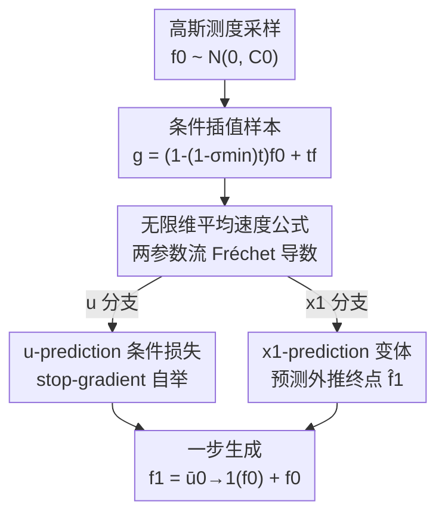

# Functional Mean Flow in Hilbert Space

**会议**: CVPR 2026  
**论文**: [CVF Open Access](https://openaccess.thecvf.com/content/CVPR2026/html/Li_Functional_Mean_Flow_in_Hilbert_Space_CVPR_2026_paper.html)  
**代码**: 未公开  
**领域**: 图像生成 / 扩散模型  
**关键词**: 函数空间生成、Mean Flow、一步生成、Flow Matching、Hilbert 空间  

## 一句话总结
把"一步生成"的 Mean Flow 从有限维欧氏空间搬到无限维 Hilbert（函数）空间，用两参数流的 Fréchet 导数重建了平均速度场的训练目标，并提出更稳定的 x1-prediction 变体，使时间序列、图像、PDE、3D 形状等各种函数型数据都能用单步采样高质量生成。

## 研究背景与动机
**领域现状**：函数型生成模型（Functional Generative Models）把数据看成连续函数而不是离散网格，例如把图像看成定义在像素坐标上的函数 $f:\mathbb{R}^2\to\mathbb{R}^3$。这样做的好处是可以"子采样坐标"——训练时只看一张 256×256 图像里随机的 1/4 像素，推理时却能在 64、128、256、512、1024 任意分辨率上生成，把显存/算力和数据分辨率解耦。Infty-Diff、Functional Flow Matching（FFM）等就是这条路线的代表。

**现有痛点**：和普通扩散/Flow Matching 一样，函数型生成模型推理时也要几十到上千步数值积分（Table 1 里 FFM 要 300–700 NFE、FDDPM 要 1000、DDO 要 2000），速度是硬伤。有限维世界里 Mean Flow 通过"预测时间平均速度"实现了一步采样，FID 比此前一步方法好 60%–90%，但它直接搬不到函数空间。

**核心矛盾**：无限维 Hilbert 空间里，有限维的直觉失效。Mean Flow 的推导依赖"条件速度场的边际 = 真实边际速度场"这个一致性（FFM 里成立），但在两参数流（two-parameter flow）上这条一致性**断掉了**——把条件两参数流做期望，得到的边际流不等于直接定义的两参数流（论文 Statement 1）。此外算子值速度场要算 Fréchet 导数，数值上极不稳定，优化容易发散。

**本文目标**：(1) 在无限维空间里给出一个数学自洽的平均速度公式，绕开条件/边际不一致；(2) 把它写成可训练的条件损失；(3) 解决 u-prediction 在某些任务上训练崩溃的稳定性问题。

**核心 idea**：不去直接套有限维公式，而是从"两参数流对初始时间 $t$ 的导数"出发——证明 $\partial_t\phi_{t\to r}(g)=-D\phi_{t\to r}(g)[u_t(g)]$，由此把没有闭式的平均速度 $\bar u_{t\to r}$ 重写成一个含自身、可用 stop-gradient 自举的条件目标；再额外提出预测终点而非速度的 x1-prediction，换掉容易崩的 u-prediction。

## 方法详解

### 整体框架
FMF 建立在 Functional Flow Matching（FFM）之上。FFM 在可分 Hilbert 空间 $\mathcal F$ 上学一个时变速度场 $u(t,f)$，把参考高斯测度 $\mu_0=\mathcal N(m_0,C_0)$ 沿连续测度路径 $(\mu_t)$ 输运到目标分布 $\mu_1=\nu$；采样时从 $f_0\sim\mu_0$ 出发，积分 ODE $\frac{\mathrm df_t}{\mathrm dt}=u(t,f_t)$ 得到 $f_1\sim\nu$。它的关键是用条件路径 $\mu_t^f=\mathcal N(m_t^f,(\sigma_t^f)^2C_0)$（取 $m_t^f=tf$、$\sigma_t^f=1-(1-\sigma_{\min})t$）让损失变可算。

FMF 要把"多步积分"压成"一步"。整体管线是：**从高斯测度采一个噪声函数 → 在 $t$ 处构造插值样本 $g$ → 算出该样本的条件目标（u 版是平均速度、x1 版是外推终点）→ 用 stop-gradient 自举出可优化的条件损失训练函数-到-函数网络（Neural Operator）→ 推理时一步从 $f_0$ 直接跳到 $f_1$**。训练目标有两条等价但稳定性不同的分支：u-prediction 与 x1-prediction。

### 关键设计

**1. 无限维平均速度公式：用两参数流的初始时间导数绕开条件/边际不一致**

有限维 Mean Flow 的推导建立在"条件速度场做期望 = 边际速度场"上，但 FMF 发现这条一致性在两参数流上失效：把条件两参数流 $\phi_{t\to r}^f=\phi_r^f\circ(\phi_t^f)^{-1}$ 做期望得到的 $\phi^{(1)}_{t\to r}$，并不等于直接定义的 $\phi^{(2)}_{t\to r}=\phi_r\circ\phi_t^{-1}$（Statement 1）。作者换了个出发点：把平均速度定义为 $\bar u_{t\to r}=\frac{1}{r-t}(\phi_{t\to r}-\mathrm{Id}_{\mathcal F})$，其中 $\phi_{t\to r}=\phi_r\circ\phi_t^{-1}$。然后证明（Theorem 3.1）在 FFM 条件下，两参数流对 $t$ 可导、对 $g$ Fréchet 可导，且满足

$$\frac{\partial}{\partial t}\phi_{t\to r}(g)=-D\phi_{t\to r}(g)[u_t(g)],$$

其中 $D\phi_{t\to r}(g):\mathcal F\to\mathcal F$ 是 Fréchet 导数。把它代回平均速度定义、用乘积法则展开，得到自洽的恒等式

$$\bar u_{t\to r}(g)=(r-t)\Big(\frac{\partial}{\partial t}\bar u_{t\to r}(g)+D\bar u_{t\to r}(g)[u_t(g)]\Big)+u_t(g).$$

这一步是全文的理论地基——它不依赖那条断掉的一致性，而是直接在无限维上把"没有闭式的平均速度"表达成"含自身导数 + 瞬时速度"的形式，从而第一次让 Mean Flow 在 Hilbert 空间里有了数学上站得住的定义。

**2. stop-gradient 自举的条件损失：把含自身的目标变成可训练**

上式右端仍含 $\bar u_{t\to r}$ 本身，没法直接当回归目标。沿用 Mean Flow / Consistency Models 的套路，作者用模型当前预测 $\bar u_{t\to r}^\theta$ 去估计这个项并加 stop-gradient（记 $\mathrm{sg}$）冻结其梯度；同时把边际速度 $u_t$ 换成条件速度 $u_t^f$（这一步用了 $u_t$ 是 $u_t^f$ 边际的事实），得到可优化的条件损失

$$\mathcal L_c^M(\theta)=\mathbb E_{t,r,g\sim\mu_t^f,f\sim\mu_1}\Big[\big\|(r-t)\,\mathrm{sg}\big(\tfrac{\partial}{\partial t}\bar u_{t\to r}(g)+D\bar u_{t\to r}(g)[u_t^f(g)]\big)+u_t^f(g)-\bar u_{t\to r}^\theta(g)\big\|_{\mathcal F}^2\Big],$$

其中条件速度有闭式 $u_t^f(g)=\frac{1-\sigma_{\min}}{1-(1-\sigma_{\min})t}(tf-g)+f$。Theorem 3.2 证明该条件损失与真正的边际损失 $\mathcal L^M(\theta)$ 只差一个与 $\theta$ 无关的常数 $C$，因此用它训练等价于优化原目标。实现上，含 $\partial_t$ 和 $D[\cdot]$ 的导数项通过自动微分框架里的 JVP（Jacobian-vector product）一次算出，无需显式构造 Fréchet 导数算子。

**3. x1-prediction 变体：预测外推终点而非速度，换掉会崩的 u-prediction**

u-prediction 预测的是平均速度 $\bar u_{t\to r}$，在某些任务（尤其 SDF-based 3D 形状生成）上训练会"空间方差塌缩"——网络输出退化成常数场后再也回不来。借鉴标准 Flow Matching 的 x1-prediction，作者改成预测"把平均速度线外推到 $t=1$ 的交点"，即期望终点

$$\hat f_{1,t\to r}=(1-t)\,\bar u_{t\to r}+\mathrm{Id}_{\mathcal F}.$$

同样地，$\hat f_{1,t\to r}$ 没法直接优化，作者推出与之配套的条件量 $\hat f_{1,t}^f(g)=\frac{\sigma_{\min}}{1-(1-\sigma_{\min})t}(g-tf)+f$，并给出 x1 版条件损失 $\tilde{\mathcal L}_c^M(\theta)$，Theorem 3.3 证明它同样与边际损失只差常数。和已有终点预测方法的区别要讲清：Consistency Models / Flow Map Matching 预测的是真实未来状态 $f_r$，而本文预测的是速度线与 $t=1$ 的交点；CM 用不上梯度信息、FMM 在梯度算子内部做优化导致不稳定且昂贵，而本文 x1 版与 u 版理论等价却避开了这些毛病。实验上两者多数任务结果相当，但 u 版崩溃的地方 x1 版仍稳定收敛（Figure 6）。

### 损失函数 / 训练策略
训练（Algorithm 1）：采 $f\sim\mathcal D$、$f_0\sim\mathcal N(0,C_0)$、$t,r\sim\mathcal T$，构造插值样本 $g=(1-(1-\sigma_{\min})t)f_0+tf$，按 u 或 x1 分支算条件目标与损失，梯度下降。推理（Algorithm 2）一步出结果：u 版 $f_1=\bar u_{0\to1}^\theta(f_0)+f_0$，x1 版 $f_1=\hat f_{1,0\to1}^\theta(f_0)$。网络沿用各任务原本为多步生成设计的架构（FNO / 混合稀疏-稠密 Neural Operator / 基于点的 Functional Diffusion），唯一改动是把单一时间变量 $t$ 换成 $(t,r)$ 对；初始噪声因无限维空间里白噪声无定义，改用带 Matérn 核的高斯过程或带 mollifier 的白噪声参数化。

## 实验关键数据

### 主实验
覆盖三类任务：真实世界函数生成（1D 时间序列 + 2D Navier–Stokes）、函数型图像生成、SDF-based 3D 形状生成。

1D 统计数据集上（Table 1，指标为生成函数统计量与真值的 MSE，越低越好）FMF 仅用 1 步 NFE 就在一步方法中最优，并逼近上千步的多步基线：

| 数据集 | 指标(均值↓) | FMF(u, 1步) | FMF(x1, 1步) | GANO(1步) | FFM-VP(多步) |
|--------|------------|------------|-------------|-----------|-------------|
| AEMET | Mean | 5.3e-1 | 5.4e-1 | 6.5e+1 | 1.3e-1 (488 NFE) |
| Genes | Mean | 1.6e-3 | 2.1e-3 | 4.6e-2 | 4.2e-4 (290 NFE) |
| Labor | Variance | 7.1e-8 | 1.2e-7 | 2.4e-7 | 3.5e-7 (320 NFE) |

Navier–Stokes（Table 2，密度/谱 MSE↓）：FMF(x1) 密度 8.0e-5、谱 5.6e2，全面碾压一步基线 GANO（2.5e-3 / 3.2e4），接近多步 FFM-OT（3.7e-5 / 9.3e1）。

图像生成（Table 3，FID$_\text{CLIP}$↓，模型仅用 256×256 图像 1/4 像素训练、一步生成）在函数型一步方法里全面 SOTA：

| 方法 | 步数 | CelebAHQ-64 | CelebAHQ-128 | FFHQ-256 | Church-256 |
|------|------|-------------|--------------|----------|-----------|
| GASP | 1 | 9.29 | 27.31 | 24.37 | 37.46 |
| GEM | 1 | 14.65 | 23.73 | 35.62 | 87.57 |
| **FMF (本文)** | **1** | **3.48** | **7.18** | **11.37** | **26.57** |
| ∞-Diff | 100 | 4.57 | 3.02 | 3.87 | 10.36 |

注意 64 分辨率上 FMF 一步（3.48）甚至优于 ∞-Diff 百步（4.57）；高分辨率上仍落后于多步 ∞-Diff，作者也坦承函数型生成的感知保真度通常略低于像素级扩散，换来的是分辨率灵活性。

### 消融实验
分辨率泛化（Table 4，训练于 256、各分辨率 FID$_\text{CLIP}$↓，全部一个模型）验证"训练一次、任意分辨率生成"：

| 数据集 | 64 | 128 | 256 | 512 | 1024 |
|--------|----|----|-----|-----|------|
| CelebA-HQ | 3.48 | 5.86 | 9.17 | 9.70 | 10.96 |
| FFHQ | 4.42 | 7.70 | 11.37 | 12.34 | – |
| AFHQ(条件) | 3.10 | 6.19 | 9.24 | 11.55 | – |

3D 形状重建（Table 5，64 个表面点重建整个 SDF）：本文 1 步 Chamfer 0.060 优于 3DS2VS 的 18 步(0.144) 与 FD 的 64 步(0.101)，但 F-Score 0.584 略低于多步基线，整体精度相当。

### 关键发现
- **u-prediction 在 3D SDF 任务上会"空间方差塌缩"**：Figure 6 显示即便很小学习率，u 版输出方差也会归零、损失震荡，网络退化成常数场无法恢复；x1 版方差稳定、损失平滑——这是论文提出 x1 变体的直接动机，也是两者唯一拉开差距的地方。
- **理论一致性是关键**：条件损失与边际损失只差常数（Theorem 3.2/3.3）保证了用易算的条件目标训练等价于优化真目标，这是把 Mean Flow 安全搬进无限维的前提。
- **架构改动极小**：只把时间变量 $t$ 换成 $(t,r)$ 对就能把现成的多步 Neural Operator 改成一步生成器，说明 FMF 是即插即用的训练范式而非新网络。

## 亮点与洞察
- **换出发点绕开断掉的一致性**：不硬套有限维公式，而是证明两参数流的初始时间导数恒等式（$\partial_t\phi_{t\to r}=-D\phi_{t\to r}[u_t]$），从根上重建无限维平均速度——这是把 Mean Flow 从有限维迁到 Hilbert 空间最关键的一招。
- **首次给 Mean Flow 引入 x1-prediction**：用"预测速度线与 $t=1$ 的交点"替代直接预测速度，在保持理论等价的同时治好了 u 版的塌缩，这个稳定性 trick 可迁移回有限维 Mean Flow。
- **资源-分辨率解耦的工程价值**：训练只喂 25% 像素、推理任意分辨率（连 1024 都能外推），对高分辨率/大数据场景的显存友好性很实用。

## 局限与展望
- **感知保真度仍逊于像素级扩散**：作者承认函数型一步生成在高分辨率上 FID 仍落后多步 ∞-Diff，更适合"要分辨率灵活性"而非"要极致画质"的场景。
- **u-prediction 不通用**：u 版在 3D SDF 上直接崩，需要切到 x1 版；论文未给出"何时该用哪个变体"的判据，⚠️ 选择目前更像经验性的（以原文为准）。
- **理论假设较强**：Theorem 3.1 需要 $\int_{\mathcal F}\|f\|_{\mathcal F}^2\mathrm d\nu(f)<\infty$ 及 FFM 的若干条件，且大量证明放在附录，正文难自验完整性。
- **改进思路**：把 x1 版稳定性优势与高分辨率画质短板结合，或引入少步（few-step）而非纯一步以换更高保真度，可能是后续方向。

## 相关工作与启发
- **vs Mean Flow（有限维）**：本文把它的"预测时间平均速度实现一步生成"思想搬到无限维 Hilbert 空间，区别在于有限维那条条件/边际一致性在两参数流上失效，本文用 Fréchet 导数重建目标并加 x1 变体，优势是适用于函数型数据、劣势是理论更重。
- **vs Functional Flow Matching（FFM）**：FFM 是本文的多步基座，FMF 把它的多步积分压成一步；实验里 FMF 一步逼近 FFM 几百步，代价是画质略降。
- **vs Consistency Models / Flow Map Matching**：CM/FMM 预测真实未来状态 $f_r$，本文 x1 版预测速度线与 $t=1$ 的交点；本文与 u 版理论等价、能充分用梯度信息，且避开 FMM 在梯度算子内部优化带来的不稳定与高开销。

## 评分
- 新颖性: ⭐⭐⭐⭐⭐ 首次把 Mean Flow 一步生成搬进无限维 Hilbert 空间，并首创 Mean Flow 的 x1-prediction 变体。
- 实验充分度: ⭐⭐⭐⭐ 覆盖时间序列/PDE/图像/3D 四类任务且有分辨率泛化与稳定性消融，但高分辨率画质仍逊多步、3D 指标互有胜负。
- 写作质量: ⭐⭐⭐⭐ 理论推导清晰、动机层层递进，但核心证明大量压在附录，正文偏密。
- 价值: ⭐⭐⭐⭐ 给函数型生成提供了即插即用的一步训练范式，分辨率-资源解耦在大规模生成上很实用。

<!-- RELATED:START -->

## 相关论文

- [\[CVPR 2026\] Improved Mean Flows: On the Challenges of Fastforward Generative Models](improved_mean_flows_on_the_challenges_of_fastforward_generative_models.md)
- [\[ICLR 2026\] RMFlow: Refined Mean Flow by a Noise-Injection Step for Multimodal Generation](../../ICLR2026/image_generation/rmflow_refined_mean_flow_by_a_noise-injection_step_for_multimodal_generation.md)
- [\[ICLR 2026\] CMT: Mid-Training for Efficient Learning of Consistency, Mean Flow, and Flow Map Models](../../ICLR2026/image_generation/cmt_mid-training_for_efficient_learning_of_consistency_mean_flow_and_flow_map_mo.md)
- [\[CVPR 2026\] Scale Space Diffusion：把尺度空间塞进扩散过程](scale_space_diffusion.md)
- [\[CVPR 2026\] CaTok: Taming Mean Flows for One-Dimensional Causal Image Tokenization](catok_taming_mean_flows_for_one-dimensional_causal_image_tokenization.md)

<!-- RELATED:END -->
