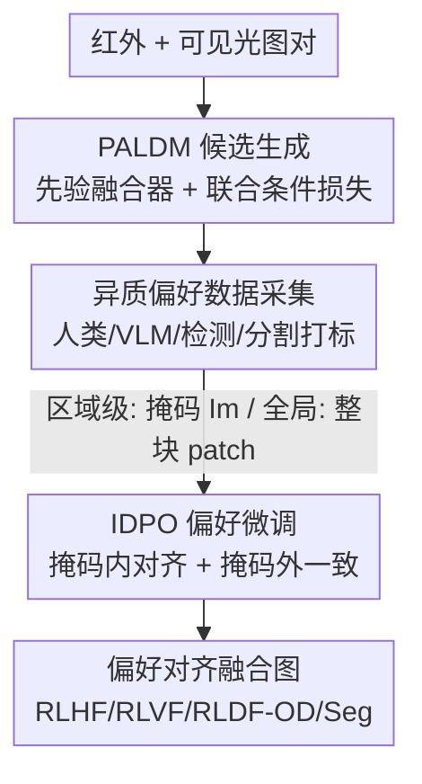

# Fusion in Your Way: Aligning Image Fusion with Heterogeneous Demands via Direct Preference Optimization

**会议**: CVPR 2026  
**arXiv**: [2605.06049](https://arxiv.org/abs/2605.06049)  
**代码**: https://github.com/suweijian1996/DPOFusion （有）  
**领域**: 扩散模型 / 多模态图像融合 / 偏好对齐  
**关键词**: 红外可见光融合、直接偏好优化、潜空间扩散、异质需求、区域级对齐

## 一句话总结
DPOFusion 把 LLM 里的直接偏好优化（DPO）搬到红外-可见光图像融合上，先用一个属性对齐的潜空间扩散模型生成多样化融合候选，再用「实例级 DPO」只在感兴趣区域做偏好微调、区域外强制和参考模型保持一致，从而用一套框架同时满足人类、VLM、检测、分割四类异质偏好。

## 研究背景与动机

**领域现状**：红外-可见光图像融合（IVIF）的目标是把红外的热辐射信息和可见光的纹理细节融到一张图里，既服务人眼观感，也服务下游的检测/分割任务。近年的学习类方法已经能做「偏好感知融合」——对齐感知质量、对齐某个区域、或对齐某个评测指标。

**现有痛点**：但这些方法几乎都是「一种需求训一个模型」：要好看就训一个、要利于检测又训一个，需要各自独立的网络和复杂的训练策略，灵活性和可扩展性都差。现实里不同用户、不同应用对同一场景的融合结果要求是**异质的**（有人要整体画质、有人要自然观感、有人要适配检测/分割），缺一个统一框架能自适应地满足这些不同偏好。

**核心矛盾**：IVIF 是**无监督**任务（没有 ground-truth 融合图），解空间巨大，大多数候选既不够清晰也不够语义准确；而偏好自适应又要求模型只在局部区域迎合某种偏好，可一旦动了共享网络参数，往往会殃及无关区域，导致全局结构不一致、视觉割裂。也就是说，要同时做到**局部可调**与**全局一致**。

**切入角度**：作者注意到一个关键观察——尽管用户对融合结果的偏好五花八门，但他们**评判融合质量好坏的标准其实是一致的**。这意味着可以先训一个高质量的「先验融合器」生成候选池，再在这个稳定底座上用少量偏好数据做轻量微调，而不必为每种需求从头训练。

**核心 idea**：把 DPO 引入 IVIF——用偏好对（preferred vs rejected）直接微调扩散策略，省掉显式奖励模型；并进一步把偏好监督**限制在掩码区域内**（实例级 DPO），区域外用一致性约束锁住，实现「按你的方式融合」（fusion in your way）。

## 方法详解

### 整体框架
DPOFusion 是一条三阶段流水线：**候选生成 → 偏好数据采集 → 偏好微调**。先训一个属性对齐潜空间扩散模型（PALDM）作为冻结底座，输入红外/可见光图对，输出一池具有不同属性的高质量融合候选；然后由人类、VLM、检测/分割模型对候选打偏好标签，给出「更好/更差」样本对以及一个感兴趣区域掩码 $I_m$；最后用偏好可控潜空间扩散模型（PCLDM）通过实例级 DPO（IDPO）做微调，只在掩码内迎合偏好、掩码外保持和底座一致，解码得到最终偏好对齐的融合图。整套机制都在 VAE 的潜空间里完成。

### 关键设计

**1. PALDM 属性对齐候选生成：用联合条件损失把「同一场景的不同属性」一次性教进先验模型**

无监督融合解空间太大，直接生成的候选往往质量参差，没法当作偏好微调的可靠底座。作者先训一个先验融合器 $\epsilon_{\text{lfm}}$（Restormer 架构），把红外/可见光潜码 $z_{\text{ir}}, z_{\text{vis}}$ 拼接成 $z_c$ 后预测融合潜码 $z_{\text{fusion}}$，用强度+梯度的最大值保持损失 $\mathcal{L}_{\text{fusion}} = \sigma_1 |\max(I_{\text{ir}}, I_{\text{vis}}) - I_{\text{fusion}}| + \sigma_2 |\max(\nabla I_{\text{ir}}, \nabla I_{\text{vis}}) - \nabla I_{\text{fusion}}|$（$\nabla$ 为 Sobel 算子）保证融合图保留两边的亮度与边缘。

真正巧妙的是**联合条件损失**：为了让候选池覆盖多种「属性」，作者在先验融合潜码基础上构造一个属性插值潜码——定义 $N$ 个离散等级、随机采样 $k$、令插值系数 $\alpha = k/(N-1)$，得到 $z_{\text{fusion}}' = \frac{1}{2}(\alpha \cdot z_{\text{ir}} + (1-\alpha) \cdot z_{\text{vis}}) + \frac{1}{2} z_{\text{fusion}}$，即在「偏红外」和「偏可见光」之间连续滑动。然后让扩散模型 $\epsilon_{\text{ref}}$ 同时学两件事：在通用文本提示 $c_t$ 下去噪标准融合潜码、在属性专属提示 $c_t'$ 下去噪插值潜码，损失为

$$\mathcal{L}_c = \mathbb{E}_{z_c,k,t,\epsilon}\left[\mathcal{L}_{\text{denoise}}(z_{\text{fusion}}, c_t) + \lambda \mathcal{L}_{\text{denoise}}(z_{\text{fusion}}', c_t')\right]$$

这样一个模型就能按不同文本提示生成不同属性倾向的候选，为后续偏好标注/任务评测提供丰富多样的素材，而不必为每种属性单独训练

**2. IDPO 实例级直接偏好优化：把偏好监督关进掩码、区域外锁死，破解「调局部殃及全局」**

标准 DPO 是图像级的全局偏好对齐，用在融合上会牵一发动全身——调好某块区域却把别处搞砸。IDPO 的核心是把损失拆成「掩码内做偏好对齐 + 掩码外做严格一致」两部分。掩码内，定义优选/拒绝样本相对参考模型的误差差值 $\mathcal{P}_w, \mathcal{P}_l$（即 $\|(\epsilon - \epsilon_\theta)\odot z_m\|_2^2 - \|(\epsilon - \epsilon_{\text{ref}})\odot z_m\|_2^2$，$z_m$ 是 $I_m$ 下采样得到的潜空间掩码），用 DPO 式的 logistic 项拉大优选、压低拒绝；掩码外，用 $\mathcal{O}_w, \mathcal{O}_l = \|(\epsilon_\theta - \epsilon_{\text{ref}})\odot z_m^c\|_2^2$ 把可训练分支的输出钉在冻结参考模型上。总损失为

$$\mathcal{L}_{\text{IDPO}} = \mathbb{E}\left[\underbrace{-\log\sigma(-\beta_t \cdot (\mathcal{P}_w - \mathcal{P}_l))}_{\text{偏好区域}} + \mu \cdot \underbrace{(\mathcal{O}_w + \mathcal{O}_l)}_{\text{其它区域}}\right]$$

其中 $\beta_t$ 控制偏离参考模型的正则强度，$\mu$ 平衡两项。这样既能在感兴趣区精确迎合偏好，又不破坏全局视觉一致性，正面解决了 Motivation 里「局部可调 vs 全局一致」的矛盾

**3. 双源偏好采集 + 零初始化旁路注入：让一个框架吃下四类异质偏好信号**

异质需求的偏好信号形态不一：有的天然带精确区域（人类主观偏好、分割），有的难拿到实例掩码（VLM、检测）。作者据此设计两种采集方式——**区域级采集**直接给出偏好区域掩码 $I_m$ 配上优选/拒绝样本，用于人类主观偏好和分割任务；**全局级采集**用一条样本过滤管线筛出优选/拒绝样本并抽取对应局部 patch，把掩码 $I_m$ 设为覆盖整块 patch，用于 VLM 和检测任务。这样四类偏好（RLHF/RLVF/RLDF-OD/RLDF-Seg）都能统一成 $(z_c, I_0^w, I_0^l, I_m)$ 的数据格式喂给 IDPO。

在架构上，PCLDM $\epsilon_\theta$ 从 PALDM 复制初始化（继承融合先验），冻结参考分支 $\mathcal{F}_{\text{ref}}$ 接通用提示 $c_t$、可训练分支 $\mathcal{F}_\theta$ 接偏好提示 $c_t'$，两者通过一个**零初始化的 $1\times1$ 卷积** $\mathcal{Z}$ 相加：$y_p = \mathcal{F}_{\text{ref}}(x, c_t) + \mathcal{Z}(\mathcal{F}_\theta(x, c_t'))$。零初始化（借鉴 ControlNet）保证微调初期旁路不向底座注入随机噪声梯度，保护原有融合能力，实现快速且稳定的偏好特化

### 损失函数 / 训练策略
- PALDM 先验融合器：$\mathcal{L}_{\text{fusion}}$，$\sigma_1=4$、$\sigma_2=10$。
- PALDM 扩散：联合条件损失 $\mathcal{L}_c$，平衡系数 $\lambda=2$，文本用 CLIP ViT-L/14 编码。
- PCLDM 微调：$\mathcal{L}_{\text{IDPO}}$，每个具体提示从 PALDM 底座微调 20 epoch，学习率 $1\times10^{-5}$、batch size 8；$\beta_t=10$（RLHF/RLVF/RLDF-Seg），$\beta_t=500$（RLDF-OD）。
- 训练用 LLVIP，裁成 $256\times256$；2×RTX 4090 训练，单卡推理。

## 实验关键数据

### 主实验（IVIF 质量，Table 1，无参考指标越高越好）

| 数据集 | 指标 | DPOFusion-RLHF | DPOFusion-RLVF | 此前最优(竞品) |
|--------|------|------|------|------|
| LLVIP | EN / SD | **7.725** / **61.911** | 7.554 / 53.299 | 7.441 / 51.270 |
| LLVIP | MUS / CNN | 57.295 / 0.655 | 57.280 / **0.660** | 56.683 / 0.649 |
| MSRS | EN / SD | 7.138 / 53.385 | **7.203** / **56.614** | 7.040 / 44.591 |
| MSRS | AG / MUS | 5.601 / 39.140 | **5.782** / **39.684** | 3.936 / 38.902 |
| RoadScene | EN / AG | 7.210 / 5.957 | **7.574** / **8.622** | 7.499 / 6.413 |

RLVF 在 EN/SD/AG 上多处最优（更强调纹理细节），RLHF 在 MUSIQ/CNNIQA 上多处最优（更贴近人眼整体观感），两个变体各有侧重、互补。

### 下游任务（Table 2）

| 任务 / 数据集 | 指标 | RLDF (Ours) | 提升 |
|------|------|------|------|
| 语义分割 / MSRS | mIoU | 55.96 | +0.5% over 次优 |
| 目标检测 / M3FD | mAP@.5:.95 | 43.40 | +4.2% mAP |

检测任务用 YOLOv11 响应当提示、分割用 SegFormer，RLDF-OD 在 mAP@.5:.95 取得 43.40（多类别如 People 48.50、Lamp 26.27 领先），说明融合图确实被调到了利于下游模型的方向。

### 消融实验（Table 3）

| 配置 | EN | SD | MUS | CNN | 说明 |
|------|----|----|-----|-----|------|
| PALDM w/ $\mathcal{L}_{\text{ST}}$ | 7.647 | 58.215 | 55.515 | 0.649 | 单目标损失 |
| PALDM w/ $\mathcal{L}_{\text{ET}}$ | 7.470 | 53.612 | 53.848 | 0.608 | 多目标但无联合 |
| PALDM w/ $\mathcal{L}_c$ | **7.680** | **60.806** | **56.154** | **0.659** | 联合条件损失（完整） |
| PCLDM w/ $\mathcal{L}_{\text{DPO}}$ | 7.600 | 57.089 | 53.850 | 0.652 | 标准全局 DPO |
| PCLDM w/ $\mathcal{L}_{\text{contrast}}$ | 7.352 | 51.077 | 55.303 | **0.694** | 对比损失 |
| PCLDM w/ $\mathcal{L}_{\text{IDPO}}$ | **7.725** | **61.911** | **57.295** | 0.655 | 实例级 DPO（完整） |

分割任务上 IDPO 进一步把 mIoU 从 55.21（w/o IDPO）/55.20（标准 DPO）提到 55.96、mAcc 提到 64.26。

### 关键发现
- **联合条件损失是候选质量的关键**：$\mathcal{L}_c$ 在 SD（60.806 vs 58.215/53.612）等指标上全面优于单/多目标变体，说明「同一模型同时学标准融合 + 属性插值」确实造出了更高质量、更多样的候选池。
- **IDPO 优于标准 DPO**：标准全局 DPO 在分割上几乎没带来增益（55.20 vs 55.21），而 IDPO 提升明显——把偏好关进掩码、区域外锁一致，是「调局部不毁全局」的核心。
- **RLHF 在 RoadScene 上指标相对低**：作者解释为复杂场景下人类评判者更看重整体视觉协调而非局部细节，是一个诚实的 caveat。
- CLIP-I / DINO 相似度（Figure 8）显示 IDPO 输出与 ground-truth 优选图最接近，佐证偏好学习更精确。

## 亮点与洞察
- **把 LLM 对齐范式干净地迁到无监督融合**：DPO 本是 LLM 的对齐工具，作者抓住「融合没有 GT、本质是偏好问题」这个共性把它搬过来，省掉显式奖励模型，思路顺畅，是一次漂亮的跨域迁移。
- **「掩码内对齐 + 掩码外一致」的拆分非常实用**：这个 IDPO 结构不止用于融合，任何「只想局部调、又怕动全局」的可控生成/编辑任务都能借鉴——掩码内放偏好 loss、掩码外用参考模型当锚点。
- **联合条件损失用一条插值轴造多样性**：通过 $\alpha$ 在红外/可见光之间连续滑动，配上属性文本提示，单模型即可覆盖一整谱系的属性倾向，省去了为每种风格单独训练，可复用到其它多模态融合任务。
- **零初始化旁路 + 冻结底座**：继承 ControlNet 思想保护预训练能力、稳定微调，让「一套底座 + 多个轻量偏好头」成为可能。

## 局限与展望
- **每个偏好提示要单独微调 20 epoch**：虽然底座共享，但 RLHF/RLVF/RLDF-OD/RLDF-Seg 各自微调出一个 PCLDM，并非真正「一个模型零样本切换偏好」，实际部署仍是多套权重。
- **$\beta_t$ 在检测任务上要拉到 500**（其它任务 10），跨任务超参跨度大，说明偏好强度对任务高度敏感，迁移到新任务可能需重新调参。
- **下游提升幅度有限**：分割 mIoU 仅 +0.5%，检测 mAP +4.2%，质量类指标提升更明显，对真正的机器视觉性能增益偏温和。
- **依赖偏好标注/采集管线**：人类标注、VLM（QWEN3-Omni）打分、任务模型反馈都需额外采集，偏好数据的成本与一致性会直接影响对齐质量。
- **指标多为无参考画质指标**（EN/SD/AG/MUSIQ/CNNIQA），更高未必等于「人真的更喜欢」，缺乏大规模人类主观评测的统计验证。

## 相关工作与启发
- **vs Diffusion-DPO / PatchDPO**：它们把 DPO 用在文生图，做的是全局或 patch 级偏好；本文把偏好优化精确限制到任意掩码区域，并显式加全局一致性约束，更契合融合任务「局部调、全局稳」的需求。
- **vs Text-IF / EMMA / SHIP 等融合 SOTA**：这些方法多为「一种需求一个模型」或文本引导单一方向，本文用统一底座 + 轻量偏好微调覆盖人类/VLM/检测/分割四类异质需求，灵活性更强。
- **vs ControlNet**：借用其零初始化旁路注入思想保护底座，但把控制信号从空间结构换成了「偏好对 + 掩码」，并用 DPO 目标而非重建目标来训练旁路。

## 评分
- 新颖性: ⭐⭐⭐⭐ 首次把 DPO 系统性引入红外-可见光融合，IDPO 的掩码内外拆分有原创性。
- 实验充分度: ⭐⭐⭐⭐ 四类偏好 × 多数据集 + 完整 loss 消融，但下游增益偏温和、缺人类主观大样本验证。
- 写作质量: ⭐⭐⭐⭐ Motivation→三阶段框架→公式推导脉络清晰，符号略密。
- 价值: ⭐⭐⭐⭐ 统一框架满足异质需求 + 可迁移的 IDPO 结构，对可控融合/编辑有借鉴意义。

<!-- RELATED:START -->

## 相关论文

- [\[CVPR 2026\] MagicFuse: Single Image Fusion for Visual and Semantic Reinforcement](magicfuse_single_image_fusion_for_visual_and_semantic_reinforcement.md)
- [\[CVPR 2026\] Compositional Text-to-Image Generation Via Region-aware Bimodal Direct Preference Optimization](compositional_text-to-image_generation_via_region-aware_bimodal_direct_preferenc.md)
- [\[CVPR 2026\] Towards Fine-Grained Attribution: Instance-Aware Preference Optimization for Aligning Diffusion Models](towards_fine-grained_attribution_instance-aware_preference_optimization_for_alig.md)
- [\[CVPR 2026\] GlyphPrinter: Region-Grouped Direct Preference Optimization for Glyph-Accurate Visual Text Rendering](glyphprinter_region-grouped_direct_preference_optimization_for_glyph-accurate_vi.md)
- [\[CVPR 2026\] CaReFlow: Cyclic Adaptive Rectified Flow for Multimodal Fusion](careflow_cyclic_adaptive_rectified_flow_for_multimodal_fusion.md)

<!-- RELATED:END -->
