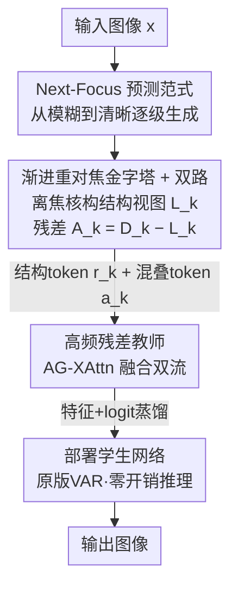

# FVAR: Next-Focus Prediction for Visual Autoregressive Modeling

**会议**: CVPR 2026  
**论文**: [CVF Open Access](https://openaccess.thecvf.com/content/CVPR2026/html/Li_FVAR_Next-Focus_Prediction_for_Visual_Autoregressive_Modeling_CVPR_2026_paper.html)  
**代码**: 未公开  
**领域**: 视觉自回归生成  
**关键词**: 视觉自回归, 抗锯齿, 离焦核, 多尺度金字塔, 知识蒸馏  

## 一句话总结
FVAR 把视觉自回归（VAR）的「next-scale prediction」改写成「next-focus prediction」——用物理一致的离焦核构建从模糊到清晰的金字塔，从源头消除均匀下采样带来的混叠（锯齿/摩尔纹），再用一个只在训练期存在的高频残差教师把混叠信息蒸馏给原版 VAR 学生网络，做到推理零额外开销且在 ImageNet 上把 FID 全面压过 VAR / M-VAR。

## 研究背景与动机
**领域现状**：VAR 系列把图像自回归重构成「next-scale prediction」——先把图像编码成一座多尺度 token 金字塔（粗分辨率 → 细分辨率），然后让 Transformer 从最粗的尺度逐级预测到最细的尺度。这套范式相比扩散模型在可扩展性和速度上很有优势，已经成了离散 token 自回归生成的主流骨架。

**现有痛点**：构建金字塔时，几乎所有 VAR 变体都用**均匀下采样**（uniform downsampling）来生成低分辨率视图。但下采样在没有抗混叠预滤波的情况下，会把超过奈奎斯特频率的高频内容「折叠」回基带，直接产生混叠伪影：锯齿边缘、阶梯状走样、摩尔纹。这些伪影在规则纹理、小字体上尤其明显。

**核心矛盾**：混叠是在金字塔构建阶段就被「烧进」训练数据里的。于是自回归 Transformer 被迫同时干两件事——既要去混叠（修复这些被人为引入的伪影），又要生成精细细节。这两个目标互相打架，会让训练不稳定，最终牺牲细节保真度和文字可读性。

**切入角度**：作者把视角从「数字信号处理」换成「光学成像物理」。真实相机成像不是靠降分辨率得到粗略版本，而是通过**对焦**过程从模糊逐渐变清晰——光学模糊单调减小。模糊视图天然是带限（band-limited）的，不会有混叠。

**核心 idea**：用「next-focus prediction」替代「next-scale prediction」——不再预测一个有损降分辨率的更粗尺度，而是预测一个**模糊更少的对焦状态**，用单调缩小半径的离焦核构建天然无混叠的金字塔；同时把下采样视图里被滤掉的高频残差单独建模，用一个训练期教师把它蒸馏回普通 VAR。

## 方法详解

### 整体框架
FVAR 要解决的是「金字塔构建阶段引入混叠 → 污染自回归训练」这个源头问题。整体流程是：对一张图像，用一组半径递减的离焦核做卷积，得到从最模糊（$\rho_1$）到最清晰（$\rho_K=0$）的**对焦序列**，这就是无混叠的结构视图金字塔；同时对每一尺度，把传统下采样视图减去对焦视图，得到一支**高频残差**。结构视图和残差分别用两套码本量化成「结构 token」$r_k$ 和「混叠 token」$a_k$（双路 tokenization）。训练时跑两个网络：**教师网络**用 Alias-Gate Cross-Attention 同时吃结构 token 和混叠 token，**学生网络（即部署网络）**只吃结构 token、保持原版 VAR 架构；教师把高频知识通过特征对齐 + logit 蒸馏传给学生。推理时只用学生网络，行为与普通 VAR 完全一致、零额外开销。

### 关键设计

**1. Next-Focus 预测范式：把「降分辨率」换成「减模糊」**

VAR 的混叠根源在于「用有损的分辨率缩减来制造粗尺度」。FVAR 直接换掉这一步：建模一个光学对焦过程，让模糊单调减小而非分辨率下降。形式化为对原图施加一组半径递减的离焦核：

$$\mathcal{F}: x \to \{F_{\rho_1}(x), F_{\rho_2}(x), \dots, F_{\rho_K}(x)\},\quad F_{\rho_k}(x) = (k_{\rho_k} \star x),\ \ \rho_1 > \rho_2 > \cdots > \rho_K = 0$$

这样定义有三个直接好处：每个对焦状态 $F_{\rho_k}(x)$ 都被 PSF 的频率响应**带限**，从根上杜绝混叠（Spectral Preservation）；模糊核空间里这些状态构成连续流形，可平滑插值（Continuity）；信息量随 $\rho_k \to 0$ 单调递增（Information Monotonicity），正好契合自回归「逐步补充信息」的生成方向。相比 VAR 那种「先把高频折叠进基带、再让 Transformer 去修」的事后补救，这是「不让混叠发生」的事前预防。

**2. 渐进重对焦金字塔 + 双路 tokenization：物理一致地造无混叠视图，并把高频单独捞出来**

离焦 PSF 用圆形光圈近似成归一化圆盘核 $k_\rho$，其半径按余弦调度单调递减，保证从模糊到清晰的平滑过渡：

$$\rho_k = \rho_{\max} \cdot \frac{1 - \cos\!\left(\pi \frac{k-1}{K-1}\right)}{2},\quad k = 1, 2, \dots, K$$

但纯光学低通会滤掉真正有用的高频，所以作者用**双路**策略同时保留两份信息：物理对焦视图 $L_k = (k_{\rho_k} \star x)\!\downarrow_{s_k} + \beta_k\varepsilon$（带噪声项 $\beta_k\varepsilon$ 保证协方差满秩、训练稳定），传统下采样视图 $D_k = x\!\downarrow_{s_k}$，以及二者之差得到的**高频残差** $A_k = D_k - L_k$。论文从频域给出了这套分解的依据：理想低通下 $\hat L_k(\omega) = X(\omega)$（通带内无混叠），而残差 $\hat A_k$ 恰好聚合了被折叠的超奈奎斯特高频（编码了边缘朝向、纹理、细结构）。$L_k$ 走结构码本 $\mathcal{C}_L$（8192 项）、$A_k$ 走更小的混叠码本 $\mathcal{C}_A$（512 项，反映高频模式的稀疏性），分别量化为 $r_k = Q_L(L_k)$ 与 $a_k = Q_A(A_k)$。这一步同时产出了「干净结构」和「高频证据」两路 token，为下一步蒸馏铺路。

**3. 高频残差教师 + Alias-Gate Cross-Attention：训练期吃高频、部署期保持原版 VAR**

高频残差有价值，但如果直接塞进部署网络就会破坏 VAR 的架构兼容性。作者的做法是把「混叠感知训练」和「推理」解耦：只在**教师网络**里引入 Alias-Gate Cross-Attention（AG-XAttn），且只作用于最后 $M\in\{1,2\}$ 个自回归尺度以省算力。AG-XAttn 先对结构 token 做窗口自注意力，再用结构 token 当 Query、混叠 token 当 Key/Value 做交叉注意力，把高频选择性地融进来：

$$Z = \text{WSA}(E(r_k)) + \text{Attn}\big(Q = X_L W_Q,\ K = E_a(a_k)W_K,\ V = E_a(a_k)W_V\big)$$

作者给了一个维纳滤波视角的解读：局部线性化后这步约等于一个数据相关的门控残差 $Z \approx X_L + \alpha \odot \tilde A_k$，其中 $\alpha \in [0,1]^d$ 的最优增益对应经典维纳滤波 $\alpha^*(\omega) = S_{xx}(\omega)/(S_{xx}(\omega)+S_{nn}(\omega))$——直觉上注意力会**放大可靠的、对齐边缘的频率，抑制容易生成摩尔纹的混叠模式**。⚠️ 这个维纳滤波等价是作者给的近似解读，严格性以原文为准。混叠 token 始终被排除在自回归预测序列之外，学生网络省掉 AG-XAttn、只用标准自注意力处理结构 token，因此和原版 VAR 完全一致。最终通过在线蒸馏把教师能力转给学生，推理时教师被丢弃，零额外开销。

### 损失函数 / 训练策略
学生网络通过多级目标向教师对齐。逐尺度 $k$ 的总损失为：

$$\mathcal{L}_{\text{total}} = \mathcal{L}^{\text{stu}}_{\text{AR}}(r_{k-1}, p_{\text{stu}}) + \lambda_{\text{feat}}\sum_\ell \big\| F^{(\ell)}_{\text{stu}} - \text{sg}(F^{(\ell)}_{\text{tea}}) \big\|_2^2 + \lambda_{\text{logit}}\cdot \text{KL}(p_{\text{tea}} \| p_{\text{stu}})$$

其中第一项是学生的标准自回归损失，第二项在最后 12 个 encoder block 上做特征对齐（$\text{sg}$ 为 stop-gradient），第三项用 KL 对齐输出分布。实现上：$K=4$ 个尺度、$\rho_{\max}=12$ 像素、余弦调度；$\lambda_{\text{feat}}=1.0$、$\lambda_{\text{logit}}=0.5$；噪声 $\beta_k$ 跨尺度从 $1\times10^{-3}$ 线性升到 $1\times10^{-2}$；两阶段训练——先训双 VQ tokenizer 100K 步，再端到端训 400K 步（lr $1\times10^{-4}$，batch 256，8×A100）。教师只在训练期生效，训练完即丢弃。复杂度上 AG-XAttn 只额外加 6–15% 训练 FLOPs，部署推理与原版 VAR 完全相同。

## 实验关键数据

### 主实验
ImageNet 256×256 类条件生成，FVAR 在各模型规模上一致优于 VAR 和 M-VAR，且推理速度（Time）相当：

| 模型 | 参数量 | FID↓ | IS↑ | Pre↑ | Rec↑ | Time |
|------|--------|------|-----|------|------|------|
| VAR-d12 | 132M | 5.81 | 201.3 | 0.81 | 0.45 | 1.0 |
| M-VAR-d12 | 198M | 4.19 | 234.8 | 0.83 | 0.48 | 1.0 |
| **FVAR-d12** | 132M | **3.95** | 238.2 | 0.84 | 0.49 | 1.0 |
| VAR-d16 | 310M | 3.55 | 280.4 | 0.84 | 0.51 | 1.0 |
| M-VAR-d16 | 464M | 3.07 | 294.6 | 0.84 | 0.53 | 1.0 |
| **FVAR-d16** | 310M | **2.89** | 298.1 | 0.85 | 0.54 | 1.0 |
| VAR-d24 | 1.0B | 2.33 | 312.9 | 0.82 | 0.59 | 2.5 |
| M-VAR-d24 | 1.5B | 1.93 | 320.7 | 0.83 | 0.59 | 3.0 |
| **FVAR-d24** | 1.0B | **1.75** | 325.8 | 0.84 | 0.61 | 2.5 |

值得注意的是 FVAR 在**相同参数量**下就超过了 VAR，甚至 FVAR-d24（1.0B）的 FID 1.75 优于参数更多的 M-VAR-d24（1.5B，1.93）。高分辨率同样持续受益：

| 模型 | 512×512 FID↓ | 512×512 IS↑ | 1024×1024 FID↓ | 1024×1024 IS↑ |
|------|-------------|-------------|----------------|----------------|
| VAR-d36 | 2.63 | 303.2 | – | – |
| **FVAR-d36** | **2.28** | 315.6 | – | – |
| VAR-d16 | – | – | 8.25 | 298.3 |
| **FVAR-d16** | – | – | **6.85** | 315.2 |

### 消融实验
在 FVAR-d16 上逐个去掉组件（ImageNet 256×256 与 1024×1024 对比）：

| 配置 | 256² FID↓ | 256² IS↑ | 1024² FID↓ | 1024² IS↑ |
|------|-----------|----------|------------|-----------|
| VAR-d16（baseline） | 3.55 | 280.4 | 8.25 | 298.3 |
| **FVAR-d16（Full）** | **2.89** | **298.1** | **6.85** | **315.2** |
| w/o Progressive Refocusing | 3.51 | 282.1 | 8.15 | 299.0 |
| w/ Gaussian blur（替代 PSF） | 3.32 | 286.7 | 7.50 | 305.2 |
| w/o High-Freq Teacher | 3.06 | 294.8 | 7.20 | 308.5 |
| w/o Dual tokenizers | 3.14 | 292.1 | 7.40 | 306.8 |

### 关键发现
- **渐进重对焦的收益强烈依赖分辨率**：256² 下去掉它 FID 几乎不掉（3.51 vs 2.89，接近 baseline），但 1024² 下直接退回 baseline（8.15 vs 6.85）。作者解释 FID 主要刻画整体分布统计，对高频细节/混叠不敏感——低分辨率下要靠肉眼才看得出差距，而高分辨率混叠更严重、更难事后修复，所以这个组件越到高分辨率越关键。
- **物理一致的 PSF 比朴素高斯模糊更好**：用高斯模糊替代 PSF 也比标准下采样有提升（1024² 7.50 vs 8.25），但仍明显不如物理离焦核（6.85），说明「光学真实性」本身有用，不是随便模糊一下就行。
- **高频残差教师在高分辨率贡献更大**：去掉教师后 256² 掉到 3.06、1024² 掉到 7.20，印证 teacher-student 框架确实把高频细节蒸馏进了部署网络，且分辨率越高越重要。

## 亮点与洞察
- **把「换范式」做成了「免费午餐」**：核心创新（next-focus、双路高频）全部塞进训练期的金字塔构建和教师网络，部署网络保持原版 VAR、零推理开销，可无缝套到现有 VAR 框架上——这是它最实用的地方。
- **从信号处理根因下手**：别人把混叠当成「decoder 需要事后修的问题」，FVAR 直接论证混叠是「金字塔构建时折叠进来的」，于是用带限的离焦核从源头杜绝。这个「在数据构建阶段消除伪影」的思路可迁移到任何需要多尺度下采样的生成/重建任务。
- **高频不丢、单独建模**：用一个超小码本（512 vs 8192）专门捕捉稀疏的高频残差，再用门控交叉注意力（维纳滤波视角）选择性融合，是「既要无混叠的干净结构、又不想丢细节」这对矛盾的一个巧妙折中。

## 局限与展望
- **FID 不足以反映核心收益**：作者自己承认渐进重对焦在 256² 下 FID 几乎不动，主要靠视觉检查和高分辨率才看出价值——意味着在常用的低分辨率 FID 基准上，这套方法的优势会被严重低估。
- **离焦物理模型是近似**：圆盘 PSF、维纳滤波等价都是理想化近似（⚠️ 严格性以原文为准），真实相机离焦更复杂；噪声项 $\beta_k\varepsilon$ 的调度也是经验设定。
- **只在 ImageNet 类条件生成上验证**：虽然提到额外大规模数据，但主表都是 ImageNet，文生图等更复杂条件下能否同样压制混叠未充分展示；K=4、$\rho_{\max}=12$ 等超参的迁移性也待考。
- **训练成本上升**：双 tokenizer + 教师网络让训练流程更重（额外 6–15% FLOPs + 两阶段训练），换取的是推理零开销，属于把成本转移到训练侧。

## 相关工作与启发
- **vs VAR**：VAR 用均匀下采样做 next-scale prediction，混叠在金字塔阶段就被引入；FVAR 改成 next-focus prediction、用离焦核从源头消除混叠，相同参数量下 FID 全面更优，且完全兼容 VAR 推理。
- **vs M-VAR**：M-VAR 通过解耦尺度内/尺度间依赖、用线性状态空间模块提效，关注的是**效率**；FVAR 关注的是**金字塔构建质量**（抗混叠），两者正交互补，FVAR 甚至以更少参数超过 M-VAR。
- **vs 传统抗混叠 / 去摩尔纹方法**（如 Blur-Pool、小波域 demoiré）：这些主要面向图像复原/分类，是在**已有图像上事后修复**；FVAR 把抗混叠前置到生成管线的金字塔构建中，是「proactive 预防」而非「事后矫正」。

## 评分
- 新颖性: ⭐⭐⭐⭐⭐ 把光学对焦物理引入 VAR、用「next-focus」替代「next-scale」是一个干净且有解释力的范式重述。
- 实验充分度: ⭐⭐⭐⭐ 多规模 + 多分辨率 + 双分辨率消融较完整，但主要局限在 ImageNet，缺更广任务验证。
- 写作质量: ⭐⭐⭐⭐ 动机与频域分析讲得清楚，部分等价推导偏理想化、需结合原文细读。
- 价值: ⭐⭐⭐⭐⭐ 零推理开销 + 完全兼容现有 VAR，落地友好，对所有多尺度自回归生成都有借鉴意义。

<!-- RELATED:START -->

## 相关论文

- [\[CVPR 2026\] Markovian Scale Prediction: A New Era of Visual Autoregressive Generation](markovian_scale_prediction_a_new_era_of_visual_autoregressive_generation.md)
- [\[CVPR 2026\] Depth Adaptive Efficient Visual Autoregressive Modeling](depthvar_depth_adaptive_var.md)
- [\[CVPR 2026\] SparVAR: Exploring Sparsity in Visual Autoregressive Modeling for Training-Free Acceleration](sparvar_exploring_sparsity_in_visual_autoregressive_modeling_for_training-free_a.md)
- [\[ICML 2026\] Visual Implicit Autoregressive Modeling](../../ICML2026/image_generation/visual_implicit_autoregressive_modeling.md)
- [\[ICLR 2026\] Visual Autoregressive Modeling for Instruction-Guided Image Editing](../../ICLR2026/image_generation/visual_autoregressive_modeling_for_instruction-guided_image_editing.md)

<!-- RELATED:END -->
