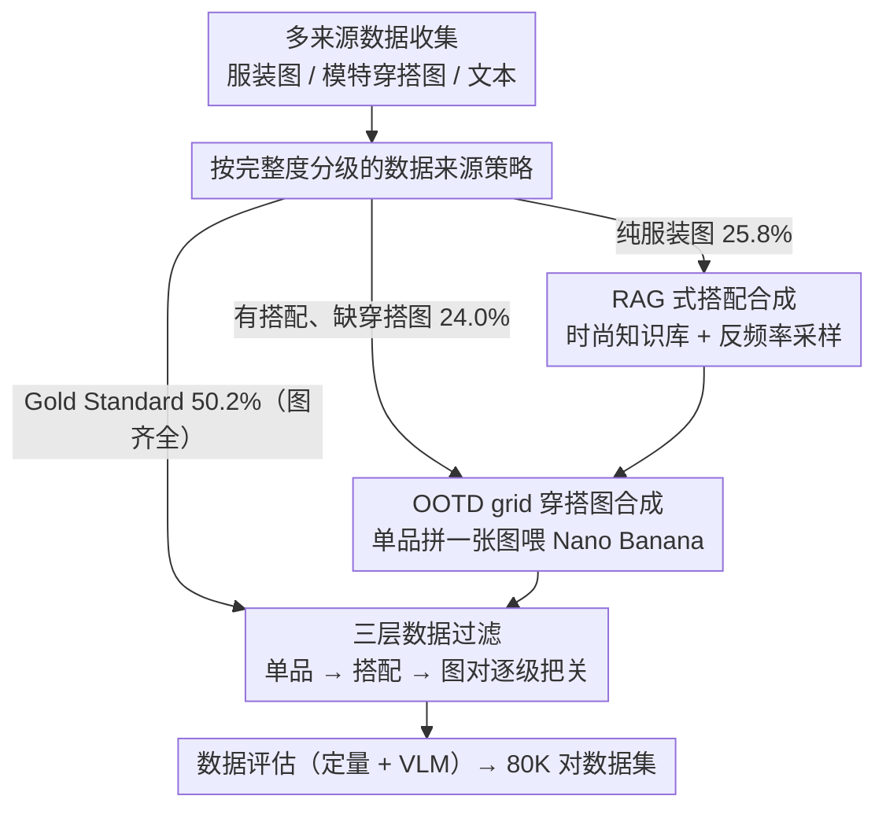

# Garments2Look: A Multi-Reference Dataset for High-Fidelity Outfit-Level Virtual Try-On with Clothing and Accessories

**会议**: CVPR 2026  
**arXiv**: [2603.14153](https://arxiv.org/abs/2603.14153)  
**代码**: [GitHub](https://github.com/ArtmeScienceLab/Garments2Look)  
**领域**: 虚拟试穿 / 数据集  
**关键词**: 虚拟试穿, 多参考图像, 整套搭配, 数据集构建, 图像生成

## 一句话总结

提出 Garments2Look，首个大规模多模态整套搭配级虚拟试穿数据集（80K 对，40 类，300+ 子类），每组包含 3-12 件参考服饰图、模特穿搭图和详细文本标注，揭示现有方法在多层搭配和配饰一致性上的重大不足。

## 研究背景与动机

虚拟试穿（VTON）已在单件服装可视化上取得显著进展，但真实时尚场景远不止于此——用户需要**整套搭配（outfit）**的预览，涉及多件服装、配饰、细粒度类别、层叠穿法和多样化造型。

**现有数据集的结构性缺陷**：
- VITON-HD、DressCode 仅支持单件试穿，类别有限（1-3 类）
- M&M VTO、BootComp 支持多参考输入但类别多样性不足
- 无数据集同时提供层叠顺序、穿搭技巧和多件配饰的标注

**outfit 级 VTON 的新挑战**：
- 服装间存在复杂的层叠遮挡关系（如针织开衫既可做外搭也可内穿）
- 穿搭技巧多样（正常穿、披肩、腰间系、卷袖等）
- 参考件数从 3 到 12 不等，对模型的多参考一致性要求极高

## 方法详解

### 整体框架

这篇论文要解决的是「整套搭配级」虚拟试穿没有训练数据的问题——既有数据集只覆盖单件服装，没人提供层叠顺序、穿搭技巧和多件配饰的标注。作者用一条四阶段管线造数据：先从多来源收集服装图与模特穿搭图（Data Collection），对缺穿搭图的样本用搭配合成 + 穿搭图合成补全（Data Synthesis），再经三层规则与人工过滤（Data Filtering），最后做定量与 VLM 评估（Data Evaluation）。核心是把真实配对数据（Gold Standard）与合成数据结合，用严格过滤和人工审核兜住质量。

### 关键设计

**1. 按完整度分级的数据来源策略：让真实配对与合成数据各司其职**

收集来的数据完整度参差不齐——全部重新合成会丢掉真实配对的高保真信息，全靠真实数据又凑不够规模。作者按完整度把数据分成三档分别处理：Gold Standard（50.2%）有完整的「服装图 + 模特穿搭图」配对，直接可用；有搭配方案但无穿搭图的（24.0%）只需合成 look image；纯服装图无搭配的（25.8%）则要先合成搭配方案、再合成 look image。来源覆盖搭配兼容性数据集（PolyVore）、开源时尚数据集、严格合规的公开网络图片与合成数据，从而在保住真实样本占比的同时把规模撑到 80K 对。

**2. RAG 式搭配合成：用时尚知识库约束生成、反频率采样压住热门偏差**

纯靠 LLM 随机生成搭配清单容易不合常理，也会反复推荐爆款单品导致数据偏斜。搭配合成管线像一套启发式 RAG：先构建包含 65 种时尚风格的知识库（35 女 / 30 男），每种风格由 LLM 生成再经时尚专家审核；运行时随机选一种风格，让 LLM 生成用户画像与穿搭场景（含场合、色调、主题、类别），并在风格约束下产出 3–9 件搭配清单，按「从上到下、从内到外、从服装到配饰」排序；最后逐件检索 top-128 候选，并用反频率加权采样让冷门单品也有机会入选，避免热门单品反复出现。

**3. OOTD grid 穿搭图合成：把分散单品拼成一张图喂给生成模型**

如果把搭配里的每件单品当作多张分散输入丢给生成模型，单品之间的搭配关系会丢失、相互一致性变差。作者把搭配清单的所有单品排成一张 OOTD grid image，作为 Nano Banana（Gemini-2.5-Flash-Image）的统一输入，让整张参考图隐式携带单品间的搭配上下文。同时通过 prompt engineering 注入层叠顺序与穿搭技巧（如「把上衣扎进裤子」「卷起袖子」等 5 类），让合成的 look image 不只是简单叠穿。

**4. 三层数据过滤：从单品、搭配到图对逐级把关**

合成数据良莠不齐，单层校验难以同时覆盖类别正确性、搭配合理性与图像质量。过滤因此分三层：单品层用 40 大类 + 300 细分子类的标准分类体系归类；搭配层用时尚专业知识做规则化合理性验证（如不会同时穿两条连衣裙）；图对层先由 Gemini-2.5-Flash 自动筛选、DWPose 做姿态分类，再交 10 名时尚学生 + 3 名专家人工审核。把关之严格体现在：合成 look image 最终只有约 40% 通过审核。

### 损失函数 / 训练策略

本文是数据集贡献，不涉及模型训练。评估协议包含两类指标：经典 VTON 指标（FID、KID、SSIM、LPIPS），以及 VLM 评审指标（Gemini-3-Flash，评估服装一致性、层叠准确性、穿搭技巧准确性）。

## 实验关键数据

### 主实验

**Garments2Look 测试集上的方法对比**：

| 方法类型 | 模型 | FID↓ | SSIM↑ | Garment↑ | Layering↑ | Styling↑ |
|---------|------|------|-------|----------|-----------|----------|
| VTON | FastFit | 3.59 | 0.855 | 0.624 | 0.131 | 0.340 |
| VTON | OmniTry | 6.56 | 0.724 | 0.461 | 0.167 | 0.261 |
| Editing | GPT-4o (2 Ref) | 2.15 | 0.758 | 0.892 | 0.849 | 0.694 |
| Editing | NB (2 Ref) | **1.04** | **0.858** | 0.925 | 0.885 | 0.739 |
| Editing | NBP (N Ref) | 1.32 | 0.817 | **0.984** | **0.936** | **0.736** |

### 消融实验

| 配置 | 关键指标 | 说明 |
|------|---------|------|
| N Ref (多张单品) vs 2 Ref (OOTD grid) | 2 Ref 通常更优 | Grid 图保持更好的搭配上下文 |
| 参考件数 ≤4 vs >4 | >4 时所有方法一致性下降 | VTON 模型尤其严重 |
| VTON 模型 vs 通用编辑模型 | 编辑模型全面优于 VTON | VTON 缺乏灵活的多件处理能力 |
| 合成 vs 真实数据质量 | 专家评分 4.35-4.74/5 | 合成数据经严格过滤后质量可控 |

### 关键发现

- **VTON 模型在 outfit 级任务上全面失败**：层叠准确率仅 13-17%，穿搭技巧准确率 26-34%
- 通用编辑模型（GPT-4o、Nano Banana）在 outfit 级 VTON 上远超专用 VTON 模型
- 参考件数增加时，所有方法的一致性均显著下降——形状失真、纹理改变、颜色偏差、单品融合是主要失败模式
- OOTD grid 输入（2 Ref 策略）通常优于多张分散输入（N Ref），因为整体参考携带了隐式的搭配关系
- 即使最先进的编辑模型，也无法精确控制非标准穿搭技巧（如半扣外套、不塞的中层）

## 亮点与洞察

- **首个真正的 outfit 级 VTON 数据集**：40 大类、300+ 子类、层叠+穿搭技巧标注，填补了关键空白
- 数据合成管线的**时尚知识库 + RAG 式检索 + 反频率采样**设计精巧，既保证多样性又避免热门偏差
- 实验深入且有针对性：四个递进问题（件数极限、一致性、整体效果、结构化标注价值）系统性地揭示瓶颈
- 对商业编辑模型的深入分析（Nano Banana vs GPT-4o vs Seedream）提供了宝贵的工业视角

## 局限与展望

- 合成 look image 依赖 Nano Banana，其姿态控制和 inpainting 能力有限，导致不可避免的合成偏差
- 仅约 40% 的合成图通过审核，数据构建效率较低
- 层叠穿搭的标注依赖 VLM 自动生成，精度受限
- 缺少视频试穿维度（动态穿搭效果更符合实际需求）
- 评价指标仍依赖 VLM 评审，尚无 outfit 级专用的自动化指标

## 相关工作与启发

- **VITON-HD/DressCode** 奠定了高分辨率 VTON 数据集基础，但局限于单件
- **BootComp** 首次提出 try-off 合成管线和数据过滤策略，本文在此基础上大幅扩展
- 反频率采样机制可推广到其他需要防止数据偏差的检索增强生成场景
- 商业编辑模型优于专用 VTON 模型的发现，暗示 VTON 领域可能需要从"专用管线"转向"通用编辑+领域约束"的新范式

## 评分

- **新颖性**: ⭐⭐⭐⭐ 首个大规模 outfit 级 VTON 数据集，任务定义和标注体系都是新的
- **实验充分度**: ⭐⭐⭐⭐ 7 个模型基线（VTON + 通用编辑）、4 个递进分析问题、定量+定性+人工评估
- **写作质量**: ⭐⭐⭐⭐ 数据构建过程描述详尽，问题驱动的实验分析逻辑清晰
- **价值**: ⭐⭐⭐⭐⭐ 数据+代码开源，填补重要空白，对 VTON 方向有持续推动作用

<!-- RELATED:START -->

## 相关论文

- [\[CVPR 2026\] PROMO: Promptable Outfitting for Efficient High-Fidelity Virtual Try-On](promo_promptable_virtual_tryon_efficient.md)
- [\[CVPR 2026\] High-Fidelity Virtual Try-On beyond Paired Data Scarcity via Diffusion-based Cycle-Consistent Learning](high-fidelity_virtual_try-on_beyond_paired_data_scarcity_via_diffusion-based_cyc.md)
- [\[CVPR 2025\] Shining Yourself: High-Fidelity Ornaments Virtual Try-on with Diffusion Model](../../CVPR2025/image_generation/shining_yourself_high-fidelity_ornaments_virtual_try-on_with_diffusion_model.md)
- [\[CVPR 2026\] HiFi-Inpaint: Towards High-Fidelity Reference-Based Inpainting for Generating Detail-Preserving Human-Product Images](hifi-inpaint_towards_high-fidelity_reference-based_inpainting_for_generating_det.md)
- [\[CVPR 2026\] FEAT: Fashion Editing and Try-On from Any Design](feat_fashion_editing_and_try-on_from_any_design.md)

<!-- RELATED:END -->
