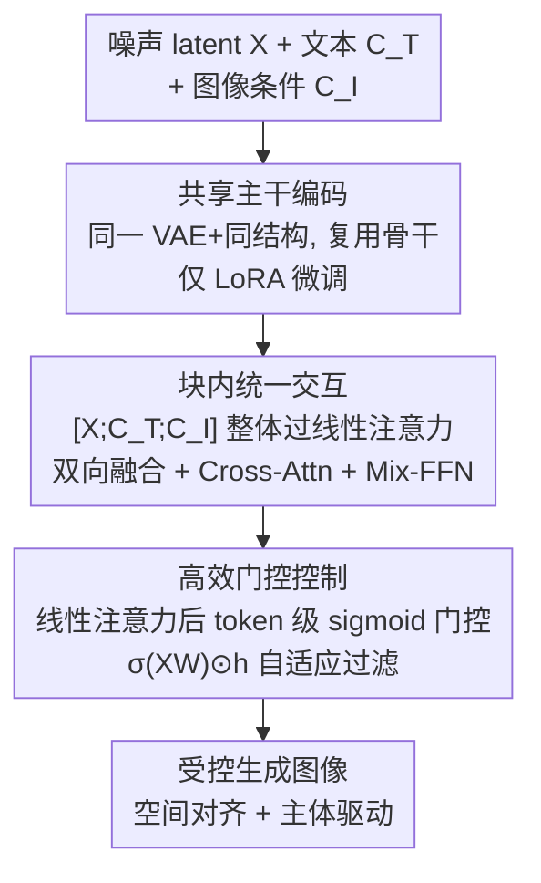

# Gated Condition Injection without Multimodal Attention: Towards Controllable Linear-Attention Transformers

**会议**: CVPR 2026  
**论文**: [CVF Open Access](https://openaccess.thecvf.com/content/CVPR2026/html/Liu_Gated_Condition_Injection_without_Multimodal_Attention_Towards_Controllable_Linear-Attention_Transformers_CVPR_2026_paper.html)  
**代码**: 无  
**领域**: 扩散模型 / 可控图像生成  
**关键词**: 可控生成, 线性注意力, 门控机制, 端侧部署, SANA  

## 一句话总结
针对线性注意力扩散模型（如 SANA）上做可控生成时 ControlNet 不适配非对齐条件、OminiControl 在空间对齐任务收敛极慢的问题，本文提出 GateControl——用「共享主干 + 块内统一交互 + 一个 0.09M 参数的 token 级门控」三件套，在仅增加约 1.18% 可训练参数的前提下，把空间任务的收敛提速 10× 以上，同时统一支持空间对齐（Canny/深度/上色）与非对齐（主体驱动）两类条件。

## 研究背景与动机

**领域现状**：可控扩散生成（给生成过程注入边缘、深度、姿态、主体等先验）在 UNet 时代由 ControlNet 用「可训练副本 + 特征相加」奠定范式；进入 DiT 时代，OminiControl 这类方法把条件编码成 token 序列、和噪声 latent 拼接后用 Multimodal Attention（MM-Attn）做全注意力交互，灵活性和细粒度控制都更强。

**现有痛点**：但这些强模型都因算力大而部署在云端，用户必须上传草图/照片等隐私数据。要做端侧（on-device）私密生成，自然想换成线性注意力骨干（SANA），它把 softmax 的二次复杂度降成线性、显存和算力都友好。然而作者把 ControlNet 和 OminiControl 直接搬到线性注意力上，两条路都失败了：ControlNet 的特征相加 $h_x \leftarrow h_x + h_c$ 隐含假设条件和 latent 空间对齐，对深度/边缘还行，但主体驱动这种几何会大幅变形的任务直接崩；OminiControl 虽灵活，但在线性注意力下效果不佳，且**空间对齐任务收敛极慢**（原文报告空间任务要 50k 步、主体驱动只要 15k 步）。

**核心矛盾**：线性注意力用核分解 $\phi(Q)(\phi(K)^T V)$ 压缩了 token 间交互信息，这种压缩恰好把「精确空间对应」所需的信号也压没了——所以纯靠注意力交互注入条件，在线性骨干上既不够灵活（ControlNet）又收敛太慢（OminiControl），二者不可兼得。

**切入角度 / 核心 idea**：作者借鉴 attention sink 与门控的思想，认为被线性注意力「抑制」掉的条件 token 信息可以用一个轻量门控显式补回来。核心一句话：**在线性注意力层后加一个 token 级可学习门控**，让每个 token 自己决定保留/抑制多少条件信息，从而在不依赖全注意力的前提下补偿线性注意力的信息压缩，既加速训练又提升可控性。

## 方法详解

### 整体框架
GateControl 的目标是设计一个**通用、极简、高效**的可控生成框架：输入是噪声 latent $X$、文本条件 $C_T$、图像条件 $C_I$（边缘/深度/上色/主体图等），输出是受控生成图像。整套方法不引入额外的可训练模型副本，而是沿三步走：先用**共享主干**把图像条件和噪声 latent 编进同一参数空间；再让每个 block 把 $[X; C_T; C_I]$ 当作整体做**块内统一交互**；最后在线性注意力层后插入**高效门控控制**，把被压缩的条件信息按 token 重要性自适应融合回来。三步对应论文 Figure 3 里从 (b) Shared-module → (c) Interaction → (d) Efficient gated control 的演进。

### 关键设计

**1. 共享主干编码：用同一套 VAE 和模型结构吃掉条件，省掉 ControlNet 的可训练副本**

ControlNet 用一份可训练的模型副本处理条件、再相加注入，参数爆炸（SANA 上要 590M 额外参数），而且面对非空间对齐输入适配差。本文改用**共享模块**策略（借鉴 OminiControl）：图像条件 $C_I$ 和噪声 latent $X$ 经过**同一个 VAE 编码器**进入共享参数空间，再走**完全相同的模型结构**处理；不像 IP-Adapter 那样另起一个 CLIP 编码器、还得做额外对齐。在此基础上只用 **LoRA 微调**（默认 rank=16）来适配新条件，避免全量微调的开销。效果是可训练参数降到 18.9M（约 1.18%），相比 ControlNet 的 590M 是数量级的削减（见 Table 1）。这一步既复用了原模型的信息流，又把「加条件」的代价压到几乎可忽略。

**2. 块内统一交互：把 latent / 文本 / 图像条件当作一个整体序列，让线性注意力自己做双向融合**

要在线性注意力里实现灵活通用的条件控制，作者不另设交互模块，而是把三类 token 拼成 $[X; C_T; C_I]$，让**每个 block 都把它们当作一个整体输入**一起处理。其中 $X$ 与 $C_I$ 在线性注意力模块内做**双向交互**完成信息融合，$X$ 和 $C_I$ 各自又通过 Cross-Attention 和文本 $C_T$ 交互、并在 Mix-FFN 里融合。这种设计最大程度保留了原模型的信息流，只做最小改动就能适应新条件，且实验证明这种双向线性注意力**已足够**支撑空间任务（深度、Canny、上色、去模糊）和非空间对齐任务（主体驱动）。但它有个明显短板：没有显式的空间信息注入/对齐，模型在空间对齐任务上学得、收敛得都很慢——这正是 OminiControl 也存在的问题，也是下一步门控要解决的。⚠️ 这一步等价于在 SANA 上复刻一个 OminiControl 风格的 baseline（对应 Figure 3(c) 的「w/o gate」），骨干、数据、训练计划与完整方法一致。

**3. 高效门控控制：在线性注意力后加 token 级 sigmoid 门控，把被压缩的条件信息按重要性补回来**

这是全文核心。线性注意力的核分解会压缩 token 交互，导致空间对应信号丢失、收敛慢。作者在线性注意力层**之后**插入一个数据相关的 token 强度过滤门控：对隐状态 $h_X$ 做逐 token 门控调制

$$h_X' = g(h_X, X, W_{g1}, \sigma) = \sigma(X W_{g1}) \odot h_X,$$

其中 $\sigma$ 是 sigmoid，把线性映射压到 $[0,1]$ 当作软过滤分数，$W_{g1}$ 是可学习门控参数；图像条件同理 $h_{C_I}' = \sigma(C_I W_{g2}) \odot h_{C_I}$。关键点是**门控分数对每个 token 独立计算**——每个 token 自己决定信息是保留还是被聚合，不依赖与其他 token 的交互。调制后两路相加融合：

$$h_X \leftarrow h_X' + h_{C_I}'.$$

作者系统消融了门控的四个维度——（1）用不用门控；（2）插入位置（自注意力后 / 交叉注意力后 / Mix-FFN 后）；（3）逐 token vs 逐元素 vs 直接相加；（4）取自注意力前还是后的特征算分数——最终结论是**「用自注意力前的特征算分数 + 逐 token 门控」最稳最好**。这一设计参数极省：只加 0.09M（占 SANA 原参数 0.006%），却让 Canny 等空间任务收敛提速 10× 以上（1k 步就超过 baseline 10k 步），同时对非对齐的主体驱动任务也保持稳定收敛。

### 损失函数 / 训练策略
基础模型 SANA 用 rectified flow，flow matching 目标为 $L_{FM} := \mathbb{E}_{t, p_t(x)}\big[\|v_t(x) - u_t(x)\|_2^2\big]$（$t \sim U[0,1]$）。训练对整模做 LoRA（默认 rank=16），用 Prodigy 优化器（开启 safeguard warmup 与 bias correction），weight decay=0.01，初始学习率 1。4×H200、单卡 batch 16。主体驱动在 Subject200K 的 1024² 子集训 20K 步；空间对齐任务在 Text-to-Image-2M 的 10K 图上微调 10K 步。

## 实验关键数据

### 主实验
五个空间对齐任务上与 baseline 的定量对比（节选，控制力：Canny 用 F1↑、其余用 MSE↓；质量用 FID↓/SSIM↑/MUSIQ↑；对齐用 CLIP-Image↑）：

| 任务 | 方法 | 基座 | 控制力(F1↑/MSE↓) | FID↓ | CLIP-Image↑ |
|------|------|------|------|------|------|
| Canny | OminiControl | SANA | 0.23 | 22.91 | 0.750 |
| Canny | **Ours** | SANA | **0.26** | **21.97** | **0.762** |
| Deblurring | OminiControl | SANA | 120 | 10.65 | 0.896 |
| Deblurring | **Ours** | SANA | **14** | **7.45** | **0.934** |
| Colorization | ControlNet | SANA | 171 | 24.95 | 0.842 |
| Colorization | **Ours** | SANA | **163** | **10.28** | **0.897** |
| HED | ControlNet | SANA | 2320 | 20.36 | 0.733 |
| HED | **Ours** | SANA | **1168** | **16.81** | **0.798** |

亮点：上色任务 FID 从 24.95→10.28，HED 任务 MSE 从 2320→1168（>50% 改善），在 FID / MUSIQ / CLIP-Image 上对 SANA 上的 ControlNet/OminiControl 形成压倒性优势。

参数开销对比（Table 1，节选）：

| 方法 | 基座 | 额外参数 | 占比 |
|------|------|------|------|
| ControlNet | SANA/1.6B | 590M | ~36.9% |
| IP-Adapter | SANA/1.6B | 33.7M | ~2.11% |
| LoRA interaction | SANA/1.6B | 18.9M | ~1.18% |
| **+ 门控(Ours)** | SANA/1.6B | **+0.09M** | **+0.006%** |

### 消融实验
门控机制各维度消融（Table 3，Canny-to-image）：

| 配置 | FID↓ | SSIM↑ | CLIP↑ | 说明 |
|------|------|------|------|------|
| Ours (token-wise, 前特征) | 19.0 | 0.42 | 0.77 | 默认配置 |
| w/o gating | 22.6 | 0.36 | 0.74 | 去门控，FID 显著恶化 |
| w/o interaction | 20.0 | 0.40 | 0.76 | 去注意力交互，掉点 |
| After-FFN | 18.2 | 0.41 | 0.77 | 门控放 Mix-FFN 后，仅小幅波动 |
| Elementwise | 18.8 | 0.42 | 0.77 | 性能相当但参数飙到 200M |
| Input features(自注意力后) | 20.3 | 0.39 | 0.76 | 用自注意力后特征算分数更差 |

### 关键发现
- **门控是收敛提速主因**：去掉门控后 FID/SSIM/CLIP 全面恶化，且训练 loss 下降明显更缓；图 2 显示加门控后 loss 下降更陡、CLIP-Image 从最早期就领先并全程保持。
- **逐 token 远胜逐元素**：逐元素门控性能相当却要 200M 参数，逐 token 仅 0.09M 就拿到同等效果；直接相加则 loss 不稳定，说明「动态选 token」是关键。
- **门控放交叉注意力后会让 loss 高度不稳定**，放自注意力后或 Mix-FFN 后才稳——作者推测交叉注意力对映射特征的稳定性要求更高。
- **算分数的特征要取自注意力之前**：这样每个 token 独立预测自己的分数，避免门控层梯度干扰正常注意力交互。

## 亮点与洞察
- **「门控补偿信息压缩」的视角很巧**：把线性注意力收敛慢这件事归因为「核分解压掉了 token 信息」，再用一个 sigmoid 软门把该留的 token 显式留住——只加 0.09M 参数就换来 10× 收敛提速，性价比极高，是可直接迁移到其他线性注意力骨干的 trick。
- **共享主干 + LoRA 的极简哲学**：不另起编码器、不复制骨干，把可控生成的成本压到 1.18% 参数，天然契合端侧/隐私部署诉求。
- **一套门控统一两类异质条件**：空间对齐（深度/边缘）和非对齐（主体驱动）通常要分别设计，本文用同一 token 级门控都 hold 住，且对原 OminiControl 的 softmax 注意力也能加速收敛（附录），说明门控思路有普适性。

## 局限与展望
- 实验全部围绕 SANA 一个线性注意力骨干，是否在其它线性/状态空间扩散骨干上同样有效未充分验证。⚠️ 端侧「私密部署」是动机卖点，但论文并未给端侧实机的延迟/显存实测，主要还是在 H200 上训练评测。
- 消融只在 Canny-to-image 单任务上报告 Table 3，门控位置/类型结论在其他空间任务上的稳健性缺正面数据支撑。
- 门控分数是纯逐 token 独立计算、不看 token 间关系，作者也承认去掉注意力交互会掉点——说明门控是「补偿」而非「替代」交互，二者耦合的最优配比还有探索空间。
- 作者自陈主体驱动 + 身份保持的能力很适合个性化角色创作与视频生成，留作未来工作。

## 相关工作与启发
- **vs ControlNet**：ControlNet 用可训练副本 + 特征相加，隐含空间对齐假设，主体驱动崩、参数 590M；本文共享主干 + 门控，既支持非空间语义又把参数压到 18.9M，对齐任务质量还更高。
- **vs OminiControl（MM-Attn）**：OminiControl 把条件做成 token 拼接、靠全注意力交互，灵活但在线性注意力下收敛极慢（空间任务 50k 步）；本文保留其「统一序列交互」骨架，但用 token 级门控替代「纯靠注意力」，在空间任务上取得相当或更优可控性且收敛快 10×。
- **vs IP-Adapter**：IP-Adapter 需独立 CLIP 编码器 + 交叉注意力适配；本文用共享 VAE 与同结构，省掉额外编码器和对齐开销。
- **启发**：门控（LSTM/GRU/GLU/MoE 路由的老思想）在「补偿高效注意力的信息损失」这一新场景下被重新激活——凡是用了线性/稀疏注意力换效率、却牺牲了某类信号的模型，都值得试试加一个轻量 token 级门控把该信号显式找回来。

## 评分
- 新颖性: ⭐⭐⭐⭐ 首个面向线性注意力骨干的可控生成框架，门控补偿信息压缩的视角扎实，但门控本身是成熟思想的迁移。
- 实验充分度: ⭐⭐⭐⭐ 五个空间任务 + 主体驱动 + 完整门控四维消融，但端侧实机指标与跨骨干验证缺位。
- 写作质量: ⭐⭐⭐⭐ 从 ControlNet/OminiControl 失败出发逐步推导，Figure 3 的 (a)→(d) 演进清晰；个别消融只在单任务报告。
- 价值: ⭐⭐⭐⭐ 0.09M 参数换 10× 收敛提速 + 端侧可控生成，实用性强，trick 可迁移。

<!-- RELATED:START -->

## 相关论文

- [\[ICCV 2025\] EDiT: Efficient Diffusion Transformers with Linear Compressed Attention](../../ICCV2025/image_generation/edit_efficient_diffusion_transformers_with_linear_compressed_attention.md)
- [\[CVPR 2025\] DiG: Scalable and Efficient Diffusion Models with Gated Linear Attention](../../CVPR2025/image_generation/dig_scalable_and_efficient_diffusion_models_with_gated_linear_attention.md)
- [\[CVPR 2026\] The Devil is in Attention Sharing: Improving Complex Non-rigid Image Editing Faithfulness via Attention Synergy](the_devil_is_in_attention_sharing_improving_complex_non-rigid_image_editing_fait.md)
- [\[CVPR 2026\] Anchoring and Rescaling Attention for Semantically Coherent Inbetweening](anchoring_and_rescaling_attention_for_semantically_coherent_inbetweening.md)
- [\[CVPR 2026\] Correspondence-Attention Alignment for Multi-View Diffusion Models](correspondence-attention_alignment_for_multi-view_diffusion_models.md)

<!-- RELATED:END -->
