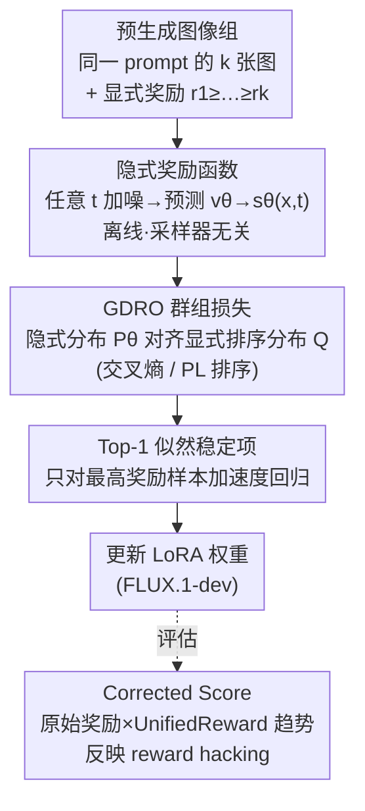

# GDRO: Group-level Reward Post-training Suitable for Diffusion Models

**会议**: CVPR 2026  
**论文**: [CVF Open Access](https://openaccess.thecvf.com/content/CVPR2026/html/Wang_GDRO_Group-level_Reward_Post-training_Suitable_for_Diffusion_Models_CVPR_2026_paper.html)  
**代码**: 待确认  
**领域**: 扩散模型 / 对齐RLHF  
**关键词**: 扩散模型后训练, 群组奖励, 离线对齐, reward hacking, rectified flow  

## 一句话总结
GDRO 把 LLM 里的群组奖励（GRPO）对齐思路搬到 rectified flow 扩散模型上，但用 DPO 式的"隐式奖励函数"在任意噪声时间步直接计算奖励，从而做到**完全离线训练**（不用反复在线采样）和**采样器无关**（不用把 ODE 近似成 SDE），在 OCR / GenEval 文生图任务上以 2–3.7× 的效率逼近甚至超过 Flow-GRPO，同时显著缓解 reward hacking。

## 研究背景与动机
**领域现状**：用强化学习给文生图扩散模型做奖励对齐最近很火。主流做法是把 LLM 里的群组奖励（GRPO）搬过来——模型对同一个 prompt 在线生成一组图（rollout），用奖励模型（如 OCR 文字准确率、GenEval 属性正确率）打分，再用 PPO/GRPO 式的策略梯度更新。

**现有痛点**：这套在线 RL 框架放到 rectified flow 扩散模型（如 FLUX.1）上有三个硬伤。其一，**效率极低**：扩散模型要跑完整条去噪链才能采样出一张图，而在线 RL 每一步优化都要重新在线采样，rollout 采样直接主导了整个训练时间。其二，**依赖随机采样器**：策略梯度需要每步的随机性，但 rectified flow 一旦初始噪声固定就是确定性的 ODE；Flow-GRPO/DanceGRPO 只能把 ODE 强行近似成 SDE 来制造随机性，这种近似会带来 out-of-domain 和画质退化。其三，**reward hacking**：模型确实把奖励刷高了，但画质、细节、图文一致性严重崩坏——比如为了让 OCR 模型认得，把文字放得巨大、占满画面，其余细节全丢。

**核心矛盾**：rectified flow 扩散模型和 LLM 在本质上不同（确定性采样、采样代价高），照搬 LLM 的在线 RL 范式天然水土不服；而单纯的 Diffusion-DPO 又只能做成对（pairwise）偏好，用不上显式奖励的群组信息。

**核心 idea**：既然 DPO 证明了奖励可以被重参数化成一个"隐式奖励函数"，而这个函数在扩散语境下只依赖加噪图像和模型预测的速度（不需要在线采样、不需要随机性），那就**绕开在线 rollout，直接在任意时间步上用隐式奖励，把 LLM 的群组排序目标（Plackett-Luce / 交叉熵）整体离线化**——这就是 GDRO。

## 方法详解

### 整体框架
GDRO 的输入是：对每个 prompt **预先离线生成**好的一组图像 $(x_1,\dots,x_k)$ 及其显式奖励 $(r_1,\dots,r_k)$（满足 $r_1\ge\dots\ge r_k$）。训练时不再在线采样：对组内每张图在随机时间步 $t$ 加噪得到 $x_t$，喂给扩散模型预测速度 $v_\theta$，据此算出每张图的**隐式奖励** $s_\theta(x_i,t)$；再让这组隐式奖励的分布去对齐由显式奖励算出的目标排序分布，得到群组级损失；最后加一个 top-1 似然稳定项防止画质塌掉。整条链路里没有一次完整去噪采样、没有任何 SDE 近似，因此既离线又采样器无关。

### 关键设计

**1. 隐式奖励函数：把"奖励"挪到任意噪声时间步上算，从根上去掉在线采样与随机性**

三大痛点（低效、依赖随机采样器）的根源都在于"必须跑完整条扩散链才能拿到样本与对数概率"。GDRO 借 DPO 的重参数化绕过它：RL 微调最优策略满足 $\pi^*_\theta(x_0|c)=\pi_{\text{ref}}(x_0|c)e^{r(x_0,c)/\beta_{\text{KL}}}/Z(c)$，反解得奖励可写成 $s_\theta(x)=\beta_{\text{KL}}\log\frac{\pi^*_\theta(x_0|c)}{\pi_{\text{ref}}(x_0|c)}+\beta_{\text{KL}}\log Z(c)$，其中配分函数那一项在后续做差时会被消掉。Diffusion-DPO 进一步证明在扩散语境下这个隐式奖励可在**给定时间步 $t$** 用速度残差近似：

$$s_\theta(x,t)=-\beta\,\mathbb{E}_{t,v}\big[\|v-v_\theta(C)\|_2^2-\|v-v_{\text{ref}}(C)\|_2^2\big],\quad C=(x_t(c),t,c),\ \beta=T\beta_{\text{KL}}$$

这里 $v$ 是注入的扰动噪声，$x_t(c)$ 是 rectified flow 在 $t$ 步的加噪图。关键在于：算 $s_\theta$ 只需要加噪图像 + 模型预测的速度，**既不用从高斯噪声出发跑完整采样链（所以能完全离线、省下主导训练时间的 rollout）**，也不用对数概率（所以不需要随机采样器、不用 ODE→SDE 近似）。这一步是 GDRO 能成立的地基。

**2. GDRO 群组损失：用 Plackett-Luce 排序把组内 k 张图的显式奖励对齐到隐式奖励分布**

只有隐式奖励还不够——要用上 LLM 群组奖励的精髓，得让模型按"整组排序"而非孤立的成对胜负来学。GDRO 从两个等价视角导出同一损失。**交叉熵视角**：把显式奖励经温度 softmax 转成目标分布 $q(i,\tau)=\text{softmax}(r_i/\tau)$，把隐式奖励同样 softmax 成 $p_\theta(i)=\text{softmax}(s_\theta(x_i,t))$，先对 top-1 做交叉熵；再把排序看成"在剩余集合上逐位选择"，对每一位 $i$ 在剩余项上归一化，累加得到完整损失：

$$L_{\text{GDRO}}(\theta)=\sum_{i=1}^{k-1}\Big(\log\sum_{m=i}^{k}e^{s_\theta(x_m,t)}-\sum_{j=i}^{k}q_i(j,\tau)\,s_\theta(x_j,t)\Big)$$

求和到 $k-1$ 是因为最后一名在前 $k-1$ 名定了之后自动确定。**排序视角**：直接套 Plackett-Luce 模型，最大化排序 $x_1\succ\dots\succ x_k$ 的似然，把隐式得分 $s_\theta$ 当作打分函数，得到只用排序、不用显式奖励数值的 $L_{\text{rank}}$；再把其中的硬目标 $s_\theta(x_i,t)$ 换成按显式奖励加权的软目标 $\sum_j q_i(j,\tau)s_\theta(x_j,t)$，就回到 $L_{\text{GDRO}}$。温度 $\tau$ 控制目标分布锐度：$\tau$ 越小越突出最高奖励样本。两个优雅的退化关系：$\tau\to0$ 时 GDRO 退化为纯排序 $L_{\text{rank}}$；$k=2,\tau\to0$ 时退化为 DPO——也就是说 DPO 是 GDRO 的一个特例。排序视角相比成对胜负的好处是"拉大第一名与所有剩余样本的似然间隔"，而不只是局部成对赢，因此训练更稳。

**3. Top-1 似然稳定项：补住排序目标不保证 top-1 似然上升的漏洞，护住画质**

作者实验发现一个反直觉现象：评估分上去了、最差样本似然如期下降，但**最高奖励样本的 top-1 似然也在掉**（只是慢一点），而 top-1 似然下降会直接拖垮画质。PL 视角解释了原因：排序目标只负责拉大不同名次间的似然间隔，并不保证 top-1 样本的绝对似然增大。于是加一个只作用在最高奖励样本上的速度回归正则：

$$L_{\text{reg}}(\theta)=M\circ\|v-v_\theta(x_t(c),t,c)\|_2^2,\qquad L_{\text{final}}=L_{\text{GDRO}}+\gamma L_{\text{reg}}$$

其中 $M$ 是只有 top-1 样本位置为 1 的 one-hot mask，$\gamma$ 是正则强度。这一项把"最好的那张图"往参考分布上拽，避免群组损失为了拉开间隔把所有似然一起压低导致的细节崩坏。

**4. Corrected Score：把 reward hacking 趋势量化进评估指标，戳穿"高分≠高质量"**

作者实证发现：高评估奖励并不代表更好——Flow-GRPO 刷到 0.95 OCR 时画质崩坏，但奖励模型照样给高分。要客观评估就得把 hacking 趋势算进来。他们用 UnifiedReward 打 alignment / coherence / style 三项分（1–5），观察到这些分与 reward hacking 程度**负相关**，可作为 hacking 趋势的代理。据此提出校正分：OCR 任务取三项均值 $\hat u$，$r_{\text{corrected}}=r(\hat u-3)+0.2$（$\hat u$ 多落在 3–4 之间，$+0.2$ 仅为画曲线方便）；hacking 发生时 $\hat u$ 下降，校正分随之被压低。GenEval 任务只平均 coherence 与 style，因为它的 prompt 只描述物体属性、不含细节描述，alignment 分反而与 hacking 正相关（⚠️ 公式细节以原文为准）。这个指标让"刷分但崩画质"的方法在曲线上原形毕露。

### 损失函数 / 训练策略
最终目标 $L_{\text{final}}=L_{\text{GDRO}}+\gamma L_{\text{reg}}$。底座 FLUX.1-dev，用 LoRA（rank 32）+ EMA 训练，EMA 衰减 $\eta(i)=\min(0.001i,0.5)$，等效 batch size $bs=512/k$。每个 prompt 离线预生成 16 张图并打分供后续训练。OCR 用 $\tau=0.05,\gamma=0.5,\beta=12,k=6$；GenEval 用 $\tau=0.05,\gamma=1.0,\beta=6,k=6$。8×A100、512×512 分辨率。

## 实验关键数据

### 主实验
在 OCR 与 GenEval 两个文生图任务上对比 Flow-GRPO / DanceGRPO / DPO，关注评估奖励、校正分和 GPU 小时（效率）：

| 方法 | OCR / 校正分 | GenEval / 校正分 | GPU 小时 | 备注 |
|------|------|------|------|------|
| FLUX.1（基线） | 0.5843 / 0.4486 | 0.6178 / 0.4646 | — | 未对齐 |
| Flow-GRPO | 0.8714 / 0.5482 | 0.8520 / 0.4757 | 59.7 / 250.3 | 在线 RL |
| Flow-GRPO（刷高） | 0.9540 / 0.4810 | 0.8934 / 0.4642 | 149.1 / 340.0 | 校正分反而掉 |
| DanceGRPO | 0.8719 / 0.5406 | 0.8549 / 0.4831 | 74.7 / 294.5 | Flow-GRPO 的慢版 |
| DPO（接近崩溃） | 0.8158 / 0.5341 | 0.6488 / 0.4162 | collapse | 易崩 |
| **GDRO（本文）** | **0.8721 / 0.5701** | **0.8517 / 0.5148** | **29.6 / 68.4** | 校正分最高 |

要点：在评估奖励打平 Flow-GRPO 的前提下，GDRO 的**校正分全场最高**，且效率 OCR 约 2×、GenEval 约 3.7×（GPU 小时从 250 降到 68）。Flow-GRPO 继续刷高原始奖励时校正分反而下滑，说明它在 reward hacking。

### 人类评测与质量分（佐证 reward hacking）

| 方法 | 文字准确率胜 ↑ | 图文一致胜 ↑ | 画质胜 ↑ |
|------|------|------|------|
| FLUX.1 基线 | 1.90% | 26.67% | 33.10% |
| GDRO (0.87) | 5.48% | **33.10%** | **33.81%** |
| Flow-GRPO (0.87) | 3.81% | 16.90% | 17.86% |
| Flow-GRPO (0.95) | 6.19% | 9.52% | 8.09% |

人类在"文字准确率"上多投平局（三种方法实际文字准确率几乎一样，尽管 OCR 分差很多），但在一致性和画质上 GDRO 与基线几乎打平、显著碾压 Flow-GRPO——直接证明 Flow-GRPO 已被 hacking 拖累。

### 消融实验
| 配置 | 关键现象 | 说明 |
|------|---------|------|
| group size $k=2$ | 不稳、崩溃 | 等价 DPO，缺群组稳定性 |
| $k=4/6/8$ | 平稳上升，$k=6$ 最优 | $k>2$ 即获得足够稳定性 |
| OCR $\beta=6$ | 奖励快升但校正分骤降 | 约束太松→崩溃/hacking |
| OCR $\beta=12$ | 原始分+校正分都更稳更高 | 紧约束更好 |
| GenEval $\beta=6$ | 优于 $\beta=12$，不崩 | 与 OCR 相反 |
| GenEval $\beta=4$ | 崩溃 | 太松又不行 |

### 关键发现
- **群组规模是稳定性的关键**：$k=2$（即 DPO 式成对）会像 DPO 一样不稳、塌陷；只要 $k>2$ 就获得足够稳定，$k=6$ 综合最优，再大无明显收益。
- **$\beta$（KL 约束强度）需按任务调**，且方向相反：OCR 偏好更紧的 $\beta=12$，GenEval 偏好更松的 $\beta=6$。作者解释为 GenEval 需要更大的布局/分布漂移（改属性、数量、位置乃至物体类型），比"纠正文字"需要的图像改动大得多，故需更松约束。
- **校正分揭示"高奖励的陷阱"**：Flow-GRPO 原始奖励单调上升，但校正分在约 100 GPU 小时后开始下降；DPO 的 GenEval 原始分一路涨而校正分一路跌（图像在塌陷）。GDRO 自己也承认无法完全杜绝 hacking，但鲁棒性明显最强。

## 亮点与洞察
- **把在线 RL 问题转成离线监督问题**：核心洞见是"隐式奖励可在任意时间步算、只依赖加噪图与预测速度"，于是 rollout 采样、SDE 近似、对数概率统统不需要了——这是效率 2–3.7× 的来源，也是把 GRPO 思想干净移植到扩散模型的关键。
- **DPO 是 GDRO 的特例**：$k=2,\tau\to0$ 退化为 DPO，$\tau\to0$ 退化为纯 PL 排序——一个统一框架把成对偏好、纯排序、带显式奖励的群组对齐串了起来，理论上很完整。
- **发现并修补 top-1 似然下滑**：排序目标只保证拉大名次间隔、不保证 top-1 似然上升，作者实测到这一隐患并用 one-hot 速度回归补住，是很实在的工程洞察。
- **Corrected Score 这一招可迁移**：当奖励模型本身可被 hack 时，引入一个与 hacking 负相关的第三方质量模型来校正评估，是任何 RLHF 场景都能借鉴的"防刷分"思路。

## 局限与展望
- 作者承认 GDRO 目前是**纯离线**方法，缺乏在线探索，对那些需要主动试探才能发现高奖励的任务可能受限。
- 校正分依赖 UnifiedReward 反映 hacking 趋势，**只能反映趋势、无法精确刻画 hacking 程度**；作者把"更准更可解释的 hacking 度量"留作未来工作。
- 自己的观察：预生成图像组是固定的，离线数据一旦生成就无法随策略更新而刷新，可能存在分布漂移问题（训练后期模型已偏离生成这批图的分布）；且 $\beta$ 需按任务反向调参，缺乏自适应方案，迁移到新任务有调参成本。⚠️ 这是阅读推断，非原文明述。

## 相关工作与启发
- **vs Flow-GRPO / DanceGRPO**：它们用在线 RL + ODE→SDE 近似来获得随机性、靠 rollout 算策略梯度；GDRO 用隐式奖励完全离线、采样器无关。结果是 GDRO 效率高 2–3.7×，且校正分更高、reward hacking 更轻。
- **vs Diffusion-DPO**：Diffusion-DPO 把 DPO 搬到扩散，但只支持成对（pairwise）偏好、用不上显式奖励数值；GDRO 支持群组级、用 PL 排序把显式奖励整组用起来，且 DPO 正是其 $k=2,\tau\to0$ 的特例。
- **vs DDPO / DPOK**：它们把扩散过程当 MDP 做在线 RL，但只适用于带随机采样器的 DDPM 类模型，不支持 rectified flow；GDRO 专为 rectified flow 的确定性特性设计。
- **vs AlignProp / DiffDoctor**：它们直接对可微奖励反传优化，要求奖励函数可微；GDRO 对不可微奖励（如 OCR 准确率）同样适用。

## 评分
- 新颖性: ⭐⭐⭐⭐⭐ 把群组奖励对齐从在线 RL 整体改写成隐式奖励 + PL 排序的离线范式，理论自洽且统一了 DPO/排序/群组三种目标。
- 实验充分度: ⭐⭐⭐⭐ 覆盖 OCR/GenEval 两任务、四种对比方法、人类评测 + UnifiedReward + 校正分多角度，群组规模与 $\beta$ 消融到位；但任务种类偏少、缺真实用户大规模偏好评测。
- 写作质量: ⭐⭐⭐⭐ 动机—痛点—推导链条清晰，两个等价视角导出同一损失讲得很漂亮；公式略密、部分校正分细节需查附录。
- 价值: ⭐⭐⭐⭐⭐ 离线 + 采样器无关 + 2–3.7× 提速直击扩散 RLHF 的算力痛点，Corrected Score 对"防刷分评估"也有普适借鉴意义。

<!-- RELATED:START -->

## 相关论文

- [\[CVPR 2026\] HP-Edit: A Human-Preference Post-Training Framework for Image Editing](hp-edit_a_human-preference_post-training_framework_for_image_editing.md)
- [\[CVPR 2026\] LeapAlign: Post-Training Flow Matching Models at Any Generation Step by Building Two-Step Trajectories](leapalign_post_training_flow_matching_models_at_any_generation_step.md)
- [\[CVPR 2026\] Reward Sharpness-Aware Fine-Tuning for Diffusion Models](reward_sharpness-aware_fine-tuning_for_diffusion_models.md)
- [\[ICML 2026\] GUDA: Counterfactual Group-wise Training Data Attribution for Diffusion Models via Unlearning](../../ICML2026/image_generation/guda_counterfactual_group-wise_training_data_attribution_for_diffusion_models_vi.md)
- [\[ICCV 2025\] DMQ: Dissecting Outliers of Diffusion Models for Post-Training Quantization](../../ICCV2025/image_generation/dmq_dissecting_outliers_of_diffusion_models_for_post-training_quantization.md)

<!-- RELATED:END -->
