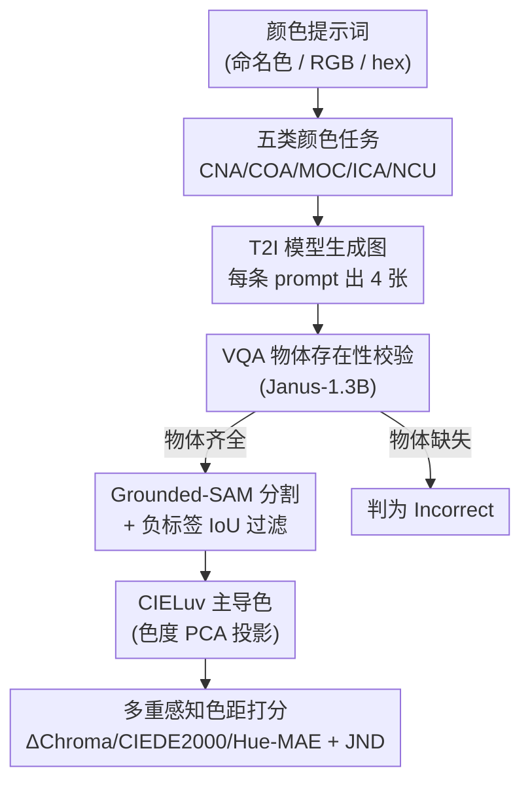

# GenColorBench: A Color Evaluation Benchmark for Text-to-Image Generation

**会议**: CVPR 2026  
**论文**: [CVF Open Access](https://openaccess.thecvf.com/content/CVPR2026/html/Butt_GenColorBench_A_Color_Evaluation_Benchmark_for_Text-to-Image_Generation_CVPR_2026_paper.html)  
**代码**: https://moatifbutt.github.io/gencolorbench/ (项目页)  
**领域**: 扩散模型 / 文本生成图像评测  
**关键词**: 颜色生成评测, T2I Benchmark, ISCC-NBS, 主导色, 色彩科学  

## 一句话总结
GenColorBench 是首个系统评测文生图（T2I）模型「颜色精确度」的基准，用 ISCC-NBS / CSS3-X11 色系和 RGB/hex 数值色构造了 4.4 万条提示词、5 类颜色任务，并用一条「不依赖 VLM、基于色彩科学主导色 + ΔE」的评测流水线，揭示出当前 SOTA 模型在精确控色上普遍很弱（多数任务 <50%）。

## 研究背景与动机
**领域现状**：Stable Diffusion、FLUX 等 T2I 模型已能从文字生成高质量图像，并被接入到设计、媒体生产流水线。专业工具（Photoshop、Blender）允许用 RGB、hex、命名色板精确指定上千种颜色，因此 T2I 模型理应达到同等的控色粒度。

**现有痛点**：现有评测基准（GenEval、T2I-CompBench、DPG-Bench、TIFA 等）关注的是组合推理、指令遵循、忠实度，**没有一个系统评估「按提示词精确生成指定颜色」的能力**。它们要么忽略颜色，要么只做粗粒度的「红/蓝/绿」类别判断，更**完全没有覆盖 RGB/hex 这类数值色**。

**核心矛盾**：现有颜色评测大多走 VQA 路线，让视觉语言模型（VLM）去判断「这个物体是不是粉色」。但作者通过一个 2464 张 Blender 合成图的诊断实验发现：VLM **缺乏像素级颜色 grounding**，开放式识别准确率极低（多数 <30%），在 MCQ/二分类里靠的是选项位置、确认偏置等语言学捷径而非真正的感知——连最强的 BLIP3o 在重排选项后准确率都明显下滑。也就是说，**评测工具本身不可靠，无法暴露模型真实的控色能力**。

**本文目标**：建一个 (i) 锚定标准色系、(ii) 覆盖命名色+数值色、(iii) 不依赖 VLM 打分 的颜色生成基准，并据此摸清现有模型「懂哪些颜色约定、在哪里翻车」。

**切入角度**：把评测从「语言判断」搬回「色彩科学」——直接对生成图做分割、抽像素、在感知均匀色空间里算颜色距离，再和标准色系的真值比对。

**核心 idea**：用「Grounded-SAM 抠物体 → CIELuv 主导色 → 多重感知色距 + JND 阈值」这条客观流水线替代 VQA，对 44K 提示词、5 类任务做大规模控色评测。

## 方法详解

### 整体框架
GenColorBench 由两部分组成：**(A) 数据集构造**——把 108 个物体 × 标准色系（ISCC-NBS 三级 + CSS3/X11 147 色 + RGB/hex 数值色）组合成 4.4 万条提示词，按难度归入 5 类颜色任务；**(B) 评测流水线**——对每张生成图先用 VQA 确认物体存在，再用 Grounded-SAM 分割出物体掩码、剔除负标签区域，提取像素算出「主导色」，最后和真值色在多重感知色距上比对、过 JND 阈值得二值分。输入是一条带颜色约束的提示词，输出是该模型在该任务/该色系下的通过率。

### 关键设计

**1. 锚定标准色系 + 数值色的颜色 taxonomy：让「颜色」可量化、可分级**

要客观评测控色，首先得有一套有真值、有难度梯度的颜色词表。作者拒绝自造类别，转而锚定两个标准色系：**ISCC-NBS**（源自感知均匀的 Munsell 系统，按 hue/value/chroma 三轴把连续色空间离散成三级命名——Level 1 共 13 个基础色名，Level 2 加 light/deep 等修饰扩到 29 个，Level 3 给出「light bluish green」这类细粒度色名）和 **CSS3/X11**（147 个 web 标准色，精确映射到 RGB/hex）。关键差异点在于它**额外纳入了 RGB 三元组与 hex 码这类数值色**——这是所有现有基准都缺失的维度，却恰恰是设计工作流里最常用的精确指定方式。这套 taxonomy 天然提供了「基础色 → 修饰色 → 细粒度色 / 命名色 → 数值色」的难度梯度，使后面「L1→L3 掉点」这类分析成为可能。

**2. 五类颜色任务 + 四难度模板：把「控色」拆成可诊断的能力维度**

单看「颜色对不对」无法定位模型到底差在哪，于是作者把控色拆成 5 个针对不同维度的任务：**CNA**（Color Name Accuracy，单物体按色名上色，如「a pink car」）、**COA**（Color-Object Association，颜色要落到指定物体、不能泄漏到背景，如「a green teapot in the plate」）、**MOC**（Multi-Object Color Composition，多物体各自正确上色）、**ICA**（Implicit Color Association，语义关联物体共享同一颜色，如「a cat in beige sitting next to a dog which has exact same color」）、**NCU**（Numerical Color Understanding，按 RGB/hex 生成，如「a couch in hex #F5F5DC」）。构造上先把 108 个物体（取自 COCO/ImageNet，分 7 个语义域）与色集配成合法 object-color 种子对，再用手工 + GPT-4o 模板按 4 个难度等级生成提示词（L1 单物体、L2 带场景上下文、L3 多物体多色、L4 语义复杂的隐含关联），最后做 human-in-the-loop 校验语法与歧义。最终分布约为：18K 命名色单物体 + 11.5K 数值色 + 8.7K 上下文关联 + 2.2K 多物体场景 + 4.5K 隐含关联 ≈ 44K+，并另切一个 <10K 的 Mini 子集供社区复现。

**3. 主导色提取：把多彩物体压成一个「人眼会认的」代表色**

一个物体因几何与光照会有一片色度分布（polychromatic），逐像素算色距会被高光/阴影误伤。作者借鉴视觉科学的 **dominant hue** 概念：先把掩码内像素转到感知较均匀的 CIELuv 空间 $(L^*_i,u^*_i,v^*_i)$，对色度分量 $(u^*,v^*)$ 做 PCA，取第一主成分 $v_1=(v_{1u},v_{1v})$ 作为「主导色调方向」（即色度分布的主要变化方向），把各像素色度投影到 $v_1$ 上取均值 $(u^*_{proj},v^*_{proj})$，再配上亮度均值 $\bar{L^*}$，三者合成该物体的「主导色」。这一步把「人类会忽略光照变化、给物体归一个代表色」的抽象行为做成了可计算量，避免逐像素惩罚。

**4. 候选集 + 多重感知色距 + JND 阈值：用色彩科学打分，不让 VLM 介入**

拿到主导色后还有个问题：单个 nominal 色名（如「pink」）能否代表整个感知色域？实际生成色往往落在感知上无法区分的邻近 shade。为不惩罚这类合理匹配，作者为每个真值色构造一个**候选集**——nominal 色 + 它在同色系里的 $k$ 个感知最近邻。然后算三个互补指标：**ΔChroma**（CIELab 的 $(a^*,b^*)$ 平面欧氏距）、**CIEDE2000**（CIELab 感知距）、**Hue-MAE**（极坐标下的色调角差，带基于 chroma 的可靠性 gating）。对每个指标取「预测主导色到候选集」的最小距离，与 **JND（恰可察觉差）阈值**（如 ΔChroma 取 5 个单位，依 ISO 12647-2）比，低于阈值给 1 分；只有**三个指标全部通过**才判定为「Correct」。整条链路不依赖 VLM，从根上规避了动机里指出的 VLM 颜色幻觉问题。其中物体检测/分割环节仍用 VLM（Janus-1.3B 做存在性 VQA + Grounded-SAM 分割），但作者论证 VLM 在**粗粒度语义任务**（物体在不在）上可靠，只是不能用于细粒度颜色判别——分工是清晰的。

## 实验关键数据

### 主实验：12 个 T2I/统一模型 × 5 任务 × 3 色系粒度
在 44,464 条提示词上评测（每条出 4 图取均值），覆盖扩散（DM）、自回归（AR）、多模态（MM）等架构。下表摘取各任务 ISCC-L1（基础色，作者推荐的主指标）的 Top 表现，单位为准确率(%)：

| 任务 | 最佳模型 (ISCC-L1) | 准确率 | 次佳 | 说明 |
|------|------|------|------|------|
| Color Name Accuracy | PixArt-α | 68.78 | SD3.5 64.37 / Sana 62.89 | 单物体上色，最简单任务也仅近 70% |
| Color-Object Association | OmniGen2 | 34.23 | SD3.5 32.95 / Bagel 31.57 | 颜色易泄漏到背景，普遍 <35% |
| Multi-Object Composition | OmniGen2 | 23.78 | SD3.5 21.54 | 多物体多色，普遍 10–24% |
| Implicit Color Association | BLIP3o | 28.22 | Bagel 25.37 / OmniGen2 25.09 | 隐含语义关联，基础色都 <30% |
| Numerical Color (RGB/hex) | BLIP3o | 43.20 | OmniGen2 26.38 | 最难任务，多数模型 <15% |

### 细分分析：色系粒度 + 语义类别 + 修饰词
| 维度 | 现象 | 数据/解释 |
|------|------|------|
| L1 → L3 粒度 | 所有模型一致掉点 | 如 OmniGen2 在 CNA 从 L1 57.31 → L3 14.22；细粒度修饰色远难于基础色 |
| 语义类别 | 服饰/车辆/家具高，动物/果蔬低 | 颜色是「风格属性」时易控；颜色是「生物固有」（黄香蕉、绿草）时需把身份与颜色解耦，最难 |
| 训练数据偏置 | 模型输出偏向黑/灰/棕 | 与 LAION-2B 提示词的主导色分布吻合，说明模型靠统计共现而非颜色语义推理 |
| 修饰词 | light > dark > -ish | -ish（如 reddish）描述的是色彩梯度上的连续过渡而非离散类别，最难（常 <35%），解释了 L1→L3 的差距 |
| 数值色 | 普遍极弱 | 常规 T2I 管线只隐式学到数值色，BLIP3o 例外（多模态架构更能编码 RGB/hex） |

### VLM 不可靠性诊断（支撑「不用 VLM 打分」的设计）
在 2464 张合成图上评 7 个 VLM 的颜色判断：开放式识别多数 <30%（Janus 在 CSS 仅 4.91%）；结构化 MCQ/二分类虚高（BLIP3o L2-MCQ 73.81%），但 **MCQ Stability**（同题三次重排选项的一致性）普遍偏低（BLIP3o 仅 64.22%，Janus 37.54%），证明高分来自语言学捷径而非感知 grounding。

### 关键发现
- **最简单的单物体上色任务也只有 ~70% 上限**，越往「关联/多物体/隐含/数值」走越崩，说明精确控色是当前 T2I 的系统性短板。
- **没有全能冠军**：OmniGen2 在关联/多物体任务领先，BLIP3o 在隐含/数值色领先，PixArt-α 在基础色名领先——能力维度高度分化。
- **更新的统一模型（OmniGen2/BLIP3o/Bagel）在数值色、关联类任务上相对更强**，提示统一架构对显式数值色编码可能更有利。
- **模型的色彩偏置直接镜像训练语料**，黄香蕉之所以是黄的，是记住了共现频率，而非懂生物色规范。

## 亮点与洞察
- **把评测从「语言判断」搬回「色彩科学」**：用 CIELuv 主导色 + CIEDE2000/JND 这套感知度量替代 VQA，从根上绕开 VLM 颜色幻觉——这是本文最干净利落的一招，且可被任何后续控色工作直接复用。
- **「候选集 + 最近邻 + 全指标通过」的打分设计很克制**：既用 JND 容忍感知不可分的 shade、不冤枉模型，又用「三指标全过」保证严格——平衡了宽容与严苛。
- **数值色（RGB/hex）维度填补了真实空白**：这恰是设计工作流最刚需、却被所有现有基准漏掉的能力，benchmark 的实用价值由此凸显。
- **「-ish 修饰词最难」给出了可操作的改进靶子**：把控色失败归因到「模型只会从离散类别里选、不会沿色彩梯度连续推理」，对后续做精确控色训练很有启发。
- **输出偏置 ↔ LAION 统计的对照分析**，把「模型不懂颜色语义、只在记共现」这个判断从直觉变成了证据。

## 局限与展望
- **流水线仍部分依赖 VLM/分割**：物体存在性用 Janus VQA、抠图用 Grounded-SAM，若物体漏检或分割越界（负标签 IoU 过滤不干净），颜色打分会受连带影响；论文用「VLM 在粗粒度任务可靠」来论证，但分割误差对最终 ΔE 的传播量未充分量化 ⚠️。
- **主导色假设单一代表色**：对本身就多色/渐变/纹理强的物体，「一个主导色」可能不能很好刻画，PCA 主成分也可能受高光主导 ⚠️。
- **JND 阈值/候选集 $k$ 是评测的关键超参**，论文给了 ΔChroma=5 等取值，但不同任务/色系下阈值与 $k$ 的敏感性分析主要放在补充材料，正文较难判断结论的稳健性。
- **只评测、不改进**：benchmark 定位是诊断工具，没给出提升控色的方法；后续可基于这套指标做可微的控色训练目标或数据增强。

## 相关工作与启发
- **vs GenEval / T2I-CompBench / DPG-Bench / TIFA**：它们评组合推理、指令遵循、忠实度，颜色只做粗类别 VQA 判断，且都不含数值色；GenColorBench 专攻颜色、覆盖 5 类任务 + 数值色、规模 44K（远超它们的几百到上万），并用色彩度量替代 VQA。
- **vs Liang et al. 的 VQA 颜色基准**：那篇评的是 VLM 的颜色「理解」；本文评的是 T2I 模型的颜色「生成」，且用客观色科学协议而非 VQA 打分，问题与方法都不同。
- **vs 现有控色方法（Imagic / P2P / 概念迁移）**：那些是「怎么控色」的方法，多数在细粒度控色上仍吃力；本文是给这一方向提供「怎么量化评测」的标尺，二者互补。

## 评分
- 新颖性: ⭐⭐⭐⭐ 首个系统化 T2I 颜色基准，数值色维度 + 不依赖 VLM 的色科学打分是真正的空白填补。
- 实验充分度: ⭐⭐⭐⭐⭐ 12+ 模型 × 5 任务 × 3 色系，外加类别/修饰词/偏置/VLM 诊断多角度分析，覆盖很全。
- 写作质量: ⭐⭐⭐⭐ 动机—诊断—构造—评测逻辑清晰；部分关键超参敏感性与误差传播分析放在补充，正文略显单薄。
- 价值: ⭐⭐⭐⭐⭐ 暴露了 T2I 控色的系统性短板，提供可复用的评测协议与改进靶子，对设计/品牌等控色刚需场景意义明确。

<!-- RELATED:START -->

## 相关论文

- [\[CVPR 2026\] Self-Evaluation Unlocks Any-Step Text-to-Image Generation](self-evaluation_unlocks_any-step_text-to-image_generation.md)
- [\[CVPR 2026\] MultiBanana: A Challenging Benchmark for Multi-Reference Text-to-Image Generation](multibanana_a_challenging_benchmark_for_multi_reference_text_to_image_generation.md)
- [\[NeurIPS 2025\] OVERT: A Benchmark for Over-Refusal Evaluation on Text-to-Image Models](../../NeurIPS2025/image_generation/overt_a_benchmark_for_over-refusal_evaluation_on_text-to-image_models.md)
- [\[AAAI 2026\] T2I-RiskyPrompt: A Benchmark for Safety Evaluation, Attack, and Defense on Text-to-Image Model](../../AAAI2026/image_generation/t2i-riskyprompt_a_benchmark_for_safety_evaluation_attack_and_defense_on_text-to-.md)
- [\[CVPR 2026\] PosterIQ: A Design Perspective Benchmark for Poster Understanding and Generation](posteriq_a_design_perspective_benchmark_for_poster_understanding_and_generation.md)

<!-- RELATED:END -->
