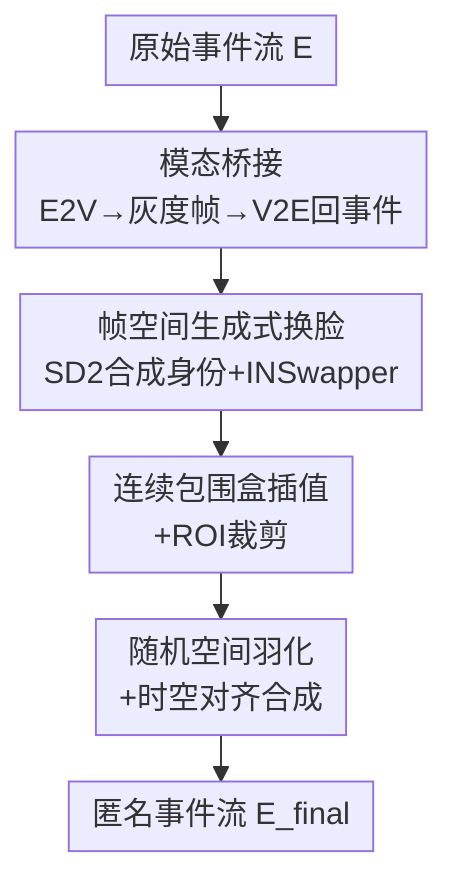

# Generative Anonymization in Event Streams

**会议**: CVPR 2026  
**arXiv**: [2604.12803](https://arxiv.org/abs/2604.12803)  
**代码**: https://github.com/muelleradam/KinematicEvent-HumanUpperBody-2026 (有，配套数据集)  
**领域**: 图像生成 / 隐私保护 / 神经形态视觉  
**关键词**: 事件相机, 生成式匿名化, 人脸替换, Event-to-Video, 效用-隐私权衡

## 一句话总结
针对"事件流被 E2V 重建模型反演出人脸身份"的隐私漏洞，本文提出首个面向事件流的**生成式匿名化**流水线：把异步事件投影成灰度帧、用现成的 RGB 人脸替换模型换成一张不存在的合成身份、再用 V2E 投回事件域，从而在彻底破坏原身份的同时保住下游感知所需的时空结构。

## 研究背景与动机
**领域现状**：事件相机（neuromorphic / event camera）以微秒级延迟、高动态范围、低功耗著称，正快速进入自动驾驶、机器人、智能监控等人本场景。长期以来人们有个"被动假设"——事件流只编码亮度变化的稀疏点云、不含绝对强度，因此不会泄露生物特征。

**现有痛点**：这个假设被深度学习打破。SOTA 的 Event-to-Video（E2V，如 E2VID/FireNet/ET-Net）能从原始事件流重建出高保真强度图像，等于把一段"看似无害"的事件流反演成清晰人脸，构成严重隐私漏洞。而现有事件隐私方法（空间打乱、对抗噪声、加密事件脉冲，如 EventAnon、AnonyNoise）是**破坏式混淆**：靠故意扰乱/位移事件坐标来防再识别，代价是破坏了原始数据的局部时空结构，让人脸表情识别、稠密追踪等细粒度任务严重掉点。

**核心矛盾**：破坏式混淆把"隐私"和"效用"对立起来——防住了重建，却也毁了数据。这正是 RGB 图像域早已用**生成式匿名化**（DeepPrivacy、CIAGAN、LDFA 等）解决的问题：把真人换成一张语义/姿态/视线都保留的合成假脸，既隐私又可用。但这些强生成先验只吃稠密同步的空间张量，无法原生处理异步稀疏的事件流。

**本文目标**：把生成式匿名化第一次引入事件域，在不破坏时空结构的前提下做到"换脸级"的身份替换。

**切入角度**：与其重新训练一个能直接吃异步事件的生成模型，不如**借道中间强度表示**——既然 E2V 能把事件转成帧、V2E 能把帧转回事件，那就在帧空间里复用成熟的 RGB 人脸替换模型，两头各做一次模态转换。

**核心 idea**：用"事件→强度帧→换脸→强度帧→事件"的桥接管线，把成熟的 RGB 生成式匿名化能力迁移到神经形态域。

## 方法详解

### 整体框架
整条流水线要解决的是"异步稀疏事件"与"标准空间生成模型"之间的模态鸿沟。做法是：先用 EVREAL 框架里的 E2V（FireNet）把原始事件流转成 $K$ 帧同步灰度图，在帧空间检测并替换人脸，再用 v2e 把匿名化后的帧投回事件域。难点在于后处理——投回来的合成人脸事件要精确地"贴"回原始背景事件流的对应时空位置，因此还需要连续包围盒插值、ROI 裁剪、羽化与时空对齐这套补偿机制，最终合成一条与原流时空结构一致、但人脸身份已被换掉的事件流。

### 关键设计

**1. 模态桥接：借中间强度表示打通事件↔生成模型**

痛点是异步事件 $E=\{e_i\}_{i=1}^N$（每个事件 $e_i=(x_i,y_i,t_i,p_i)$，含微秒时间戳和极性 $p_i\in\{-1,+1\}$）无法直接喂给只吃稠密空间张量的人脸生成模型。本文不去重训一个原生事件生成器，而是用 EVREAL 框架内的 E2V 把稀疏事件流转成 $K$ 张同步强度帧，在帧域完成所有生成操作，最后再用 v2e 把结果投回事件域。这一来一回把"成熟 RGB 换脸先验"和"神经形态数据"接上了，是整篇的总思路；代价是流水线非原生于事件域（作者在局限里明确承认），但换来的是可以直接复用业界最稳的换脸/超分组件

**2. 帧空间生成式换脸：换成一张不存在的人**

破坏式混淆之所以毁数据，是因为它靠"打乱真脸"防重建；生成式匿名化反过来——把真脸**整张换成一张合成的、世界上不存在的脸**，语义/姿态/表情都保留。具体在第 $k$ 帧检测人脸包围盒 $B_k=(x_{1,k},y_{1,k},x_{2,k},y_{2,k})$，用 Stable Diffusion 2（SD2）生成一个合成目标身份作为输入，再用开源的 INSwapper-128 人脸替换模型把原脸换掉。由于换脸先验分辨率受限，输出还经 FSRCNN 四倍超分、CLAHE 对比度均衡与反锐化掩模做空间精修，以保证投回事件域时有足够细节。这样当攻击者对成品流做 E2V 重建时，得到的是一张逼真但全新的身份，原主体被彻底保护

**3. 连续包围盒插值与 ROI 裁剪：把换脸事件精确切回微秒时间轴**

帧是离散的（时刻 $T_k$），但事件是微秒连续的，直接用离散包围盒去切事件会错位。本文用 1D 分段线性插值得到连续包围盒函数 $B(t)$：对任意落在 $T_k\le t_i<T_{k+1}$ 的事件，左上角 x 坐标按 $x_1(t_i)=x_{1,k}+\frac{x_{1,k+1}-x_{1,k}}{T_{k+1}-T_k}(t_i-T_k)$ 插值，$y_1,x_2,y_2$ 同理，从而在三维时空体里得到一个连续移动的包围盒。再据此把事件分两路：在框内的 $E_{ROI}=\{e_i\in E\,|\,x_1(t_i)\le x_i\le x_2(t_i)\wedge y_1(t_i)\le y_i\le y_2(t_i)\}$ 取出合成人脸事件，框外的 $E\setminus E_{ROI}$ 作为背景。这一步让"换脸"在微秒级时间分辨率上对得齐，是事件域区别于帧域匿名化的关键补偿

**4. 随机空间羽化与时空对齐合成：消掉拼接硬边、把合成脸贴回原位**

直接用二值阈值切割背景会在包围盒边缘留下生硬的人工边界。本文引入受高斯混合启发的**随机空间羽化**：框内事件不是全保留，而是按到包围盒边界 $\partial B(t_i)$ 的最短欧氏距离 $d$ 以半高斯概率衰减保留，$P(e_i\in E_{bg})=\exp\!\big(-d(e_i,\partial B(t_i))^2/2\sigma^2\big)$（框外事件概率为 1），$\sigma$ 控制过渡带宽度，从而在保留背景与被替换区之间形成平滑的事件密度梯度。随后做**时空对齐合成**：以包围盒中心为基准做动态仿射变换，把合成人脸事件 $E_{anon}$ 的坐标按 $x_i'=c_{tgt,x}(t_i)+\big(\frac{x_i-c_{anon,x}(t_i)}{w_{anon}(t_i)}\big)w_{tgt}(t_i)$（$y$ 同理）映射到目标 ROI，最后把映射后的填充事件与背景流合并、按时间排序得到最终流 $E_{final}=E_{bg}\cup E'_{anon}$

### 损失函数 / 训练策略
本文是**零训练的组合式推理流水线**，不训练任何新网络：E2V（FireNet）、换脸（INSwapper）、身份生成（SD2）、超分（FSRCNN）、V2E（v2e）全部用预训练模型直接拼装，没有端到端损失函数。这也是它区别于 EventAnon/AnonyNoise（联合优化混淆+下游任务）的工程取向——靠成熟组件的组合而非重新训练来实现匿名化。

## 实验关键数据

### 主实验
在自采的同步 RGB-事件数据集上评测，E2V 用 FireNet，换脸用 INSwapper-128 + SD2。匿名化效果与特征保留（image space）：

| 指标 | 匿名化（源→合成） | Reference（同主体两次独立采集） | 解读 |
|------|------|------|------|
| Identity Similarity ↓ | **0.118** | 0.713 | 身份相似度从 0.713 暴跌到 0.118，原身份被有效抹除 |
| Temporal Stability ↑ | 0.770 | 0.760 | 合成身份跨帧几乎不抖动，与自然变化持平 |
| Pose Error ↓ / ° | 3.304 | 2.613 | 头部姿态高度保留（参照系是两次独立录制的天然差异） |
| Mimicry Error ↓ | **0.181** | 0.239 | 表情迁移误差甚至小于同主体两次采集的自然差异 |

事件域结构匿名化（Tab. 3）：STCD 从 Reference 的 0.0099 升到 0.3143（>31 倍），EMD 从 0.0085 升到 0.1276——表明合成人脸在事件空间产生了截然不同的 3D 结构拓扑，全局分布发生明显偏移。

### 下游任务（效用保留）

| 指标 | 匿名化 | 基线/参照 | 说明 |
|------|------|------|------|
| YOLO 置信度 ↑ | 0.894 | 0.937 | 帧域人脸检测置信度基本不掉 |
| YOLO IoU ↑ | 0.960 | — | 检测框与基线高度对齐 |
| YOLO 检测率误差 ↓ | 0.000 | — | 匿名化对整体检测召回**零退化** |
| Event IoU ↑ | 0.702 | — | 事件域检测框仍较好对齐，时空结构保留 |

### 关键发现
- **隐私与效用同时拿下**：Identity Similarity 跌 6 倍、STCD 涨 31 倍说明身份被换得很彻底；同时 YOLO 检测率误差为 0、IoU 0.960、表情误差 0.181 说明下游可用性几乎无损——直接打破破坏式混淆的效用-隐私权衡。
- **表情误差比自然变化还小**（0.181 < 0.239）：说明生成管线忠实迁移了源表情，没有引入额外合成偏差，这是"生成式"相对"扰乱式"的核心红利。
- **V2E 反投影的事件密度是成败关键**：作者发现回投时若局部事件密度不足，下游 E2V 重建会出现严重涂抹（smearing）和结构退化；定性结果里也能看到合成脸周围有黑色涂抹伪影，源于不完美的时空合并。

## 亮点与洞察
- **"借道帧空间复用成熟先验"是最聪明的一招**：与其硬训一个吃异步事件的生成器，不如用 E2V/V2E 当桥，把整个 RGB 换脸生态（SD2+INSwapper+FSRCNN）零成本搬到事件域——工程上极务实，也直接决定了方法能在 CVPR 级别 benchmark 上跑通。
- **连续包围盒插值 + 半高斯羽化**是事件域特有的细活：因为事件是微秒连续的点云，离散帧的框必须插值到任意时刻、拼接边界必须概率化羽化，否则会留硬边和错位——这套补偿机制可迁移到任何"帧域处理后要投回事件域"的任务（如事件去噪、事件编辑）。
- **提出 STCD/EMD 两个事件域结构度量**：把事件流当 3D 点云，用时空 Chamfer 距离（KD-Tree）+ 切片 Wasserstein 近似的 Event Mover's Distance 来量化结构偏移，填补了"如何在事件空间评估匿名化"的工具空白。
- **配套真实数据集设计巧妙**：把传感器装在协作机器人（cobot）上跑预编程轨迹，让受试者读短文诱发微表情/唇动但不产生大幅身体运动——干净地解耦了相机运动与人体运动，专门用来评测时空结构完整性。

## 局限与展望
- **依赖帧中间表示，非原生事件操作**（作者承认）：管线把异步事件转成离散灰度帧再处理，没有直接在原始事件脉冲上做身份替换；开发一个能在异步神经形态数据上原生换脸的时空生成模型仍是开放难题。
- **V2E 模拟器约束与密度伪影**：回投质量受 v2e 模拟器限制，密度不足会在被替换的人脸区域产生离散化/涂抹伪影（Fig. 3 显示伪影只出现在信息被替换的人脸区域），定性结果也能看到合成脸周边的黑色涂抹。
- **评测规模与对比偏弱**：主要在自采数据集上验证，且 Pose/Mimicry 的"参照系"是同主体两次独立录制的自然差异，缺少与 EventAnon/AnonyNoise 等破坏式方法在同一下游任务上的直接定量对比，"零退化"结论的普适性还需更多场景检验。
- **改进思路**：可探索在 V2E 阶段做密度感知的事件补全以消除涂抹；或把换脸约束直接嵌入 E2V/V2E 的可微管线，朝端到端、原生事件域的生成式匿名化推进。

## 相关工作与启发
- **vs EventAnon / AnonyNoise（破坏式混淆）**：它们靠对原始事件注入可学习噪声/打乱坐标来防再识别，本文换成"整张合成假脸替换"。区别在于前者破坏时空结构（细粒度任务掉点），本文保留结构（YOLO 检测率零退化、表情误差更小）——这是效用-隐私权衡的根本解法差异。
- **vs E2PRIV**：E2PRIV 把失真匿名化嵌进 E2V 重建过程、不改原始事件流，因此对直接在事件空间作恶的攻击者毫无保护；本文直接改写事件流本身，提供事件域原生的防护。
- **vs LDFA / DeepPrivacy / CIAGAN（RGB 生成式匿名化）**：本文把这套帧域成熟范式整体迁移到事件域，核心增量是补上了"事件↔帧"的模态桥接与微秒级时空对齐合成，让强生成先验得以服务于异步稀疏数据。

## 评分
- 新颖性: ⭐⭐⭐⭐⭐ 首个事件流生成式匿名化框架，并提出 STCD/EMD 事件域结构度量与配套 cobot 真实数据集
- 实验充分度: ⭐⭐⭐⭐ 隐私/效用/度量三维度评测扎实，但缺与破坏式 SOTA 的同任务直接对比，规模偏小
- 写作质量: ⭐⭐⭐⭐ 动机链条清晰、公式完整，管线与度量定义讲得透
- 价值: ⭐⭐⭐⭐⭐ 直击神经形态传感器落地的隐私合规痛点，工程范式可直接复用

<!-- RELATED:START -->

## 相关论文

- [\[CVPR 2026\] Texvent: Asynchronous Event Data Simulation via Text Prompt](texvent_asynchronous_event_data_simulation_via_text_prompt.md)
- [\[CVPR 2026\] Exploring Spatial Intelligence from a Generative Perspective](exploring_spatial_intelligence_from_a_generative_perspective.md)
- [\[CVPR 2026\] gQIR: Generative Quanta Image Reconstruction](gqir_generative_quanta_image_reconstruc_tion.md)
- [\[CVPR 2026\] Efficient Weighted Sampling via Score-based Generative Models](efficient_weighted_sampling_via_score-based_generative_models.md)
- [\[CVPR 2026\] Transition Models: Rethinking the Generative Learning Objective](transition_models_rethinking_the_generative_learning_objective.md)

<!-- RELATED:END -->
